1
|     | A Survey |     |     | of  | Deep |     | Reinforcement |     |     |     | Learning |     |     | in  | Video |     |
| --- | -------- | --- | --- | --- | ---- | --- | ------------- | --- | --- | --- | -------- | --- | --- | --- | ----- | --- |
Games
Kun Shao, Zhentao Tang, Yuanheng Zhu, Member, IEEE, Nannan Li, and Dongbin Zhao, Fellow, IEEE
Abstract—Deepreinforcementlearning(DRL)hasmadegreat of representation learning, the whole system has successfully
|     | achievements | since | proposed. |     | Generally, | DRL | agents | receive |         |             |       |       |      |      |        |           |
| --- | ------------ | ----- | --------- | --- | ---------- | --- | ------ | ------- | ------- | ----------- | ----- | ----- | ---- | ---- | ------ | --------- |
|     |              |       |           |     |            |     |        |         | modeled | large-scale | state | space | with | deep | neural | networks. |
high-dimensionalinputsateachstep,andmakeactionsaccording
|                                          |                              |            |     |          |           |        |          |            | The second | challenge  | is      | that learning |             | proper | policies      | to make |
| ---------------------------------------- | ---------------------------- | ---------- | --- | -------- | --------- | ------ | -------- | ---------- | ---------- | ---------- | ------- | ------------- | ----------- | ------ | ------------- | ------- |
| 9102 ceD 62  ]AM.sc[  2v44901.2191:viXra | to deep-neural-network-based |            |     |          | policies. | This   | learning | mechanism  |            |            |         |               |             |        |               |         |
|                                          |                              |            |     |          |           |        |          |            | decisions  | in dynamic | unknown |               | environment |        | is difficult. | For     |
|                                          | updates                      | the policy | to  | maximize | the       | return | with     | an end-to- |            |            |         |               |             |        |               |         |
end method. In this paper, we survey the progress of DRL this problem, data-driven methods, such as supervised learn-
methods,includingvalue-based,policygradient,andmodel-based ing and reinforcement learning (RL), are feasible solutions.
|     | algorithms, | and       | compare | their     | main      | techniques | and          | properties.    |           |           |           |           |               |      |                 |          |
| --- | ----------- | --------- | ------- | --------- | --------- | ---------- | ------------ | -------------- | --------- | --------- | --------- | --------- | ------------- | ---- | --------------- | -------- |
|     |             |           |         |           |           |            |              |                | The third | challenge | is        | that the  | vast majority |      | of game         | AI is    |
|     | Besides,    | DRL plays | an      | important | role      | in         | game         | artificial in- |           |           |           |           |               |      |                 |          |
|     |             |           |         |           |           |            |              |                | developed | in a      | specified | virtual   | environment.  |      | How to          | transfer |
|     | telligence  | (AI).     | We also | take      | a review  | of the     | achievements |                | of        |           |           |           |               |      |                 |          |
|     |             |           |         |           |           |            |              |                | the AI’s  | ability   | among     | different | games         | is a | core challenge. | A        |
|     | DRL in      | various   | video   | games,    | including | classical  | Arcade       | games,         |           |           |           |           |               |      |                 |          |
first-personperspectivegamesandmulti-agentreal-timestrategy more general learning system is also necessary.
|     | games, from | 2D     | to 3D,   | and  | from single-agent |      | to       | multi-agent. |     |     |     |     |     |     |     |     |
| --- | ----------- | ------ | -------- | ---- | ----------------- | ---- | -------- | ------------ | --- | --- | --- | --- | --- | --- | --- | --- |
|     | A large     | number | of video | game | AIs               | with | DRL have | achieved     |     |     |     |     |     |     |     |     |
Foralongtime,solvingthesechallengeswithreinforcement
|     | super-human | performance, |            | while | there | are     | still some | challenges |             |           |      |         |          |            |        |          |
| --- | ----------- | ------------ | ---------- | ----- | ----- | ------- | ---------- | ---------- | ----------- | --------- | ---- | ------- | -------- | ---------- | ------ | -------- |
|     |             |              |            |       |       |         |            |            | learning    | is widely | used | in game | AI.      | And        | in the | last few |
|     | in this     | domain.      | Therefore, | we    | also  | discuss | some       | key points |             |           |      |         |          |            |        |          |
|     |             |              |            |       |       |         |            |            | years, deep | learning  | (DL) | has     | achieved | remarkable |        | perfor-  |
whenapplyingDRLmethodstothisfield,includingexploration-
exploitation,sampleefficiency,generalizationandtransfer,multi- mance in computer vision and natural language processing
agent learning, imperfect information, and delayed spare re- [2]. The combination, deep reinforcement learning (DRL),
wards, as well as some research directions. teaches agents to make decisions in high-dimensional state
Index Terms—reinforcement learning, deep learning, deep space in an end-to-end framework, and dramatically improves
reinforcement learning, game AI, video games. thegeneralizationandscalabilityoftraditionalRLalgorithms.
|     |     |     |     |     |     |     |     |     | Especially, | DRL | has made | great | progress |     | in video | games, |
| --- | --- | --- | --- | --- | --- | --- | --- | --- | ----------- | --- | -------- | ----- | -------- | --- | -------- | ------ |
includingAtari,ViZDoom,StarCraft,Dota2,andsoon.There
|     |     |     | I.  | INTRODUCTION |     |     |     |     |     |     |     |     |     |     |     |     |
| --- | --- | --- | --- | ------------ | --- | --- | --- | --- | --- | --- | --- | --- | --- | --- | --- | --- |
aresomerelatedworkstointroducetheseachievementsinthis
ARTIFICIAL
|     |     |     | intelligence |     | (AI) | in video | games | is a long- |     |     |     |     |     |     |     |     |
| --- | --- | --- | ------------ | --- | ---- | -------- | ----- | ---------- | --- | --- | --- | --- | --- | --- | --- | --- |
field.Zhaoetal.[3]andTangetal.[4]surveythedevelopment
|     | standing |            | research    | area. | It studies  | how | to use | AI tech- |          |           |             |          |         |         |          |       |
| --- | -------- | ---------- | ----------- | ----- | ----------- | --- | ------ | -------- | -------- | --------- | ----------- | -------- | ------- | ------- | -------- | ----- |
|     |          |            |             |       |             |     |        |          | of DRL   | research, | and focus   | on       | AlphaGo | and     | AlphaGo  | Zero. |
|     | nologies | to achieve | human-level |       | performance |     | when   | playing  |          |           |             |          |         |         |          |       |
|     |          |            |             |       |             |     |        |          | Justesen | et al.    | [5] reviews | DL-based |         | methods | in video | game  |
games.Moregenerally,itstudiesthecomplexinteractionsbe-
|     |              |              |         |               |     |               |           |              | play, including    |           | supervised  | learning,    |            | unsupervised |             | learning,  |
| --- | ------------ | ------------ | ------- | ------------- | --- | ------------- | --------- | ------------ | ------------------ | --------- | ----------- | ------------ | ---------- | ------------ | ----------- | ---------- |
|     | tween agents | and          | game    | environments. |     | Various       | games     | provide      |                    |           |             |              |            |              |             |            |
|     |              |              |         |               |     |               |           |              | reinforcement      |           | learning,   | evolutionary |            | approaches,  |             | and some   |
|     | interesting  | and          | complex | problems      | for | agents        | to solve, | making       |                    |           |             |              |            |              |             |            |
|     |              |              |         |               |     |               |           |              | hybrid approaches. |           | Arulkumaran |              | et al.     | [6] make     | a brief     | intro-     |
|     | video games  | perfect      |         | environments  |     | for AI        | research. | These        |                    |           |             |              |            |              |             |            |
|     |              |              |         |               |     |               |           |              | duction            | of DRL,   | covering    | central      | algorithms |              | and         | presenting |
|     | virtual      | environments |         | are safe      | and | controllable. |           | In addition, |                    |           |             |              |            |              |             |            |
|     |              |              |         |               |     |               |           |              | a range            | of visual | RL domains. |              | Li [7]     | gives        | an overview | of         |
thesegameenvironmentsprovideinfinitesupplyofusefuldata
|     |     |     |     |     |     |     |     |     | recent achievements |     | of  | DRL, | and discusses |     | core | elements, |
| --- | --- | --- | --- | --- | --- | --- | --- | --- | ------------------- | --- | --- | ---- | ------------- | --- | ---- | --------- |
formachinelearningalgorithms,andtheyaremuchfasterthan
importantmechanisms,andvariousapplications.Inthispaper,
|     | real-time.          | These     | characteristics |           | make          | games      | the            | unique and |                      |              |              |               |             |               |             |          |
| --- | ------------------- | --------- | --------------- | --------- | ------------- | ---------- | -------------- | ---------- | -------------------- | ------------ | ------------ | ------------- | ----------- | ------------- | ----------- | -------- |
|     |                     |           |                 |           |               |            |                |            | we focus             | on DRL-based |              | game          | AI, from    | 2D            | to 3D,      | and from |
|     | favorite            | domain    | for AI          | research. | On            | the        | other side,    | AI has     |                      |              |              |               |             |               |             |          |
|     |                     |           |                 |           |               |            |                |            | single-agent         | to           | multi-agent. | The           | main        | contributions |             | include  |
|     | been helping        | games     | to              | become    | better        | in         | the way        | we play,   |                      |              |              |               |             |               |             |          |
|     |                     |           |                 |           |               |            |                |            | the comprehensive    |              | and          | detailed      | comparisons |               | of various  | DRL      |
|     | understand          | and       | design          | them      | [1].          |            |                |            |                      |              |              |               |             |               |             |          |
|     |                     |           |                 |           |               |            |                |            | methods,             | their        | techniques,  | properties,   |             | and the       | impressive  | and      |
|     | Broadly             | speaking, |                 | game      | AI involves   |            | the perception | and        |                      |              |              |               |             |               |             |          |
|     |                     |           |                 |           |               |            |                |            | diverse performances |              | in           | these         | given video | games.        |             |          |
|     | the decision-making |           | in              | game      | environments. |            | With           | these com- |                      |              |              |               |             |               |             |          |
|     | ponents,            | there     | are some        | crucial   |               | challenges | and            | proposed   |                      |              |              |               |             |               |             |          |
|     |                     |           |                 |           |               |            |                |            | The organization     |              | of           | the remaining |             | paper         | is arranged | as       |
|     | solutions.          | The       | first challenge |           | is that       | the        | state space    | of the     |                      |              |              |               |             |               |             |          |
follows.InSectionII,weintroducethebackgroundofDLand
gameisverylarge,especiallyinstrategicgames.Withtherise
RL.InSectionIII,wefocusonrecentDRLmethods,including
|     |          |          |         |        |        |      |          |               | value-based, | policy | gradient, | and | model-based |     | DRL | methods. |
| --- | -------- | -------- | ------- | ------ | ------ | ---- | -------- | ------------- | ------------ | ------ | --------- | --- | ----------- | --- | --- | -------- |
|     | K. Shao, | Z. Tang, | Y. Zhu, | N. Li, | and D. | Zhao | are with | the State Key |              |        |           |     |             |     |     |          |
LaboratoryofManagementandControlforComplexSystems,InstituteofAu-
|     |     |     |     |     |     |     |     |     | After that, | we  | make a brief | introduction |     | of research |     | platforms |
| --- | --- | --- | --- | --- | --- | --- | --- | --- | ----------- | --- | ------------ | ------------ | --- | ----------- | --- | --------- |
tomation,ChineseAcademyofSciences.Beijing100190,China.Theyarealso
|     |     |     |     |     |     |     |     |     | and competitions, |     | and present |     | performances |     | of DRL | methods |
| --- | --- | --- | --- | --- | --- | --- | --- | --- | ----------------- | --- | ----------- | --- | ------------ | --- | ------ | ------- |
withtheUniversityofChineseAcademyofSciences,Beijing,China(e-mail:
inclassicalsingle-agentArcadegames,first-personperspective
|     | shaokun2014@ia.ac.cn; |     | tangzhentao2016@ia.ac.cn; |     |     |     | yuanheng.zhu@ia.ac.cn; |     |     |     |     |     |     |     |     |     |
| --- | --------------------- | --- | ------------------------- | --- | --- | --- | ---------------------- | --- | --- | --- | --- | --- | --- | --- | --- | --- |
linannan2017@ia.ac.cn,dongbin.zhao@ia.ac.cn). games, and multi-agent real-time strategy games. In Section
|     | This work    | is supported |        | by National  | Natural |              | Science     | Foundation | of            |      |     |        |              |     |            |         |
| --- | ------------ | ------------ | ------ | ------------ | ------- | ------------ | ----------- | ---------- | ------------- | ---- | --- | ------ | ------------ | --- | ---------- | ------- |
|     |              |              |        |              |         |              |             |            | V, we discuss | some | key | points | and research |     | directions | in this |
|     | China (NSFC) | under        | Grants | No.61573353, |         | No.61603382, | No.6180337, | and        |               |      |     |        |              |     |            |         |
No.61533017. field. In the end, we draw a conclusion of this survey.

2
Actions
Value-based
Video
Policy gradient
|     |     |     |     |     |     | Games |     | Rewards |     |     |     |     |     |     |
| --- | --- | --- | --- | --- | --- | ----- | --- | ------- | --- | --- | --- | --- | --- | --- |
Model-based
API
etc…
|     |     |     | Environments |     |     |     |     |     |     | RL  Agents |     |     |     |     |
| --- | --- | --- | ------------ | --- | --- | --- | --- | --- | --- | ---------- | --- | --- | --- | --- |
CNN, LSTM, etc…
|     |     |     |     |     |     | States |     |     | Features |     |     |     |     |     |
| --- | --- | --- | --- | --- | --- | ------ | --- | --- | -------- | --- | --- | --- | --- | --- |
Fig. 1. Theframework diagramof the typicalDRL forvideo games.The deeplearning model takesinput fromvideo gamesAPI, and extractmeaningful
featuresautomatically.DRLagentsproducesactionsbasedonthesefeatures,andmaketheenvironmentstransfertonextstate.
|     |     | II. | BACKGROUND |     |     |     |     | B. Reinforcement | learning |     |     |     |     |     |
| --- | --- | --- | ---------- | --- | --- | --- | --- | ---------------- | -------- | --- | --- | --- | --- | --- |
Reinforcementlearningisakindofmachinelearningmeth-
| Generally | speaking, |     | training | an agent | to  | make | decisions |           |              |             |        |     |           |       |
| --------- | --------- | --- | -------- | -------- | --- | ---- | --------- | --------- | ------------ | ----------- | ------ | --- | --------- | ----- |
|           |           |     |          |          |     |      |           | ods where | agents learn | the optimal | policy | by  | trial and | error |
withhigh-dimensionalinputsisdifficult.Withthedevelopment
|         |           |             |     |           |        |          |     | [12]. By interacting | with | the | environment, |     | RL can | be suc- |
| ------- | --------- | ----------- | --- | --------- | ------ | -------- | --- | -------------------- | ---- | --- | ------------ | --- | ------ | ------- |
| of deep | learning, | researchers |     | take deep | neural | networks | as  |                      |      |     |              |     |        |         |
cessfullyappliedtosequentialdecision-makingtasks.Consid-
| function      | approximations, |       | and         | use plenty | of      | samples | to opti-   |                    |                   |         |                   |        |               |       |
| ------------- | --------------- | ----- | ----------- | ---------- | ------- | ------- | ---------- | ------------------ | ----------------- | ------- | ----------------- | ------ | ------------- | ----- |
|               |                 |       |             |            |         |         |            | ering a discounted | episodic          | Markov  | decision          |        | process       | (MDP) |
| mize policies | successfully.   |       | The         | framework  | diagram |         | of typical |                    |                   |         |                   |        |               |       |
|               |                 |       |             |            |         |         |            | (S,A,γ,P,r),       | the agent         | chooses | an                | action | a t according | to    |
| DRL for       | video           | games | is depicted | in         | Fig. 1. |         |            |                    |                   |         |                   |        |               |       |
|               |                 |       |             |            |         |         |            | the policy         | π(a |s ) at state | s       | . The environment |        | receives      | the   |
|               |                 |       |             |            |         |         |            |                    | t t               | t       |                   |        |               |       |
r
|     |     |     |     |     |     |     |     | action, produces | a reward    | t+1        | and transfers |       | to the next | state    |
| --- | --- | --- | --- | --- | --- | --- | --- | ---------------- | ----------- | ---------- | ------------- | ----- | ----------- | -------- |
|     |     |     |     |     |     |     |     | s according      | to the      | transition | probability   |       | P(s         | |s ,a ). |
|     |     |     |     |     |     |     |     | t+1              |             |            |               |       | t+1         | t t      |
|     |     |     |     |     |     |     |     | This transition  | probability | is         | unknown       | in RL | domain.     | The      |
A. Deep learning
|     |     |     |     |     |     |     |     | process continues | until | the agent | reaches | a terminal | state | or a |
| --- | --- | --- | --- | --- | --- | --- | --- | ----------------- | ----- | --------- | ------- | ---------- | ----- | ---- |
Deep learning comes from artificial neural networks, and maximumtimestep.Theobjectiveistomaximizetheexpected
is used to learn data representation. It is inspired by the discounted cumulative rewards
theoryofbraindevelopment,andcanbelearnedinsupervised
∞
learning, unsupervised learning and semi-supervised learning. (cid:88)
|     |     |     |     |     |     |     |     |     | E [R | ]=E | [ γir | ],  |     | (1) |
| --- | --- | --- | --- | --- | --- | --- | --- | --- | ---- | --- | ----- | --- | --- | --- |
Although the term deep learning is introduced in 1986 [8], π t π t+i
i=0
| deep learning | has         | a winter | time      | because  | of  | lacking   | data and |                |        |          |         |     |     |     |
| ------------- | ----------- | -------- | --------- | -------- | --- | --------- | -------- | -------------- | ------ | -------- | ------- | --- | --- | --- |
| incapable     | computation |          | hardware. | However, |     | with more | and      |                |        |          |         |     |     |     |
|               |             |          |           |          |     |           |          | where γ ∈(0,1] | is the | discount | factor. |     |     |     |
morelarge-scaledatasetsbeingreleased,andcapablehardware
|                  |     |       |            |         |     |         |     | Reinforcement      | learning   | can | be devided    | into | off-policy | and      |
| ---------------- | --- | ----- | ---------- | ------- | --- | ------- | --- | ------------------ | ---------- | --- | ------------- | ---- | ---------- | -------- |
| being available, |     | a big | revolution | happens | in  | DL [9]. |     |                    |            |     |               |      |            |          |
|                  |     |       |            |         |     |         |     | on-policy methods. | Off-policy |     | RL algorithms |      | mean       | that the |
Convolutional neural network (CNN) [10] is a class of behaviorpolicyusedforselectingactionsisdifferentfromthe
| deep neural | networks, |     | which | is widely | applied | to  | computer |                  |        |           |          |        |     |          |
| ----------- | --------- | --- | ----- | --------- | ------- | --- | -------- | ---------------- | ------ | --------- | -------- | ------ | --- | -------- |
|             |           |     |       |           |         |     |          | learning policy. | On the | contrary, | behavior | policy | is  | the same |
vision. CNN is inspired by biological processes, and is with the learning policy in on-policy RL algorithms. Besides,
shiftinvariantbasedonshared-weightsarchitecture.Recurrent reinforcement learning can also be devided into value-based
| Neural Network |     | (RNN) | is another | kind | of  | deep nerial | net- |                  |          |     |             |     |        |        |
| -------------- | --- | ----- | ---------- | ---- | --- | ----------- | ---- | ---------------- | -------- | --- | ----------- | --- | ------ | ------ |
|                |     |       |            |      |     |             |      | and policy-based | methods. | In  | value-based | RL, | agents | update |
work, especially for natural language processing. As a special the value function to learn suitable policy, while policy-based
| kind of       | RNN,        | Long      | Short   | Term Memory   |      | (LSTM)  | [11]     | is          |                  |            |             |     |         |     |
| ------------- | ----------- | --------- | ------- | ------------- | ---- | ------- | -------- | ----------- | ---------------- | ---------- | ----------- | --- | ------- | --- |
|               |             |           |         |               |      |         |          | RL agents   | learn the policy | directly.  |             |     |         |     |
| capable       | of learning | long-term |         | dependencies. |      | Deep    | learning |             |                  |            |             |     |         |     |
|               |             |           |         |               |      |         |          | Q-learning  | is a typical     | off-policy | value-based |     | method. | The |
| architectures | have        | been      | applied | into          | many | fields, | and have |             |                  |            |             |     |         |     |
|               |             |           |         |               |      |         |          | update rule | of Q-learning    | is         |             |     |         |     |
achievedsignificantsuccesses,suchasspeechrecognition,im-
| age classification |     | and segmentation, |     | semantic |     | comprehension, |     |        |                 |     |             |     |           |      |
| ------------------ | --- | ----------------- | --- | -------- | --- | -------------- | --- | ------ | --------------- | --- | ----------- | --- | --------- | ---- |
|                    |     |                   |     |          |     |                |     | δ t =r | t+1 +γargmaxQ(s |     | t+1 ,a)−Q(s |     | t ,a t ), | (2a) |
and machine translation [2]. DL-based methods with efficient a
parallel distributed computing resources can break the limit Q(s ,a )←Q(s ,a )+αδ . (2b)
|     |     |     |     |     |     |     |     |     | t   | t   | t t | t   |     |     |
| --- | --- | --- | --- | --- | --- | --- | --- | --- | --- | --- | --- | --- | --- | --- |
oftraditionalmachinelearningmethods.Thismethodinspires
scientists and researchers to achieve more and more state-of- δ is the temporal difference (TD) error, and α is the learning
t
| the-art performance |     | in  | respective | fields. |     |     |     | rate. |     |     |     |     |     |     |
| ------------------- | --- | --- | ---------- | ------- | --- | --- | --- | ----- | --- | --- | --- | --- | --- | --- |

3
| (a) |     | (b) |     |     | (c) |     | (d) |     |     |     |     | (e) |     |     |     |
| --- | --- | --- | --- | --- | --- | --- | --- | --- | --- | --- | --- | --- | --- | --- | --- |
Fig.2. ThenetworkarchitecturesoftypicalDRLmethods,withincreasedcomplexityandperformance.(a):DQNnetwork;(b)DuelingDQNnetwork;(c):
DRQNnetwork;(d):Actor-criticnetwork;(e):Reactornetwork.
Policy gradient [13] parameterizes the policy and updates much better performance. Prioritized experience replay [16]
parameters θ. In its general form, the objective function of helps prioritize experience to replay important transitions
policy gradient is defined as more frequently. The sample probability of transition i as
|     |     |          |     |     |     |     | P (i | )=       | p α , w | h e re p | i s t he | p ri o r it y | o f tr a ns | it i o n i . D | u eli n g |
| --- | --- | -------- | --- | --- | --- | --- | ---- | -------- | ------- | -------- | -------- | ------------- | ----------- | -------------- | --------- |
|     |     | ∞        |     |     |     |     |      | (cid:80) | i α     |          | i        |               |             |                |           |
|     |     | (cid:88) |     |     |     |     |      |          | k p kse |          |          |               |             |                |           |
J(θ)=E [ logπ (a |s )R]. (3) DQ N [1 7] u s t h e d u el i n g ne u r a l n e tw o r k a r c h it e c tu re f o r
|     |     | π   | θ   | t t |     |     |            |     |      |             |     |          |             |     |         |
| --- | --- | --- | --- | --- | --- | --- | ---------- | --- | ---- | ----------- | --- | -------- | ----------- | --- | ------- |
|     |     |     |     |     |     |     | model-free |     | DRL. | It includes | two | separate | estimators: |     | one for |
t=0
R is the total accumulated return. state value function V(s;θ,β) and the other for advantage
|     |     |     |     |     |     |     | function | A(s,a;θ,α), |     | as  | shown | in Fig. | 2(b). |     |     |
| --- | --- | --- | --- | --- | --- | --- | -------- | ----------- | --- | --- | ----- | ------- | ----- | --- | --- |
Actor-critic[12]reinforcementlearningimprovesthepolicy
| gradient | with an value-based |     | critic |     |     |     |     |                                   |     |     |     |     |     |     |     |
| -------- | ------------------- | --- | ------ | --- | --- | --- | --- | --------------------------------- | --- | --- | --- | --- | --- | --- | --- |
|          |                     |     |        |     |     |     |     | Q(s,a:θ,α,β)=V(s;θ,β)+A(s,a;θ,α). |     |     |     |     |     |     | (7) |
∞
(cid:88)
|     | J(θ)=E | [   | Ψ logπ | (a  | |s )]. | (4) |     |     |     |     |     |     |     |     |     |
| --- | ------ | --- | ------ | --- | ------ | --- | --- | --- | --- | --- | --- | --- | --- | --- | --- |
π t θ t t Pop-Art [18] is proposed to adapt to different and non-
t=0
|     |     |     |     |     |     |     | stationary |     | target magnitudes, |     |     | which successfully |     | replaces | the |
| --- | --- | --- | --- | --- | --- | --- | ---------- | --- | ------------------ | --- | --- | ------------------ | --- | -------- | --- |
Ψ t is the critic, which can be the state-action value function clipping of rewards as done in DQN to handle various mag-
Qπ(s ,a ), the advantage function Aπ(s ,a )=Qπ(s ,a )− nitudes of targets. Fast reward propagation [19] is a novel
| t t       |              |         |     | t      | t   | t t |     |     |     |     |     |     |     |     |     |
| --------- | ------------ | ------- | --- | ------ | --- | --- | --- | --- | --- | --- | --- | --- | --- | --- | --- |
| Vπ(s ) or | the TD error | r +Vπ(s |     | )−Vπ(s | ).  |     |     |     |     |     |     |     |     |     |     |
t t t+1 t trainingalgorithmforreinforcementlearning,whichcombines
|     |     |     |     |     |     |     | the        | strength | of DQN, | and | exploits   | longer | state-transitions |     | in   |
| --- | --- | --- | --- | --- | --- | --- | ---------- | -------- | ------- | --- | ---------- | ------ | ----------------- | --- | ---- |
|     |     |     |     |     |     |     | experience |          | replays | by  | tightening | the    | optimization      | via | con- |
III. DEEPREINFORCEMENTLEARNING
|              |               |             |             |          |           |           | straints.     | This        | novel            | technique    |               | makes        | DRL      | more practical     |       |
| ------------ | ------------- | ----------- | ----------- | -------- | --------- | --------- | ------------- | ----------- | ---------------- | ------------ | ------------- | ------------ | -------- | ------------------ | ----- |
| DRL makes    | a combination |             | of DL       | and RL,  | achieving | rapid     |               |             |                  |              |               |              |          |                    |       |
|              |               |             |             |          |           |           | by            | drastically | reducing         |              | training      | time.        | Gorila   | [20] is the        | first |
| developments | since         | proposed.   | This        | section  | will      | introduce |               |             |                  |              |               |              |          |                    |       |
|              |               |             |             |          |           |           | massively     |             | distributed      | architecture |               | for          | DRL.     | This architecture  |       |
| various DRL  | methods,      | including   | value-based |          | methods,  | policy    |               |             |                  |              |               |              |          |                    |       |
|              |               |             |             |          |           |           | uses          | four        | main components: |              | parallel      | actors;      |          | parallel learners; |       |
| gradient     | methods, and  | model-based |             | methods. |           |           |               |             |                  |              |               |              |          |                    |       |
|              |               |             |             |          |           |           | a distributed |             | neural           | network      |               | to represent | the      | value function     |       |
|              |               |             |             |          |           |           | or behavior   |             | policy;          | and          | a distributed |              | store of | experience.        | To    |
A. Value-based DRL methods address the limited memory and imperfect game information
Deep Q-network (DQN) [14] is the most famous DRL at each decision point, Deep Recurrent Q-Network (DRQN)
model which learns policies directly from high-dimensional [21] replaces the first fully-connected layer with a recurrent
|            |              |         |             |     |         |          | neural | network | in  | DQN, | as shown | in  | Fig. 2(c). |     |     |
| ---------- | ------------ | ------- | ----------- | --- | ------- | -------- | ------ | ------- | --- | ---- | -------- | --- | ---------- | --- | --- |
| inputs. It | receives raw | pixels, | and outputs |     | a value | function | to     |         |     |      |          |     |            |     |     |
estimate future rewards, as shown in Fig. 2(a). DQN uses the Generally, DQN learns rich domain representations and
experiencereplaymethodtobreakthesamplecorrelation,and approximates the value function with deep neural networks,
stabilizes the learning process with a target Q-network. The while batch RL algorithms with linear representations are
loss function at iteration i is morestableandrequirelesshyperparametertuning.TheLeast
|     |     |     |     |     |     |     | Squares | DQN | (LS-DQN) |     | [22] | combines | DQN’s | rich | feature |
| --- | --- | --- | --- | --- | --- | --- | ------- | --- | -------- | --- | ---- | -------- | ----- | ---- | ------- |
[(yDQN
| L (θ | )=E |     |     | −Q(s,a;θ |     | ))2], (5) |     |     |     |     |     |     |     |     |     |
| ---- | --- | --- | --- | -------- | --- | --------- | --- | --- | --- | --- | --- | --- | --- | --- | --- |
i i (s,a,r,s(cid:48))∼U(D) i i representations with the stability of a linear least squares
|     |     |     |     |     |     |     | method. | In  | order | to reduce | approximation |     | error | variance | in  |
| --- | --- | --- | --- | --- | --- | --- | ------- | --- | ----- | --------- | ------------- | --- | ----- | -------- | --- |
with
yDQN =r+γmaxQ(s(cid:48),a(cid:48);θ −). (6) DQNs target values, averaged-DQN [23] averages previous
|     | i   |     |     |     | i   |     |     |     |     |     |     |     |     |     |     |
| --- | --- | --- | --- | --- | --- | --- | --- | --- | --- | --- | --- | --- | --- | --- | --- |
a(cid:48) Q-values estimates, leading to a more stable training and
DQN bridges the gap between high-dimensional visual improvedperformance.DeepQ-learningfromDemonstrations
inputsandactions.Afterthat,researchershaveimprovedDQN (DQfD) [24] combines DQN with human demonstrations,
in different aspects. Double DQN [15] introduces double Q- which improves the sample efficiency greatly. DQV [25] uses
learning to reduce observed overestimations, and it leads to TD learning to train a Value neural network, and uses this

4
network to train a second Quality-value network to esti- including value function replay, reward prediction, and pixel
mate state-action values. DQV learns significantly faster and control. This agent drastically improves both data efficiency
better than double-DQN. Researchers have proposed several and robustness to hyperparameter settings. PAAC [36] is a
improvements to DQN. However, it is unclear which of novel framework for efficient parallelization of DRL, where
these are complementary and how much can be combined. multiple actors learn the policy on a single machine. Pol-
Rainbow [26] combines with main extensions to DQN, and icy gradient methods are efficient techniques for policies
gives each component’s contribution to overall performance. improvement, while they are usually on-policy and unable
RUDDER [27] is a novel reinforcement learning approach to take advantage of off-policy data. The new method is
for finite MDPs with delayed rewards, which is also a return referredasPGQ[37],whichcombinespolicygradientwithQ-
decomposition method, RUDDER is exponentially faster on learning. PGQ establishes an equivalency between regularized
tasks with different lengths of reward delays. Ape-X DQfD policy gradient techniques and advantage function learning
[28] uses a new transformed Bellman operator to process algorithms. Retrace(λ) [38] takes the best of the importance
rewards of varying densities and scales, and applies human sampling, off-policy Q(λ), and tree-backup(λ), resulting in
demonstrationstoeasetheexplorationproblemtoguideagents low variance, safety, and efficiency. It makes a combination
towards rewarding states. Additional, it proposes an auxiliary of dueling DRQN architecture and actor-critic architecture,
temporalconsistencylosstotrainstablyextendingtheeffective as shown in Fig. 2(e). Reactor [39] is a sample-efficient
planning horizon by an order of magnitude. Soft DQN [29] and numerical efficient reinforcement learning agent based
is an entropy-regularized versions of Q-learning, with better on a multi-step return off-policy actor-critic architecture. The
robustness and generalization . network outputs a target policy, an action-value Q-function,
Distributional DRL learns the value distribution, in contrast and an estimated behavioral policy. The critic is trained with
tocommonRLthatmodelstheexpectationofreturn,orvalue. the off-policy multi-step Retrace method and the actor is
β-leave-one-out
C51 [30] focuses on the distribution of value, and designs trained by a policy gradient. Importance-
distributional DQN algorithm to learn approximate value dis- WeightedActorLearnerArchitecture(IMPALA)[40]isanew
tributions. QR-DQN [31] methods close a number of gaps distributed DRL, which can scale to thousands of machine.
between theoretical and algorithmic results. Distributional IMPALA uses a single reinforcement learning agent with a
reinforcement learning with Quantile regression in which the singlesetofparameterstosolveamassoftasks.Thismethod
distribution over returns is modeled explicitly instead of only achieves stable learning by combining decoupled acting and
estimatingthemean.ImplicitQuantileNetworks(IQN)[32]is learning with a novel V-trace off-policy correction method,
a flexible, applicable, and state-of-the-art distributional DQN. which is critical for achieving learning stability.
IQN approximates the full Quantile function for the return 1) Trustregionmethod: TrustRegionPolicyOptimization
distribution with Quantile regression, and provides a fully (TRPO) [41] is proposed for optimizing control policies,
| integrated distributional |     | RL agent | without | prior | assumptions |     |      |            |           |     |              |      |          |
| ------------------------- | --- | -------- | ------- | ----- | ----------- | --- | ---- | ---------- | --------- | --- | ------------ | ---- | -------- |
|                           |     |          |         |       |             |     | with | guaranteed | monotonic |     | improvement. | TRPO | computes |
ontheparameterizationofthereturndistribution.Furthermore, an ascent direction to improve on policy gradient, which
IQN allows to expand the class of control policies to a wide can ensure a small change in the policy distribution. The
range of risk-sensitive policies connected to distortion risk constrained optimization problem of TRPO in each epoch is
measures.
|     |     |     |     |     |     |     |     |     |     |     | π   | (a|s) |     |
| --- | --- | --- | --- | --- | --- | --- | --- | --- | --- | --- | --- | ----- | --- |
θ
|                    |     |         |     |     |     |     |     | maximize | θ   | E s∼ρ θ(cid:48),a∼π | [                         | A θ(cid:48) (s,a)], | (9a)   |
| ------------------ | --- | ------- | --- | --- | --- | --- | --- | -------- | --- | ------------------- | ------------------------- | ------------------- | ------ |
|                    |     |         |     |     |     |     |     |          |     |                     | θ(cid:48) π               | (a|s)               |        |
| B. Policy gradient | DRL | methods |     |     |     |     |     |          |     |                     | θ(cid:48)                 |                     |        |
|                    |     |         |     |     |     |     |     | s.t.     | E   | s∼ρ [D              | KL (π θ(cid:48) (·|s))]≤δ | KL                  | . (9b) |
Policy gradient DRL optimizes the parameterized policy θ(cid:48)
| directly. Actor-critic |     | architecture | computes | the | policy | gradi- |      |           |     |           |                |       |           |
| ---------------------- | --- | ------------ | -------- | --- | ------ | ------ | ---- | --------- | --- | --------- | -------------- | ----- | --------- |
|                        |     |              |          |     |        |        | This | algorithm | is  | effective | for optimizing | large | nonlinear |
ent using a value-based critic function to estimate expected policies. Proximal policy optimization (PPO) [42] samples
future reward, as shown in Fig. 2(d). Asynchronous DRL data by interaction with the environment, and optimizes the
is an efficient framework for DRL that uses asynchronous objective function with stochastic gradient ascent
| gradient descent | to  | optimize | the policy | [33]. | Asynchronous |     |     |     |     |     |         |     |     |
| ---------------- | --- | -------- | ---------- | ----- | ------------ | --- | --- | --- | --- | --- | ------- | --- | --- |
|                  |     |          |            |       |              |     |     |     |     |     | π (a |s | )   |     |
advantage actor-critic (A3C) trains several agents on multiple θ t t
|     |     |     |     |     |     |     |     |     |     | r t (θ)= |      | ,    | (10a) |
| --- | --- | --- | --- | --- | --- | --- | --- | --- | --- | -------- | ---- | ---- | ----- |
|     |     |     |     |     |     |     |     |     |     |          | π (a | |s ) |       |
environments, showing a stabilizing effect on training. The θold t t
objective function of the actor is demonstrated as L(θ)=Eˆ [min(r (θ)Aˆ ,clip(r (θ),1−(cid:15),1+(cid:15))Aˆ ]. (10b)
|     |     |     |     |     |     |     |     | t   | t   | t   | t   |     | t   |
| --- | --- | --- | --- | --- | --- | --- | --- | --- | --- | --- | --- | --- | --- |
∞
(cid:88) r (θ) denotes the probability ratio. This objective function
| J(θ)=E | [ A | (s ,a | )logπ (a | |s )+βH | (π(s | ))], | t   |     |     |     |     |     |     |
| ------ | --- | ----- | -------- | ------- | ---- | ---- | --- | --- | --- | --- | --- | --- | --- |
π θ,θv t t θ t t θ t clips the probability ratio to modify the surrogate objective.
t=0
|     |     |     |     |     |     | (8) | PPO | has some | benefits | over | TRPO, | and is much | simpler to |
| --- | --- | --- | --- | --- | --- | --- | --- | -------- | -------- | ---- | ----- | ----------- | ---------- |
where H (π(s )) is an entropy term used to encourage explo- implement, with better sample complexity. Actor-critic with
| θ   | t   |     |     |     |     |     |     |     |     |     |     |     |     |
| --- | --- | --- | --- | --- | --- | --- | --- | --- | --- | --- | --- | --- | --- |
ration. experiencereplay(ACER)[43]introducesseveralinnovations,
GA3C [34] is a hybrid CPU/GPU version of A3C, which including stochastic dueling network, truncated importance
achieves a significant speed up compared to the original CPU sampling, and a new trust region method, which is stable and
implementation. UNsupervised REinforcement and Auxiliary sample efficient. Actor-critic using Kronecker-Factored Trust
Learning (UNREAL) [35] learns separate policies for max- Region (ACKTR) [44] bases on natural policy gradient, and
imizing many other pseudo-reward functions simultaneously, uses Kronecker-factored approximate curvature (K-FAC) with

5
trust region to optimize the actor and the critic. ACKTR is model RL environments through compressed spatiotemporal
sample efficient compared with other actor-critic methods. representations. It feeds extracted features into simple and
2) Deterministicpolicy: Apartfromstochasticpolicy,deep compact policies, achieving impressive results in several en-
deterministic policy gradient (DDPG) [45] is a kind of deter- vironments. Value propagation (VProp) [50] bases on value
ministic policy gradient method which adapts the success of iteration, and is an efficient differentiable planning module. It
DQN to continuous control. The update rule of DDPG is cansuccessfullybetrainedtolearntoplanusingreinforcement
|     |     |          |     |        |     |     |          | learning. | As a | general | framework | of  | AlphaZero, | MuZero |     |
| --- | --- | -------- | --- | ------ | --- | --- | -------- | --------- | ---- | ------- | --------- | --- | ---------- | ------ | --- |
|     | Q(s | ,a )=r(s | ,a  | )+γQ(s | ,π  | (s  | )). (11) |           |      |         |           |     |            |        |     |
t t t t t+1 θ t+1 [54] combines MCTS with a learned model, and predicts
|      |     |                  |     |            |            |     |             | the reward, | the | action-selection |     | policy, | and the value | function |     |
| ---- | --- | ---------------- | --- | ---------- | ---------- | --- | ----------- | ----------- | --- | ---------------- | --- | ------- | ------------- | -------- | --- |
| DDPG | is  | an actor-critic, |     | off-policy | algorithm, |     | and is able |             |     |                  |     |         |               |          |     |
to learn reasonable policies on various tasks. Distributed to make planning. It extends model-based RL to a range of
DistributionalDDPG(D4PG)[46]isadistributionalupdateto logicallycomplexandvisuallycomplexdomains,andachieves
DDPG,combinedwiththeuseofmultipledistributedworkers superhuman performance.
allwritingintothesamereplaytable.Thismethodhasamuch A general review of various DRL methods from 2017 to
|     |     |     |     |     |     |     |     | 2019 is | presented | in Table | I.  |     |     |     |     |
| --- | --- | --- | --- | --- | --- | --- | --- | ------- | --------- | -------- | --- | --- | --- | --- | --- |
betterperformanceonanumberofdifficultcontinuouscontrol
problems.
| 3)  | Entropy-regularized |     |     | policy | gradient: | Soft | Actor Critic |     |     |     |     |     |     |     |     |
| --- | ------------------- | --- | --- | ------ | --------- | ---- | ------------ | --- | --- | --- | --- | --- | --- | --- | --- |
IV. DRLINVIDEOGAMES
| (SAC) | is an | off-policy | policy | gradient | method, | which | estab- |         |       |       |            |         |                |     |     |
| ----- | ----- | ---------- | ------ | -------- | ------- | ----- | ------ | ------- | ----- | ----- | ---------- | ------- | -------------- | --- | --- |
|       |       |            |        |          |         |       |        | Playing | video | games | like human | experts | is challenging |     | for |
lishesabridgebetweenDDPGandstochasticpolicyoptimiza-
|     |     |     |     |     |     |     |     | computers. | With | the | development | of  | DRL, agents | are | able |
| --- | --- | --- | --- | --- | --- | --- | --- | ---------- | ---- | --- | ----------- | --- | ----------- | --- | ---- |
tion. SAC incorporates the clipped double-Q trick, and the to play various games end-to-end. Here we focus on game
| objective | function | of  | maximum | entropy | DRL | is  |     |                                                    |           |     |               |     |            |          |     |
| --------- | -------- | --- | ------- | ------- | --- | --- | --- | -------------------------------------------------- | --------- | --- | ------------- | --- | ---------- | -------- | --- |
|           |          |     |         |         |     |     |     | research                                           | platforms | and | competitions, | and | impressive | progress |     |
|           |          | T   |         |         |     |     |     | invariousvideogames,from2Dto3D,andfromsingle-agent |           |     |               |     |            |          |     |
(cid:88)
|     | J(π)= | E          |     | [r(s ,a | )+αH(π(.|s |     | ))], (12) |                 |     |          |         |     |     |     |     |
| --- | ----- | ---------- | --- | ------- | ---------- | --- | --------- | --------------- | --- | -------- | ------- | --- | --- | --- | --- |
|     |       | (st,at)∼ρπ |     | t       | t          | t   |           | to multi-agent, |     | as shown | in Fig. | 3.  |     |     |     |
t=0
SACusesanentropyregularizationinitsobjectivefunction.
|           |             |                   |                   |     |              |          |             | A. Game         | research | platforms    |             |          |                     |         |        |
| --------- | ----------- | ----------------- | ----------------- | --- | ------------ | -------- | ----------- | --------------- | -------- | ------------ | ----------- | -------- | ------------------- | ------- | ------ |
| It trains | the         | policy to         | maximize          | a   | trade-off    | between  | entropy     |                 |          |              |             |          |                     |         |        |
|           |             |                   |                   |     |              |          |             | Platforms       | and      | competitions |             | make     | great contributions |         | to     |
| and       | expected    | return.           | The entropy       |     | is a measure | of       | randomness  |                 |          |              |             |          |                     |         |        |
|           |             |                   |                   |     |              |          |             | the development |          | of game      | AI,         | and help | to evaluate         | agents’ |        |
| in the    | policy.     | This              | mechanism         |     | is similar   | to the   | trade-off   |                 |          |              |             |          |                     |         |        |
|           |             |                   |                   |     |              |          |             | intelligence,   | as       | presented    | in Table    | II.      | Most platforms      |         | can be |
| between   | exploration |                   | and exploitation. |     | Increasing   |          | entropy can |                 |          |              |             |          |                     |         |        |
|           |             |                   |                   |     |              |          |             | described       | by       | two major    | categories: |          | General Platforms   |         | and    |
| encourage |             | more exploration, |                   | and | accelerate   | learning | process.    |                 |          |              |             |          |                     |         |        |
Specific Platforms.
| Moreover, |     | it can also  | prevent  | the | learning | policy | from con- |                |            |              |        |          |             |             |       |
| --------- | --- | ------------ | -------- | --- | -------- | ------ | --------- | -------------- | ---------- | ------------ | ------ | -------- | ----------- | ----------- | ----- |
|           |     |              |          |     |          |        |           | General        | Platforms: |              | Arcade | Learning | Environment |             | (ALE) |
| verging   | to  | a poor local | optimum. |     |          |        |           |                |            |              |        |          |             |             |       |
|           |     |              |          |     |          |        |           | [55] is the    | pioneer    | evaluation   |        | platform | for DRL     | algorithms, |       |
|           |     |              |          |     |          |        |           | which provides |            | an interface | to     | plenty   | of Atari    | 2600 games. |       |
C. Model-based DRL methods ALE presents both game images and signals, such as player
Combining model-free reinforcement learning with on-line scores, which makes it a suitable testbed. To promote the
planning is a promising approach to solve the sample effi- progress of DRL research, OpenAI integrates a collection of
ciency problem. TreeQN [47] is proposed to address these reinforcement learning tasks into a platform called Gym [56],
challenges. It is a differentiable, recursive, tree-structured which mainly contains Algorithmic, Atari, Classical Control,
model that serves as a drop-in replacement for any value Boardgames,2Dand3Drobots.Afterthat,OpenAIUniverse
function network in DRL with discrete actions. TreeQN dy- [57] is a platform for measuring and training agents’ general
namicallyconstructsatreebyrecursivelyapplyingatransition intelligence across a large supply of games. Gym Retro [58]
model in a learned abstract state space and then aggregating is a wrapper for video game emulator with a unified interface
predictedrewardsand state-valuesusingatree backuptoesti- as Gym, and makes Gym easy to be extended with a large
mateQ-values.ATreeCisanactor-criticvariantthataugments collection of video games, not only Atari but also NEC,
TreeQN with a softmax layer to form a stochastic policy Nintendo, and Sega, for RL research. The OpenAI Retro
network. Both approaches are trained end-to-end, such that contest aims at exploring the development of DRL that can
the learned model is optimized for its actual use in the plan- generalize from previous experience. OpenAI bases on the
HedgehogTM
ner. TreeQN and ATreeC outperform n-step DQN and value Sonic the video game, and presents a new DRL
prediction networks on multiple Atari games. Vezhnevets et benchmark [59]. This benchmark can help to measure the
al. [48] presents STRategic Attentive Writer (STRAW) neural performance of few-shot learning and transfer learning in
network architecture to build implicit plans. STRAW purely reinforcement learning. General Video Game Playing [60] is
interacts with an environment, and is an end-to-end method. intended to design an agent to play multiple video games
STRAW model can learn temporally abstracted high-level without human intervention. The General Video Game AI
macro-actions,whichenablesbotheconomiccomputationand (GVGAI) [61] competition is proposed to provide a easy-to-
structured exploration. STRAW employs temporally extended use and open-source platform for evaluating AI methods, in-
planningstrategiesandachievesstrongimprovementsonAtari cludingDRL.DeepMindLab[62]isafirst-personperspective
games. The world model [49] uses an unsupervised manner learningenvironment,andprovidesmultiplecomplicatedtasks
to train a generative recurrent neural network, which can in partially observed, large-scale, and visually diverse worlds.

6
TABLEI
AGENERALREVIEWOFRECENTDRLMETHODSFROM2017TO2018.
| DRLAlgorithms | MainTechniques |     |     | Networks |     |     | Category |     |     |
| ------------- | -------------- | --- | --- | -------- | --- | --- | -------- | --- | --- |
DQN[14] experiencereplay,targetQ-network CNN value-based,off-policy
| DoubleDQN[15] | doubleQ-learning |     |     |     | CNN | value-based,off-policy |     |     |     |
| ------------- | ---------------- | --- | --- | --- | --- | ---------------------- | --- | --- | --- |
DuelingDQN[17] duelingneuralnetworkarchitecture CNN value-based,off-policy
PrioritizedDQN[16] prioritizedexperiencereplay CNN value-based,off-policy
BootstrappedDQN[51] combinedeepexplorationwithDNNs CNN value-based,off-policy
Gorila[20] massivelydistributedarchitecture CNN value-based,off-policy
LS-DQN[22] combineleast-squaresupdatesinDRL CNN value-based,off-policy
Averaged-DQN[23] averaginglearnedQ-valuesestimates CNN value-based,off-policy
DQfD[24] learnfromthedemonstrationdata CNN value-based,off-policy
DQNwithPop-Art[18] adaptivenormalizationwithPop-Art CNN value-based,off-policy
SoftDQN[29] KLpenaltyandentropybonus CNN value-based,off-policy
DQV[25] trainingaQuality-valuenetwork CNN value-based,off-policy
Rainbow[26] integratesixextensionstoDQN CNN value-based,off-policy
RUDDER[27] returndecomposition CNN-LSTM value-based,off-policy
Ape-XDQfD[28] transformedBellmanoperator,temporalconsistencyloss CNN value-based,off-policy
C51[30] distributionalBellmanoptimality CNN value-based,off-policy
QR-DQN[31] distributionalRLwithQuantileregression CNN value-based,off-policy
IQN[32] animplicitrepresentationofthereturndistribution CNN value-based,off-policy
A3C[33] asynchronousgradientdescent CNN-LSTM policygradient,on-policy
GA3C[34] hybridCPU/GPUversion CNN-LSTM policygradient,on-policy
PPO[42] clippedsurrogateobjective,adaptiveKLpenaltycoefficient CNN-LSTM policygradient,on-policy
ACER[43] experiencereplay,truncatedimportancesampling CNN-LSTM policygradient,off-policy
ACKTR[44] K-FACwithtrustregion CNN-LSTM policygradient,on-policy
SoftActor-Critic[52] entropyregularization CNN policygradient,off-policy
UNREAL[35] unsupervisedauxiliarytasks CNN-LSTM policygradient,on-policy
Reactor[39] Retrace(λ),β-leave-one-outpolicygradientestimate CNN-LSTM policygradient,off-policy
PAAC[36] parallelframeworkforA3C CNN policygradient,on-policy
DDPG[45] DQNwithdeterministicpolicygradient CNN-LSTM policygradient,off-policy
TRPO[41] incorporateaKLdivergenceconstraint CNN-LSTM policygradient,on-policy
D4PG[46] distributeddistributionalDDPG CNN policygradient,on-policy
PGQ[37] combinepolicygradientandQ-learning CNN policygradient,off-policy
IMPALA[40] importance-weightedactorlearnerarchitecture CNN-LSTM policygradient,on-policy
FiGAR-A3C[53] finegrainedactionrepetition CNN-LSTM policygradient,on-policy
TreeQN/ATreeC[47] on-lineplanning,tree-structuredmodel CNN model-based,on-policy
STRAW[48] macro-actions,planningstrategies CNN model-based,on-policy
Worldmodel[49] mixturedensitynetwork,variationalautoencoder CNN-LSTM model-based,on-policy
MuZero[54] representationfunction,dynamicsfunction,andpredictionfunction CNN model-based,off-policy
TABLEII Unity ML-Agents Toolkit [63] is a new toolkit for creating
ALISTOFGAMEAICOMPETITIONSSUITABLEFORDRLRESEARCH. and interacting with simulation environments. This platform
|                                           |                | has sensory, | physical,            |       | cognitive,  | and | social       | complexity, | and      |
| ----------------------------------------- | -------------- | ------------ | -------------------- | ----- | ----------- | --- | ------------ | ----------- | -------- |
| CompetitionName                           | Time           |              |                      |       |             |     |              |             |          |
|                                           |                | enables      | fast and distributed |       | simulation, |     | and flexible |             | control. |
| ViZDoomAIcompetition                      | 2016,2017,2018 |              |                      |       |             |     |              |             |          |
|                                           |                | Specific     | Platforms:           | Malmo | [64]        | is  | a research   | platform    | for      |
| StarCraftAIcompetitions(AIIDE,CIG,SSCAIT) | 2010—2019      |              |                      |       |             |     |              |             |          |
microRTScompetition 2017,2018,2019 AI experiments, which is built on top of Minecraft. It is a
|                                        |           | first-person | 3D environment, |       | and           | can be | used | for multi-agent |      |
| -------------------------------------- | --------- | ------------ | --------------- | ----- | ------------- | ------ | ---- | --------------- | ---- |
| TheGVGAIcompetition–learningtrack      | 2017,2018 |              |                 |       |               |        |      |                 |      |
|                                        |           | research     | in Microsoft    | Malmo | collaborative |        | AI   | challenge       | 2017 |
| MicrosoftMalmocollaborativeAIchallenge | 2017      |              |                 |       |               |        |      |                 |      |
Themulti-agentRLinMalmocompetition 2018 and the multi-agent RL in MalmO competition 2018. TORCS
|                       |      | [65] is | a racing car | simulator |     | which has | both | low-level | and |
| --------------------- | ---- | ------- | ------------ | --------- | --- | --------- | ---- | --------- | --- |
| TheOpenAIRetrocontest | 2018 |         |              |           |     |           |      |           |     |
NeurIPSPommermancompetition 2018 visual features for the self-driving car with DRL. ViZDoom
UnityObstacleTowerChallenge 2019 [66] is a first-person shooter game platform, and encourages
DRLagenttoutilizethevisualinformationtoperformnaviga-
| NeurIPSMineRLcompetition | 2019 |     |     |     |     |     |     |     |     |
| ------------------------ | ---- | --- | --- | --- | --- | --- | --- | --- | --- |
tionandshootingtasksinasemi-realistic3Dworld.ViZDoom
|     |     | AI competition  | has | attracted | plenty | of    | researchers | to     | develop |
| --- | --- | --------------- | --- | --------- | ------ | ----- | ----------- | ------ | ------- |
|     |     | their DRL-based |     | Doom      | agents | since | 2016.       | As far | as we   |

7
Dimensions
TORCS
Minecraft
|     | 3D  |     |     |     |     |     |     | Quake III  |     |     |     |     |     |     |
| --- | --- | --- | --- | --- | --- | --- | --- | ---------- | --- | --- | --- | --- | --- | --- |
Arena CTF
ViZDoom
DM Lab
ALE
2D
StarCraft
Montezuma’s
Dota2
Revenge
Number of
agents
|     |     |     |     | Single-agent |     |     |     |     |     | Multi-agent |     |     |     |     |
| --- | --- | --- | --- | ------------ | --- | --- | --- | --- | --- | ----------- | --- | --- | --- | --- |
Fig.3. ThediagramofvariousvideogamesAI,from2Dto3D,andfromsingle-agenttomulti-agent.
know,real-timestrategy(RTS)gamesareverychallengingfor TABLEIII
reinforcementlearningmethod.FacebookproposesTorchCraft MEANANDMEDIANSCORESACROSS57ATARIGAMESOFTYPICALDRL
METHODS,MEASUREDASPERCENTAGESOFHUMANBASELINE.
| for StarCraft |     | I [67], | and DeepMind |     | releases | StarCraft |     | II  |     |     |     |     |     |     |
| ------------- | --- | ------- | ------------ | --- | -------- | --------- | --- | --- | --- | --- | --- | --- | --- | --- |
learningenvironment[68].Theyexpectresearcherstopropose
|               |           |                   |            |             |               |                 |              |     |            | Methods |     | Mean Median | year |     |
| ------------- | --------- | ----------------- | ---------- | ----------- | ------------- | --------------- | ------------ | --- | ---------- | ------- | --- | ----------- | ---- | --- |
| powerful      | DRL       | agents            | to achieve | high-level  |               | performance     |              | in  |            |         |     |             |      |     |
|               |           |                   |            |             |               |                 |              |     |            | DQN[14] |     | 228% 79%    | 2015 |     |
| RTS games     | and       | annual            | StarCraft  | AI          | competitions. |                 | CoinRun      |     |            |         |     |             |      |     |
|               |           |                   |            |             |               |                 |              |     |            | C51[30] |     | 701% 178%   | 2017 |     |
| [69] provides |           | a metric          | for an     | agent’s     | ability       | to              | transfer its |     |            |         |     |             |      |     |
|               |           |                   |            |             |               |                 |              |     | UNREAL[35] |         |     | 880% 250%   | 2017 |     |
| experience    | to        | novel situations. |            | This new    | training      | environment     |              |     |            |         |     |             |      |     |
|               |           |                   |            |             |               |                 |              |     | QR-DQN[30] |         |     | 915% 211%   | 2017 |     |
| strikes a     | desirable | balance           | in         | complexity: |               | the environment |              | is  |            |         |     |             |      |     |
|               |           |                   |            |             |               |                 |              |     |            | IQN[32] |     | 1019% 218%  | 2018 |     |
muchsimplerthantraditionalplatformgames,butitstillposes
|     |     |     |     |     |     |     |     |     | Rainbow[26] |     |     | 1189% 230% | 2018 |     |
| --- | --- | --- | --- | --- | --- | --- | --- | --- | ----------- | --- | --- | ---------- | ---- | --- |
aworthygeneralizationchallengeforDRLalgorithms.Google
|     |     |     |     |     |     |     |     |     | Ape-XDQN[71] |     |     | 1695% 434% | 2018 |     |
| --- | --- | --- | --- | --- | --- | --- | --- | --- | ------------ | --- | --- | ---------- | ---- | --- |
ResearchFootballisanewenvironmentbasedonopen-source Ape-XDQfD∗
|               |     |          |         |           |     |     |     |     |     |     | [28] | 2346% 702% | 2018 |     |
| ------------- | --- | -------- | ------- | --------- | --- | --- | --- | --- | --- | --- | ---- | ---------- | ---- | --- |
| game Gameplay |     | Football | for DRL | research. |     |     |     |     |     |     |      |            |      |     |
∗
|     |     |     |     |     |     |     |     | Note: | means | this method | is  | measured across | 42 Atari | games. |
| --- | --- | --- | --- | --- | --- | --- | --- | ----- | ----- | ----------- | --- | --------------- | -------- | ------ |
B. Atari games
ALE is an evaluation platform that aims at building agents conventional exploration heuristics with NoisyNet, and yields
substantiallyhigherscoresinALEdomain.Asadistributional
withgeneralintelligenceacrosshundredsofAtari2600games.
As the most popular testbed for DRL research, a large num- DRL method, C51 obtains a new series of impressive results,
|            |         |      |          |     |             |             |     | and demonstrates |     | the importance |     | of the | value distribution | in  |
| ---------- | ------- | ---- | -------- | --- | ----------- | ----------- | --- | ---------------- | --- | -------------- | --- | ------ | ------------------ | --- |
| ber of DRL | methods | have | achieved |     | outstanding | performance |     |                  |     |                |     |        |                    |     |
consecutively. Machado et al. [70] takes a review at the approximated RL [30]. Rainbow provides improvements in
ALEinDRLresearchcommunity,proposesdiverseevaluation termsofsampleefficiencyandfinalperformance.Theauthors
|               |     |          |     |           |     |      |             | also show | the | contribution | of  | each component | to  | overall per- |
| ------------- | --- | -------- | --- | --------- | --- | ---- | ----------- | --------- | --- | ------------ | --- | -------------- | --- | ------------ |
| methodologies |     | and some | key | concerns. | In  | this | section, we |           |     |              |     |                |     |              |
will introduce the main achievements in the ALE domain, formance [26]. QR-DQN algorithm significantly outperforms
including the extremely difficult Montezuma’s Revenge. recentimprovementsonDQN,includingtherelatedC51[30].
As the milestone in this domain, DQN is able to surpass IQN shows substantial gains on the Atari benchmark over
theperformancesofpreviousalgorithms,andachieveshuman- QR-DQN, and even halves the distance between QR-DQN
|                   |     |        |          |     |                    |     |     | and Rainbow |     | [32]. Ape-X | DQN | substantially | improves | the |
| ----------------- | --- | ------ | -------- | --- | ------------------ | --- | --- | ----------- | --- | ----------- | --- | ------------- | -------- | --- |
| level performance |     | across | 49 games |     | [14]. Averaged-DQN |     | ex- |             |     |             |     |               |          |     |
amines the source of value function estimation errors, and performance on the ALE, achieving better final score in less
demonstratessignificantlyimprovedstabilityandperformance wall-clocktrainingtime[71].Whentestedonasetof42Atari
|            |           |     |       |        |               |     |         | games, | the Ape-X | DQfD | algorithm | exceeds | the | performance |
| ---------- | --------- | --- | ----- | ------ | ------------- | --- | ------- | ------ | --------- | ---- | --------- | ------- | --- | ----------- |
| on the ALE | benchmark |     | [23]. | UNREAL | significantly |     | outper- |        |           |      |           |         |     |             |
formsthepreviousbestperformanceonAtari,averaging880% of an average human on 40 games using a common set of
|              |     |             |       |      |          |     |              | hyperparameters. |     | Mean | and | median scores | across | multiple |
| ------------ | --- | ----------- | ----- | ---- | -------- | --- | ------------ | ---------------- | --- | ---- | --- | ------------- | ------ | -------- |
| expert human |     | performance | [35]. | PAAC | achieves |     | sufficiently |                  |     |      |     |               |        |          |
good performance on ALE after a few hours of training [36]. Atari games of typical DRL methods that achieve state-of-
DQfD has better initial performance than DQN on most Atari the-art performance consecutively are presented in Table III.
games, and receives more average rewards than DQN on 27 Montezuma’s Revenge is one of the most difficult Atari
of 42. In addition, DQfD learns faster than DQN even when video games. It is a goal-directed behavior learning environ-
given poor demonstration data [24]. Noisy DQN replaces the ment with long horizons and sparse reward feedback signals.

8
Players must navigate through a number of different rooms, graphicsthanAtarigames,butalsorequiresagentstolearnthe
avoidobstaclesandtraps,climbladdersupanddown,andthen dynamic of the car. FIGAR-DDPG can successfully complete
pickupthekeytoopennewrooms.Itrequiresalongsequence theracetaskandfinish20lapsofthecircuit,witha10×total
of actions before reaching the goal and receiving a reward, reward against that obtained by DDPG, and much smoother
and is difficult to explore an optimal policy to tackle tasks. policies [53]. Normalized Actor-Critic (NAC) normalizes the
Efficient exploration is considered as a crucial factor to learn Q-function effectively, and learns an initial policy network
inadelayedfeedbackenvironment.Then,Ostrovskietal.[72] fromdemonstrationandrefinethepolicyinarealenvironment
provide an improved version of count-based exploration with [79]. NAC is robust to suboptimal demonstration data, learns
PixelCNN as a supplement for pseudo-count, also reveals the robustly and outperforms existing baselines when evaluated
importance of Monte Carlo return for effective exploration. on TORCS. Mazumder et al. [80] incorporate state-action
In addition to improve the exploration efficiency, learning permissibility (SAP) and DDPG, and applies it to tackle the
from human data is also a proper method to reach better lane keeping problem in TORCS. The proposed method can
performance in this problem. Le et al. [73] leverage imitation speedup DRL training remarkably for this task. In [81], a
learningfromexpertinteractionandhierarchicalreinforcement two-stage approach is proposed for the vision-based vehicle
learning at different levels. This method learns obviously lateral control problem which includes an multi-task learning
faster than original hierarchical reinforcement learning, and perception stage and an RL control stage. By exerting the
also significantly more efficiently than conventional imitation correlation between multiple learning task, the perception
learning. Other than gameplay, the demonstration is also a module can robustly extract track features. Additionally, the
valuable kind of sample for agent to learn. DQfD utilizes RL agent learns by maximizing the geometry-based reward
a small set of demonstration data to speed up the learning and performs better than the LQR and MPC controllers. Zhu
process [24]. It combines prioritized replay mechanism with et al. [82] use DRL to train a CNN to perceive driving data
temporal difference updates and supervised classification, and fromimagesoffirst-personview,andlearnsacontrollertoget
finally achieves a better and impressive result. Further, Aytar driving commands, showing a promising performance.
et al. [74] only use YouTube video as a demonstration sample 3) Minecraft: Minecraft is a sandbox construction game,
and invests a transformed Bellman operator for learning from where players can build creative creations, structures, and
human demonstrations. Interestingly, these two works both artwork across various game modes. Recently, it becomes a
claim being the first to solve the entire first level of Mon- popular platform for game AI research, with 3D infinitely
tezuma’s Revenge. Go-explore [75] makes further progress, varieddata.ProjectMalmoisanexperimentationplatform[83]
andachievesscoresover400,000onaverage.Go-Exploresep- thatbuiltsontheMinecraftforAIresearch.Itsupportsalarge
arates learning into exploration and robustification. It reliably number of scenarios, including navigation, problem solving
solves the whole game, and generalizes well. tasks, and survival to collaboration. Xiong et al. [84] propose
a novel Q-learning approach with state-action abstraction and
warmstartusinghumanreasoningtolearneffectivepoliciesin
C. First-person perspective games
theMicrosoftMalmocollaborativeAIchallenge.Theabilityto
Different from Atari games, agents in first-person perspec- transferknowledgefromsourcetasktotargettaskinMinecraft
tivevideogamescanonlyreceiveobservationsfromtheirown is one of the major challenges. Tessler et al. [85] provides a
perspectives, resulting from imperfect information inputs. In DRLagentwhichcantransferknowledgebylearningreusable
RLdomain,thisisaPOMDPproblemwhichrequiresefficient skills, and then incorporated into hierarchical DRL network
exploration and memory. (H-DRLN). H-DRLN exhibits superior performance and low
1) ViZDoom: First-person shooter (FPS) games play an learning sample complexity compared to regular DQN in
important role in game AI research. Doom is a classical Minecraft, and the potential to transfer knowledge between
FPS game, and ViZDoom is presented as a novel testbed related Minecraft tasks without any additional learning. To
for DRL [66]. Agents learn from visual inputs, and interact solve the partial or non-Markovian observations problems,
with the ViZDoom environment in a first-person perspective. Jin et al. [86] propose a new DRL algorithm based on
Wu et al. [76] propose a method that combines A3C and counterfactual regret minimization that iteratively updates an
curriculum learning. The agent learns to navigate and attack approximationtoacumulativeclippedadvantagefunction.On
via playing against built-in agents progressively. Parisotto et the challenging Minecraft first-person navigation benchmarks,
al. [77] develop Neural Map, which is a memory system this algorithm can substantially outperform strong baseline
with an adaptable write operator. Neural Map uses a spatially methods.
structured 2D memory image to store the environment’s in- 4) DeepMind lab: DeepMind lab is a 3D first-person
formation. This method surpasses other DRL memories on game platform extended from OpenArena, which is based
severalchallengingViZDoommazetasksandshowsacapable on Quake3. Comparable to other first-person game platforms,
generalization ability. Shao et al. [78] show that ACKTR can DeepMind lab has considerably richer visuals and more re-
successfully teach agents to battle in ViZDoom environment, alistic physics, making it a significantly complex platform.
and significantly outperform A2C agents by a significant On a challenging suite of DeepMind lab tasks, the UNREAL
margin. agent leads to a mean speedup in learning of 10× over A3C
2) TORCS: TORCSisaracinggamewhereactionsareac- and averaging 87% expert human performance. As learning
celeration, braking and steering. This game has more realistic agents become more powerful, continual learning has made

9
quickprogressrecently.Totestcontinuallearningcapabilities, transfer learning to this method. This improves the sample
Mankowitz et al. [87] consider an implicit sequence of tasks efficiency,andoutperformsGMEZOandBiCNetinlarge-scale
with sparse rewards in DeepMind lab. The novel agent archi- scenarios. Kong et al. [95] bases on master-slave architecture,
tecturecalledUnicorn,demonstratesstrongcontinuallearning and proposes master-slave multi-agent reinforcement learning
and outperforms several baseline agents on the proposed (MS-MARL).MS-MARLincludescomposedactionrepresen-
domain. Schmitt et al. [88] present a method which uses tation, independent reasoning, and learnable communication.
teacheragentstokickstartthetrainingofanewstudentagent. This method has better performance than other methods in
On a multi-task and challenging DMLab-30 suite, kickstarted micromanagement tasks. Rashid et al. [96] focus on sev-
training improves new agents’ sample efficiency to a great eral challenging StarCraft II micromanagement tasks, and
extend,andsurpassesthefinalperformanceby42%.Jaderberg use centralized training and decentralized execution to learn
etal.[89]focusonQuakeIIIArenaCapturetheFlag,whichis cooperative behaviors. This eventually outperforms state-of-
apopular3Dfirst-personmultiplayervideogame,anddemon- the-art multi-agent deep reinforcement learning methods.
strates that DRL agents can achieve human-level performance Researchers also use DRL methods to optimize the build
with only pixels and game points as input. The agent uses orderinStarCraft.Tangetal.[97]putforwardneuralnetwork
population based training to optimize the policy. This method fitted Q-learning (NNFQ) and convolutional neural network
trains a large number of agents concurrently from thousands fitted Q-learning (CNNFQ) to build units in simple StarCraft
ofparallelmatches,whereagentsplayscooperativelyinteams maps. These models are able to find effective production
and against each other on randomly generated environments. sequences,and eventuallydefeat enemies.In [68],researchers
Inanevaluation,thetrainedagentsexceedthewinrateofself- present baseline results of several main DRL agents in the
playbaselineandhigh-levelhumanplayersbothasteammates StarCraft II domain. The fully convolutional advantage actor-
and opponents, and are proved far stronger than existing DRL critic (FullyConv-A2C) agents achieve a beginner-level in
agents. StarCraft II mini-games. Zambaldi et al. [98] introduce the
relational DRL to StarCraft, which iteratively reasons about
the relations between entities with self-attention, and uses
D. Real-time strategy games
it to guide a model-free RL policy. This method improves
Real-time strategy games are very popular among players, sampleefficiency,generalizationability,andinterpretabilityof
and have become popular platforms for AI research. conventionalDRLapproaches.RelationalDRLagentachieves
1) StarCraft: In StarCraft, players need to perform actions impressiveperformanceonSC2LEmini-games.Sunetal.[99]
according to real-time game states, and defeat the enemies. developtheDRLbasedagentTStarBot,whichusesflataction
Generally speaking, designing an AI bot have many chal- structure. This agent defeats the built-in AI agents from level
lenges, including multi-agent collaboration, spatial and tem- 1 to level 10 in a full game firstly. Lee et al. [100] focus
poral reasoning, adversarial planning, and opponent model- on StarCraft II AI, and present a novel modular architecture,
ing. Currently, most bots are based on human experiences which splits responsibilities between multiple modules. Each
and replays, with limited flexibility and intelligence. DRL is module controls one aspect of the game, and two modules are
provedtobeapromisingdirectionforStarCraftAI,especially trained with self-play DRL methods. This method defeats the
in micromanagement, build order, mini-games and full-games built-in bot in ”Harder” level. Pang et al. [101] investigate
[90]. a two-level hierarchical RL approach for StarCraft II. The
Recently, micromanagement is widely studied as the first macro-actionisautomaticallyextractedfromexpert’sdata,and
step to solve StarCraft AI. Usunier et al. [91] introduce the the other is a flexible and scaleable hierarchical architecture.
greedyMDPwithepisodiczero-orderoptimization(GMEZO) More recently, DeepMind proposes AlphaStar, and defeats
algorithm to tackle micromanagement scenarios, which per- professional players for the first time.
forms better than DQN and policy gradient. BiCNet [92] is 2) MOBA and Dota2: MOBA (Multiplayer Online Battle
a multi-agent deep reinforcement learning method to play Arena) is originated from RTS games, which has two teams,
StarCraftcombatgames.Itbasesonactor-criticreinforcement and each team consists of five players. To beat the opponent,
learning, and uses bi-directional neural networks to learn five players in a team must cooperate together, kill enemies,
collaboration. BiCNet successfully learns some cooperative upgradeheros,andeventuallydestroytheopponentbase.Since
strategies, and is adaptable to various tasks, showing better MOBA research is still in a primary stage, there are fewer
performances than GMEZO. In aforementioned works, re- works than conventional RTS games. Most works on MOBA
searchers mainly develops centralized methods to play mi- concentrate on dataset analysis and case study. However, due
cromanagement. Foerster et al. [93] focus on decentralized to a series of breakthroughs that DRL achieves in game AI,
control for micromanagement, and propose a multi-agent researchers start to pay more attention to MOBA recently.
actor-critic method. To stabilize experience replay and solve KingofGlory(asimplifiedmobileversionofDota)isthemost
nonstationarity,theyusefingerprintsandimportancesampling, popular mobile-end MOBA game in China. Jiang et al. [102]
which can improve the final performance. Shao et al. [94] apply Monte-Carlo Tree Search and deep neural networks to
follow decentralized micromanagement task, and propose pa- thisgame.TheexperimentalresultsindicatethatMCTS-based
rameter sharing multi-agent gradient descent SARSA(λ) (PS- DRL method is efficient and can be used in 1v1 MOBA
MAGDS) method. To resue the knowledge between various scenario. Most impressive works on MOBA are proposed by
micromanagement scenarios, they also combine curriculum OpenAI. Their results prove that DRL method with self-play

10
can not only be successful in a 1v1 and 2v2 Dota2 scenarios for seek out high reward experiences in a complex sample
[103], but also in 5v5 [104] [105]. The model architecture is space, which limits their applicability to many scenarios. In
simple, using a LSTM layer as the core component of neural order to reduce the exploration dimension of environment and
network. Under the support of massively distributed cloud ease the expenditure of time on interaction, some solutions
computingandPPOoptimizationalgorithm,OpenAIFivecan can be used for improving data efficiency, such as hierarchy
master the critical abilities of team fighting, searching forest, and demonstration.
focusing, chasing, and diversion for team victory, and defeat Hierarchicalreinforcementlearning(HRL)allowsagentsto
human champion OG with 2:0. Their works truly open a new decompose the task into several simple subtasks, which can
| door to | MOBA | research | with | DRL | method. |     |     |             |          |        |         |        |             |       |          |
| ------- | ---- | -------- | ---- | --- | ------- | --- | --- | ----------- | -------- | ------ | ------- | ------ | ----------- | ----- | -------- |
|         |      |          |      |     |         |     |     | speed up    | training | and    | improve | sample | efficiency. |       | Temporal |
|         |      |          |      |     |         |     |     | abstraction | is       | key to | scaling | up     | learning,   | while | creating |
suchabstractionsautonomouslyhasremainedchallenging.The
V. CHALLENGESINGAMESWITHDRL
|        |                  |              |        |       |                |         |       | option-critic | architecture |          | has         | the ability | to          | learn | the internal |
| ------ | ---------------- | ------------ | ------ | ----- | -------------- | ------- | ----- | ------------- | ------------ | -------- | ----------- | ----------- | ----------- | ----- | ------------ |
| Since  | DRL              | has achieved |        | large | progress       | in some | video |               |              |          |             |             |             |       |              |
|        |                  |              |        |       |                |         |       | policies      | and the      | options’ | termination |             | conditions, |       | without any  |
| games, | it is considered |              | as one | of    | most promising |         | ways  | to            |              |          |             |             |             |       |              |
additionalrewardsorsubgoals[109].FeUdalNetworks(FuNs)
| realize | the artificial | general | intelligence. |     | However, |     | there are |         |           |        |     |              |     |        |            |
| ------- | -------------- | ------- | ------------- | --- | -------- | --- | --------- | ------- | --------- | ------ | --- | ------------ | --- | ------ | ---------- |
|         |                |         |               |     |          |     |           | include | a Manager | module |     | and a Worker |     | module | [110]. The |
stillsomechallengesshouldbeconqueredtowardsgoal.Inthis
Managersetsabstractgoalsathigh-level.TheWorkerreceives
secition,wediscusssomecrucialchallengesforDRLinvideo
|        |         |          |         |             |     |                   |     | these goals, | and | generates |     | actions in | the | environment. | FuN |
| ------ | ------- | -------- | ------- | ----------- | --- | ----------------- | --- | ------------ | --- | --------- | --- | ---------- | --- | ------------ | --- |
| games, | such as | tradeoff | between | exploration |     | and exploitation, |     |              |     |           |     |            |     |              |     |
dramaticallyoutperformsbaselineagentsontasksthatinvolve
| low sample       | efficiency, |           | dilemma     | in generalization |             | and        | overfit- |                |         |            |          |                  |       |                   |         |
| ---------------- | ----------- | --------- | ----------- | ----------------- | ----------- | ---------- | -------- | -------------- | ------- | ---------- | -------- | ---------------- | ----- | ----------------- | ------- |
|                  |             |           |             |                   |             |            |          | long-term      | credit  | assignment |          | or memorization. |       | Representation    |         |
| ing, multi-agent |             | learning, | incomplete  |                   | information | and        | delayed  |                |         |            |          |                  |       |                   |         |
|                  |             |           |             |                   |             |            |          | learning       | methods | can        | also be  | used to          | guide | the option        | discov- |
| sparse rewards.  |             | Though    | there       | are some          | proposed    | approaches |          |                |         |            |          |                  |       |                   |         |
|                  |             |           |             |                   |             |            |          | ery process    | in      | HRL domain |          | [111].           |       |                   |         |
| have been        | tried       | to solve  | these       | problems,         | as          | presented  | in Fig.  |                |         |            |          |                  |       |                   |         |
|                  |             |           |             |                   |             |            |          | Demonstration  |         | is         | a proper | technique        | to    | improve           | sample  |
| 4, there         | are still   | some      | limitations | should            | be          | broken.    |          |                |         |            |          |                  |       |                   |         |
|                  |             |           |             |                   |             |            |          | efficiency.    | Current | approaches |          | that learn       | from  | demonstration     |         |
|                  |             |           |             |                   |             |            |          | use supervised |         | learning   | on       | expert data      | and   | use reinforcement |         |
A. Exploration-exploitation learning to improve the performance. This method is difficult
|             |     |          |     |        |                |     |          | to jointly | optimize | divergent |     | losses, | and is | very | sensitive to |
| ----------- | --- | -------- | --- | ------ | -------------- | --- | -------- | ---------- | -------- | --------- | --- | ------- | ------ | ---- | ------------ |
| Exploration |     | can help | to  | obtain | more diversity |     | samples, |            |          |           |     |         |        |      |              |
while exploitation is the way to learn the high reward policy noisy demonstrations. Leveraging data from previous control
|               |     |          |               |     |         |             |     | of the system | can     | greatly | accelerate    |     | the learning | process | even    |
| ------------- | --- | -------- | ------------- | --- | ------- | ----------- | --- | ------------- | ------- | ------- | ------------- | --- | ------------ | ------- | ------- |
| with valuable |     | samples. | The trade-off |     | between | exploration | and |               |         |         |               |     |              |         |         |
|               |     |          |               |     |         |             |     | with small    | amounts | of      | demonstration |     | data [24].   | Goals   | defined |
exploitationremainsamajorchallengeforRL.Commonmeth-
odsforexplorationrequirealargeamountofdata,andcannot with human preferences can effectively solve complicated RL
|                            |     |     |              |     |      |            |     | tasks without | the | reward | function, | while | greatly | reducing | the |
| -------------------------- | --- | --- | ------------ | --- | ---- | ---------- | --- | ------------- | --- | ------ | --------- | ----- | ------- | -------- | --- |
| tackle temporally-extended |     |     | exploration. |     | Most | model-free | RL  |               |     |        |           |       |         |          |     |
algorithms are not computationally tractable in complicated cost of human oversight [112].
environments.
| Parametric        | noise   | can         | help      | exploration | to          | a large    | extend | in                |            |             |               |        |        |             |          |
| ----------------- | ------- | ----------- | --------- | ----------- | ----------- | ---------- | ------ | ----------------- | ---------- | ----------- | ------------- | ------ | ------ | ----------- | -------- |
|                   |         |             |           |             |             |            |        | C. Generalization |            | and         | Transfer      |        |        |             |          |
| the training      | process | [106]       | [107].    | Besides,    |             | randomized | value  |                   |            |             |               |        |        |             |          |
|                   |         |             |           |             |             |            |        | The ability       |            | to transfer | knowledge     |        | across | multiple    | environ- |
| functions         | become  | an          | effective | approach    | for         | efficient  | explo- |                   |            |             |               |        |        |             |          |
|                   |         |             |           |             |             |            |        | ments is          | considered |             | as a critical | aspect | of     | intelligent | agents.  |
| ration. Combining |         | exploration |           | with        | deep neural | networks   | can    |                   |            |             |               |        |        |             |          |
helptolearnmuchfaster,whichgreatlyimprovesthelearning Withthepurposeofpromotingtheperformanceofgeneraliza-
|           |           |                |     |             |       |             |       | tion in      | multiple | environments,  |       | multi-task    | learning    |            | and policy |
| --------- | --------- | -------------- | --- | ----------- | ----- | ----------- | ----- | ------------ | -------- | -------------- | ----- | ------------- | ----------- | ---------- | ---------- |
| speed and | final     | performance    | in  | most        | games | [51].       |       |              |          |                |       |               |             |            |            |
|           |           |                |     |             |       |             |       | distillation | have     | been           | focus | on these      | situations. |            |            |
| A simple  |           | generalization |     | of popular  |       | count-based | ap-   |              |          |                |       |               |             |            |            |
|           |           |                |     |             |       |             |       | Multi-task   | learning |                | with  | shared neural | network     |            | parameters |
| proach    | can reach | satisfactory   |     | performance |       | on various  | high- |              |          |                |       |               |             |            |            |
|           |           |                |     |             |       |             |       | can solve    | the      | generalization |       | problem,      | and         | efficiency | can be     |
dimensionalDRLbenchmarks[108].Thismethodmapsstates
to hash codes, and counts their occurrences via a hash table. improved through transfer across related tasks. Hybrid reward
|     |     |     |     |     |     |     |     | architecture | takes | a decomposed |     | reward | function |     | as input and |
| --- | --- | --- | --- | --- | --- | --- | --- | ------------ | ----- | ------------ | --- | ------ | -------- | --- | ------------ |
Then,accordingtotheclassiccount-basedmethod,wecanuse
|     |     |     |     |     |     |     |     | learns a | separate | value | function | for | each | component | [113]. |
| --- | --- | --- | --- | --- | --- | --- | --- | -------- | -------- | ----- | -------- | --- | ---- | --------- | ------ |
thesecountstocomputearewardbonus.Onmanychallenging
|              |        |             |           |          |             |            |     | The whole           | value | function |      | is much           | smoother, | which           | can be |
| ------------ | ------ | ----------- | --------- | -------- | ----------- | ---------- | --- | ------------------- | ----- | -------- | ---- | ----------------- | --------- | --------------- | ------ |
| tasks, these | simple | hash        | functions |          | can achieve | impressive |     |                     |       |          |      |                   |           |                 |        |
|              |        |             |           |          |             |            |     | easily approximated |       |          | with | a low-dimensional |           | representation, |        |
| performance. | This   | exploration |           | strategy | provides    | a simple   | and |                     |       |          |      |                   |           |                 |        |
powerful baseline to solve MDPs requiring considerable ex- and learns more effectively. IMPALA shows the effectiveness
|     |     |     |     |     |     |     |     | for multi-task |     | reinforcement |     | learning, | using | less data | and ex- |
| --- | --- | --- | --- | --- | --- | --- | --- | -------------- | --- | ------------- | --- | --------- | ----- | --------- | ------- |
ploration.
hibitingpositivetransferbetweentasks[40].PopArt-IMPALA
combinesPopArt’sadaptivenormalizationwithIMPALA,and
| B. Sample | efficiency |     |     |     |     |     |     |     |     |     |     |     |     |     |     |
| --------- | ---------- | --- | --- | --- | --- | --- | --- | --- | --- | --- | --- | --- | --- | --- | --- |
allowsamoreefficientuseofparalleldatageneration,showing
DRLalgorithmsusuallytakemillionsofsamplestoachieve impressive performance on multi-task domain [114].
human-level performance. While humans can quickly master To successfully learn complex tasks with DRL, we usually
highly rewarding actions of an environment. Most model- need large task-specific networks and extensive training to
free DRL algorithms are data inefficient, especially for a achieve good performance. Distral shares a distilled policy
environment with high dimension and large explore space. which can learn common knowledge across multiple tasks
They have to interact with environment in a large time cost [115].Eachworkeristrainedtosolveindividualtaskandtobe

11
closetothesharedpolicy,whilethesharedpolicyistrainedby In many scenarios, researchers use curiosity as an intrinsic
distillation.Thisapproachshowsefficienttransferoncomplex reward to encourage agents to explore environment and learn
tasks, with more robust and more stable performance. Mix & useful skills. Curiosity can be formulated as the error that
Match is a training framework that is designed to encourage the agent predicts its own actions’ consequence in a visual
effective and rapid learning in DRL agents [116]. It allows to space [122]. This can scale to high-dimensional continuous
automaticallyformacurriculumoveragent,andprogressively statespaces.Moreover,itleavesouttheaspectsofenvironment
trains more complex agents from simpler agents. thatcannotaffectagents.CuriositysearchforDRLencourages
intra-lifeexplorationbyrewardingagentsforvisitingasmany
D. Multi-agent learning different states as possible within each episode [123].
Multi-agent learning is very important in video games,
such as StarCraft. In a cooperative multi-agent setting, curse- VI. CONCLUSIONANDDISCUSSION
of-dimensionality, communication, and credit assignment are
Game AI with deep reinforcement learning is a challenging
major challenges.
and promising direction. Recent progress in this domain has
Team learning uses a single learner to learn joint solutions
promote the development of artificial intelligence research. In
inmulti-agentsystem,whileconcurrentlearningusesmultiple
this paper, we review the achievements of deep reinforcement
learners for each agent. Recently, the centralised training
learning in video games. Different DRL methods and their
of decentralised policies is becoming a standard paradigm
successful applications are introduced. These DRL agents
for multi-agent training. Multi-agent DDPG considers other
achieve human-level or super-human performances in various
agents’ action policy and can successfully learn complex
games, from 2D perfect information to 3D imperfect infor-
multi-agentcoordinationbehavior[117].Counterfactualmulti-
mation, and from single-agent to multi-agent. In addition to
agent policy gradients uses a centralized critic to estimate
these achievements, there are still some major problems when
the action-value function and decentralized actors to opti-
applyingDRLmethodstothisfield,especiallyin3Dimperfect
mize each agents’ policies, with a counterfactual advantage
information multi-agent video game. A high-level game AI
function to address the multi-agent credit assignment problem
requires to explore more efficient and robust DRL techniques,
[118] . In addition, communication protocols is important
and needs novel frameworks to be implemented in complex
to share information to solve multi-agent tasks. Reinforced
environment.Thesechallengeshavenotbeenfullyinvestigated
Inter-Agent Learning (RIAL) and Differentiable Inter-Agent
and could be opened for further study in the future.
Learning(DIAL)usedeepreinforcementlearningtolearnend-
to-end communication protocols in complex environments.
ACKNOWLEDGMENT
Analogously, CommNet is able to learn continuous communi-
cation between multiple agents. TheauthorswouldliketothankQichaoZhang,DongLiand
WeifanLiforthehelpfulcommentsanddiscussionsaboutthis
E. Imperfect information work.
In partially observable and first-perspective games, DRL
agentsneedtotackleimperfectinformationtolearnasuitable REFERENCES
policy. Making decisions in these environments is challenging
[1] N.Y.GeorgiosandT.Julian,ArtificialIntelligenceandGames. New
for DRL agents. York:Springer,2018.
A critical component of enabling effective learning in these [2] Y.Lecun,Y.Bengio,andG.Hinton,“Deeplearning,”Nature,vol.521,
no.7553,pp.436–444,2015.
environment is the use of memory. DRL agents have used
[3] D.Zhao,K.Shao,Y.Zhu,D.Li,Y.Chen,H.Wang,D.Liu,T.Zhou,
somesimplememoryarchitectures,suchasseveralpastframes andC.Wang,“Reviewofdeepreinforcementlearninganddiscussions
or an LSTM layer. But these architectures are limited to only onthedevelopmentofcomputerGo,”ControlTheoryandApplications,
vol.33,no.6,pp.701–717,2016.
remember transitory information. Model-free episode control
[4] Z. Tang, K. Shao, D. Zhao, and Y. Zhu, “Recent progress of deep
learns difficult sequential decision-making tasks much faster, reinforcement learning: from AlphaGo to AlphaGo Zero,” Control
and achieves a higher overall reward [119]. Differentiable TheoryandApplications,vol.34,no.12,pp.1529–1546,2017.
[5] J.Niels,B.Philip,T.Julian,andR.Sebastian,“Deeplearningforvideo
neural computer uses a neural network to read from and
gameplaying,”CoRR,vol.abs/1708.07902,2017.
write to an external memory matrix [120]. This method can [6] A.Kailash,P.D.Marc,B.Miles,andA.B.Anil,“Deepreinforcement
solvecomplex,structuredtaskswhichcannotaccesstoneural learning:Abriefsurvey,”IEEESignalProcessingMagazine,vol.34,
pp.26–38,2017.
networks without external read and write memory. Neural
[7] L. Yuxi, “Deep reinforcement learning: An overview,” CoRR, vol.
episodic control inserts recent state representations paired abs/1701.07274,2017.
withcorrespondingvaluefunctionsintotheappropriateneural [8] R. Dechter, “Learning while searching in constraint-satisfaction-
problems,”pp.178–183,1986.
dictionary, and learns significantly faster than other baseline
[9] J.Schmidhuber,“Deeplearninginneuralnetworks,”NeuralNetworks,
agents [121]. vol.61,pp.85–117,2015.
[10] A.Krizhevsky,I.Sutskever,andG.E.Hinton,“Imagenetclassification
withdeepconvolutionalneuralnetworks,”inInternationalConference
F. Delayed spare rewards
onNeuralInformationProcessingSystems,2012,pp.1097–1105.
The sparse and delayed reward is very common in many [11] S.HochreiterandJ.Schmidhuber,“Longshort-termmemory,”Neural
Computation,vol.9,no.8,pp.1735–1780,1997.
games, and is also one of the reasons that reduce sample
[12] R.S.SuttonandA.G.Barto,ReinforcementLearning:AnIntroduction.
efficiency in reinforcement learning. MITPress,1998.

12
[13] J. W. Ronald, “Simple statistical gradient-following algorithms for [41] S. John, L. Sergey, A. Pieter, I. J. Michael, and M. Philipp, “Trust
connectionist reinforcement learning,” Machine Learning, vol. 8, pp. region policy optimization,” in International Conference on Machine
| 229–256,1992. |     |     |     |     |     |     |     | Learning,2015. |     |     |     |     |     |     |     |
| ------------- | --- | --- | --- | --- | --- | --- | --- | -------------- | --- | --- | --- | --- | --- | --- | --- |
[14] V. Mnih, K. Kavukcuoglu, D. Silver, A. A. Rusu, J. Veness, M. G. [42] S.John,W.Filip,D.Prafulla,R.Alec,andK.Oleg,“Proximalpolicy
Bellemare, A. Graves, M. Riedmiller, A. K. Fidjeland, and G. Os- optimizationalgorithms,”CoRR,vol.abs/1707.06347,2017.
trovski, “Human-level control through deep reinforcement learning,” [43] W. Ziyu, B. Victor, H. Nicolas, M. Volodymyr, M. Re´mi, K. Koray,
Nature,vol.518,no.7540,p.529,2015. andd.F.Nando,“Sampleefficientactor-criticwithexperiencereplay,”
[15] v. H. Hado, G. Arthur, and S. David, “Deep reinforcement learning inInternationalConferenceonLearningRepresentations,2017.
withdoubleQ-learning,”inAAAIConferenceonArtificialIntelligence, [44] W.Yuhuai,M.Elman,L.Shun,B.G.Roger,andB.Jimmy,“Scalable
2016. trust-regionmethodfordeepreinforcementlearningusingKronecker-
[16] S. Tom, Q. John, A. Ioannis, and S. David, “Prioritized experience factoredapproximation,”inAdvancesinNeuralInformationProcessing
Systems,2017.
| replay,” | in  | International | Conference |     | on Learning | Representations, |     |     |     |     |     |     |     |     |     |
| -------- | --- | ------------- | ---------- | --- | ----------- | ---------------- | --- | --- | --- | --- | --- | --- | --- | --- | --- |
2016. [45] P. L. Timothy, J. H. Jonathan, P. Alexander, H. Nicolas, E. Tom,
[17] W. Ziyu, S. Tom, H. Matteo, v. H. Hado, L. Marc, and d. F. Nando, T. Yuval, S. David, and W. Daan, “Continuous control with deep
“Dueling network architectures for deep reinforcement learning,” in reinforcementlearning,”CoRR,vol.abs/1509.02971,2015.
InternationalConferenceonMachineLearning,2016. [46] “Distributed distributional deterministic policy gradients,” CoRR, vol.
abs/1804.08617,2018.
| [18] P. v. | H. Hado, | G. Arthur, | H.  | Matteo, | M. Volodymyr, |     | and S. David, |     |     |     |     |     |     |     |     |
| ---------- | -------- | ---------- | --- | ------- | ------------- | --- | ------------- | --- | --- | --- | --- | --- | --- | --- | --- |
“Learning values across many orders of magnitude,” in Advances in [47] F. Gregory, R. Tim, I. Maximilian, and W. Shimon, “TreeQN and
NeuralInformationProcessingSystems,2016. ATreeC:differentiabletreeplanningfordeepreinforcementlearning,”
[19] S.H.Frank,L.Yang,G.S.Alexander,andP.Jian,“Learningtoplay inInternationalConferenceonLearningRepresentations,2018.
inaday:fasterdeepreinforcementlearningbyoptimalitytightening,” [48] V. Alexander, M. Volodymyr, O. Simon, G. Alex, V. Oriol, A. John,
|     |     |     |     |     |     |     |     | and | K. Koray, | “Strategic | attentive | writer | for learning | macro-actions,” |     |
| --- | --- | --- | --- | --- | --- | --- | --- | --- | --------- | ---------- | --------- | ------ | ------------ | --------------- | --- |
inInternationalConferenceonLearningRepresentations,2017.
inAdvancesinNeuralInformationProcessingSystems,2016.
| [20] “Massively |     | parallel | methods | for deep | reinforcement |     | learning,” in |     |     |     |     |     |     |     |     |
| --------------- | --- | -------- | ------- | -------- | ------------- | --- | ------------- | --- | --- | --- | --- | --- | --- | --- | --- |
International Conference on Machine Learning Workshop on Deep [49] D.HaandJ.Schmidhuber,“Recurrentworldmodelsfacilitatepolicy
Learning,2015. evolution,”NeuralInformationProcessingSystems,2018.
|            |         |        |        |                 |     |            |               | [50] N. Nantas, | S.  | Gabriel, | L. Zeming, | K. Pushmeet, |     | H. S. T. Philip, | and |
| ---------- | ------- | ------ | ------ | --------------- | --- | ---------- | ------------- | --------------- | --- | -------- | ---------- | ------------ | --- | ---------------- | --- |
| [21] J. H. | Matthew | and S. | Peter, | “Deep recurrent |     | Q-learning | for partially |                 |     |          |            |              |     |                  |     |
U.Nicolas,“Valuepropagationnetworks,”CoRR,vol.abs/1805.11199,
observableMDPs,”CoRR,vol.abs/1507.06527,2015.
2018.
[22] L.Nir,Z.Tom,J.M.Daniel,T.Aviv,andM.Shie,“Shallowupdates
for deep reinforcement learning,” in Advances in Neural Information [51] O. Ian, B. Charles, P. Alexander, and V. R. Benjamin, “Deep ex-
ProcessingSystems,2017. plorationviabootstrappedDQN,”inAdvancesinNeuralInformation
ProcessingSystems,2016.
| [23] A. Oron, | B.  | Nir, and | S. Nahum, | “Averaged-DQN: |     | variance | reduction |     |     |     |     |     |     |     |     |
| ------------- | --- | -------- | --------- | -------------- | --- | -------- | --------- | --- | --- | --- | --- | --- | --- | --- | --- |
[52] T.Haarnoja,A.Zhou,P.Abbeel,andS.Levine,“Softactor-critic:Off-
| and | stabilization | for | deep reinforcement |     | learning,” | in  | International |     |     |     |     |     |     |     |     |
| --- | ------------- | --- | ------------------ | --- | ---------- | --- | ------------- | --- | --- | --- | --- | --- | --- | --- | --- |
policymaximumentropydeepreinforcementlearningwithastochastic
ConferenceonMachineLearning,2017.
actor,”internationalconferenceonmachinelearning,pp.1856–1865,
[24] “DeepQ-learningfromdemonstrations,”inAAAIConferenceonArti-
| ficialIntelligence,2018. |            |            |            |     |        |                |          | 2018.          |         |                   |     |               |               |              |         |
| ------------------------ | ---------- | ---------- | ---------- | --- | ------ | -------------- | -------- | -------------- | ------- | ----------------- | --- | ------------- | ------------- | ------------ | ------- |
|                          |            |            |            |     |        |                |          | [53] S. Sahil, | S.      | L. Aravind,       | and | R. Balaraman, |               | “Learning to | repeat: |
| [25] M.                  | Sabatelli, | G. Louppe, | P. Geurts, |     | and M. | Wiering, “Deep | quality- |                |         |                   |     |               |               |              |         |
|                          |            |            |            |     |        |                |          | fine           | grained | action repetition |     | for deep      | reinforcement | learning,”   | in      |
value(dqv)learning.”abs/1810.00368,2018.
InternationalConferenceonLearningRepresentations,2017.
[26] “Rainbow:combiningimprovementsindeepreinforcementlearning,”
[54] S.Julian,A.Ioannis,andH.Thomas,“Masteringatari,go,chessand
inAAAIConferenceonArtificialIntelligence,2018.
shogibyplanningwithalearnedmodel,”abs/1911.08265,2019.
[27] A. A.-M. Jose, G. Michael, W. Michael, U. Thomas, and H. Sepp, [55] G.B.Marc,N.Yavar,V.Joel,andH.B.Michael,“TheArcadelearning
| “RUDDER: |     | return decomposition |     | for | delayed | rewards,” | CoRR, vol. |     |     |     |     |     |     |     |     |
| -------- | --- | -------------------- | --- | --- | ------- | --------- | ---------- | --- | --- | --- | --- | --- | --- | --- | --- |
environment:Anevaluationplatformforgeneralagents,”J.Artif.Intell.
abs/1806.07857,2018.
Res.,vol.47,pp.253–279,2013.
[28] “Observeandlookfurther:achievingconsistentperformanceonAtari,”
[56] B.Greg,C.Vicki,P.Ludwig,S.Jonas,S.John,T.Jie,andZ.Wojciech,
CoRR,vol.abs/1805.11593,2018.
“OpenAIGym,”CoRR,vol.abs/1606.01540,2016.
[29] S. John, A. Pieter, and C. Xi, “Equivalence between policy gradients [57] “OpenAIUniversegithub,”https://github.com/openai/universe,2016.
andsoftQ-learning,”CoRR,vol.abs/1704.06440,2017.
[58] “OpenAIRetrogithub,”https://github.com/openai/retro,2018.
| [30] G. B.       | Marc, | D. Will,   | and M. | Remi,         | “A distributional |            | perspective |               |         |               |              |                    |       |               |        |
| ---------------- | ----- | ---------- | ------ | ------------- | ----------------- | ---------- | ----------- | ------------- | ------- | ------------- | ------------ | ------------------ | ----- | ------------- | ------ |
|                  |       |            |        |               |                   |            |             | [59] N. Alex, | P.      | Vicki, H.     | Christopher, | K.                 | Oleg, | and S. John,  | “Gotta |
| on reinforcement |       | learning,” | in     | International |                   | Conference | on Machine  |               |         |               |              |                    |       |               |        |
|                  |       |            |        |               |                   |            |             | learn         | fast: a | new benchmark |              | for generalization |       | in RL,” CoRR, | vol.   |
Learning,2017.
abs/1804.03720,2018.
[31] D. Will, R. Mark, G. B. Marc, and M. Re´mi, “Distributional rein- [60] “General video game AI: a multi-track framework for evaluat-
| forcement | learning | with | quantile | regression,” |     | in AAAI | Conference on |     |               |     |         |            |              |       |      |
| --------- | -------- | ---- | -------- | ------------ | --- | ------- | ------------- | --- | ------------- | --- | ------- | ---------- | ------------ | ----- | ---- |
|           |          |      |          |              |     |         |               | ing | agents, games | and | content | generation | algorithms,” | CoRR, | vol. |
ArtificialIntelligence,2018.
abs/1802.10363,2018.
[32] D.Will,O.Georg,S.David,andM.Re´mi,“Implicitquantilenetworks
|     |     |     |     |     |     |     |     | [61] R. T. | Ruben, | B. Philip, | T. Julian, | L. Jialin, | and | P.-L. Diego, | “Deep |
| --- | --- | --- | --- | --- | --- | --- | --- | ---------- | ------ | ---------- | ---------- | ---------- | --- | ------------ | ----- |
fordistributionalreinforcementlearning,”CoRR,vol.abs/1806.06923, reinforcement learning for general video game AI,” CoRR, vol.
| 2018. |     |     |     |     |     |     |     | abs/1806.02448,2018. |     |     |     |     |     |     |     |
| ----- | --- | --- | --- | --- | --- | --- | --- | -------------------- | --- | --- | --- | --- | --- | --- | --- |
[33] “Asynchronousmethodsfordeepreinforcementlearning,”inInterna- [62] “DeepMindLab,”CoRR,vol.abs/1612.03801,2016.
tionalConferenceonMachineLearnin,2016.
[63] J.Arthur,B.Vincent-Pierre,V.Esh,G.Yuan,H.Hunter,M.Marwan,
[34] B.Mohammad,F.Iuri,T.Stephen,C.Jason,andK.Jan,“Reinforce-
andL.Danny,“Unity:ageneralplatformforintelligentagentst,”CoRR,
mentlearningthroughasynchronousadvantageactor-criticonaGPU,” vol.abs/1809.02627,2018.
inInternationalConferenceonLearningRepresentations,2017. [64] “OpenAIMalmogithub,”https://github.com/Microsoft/malmo,2017.
[35] J.Max,M.Volodymyr,C.Wojciech,S.Tom,Z.L.Joel,S.David,and [65] B.Wymann,E.Espie´,C.Guionneau,C.Dimitrakakis,R.Coulom,and
K.Koray,“Reinforcementlearningwithunsupervisedauxiliarytasks,”
A.Sumner,“Torcs,theopenracingcarsimulator,”Softwareavailable
inInternationalConferenceonLearningRepresentations,2017.
athttp://torcs.sourceforge.net,vol.4,p.6,2000.
[36] “Efficient parallel methods for deep reinforcement learning,” CoRR, [66] M. Kempka, M. Wydmuch, G. Runc, J. Toczek, and W. Jakowski,
vol.abs/1705.04862,2017. “ViZDoom: a Doom-based AI research platform for visual reinforce-
[37] O.Brendan,M.Re´mi,K.Koray,andM.Volodymyr,“PGQ:combin- mentlearning,”inIEEEConferenceonComputationalIntelligenceand
ing policy gradient and Q-learning,” in International Conference on Games,2017,pp.1–8.
LearningRepresentations,2017.
[67] S.Gabriel,N.Nantas,A.Alex,C.Soumith,L.Timothe´e,L.Zeming,
[38] M. Re´mi, S. Tom, H. Anna, and G. B. Marc, “Safe and efficient R.Florian,andU.Nicolas,“TorchCraft:alibraryformachinelearning
off-policyreinforcementlearning,”inAdvancesinNeuralInformation research on real-time strategy games,” CoRR, vol. abs/1611.00625,
| ProcessingSystems,2016. |     |     |     |     |     |     |     | 2016. |     |     |     |     |     |     |     |
| ----------------------- | --- | --- | --- | --- | --- | --- | --- | ----- | --- | --- | --- | --- | --- | --- | --- |
[39] G. Audrunas, G. A. Mohammad, G. B. Marc, and R. Munos, [68] “StarCraftII:anewchallengeforreinforcementlearning,”CoRR,vol.
“TheReactor:asample-efficientactor-criticarchitecture,”CoRR,vol.
abs/1708.04782,2017.
abs/1704.04651,2017. [69] C. Karl, K. Oleg, H. Chris, K. Taehoon, and S. John, “Quantifying
[40] “IMPALA: scalable distributed deep-RL with importance weighted generalizationinreinforcementlearning,”CoRR,vol.abs/1812.02341,
| actor-learnerarchitectures,”CoRR,vol.abs/1802.01561,2018. |     |     |     |     |     |     |     | 2018. |     |     |     |     |     |     |     |
| --------------------------------------------------------- | --- | --- | --- | --- | --- | --- | --- | ----- | --- | --- | --- | --- | --- | --- | --- |

13
[70] C. M. Marlos, G. B. Marc, T. Erik, V. Joel, J. H. Matthew, and [95] K. Xiangyu, X. Bo, L. Fangchen, and W. Yizhou, “Revisiting the
B. Michael, “Revisiting the Arcade learning environment: evaluation master-slavearchitectureinmulti-agentdeepreinforcementlearning,”
protocolsandopenproblemsforgeneralagents,”JournalofArtificial CoRR,vol.abs/1712.07305,2017.
IntelligenceResearch,vol.61,pp.523–562,2018. [96] R.Tabish,S.Mikayel,S.d.W.Christian,F.Gregory,N.F.Jakob,and
[71] H.Dan,Q.John,B.David,B.-M.Gabriel,H.Matteo,v.H.Hado,and W. Shimon, “QMIX: monotonic value function factorisation for deep
S. David, “Distributed prioritized experience replay,” in International multi-agentreinforcementlearning,”CoRR,vol.abs/1803.11485,2018.
|     |     |     |     |     |     |     |     | [97] T. | Zhentao, | Z. Dongbin, | Z. Yuanheng, | and | G. Ping, “Reinforcement |     |
| --- | --- | --- | --- | --- | --- | --- | --- | ------- | -------- | ----------- | ------------ | --- | ----------------------- | --- |
ConferenceonLearningRepresentations,2018.
[72] O. Georg, G. B. Marc, O. Aaron, and M. Remi, “Count-based ex- learning for build-order production in StarCraft II,” in International
plorationwithneuraldensitymodels,”inInternationalConferenceon ConferenceonInformationScienceandTechnology,2018.
MachineLearning,2017. [98] V. Zambaldi, D. Raposo, A. Santoro, V. Bapst, Y. Li, I. Babuschkin,
[73] M.L.Hoang,J.Nan,A.Alekh,D.Miroslav,Y.Yisong,andD.Hal, K.Tuyls,D.Reichert,T.Lillicrap,E.Lockhartetal.,“Relationaldeep
reinforcementlearning,”CoRR,vol.abs/806.01830,2018.
| “Hierarchical |     | imitation | and reinforcement |     | learning,” | in International |     |              |         |         |           |          |           |                |
| ------------- | --- | --------- | ----------------- | --- | ---------- | ---------------- | --- | ------------ | ------- | ------- | --------- | -------- | --------- | -------------- |
|               |     |           |                   |     |            |                  |     | [99] P. Sun, | X. Sun, | L. Han, | J. Xiong, | Q. Wang, | B. Li, Y. | Zheng, J. Liu, |
ConferenceonMachineLearning,2018.
Y.Liu,H.Liu,andT.Zhang,“TStarBots:defeatingthecheatinglevel
[74] Y.Aytar,T.Pfaff,D.Budden,T.L.Paine,Z.Wang,andN.D.Freitas,
“Playinghardexplorationgamesbywatchingyoutube,”2018. builtinAIinStarCraftIIinthefullgame,”CoRR,vol.abs/1809.07193,
| [75] “Montezuma’srevengesolvedbygo-explore,anewalgorithmforhard- |     |     |     |     |     |     |     | 2018.    |         |            |                |     |            |             |
| ---------------------------------------------------------------- | --- | --- | --- | --- | --- | --- | --- | -------- | ------- | ---------- | -------------- | --- | ---------- | ----------- |
|                                                                  |     |     |     |     |     |     |     | [100] L. | Dennis, | T. Haoran, | O. Z. Jeffrey, | X.  | Huazhe, D. | Trevor, and |
explorationproblems,”https://eng.uber.com/go-explore/,2018.
A.Pieter,“Modulararchitectureforstarcraftiiwithdeepreinforcement
| [76] Y. Wu | and Y. | Tian, | “Training | agent | for first-person | shooter | game |     |     |     |     |     |     |     |
| ---------- | ------ | ----- | --------- | ----- | ---------------- | ------- | ---- | --- | --- | --- | --- | --- | --- | --- |
learning,”CoRR,p.abs/1811.03555,2018.
| with                          | actor-critic | curriculum | learning,” | in  | International | Conference |     | on                 |               |            |                 |     |                     |              |
| ----------------------------- | ------------ | ---------- | ---------- | --- | ------------- | ---------- | --- | ------------------ | ------------- | ---------- | --------------- | --- | ------------------- | ------------ |
|                               |              |            |            |     |               |            |     | [101] P. Zhen-Jia, |               | L. Ruo-Ze, | M. Zhou-Yu,     | Z.  | Yi, Y. Yang,        | and L. Tong, |
| LearningRepresentations,2017. |              |            |            |     |               |            |     |                    |               |            |                 |     |                     | CoRR,        |
|                               |              |            |            |     |               |            |     | “On                | reinforcement | learning   | for full-length |     | game of starcraft,” |              |
[77] P. Emilio and S. Ruslan, “Neural map: structured memory for deep p.abs/1809.09095,2018.
reinforcementlearning,”CoRR,vol.abs/1702.08360,2017.
|     |     |     |     |     |     |     |     | [102] R.J.Daniel,E.Emmanuel,andL.Hao,“Feedback-basedtreesearch |     |     |     |     |     |     |
| --- | --- | --- | --- | --- | --- | --- | --- | -------------------------------------------------------------- | --- | --- | --- | --- | --- | --- |
[78] K.Shao,D.Zhao,N.Li,andY.Zhu,“LearningbattlesinViZDoomvia
|      |               |            |     |         |            |                  |     | for | reinforcement | learning,” | in International |     | Conference | on Machine |
| ---- | ------------- | ---------- | --- | ------- | ---------- | ---------------- | --- | --- | ------------- | ---------- | ---------------- | --- | ---------- | ---------- |
| deep | reinforcement | learning,” |     | in IEEE | Conference | on Computational |     |     |               |            |                  |     |            |            |
Learning,2018.
IntelligenceandGames,2018. [103] “OpenAIDota1v1,”https://blog.openai.com/dota-2/,2017.
[79] G. Yang, X. Huazhe, L. Ji, Y. Fisher, L. Sergey, and D. Trevor, [104] “OpenAIDotaFive,”https://blog.openai.com/openai-five/,2018.
“Reinforcement learning from imperfect demonstrations,” CoRR, vol. [105] B.Christopher,B.Greg,andC.Brooke,“Dota2withlargescaledeep
abs/1802.05313,2018.
reinforcementlearning,”abs/1912.06680,2019.
| [80] M. Sahisnu, | L.  | Bing, | W. Shuai, | Z. Yingxuan, | L.  | Lifeng, | and L. Jian, |                                                                   |     |     |     |     |     |     |
| ---------------- | --- | ----- | --------- | ------------ | --- | ------- | ------------ | ----------------------------------------------------------------- | --- | --- | --- | --- | --- | --- |
|                  |     |       |           |              |     |         |              | [106] “Noisynetworksforexploration,”CoRR,vol.abs/1706.10295,2017. |     |     |     |     |     |     |
“Action permissibility in deep reinforcement learning and application [107] “Parameter space noise for exploration,” CoRR, vol. abs/1706.01905,
| toautonomousdriving,”inACMSIGKDDConferenceonKnowledge |     |     |     |     |     |     |     | 2017. |     |     |     |     |     |     |
| ----------------------------------------------------- | --- | --- | --- | --- | --- | --- | --- | ----- | --- | --- | --- | --- | --- | --- |
DiscoveryandDataMining,2018. [108] T.Haoran,H.Rein,F.Davis,S.Adam,C.Xi,D.Yan,S.John,D.T.
[81] D. Li, D. Zhao, Q. Zhang, and Y. Chen, “Reinforcement learning Filip,andA.Pieter,“Exploration:astudyofcount-basedexploration
anddeeplearningbasedlateralcontrolforautonomousdriving,”IEEE
|     |     |     |     |     |     |     |     | for | deep reinforcement |     | learning,” | in Advances | in Neural | Information |
| --- | --- | --- | --- | --- | --- | --- | --- | --- | ------------------ | --- | ---------- | ----------- | --------- | ----------- |
ComputationalIntelligenceMagazine,2018. ProcessingSystems,2017.
[82] Y. Zhu and D. Zhao, “Driving control with deep and reinforcement [109] B.Pierre-Luc,H.Jean,andP.Doina,“Theoption-criticarchitecture,”
learningintheopenracingcarsimulator,”inInternationalConference inAAAIConferenceonArtificialIntelligence,2017.
onNeuralInformationProcessing,2018. [110] S.V.Alexander,O.Simon,S.Tom,H.Nicolas,J.Max,S.David,and
[83] J.Matthew,H.Katja,H.Tim,andB.David,“TheMalmoplatformfor K. Koray, “FeUdal networks for hierarchical reinforcement learning,”
|            |              |                   |     |     | International | Joint | Confer- | inInternationalConferenceonMachineLearning,2017. |     |     |     |     |     |     |
| ---------- | ------------ | ----------------- | --- | --- | ------------- | ----- | ------- | ------------------------------------------------ | --- | --- | --- | --- | --- | --- |
| artificial | intelligence | experimentation,” |     |     | in            |       |         |                                                  |     |     |     |     |     |     |
encesonArtificialIntelligence,2016. [111] C. M. Marlos, R. Clemens, G. Xiaoxiao, L. Miao, T. Gerald, and
[84] X. Yanhai, C. Haipeng, Z. Mengchen, and A. Bo, “HogRider: cham- C. Murray, “Eigenoption discovery through the deep successor rep-
pion agent of Microsoft Malmo collaborative AI challenge,” in AAAI resentation,”CoRR,vol.abs/1710.11089,2017.
ConferenceonArtificialIntelligence,2018. [112] F. C. Paul, L. Jan, B. B. Tom, M. Miljan, L. Shane, and A. Dario,
|               |     |         |         |               |     |          |         | “Deep | reinforcement |     | learning from | human | preferences,” | in Advances |
| ------------- | --- | ------- | ------- | ------------- | --- | -------- | ------- | ----- | ------------- | --- | ------------- | ----- | ------------- | ----------- |
| [85] T. Chen, | G.  | Shahar, | Z. Tom, | J. M. Daniel, | and | M. Shie, | “A deep |       |               |     |               |       |               |             |
inNeuralInformationProcessingSystems,2017.
| hierarchical | approach |     | to lifelong | learning | in Minecraft,” |     | in AAAI |     |     |     |     |     |     |     |
| ------------ | -------- | --- | ----------- | -------- | -------------- | --- | ------- | --- | --- | --- | --- | --- | --- | --- |
ConferenceonArtificialIntelligence,2017. [113] v.S.Harm,F.Mehdi,L.Romain,R.Joshua,B.Tavian,andT.Jeffrey,
[86] H.J.Peter,L.Sergey,andK.Kurt,“Regretminimizationforpartially “Hybrid reward architecture for reinforcement learning,” in Advances
inNeuralInformationProcessingSystems,2017.
| observable | deep | reinforcement |     | learning,” | in International |     | Conference |          |            |         |           |              |           |           |
| ---------- | ---- | ------------- | --- | ---------- | ---------------- | --- | ---------- | -------- | ---------- | ------- | --------- | ------------ | --------- | --------- |
|            |      |               |     |            |                  |     |            | [114] H. | Matteo, S. | Hubert, | E. Lasse, | C. Wojciech, | S. Simon, | and v. H. |
onLearningRepresentations,2018.
|     |     |     |     |     |     |     |     | Hado, | “Multi-task | deep | reinforcement | learning | with | popart,” CoRR, |
| --- | --- | --- | --- | --- | --- | --- | --- | ----- | ----------- | ---- | ------------- | -------- | ---- | -------------- |
[87] “Unicorn:continuallearningwithauniversal,off-policyagent,”CoRR,
vol.abs/1809.04474,2018.
vol.abs/1802.08294,2018.
|     |     |     |     |     |     |     |     | [115] “Distral: | robust | multitask | reinforcement |     | learning,” in | Advances in |
| --- | --- | --- | --- | --- | --- | --- | --- | --------------- | ------ | --------- | ------------- | --- | ------------- | ----------- |
[88] “Kickstarting deep reinforcement learning,” CoRR, vol. NeuralInformationProcessingSystems,2017.
abs/1803.03835,2018.
|                   |     |             |     |                 |     |             |       | [116] “Mix&Match-agentcurriculaforreinforcementlearning,”CoRR,vol. |     |     |     |     |     |     |
| ----------------- | --- | ----------- | --- | --------------- | --- | ----------- | ----- | ------------------------------------------------------------------ | --- | --- | --- | --- | --- | --- |
| [89] “Human-level |     | performance |     | in first-person |     | multiplayer | games |                                                                    |     |     |     |     |     |     |
abs/1806.01780,2018.
| with | population-based |     | deep | reinforcement | learning,” |     | CoRR, vol. |                                                                 |     |     |     |     |     |     |
| ---- | ---------------- | --- | ---- | ------------- | ---------- | --- | ---------- | --------------------------------------------------------------- | --- | --- | --- | --- | --- | --- |
|      |                  |     |      |               |            |     |            | [117] L.Ryan,W.Yi,T.Aviv,H.Jean,A.Pieter,andM.Igor,“Multi-agent |     |     |     |     |     |     |
abs/1807.01281,2018.
actor-criticformixedcooperative-competitiveenvironments,”2017,pp.
| [90] Z. Tang, | K. Shao, | Y.  | Zhu, D. | Li, D. Zhao, | and | T. Huang, | “A review | 6382–6393. |     |     |     |     |     |     |
| ------------- | -------- | --- | ------- | ------------ | --- | --------- | --------- | ---------- | --- | --- | --- | --- | --- | --- |
of computational intelligence for StarCraft AI,” in IEEE Symposium [118] J. Foerster, G. Farquhar, T. Afouras, N. Nardelli, and S. Whiteson,
SeriesonComputationalIntelligence(SSCI),2018.
“Counterfactualmulti-agentpolicygradients,”inAAAIConferenceon
| [91] N. Usunier, | G.  | Synnaeve, | Z.  | Lin, and | S. Chintala, | “Episodic | ex- |     |     |     |     |     |     |     |
| ---------------- | --- | --------- | --- | -------- | ------------ | --------- | --- | --- | --- | --- | --- | --- | --- | --- |
ArtificialIntelligence,2018.
| ploration | for | deep deterministic |     | policies: | an application |     | to StarCraft |                                                                   |     |     |     |     |     |     |
| --------- | --- | ------------------ | --- | --------- | -------------- | --- | ------------ | ----------------------------------------------------------------- | --- | --- | --- | --- | --- | --- |
|           |     |                    |     |           |                |     |              | [119] B.Charles,U.Benigno,P.Alexander,L.Yazhe,R.Avraham,Z.L.Joel, |     |     |     |     |     |     |
micromanagement tasks,” in International Conference on Learning W. R. Jack, W. Daan, and H. Demis, “Model-free episodic control,”
| Representations,2017. |     |     |     |     |     |     |     | CoRR,vol.abs/1606.04460,2016. |     |     |     |     |     |     |
| --------------------- | --- | --- | --- | --- | --- | --- | --- | ----------------------------- | --- | --- | --- | --- | --- | --- |
[92] P. Peng, Q. Yuan, Y. Wen, Y. Yang, Z. Tang, H. Long, and J. Wang, [120] “Hybrid computing using a neural network with dynamic external
“Multiagentbidirectionally-coordinatednetsforlearningtoplayStar-
memory,”Nature,vol.538,pp.471–476,2016.
Craftcombatgames,”2017.
|                   |     |           |     |           |             |     |             | [121] “Neural  | episodic | control,” | in International |     | Conference | on Machine |
| ----------------- | --- | --------- | --- | --------- | ----------- | --- | ----------- | -------------- | -------- | --------- | ---------------- | --- | ---------- | ---------- |
| [93] J. Foerster, | N.  | Nardelli, | G.  | Farquhar, | T. Afouras, | P.  | H. S. Torr, | Learning,2017. |          |           |                  |     |            |            |
P. Kohli, and S. Whiteson, “Stabilising experience replay for deep [122] P. Deepak, A. Pulkit, A. E. Alexei, and D. Trevor, “Curiosity-driven
multi-agent reinforcement learning,” in International Conference on exploration by self-supervised prediction,” in IEEE Conference on
MachineLearning,2017. ComputerVisionandPatternRecognitionWorkshops,2017,pp.488–
| [94] K. Shao, | Y.  | Zhu, and | D. Zhao, | “StarCraft | micromanagement |     | with | 489. |     |     |     |     |     |     |
| ------------- | --- | -------- | -------- | ---------- | --------------- | --- | ---- | ---- | --- | --- | --- | --- | --- | --- |
reinforcement learning and curriculum transfer learning,” IEEE [123] S.ChristopherandC.Jeff,“Deepcuriositysearch:intra-lifeexploration
Transactions on Emerging Topics in Computational Intelligence, improves performance on challenging deep reinforcement learning
DOI:10.1109/TETCI.2018.2823329,2018. problems,”CoRR,vol.abs/1806.00553,2018.

## Extracted Images

### Page 2

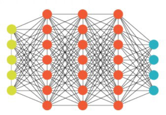

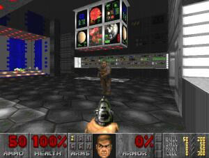

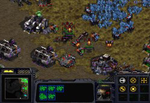
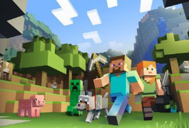
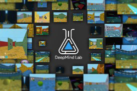

### Page 3

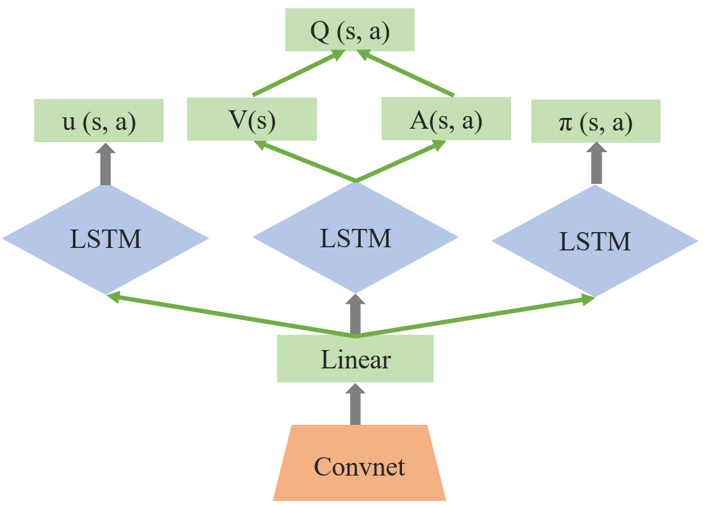
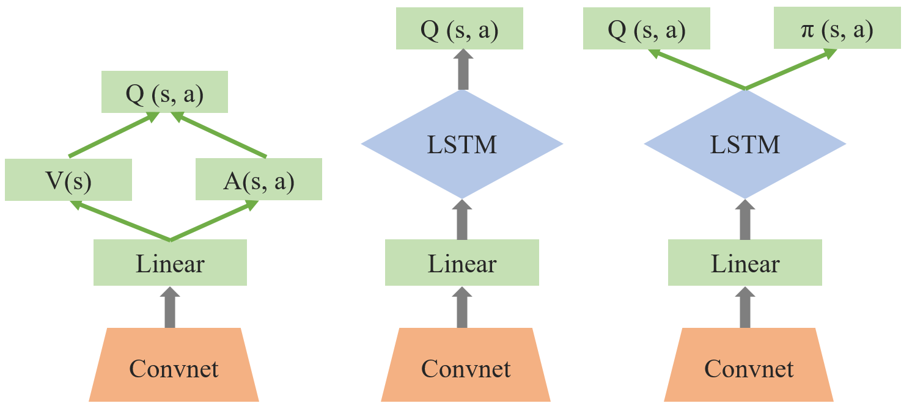
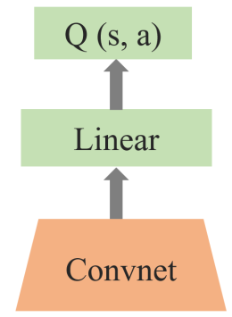

### Page 7

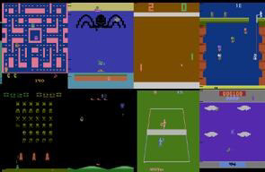
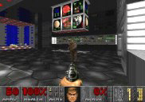

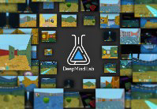
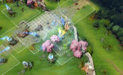
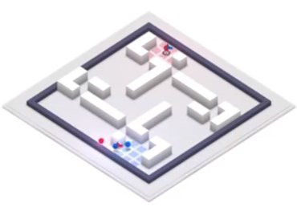

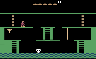
