Paper—An Operational Study of Video Games’ Genres

An Operational Study of Video Games’ Genres

https://doi.org/10.3991/ijim.v14i15.16691

Alaa A. Qaffas
University of Jeddah, Jeddah, Saudi Arabia
aaqaffas@uj.edu.sa

Abstract—This paper presents a study of the most successful games during
the last 34 years (1986 – 2019). We observed that the 100 most ranked games are
represented  by  16  genres  (adventure,  role-playing,  shooter,  platform,  puzzle,
strategy,  hack  and  slash  /  beat  'em  up,  real  time  strategy,  turn-based  strategy,
point-and-click, indie, racing, sport, fighting, arcade and simulator). These genres
are then compared to show which genres are more attractive for players. As a
result, we observed that 6 genres among the 16 represent the most ranked games
(adventure, RPG, shooter, platform, puzzle, and strategy). They represent 0.83 of
the  successful  games.  This  allowed  us  to  recommend  to  combining  the  others
genres  with  the  6  selected  genres.  Also,  we  analyzed  the  evolution  of  the  16
games genres during the last 34 years. We observed that some genres have a great
success until the past decades, but they haven’t a success in this decade. Game
designers and  researchers in the field of games may rethink about how to add
attractive elements in the genres non-successful in this decade. Also, we observed
that some genres like the indie games haven’t a great success in the past decades,
but they have an important increased success in this decade. This may encourage
the decision makers and the game designer to invest on these genres.

Keywords—Game genres, comparing game genres, evolution of game genres.

1

Introduction

Video  games  have  an  increased  and  continue  interest  since  the  last  decades.  The
importance of video games comes from the big number of gamers who play for some
hours each day. These phenomena attract decision makers to invest in the development
of video games. Also, several researchers are studying the impact of games in different
domains  such  as  education  economy  and  so  on.  In  general,  video  games  carry  their
importance, from their attractiveness and suspense, because of their spread in houses,
games and entertainment places [1].

Furthermore, competitive elements can be incorporated by such games because of
their interactivity, which allows for active engagement of the user in the playing process
[2].  In  particular,  video  games  are  a  ubiquitous  part  of  almost  all  children’s  and
adolescents’ lives, with 97% playing for at least one hour per day in the United States
[3]. This was a reason for expansion of games. Video gaming is an extremely popular
leisure-time activity with more than two billion users worldwide [4] cited in [5].

iJIM ‒ Vol. 14, No. 15, 2020175
Paper—An Operational Study of Video Games’ Genres

This paper addresses the classification of games based on an operational analysis.
We classified and analyzed 100 succeeded games during the last 34 years (1986 - 2019).
These  games  represent  16  game  genres  (adventure,  role-playing,  shooter,  platform,
puzzle,  strategy,  hack  and  slash/beat  'em  up,  real  time  strategy,  turn-based  strategy,
point-and-click,  indie,  racing,  sport,  fighting,  arcade  and  simulator).  The  16  game
genres are compared based on the number of games representing each one of them. This
the  most  successful  game  genres  and  concluding
allowed  us
recommendation for decision makers and researchers in the domain of games. Also, the
paper  analyses  the  evolution  of  the  16  game  genres  during  the  last  34  years.  This
analysis allowed observing the emergent genres and the curve of genres evolution. This
could allow predicting the evolution of game genres in the next years.

to  observe

The rest of the paper is as follows. The section 2 presents the definition of 16 game
genres representing the successful games. The section 3 presents the benchmarking of
100 successful games. Section 4 presents the comparative study of game genres based
on the classification of games according to their genres. Section 5 presents the evolution
of game genres. Finally, the section 6 concludes the papers.

2

Definitions of Game Genres

This section presents the game genres of the most successful games during the last
decades (1988-2019). These genres represent the first 100 ranked games represented in
the next section.

•  Adventure games [6] refer to games, which usually have in common a story that
drives  the  gameplay.  “Adventure”  is  usually  associated  with  a  quest-like
structure.

•  A role-playing game [7] is a game set in an imaginary world. Players are free to
choose how to explore the game world, in terms of the path through the world
they  take  and  may  revisit  areas  previously  explored.  The  amount  of  the  game
world potentially available for exploration is typically large.

•  First  person  shooter  [8]  are  characterized  by  accelerated  motor  responses  yet

reduced abilities to cancel a prepotent response.

•  Platform games [9] are games in which Characters and settings are seen inside
view as opposed to top view, thus creating a graphical sense of “up” and “down”
as is implied in “Platform.”

•  A puzzle game [10] has a solution. In particular, Maze Puzzle is a game where
the concept between combination of path and collection of paths, typically from
an entrance to a goal.

•  A strategy games [11] have the main features of decisions complexity which are
taken  by  the  player  in  a  simulated  or  fantastic  politic,  economic  or  military
universe.

•  A Hack and slash/Beat 'em up game is based on hand-to-hand combat between

the player and many non-players characters.

176http://www.i-jim.orgPaper—An Operational Study of Video Games’ Genres

•  Real-time strategy (RTS) games [12] involve multiple teams acting in a real-time
environment with the goal of gaining military or territorial superiority over one
another. To achieve this goal, a player typically must address two key RTS sub-
problems, resource production and tactical planning.

•  In turn-based strategy (TBS), the player makes his/her move during one turn and

then wait for the opponent’s turn [13].

•  A point-and-click is a game in which the curser (e.g. curser of the mouse) is used

as input to click on the game elements.

•  An indie game [14] is permeated by spontaneity; ideas freely come and trigger
the design without being necessarily forced or induced by the designers and the
need to come up with a game to satisfy someone’s needs.
•  Racing games [15] emulate driving a car on a race track.
•  A Sport game simulates a sport in which the player controls the game avatars.
•  Fighting games [16] display certain amounts of hand-to-hand combat which can

be referred to as a portrayal of violence.

•  Arcade video game is a game in which the interface is designed in the form of an
arcade (lines) in which the player avatar and others non-player characters move.
•  A simulation game allows interacting virtually with phenomena of the real word.

3

Benchmarking of Successful Games

Benchmarking  is  recognised  as  an  essential  tool  for  continuous  improvement  of
quality  [17].  Quite  often,  the  benchmarking  concept  is  understood  to  be  an  act  of
imitating or copying. But, in reality this proves to be a concept that helps in innovation
rather than imitation, as stated by Thompson and Cox [18] cited in Dattakumar [17].
Also,  benchmarking  is  a  tool  which  helps  companies  to  position  themselves
Krishnamoorthy  and  D’Lima  [19].in  the  market  place.  In  fact,  decision  makers  are
persistently on the lookout for techniques to facilitate quality enhancement.

This section presents 100 successful games classified according to their genres. This
list  could  serve  as  benchmarking  of  successful  games  for  decision  makers  and
researchers who works in improving the quality of games. Furthermore, we have used
this list for analyzing the game genres and concluding recommendations. Also, we have
analyzed the evolution of the successful game genres during the 34 last years (1986-
2019).

Table 1 presents 100 successful games classified according to their genres. These
games are considered as the top best games during 1986 to 2019. They have the best
ranks according to the Internet Games Database [20]. The genres of these games are
collected during November-December 2019.  Most of these games have more than one
genre. The game designers combine game genres to attract more players. For example,
The Witcher 3: Wild Hunt which is appeared in 2015 has two genres  adventure and
role-playing (RPG). In adventure games, the player discovers new word and new non-
player characters in a story. In RPG games, the player could have several paths in the
game and could play different role in the game. So, the designer of The Witcher 3: Wild
Hunt decided to combine the two game genres adventure and role-playing games. As

iJIM ‒ Vol. 14, No. 15, 2020177
Paper—An Operational Study of Video Games’ Genres

another example of game, we cite the Red Dead Redemption 2 which is appeared in
2018. It has also the shooter genre beside the two genres adventure and RPG. In shooter
games, the player has to have rapid decisions and actions.

Table 1.  100 successful games classified according to their genres

Game

The Witcher 3: Wild Hunt (2015)
War (2018)
Chrono Trigger (1995)
The Last of Us (2013)
Persona 5 (2016)
Silent Hill 2 (2001)
Red Dead Redemption 2 (2018)

Planescape: Torment (1999)

Metal Gear Solid 3: Snake Eater (2004)
Paper Mario: The Thousand-Year Door (2004)
Metroid Prime (2002)
The Legend of Zelda: Breath of the Wild (2017)
Super Mario World (1990)
Baldur's Gate II: Shadows Of Amn (2000)
Uncharted 4: A Thief's End (2016)
Horizon Zero Dawn (2017)
Castlevania: Symphony of the Night (1997)
Mass Effect 2 (2010)
The Legend of Zelda: A Link to the Past (1991)
The Legend of Zelda: Ocarina of Time (1998)
Day of the Tentacle (1993)
Super Metroid (1994)
Portal 2 (2011)
Metal Gear Solid (1998)
Indiana Jones and the Fate of Atlantis (1992)
Bloodborne (2015)
System Shock 2 (1999)

Hollow Knight (2017)

Half-Life 2 (2004)
Grand Theft Auto V (2013)
Final Fantasy VII (1997)

EarthBound (1994)

Shadow of the Colossus (2005)
Star Wars: Knights of the Old Republic (2003)
Super Mario Odyssey (2017)
NieR: Automata (2017)
Deus Ex (2000)
Kingdom Hearts II (2005)
Monkey Island 2: LeChuck's Revenge (1991)

Genres

Adventure, Role-playing (RPG)
Adventure, Role-playing (RPG)
Role-playing (RPG)
Adventure, Shooter
Adventure, Platform, Role-playing (RPG)
Adventure, Puzzle
Adventure, Role-playing (RPG), Shooter
Real Time Strategy (RTS), Role-playing (RPG),
Strategy
Adventure, Role-playing (RPG)
Adventure, Role-playing (RPG)
Adventure, Platform, Shooter
Adventure, Role-playing (RPG)
Platform
Role-playing (RPG)
Adventure, Shooter
Role-playing (RPG), Shooter
Adventure, Platform, Role-playing (RPG)
Role-playing (RPG), Shooter, Simulator
Adventure, Role-playing (RPG)
Adventure, Platform, Puzzle, Role-playing (RPG)
Adventure, Point-and-click
Adventure, Platform, Role-playing (RPG), Shooter
Adventure, Platform, Puzzle, Shooter
Adventure, Strategy
Adventure, Point-and-click, Puzzle
Adventure, Role-playing (RPG)
Role-playing (RPG), Shooter
Adventure, Hack and slash/Beat 'em up, Indie,
Platform
Shooter
Adventure, Racing, Shooter, Sport
Adventure, Role-playing (RPG)
Adventure, Role-playing (RPG), Turn-based strategy
(TBS)
Adventure, Platform, Puzzle
Adventure, Role-playing (RPG)
Adventure, Platform
Role-playing (RPG)
Role-playing (RPG),Shooter
Adventure, Role-playing (RPG)
Adventure, Point-and-click, Puzzle

178http://www.i-jim.orgPaper—An Operational Study of Video Games’ Genres

Half-Life (1998)
Super Mario Galaxy 2 (2010)
Gothic II (2002)
Super Mario 64 (1996)
Grand Theft Auto: San Andreas (2004)
Ori and the Blind Forest (2015)
Red Dead Redemption (2010)
Uncharted 2: Among Thieves (2009)
Super Mario World 2: Yoshi's Island (1995)
Super Mario Bros. 3 (1988)
Final Fantasy VI (1994)
Celeste (2018)
Fallout 2 (1998)
Warcraft III: Reign of Chaos (2002)
StarCraft (1998)
Gothic (2001)
Tetris (1986)

Super Smash Bros. Melee (2001)

The Legend of Zelda: Majora's Mask (2000)
Mario Kart 8 (2014)
Heroes of Might and Magic III: The Restoration of
Erathia (1999)
StarCraft II: Wings of Liberty (2010)
Vampire: The Masquerade - Bloodlines (2004)
Dark Souls III  (2016)
Resident Evil 4  (2005)
Star Wars: Knights of the Old Republic II - The Sith
Lords (2004)
Diablo II (2000)
The Elder Scrolls V: Skyrim (2011)

Final Fantasy IX (2000)

Half-Life 2: Episode Two (2007)
Stardew Valley (2016)
The Legend of Zelda: A Link Between Worlds
(2013)
Marvel's Spider-Man (2018)
Grand Theft Auto: Vice City (2002)
Mafia (2002)
Super Smash Bros. Ultimate (2018)
Metal Gear Solid 2: Sons of Liberty (2001)
The Legend of Zelda: The Wind Waker (2002)

Undertale (2015)

Portal (2007)
God of War II (2007)
INSIDE (2016)
Super Mario Galaxy (2007)
Assassin's Creed II (2009)

Adventure, Puzzle, Shooter
Adventure, Platform
Adventure, Role-playing (RPG), Strategy
Adventure, Platform
Adventure, Racing, Shooter, Sport
Adventure, Indie, Platform, Puzzle
Adventure, Role-playing (RPG), Shooter
Adventure, Platform, Shooter
Platform
Adventure, Platform
Adventure, Role-playing (RPG)
Adventure, Indie, Platform
Role-playing (RPG), Turn-based strategy (TBS)
Real Time Strategy (RTS), Strategy
Real Time Strategy (RTS), Strategy
Adventure, Role-playing (RPG)
Arcade, Puzzle, Strategy
Fighting, Hack and slash/Beat 'em up, Platform,
Sport
Adventure, Role-playing (RPG)
Adventure, Platform
Role-playing (RPG), Strategy, Turn-based strategy
(TBS)
Real Time Strategy (RTS), Strategy
Adventure, Role-playing (RPG)
Adventure, Role-playing (RPG)
Shooter
Adventure, Role-playing (RPG), Strategy

Hack and slash/Beat 'em up, Role-playing (RPG)
Adventure, Role-playing (RPG)
Adventure, Role-playing (RPG), Turn-based strategy
(TBS)
Puzzle, Shooter
Adventure, Puzzle, Role-playing (RPG)
Adventure, Puzzle, Role-playing (RPG)

Adventure,Hack and slash/Beat 'em up
Adventure, Arcade, Racing, Shooter
Adventure, Fighting, Racing, Shooter
Fighting
Adventure
Adventure, Platform, Puzzle, Role-playing (RPG)
Adventure, Indie, Role-playing (RPG), Shooter,
Turn-based strategy (TBS)
Platform, Puzzle, Shooter
Adventure, Hack and slash/Beat 'em up, Platform
Adventure, Indie, Platform, Puzzle
Adventure, Platform
Adventure, Platform

iJIM ‒ Vol. 14, No. 15, 2020179
Paper—An Operational Study of Video Games’ Genres

Batman: Arkham Asylum (2009)

BioShock (2007)

Mass Effect (2007)
Max Payne (2001)
Fallout: New Vegas (2010)
Mass Effect 3 (2012)
The Elder Scrolls III: Morrowind (2002)
Age of Empires II: The Age of Kings (1999)
Batman: Arkham City (2011)
Uncharted 3: Drake's Deception (2011)
Dead Space 2 (2011)
The Walking Dead: Season One (2012)
DOOM (2016)
Borderlands 2 (2012)
The Elder Scrolls IV: Oblivion (2006)
Dragon Age: Origins (2009)
Bioshock Infinite  (2013)

Adventure, Hack and slash/Beat 'em up
Adventure, Role-playing (RPG), Shooter

Role-playing (RPG), Shooter
Shooter
Role-playing (RPG), Shooter
Adventure, Role-playing (RPG), Shooter
Adventure, Role-playing (RPG)
Real Time Strategy (RTS), Strategy
Adventure, Hack and slash/Beat 'em up
Adventure, Platform, Shooter
Shooter
Adventure, Point-and-click
Shooter
Role-playing (RPG), Shooter
Adventure, Role-playing (RPG)
Role-playing (RPG)
Adventure, Shooter

3.1  Classification of games according to their genres

Games are classified according to their genres. Given that a game may belong to
more  than  one  genre,  it  may  appear  in  more  than  one  class.  The  table  2  presents  a
classification of most ranked games during 1986-2019. This classification is based on
table 1. For example, the number of games is 69 for the game genre  adventure. This
means that there are 69 games in the table 1 having one of their genre adventure. For
more details about the games in each genre, see the appendix 1.

Table 2.  Classification of games according to their genres

Genres of Games

Adventure
Role-playing (RPG)
Shooter
Platform
Puzzle
Strategy
Hack and slash/Beat 'em up
Real Time Strategy (RTS)
Turn-based strategy (TBS)
Point-and-click
Indie
Racing
Sport
Fighting
Arcade
Simulator
Total

Number of Games
69
49
32
26
15
10
7
5
5
5
5
4
3
3
2
1
241

180http://www.i-jim.org
Paper—An Operational Study of Video Games’ Genres

Adventure is the most genre succeeded in the last decades (69 games belong to the
genre of adventure games). Then, role-playing (RPG) is represented by 49 games. The
shooter, platform, puzzle, and strategy are represented respectively by 32, 26, 15 and
10 games. These genres have good representation in the set of successful games. Hack
and slash/beat 'em up, Real Time Strategy (RTS), Turn-based strategy (TBS), point-
and-click, Indie, racing, sport, fighting, arcade and Simulator appear also among the
successful genres. They represent respectively 7, 5, 5, 5, 5, 4, 3, 3, 2 and 1 games. Given
that a game may appear in more than one genre, the total in table 2 is 241. So, in average
a game appear in two or three genres (2 < 241/100 < 3).

In order to have more observation of the games’ repartition into classes, the games’
classification is represented in the form of graphic. The figure 1 presents a classification
of the most ranked games during 1986-2019.

Fig. 1.  Classification of games according to their genres

It  is  possible  to  observe  from  figure  1  that  6  genres  (adventure,  RPG,  shooter,
platform, puzzle, and strategy) out of 16 represent the most successful games with a
rate of 0,83 ( = 201/241, where 241 is the sum of the numbers of games appeared in all
genres;  201  is  the  sum  of  the  numbers  of  games  appeared  in  the  6  most  successful
genres.). Some recommendations could be done based on this observation:

•  Game designers and entrepreneurs in the  games industry could profit from the
emergence of the most successful genres by including in their game, the design
aspect of these genres: adventure, RPG, shooter, platform, puzzle, and strategy.
•  Researchers in educational field may study the usefulness of the most successful
genres  in  the  context  of  education.  In  fact,  several  educational  games  are
implemented but they do not appear in the list of most successful games.

iJIM ‒ Vol. 14, No. 15, 2020181

Paper—An Operational Study of Video Games’ Genres

•  Researchers in the usability and psychometric analyses may be interested to the

analyses of the player behavior towards these game genres.

For more analyses of the successful games during the last decades, we analyze in the
next section the evolution of these games. In fact, it is possible that some genres have
an increase success in the last years but this success is not seen in global view of 34
years (1986-2019).

4

Evolution of Games’ Genres

The games of each genre are classified according to 8 periods of time. Each period
includes 4 years except the first period which include 6 years. In fact, we have 34 years
(= 6 years + 7 * 4 years) from 1986 to 2019. The first period is too large given that the
number of games in all genres is less in the first period. The defined periods are: 1986
-1991,  1992-1995,  1996-1999,  2000-2003,  2004-2007,  2008-2011,  1012-2015  and
2016-2019.  Figure  2  presents  6  histograms  representing  the  evolution  of  six  most
successful genres of games (adventure, RPG, shooter, platform, puzzle, and strategy).

a) Evolution of adventure games

b) Evolution of RPG games

182http://www.i-jim.org

Paper—An Operational Study of Video Games’ Genres

c) Evolution of shooter games

d) Evolution of platform games

e) Evolution of puzzle games

f) Evolution of strategy games

Fig. 2.  Evolution of the six most successful genres of games

It is possible to observe that adventure games have achieved their maximal success
during  two  periods:  2000-2003  and  2016-2019.  Between  these  two  maximal  points,
there is a curve which includes a decrease progressively, then an increase progressively.
The  histogram  of  the  RPG  games  includes  two  summit  curves  (including  maximal
points: 2000-2003 and 2016-2019) and two curves with minimal points (1986-1991 and
2008-2011). The histogram of successful RPG games may be seen as a spiral including
curves with maximal and minimal points. The histogram of the shooter games includes
a continue increase until the two successive period 2004-2007 and 2008-2011. Then,
the histogram of shooter games starts at continues decrease until 2019. The histogram
of the platform games starts with a continue increase until the period 2008-2011. Then,
there is a curve with a minimal point in 2012-2015 and a return to increased rates in
2016-2019. The curves exist also in the histograms of the puzzle and strategy games.

The figures 3 and 4 present the evolution of the 10 less successful genres of games.
Figure  3  presents  the  evolution  of  the  genres  hack-and-slash,  RTS,  TBS,  point-and-
click, indie and racing. Figure 4 presents the evolution of the genres sport, fighting,
arcade and simulator.

iJIM ‒ Vol. 14, No. 15, 2020183

Paper—An Operational Study of Video Games’ Genres

a)Evolution of hack and slash games

b). Evolution of RTS games

c) Evolution of TBS games

d) Evolution of Point-and-click games

e) Evolution of indie games

f) Evolution of racing games

Fig. 3.  Evolution of the hack and slash, RTS, TBS, point-and-click, indie and racing games.

Hack-and-slash games appeared as successful games in 2000-2013. This genre of
games has also appeared as successful genre during the last period 2016-2019. RTS and
TBS appeared as successful games until 2011. After that, these two genres do not appear
among the successful list. Maybe this is due to the fact that these two genres are based
on  hard  thinking.  For  example,  the  chess  game  is  a  TBS  and  needs  an  important
concentration of the players. The point-and-click genre has an important earlier success.
Then it does not appear as successful genre during 16 years (1996-2011). The indie
games appeared as successful games just in the last period. The histogram of the indie
games shows an increase. Racing games achieved their maximal success during tow
continuous periods 2000-2003 and 2004-2007.

184http://www.i-jim.org

Paper—An Operational Study of Video Games’ Genres

a) Evolution of sport games

b) Evolution of fighting games

c) Evolution of arcade games

d) Evolution of simulator games

Fig. 4.  Evolution of sport, fighting, arcade and simulator games.

Sport, fighting, arcade and simulator genres appeared in the list of successful genres
but  the  number  of  successful  games  of  these  genres  is  few.  It  is  recommended  to
combine these genres with the genres of most successful games like the adventure and
the RPG games.

5

Conclusion

Decision makers and designers need to know what kind of video games are more
attractive  for  players.  The  analysis  of  most  successful  games  allows  seeing  the
opportunities  of  investment  in  video  games.  Furthermore,  it  allows  predicting  the
preference of players in the next years.

This paper analyses 100 successful games during the last 34 years (1986-2019) and
classifies them according to their genres in order to show the most successful games’
genres.  As  a  result,  we  observed  that  there  are  six  games’  genres  more  successful:

iJIM ‒ Vol. 14, No. 15, 2020185

Paper—An Operational Study of Video Games’ Genres

adventure, RPG, shooter, platform, puzzle, and strategy. Some recommendations could
be done based on this observation:

Game  designers  and  entrepreneurs  in  the  games  industry  could  profit  from  the
emergence of the most successful genres by including in their game, the design aspect
of these genres: adventure, RPG, shooter, platform, puzzle, and strategy.

•  Researchers in educational field may study the usefulness of the most successful
genres  in  the  context  of  education.  In  fact,  several  educational  games  are
implemented but they do not appear in the list of most successful games.

•  Researchers in the usability and psychometric analyses may be interested in the

analyses of the player behavior towards the successful games’ genres.

For  more  observation  of  the  success  in  game  genres,  we  have  analyzed  their

evolution during the last 34 years. As a result, we have the following observations:

•  RTS  and  TBS  appeared  as  successful  games  until  2011.  After  that,  these  two
genres do not appear among the successful list. Maybe this is due to the fact that
these two genres are based on hard thinking. For example, the chess game is a
TBS and needs an important concentration of the players.

•  The indie games appeared as successful games just in the last period. This may
be considered as opportunities for games’ designers and decision makers given
that this genre is starting to have its part in the successful list.

Like any research work, this study has some limitations which are as follows:

•  The sample size may be extended for having not only 100 successful games, but

more successful games. This may generalize the observed results.

•  Some  aspects  of  games  are  not  studied  like  the  game-play  and  the  games

mechanics. These aspects could be the subject of future studies.

As future works, interested researchers may work on the following perspectives:

•  Study  of  the  relations  between  game  genres.  In  fact,  some  genres  are  more
attractive for players and there are many potential combinations of the successful
genres with the others games’ genres.

•  Development of new operational taxonomy of successful video games. The new
taxonomy may consider the most successful games’ genres and giving them high
level in the taxonomy.

•  Extend  the  taxonomy  by  adding  more  games’  genres  related  to  advertising,
psychotherapy,  enhanced  motivations  and  mixed  reality  based  respectively  on
[21, 22, 23, 24].

•  Enlarge the sample of successful games and generalizing the study.

6

References

[1] Mohamed M. Al-Hileh., Nedaa S.I. Ibrahim. (2018). The Advantages and Disadvantages of
Electronic Games Played by Children Aged (3-6) Years, from Mothers and Kindergarten

186http://www.i-jim.orgPaper—An Operational Study of Video Games’ Genres

Teachers’ Point of View. International Journal of Applied Engineering Research ISSN 0973-
4562 13(4). (2018). pp. 1805-1812.

[2] Peter Vorderer., Tilo Hartmann., Christoph Klimmt, (2003). Explaining the enjoyment of
playing video games: The role of competition. Proceeding of the ICEC '03 Proceedings of
the  second  international  conference  on  Entertainment  computing.  Pp.  1-9.  Pittsburgh,
Pennsylvania, USA — May 08 - 10, 2003.

[3] Isabela Granic, Adam Lobel, and Rutger C. M. E. Engels. (2003). The Benefits of Playing
Video  Games.  American  Psychologist.  69  (1).  Pp  66  –78.  https://doi.org/10.1037/
a0034857

[4] Newzoo  (2017).  2017  Global  Games  Market  Report:  Trends,  Insights,  and  Projections
Toward  2020.  Available  at:  http://progamedev.net/wp-content/uploads/2017/06/Newzoo_
Global_Games_Market_Report_2017_Light.pdf
2018).
https://doi.org/10.18411/a-2017-023

(accessed

February

16,

[5] Von  der  Heiden,  J.  M.,  Braun,  B.,  Müller,  K.  W.,  &  Egloff,  B.  (2019).  The  Association
Between Video Gaming and Psychological Functioning. Frontiers in psychology, 10, 1731.
https://doi.org/10.3389/fpsyg.2019.01731

[6] Clara Fernández-Vara (2011). “The tribulations of adventure games: integrating story into

simulation through performance. BiblioBazaar, 2011. ISBN: 9781243709028.

[7] Hitchens, Michael;Drachen, Anders. (2009). The Many Faces of Role-Playing Games.
[8] International Journal of Role-playing, 2009, p. 3-21. ID: 2397916290.
[9] Jory Deleuze, Maxime Christiaens, Filip Nuyens, Joel Billieux (2017). Shoot at first sight!
First  person  shooter  players  display  reduced  reaction  time  and  compromised  inhibitory
control in comparison to other video game players. Computers in Human Behavior 72. July
2017, Pages 570-576. https://doi.org/10.1016/j.chb.2017.02.027

[10] Angelika Bugl (2014). Thesis. “Player Evaluation of the Level Design of a Platform Game
Using  Automated  Questions  Based  on  Context-Specific  Game  Metrics.  September  2014.
University of Applied Sciences, Upper Austria.

[11] Riannatta Adellin, Chen Tet Khuan and Leo David Gertrude (2019). Conceptual Framework
Puzzle Game with High Replayability. Journal of Physics: Conf. Series 1228 (2019) 012070
IOP Publishing. https://doi.org/10.1088/1742-6596/1228/1/012070

[12] Viviane Gal, Cécile Le Prado, Stéphane Natkin, Liliana Vega. (2002). “Writing for video

games”. In Proceedings Laval Virtual (IVRC).

[13] Radha-Krishna Balla and Alan Fern (2009). “UCT for Tactical Assault Planning in Real-
Time Strategy Games”. Proceedings of the 21st International Jont Conference on Artifical
Intelligence (IJCAI'09), Pasadena, California, USA, pp. 40—45.

[14] Cecilia Bexander (Januari, 2014). The Strategy Game Art Guide. Thesis in Game Design,

Uppsala University.

[15] Pérez  Domínguez  EA  (2019).  The  design  of  indie  games,  a  different  paradigm.  Thesis.

BayreuthUniversity. 2019.

[16] Bei  Yuan,  Eelke  Folmer,  Frederick  C.  Harris,  Jr.  (2011).  Game  Accessibility:  a  Survey.
Universal Access in the Information Society 10 (1). March 2011. Pp. 81-100. https://doi.org
/10.1007/s10209-010-0189-5

[17] Jhon, A. (2019). The influence of playing 3D fighting games in practicing martial arts.
[18] 1st  International  Conference  on  Advance  and  Scientific  Innovation  (ICASI).  Journal  of
Physics:  Conf.  Series  1175  (2019).  IOP  Publishing.  https://doi.org/10.1088/1742-
6596/1175/1/011001

[19] Dattakumar,  R.  (2003).  A  review  of  literature  on  Benchmarking.  Benchmarking:  An
International  Journal.  10(3),  2003.  pp.  176-209.  MCB  UP  Limited.  https://doi.org/10.
1108/14635770310477744

iJIM ‒ Vol. 14, No. 15, 2020187
Paper—An Operational Study of Video Games’ Genres

[20] Thompson, I. and Cox, A. (1997), Don’t imitate, innovate, Supply Management, pp. 40-3.
[21] Bala,  Krishnamoorthy,.  Christine  D’Lima.  (2014).  Benchmarking  as  a  measure  of
competitiveness. International Journal of Process Management and Benchmarking (IJPMB),
4(3). July 2014. https://doi.org/10.1504/ijpmb.2014.063240

[22] Qaffas, A (2016) Lightweight adaptive personalised e-advertising. PhD thesis, University

of Warwick.

[23] Internet Games Database (IGDB, 2019). https://www.igdb.com/top-100/games.
[24] Sie-Yi,  L.,  &  ChePa,  N.  (2020).  Criteria  of  Mobile  Psychotherapy  Games  for  Memory
Disorder:  A  Systematic  Literature  Review.  International  Journal  of  Interactive  Mobile
Technologies (IJIM), 14(05), pp. 57-72. https://doi.org/10.3991/ijim.v14i05.13345

[25] Nygren,  E.,  Laine,  T.,  &  Sutinen,  E.  (2018).  Dynamics  between  Disturbances  and
Motivations  in  Educational  Mobile  Games.  International  Journal  of  Interactive  Mobile
Technologies (IJIM), 12(3), pp. 120-141. https://doi.org/10.3991/ijim.v12i3.8490

[26] Fotouhi-Ghazvini, F., Earnshaw, R., Moeini, A., Robison, D., & Excell, P. (2011). From E-
Learning to M-Learning - the use of Mixed Reality Games as a new Educational Paradigm.
International  Journal  of  Interactive  Mobile  Technologies  (IJIM),  5(2),  pp.  17-25.
https://doi.org/10.3991/ijim.v5i2.1463

7

Authors

Alaa A. Qaffas received the B.S. degree in Computer Science from King Abdul-
Aziz  University,  Jeddah,  Saudi  Arabia,  in  2007  and  the  M.S.  degree  in  Computer
Science from Hertfordshire University, Hatfield, United Kingdom, in 2010.

Dr. Qaffas completed the Ph.D. degree in Computer Science from the University of
Warwick, Coventry, United Kingdom, in 2016. Currently, he is an assistant professor
in the Department of Management Information Systems (MIS),  College of Business,
University  of  Jeddah,  Saudi  Arabia.  His  research  interests  include  e-commerce,
adaptive advertising, adaptation model, personalization, user modeling, authoring and
delivering  personalized  content  and  social  networks  analysis.  He  is  also  conducting
research  project  in  the  field  of  educational  games  and  their  use  for  enhancing  the
motivation of the students. Email: aaqaffas@uj.edu.sa

Article  submitted  2020-05-28.  Resubmitted  2020-06-29.  Final  acceptance  2020-06-30.  Final  version

published as submitted by the authors.

188http://www.i-jim.org

Paper—An Operational Study of Video Games’ Genres

8

Appendix A

Genre of Game

Included Games

Adventure
69 Games
1986 -1991 (3 Games)
1992-1995 (5 Games)
1996-1999 (6 Games)
2000-2003 (12 Games)
2004-2007 (11 Games)
2008-2011 (9 Games)
1012-2015 (11 Games)
2016-2019 (12 Games)

Super Mario Bros. 3 (1988)
The Legend of Zelda: A Link to the Past (1991)
Monkey Island 2: LeChuck's Revenge (1991)
Indiana Jones and the Fate of Atlantis (1992)
Day of the Tentacle (1993)
Super Metroid (1994)
EarthBound (1994)
Final Fantasy VI (1994)
Super Mario 64 (1996)
Castlevania: Symphony of the Night (1997)
Final Fantasy VII (1997)
The Legend of Zelda: Ocarina of Time (1998)
Metal Gear Solid (1998)
Half-Life (1998)
Final Fantasy IX (2000)
The Legend of Zelda: Majora's Mask (2000)
Silent Hill 2 (2001)
Metal Gear Solid 2: Sons of Liberty (2001)
Gothic (2001)
Grand Theft Auto: Vice City (2002)
Mafia (2002)
Metroid Prime (2002)
The Elder Scrolls III: Morrowind (2002)
The Legend of Zelda: The Wind Waker (2002)
Gothic II (2002)
Star Wars: Knights of the Old Republic (2003)
Metal Gear Solid 3: Snake Eater (2004)
Paper Mario: The Thousand-Year Door (2004)
Grand Theft Auto: San Andreas (2004)
Star Wars: Knights of the Old Republic II - The Sith Lords (2004)
Vampire: The Masquerade - Bloodlines (2004)
Shadow of the Colossus (2005)
Kingdom Hearts II (2005)
The Elder Scrolls IV: Oblivion (2006)
God of War II (2007)
Super Mario Galaxy (2007)
BioShock (2007)
Uncharted 2: Among Thieves (2009)
Assassin's Creed II (2009)
Batman: Arkham Asylum (2009)
Super Mario Galaxy 2 (2010)
Red Dead Redemption (2010)
Batman: Arkham City (2011)
Uncharted 3: Drake's Deception (2011)
Portal 2 (2011)
The Elder Scrolls V: Skyrim (2011)
The Walking Dead: Season One (2012)
Mass Effect 3 (2012)
Bioshock Infinite  (2013)
The Last of Us (2013)
Grand Theft Auto V (2013)
The Legend of Zelda: A Link Between Worlds (2013)
Mario Kart 8 (2014)
The Witcher 3: Wild Hunt (2015)
Bloodborne (2015)

iJIM ‒ Vol. 14, No. 15, 2020189

Paper—An Operational Study of Video Games’ Genres

Ori and the Blind Forest (2015)
Undertale (2015)
Persona 5 (2016)
Uncharted 4: A Thief's End (2016)
Dark Souls III  (2016)
Stardew Valley (2016)
INSIDE (2016)
The Legend of Zelda: Breath of the Wild (2017)
Hollow Knight (2017)
Super Mario Odyssey (2017)
Celeste (2018)
Marvel's Spider-Man (2018)
War (2018)
Red Dead Redemption 2 (2018)
The Legend of Zelda: A Link to the Past (1991)
Super Metroid (1994)
EarthBound (1994)
Final Fantasy VI (1994)
Chrono Trigger (1995)
Castlevania: Symphony of the Night (1997)
Final Fantasy VII (1997)
The Legend of Zelda: Ocarina of Time (1998)
Fallout 2 (1998)
Planescape: Torment (1999)
Heroes of Might and Magic III: The Restoration of Erathia (1999)
System Shock 2 (1999)
Baldur's Gate II: Shadows Of Amn (2000)
Deus Ex (2000)
Final Fantasy IX (2000)
The Legend of Zelda: Majora's Mask (2000)
Diablo II (2000)
Gothic (2001)
The Legend of Zelda: The Wind Waker (2002)
The Elder Scrolls III: Morrowind (2002)
Gothic II (2002)
Star Wars: Knights of the Old Republic (2003)
Vampire: The Masquerade - Bloodlines (2004)
Star Wars: Knights of the Old Republic II - The Sith Lords (2004)
Metal Gear Solid 3: Snake Eater (2004)
Paper Mario: The Thousand-Year Door (2004)
Kingdom Hearts II (2005)
The Elder Scrolls IV: Oblivion (2006)
BioShock (2007)
Mass Effect (2007)
Dragon Age: Origins (2009)
Mass Effect 2 (2010)
Fallout: New Vegas (2010)
Red Dead Redemption (2010)
The Elder Scrolls V: Skyrim (2011)
Mass Effect 3 (2012)
Borderlands 2 (2012
The Legend of Zelda: A Link Between Worlds (2013)
The Witcher 3: Wild Hunt (2015)
Bloodborne (2015)
Undertale (2015)
Stardew Valley (2016)
Dark Souls III  (2016)
Persona 5 (2016)

Role-playing (RPG)
49 games
1986 -1991 (  1 Games)
1992-1995 (   4 Games)
1996-1999 (7 Games)
2000-2003 (  10 Games)
2004-2007 (8  Games)
2008-2011 (5 Games)
1012-2015 (6  Games)
2016-2019 (8 Games)

190http://www.i-jim.org
Paper—An Operational Study of Video Games’ Genres

The Legend of Zelda: Breath of the Wild (2017)
Horizon Zero Dawn (2017)
NieR: Automata (2017)
Red Dead Redemption 2 (2018)
War (2018)

Super Metroid (1994)
Half-Life (1998)
System Shock 2 (1999)
Deus Ex (2000)
Max Payne (2001)
Metroid Prime (2002)
Grand Theft Auto: Vice City (2002)
Mafia (2002)
Half-Life 2 (2004)
Grand Theft Auto: San Andreas (2004)
Resident Evil 4  (2005)
Half-Life 2: Episode Two (2007)
Portal (2007)
BioShock (2007)
Mass Effect (2007)
Uncharted 2: Among Thieves (2009)
Mass Effect 2 (2010)
Fallout: New Vegas (2010)
Red Dead Redemption (2010)
Portal 2 (2011)
Uncharted 3: Drake's Deception (2011)
Dead Space 2 (2011)
Mass Effect 3 (2012)
Borderlands 2 (2012)
Bioshock Infinite  (2013)
The Last of Us (2013)
Grand Theft Auto V (2013)
Undertale (2015)
DOOM (2016)
Uncharted 4: A Thief's End (2016)
Horizon Zero Dawn (2017)
Red Dead Redemption 2 (2018)

Super Mario Bros. 3 (1988)
Super Mario World (1990)
Super Metroid (1994)
Super Mario World 2: Yoshi's Island (1995)
Super Mario 64 (1996)
Castlevania: Symphony of the Night (1997)
The Legend of Zelda: Ocarina of Time (1998)
Super Smash Bros. Melee (2001)
The Legend of Zelda: The Wind Waker (2002)
Metroid Prime (2002)
Shadow of the Colossus (2005)
Portal (2007)
God of War II (2007)
Super Mario Galaxy (2007)
Assassin's Creed II (2009)
Uncharted 2: Among Thieves (2009)
Super Mario Galaxy 2 (2010)
Portal 2 (2011)
Uncharted 3: Drake's Deception (2011)

Shooter
32 games
1986 -1991 (0 Games)
1992-1995 (1 Games)
1996-1999 (2 Games)
2000-2003 (5 Games)
2004-2007 (7 Games)
2008-2011 (7 Games)
1012-2015 (6 Games)
2016-2019 (4 Games)

Platform
26 games
1986 -1991 (2 Games)
1992-1995 (2 Games)
1996-1999 (3 Games)
2000-2003 (3 Games)
2004-2007 (4 Games)
2008-2011 (5 Games)
1012-2015 (2 Games)
2016-2019 (5 Games)

iJIM ‒ Vol. 14, No. 15, 2020191

Paper—An Operational Study of Video Games’ Genres

Mario Kart 8 (2014)
Ori and the Blind Forest (2015)
INSIDE (2016)
Persona 5 (2016)
Super Mario Odyssey (2017)
Hollow Knight (2017)
Celeste (2018)

Tetris (1986)
Monkey Island 2: LeChuck's Revenge (1991)
Indiana Jones and the Fate of Atlantis (1992)
Half-Life (1998)
The Legend of Zelda: Ocarina of Time (1998)
Silent Hill 2 (2001)
The Legend of Zelda: The Wind Waker (2002)
Shadow of the Colossus (2005)
Half-Life 2: Episode Two (2007)
Portal (2007)
Portal 2 (2011)
The Legend of Zelda: A Link Between Worlds (2013)
Ori and the Blind Forest (2015)
Stardew Valley (2016)
INSIDE (2016)

Tetris (1986)
Metal Gear Solid (1998)
StarCraft (1998)
Planescape: Torment (1999)
Heroes of Might and Magic III: The Restoration of Erathia (1999)
Age of Empires II: The Age of Kings (1999)
Gothic II (2002)
Warcraft III: Reign of Chaos (2002)
Star Wars: Knights of the Old Republic II - The Sith Lords (2004)
StarCraft II: Wings of Liberty (2010)

Diablo II (2000)
Super Smash Bros. Melee (2001)
God of War II (2007)
Batman: Arkham Asylum (2009)
Batman: Arkham City (2011)
Hollow Knight (2017)
Marvel's Spider-Man (2018)

StarCraft (1998)
Planescape: Torment (1999)
Age of Empires II: The Age of Kings (1999)
Warcraft III: Reign of Chaos (2002)
StarCraft II: Wings of Liberty (2010)

 Puzzle
15 games
1986 -1991 (  2 Games)
1992-1995 (1 Games)
1996-1999 (2  Games)
2000-2003 (2  Games)
2004-2007 (3  Games)
2008-2011 (1 Games)
1012-2015 (2 Games)
2016-2019 (2  Games)

Strategy
10 games
1986 -1991 (1 Games)
1992-1995 (0 Games)
1996-1999 (5 Games)
2000-2003 (2 Games)
2004-2007 (1 Games)
2008-2011 (1 Games)
1012-2015 (0 Games)
2016-2019 (0 Games)

Hack and slash/Beat 'em up
7 Games
1986 -1991 (0 Games)
1992-1995 (0 Games)
1996-1999 (0 Games)
2000-2003 (2 Games)
2004-2007 (1 Games)
2008-2011 (2 Games)
1012-2015 (0 Games)
2016-2019 (2 Games)

Real Time Strategy (RTS)
5 games
1986 -1991 (0 Games)
1992-1995 (0 Games)
1996-1999 (3 Games)
2000-2003 (1 Games)
2004-2007 (0 Games)
2008-2011 (1 Games)
1012-2015 (0 Games)
2016-2019 (0 Games)

Turn-based strategy (TBS)
5 Games

EarthBound (1994)
Fallout 2 (1998)

192http://www.i-jim.org

Paper—An Operational Study of Video Games’ Genres

1986 -1991 (0 Games)
1992-1995 (1 Games)
1996-1999 (2 Games)
2000-2003 (1 Games)
2004-2007 (1 Games)
2008-2011 (0 Games)
1012-2015 (0 Games)
2016-2019 (0 Games)

Point-and-click
5 games
1986 -1991 (1 Games)
1992-1995 (2 Games)
1996-1999 (0 Games)
2000-2003 (0 Games)
2004-2007 (0 Games)
2008-2011 (0 Games)
1012-2015 (1 Games)
2016-2019 (0 Games)

Indie
5 Games
1986 -1991 (0 Games)
1992-1995 (0 Games)
1996-1999 (0 Games)
2000-2003 (0 Games)
2004-2007 (0 Games)
2008-2011 (0 Games)
1012-2015 (2 Games)
2016-2019 (3 Games)

Racing
4 Games
1986 -1991 (0 Games)
1992-1995 (0 Games)
1996-1999 (0 Games)
2000-2003 (2 Games)
2004-2007 (1 Games)
2008-2011 (0 Games)
1012-2015 (1 Games)
2016-2019 (0 Games)

Sport
3 games
1986 -1991 (0 Games)
1992-1995 (0 Games)
1996-1999 (0 Games)
2000-2003 (1 Games)
2004-2007 (1 Games)
2008-2011 (0 Games)
1012-2015 (1 Games)
2016-2019 (0 Games)

Fighting
3 Games
1986 -1991 (0 Games)
1992-1995 (0 Games)
1996-1999 (0 Games)

Heroes of Might and Magic III: The Restoration of Erathia (1999)
Final Fantasy IX (2000)
Undertale (2015)

Monkey Island 2: LeChuck's Revenge (1991)
Indiana Jones and the Fate of Atlantis (1992)
Day of the Tentacle (1993)
The Walking Dead: Season One (2012)

Undertale (2015)
Ori and the Blind Forest (2015)
INSIDE (2016)
Hollow Knight (2017)
Celeste (2018)

Grand Theft Auto: Vice City (2002)
Mafia (2002)
Grand Theft Auto: San Andreas (2004)
Grand Theft Auto V (2013)

Super Smash Bros. Melee (2001)
Grand Theft Auto: San Andreas (2004)
Grand Theft Auto V (2013)

Super Smash Bros. Melee (2001)
Mafia (2002)
Super Smash Bros. Ultimate (2018)

iJIM ‒ Vol. 14, No. 15, 2020193

Paper—An Operational Study of Video Games’ Genres

2000-2003 (2 Games)
2004-2007 (Games)
2008-2011 (Games)
1012-2015 (Games)
2016-2019 (1 Games)

Arcade
2 Games
1986 -1991 (1 Games)
1992-1995 (0 Games)
1996-1999 (0 Games)
2000-2003 (1 Games)
2004-2007 (0 Games)
2008-2011 (0 Games)
1012-2015 (0 Games)
2016-2019 (0 Games)

Simulator
1 game
1986 -1991 (0 Games)
1992-1995 (0 Games)
1996-1999 (0 Games)
2000-2003 (0 Games)
2004-2007 (0 Games)
2008-2011 (1 Games)
1012-2015 (0 Games)
2016-2019 (0 Games)

Tetris (1986)
Grand Theft Auto: Vice City (2002)

Mass Effect 2 (2010)

194http://www.i-jim.org

## Extracted Images

### Page 7

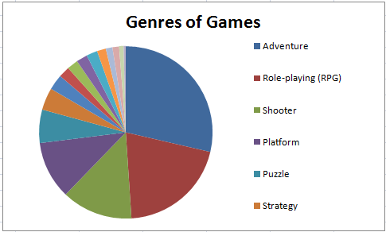

### Page 8

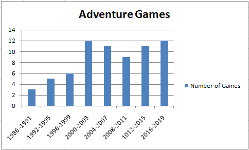
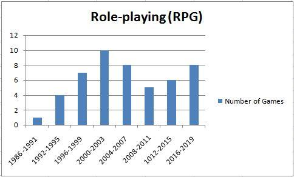
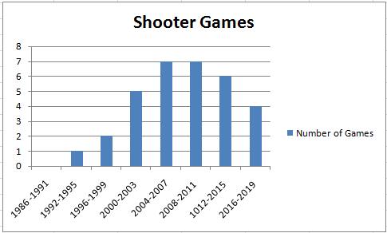
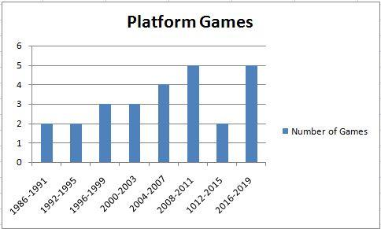

### Page 9

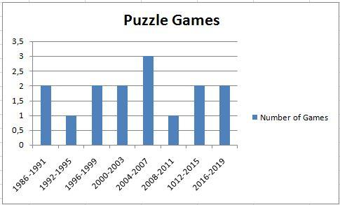
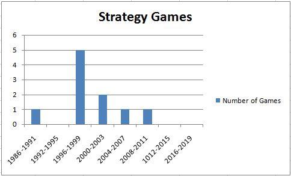
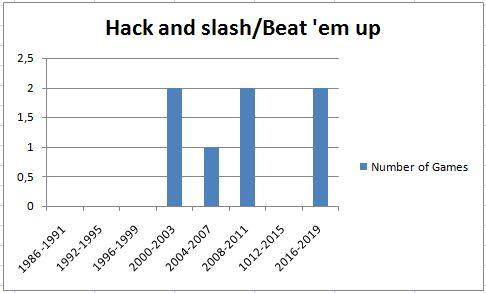
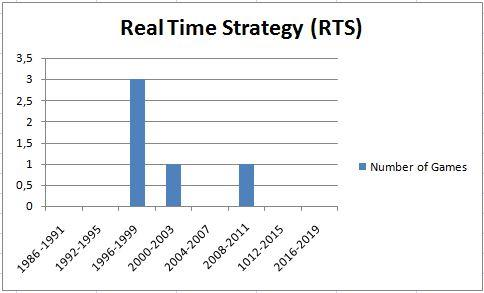

### Page 10

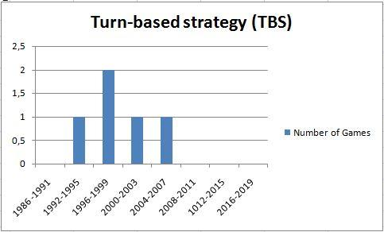
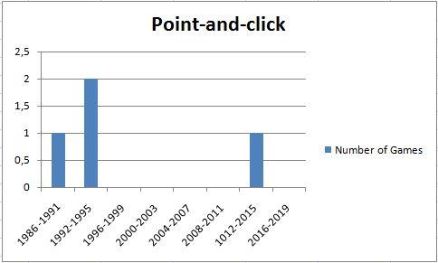
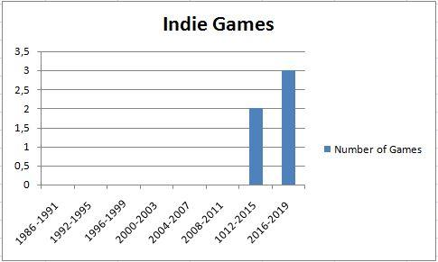
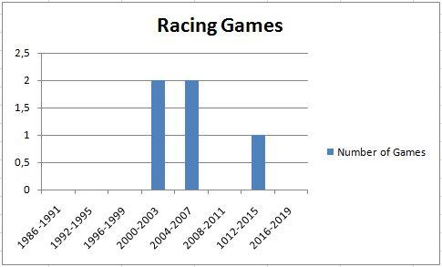

### Page 11

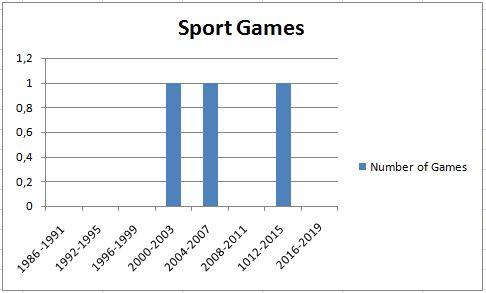
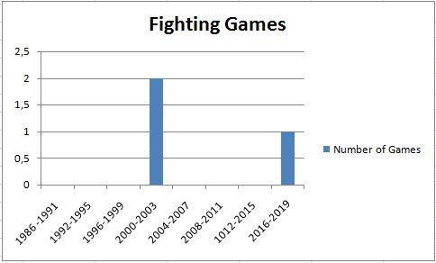
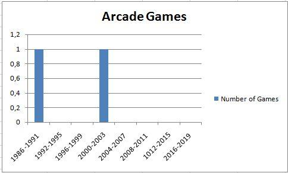
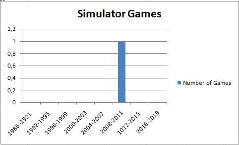
