Master’s programme in Computer, Communication and Information Sciences
| Assessing     | Viability | of Hierarchical |          |      |
| ------------- | --------- | --------------- | -------- | ---- |
| Reinforcement | Learning  |                 | in Video | Game |
Development
Saku Komulainen
Master’s Thesis
2024

©2024
| This work | is licensed | under a Creative | Commons |
| --------- | ----------- | ---------------- | ------- |
“Attribution-NonCommercial-ShareAlike4.0Interna-
tional”license.

Author SakuKomulainen
Title AssessingViabilityofHierarchicalReinforcementLearninginVideoGame
Development
Degree programme Computer,CommunicationandInformationSciences
Major MachineLearning,DataScienceandArtificialIntelligence
Supervisor SeniorUniversityLecturerVesaHirvisalo
Advisor M.Sc. AntonDebner
Date 19thofSeptember2024 Number of pages 46 Language English
Abstract
Inthisthesisweexplorethefeasibilityofusinghierarchicalreinforcementlearning
(HRL)invideogamedevelopmenttocreatenon-playercharacters(NPC). NPCsarea
crucialpartofvideogamesaffecting manypartsofthegame, includingstorytelling,
atmosphere, and importantly work as opponents and teammates. Using traditional
methodstocreateNPCsinvideogamescanbealengthyanddifficultprocessrequiring
expertknowledge. Reinforcementlearning(RL)hasshownpotential,buthasremained
largelyunusedinvideogamedevelopmentduetosomemajorissues. HRLprovides
solutionstotheseissues,allowingthecomplextasktobesplitintosmaller,easierto
learnsub-tasks.
Wedesign,implement,andstudyanewHRLmethodwiththepotentialofcreating
NPCs withmultiple competency levelswith minimal effort. Our design isbased on
a goal-conditional framework which we modify to suit our goals. Instead of using
a goal-vector we repurpose it to a skill-vector, which could allow us to mask it and
re-trainthehigher-levelpolicytopreventcertainskillsfrombeingused. Inorderto
experimentwithourHRLmethod,wecreateanphysicsbasedquadrupedlocomotion
environment that has possibility for learning multiple different skills. We evaluate
ourmethodwithandwithoutinformationhidinginattempttoforcecertaintypesof
behavioursforthepolicylevels. Themethodshowspotentialinourexperimentsbut
requiresfurtherexperimentationandengineeringtocreatemultiplecompetencylevels.
Keywords ComputerScience,VideoGameDevelopment,ReinforcementLearning,
HierarchicalReinforcementLearning,HRL,DeepLearning,RayRLlib,
Unity

Tekijä SakuKomulainen
Työn nimi HierarkkisenVahvistusoppimisenSoveltuvuudenArviointiVideopelien
Kehittämisessä
Koulutusohjelma Computer,CommunicationandInformationSciences
Pääaine MachineLearning,DataScienceandArtificialIntelligence
Työn valvoja VanhempiyliopistonlehtoriVesaHirvisalo
Työn ohjaaja DIAntonDebner
Päivämäärä 19.9.2024 Sivumäärä 46 Kieli englanti
Tiivistelmä
Diplomityössäontutkittuhierarkkisenvahvistusoppimisen(hierarchicalreinforcement
learning,HRL)käytönsoveltuvuuttavideopelienkehityksessäei-pelaaja-hahmojen
(non-player character, NPC) luomiseen. NPC-hahmot ovat tärkeä osa videopelien
tarinankerrontaa, tunnelmaa ja ne myös toimivat vastustajina ja joukkuetovereina.
Perinteisten kehitysmenetelmien käyttäminen NPC-hahmojen luomisessa saattaa
viedä huomattavasti aikaa ja vaatia merkittävän määrän asiantuntemusta kyseisestä
pelistä.Videopelienkehityksessävahvistusoppiminen(reinforcementlearning,RL)
on osoittanut potentiaaliaNPC-hahmojen luomisessa,mutta sen käyttö on yleisesti
jäänytvähäiseksimerkittävienongelmienvuoksi.HRL-menetelmättarjoavatratkaisuja
näihin ongelmiin pilkkomalla monimutkaiset tehtävät moneen pienempiin helpommin
opittaviinosatehtäviin.
Työssä on suunniteltu, toteutettu ja tutkittu uutta HRL-menetelmää, jolla on
potentiaalia luoda monia NPC-hahmoja eri osaamistasoilla pienten muokkausten
avulla. Tutkimuksen HRL-menetelmä pohjautuu goal-conditional -kehykseen, jota
muokattiintyöntavoitteisiinsopivaksi.Kehyksentavoitevektoriakäytettiineritavalla,
jolloin se toimii taitovektorina. Taitovektorin avulla voidaan mahdollisesti estää
NPC:täkäyttämästätiettyjätaitoja,jasemahdollistaisieriosaamistasojenluomisen.
Työssäluodaanfysiikkaanpohjautuvaympäristöneliraajaisellaolennolla,jottaHRL-
menetelmäävoidaankokeillaympäristössä,jossaonmahdollisuusoppiamoniataitoja.
Kehitettyä menetelmää arvioidaan kahdella tapaa, käyttämällä tiedon piilottamista ja
ilman.Tiedonpiilottamisentavoitteenaonpakottaatietyntyyppisiäkäyttäytymistapoja
ja taitoja eri hierarkkian tasoille. Kokeilujen perusteella kehitetyllä menetelmällä on
potentiaalialuodaeriosaamistasoja,muttasevaatiilisääkehitystyötäjakokeiluja.
Avainsanat Tietotekniikka,VideopelienKehitys,Vahvistusoppiminen,
HierarkkinenVahvistusoppiminen,Syväoppiminen,RayRLlib,Unity

Preface
Firstly,IwouldliketothankmysupervisorDr. VesaHirvisaloandmyadvisorM.Sc.
AntonDeberandtheothermembersoftheresearchteam. Theirsupport,advice,and
ideaswerecrucialduringtheexperimentandwritingprocess. Secondly,Iwouldlike
to thank my family for theircontinued encouragement and support during my studies
especiallywhilewritingthemastersthesis.
Espoo,19thofSeptember2024
SakuKomulainen
5

Contents
Abstract 3
Abstract(inFinnish) 4
Preface 5
Contents 6
1 Introduction 7
2 Background 9
2.1 NPCsinvideogames . . . . . . . . . . . . . . . . . . . . . . . . . 9
2.2 DeepLearning . . . . . . . . . . . . . . . . . . . . . . . . . . . . 10
2.3 ReinforcementLearning . . . . . . . . . . . . . . . . . . . . . . . 11
2.4 DeepReinforcementLearning . . . . . . . . . . . . . . . . . . . . 13
2.5 HierarchicalReinforcementLearning . . . . . . . . . . . . . . . . . 13
2.6 HRLFrameworks . . . . . . . . . . . . . . . . . . . . . . . . . . . 14
2.7 GameEnginesandRLenvironments . . . . . . . . . . . . . . . . . 16
3 Methods 18
3.1 BaseHRLMethod . . . . . . . . . . . . . . . . . . . . . . . . . . 18
3.2 OurHRLDesign . . . . . . . . . . . . . . . . . . . . . . . . . . . 19
4 Implementation 22
4.1 ImplementationofourHRLmethod . . . . . . . . . . . . . . . . . 22
4.2 InterfacingRayRLlibwithUnityGameEngine . . . . . . . . . . . 24
4.3 IssueswithRayandRLlib . . . . . . . . . . . . . . . . . . . . . . 25
5 ExperimentSetup 29
5.1 EnvironmentDescriptionandImplementation . . . . . . . . . . . . 29
5.2 ExperimentMetrics . . . . . . . . . . . . . . . . . . . . . . . . . . 31
5.3 ExperimentDetails,HyperparametersandConfigurationOptions . . 32
6 Results 35
6.1 BaselinewithoutHRL . . . . . . . . . . . . . . . . . . . . . . . . 35
6.2 OurHRLApproachFindings . . . . . . . . . . . . . . . . . . . . . 36
6.3 RayRLlibObservations . . . . . . . . . . . . . . . . . . . . . . . . 39
7 DiscussionandFutureWork 41
7.1 FutureWork . . . . . . . . . . . . . . . . . . . . . . . . . . . . . . 42
8 Conclusions 43
References 44
6

1 Introduction
ThefieldofReinforcementLearning(RL)[1]hasdemonstratedpotentialinvarious
applications, including video game development, notably creation of non-player
characters(NPCs)[2]. NPCsareacrucialpartofvideogames;however,thetraditional
methodsofmakingthemoftenrelyonhard-codingbehaviour,predefinedrules,and
behaviour trees [2]. Video games, especially competitive ones, commonly include
NPCs with multiple competency levels to provide the players with different levels
of difficulties. RL offers an alternative by enabling NPCs to learn their behaviour
byinteractingwith theenvironment,effectively converting man-hoursinto training
time. Despite their versatility in a wide variety of complex environments, many
traditionalRLapproachescanstrugglewithinvideogameenvironments. Hierarchical
reinforcementlearning (HRL)[3]offers asolutionto thisproblembydecomposing
thelargertasksintomultiplesmallerandeasiertotrainsub-behaviours.
TraditionalRLmethodsfacesignificantchallengeswhenappliedtomorecomplex
videogamesettings. Thesechallengesincludefactorssuchasdifficultiesinlearning
complexanddifficulttosolveproblems,environmentexploration,creditassignment
and sample efficiency [3]. In many cases, this may lead to the RL agents failing to
learn appropriatebehaviourand inturn failing tosolvetheproblems. HRL addresses
these challengesby abstractingthe problems intomultiple moremanageable smaller
problemsorsub-tasks. IthasbeenshownthattheHRLapproachcannotonlyreduce
trainingtimebyacceleratingthelearningprocessduetotheeasiertolearnsub-tasksbut
alsobyreusingalreadylearnedsub-behaviours[3]. However,videogamedevelopment
widelyhasnotmadeuseofRLingeneral[2]andthisisespeciallytrueforHRL.
In the context of video game development and RL research, Unity ML-Agents
[4] and Ray RLlib [5] are two widely used RL frameworks. Namely, ML-Agents is
known for ease of interfacing with the Unity game engine and RLlib is known for
its wide range of capabilities and flexibility for different applications. Both of the
frameworkscomewithvariousdifferentRLalgorithmssuitablefor varietyoftasks,
offering accessible ways to implement agents. Unity ML-Agents is integrated well
withtheUnitygameengine,allowingforthetrainedagentsmodeltobeusedinsidethe
engine. RayRLlibcanalsocommunicatewiththeUnitygameengine,whileoffering
moreflexibilityinimplementingHRLmethods. Asneitherofthetoolshavebuiltin
methodsofimplementingHRLeasily,itisnotclearhowsuitableeitherofthemare
forusingHRLtocreateNPCsinvideogames.
ThisthesisaimstoexploretheviabilityofusingHRLinvideogamedevelopment
for creating NPCs specifically in a physics simulated environment. We also aim to
assestheeaseofimplementation,performanceandtrainingefficiencyofRayRLlibfor
bothHRLandstandardRLmethods. Fromthesepoints,wecanaskfurtherquestions,
such as the viability of creating multiple different levels of competencies for NPCs
withaminimaleffort.
TheauthorwasresponsibleforthedesignofthemethodsdescribedinSection3.2
and for the implementation described in Section 4.1. In addition, the author made
modificationstotheRLlib-UnityinterfacedescribedinSection4.2. Lastly,theauthor
created the obstacle environment and modified the existing Unity ML-Agents crawler

environmentdescribedinSection5.1.
Section2presentssomeofthemainbackgroundconceptsusedlaterinthethesis.
ThespecificsofthemethodsusedintheexperimentaredescribedindetailinSection3.
Section4describestheimplementationofthemethodsinRayRLlib,howRayRLlib
isinterfacedwiththeUnitygameengine,andaddresses someoftheimplementation
issuesencountered withRayRLlib. This isfollowed by detailsaboutthe experiment,
includingdescriptionoftheexperimentenvironment,metricsandhyperparametersin
Section5. Finally,theresultsareshownanddiscussedinSection6andtheconclusions
andfutureworkarediscussedinSection8.
8

2 Background
Thissectionprovidesanoverviewofthefoundationalconceptsusedinthethesis. The
firstsectionbrieflydescribestheroleofNPCsinvideogamesandwhattheircreation
involvesonahigherlevel. Wethenexplainthebasicideaofdeeplearningwithavery
briefintroductiontomachinelearning. Thisisfollowedbyintroducingsomeofthe
core concepts of reinforcement learning, including Markov decision process, on- and
off-policy methods, and environments. We then describe the combination of deep
learning and reinforcement learning. The next section focuses on further extension
to reinforcement learning, introducing hierarchical structure to solve more complex
problems. Lastly, webrieflytake alookatsoftwarefacilitatingthesimulationofthe
environmentsforreinforcementlearning.
2.1 NPCs in video games
NPCsareacrucialelementofvideogamesforcreatingimmersivescenarioswithinthe
gameworld[2]. TheseNPCsmaybecreatedformanypurposesincludingstorytelling,
trading, and atmosphere alongside the focus of this thesis, enemies and allies. The
techniquesandmethodologiesusedtocreateandcontroltheseNPCsareencompassed
inthefieldofgameartificialintelligence(GameAI). GameAIcanoftenbesplitupto
threemain categories: the strategy forgroup ofNPCs, decisionmaking forindividual
actionsandlastlythemovementofthecharacters[2].
Strategy may not be necessary for some games, as it is mostly concerned about
coordinatingwiththeother(non-player)charactersintheteam[2]. Assuch,itgenerally
looksatthebiggerpictureandmayessentiallysetlong-termgoalsfortheindividual
NPCsforbehaviourssuchasgroupingup.
Thedecisionmakingprocessisusedforselectinganappropriateactionorbehaviour
dependingontheenvironmentandconditionsofthecharacter[2]. Therecanbeawide
range of complexities within the decisionmaking processes depending on the NPC.
For example, a NPC used for atmosphere might only sit at a desk at idle unless the
playerbumpsintotheNPCcausingittostandupandlookattheplayer. Ontheother
hand, an enemy NPC might have a large number of behaviours including moving,
attacking, hidingandpatrolling [2]. Thestrategymentionedbeforemayimpactthe
decisionmakingprocess,resultingincomplexgroupbehaviour.
Movement in this case mainly refers to pathfinding and it is controlled by the
decision making process. In thesimplest case, movementmaybe linear motion, but
more commonly it involves moving in an complex environment with obstacles and
inside buildings [2]. Additionally, a NPC may have multiple types of movement
dependentonthedecision,asitmaypatrolwhilewalking,sneakwhenitdetectsan
enemyorrunifactivelyengagedincombat.
Some of these elements, especially movement, may work well with relatively
simple algorithms such as the A* pathfinding algorithm. However, strategy and
especially decision making often ends up being done using hard coded behaviour
[2]. This often requires the use of experts manually designing the behaviour of the
charactersconsumingaconsiderableamountofman-hours.
9

2.2 Deep Learning
Rather than hard-coding solutions to problems, we can use methods to have the
computerlearn asolutionto theproblemvia statisticalalgorithms. Thesealgorithms
thatlearnandextractpatternsfromdatabelongtothefieldofMachineLearning(ML).
Depending on the dataset, we may use either supervised or unsupervised learning
algorithms [6]. In the unsupervised case, the dataset only contains features, which
canbeusedtolearnpatternsortheprobabilitydistributionthatgeneratedthedataset.
Thesupervisedcaseaddsalabeltothedataset,whichcanbeusedtolearntopredict
thelabelfromthefeatures. Therearesomedifficultieswiththesimpleralgorithms,
including feature selection and further, extracting higher level abstract features [6].
Forexample,solvingtheproblemofdetectingcomplexshapeswithvariationinthe
positionofthecameratakingthepictures.
Inordertosolvethisproblem,wecanuseDeepLearning(DL)tobuildincreasingly
abstract representations of the data. To achieve this, a common approach in DL is
touseanArtificialNeuralNetwork(ANN),suchasthefullyconnectedfeedforward
neural networkseen in Figure 1. The input layer is fed with the original data and is
followedbyseveral(twoinourexamplefigure)hiddenlayersthatextractincreasingly
abstractfeatures. Lastly, somedesired representation oftheinput datais producedat
the output node. The nodes contain weights for each of the incoming connections,
whichareusedalongsidetheinputstocalculatetheoutputofthenode. Additionally,
the nodes are commonly followedbya non-linear activation function which allow the
networkstolearnnon-linearpatterns.
Figure 1: Afullyconnectedfeedforwardnetworkconsistingofinputlayerwithtwo
inputnodes,twohiddenlayerswiththreenodeseachandaoutputlayerwithasingle
outputnode.
10

2.3 Reinforcement Learning
In order to solve problems in dynamic environments, such as video games, neither
supervised nor unsupervised ML methods are sufficient. For supervised learning it
wouldbeimpractical,andoftenevenimpossible,tocollectandlabeldatapointsfrom
allofthepossiblestatesoftheenvironmentsuchthatacorrectorsuitableactioncould
betaken[1]. Whileunsupervisedlearningisclosetowhatwearelookingfor,itdoes
nothavethecorrectobjectiveasittriestofindahiddenstructure[1]. Instead,wewant
to learn what action should be taken in a given environment state to maximize the
rewardsignal,learnedbytrial-and-error.
ThesedynamicenvironmentscanoftenbeformalizedasfiniteMarkovdecision
processes(MDP)whereanagenttakesactions,influencingfuturestatesandsubse-
quentlyaffectingtherewardsgiventotheagent. Essentially,MDPisamathematically
idealized form of the problem of learning from interactions to achieve a goal and
provides a framework for modelling decision problems [1]. MDP can be defined
by a tuple containing state space 𝑆, action space 𝐴, state-transition probabilities
𝑝(𝑠 𝑡+1 |𝑠 𝑡 ,𝑎 𝑡 ) and rewards 𝑅. Alongside these main elements, MDP contains an
environmentandanagentthatlearnsandtakesactionsintheenvironment. The main
elements of MDP and their interaction with the agent and the environment can be
seeninFigure2. Theenvironmentstartsinaninitialstate 𝑆 ,whichtheagentusesto
0
decideontheaction 𝐴 ,resultinginreward 𝑅 andstate𝑆 thenexttimestep,followed
0 1 1
by the agent taking another action. This process is looped until the agent takes an
actionresultinginaterminalstate 𝑆 𝑇,whichcouldincludetheagentreachingthegoal
orafailureconditionsuchasrunningoutoftime. Thisprocessresultsinatrajectory
containingallthestates,actionsandrewardsinorder: 𝑆 0 , 𝐴 0 ,𝑅 1 ,𝑆 1 ,...,𝑅 𝑇 ,𝑆 𝑇 [1].
Figure 2: DepictionofMDPagent-environmentinteraction. Figure[1].
MDPprovidesabasisforRLenvironmentsandagents,however,inmanycases
the idealized version of MDP does not fully apply. The environment can be either
fully or partially observed, with the latter case therefore being partially observable
MDP [1]. In the first case, every single detail about the environment is available to
the agent, including games such as checkers and chess but is often impractical or
impossibleinmorecomplexenvironments. InthepartiallyobservableMDPonlya
part of the state is known, and is more common in real-world applications such as
roboticarmsorself-drivingvehicles. Insuchscenarioweusethetermobservation
11

ratherthanstatetodistinguishbetweenthetwocases. Anotherfactorthatposesissues
toMDPisscenarioswiththeenvironmentcontainingmultipleagents,asthisbreaks
theMarkovpropertyassuming thattheenvironmentisstationary andonlyreactstoa
singleagent’sactions[1].
RLaimstomaximizethecumulativerewardobtainedfromtheenvironment. This
isachievedbylearningapolicy 𝜋(𝑎|𝑠),whichlearnstotakeactionsthatmaximizethe
expecteddiscounted return𝐺 𝑡 = ∑︁𝑇 𝑘=𝑡+1 𝛾𝑘−𝑡−1𝑅 𝑘, where 𝛾 is thediscount factor [1].
Thediscountfactorisusedtobiashowmuchtheagenttakesexpectedfuturerewards
into consideration when choosing the next action. Additionally, this allows for the
agenttoperforminacontinuoustask,wheretheoreticallytheexpectedrewardcould
beinfinitewithoutdiscounting[1].
RLcanbesplitintotwocategoriesdependingonhowpoliciesarehandledduring
thetrainingprocess. Thesecategoriesareon-policyandoff-policymethods,which
mainlydifferbywhetherthebehaviourandtargetpoliciesarethesame[7]. Thetarget
policy in this case refers to the desired policy we want the agent to learn and the
behaviourpolicyisusedtointeractwiththeenvironment. Bothofthesemethodshave
benefitsanddrawbacksdependingonthespecificproblem.
In an on-policy method the behaviour policy is the same as the target policy, as
suchthetargetpolicyisusedtogeneratesamplesfromtheenvironment. Assoonas
the policy optimization has been completed on the samples, they can be discarded,
savingresources[7]. Themainbenefitofon-policymethodsistherelativesimplicity
duetoonlyhavingasinglepolicyandtheabilitytodirectlyoptimizethepolicy[7].
Proximalpolicyoptimization(PPO)[8]isanexampleofanon-policymethod,which
has been shown to perform well in multiple different types of environments. The
implementation of PPO is relatively simple, being comparable to a vanilla policy
gradientimplementationwhilealsooutperformingmanyotheron-policymethodsin
mostofthecases[8].
Oncontrary toon-policymethods, off-policymethods haveseparate policiesfor
training and for exploring the environment. The main benefit is being able to use
pastexperiencesfrom differentpolicies fortraining, thus improving sampleefficiency
significantly [7]. However,this comes atthe costof having to storeold experiencesor
increasedcomplexityofdecidingonwhatexperiencesshouldbekept. Twindelayed
deepdeterministicpolicygradient(TD3) [9]isan exampleofanoff-policy method,
whichiswellsuitedforvariousapplicationswithimprovedtrainingstabilitycompared
to other methods. TD3 has been shown to outperform PPO significantly in more
complex environments at the sametraining steps, displaying the significantlyhigher
sampleefficiency.
An important factor for training appropriately behaving agents is the choice of
hyperparametersthatinfluence howtheagentistrained. Thereare multiplewaysto
tunethesehyperparameters,includingmanualtrial-and-errorandautomaticmethods
suchas gridsearchand population basedtraining (PBT) [10]. However, manual trial-
and-errorhyperparametertuningcanbetimeconsumingandmayresultinsub-optimal
agentbehaviourandincreasedtrainingtimeduetothelargesearchspace[11]. The
automaticmethods,specificallyPBThasbeenshowntobebeneficialinmultipleways,
includingfastertrainingandbetteradaptabilitytochangingenvironments[10].
12

2.4 Deep Reinforcement Learning
While the more traditional RL methods discussed in the section above work well
in more simple cases, they often struggle in more complex environments. These
environments can contain high-dimensional state-spaces and/or action-spaces that
makethemoretraditionalRLmethodsinfeasible[7]. Insuchcases,wemayuseDeep
Reinforcement Learning (DRL) where we approximate the policy 𝜋(𝑎|𝑠), the value
functionand/or otherrelevantfunctions withANNs. The on-andoff-policy methods,
PPO andTD3, mentioned in theprevious sectionscommonlyare examplesof DRL
methods. Whilethepolicygradientmethodsarepossibletoimplementusingother
functionapproximators,ANNsarecommonlyusedduetotheirbenefits.
SomeotherbenefitsofusingDRLaregeneralizability,end-to-endlearningand
possibility for more complex policies. Generalizability stems from approximating
functionswithANNs,whichallowstheagentstoperforminunseenstatesandpossibly
even in completely different scenarios [3]. Again, using ANNs allows us to train
the agents in an end-to-end fashion which potentially reduces the complexity of
the implementation as we do not need steps such as feature selection. Lastly, with
ANNs being able to represent non-linear functions and being able to work with
high-dimensionality data, DRL methods are able to learn highly complex policies
increasingthenumberofpotentialapplications.
2.5 Hierarchical Reinforcement Learning
HRLextendsthepreviouslymentionedmethodsbyintroducinghierarchicalstructure
to the policy. Rather than having a single policy taking the observation as input
andoutputtingtheaction,weaddpolicylevelswheretheoutputofthehigher-level
policies are used with the lower-level policies. In the simplest case, the output of a
higher-levelpolicycanbeappendedtosomeobservationsandfedintothelower-level
policy asan input. Withthis in mind,HRL aimsto learnsimpler sub-behaviours in
thelower-levelpoliciesthatarecomposedintomorecomplexbehaviourswiththeuse
ofthehigher-levelpolicies[3].
HRLusestwoabstractionmethods,temporalandstateabstraction,tosolvecomplex
problems [3]. Temporal abstraction is concerned with constructing sub-behaviours
from sequence of primitive actions, spanningmultiple timesteps. This abstracts the
low-level primitive actions, which on a larger scale may be inconsequential, into
meaningfulactionsorsub-behaviourswhichsimplifiestheproblemforthehigher-level
policies. The state abstraction is concerned on abstracting the state-space, which is
whatisgenerallydoneinDRL[3]. Combiningtheseabstractionsallowsustomake
decisions on the higher level which may involve multiple separate sub-behaviours.
For example, a highest-level policy decides that to open a locked door, we need to
firstcollectthekey,unlockthedoorusingthekeyandlastlyopenit. Thepolicynext
leveldownthenisconcernedonfirstselectingsub-behaviourstocollectthekeywhich
mayinvolvewalkingtowardsdifferentdirectionsandpickingupthekey,followedby
selectingsub-behaviourstoopenthedoor.
Thisapproachhasmultipleadvantagescomparedtotheothermethodsdiscussed
13

before, including credit assignment and exploration [3]. The credit assignment
problemisconcernedwithwhatactionsshouldberewardedandhowmuch,especially
inenvironmentswithsparserewards. Ratherthanassigningtheindividualprimitive
actions rewards, we assign rewards to the temporally abstracted sub-behaviours
speeding the learning process of the value function [3]. Temporal abstraction can
help with the exploration problem, as they can help explore the environment more
widespread due to the temporally abstracted sub-behaviours being able to prevent
the over-exploration of states near the starting state [3]. However, it also has been
observedthatwith somesub-behavioursthe explorationproblem maygetworse. For
example,ifallofthesub-behavioursonlymoveback-and-forth,theagentmaynever
exploreanythingbuttheimmediateneighbourhoodofthestartingstate.
There are multiple different ways to learn sub-behaviours and train the policies
when to use them. Firstly, an expert can manually create the sub-behaviours which
has the benefit of each of the sub-behaviours being meaningful and the effect of
the sub-behaviour being known. However, in complex environments this can be
prohibitively timeconsuming, nullifying alargebenefit ofusing RLorHRL methods
in thefirst place. Alternatively,the sub-behaviours canbe learnedautomatically and
this approach can be split into two main methods, staged or end-to-end. With the
stagedapproach,eitherthesub-behavioursarefirsttrained,followedbythehigher-level
policieslearningtousethesub-behavioursinabottom-upapproach[3]. Alternatively,
thehigher-levelpoliciesare trainedfirstfollowedbytraining thelower-levelpolicies
todiscoversub-behavioursinatop-downapproach. Intheend-to-endapproachthe
higher-levelpoliciesaretrainedsimultaneouslywiththelower-levelpolicies.
2.6 HRL Frameworks
TherearethreemainframeworksforHRLmethods,problem-specificmodels,options
andgoal-conditional.
Problem-specificmodelsarehighlyspecializedapproachesofimplementingHRL,
and were historically used for demonstrating capabilities of HRL [3]. They often
workbyhavingseverallayersofsub-behaviours,forexampleintheFeudalQ-learning
approachwherethehigher-levelbehavioursassigntasksforthelower-levelbehaviours
untilthelowest-levelbehaviourisgivenataskandthendirectlyactsintheenvironment.
Learning in problem-specific models is commonly achieved by selectively giving
behavioursonlycertainpartsoftheobservationsand/orrewardssuchthatthebehaviour
can only solve the task given by the higher-level behaviour. This approach has the
benefitofthebehavioursoftenbeingwelldefinedandeasilyinterpretableduetothe
significantlysmallertaskbeingsolved. However,problem-specificmodelshavethe
majordrawbackofdifficultiesinautomatizationofdiscoveringappropriateselection
ofobservationsand/orrewards[3]. Duetothesedifficulties,problem-specificmodels
commonly require expert knowledge on the task and manual design work, which
canbehighlytimeconsumingandmayevenbeinfeasibleincomplexenvironments.
Additionally,duetotheproblem-specificnature,themodelsarenoteasilytransferable
tootherproblems.
The options framework, on the other hand, requires much less manual design
14

comparedtotheproblem-specificmodelsandmaysimplifythestructurecompared
to problem-specific models. It is based on having a list of options, that in essence
areself-containedreinforcementlearningpoliciesorsub-behaviours,thatcansolvea
specific part of the larger problem. For example, these options might be as simple
asmovingstraightinonedirectionoramorecomplexcombinationofactionssuch
as using a key on a door, opening it, and lastly walking through the open door. In
additiontotheoptions,thereisahigher-levelpolicycalledpolicy-over-optionsthat
selectswhichoptionshouldbeuseddependingontheobservations,ascanbeseenin
Figure3. Commonly,onceanoptionhasbeenchosen,theoptiondictatestheactions
until a termination condition is reached [3]. Alternatively, other options could be
testedforhigherexpectedrewardandsubsequently,switchedtoifitishigher. Amajor
designquestionwiththeoptionsframeworkapproachisthemethodforfindingsuitable
terminationconditionsfortheoptions. Forexample,manuallyplacinggoalsforthe
optionscanhelpwiththeoptionsbeingwelldefined,butrequiresexpertknowledge
and may be highly time consuming [3]. Some alternatives include states with high
rewardsignal,frequentlyvisitedstatesonsuccessfultrajectoriesandstatesthatunlock
further progression, such as picking up a key. There are two main issues with the
options framework, namely scalability withthe number ofoptions and inefficiencies
intrainingoptions. Overacertainnumberofoptions,itiseverhardertoincreasethe
numberofoptions,nottomentionitcompoundingwiththesecondissue[3]. Asthe
optionsareessentiallyself-contained,theydonotshareanyinformationevenwhen
it could be reused between the options, for example, the first few layers of a neural
network. Thiscauses significant issueswithefficiency especiallywhen thenumberof
optionsorthesizeoftheneuralnetworksincrease.
Figure 3: Theoptionsframeworkflowchart. Figure[3].
Lastly,goal-conditionalframeworksimplifiesthestructureevenfurther,replacing
15

the list of options with a single policy as can be seen in Figure 4. In this case, the
policy-over-optionsisreplacedwithahigher-levelpolicythatgeneratesagoal-vector
thatisfedintothelower-levelpolicy. Thelower-levelpolicyshouldthenutilizethe
goal-vector to essentially select a sub-behaviour [3]. This time the major design
decisioniswhatthegoal-vectorshouldrepresent,eitherthefullobservationsorsome
latent space [3]. Simply put, the lower-level policy attempts to reach the goal state
such that the observations match the goal-vector and is rewarded accordingly. One
of the main benefits compared to the options framework is the information sharing
betweensub-behaviours.
Figure 4: Thegoal-conditionalframeworkflowchart. Figure[3].
2.7 Game Engines and RL environments
In order to train a RL agent, we need an environment for the agent to act in with
sufficient complexity to produce interesting results. Some of the most common 3D
physics simulators include Pybullet, MuJoCo and Unity [12]. Out of these, Unity
is the most flexible due to the ability to utilize multiple different physics engines,
such as the Bullet physics engine used by Pybullet or the MuJoCo physics engine
[12]. Alongsidethis,theUnityeditorincludestoolsforcreatingtheenvironmentinan
visualway,whereastheenvironmentsforPybullet[13]orMuJoCo[14]arecreated
usingXMLfilesorinsidetheinterfacecode.
Inadditiontothe3Dphysicssimulationenvironments,therearemultipledifferent
environment tools that are more focused on 2D environments. However, our main
interestlieswith3Denvironmentsduetotheinherentsimplicityof2Denvironments.
To interface the RL code with the environment tool, we need a way to transfer
observations, actions, and possibly rewards between them. To achieve this, we
16

generally use either of the two common application programming interface (API)
standards, Gymnasium [15] and PettingZoo [16], which are created for single- and
multi-agent RL respectively. These API standards provide easy and consistent way to
interfacewiththeenvironmentsandaregenerallyusablewithmostenvironmenttools.
Someoftheenvironmenttoolsrequireadditionallibrariesorpiecesofsoftwaretobe
compatiblewiththeAPIstandards. Commonly,UnityML-Agents[4]isusedwiththe
UnitygameenginetoprovidesupportfortheAPI,andlikewisetheGymnasium-Robots
[17]canbeusedtointerfacewiththeMuJoCo[14]physicssimulator.
17

3 Methods
Thissectiondescribesthemethodsandotherdesignchoicesusedinourexperiment.
Weusethephysicsbasedlocomotionandnavigationenvironmentdescribedlaterin
Section 5 as a case study to evaluate viability of using HRL in physics based video
game environments. The choice of environment affects our choice of methods, as
physicsbasedlocomotionrequiressignificantlymorecomplexbehaviourscompared
toenvironmentswheretheNPCscanbemovedbysimplychangingtheircoordinates.
InSection2.6wedescribedthethreemainHRLframeworks,includinghowthey
differand some oftheir benefitsand drawbacks. Theproblem-specific modelswere
immediatelydisregardedduetotheirhighlymanualprocess,largelynegatinganyofthe
benefitsofusingHRL. Thechoicebetweenoptionsandgoal-conditionalframeworks
came largely down totwo factors. First, usinga single lower-levelpolicy has amajor
benefit for ourexperiment, namely the information sharing, which couldsignificantly
increasesampleefficiencyandimprovethetrainingtimerequired. Second,theoptions
frameworkcouldface problems in more complexenvironmentsas theycouldrequire
asignificantnumberofoptions,whichtheoptionsframeworkstruggleswith. Assuch,
wechosetogoforwardwiththegoal-conditionalframework.
Inthefirstsection,wefirstdescribeagoal-conditionalHRLmethodweusedasa
basis for our own method. This is followed by a description of the modifications to
thebasemethod andsomeofthe ideas behindthechanges. Lastly,wedescribeother
designdecisionswemadethatarenotstrictlyaboutHRL.
3.1 Base HRL Method
We chose an existing HRL method to base our method on to reduce the amount of
designchoices. Hierarchicalreinforcementlearningwithoff-policycorrection(HIRO)
is a goal-conditional hierarchical reinforcement learning framework and has shown
promise in physics based locomotion problems [18]. The framework is based on a
two-level hierarchy, consisting of a higher-level policy
𝜇ℎ𝑖
and a lower-level policy
𝜇𝑙𝑜 . The higher-level policy generates a goal-vector by sampling 𝑔 𝑡 ∼ 𝜇ℎ𝑖(𝑠 𝑡 ) with
the environment observations 𝑠 𝑡 every higher-level step, occurring every 𝑐 training
step. Between the higher-level steps the goal-vector is generated by a fixed goal
transitionfunction 𝑔 𝑡 = ℎ(𝑠 𝑡−1 ,𝑔 𝑡−1 ,𝑠 𝑡 ). Thelower-levelpolicyusestheenvironment
observations 𝑠 𝑡 and the goal-vector 𝑔 𝑡 to sample atomic actions 𝑎 𝑡 ∼ 𝜇𝑙𝑜(𝑠 𝑡 ,𝑔 𝑡 ) for
the agent in the environment. The combination of current observation 𝑠 𝑡 and the
goal-vector 𝑔 𝑡 results in a goal state that the lower-level policy attempts to match.
Theseatomicactions 𝑎 𝑡 formtemporallyextendedactions 𝑎 𝑡:𝑡+𝑐−1 suchthatbetween
twohigher-levelsteps𝑐thereisonetemporallyextendedaction[19]. Theenvironment
agentusestheatomicactionswhichcausesastatechangeintheenvironmentresulting
inanewstate 𝑠 𝑡+1 andtheenvironmentreturnsareward 𝑅 𝑡 [18].
Thehigher-levelpolicycollectstherewards 𝑅 𝑡:𝑡+𝑐−1 fromthelower-levelpolicy’s
stepsasitsownreward[18]. Thelower-levelpolicyisrewardedbythehigher-level
policy with an intrinsic reward produced by a fixed parameterized reward function
18

| 𝑟 = 𝑟(𝑠 ,𝑔 ,𝑎 ,𝑠 | ). Inthiscasetherewardfunctionisdefinedby |        |         |         |     |     |
| ---------------- | ----------------------------------------- | ------ | ------- | ------- | --- | --- |
| 𝑡 𝑡 𝑡 𝑡          | 𝑡+1                                       |        |         |         |     |     |
|                  | 𝑟(𝑠 ,𝑔 ,𝑎                                 | ,𝑠 ) = | −||𝑠 +𝑔 | −𝑠 || , |     |     |
|                  | 𝑡 𝑡 𝑡                                     | 𝑡+1    | 𝑡 𝑡     | 𝑡+1 2   |     |     |
whichmeasuresthedistancebetweenthenewstateandthegoalstate. Thisrequires
the goal-vector to change such that the goal state remains in the same position for
everylower-levelstep. Thechangebetweenstates 𝑠 and 𝑠 issubtractedfromthe
|     |     |     |     | 𝑡 𝑡+1 |     |     |
| --- | --- | --- | --- | ----- | --- | --- |
goal-vectorandthusthefixedgoaltransitionfunctionisdefinedas
|                  | ℎ(𝑠 ,𝑔          | ,𝑠 )    | = 𝑠 +𝑔    | −𝑠 .     |            |       |
| ---------------- | --------------- | ------- | --------- | -------- | ---------- | ----- |
|                  | 𝑡−1             | 𝑡−1 𝑡   | 𝑡 𝑡       | 𝑡+1      |            |       |
| Thetransitions(𝑠 | ,𝑔              | ,𝑎      | ,𝑠 )and(𝑠 | ,𝑔 ,𝑎 ,𝑟 | ,𝑠 ,ℎ(𝑠 ,𝑔 | ,𝑠 )) |
|                  | 𝑡:𝑡+𝑐−1 𝑡:𝑡+𝑐−1 | 𝑡:𝑡+𝑐−1 | 𝑡+𝑐       | 𝑡 𝑡 𝑡    | 𝑡 𝑡+1 𝑡    | 𝑡 𝑡+1 |
for the higher-level policy andlower-level policy respectively are stored for off-policy
training[18]. However,duetothelower-levelpolicychangingovertimeduringthe
trainingprocess, thereis anon-stationaryproblem withthehigher-level policy. That
is,duringoff-policytrainingthetransitionsconditionedonthesamegoalsmayhave
differencesduetodifferencesinthelower-levelpolicies.
| 3.2 Our HRL | Design |     |     |     |     |     |
| ----------- | ------ | --- | --- | --- | --- | --- |
Our own design is a hierarchical two-level structure, with a higher-level policy and
alower-levelpolicy. Thedesignisinspiredbyandtakessomeattributesfromgoal-
conditionalandoptionshierarchicalreinforcementlearningframeworks,suchasthe
HIRO [18] and Option-Critic [20] frameworks respectively. We use two-levels of
hierarchytohaveseparatepoliciesformakingstrategicaldecisionsandforlocomotion
decisions. Thisapproachforseparatingthestrategyandlocomotionhasbeenshown
to be effective and has benefits for both real-world and simulated scenarios [21].
Specifically for this thesis, the main benefit is learning a lower-level policy that
generalizeswellandcanbetransferredintootherenvironmentswithaminimaleffort.
Additionally, as discussed in Section 2.5, decomposing the complex problem into
longer term strategy and shorter term locomotion actions could make the learning
processfasterwhileallowingfortheagenttolearnmorecomplexbehaviours.
Ourmethodusesinformationhiding,similarlytoitbeingusedinproblem-specific
andgoal-conditionalframeworks[3]. Informationhidingisbasedontheideaofgiving
certainpoliciesonlyapartoftheobservations. Theoverallgoalwiththisapproachis
toguidethepolicylevelstofocusoncertaintasks,andadditionallyitmayspeedup
thelearningduetothereducedinputsizefortheANN. Wediscussthespecificsofthe
agent’sobservations laterinSection5.1, buttheoverviewcanbeseen inFigure5and
arebrieflymentionedbelow.
Thehigher-levelpolicyisonlyconcernedaboutdecidingwhatoverallbehaviour
thelower-levelpolicyshouldfollow,andassuchweonlygiveapartoftheobservations
tothepolicy. Asapartoftheinformationhidingapproach,wehidetheobservations
regardingthespecificsofthephysicalagent,astheyarenotrelevanttothehigher-level
policy’sintendeddecision process. Thesehiddenobservations includeinformation
aboutthelimbs’anglesandpositionsamongotherirrelevantdata. Thehigher-level
policyoutputsaskill-vectorfordecidingontheskillthatthelower-levelpolicyshould
19

Figure 5: Ourinformationhidingapproach.
use,essentiallyworkingasacompromisebetweenthegoal-vectoringoal-conditional
and choice of option in options framework. The intention of this is to be able to
distinguishbetweenbehavioursthelower-levelpolicyhaslearned,essentiallylearning
well-definedskills such aswalking forward orjumping. This wouldmake itpossible
to mask the skill-vector and would allow us to experiment with preventing certain
skillsfrombeingusedforcreatingagentswithdifferentlevelsofcompetency.
Conversely,thelower-levelpolicyisonlyconcernedabouttheagent’slocomotion
without any regard to the long-term strategy. The lower-level policy is given the
skill-vector produced by the higher-level policy alongside the observations about
its body parts. The full observation is not given with the goal of preventing the
lower-levelpolicy simply disregarding the skill-vector andsolving the problem on its
own. Weonlygivethelower-levelpolicyobservationsthataredirectlybeneficialfor
the locomotiontaskwithout givinginformation necessaryfor navigatingto thegoal.
Thelower-levelpolicyhastwoterminationconditions; theagentterminatinginside
the environment orthe lower-levelpolicy reachinga predefinedmaximum numberof
steps. Inordertonavigatesuccessfully,themaximumnumberoflower-levelstepscan
notbetoohigh,becauseitwouldcausetheagenttoovershootortakeinappropriate
actionsforthecurrentstate. Thelower-levelpolicyoutputstheatomicactions[18]for
theagenttouseateachphysicstimestep.
Lastly, the reward distribution is an important factor in having the agent learn
meaningful behaviours. The higher-level policy collects the lower-level policy’s
rewards 𝑅 𝑡:𝑡+𝑐−1 fromthehigh-levelstep 𝑐 asitsownrewardasisdoneinHIRO[18].
Thisrewardisusedbecausetheagentismainlyrewardedformovingtowardsthegoal
position,whichrequirestheagenttousethecorrectskilltomaximisethereward. This
in turn causes the higher-level policy to learn to select the correct skill depending
onthe environmentalobservationsregardingthe obstacles,asthe expectedrewardis
higherforthecorrectskillscomparedtotheotheravailableskills. However,sincewe
arenotusingthegoal-vectorasinHIRO[18],wecannotusethesamerewardscheme
20

forthelower-levelpolicy. Instead,wearealsousingtherewardfromtheenvironment
directlyasthelower-levelpolicy’srewardduetotheenvironmentrewardingfortaking
actionsthatmovetheagenttowardsthegoal.
21

4 Implementation
The goal of the implementation is to create a framework for our approach that can
be utilized in a wide variety of environments. We aim to implement our method
suchthatitcanfunctioninphysicsbased3Denvironmentsandsupportsmaskingthe
skill-vectortoexperimentwithcreatingmultipledifferentlevelsofcompetency.
Theimplementationoftheprojectcanbesplitupintotwomainparts,thePython
HRL code and the Unity Environment. These parts can further be divided into
individualcomponentsseenintheFigure6. ThissectionmainlyfocusesontheRL
Pythonimplementationside,whereastheUnityEnvironmentsideismainlydiscussed
intheExperimentSetupSection5.1.
Figure 6: Components of the implementation visualized. The components with
a light grey background are components which were contained either in the Unity
ML-AgentspackageorthemlagentsPythonlibraryandwerenotmodified. Therest
ofthecomponentswereeithercreatedfromscratchormodifiedfromexistingassets.
InthissectionwefirstfocusontheHRLimplementationandpartoftheinterface
codethatisbothlargelyagentandenvironmentsoftwareagnostic. Thisisfollowed
byasectiondescribingtheinterfacebetweenthetrainingcodeandtheenvironment,
inthiscaseRayRLlibandUnityML-Agents. Lastly,wediscusssomeofthemajor
issuesencounteredwithRayRLlibandhowtheywerecircumvented.
4.1 Implementation of our HRL method
We use Ray RLlib [5] reinforcement learning framework as the basis for the agent
trainingimplementation. Thecodebasecanbemainlysplitintwoparts,thetraining
algorithm and the environment interface. First, we describe the main training
implementationwithanoverviewofthecodeanddiscusssomeofthemaindecisions.
ThisisfollowedbythestructureanddesignofthestepfunctionsthatmaketheHRL
22

implementationwork. Lastly,webrieflydescribetheinferenceimplementationused
forcollectingmetricsfromthetrainedmodels. Theimplementationdiscussedinthis
sectioncanbemadeto workwithotheragentsandenvironmentsoftwarewithlittle
modificationstothecode.
ThetrainingalgorithmcodemainlyfollowsacommonRayRLlibimplementation
using the Ray Tune library. First, the environment interface is added to the Tune
environment registry to be used later. This is followed by configuring the policies,
includingtheirobservationandactionspacesandoptionallytheneuralnetworkmodel
to be used. A custom model from a machine learning framework may be specified
hereforgreaterflexibilityratherthanusingaRayRLlibgeneratedmodel. Theaction
space for the higher level policies here matches with the skill-vector discussed in
the Section 3.2. As such, the action space from the higher level policy is appended
to the lower level policy’s observation space. Additionally, a function is created
for mapping the agent identifiers to the policy. These are followed by the normal
Ray RLlib configuration options, including the machine learning framework, PPO
hyperparameters and allocated resources. Lastly, we add a callback for logging the
trainingprocesstotheTuneobjectandcallthefunctiontostartthetraining.
Someofthemaindecisionpoints,besidesthosedependantonthespecificsofthe
experiment,arethemachinelearningframeworkandthestructureoftheneuralnetwork.
Thechoiceofthemachinelearningframeworkshouldnotmakealargedifference,but
may impact the choice whether or not the chosen RL algorithm has support for the
framework. However, in order to use graphical processing unit (GPU) acceleration
withTensorflowonWindows,wewouldeitherneedtouseanoldTensorflowversion
or move the training to Windows Subsystem for Linux (WSL). In addition, some
NVIDIAsoftwaresuchascuDNNandCUDAtoolkitarerequired. Asthedevelopment
waspartlydoneonLinuxandpartlyonWindows,thisadditionalcomplexitylargely
ruledoutTensorflow. Additionally,aswehadtheoptiontoexperimentwithcustom
models which would be easier with more prior experience, we ended up choosing
PyTorch. Weusetwofullyconnectedfeedforwardneuralnetworks,oneeachforthe
high- and low-level policies. The specific values used for the neural networks are
discussedinSection5.3.
Tosupporttwo-levelhierarchicalpolicies implementedinthe trainingalgorithm,
we create a new class extending the modified Unity3DEnv from Ray RLlib described
in Section 4.2. The step function is replaced by three functions, a main step and
two step functions for their respective policy levels. The interaction between the
step functions for a single HRL agent is shown as a visualization in Figure 7. First,
thepolicylevelspecificstepfunctions arecalledinsidethemainstepfunctionwith
the full action dictionary and their results are collected. The step function results,
observations,rewards,terminationandtruncatedstatusesandauxiliary information
are joined. Lastly, checking whether all of the agents, including both high- and
low-level, are either terminated or truncated and a flag is set if so to the respective
status. Thehigh-levelstepfunctionloopsthroughallofthehigh-levelactions,inthis
case the action meaning a skill-vector, and saves it to be used later in the low-level
step. Additionally,thethestepcounterofthelow-levelagentisresettothemaximum
numberoflow-levelsteps. Theobservationsaresetforthelow-levelagenttocontain
23

observationsfromthelow-levelagent’slaststepjoinedwiththenewskill-vectorand
therewards,terminationandtruncatedstatusesarereset. Thelow-levelstepfunction
much like a normal step function, with a few modifications to make it work in the
HRLsetting. These modificationsconsistofsettingtheobservationsandcollecting
therewardsforthehigh-levelagentwhenthelow-levelagentterminates.
Figure 7: Flowchartvisualizingthestepsfunctionincasewheretwolow-levelsteps
aretakenforonehigh-levelstep. Theleftsidewithgreybackgroundrepresentsthe
initialstepsforeachepisode, withdifferencebeingthe origin ofobservationsusedfor
thefirsthigh-andlow-levelstepineachloop.
Theinferencecodeislargelythesameasthetrainingcode,however,wedonotuse
Tuneinthisinstance. WeencounteredsomeissueswithTuneduringtheevaluation
process, hence we replicated much of the RL pipeline process by hand. We first
initializetheenvironment, setthepoliciesto besameasthe trainedoneandloadthe
checkpointcontainingthepolicymodels. Wethenresettheenvironmentandstarta
loopthatrepeatedlycomputestheactionsfromthepolicywiththeobservations,calls
theinterfacestepfunctionandresetstheenvironmentwhenallagentshaveterminated
or a step limit is reached. The inference code does not collect metrics, but rather is
usedinconjunctionwiththeenvironmentandreliesontheenvironmentcollectingthe
relevantmetrics.
4.2 Interfacing Ray RLlib with Unity Game Engine
Ray RLlib includes an interface code, Unity3DEnv class, for connecting to Unity
environments utilizing the API includedin the mlagents Python library. The mlagents
environmentAPIisalow-levelAPIfordirectlyinteractingwiththeUnityEnvironment,
notsuitableforusingwithmostRLlibrariesasis. Theinterfacecodeworksasawrapper
for the low-level API and converts it to a multi-agent API suitable for Ray RLlib,
similartothecommonGymnasium[15]APIstandard. WemodifytheUnity3DEnv
classtoincludefeaturesandmodifyittobettersuitourneedsoftheexperimentand
extendittosupportHRL.
24

Duetotheenvironmentbeingamulti-agentenvironment,weneedtoconsiderthat
theagentsactandterminateindependently. Thisintroducesanissueofmultipleagents
sharing the same episode, which will only reset if either all of the agents terminate
simultaneously or the horizon is reached. Rather than having the agents wait for
eitheroftheconditionstobemetafterterminating,wewouldliketohaveallofthe
agents training for the whole duration of the episode. However, Ray RLlib can not
handleasingleagenthavingmultipledifferenttrajectoriesduringasingleepisode. To
circumvent this issue, we create an incrementing agent identifier system, where an
additional digit is added to the identifier representing the times the agent has reset.
This way, Ray RLlib considers the trajectories originating from multiple different
agents. The alternative of having to wait for all of the agents to reset would greatly
sacrificethenumberofcollectedtrajectories,especiallythelongertraininggoeson,
slowingdownthewholeprocess.
Anotheradditionwemadewastousethesidechannelsincludedinthelow-level
API, which allows us to interact and change configuration values inside the Unity
Environmentinstance. Themainfocusofthiswastoincreasethephysicstimescale,
effectivelyallowingustospeedupthetrainingprocesssignificantlywithouthaving
to manually set it before compiling the environment. This allows us to keep the
timescaleatnormalwhiledevelopingiterativelytomoreeasilyobservethechanges
whenrunningtheenvironmentinUnityEditor. Additionally,itallowsustocontrol
thecaptureframerateandtargetframeratetocontrolthefixedupdate intervalandto
makethevisualizationrefreshathigherframeraterespectively.
WeextendthemodifiedUnity3DEnvclassforusewithHRL,includingthestep
functionsdescribedinSection4.1. Duetothenatureofneedingtokeepagentspecific
values, such as theskill-vector andnumber of low-level steps, between eachstep, we
create dictionaries to hold the information. These dictionaries are then used inside
thestepfunctionsandthenresetinsidetheresetfunction. Similarlytothenon-HRL
case,weimplementan incrementingidentifiersystemtopreventmultipletrajectories
inasingleepisode. However,inthiscasewehavetoincrementtheidentifierforthe
low-level agent much more often, as it is terminated after it reaches the maximum
numberoflow-levelsteps.
4.3 Issues with Ray and RLlib
During thedevelopmentprocess, we encounterednumerous issues mainlyrelated to
Ray RLlib. A majority of the issues are not directly caused by the software itself,
butratherthelacklusterdocumentation. Theencounteredissuesincludedebugging
difficulties, GPU acceleration and overall difficulty using and finding information
from the documentation. Some of the issues may not be relevant depending on the
versionofRayRLlib,astheremaybemajordifferencesinthedocumentationbetween
versions.
DuetothedistributednatureofRay,andbyextensionRLlib,evenwhenrunningon
alocalmachine,theprocessissplitintomultipleworkernodes,essentiallyprocesses.
In general, debugging multiprocess programs in Python is often difficult compared to
asingleprocessand/orthreaddebugging. DevelopmentenvironmentssuchasVisual
25

Studio Code often include an option to enable debugging multiprocess programs.
However,incaseofRayRLlib,theoptionhasnoeffectandthebreakpointssetinthe
codeareignoredbythedebugger. Tosolvethis,Rayhavecreatedadebuggingfeature,
however,itisnotwithoutitsissues. Firstly,itrequiresaddingfunctioncallstothecode
itselftomarkbreakpointsratherthanusingthedevelopmentenvironmentbreakpoints.
Additionally,itdoesnot workwiththedevelopmentenvironmentdebugger,butrather
requires for the code to be debugged with an external commandline debugger. The
reasons for these are most likely for enabling debugging on a distributed system,
where a local debugger would not work. Lastly, the debugger is an experimental
and unstable feature, which may cause issues of its own. A solution to debugging
Ray RLlib on a local machine exist, however, the feature is deprecated and is not
mentionedinthedocumentationforversionslaterthan1.13.0. Thefeatureisalocal
mode option,which runs allcode undera singleprocess andas suchthe development
environmentdebuggerworks. However,asmentioned,thefeatureisdeprecatedandis
notconfirmedtoworkinallcasesandinlaterversionsofRay.
AnothermajorissueencounteredwaswithusingGPUaccelerationtospeedupthe
trainingprocess. RLlibusestwomaintypes ofworkers,normalworkersandlearning
workers. The normal workers handle processing of the observations and sampling
fromtheneuralnetworkamongotherthings. Thelearnerworkershandlethemodel
updateloop,whichinDRLmaytakesignificantlylongercomparedtosamplingfrom
the model. However, thedocumentation section discussing specifying andallocating
resourcesinRLlibfailstomentiontheexistenceofthelearnerworkersinbothtextand
examplecodesnippet. Thedocumentationmentionssettingthenum_gpusvaluetouse
given amountof GPUs,but thedefaultbehaviourofassigning noGPUs tothe learner
workersandonlyassigningthemtothenormalworkersisnotmentioned. Itmaybe
evendetrimentalto useGPUsforthenormalworkers, astheobservationdatahasto
betransferredtotheGPU’svideorandom-accessmemory(VRAM),modelsampled
and then action transferred back to the central processing unit (CPU) random-access
memory (RAM) to be used in Unity. The benefits of sampling the model on GPU
may be outweighed by the additional time taken for transferring the data, and this
wasobservedin ourexperiment. Theseissuesweresolvedbyallocatingno GPUsto
the normal workers and allocating them to the learner workers instead, resulting in
approximatelytwotofourtimesspeedupinthetrainingprocess.
AsmentionedlaterinSection5.3,wewouldhavelikedtousetheSwishactivation
function in the neural networks. Using it worked when GPUs were not assigned to
thelearnerworkers,butonceGPUswereenabledthetrainingprocesskeptcrashing
soonerorlaterduetoarraysbeingfilledwithNaNvalues. Thisseemedtooccurdueto
theexplodinggradientsproblem,andassuchthereseemstobeanissuewitheitherthe
GPUbasedlearnerworkersortheSwishactivationfunctionimplementation. Itcould
alsoberelatedtoPyTorchandcouldpossiblybefixedbyusingTensorflowinstead.
Due to these issues, we end up using the default Tanh activation function. Similar
to the activation function, the learning rate scheduler fails to work when GPUs are
enabledonthelearnerworkerswithPyTorchframework.
The organization of the documentation is also problematic in some cases. For
example,theRLalgorithmsandotherconfigurableoptionshavealargelistofpossible
26

parametersthatcanbegivenontopoftheinheritedparametersfromtheparentclass.
Duetothis,however,thecommonparametersfromtheparentclassesarenotlistedbut
ratheralinktothecommonparametersisgiven. Thelinktothecommonparameters
leads to the getting started page with a section tag in the URL to automatically
scroll down to the relevant section. However, the section tag has not matched for
severalversionsresultinginthepagenotscrollingdown,causingunnecessaryfriction
navigatingtotherelevantsection. Additionally,itisunclearwhethergettingstarted
page is the right place for a massive list of parameters spanning across all types of
configurationoptionsinRLlibinsteadofithavingitsownpage.
Lastly,thereisamajorissueonfindingthedefaultvaluesfortheparameterslisted.
In many cases, there first is a list with all of the parameters with their datatype and
defaultvalue. This isfollowedbyanotherlistcontaining thenames oftheparameters
withdescriptionoftheparameter,withexamplesinsomecases. However,inmajority
of the lists, the default value is marked as a NotProvided object as can be seen in
Figure8. Thislikelyiscausedbythedocumentationbeinggeneratedautomatically
fromthesourcecode,wheretheNotProvidedobjectsarelistedasdefaultvaluesinthe
function. Thedocumentation hasalinktothe appropriatesectionofthesource code
whereinsomecasesaselectionofthevaluesfortheparameterscanbefound,butitis
notcertainwhetherthevaluesgetoverriddenatsomelaterpointinthecode. Dueto
theseissues,oftentimesitiseasiertofindthedefaultvaluesbyrunningRLlibinthe
local mode with debugging in a development environment. This way, the program
can be paused before the parameters are assigned any user-defined values and the
default values can be determined. However, due to the large number of parameters
thismethodisnotparticularlyconvenienteither,withPPOconfigurationhavingtotal
of153parameters.
27

Figure 8: PartofparameterlistingforPPOwithnotprovideddefaultvaluesinRay
RLlibdocumentation.
28

5 Experiment Setup
Theprimarygoaloftheexperimentistoassesthe viabilityofusingHRLforcreating
non-playercharacter(NPC)behaviourinvideogames. Specifically,theexperiment
aimstoevaluatetheperformanceofaphysicsbasedlocomotionandnavigationtasks
incontrolledscenariosthatcanbeexpandedintomorecomplexscenarios. OurHRL
method described in Section 3.2 is evaluated against more traditional RL methods
fromRayRLlibandML-Agentsframeworks. Beforethis,wecomparethetraditional
RLmethodsagainsteachother.
WefirsttrainandevaluatethePPOimplementationintheUnityML-Agents[4]
as a baseline to verify and compare our results against. This is followed by PPO
implementation in Ray RLlib [4] to verify our environment interface and compare
thedifferencesbetweenML-AgentsandRLlibintraditionalRL. Wethentrainand
evaluateanagentusingtheHRLimplementationdiscussedinSection4.1whereall
oftheobservationsaregiventobothofthepolicylevels. Lastly,werepeattheHRL
experiment,butwesplittheobservationsintotwocategoriesandlimitwhatthehigher
andlowerlevelpoliciesaregiven.
The two chosen HRL approaches are done to evaluate the impact of manually
engineeringtheobservationsforagivenpolicylevelasopposedtohavingthepolicies
learn on their own. Additionally, it promotes the lower-level policy using the skill-
vectorgeneratedbythehigher-levelpolicyratherthanjustignoringitandessentially
reverting to traditional RL. Lastly, we test the implementations in a more complex
environmentwithobstacles.
In this section we first describe the environment in detail focusing on both the
environment itself and the agent, including its observations. This is followed by
descriptionofthemetricsusedtoevaluatetheperformanceoftheagents. Lastly,we
discussthehyperparametersandconfigurationsusedinthetrainingprocess.
5.1 Environment Description and Implementation
InordertoexperimentwithHRL-basedagents,weneedtodefineanenvironmentto
useasancasestudyforphysicsbasedagents. TheenvironmentisbasedontheUnity
ML-Agents[4]Crawlerenvironmentwithmodificationsmadetosuittheexperiments.
We use a modified version of the crawler agent, shown in Figure 9a, with custom
environments. The crawler agent consists of a singular bodyand four legs, witheach
leghavingahipandakneejoint. Thehip jointscanrotateinbothyawandpitchaxis,
i.e. sideways and up and down respectively, while the knee joint can only rotate in
thepitch axis. Thisenvironment isalocomotion problemwithadditionalnavigation
requirementstoreachthetarget.
Theobservationsremainlargelyunchangedfromthedefaultobservationsinthe
crawler example environment. The crawler has51+126 observations, where thefirst
setrepresentmoregeneralobservationsandthelattersetrepresentindividualbodypart
observations. Thesefirstobservationsincludeaveragebodyvelocity,targetdirection,
rotation delta between the agent and the target, the agent’s relative position to the
target, distance from body to ground, ground contacts, joint strengths and raycasts.
29

(a)CrawleragentfromUnityML-Agents[4] (b)Crawleragentwithvisualizationsdepicting
withatargetobject. theraycastobservationspointingdownwards.
Thebodypartobservationsincludevelocity,angularvelocity, rotationandpositionof
theindividualbodyparts. Foradditionalinformationabouttheenvironment,weadda
onedimensionalgridofraycastspointingbothupanddown. Theseraycastsaremeant
to be used for identifying the object in front of the agent and also help the agent to
positionthelegs,forexample,wheretoplaceafootonastair. Avisualizationofthe
downwardpointingraycastobservationscanbeseeninFigure9b.
Weimplementtwodifferentapproachesforfeedingtheobservationstothedifferent
policylevels. Inthefirstapproachthefullobservationsaregiventobothoftheneural
networks regardless of the policy level. The observations may contain information
thatisnotusefulforthegivenpolicy. Inthesecondapproachwemanuallyselectwhat
observationsaregiventowhichpolicylevelasdiscussedinSection3.2andvisualized
in the Figure 5. As mentioned, the navigational data is given to the higher-level
policy,whereasdatarelevanttolocomotionsuchasthejointinformationaregivento
the lower-level policy. The goal of this approach is to force the high-level policy to
generate skillsbased onnavigatingto thetargetand thelow-level policyto focus on
locomotion.
The agent is given extrinsic reward signals, in this case rewarding the agent
depending on its speed towards the target. The original crawler is set to have a
randomized target speed that the agent attempts to match for creating an agent that
performswellatmultipledifferentrequestedspeeds. However,aswewanttocompare
theagentperformanceusingthemetricoftimetoreachthetarget,wesetthetarget
speedataconstantvalueslightlyabovewhattheagentcanrealisticallyachieve. The
goalofthisistosimplifythetrainingprocessandtoincreaseagentperformanceatthe
maximumspeed. Therewardformatchingthetargetspeedismultipliedbyavalue
between 1 and 0, controlled by the relative angle between the direction the agent is
facing and the target. This is done to promote the agent walking naturally, facing
towardsthetarget,whichisnecessaryfortheraycastdetectorstofunctionasintended.
Weexperimentedwithalternativerewardschemes,however,itoftenresultedinthe
agent learning to game the reward or other unwanted behaviour. The main goal of
thesealternativerewardswastoallowtheagenttoperformbetterinotherscenarios
wheretheremaybeobstaclesbetweentheagentandthetarget. Theserewardschemes
included distance delta between timesteps and conditional rewards depending on
30

whether the agent is moving towards the target among other smaller tweaks to the
existingvelocitybasedreward. However,thealternativerewardschemeseitherdidnot
increasetheperformanceoraddedloopholesintotherewardstructurethattheagent
learnedtogameandexploit.
Inadditiontotheflatenvironmentwithadynamictarget,wecreatedanenvironment
withmultipledifferenttypesofobstaclestochallengetheagentinwaysnotpossible
within the flat environment. In this more challenging environment, the obstacles
introducehigherlevelofcomplexitytothenavigationanddecisionmakingskills. The
obstaclesincludegaps inthefloor,stairs,largeblocks andlowceilings,asshownin
Figure10. Theseobstaclesrequireskills tonavigate pastthem,jumpinghorizontally,
climbing stairs, jumping vertically and crouching respectively. The environment is
splitupinmultiplesectionswithasingleagentineachsection. Thesesectionsinclude
oneoftheobstacles,suchthattheagentcanlearntocrosstheobstaclewithouthaving
to consider the navigational aspect as much and can focus on the decision making
on what skill to use. Additionally, a section without any obstacles is included with
thegoalofpromotingtheagenttolearntowalknormally. Thisshouldincreasethe
trainingperformanceastheagentsshouldlearntowalkuptotheobstaclesfaster,after
whichtheycanfocusonlearningtocrosstheobstacles.
Figure 10: Obstacleenvironmentincludingagap(topleft),stairs(bottomleft),low
ceiling(topright)andlargeblock(bottomright).
5.2 Experiment Metrics
We collect metrics in two phases; during the training process and after the training
with inference to collect additional metrics. The training produces mean episode
rewardseachtrainingstep,whichcanbeusedtocomparebetweenthedifferentRay
RLlibimplementations. However,duetodifferencesinhowtheepisoderewardsare
collected,it isnotdirectlycomparabletothe ML-Agentsimplementation. Assuch,to
comparebetweenthedifferentframeworks,wemeasuremetricsinsidetheUnitygame
enginetoprovideuscomparablemetrics. Wemeasuremetricssuchasspeedtowards
the target, number of steps before termination and number of targets collected in a
given number of timesteps inside the environment to produce comparable metrics.
31

Thisisdoneinanenvironmentwithaconstantrandomseedsuchthatthetargetspawns
inthesamelocationrun-to-run.
However, as discussed later in Section 6.3, we were unable to properly run our
HRLagentswithinference. Duetothis,wehavetocomparetheHRLagentsandthe
RayRLlibbaselineagentusingthemeanepisoderewardscollectedduringtraining.
While thisis notas accurate asmetrics collectedduring inference, they still provide
insightintotheagent’sperformance.
5.3 Experiment Details, Hyperparameters and Configuration
Options
We use the Proximal Policy Optimization (PPO) [8] as the underlying training
algorithm. PPO was selected for its simplicity in terms of implementation and
computation,hyperparameterstabilityandgoodperformanceinsimilarenvironments,
such as the ML-Agents [4] Crawler environment. Another option would have been
to use TD3 [9] off-policy method, as is used in HIRO [18] to achieve high sample-
efficiencyastheHIROframeworkisdesignedtobeapplicableinreal-worldscenarios
where sample-efficiency is a significant issue. However, in our scenario with the
environment being a simulation, sample-efficiency is not as important factor due
to the ability to trivially generate large quantities of samples. As discussed in the
background Section 2.3, off-policy methods can use stored experiences, however
theymaynotberelevanttothecurrentstateoftraining. Toaddressthis,HIRO[18]
introducesanoff-policycorrectionalgorithmforcorrectingthetrajectoriesoriginating
fromoldpolicies. However,theoff-policycorrectionapproachintroducessignificant
implementationcomplexity,whichweavoidduetousinganon-policymethod.
WeusetheML-Agents[4]CrawlerPPOconfigurationasastartingpointforthe
hyperparameters and change them to suit our needs, accounting for the differences
betweenML-AgentsandRayRLlib. Mainly,ML-AgentsusesthePPO-Clipvariant
whereas RLlib implements a combination of PPO-Clip andPPO-Penaltymentioned
in the PPO article [8]. As such, the combined implementation uses both a clipping
parameter and KL divergence parameters. The PPO hyperparameters used for the
experiments can be found in Table 1. These hyperparameters were tuned using a
processoftrial-and-error. Optimally,wewouldhaveusedalearningrateschedulerto
maximizethespeedoflearningatthebeginningofthetrainingandhavethelearning
ratedecayasthetrainingprogressestostabilizethelearning. Thiscouldbeespecially
useful with HRL as often the whole training process is more complex and/or overall,
therearemoreparameterstooptimize. However,asdiscussedinSection4.3,weare
notabletouselearningratescheduleranduseaconstantlearningrateandcompromise
betweenlearningperformanceandstability.
Weusefully-connectedfeed-forwardneuralnetworksforbothofthepoliciesto
matchtheimplementationsofHIRO[18]andML-Agents[4]. Thehyperparameters
forthe lower-levelpolicy’sneural networkarematchedto theML-Agents[4]Crawler
exampleenvironment’shyperparameters,withnumberofhiddenlayerssetatthreeand
numberofunitsineachhiddenlayerat512asseeninFigure2. Duetotherelatively
32

small amountof added inputs to the lower-level policy’s neuralnetwork comparedto
thebaselinemethods,weforgoincreasingtheneuralnetwork’ssizeforconsistency.
Asdiscussedin Section4.3,wehadissueswith usingtheSwishactivation function
that ML-Agents [4] uses. Thus, we use the Tanh activation function in both of the
neuralnetworks,asithasbeenshowntofunctionwellinsmallerneuralnetworksand
is the default option in multiple frameworks, including HIRO [18]. Other relevant
hyperparameters,suchastheallocatedresources,canalsobefoundinTable2.
Hyperparameter Value
Horizon 1000
Timesteps1 4000000
Learningrate 0.0001
GAEparameter(𝜆) 0.95
Discount(𝛾) 0.995
Entropycoefficient2 [0.0002,0.0]
SGDminibatch 1000*4
SGDiterations 3
Trainingbuffer 1000*4
Clippingparameter 0.3
KLtarget 0.01
KLcoefficient 0.2
Table 1: PPOhyperparametersusedforthetrainingprocessesinourimplementation.
1Timesteps are measured by environment steps, multiply by number of agents per
instancetogetagentsteps. 2Entropycoefficientdecayslinearlyduringthetraining,
reaching0at20000000agentsteps.
Hyperparameter Value
Environmentinstances 4
Agentsperinstance 10
Workers 4
Learnerworkers1 0
GPUs 1
GPUsperlearnerworker 1
Rolloutlength 100
Neuralnetworkhiddenlayers 3
Hiddenlayersizes 512nodes
Table 2: Other relevant hyperparameters and configuration options used in the
experiment. 1Settingnumberoflearnerworkersto0usestheheadprocessforlearning.
ThemainsoftwareandlibraryversionsusedintheexperimentarelistedinTable
3. ThecomputerspecificationsusedfortrainingallofthemodelsarelistedinTable4.
33

Software/Library Version
Python 3.9
RayRLlib 2.8
mlagents-envs 0.30.0
mlagents 0.30.0
PyTorch+CUDA 2.10+12.1
Table 3: The main software and python library versions used in the experiment.
Miscellaneouslibrariesnotlisted.
Component Model
CPU IntelCorei7-10700K(8core,16thread)
RAM 32GB(3200MHzDDR4)
GPU NVIDIAGeForceRTX3070Ti(8GBVRAM)
Table 4: Relevantcomputerspecificationsusedtotraintheagents.
34

6 Results
In this section we show and discuss the results of the experiments. We first take a
lookatthecomparisonbetweenML-AgentsandRayRLlibbaselineagents. Thisis
followedupbydiscussionabouttheresultsofthetwoHRLexperiments. Lastly,we
discussfindingsaboutRayRLlibnotrelatedtotheagentperformance.
6.1 Baseline without HRL
We first compare the results from the simple cases without HRL, the Unity ML-
Agents default PPO Crawler training configuration and our baseline Ray RLlibPPO
implementation. The graphs are not directly comparable, as the training progress
is measured differently in Unity ML-Agents and Ray RLlib. However, the shapes
of the graphs in Figures 11a and 11b for ML-Agents and RLlib respectively can
offer an insight into the training performance. Notably, ML-Agents seems to reach
approximately 90% of the final training performance at the halfway point, whereas
RLlib reaches approximately 75% of the final training performance at the halfway
point. Basedonthesetrainingstatisticsandpost-trainingevaluationdiscussedlater,
ML-Agents seems to have a lower sample-throughput while having higher sample
efficiencyresultinginahigherqualitymodel. AsdiscussedinSections5.3and4.3,
weareunabletouselearningrateschedulerwithRLlibanduseaconstantlearning
rateinstead. Thisresultedusinhavingtocompromisewithhavingtheagentlearnina
reasonabletime,whilestillhavingthetrainingbesomewhatstable,especiallyatthe
end of the training. This may be the major contributor to the somewhat significant
difference between the training performances between the two implementations.
However,itisalsonotablethatML-Agentstookslightlylongerinrealtimetoreach
themaximumamountoftimesteps(Table1)finishtrainingcomparedtoRLlib,at357
minutesand299minutesrespectively.
(Mean±SD)
Metric
ML-Agents RLlib
Steps1 4908.3±557.2 4501.4±1229.1
Speed 0.092±0.020 0.044±0.027
Collected 14.6±2.2 6.3±2.0
Table 5: MetricsfromML-AgentsandRLlibbaselines,averagedfrom500episodes.
1Themaximumnumberofstepsinoneevaluationepisodeis5000.
Inadditiontothetrainingprogressgraphs,wecancomparethemetricsobtained
with the trained models to compare the performance of the agents. As can be seen
in Table 5, there are significant differences in the agent performance. While the
average numberofsteps in theevaluation episodes are somewhatsimilar, thestandard
deviationfortheRLlibbaselinemodelissignificantlyhigher. ThishintsattheRLlib
trainedmodelbeingsignificantlymoreinconsistentandterminatingearliermoreoften.
In addition to this, the ML-Agents trained model is approximately 2.1 times faster
35

(a) Unity ML-Agents: Cumulative episode (b) Ray RLlib: Mean episode reward from
rewardfromdefaultPPOmodel. PPObaselinemodel.
Figure 11: Training performance graphs for the two baseline implementations.
Timestepsmeasuredinnumberofagentsteps.
and collects approximately 2.3 times more targets on average. It was also observed
that in some of the episodes the average speed was negative for the model trained
usingRLlib. Thishintsthattheagentstartedmovingawayfromthetargeteitherafter
collectingoneornotargetsandterminatedshortlyafter.
TherearedifferencesbetweenthePPOimplementationsinML-AgentsandRLlib,
making it impossible to fully match the hyperparameters used in the training. This
maycontributetothedifferenceintheresults,butwedonotexpectittohavesucha
largeeffectasobserved. AmorelikelycontributortotheworseperformanceofRLlib
trainedmodelistheconstantlearningratementionedabove,notablyitbeingtoolarge
toproperlystabilise. Toolargelearningratemayexhibititselfastheobservederratic
behaviour,wheretheagentflipsonitsheadfornoapparentreasonorthejitterylimb
movement. Ontheotherhand,atoosmalllearningratewouldsignificantlyslowdown
thetrainingunnecessarilyandrisksthetraininggettingstuckinalocalminima. Lastly,
theinferencemethodsdifferbetweenML-AgentsandRLlib,asML-Agentsproduces
a model file usable within the Unity environment, running directly inside the game
engine. RLlib differs by the model being incompatible with the Unity environment
withoutmanuallymodifying the producedmodelfile, but rathertheinference code
isusedtosampletheactionsandusethesameinterfacecodeasduringthetraining.
ThisissueandfindingsarefurtherdiscussedinSection6.3.
6.2 Our HRL Approach Findings
WecomparetheHRLresultsfromtwomainperspectives,comparingthetwodifferent
HRLapproachestothebaselineRLlibresultsandbetweeneachother. Inadditionto
this,webrieflydiscussthemorecomplexenvironmentwithobstacles.
36

ComparisonbetweentheRLlibbaselineandtheHRLimplementationwithfull
observations in both policy levels can be seen in Figure 12. We can see from the
figuresthatfullobservationHRLimplementationhadslightlyhigherepisodemean
reward at the end of the training than the baseline model, at approximately 6363
and5014respectively. Thisdifferenceisapproximately27%increaseintheepisode
meanreward. Assumingthattheperformanceoftheagentincreaseslinearlywiththe
increaseinthereward,wecouldexpectthemeanspeedtobecloseto0.056andthe
meancollectedtargetsbecloseto8. Thetrainingtimeforthisimplementationwas
421minutescomparedtothebaseline’s299minutes.
Figure 12: Training performance graph for the baseline and full observation HRL
implementations. Timestepsmeasuredinnumberofagentsteps.
ComparisonbetweentheRLlibbaselineandtheHRLimplementationwithlimited
observationscanbeseeninFigure13. Again,wecanseeaslightincreaseinepisode
mean reward,howeverat slightlylowerforthe limitedobservations comparedto the
fullobservations,withitbeingapproximately5930. Thedifferencebetweenthetwo
approaches are close enough that we can assume the difference to be error due to
randomnessintroducedinthetrainingprocess,andrunningthetrainingprocesswould
yieldslightlydifferentresultsagain. Asforthedifferencebetweenthebaseline,we
seeapproximately 18%increasein episodemeanreward. The trainingtimeforthis
implementationwas420minutescomparedtothebaseline’s299minutes.
37

Figure 13: TrainingperformancegraphforthebaselineandlimitedobservationHRL
implementations. Timestepsmeasuredinnumberofagentsteps.
Extracting meaningful results from either of the HRL implementations proved
moredifficult,astheyexhibitedgreatlydifferentbehaviourduringinferencetowhat
wasobservedduring thetraining process. Thebehaviourduring inference was erratic
withthe agents movingthe limbsseemingly randomly, often resultingin theagent’s
mainbodytouchingthegroundandresetting. Thiswouldneedfurtherengineeringto
fix,eithersignificantlymodifyingtheUnitymodelruntimeorRLlibinferencecodeand
modelpipeline. Duetothisissue,wearenotabletocollectandcomparepost-training
metricsfortheHRLapproachesaswasdoneforthebaselinemethods. Consequently
thelackofconsistentinferencefortheHRLapproachesmakesexperimentingwiththe
skill-vectormaskingunfeasible.
Allthreemodelsperformadequatelyintheflatenvironment,withitbeingnotable
that none of the models’ results were close to the agent trained using ML-Agents.
Additionally, with the HRL approach results not being evaluated with the metrics,
we need to be critical of the training performance results, as they may not be fully
representativeoftheactualperformanceoftheagents.
ConsideringhowclosetheresultsbetweentheRayRLlibbaselineandtheHRL
implementations are, we argue that the environment is too simple to see the true
benefits of HRL and the information hiding approach. However, using the more
38

complexobstacleenvironment,weobservedthatnoneoftheapproaches,including
ML-Agents,madeproperprogressduringthetraining. Theagentsmadesomeprogress
attheverystart,howeveroncetheystartedreachingtheobstacles,thetrainingwould
grindtoahalt. Thisismostlikelyduetotheenvironmentbeingtoodifficulttoinitially
learnanything besideswalking andcouldbenefit fromalternativetraining methods,
suchascurriculumlearning.
6.3 Ray RLlib Observations
As mentioned in Sections 6.1 and 6.2, there are issues with running the models for
inference. DuetothecomplexnatureofRay,RayTuneandRayRLlib, theexactroot
causesof theissues aredifficult tofind. These includeprocesses suchasobservation
preprocessingoractionpostprocessingaftersampling. Assuch,itwasobservedthat
theactionsandtheskill-vectorhadvaluesoutsideofthesetlimits,whichwillmost
likelyhaveadverseeffectsonthebehaviouroftheagent. Workaroundsforthiswere
investigated, including using the Ray Tune originally used for training to run the
inferencebyresumingthetrainingandforcingthelearningratetobezero. TheRay
Tunehasafunctiontorestoreprevioustrainingprocesses, however,itisnotpossible
to restore a finished training process. Instead, Ray Tune documentation has some
instructions on loading checkpointsinto a new Tuneexperiment, which did notwork
asdocumented.
WeadditionallymeasuredtheeffectofGPUaccelerationonthetrainingprocess.
As discussed in Section 4.3, there are issues especially within the documentation
detailing the usage of GPU acceleration for the training process. This may result
intheagentsbeingtrainedontheCPUratherthantheGPUwhichhasasignificant
impact on the training performance. As can be seen in Figure 14, there is a large
difference between the graphs indicating improved training performance by using
GPUaccelerationonthelearnerworkerratherthanthenormalworkerprocess. The
observedtrainingperformancedifferenceisbetweentwotofourtimesreductionin
time taken to train for the same number of steps. It is also notable that when using
GPUwiththenormalworkers,theiterationtimestartsoutmuchhigherbutlevelsout
atapproximatelytwiceasslowcomparedtousingGPUonthelearnerworkers.
39

Figure 14: IterationtimecomparisonbetweenusingGPUaccelerationonalearner
andanormalworker. Timestepsmeasuredinnumberofagentsteps.
40

7 Discussion and Future Work
Videogamesareamassiveindustrywithsignificantgrowthpotential[22]. Theindustry
includesthegamesthemselvesalongsidehardwaresuchasvideogameconsolesanda
broad range of accessories. The market revenue was 265.21 billion U.S. dollars in
2019, growing to 406.2 billion dollars in 2023 and has been forecast to grow up to
666.69billiondollarsby2029[22].
Traditionally NPCs in video games are created using hard coded behaviours,
which often may require a significant effort and time from an expert developer [2].
Furthermore, creatingNPCswith multipledifferentlevels ofcompetenciesincreases
theworkloadasonlypartsofthepreviouslycreatedNPCsmaybeabletobeused. If
theapproachusedinthisthesiswereapplicabletoreal-worldvideogamedevelopment
scenarios, it would significantly reduce the time and effort put into creating NPCs.
While the benefits could be massive, it is not a silver bullet that would work for all
situations. It requires effort of its own to make it feasible as discussed later in the
futureworkSection7.1.
OurapproachissimilartootherHRLmethods,however,itintheoryalsooffers
anuniquebenefitof beingableto createNPCs multiplelevels ofcompetencieswith
significantlylesstimerequiredtotrainnewones. OtherHRLmethodscouldeffectively
requireaNPCtobefullyretrainedandcouldadditionallyrequirealternativereward
signals to promote different enough behaviours. This would demand significantly
highereffortcomparedtoourapproachofmaskingtheskill-vectorandretrainingthe
higher-level policy to achieve similar result. Our approach also partially addresses
the problem of lifelong learning, where learned skills are reused and learning new
skills is based on old skills [23] [3]. Provided that the new environment is similar
enoughandusesthesimilarlower-levelskills,simplyretrainingthehigher-leveltouse
the skills in a different order or sequence may be enough to solve the problem. For
example,thebehavioursthatotherapproaches, suchasHIRO[18],canlearn maybe
toocomplextobereusedinotherenvironments,effectivelypreventingthebehaviours
frombeingused. Asopposedtothis,ourapproachintendstolearnsmallenoughand
distinctskillssuchthattheycanbereusedinnewenvironmentsindifferentsequences.
InadditiontotheissueswithourHRLapproach,theproblemswithRayRLlibseem
tosignificantlycontributetotheagentperformanceissues. Themostsignificantproblem
mostlikelyistheinabilitytouselearningrateschedulerwithGPUAcceleration. This
preventsthetrainingfromquicklylearningatthestartoftheprocessandthenslowing
down training at the end to stabilize the behaviour. The issues call into question
whetherRayRLlibisthebestoptionforimplementingHRLmethods. Asitturnsout,
ourimplementationforHRLmainlyfocusesontheinterfacecode,asithandlesallthe
policy-levelsteps. ItseemsthatthecodethatdirectlyinteractswithRayRLlibcould
berewrittentoworkwithotherRLtrainingframeworkswithnotthatmuchwork.
Onapositivenote,ourHRLinterfacecodeseemstoworkwellandcouldsupport
other HRL methods, such as HIRO [18], with minimal implementation effort. We
think that with some future work, an interface code similar to our implementation
couldbestandardizedforHRL,similarlytotheGymnasium[15]orthePettingZoo[16]
APIs. Asitstands,thereseemstobeasignificantlackofsupportforHRLinexisting
41

RLsoftwareframeworks. AstandardizedAPIforHRLcouldlessentheeffortrequired
forresearchingandimplementingnewHRLmethods.
It seems that the approach used in this thesis has not been used before in the
literaturethatwasreviewed. Whiletheresultsshowpotential,theyarenotsignificant
enoughontheirownfortheapproachtobeusedasisandrequiresfurtherdevelopment.
7.1 Future Work
As discussed in the results Section 6.2 the environment with obstacles proved too
difficult for our method to handle as is. The main approach we would take to solve
this would be to include curriculum learning in the training process. This way, the
agentcouldbetrainedinsignificantlyeasierenvironmentssuchthattheagentmakes
progress. Once the agent handles the easier environment, an ever more difficult
environmentcouldbeuseduntiltheagentisfinallyabletobehaveappropriatelyinthe
hardestenvironment. Thistiesintoanotherpointoffutureworkdiscussednext.
Wecouldcreateanextensiveenvironmentthatcanbemodifieddynamicallyand
wouldencompassalargesuiteofpossiblephysicsbasedtasks. Theenvironmentcould
containobstaclesortaskswhichdifficultycouldbeadjusteddependingonthetraining
progress,forexample,makingthestepsinastaircaselowersothattheagentcanmore
easilyclimbthestairs. Inadditiontotraining,thiscouldbeusefulforevaluatinghow
welltrainedagentsgeneralizeintonewtasksorhowwellnewskillscouldbelearned
byanalreadytrainedagentwhilestillretainingthepreviouslylearnedskills.
Anotherimprovementtothetrainingprocesscouldbetoimplementanautomatic
tuningforthehyperparameters. Itcouldsimplybeagridsearch,oramorecomplex
systemsuchasPBT,brieflydiscussedinthebackgroundSection2.3. Thiswouldmost
likely findmore optimalhyperparameters, especiallywith itlearning curriculum for
the hyperparameters rather than them being static. Curriculum learning would most
likelybebestpairedwithPBT,astheoptimalhyperparametersmaychangeduringthe
trainingprocess,especiallywithachangingenvironment.
Lastly, we wouldexplorealternativeHRLtraining approaches ratherthan training
bothpolicylevelssimultaneously. Trainingthelower-levelpolicyfirstwithpre-defined
skill-vectorscouldbeusedtoobtainbetterdefinedskills,whichwouldbebeneficial
forcreatingmultiplelevelsofcompetency. Thishasthedrawbackofpossiblytraining
skillsthat arenotneeded, hence wastingtrainingtime [3]. Alternatively, trainingthe
higher-level policy first could be used to teach the higher-level policy to generate a
differentskill-vectorfordifferentobservations. However,itisuncertainwhatitexactly
wouldentailduetoourapproachofusingaskill-vectorratherthanagoal-vector.
42

8 Conclusions
ThegoalofthethesiswastoassestheviabilityofusingHRLmethodstocreateNPCs
in video games. While traditional RL methods have shown promise, they often fall
short in more complex video games [2]. HRL has an answer to some of the major
issuesandhaspotentialforothermajorbenefits,includingimprovedtrainingtimes
and allowing forcreation of multiple skill competency levels. These skill competency
levelswouldevenfurtherreducethetimerequiredtotrainmultipleNPCsfordifferent
difficultiesinvideogames.
Inthisthesistheauthorhasdesigned,implemented,andstudiedaHRLapproach
thatattemptstocompromisebetweengoal-conditionalandoptionsframeworks. To
use HRL methods with Ray RLlib, the author modified the interface code between
RayRLlibandtheUnitygameengine,suchthatitsupportsmultiplelevelsofpolicies.
The design choices were made such that the method would allow us to gain some
ofthebenefitsofgoal-conditionalframeworkstemmingfromthesharedlower-level
policy. However,thegoal-vectorwasrepurposedasaskill-vector,whichcouldallow
ustomasksomeoftheskills,resultinginmultipleskillcompetencylevels.
TheresultsSection6showspotentialthatusingHRLcanprovidebenefitseven
with our simple approach compared to more traditional RL. However, this comes
withthecaveatthatthemethodsmayrequiremorecomplextrainingmethodstofully
gainthebenefitsofHRL. Thecaveatisespeciallytrueinmoredifficultandcomplex
environments,whichrequiremoresophisticatedbehaviourstoreachthegoal. Asit
stands,the effectiveness ofourHRL methodcomesinto questionandit isnotcertain
whethersomeofthedesignchoiceswemadeareviable. Wediscussedsomepotential
improvementsandchangestotheapproachinthefutureworkSection7.1.
Lastly,we discoveredseveralsignificantissueswithimplementing HRLwithRay
RLlib,rangingfromdocumentationtoimplementationdifficulties. Theseissuesand
thecomplexityofRayRLlibleadustobelievethatitmaynotbeoptimalout-of-the-
box and could require significantly more effort compared to other RL frameworks.
Furthermore, we have shown that Ray RLlib seems to produce significantly worse
performing agents compared to ones trained using ML-Agents in our environment
whenusingsimilarhyperparameters.
43

References
[1] R. S. Sutton and A. G. Barto, Reinforcement Learning: An
Introduction, 2nd ed. The MIT Press, 2018. [Online]. Available:
http://incompleteideas.net/book/the-book-2nd.html
[2] I. Millington, AI for Games, Third Edition. CRC Press, 2019. [Online].
Available: https://doi.org/10.1201/9781351053303
[3] M. Hutsebaut-Buysse, K. Mets, and S. Latré, “Hierarchical reinforcement
learning: A survey and open research challenges,” Machine Learning and
KnowledgeExtraction2022,Vol. 4,Pages172-221,vol.4,pp. 172–221,22022.
[Online]. Available: https://www.mdpi.com/2504-4990/4/1/9
[4] A. Juliani, V.-P. Berges, E. Teng, A. Cohen, J. Harper, C. Elion, C. Goy,
Y. Gao, H. Henry, M. Mattar, and D. Lange, “Unity: A general platform for
intelligent agents,” arXiv preprint arXiv:1809.02627, 2020. [Online]. Available:
https://arxiv.org/pdf/1809.02627.pdf
[5] E.Liang,R.Liaw,R.Nishihara,P.Moritz,R.Fox,K.Goldberg,J.E. Gonzalez,
M.I. Jordan,andI.Stoica,“RLlib: Abstractionsfordistributedreinforcement
learning,”inInternationalConferenceonMachineLearning(ICML),2018.
[6] I. Goodfellow, Y. Bengio, andA. Courville, Deep Learning. MITPress, 2016,
http://www.deeplearningbook.org.
[7] X. Wang, S. Wang, X. Liang, D. Zhao, J. Huang, X. Xu, B. Dai, and
Q. Miao, “Deep reinforcement learning: A survey,” IEEE Transactions on
Neural Networks and Learning Systems, vol. 35, no. 4, pp. 5064–5078, 2024.
[Online]. Available: https://doi.org/10.1109/TNNLS.2022.3207346
[8] J. Schulman, F. Wolski, P. Dhariwal, A. Radford, and O. Klimov,
“Proximal policy optimization algorithms,” 2017. [Online]. Available:
https://arxiv.org/abs/1707.06347
[9] S. Fujimoto, H. van Hoof, and D. Meger, “Addressing function
approximation error in actor-critic methods,” 2018. [Online]. Available:
https://arxiv.org/abs/1802.09477
[10] M. Jaderberg, V. Dalibard, S. Osindero, W. M. Czarnecki, J. Donahue,
A. Razavi, O. Vinyals, T. Green, I. Dunning, K. Simonyan, C. Fernando,
and K. Kavukcuoglu, “Population based training of neural networks,” 2017.
[Online]. Available: https://arxiv.org/abs/1711.09846
[11] M. Kiran and M. Ozyildirim, “Hyperparameter tuning for deep
reinforcement learning applications,” 2022. [Online]. Available: https:
//arxiv.org/abs/2201.11182
44

[12] T. Kim, M. Jang, and J. Kim, “A survey on simulation environments
for reinforcement learning,” in 2021 18th International Conference
on Ubiquitous Robots (UR), 2021, pp. 63–67. [Online]. Available:
https://doi.org/10.1109/UR52253.2021.9494694
[13] E.CoumansandY.Bai,“Pybullet,apythonmoduleforphysicssimulationfor
games,roboticsandmachinelearning,”http://pybullet.org,2016–2021.
[14] E. Todorov, T. Erez, and Y. Tassa, “Mujoco: A physics engine for
model-basedcontrol,”in2012IEEE/RSJInternationalConferenceonIntelligent
Robots and Systems. IEEE, 2012, pp. 5026–5033. [Online]. Available:
https://doi.org/10.1109/IROS.2012.6386109
[15] M. Towers, J. K. Terry, A. Kwiatkowski, J. U. Balis, G. d. Cola, T. Deleu,
M. Goulão, A. Kallinteris, A. KG, M. Krimmel, R. Perez-Vicente, A. Pierré,
S. Schulhoff, J. J. Tai, A. T. J. Shen, and O. G. Younis, “Gymnasium,” Mar.
2023. [Online]. Available: https://zenodo.org/record/8127025
[16] J. Terry, B. Black, N. Grammel, M. Jayakumar, A. Hari, R. Sullivan, L. S.
Santos,C.Dieffendahl,C.Horsch,R.Perez-Vicenteetal.,“Pettingzoo: Gymfor
multi-agentreinforcementlearning,”AdvancesinNeuralInformationProcessing
Systems,vol.34,pp. 15032–15043,2021.
[17] R. de Lazcano, K. Andreas, J. J. Tai, S. R. Lee, and J. Terry, “Gymnasium
robotics,”2023. [Online]. Available: http://github.com/Farama-Foundation/Gy
mnasium-Robotics
[18] O. Nachum, S. S. Gu, H. Lee, and S. Levine, “Data-efficient hierarchical
reinforcementlearning,”inAdvancesinNeuralInformationProcessingSystems,
S. Bengio, H. Wallach, H. Larochelle, K. Grauman, N. Cesa-Bianchi, and
R.Garnett,Eds.,vol.31. CurranAssociates,Inc.,2018. [Online]. Available:
https://proceedings.neurips.cc/paper_files/paper/2018/file/e6384711491713d2
9bc63fc5eeb5ba4f-Paper.pdf
[19] M. Hutsebaut-Buysse, K. Mets, and S. Latré, “Hierarchical reinforcement
learning: A survey and open research challenges,” Machine Learning and
Knowledge Extraction, vol. 4, no. 1, pp. 172–221, 2022. [Online]. Available:
https://www.mdpi.com/2504-4990/4/1/9
[20] P.-L. Bacon, J. Harb, and D. Precup, “The option-critic architecture,” 2016.
[Online]. Available: https://arxiv.org/abs/1609.05140
[21] D. Jain, A. Iscen, and K. Caluwaerts, “Hierarchical reinforcement
learning for quadruped locomotion,” 2019. [Online]. Available: https:
//arxiv.org/abs/1905.08926
[22] J.Clement,“Videogamemarketrevenueworldwidefrom2019to2029,”"https:
//www.statista.com/statistics/1344668/revenue-video-game-worldwide/",
(accessed: 06.09.2024).
45

[23] S. Pateria, B. Subagdja, A.-h. Tan, and C. Quek, “Hierarchical reinforcement
learning: A comprehensive survey,” ACM Comput. Surv., vol. 54, no. 5, jun
| 2021. [Online]. | Available: | https://doi.org/10.1145/3453160 |
| --------------- | ---------- | ------------------------------- |
46

## Extracted Images

### Page 10

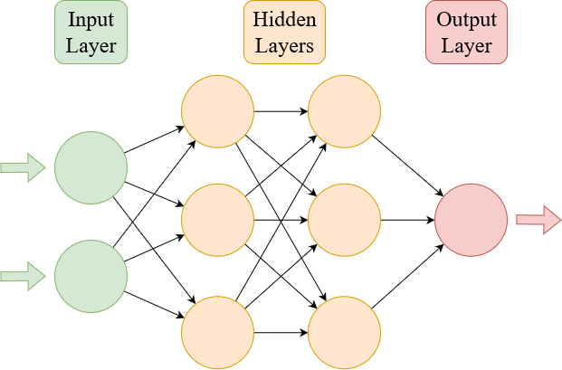

### Page 11

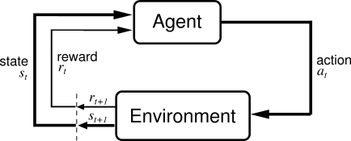

### Page 15

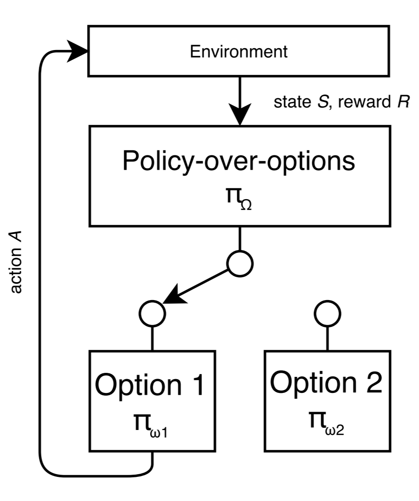

### Page 16

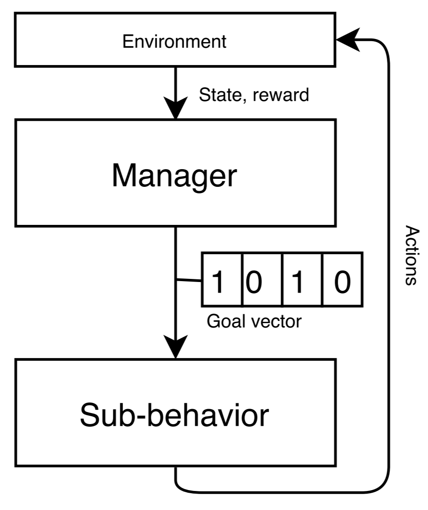

### Page 20

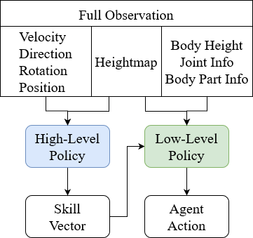

### Page 22

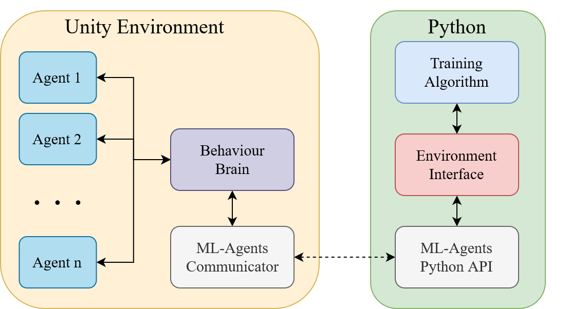

### Page 24

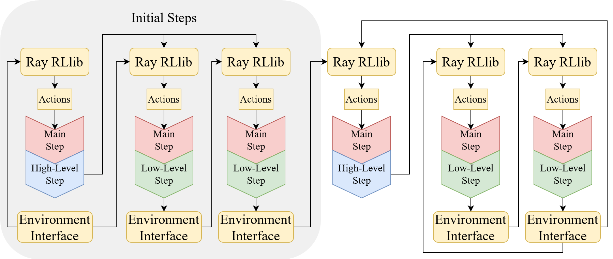

### Page 28

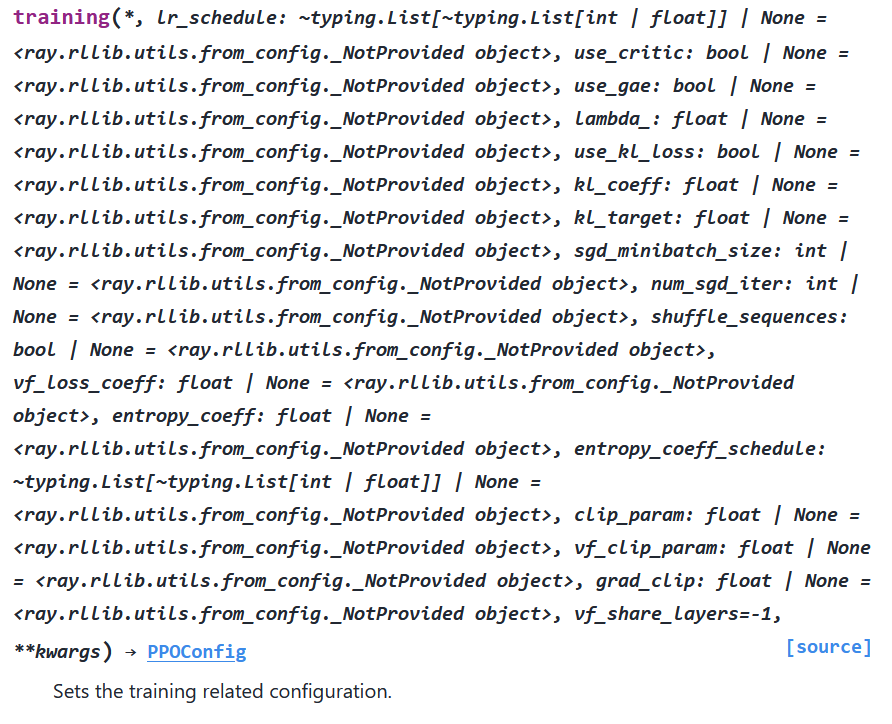

### Page 30

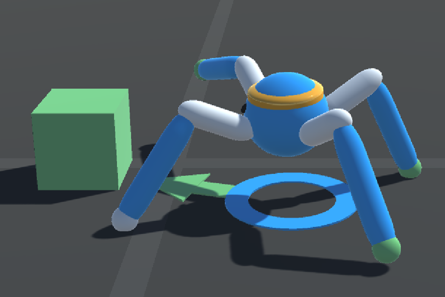
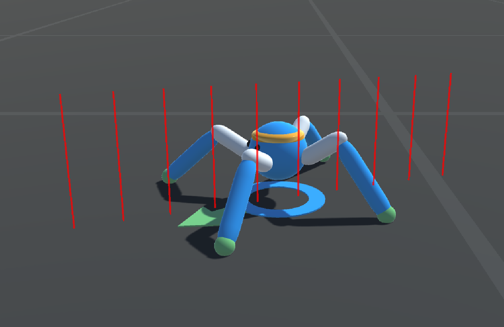

### Page 31

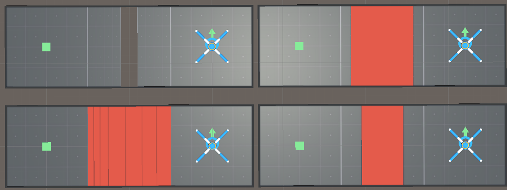

### Page 36

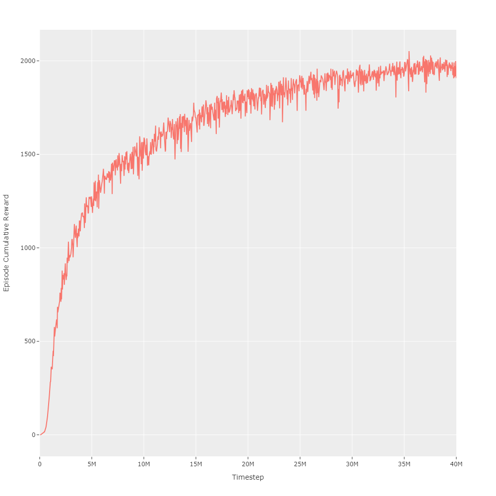
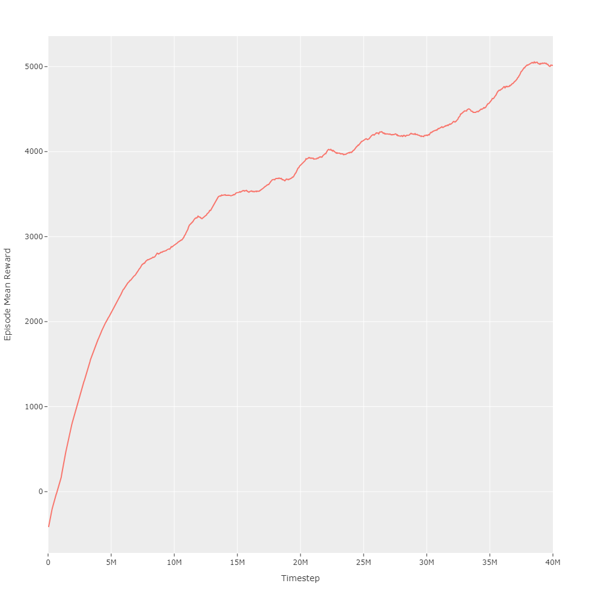

### Page 37

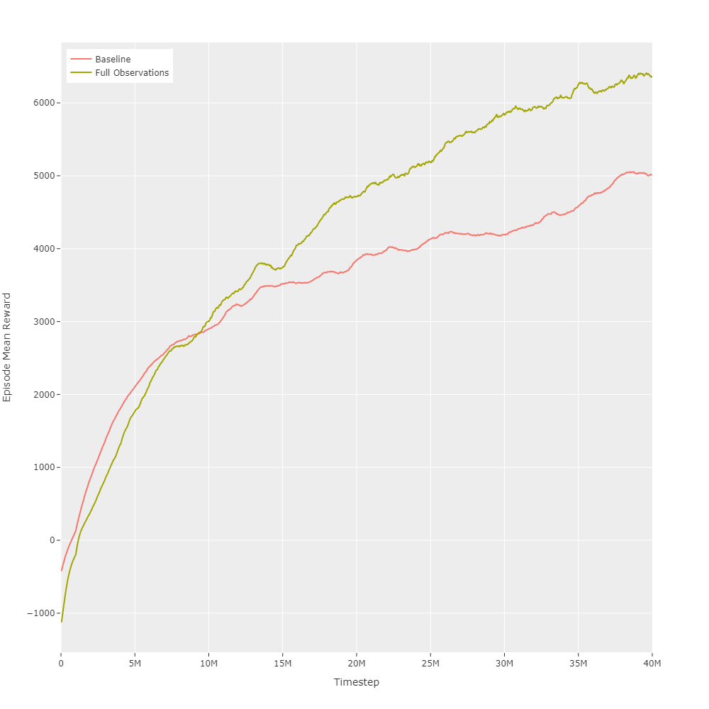

### Page 38

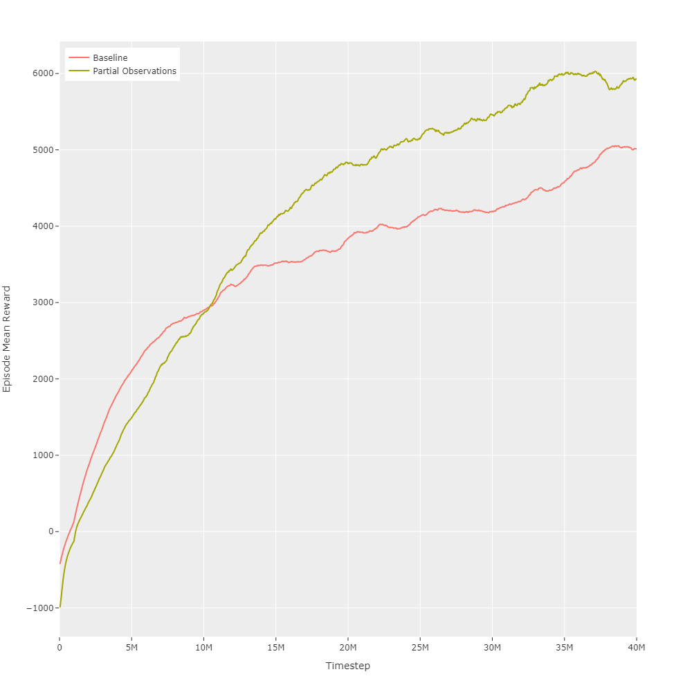

### Page 40

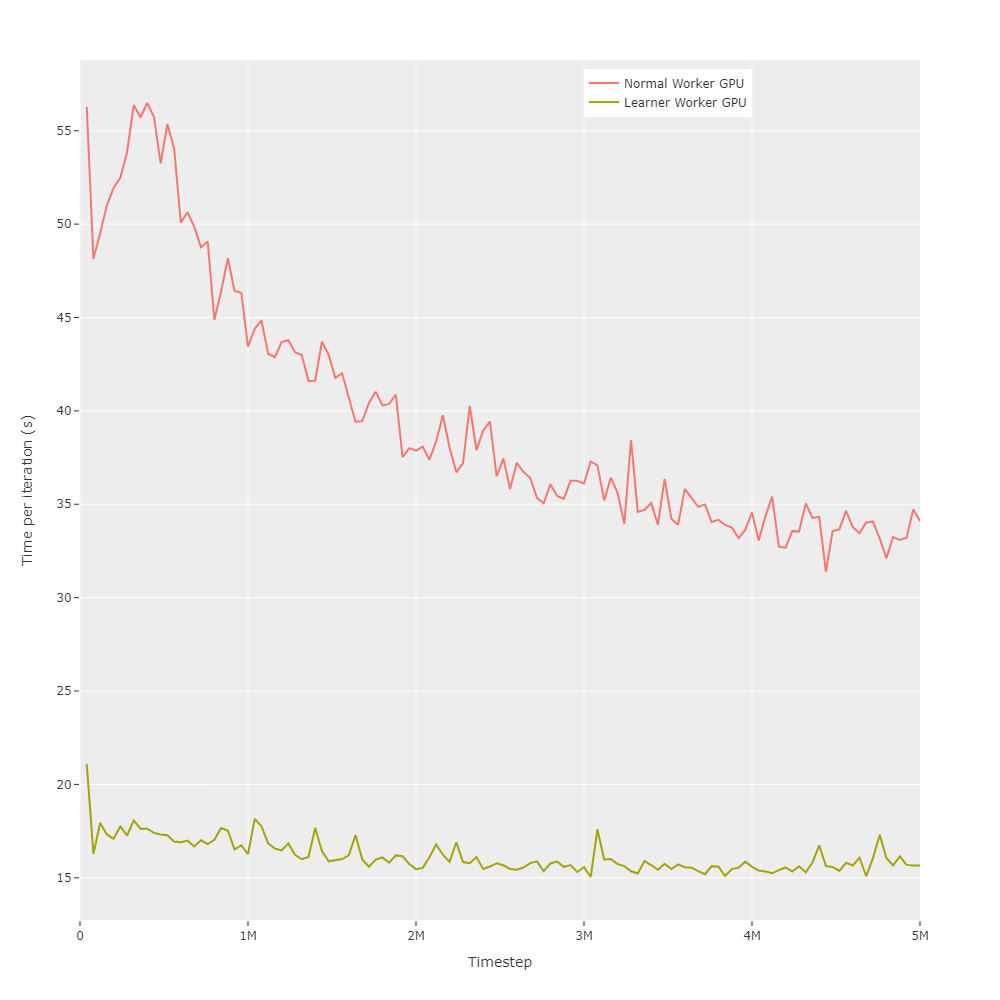
