Data-Efficient Hierarchical Reinforcement Learning
OfirNachum ShixiangGu∗
GoogleBrain GoogleBrain
ofirnachum@google.com shanegu@google.com
HonglakLee SergeyLevine†
GoogleBrain GoogleBrain
honglak@google.com slevine@google.com
Abstract
Hierarchical reinforcement learning (HRL) is a promising approach to extend
traditional reinforcement learning (RL) methods to solve more complex tasks.
Yet,themajorityofcurrentHRLmethodsrequirecarefultask-specificdesignand
on-policytraining,makingthemdifficulttoapplyinreal-worldscenarios. Inthis
paper,westudyhowwecandevelopHRLalgorithmsthataregeneral,inthatthey
donotmakeonerousadditionalassumptionsbeyondstandardRLalgorithms,and
efficient,inthesensethattheycanbeusedwithmodestnumbersofinteraction
samples,makingthemsuitableforreal-worldproblemssuchasroboticcontrol. For
generality,wedevelopaschemewherelower-levelcontrollersaresupervisedwith
goalsthatarelearnedandproposedautomaticallybythehigher-levelcontrollers.
To address efficiency, we propose to use off-policy experience for both higher-
andlower-leveltraining. Thisposesaconsiderablechallenge,sincechangesto
thelower-levelbehaviorschangetheactionspaceforthehigher-levelpolicy,and
we introduce an off-policy correction to remedy this challenge. This allows us
to take advantage of recent advances in off-policy model-free RL to learn both
higher-andlower-levelpoliciesusingsubstantiallyfewerenvironmentinteractions
thanon-policyalgorithms. WetermtheresultingHRLagentHIROandfindthat
itisgenerallyapplicableandhighlysample-efficient. Ourexperimentsshowthat
HIROcanbeusedtolearnhighlycomplexbehaviorsforsimulatedrobots,such
as pushing objects and utilizing them to reach target locations,1 learning from
onlyafewmillionsamples,equivalenttoafewdaysofreal-timeinteraction. In
comparisons with a number of prior HRL methods, we find that our approach
substantiallyoutperformspreviousstate-of-the-arttechniques.2
1 Introduction
Deepreinforcementlearning(RL)hasmadesignificantprogressonarangeofcontinuouscontrol
tasks,suchaslocomotionskills[39,27,18],learningdexterousmanipulationbehaviors[36],and
trainingrobotarmsforsimplemanipulationtasks[13,46]. However,mostofthesebehaviorsare
inherentlyatomic: theyrequireperformingsomesimpleskill,eitherepisodicallyorcyclically,and
rarelyinvolvecomplexmulti-levelreasoning,suchasutilizingavarietyoflocomotionbehaviorsto
accomplishcomplexgoalsthatrequiremovement,objectinteraction,anddiscretedecision-making.
∗AlsoatUniversityofCambridge;MaxPlanckInstituteofIntelligentSystems.
†AlsoatUCBerkeley.
1Seevideosathttps://sites.google.com/view/efficient-hrl
2Find open-source code at https://github.com/tensorflow/models/tree/master/research/
efficient-hrl
32ndConferenceonNeuralInformationProcessingSystems(NIPS2018),Montréal,Canada.
8102
tcO
5
]GL.sc[
4v69280.5081:viXra

Figure 1: The Ant Gather task along with the three hierarchical navigation tasks we consider:
AntMaze,AntPush,andAntFall. Theant(magentarectangle)isrewardedforapproachingthe
targetlocation(greenarrow). Asuccessfulpolicymustperformacomplexsequenceofdirectional
movementand,insomecases,interactwithobjectsinitsenvironment(redblocks);e.g.,pushingaside
anobstacle(secondfromright)orusingablockasabridge(right).InourHRLmethod,ahigher-level
policyperiodicallyproducesgoalstates(correspondingtodesiredpositionsandorientationsofthe
antanditslimbs),whichthelower-levelpolicyisrewardedtomatch(bluearrow).
Hierarchicalreinforcementlearning(HRL),inwhichmultiplelayersofpoliciesaretrainedtoperform
decision-makingandcontrolatsuccessivelyhigherlevelsoftemporalandbehavioralabstraction,has
longheldthepromisetolearnsuchdifficulttasks[7,32,43,4]. Byhavingahierarchyofpolicies,
ofwhichonlythelowestappliesactionstotheenvironment,oneisabletotrainthehigherlevels
to plan over a longer time scale. Moreover, if the high-level actions correspond to semantically
differentlow-levelbehavior,standardexplorationtechniquesmaybeappliedtomoreappropriately
explore a complex environment. Still, there is a large gap between the basic definition of HRL
and thepromise itholds to successfullysolvecomplex environments. To achieve the benefitsof
HRL, there are a number of questions that one must suitably answer: How should one train the
lower-levelpolicytoinducesemanticallydistinctbehavior? Howshouldthehigh-levelpolicyactions
bedefined? Howshouldthemultiplepoliciesbetrainedwithoutincurringaninordinateamount
of experience collection? Previous work has attempted to answer these questions in a variety of
waysandhasprovidedencouragingsuccesses[48,10,11,19,40]. However,manyofthesemethods
lackgenerality,requiringsomedegreeofmanualtask-specificdesign,andoftenrequireexpensive
on-policy training that is unable to benefit from advances in off-policy model-free RL, which in
recentyearshasdrasticallybroughtdownsamplecomplexityrequirements[12,16,3].
Forgenerality,weproposetotakeadvantageofthestateobservationprovidedbytheenvironment
totheagent,whichinlocomotiontaskscanincludethepositionandorientationoftheagentandits
limbs. Weletthehigh-levelactionsbegoalstatesandrewardthelower-levelpolicyforperforming
actionswhichyielditanobservationclosetomatchingthedesiredgoal. Inthisway,ourHRLsetup
doesnotrequireamanualormulti-taskdesignandisfullygeneral.
Thisideaofahigher-levelpolicycommandingalower-levelpolicytomatchobservationstoagoal
statehasbeenproposedbefore[7,48]. Unlikepreviouswork,whichrepresentedgoalsandrewarded
matching observations within a learned embedding space, we use the state observations in their
rawform. Thissignificantlysimplifiesthelearning,andinourexperiments,weobservesubstantial
benefitsforthissimplerapproach.
While these goal-proposing methods are very general, they require training with on-policy RL
algorithms,whicharegenerallylessefficientthanoff-policymethods[15,31]. On-policytraining
hasbeenattractiveinthepastsince,outsideofdiscretecontrol,off-policymethodshavebeenplagued
withinstability[15],whichisamplifiedwhentrainingmultiplepoliciesjointly,asinHRL.Otherthan
instability,off-policytrainingposesanotherchallengethatisuniquetoHRL.Sincethelower-level
policyischangingunderneaththehigher-levelpolicy, asampleobservedforacertainhigh-level
actioninthepastmaynotyieldthesamelow-levelbehaviorinthefuture,andthusnotbeavalid
experiencefortraining. Thisamountstoanon-stationaryproblemforthehigher-levelpolicy. We
remedythisissuebyintroducinganoff-policycorrection,whichre-labelsanexperienceinthepast
withahigh-levelactionchosentomaximizetheprobabilityofthepastlower-levelactions.Inthisway,
weareabletousepastexperiencefortrainingthehigher-levelpolicy,takingadvantageofprogress
madeinrecentyearstoprovidestable,robust,andgeneraloff-policyRLmethods[12,31,3].
Insummary,weintroduceamethodtotrainamulti-levelHRLagentthatstandsoutfromprevious
methodsbybeingbothgenerallyapplicableanddata-efficient. Ourmethodachievesgeneralityby
trainingthelower-levelpolicytoreachgoalstateslearnedandinstructedbythehigher-levels. In
contrasttopriorworkthatoperatesinthisgoal-settingmodel,weusestatesasgoalsdirectly,which
allowsforsimpleandfasttrainingofthelowerlayer. Moreover,byusingoff-policytrainingwith
2

ournoveloff-policycorrection,ourmethodisextremelysample-efficient. Weevaluateourmethod
on several difficult environments. These environments require the ability to perform exploratory
navigationaswellascomplexsequencesofinteractionwithobjectsintheenvironment(seeFigure1).
Whilethesetasksareunsolvablebyexistingnon-HRLmethods, wefindthatourHRLsetupcan
learnsuccessfulpolicies. WhencomparedtootherpublishedHRLmethods,wealsoobservethe
superiorityofourmethod,intermsofbothfinalperformanceandspeedoflearning. Inonlyafew
millionexperiencesamples,ouragentsareabletoadequatelysolvepreviouslyunapproachabletasks.
2 Background
WeadoptthestandardcontinuouscontrolRLsetting,inwhichanagentinteractswithanenvironment
overperiodsoftimeaccordingtoabehaviorpolicyµ. Ateachtimestept,theenvironmentproduces
astateobservation s
t
∈ Rds.Theagentthensamplesanactiona
t
∼ µ(s
t
),a
t
∈ Rdaandapplies
theactiontotheenvironment. TheenvironmentthenyieldsarewardR sampledfromanunknown
t
rewardfunctionR(s ,a )andeitherterminatestheepisodeatstates ortransitionstoanewstate
t t T
s sampledfromanunknowntransitionfunctionf(s ,a ). Theagent’sgoalistomaximizethe
t+1 t t
(cid:104) (cid:105)
expectedfuturediscountedrewardE (cid:80)T−1γiR ,where0 ≤ γ < 1isauser-
s0:T,a0:T−1,R0:T−1 i=0 i
specifieddiscountfactor. Awell-performingRLalgorithmwilllearnagoodbehaviorpolicyµfrom
(ideallyasmallnumberof)interactionswiththeenvironment.
2.1 Off-PolicyTemporalDifferenceLearning
Temporal difference learning is a powerful paradigm in RL, in which a policy may be learned
efficientlyfromstate-action-rewardtransitiontuples(s ,a ,R ,s )collectedfrominteractions
t t t t+1
withtheenvironment. InourHRLmethod,weutilizetheTD3learningalgorithm[12],avariantof
thepopularDDPGalgorithmforcontinuouscontrol[27].
InDDPG,adeterministicneuralnetworkpolicyµ islearnedalongwithitscorrespondingstate-
φ
actionQ-functionQ byperforminggradientupdatesonparametersetsφandθ. TheQ-function
θ
representsthefuturevalueoftakingaspecificactiona startingfromastates . Accordingly,itis
t t
trainedtominimizetheaverageBellmanerroroverallsampledtransitions,whichisgivenby
E(s ,a ,s )=(Q (s ,a )−R −γQ (s ,µ (s )))2. (1)
t t t+1 θ t t t θ t+1 φ t+1
ThepolicyisthentrainedtoyieldactionswhichmaximizetheQ-valueateachstate. Thatis,µ is
φ
trainedtomaximizeQ (s ,µ (s ))overalls collectedfrominteractionswiththeenvironment.
θ t φ t t
WenotethatalthoughDDPGtrainsadeterministicpolicyµ ,itsbehaviorpolicy,whichisusedto
φ
collectexperienceduringtrainingisaugmentedwithGaussian(orOrnstein-Uhlenbeck)noise[27].
Therefore,actionsarecollectedasa ∼N(µ (s ),σ)forfixedstandarddeviationσ,whichwewill
t φ t
shortenasa ∼µ (s ). Wewilltakeadvantageofthefactthatthebehaviorpolicyisstochasticfor
t φ t
theoff-policycorrectioninourHRLmethod. TD3[12]makesseveralmodificationstoDDPG’s
learningalgorithmtoyieldamorerobustandstableprocedure. Itsmainmodificationisusingan
ensembleoverQ-valuemodelsandaddingnoisetothepolicywhencomputingthetargetvaluein
Equation1.
3 GeneralandEfficientHierarchicalReinforcementLearning
In this section, we present our framework for learning hierarchical policies, HIRO: HIerarchical
ReinforcementlearningwithOff-policycorrection. Wemakeuseofparameterizedrewardfunctions
to specify a potentially infinite set of lower-level policies, each of which is trained to match its
observed states s to a desired goal. The higher-level policy chooses these goals for temporally
t
extendedperiods,andusesanoff-policycorrectiontoenableittousepastexperiencecollectedfrom
previous,differentinstantiationsofthelower-levelpolicy.
3.1 HierarchyofTwoPolicies
We extend the standard RL setup to a hierarchical two-layer structure, with a lower-level policy
µloandahigher-levelpolicyµhi(seeFigure2). Thehigher-levelpolicyoperatesatacoarserlayer
3

|     | μhi |     |     |     | μhi |     | 1. Collectexperiencest,gt,at,Rt,.... |     |     |     |
| --- | --- | --- | --- | --- | --- | --- | ------------------------------------ | --- | --- | --- |
l o
h . . . h 2. T r a in µ w i th e xp e rien c e tra ns ition s
|     | g   | g   | g     |     | g   |     | ( s , gt,a | , rt,s 1,gt | )   | u s ing g a s |
| --- | --- | --- | ----- | --- | --- | --- | ---------- | ----------- | --- | ------------- |
|     | 0   | 1   | c - 1 |     | c   |     | t          | t t +       | + 1 | t             |
additionalstateobservationandrewardgivenby
|     |                                     |                                                          |         |     |     |                                                                                           | g o a l - co n d                              | i ti o n ed fu n       | c tion r =             |              |
| --- | ----------------------------------- | -------------------------------------------------------- | ------- | --- | --- | ----------------------------------------------------------------------------------------- | --------------------------------------------- | ---------------------- | ---------------------- | ------------ |
|     | μlo                                 | μlo                                                      | μlo     |     | μlo | O f f - p o li c y  t r a i n i n g   w i t h                                             |                                               |                        | t                      |              |
|     |                                     | . . .                                                    |         |     |     | re r s e p w e a c r t d   t s o     r g (s o a ,   l g - c t, o   a n d ,   i s tio n 1) | e . d  r ( s , g ,                            | a , s )                | = − | |s t+gt−st+1||2. |              |
|     |                                     |                                                          |         |     |     | t t t +                                                                                   | t t                                           | t t+ 1                 |                        |              |
|     | s 0 s 1                             |                                                          | s c - 1 | s c |     |                                                                                           |                                               |                        |                        |              |
|     | a                                   | a                                                        | a       |     | a   |                                                                                           | 3. Train µhi                                  | on temporally-extended |                        | experience   |
|     | 0                                   | 1                                                        | c - 1   |     | c   |                                                                                           | (st,g˜t,(cid:80)Rt:t+c−1,st+c),               |                        |                        | g˜t          |
|     |                                     |                                                          |         |     |     | Principled off-policy                                                                     |                                               |                        |                        | where is re- |
|     |                                     | .   .   .                                                |         |     |     | trai n i n g  w i t h   g oal                                                             | labelledhigh-levelactiontomaximizeprobability |                        |                        |              |
|     |         Environment                 |                                                          |         |     |     | r e - la b e l li n g .                                                                   |                                               |                        |                        |              |
ofpastlow-levelactionsat:t+c−1.
4. Repeat.
|     | R   | R   | R   |     | R   |     |     |     |     |     |
| --- | --- | --- | --- | --- | --- | --- | --- | --- | --- | --- |
|     | 0   | 1   | c-1 |     | c   |     |     |     |     |     |
Figure2: ThedesignandbasictrainingofHIRO.Thelower-levelpolicyinteractsdirectlywiththe
environment. Thehigher-levelpolicyinstructsthelower-levelpolicyviahigh-levelactions,orgoals,
∈Rds
g whichitsamplesaneweverycsteps. Onintermediatesteps,afixedgoaltransitionfunction
t
hdeterminesthenextstep’sgoal. Thegoalsimplyinstructsthelower-levelpolicytoreachspecific
states,whichallowsthelower-levelpolicytoeasilylearnfromprioroff-policyexperience.
Figure 3: An example of a higher-level policy producing goals in terms of desired observations,
whichinthistaskcorrespondtopositionsandorientationsofallofthejointsofaquadrupedalrobot
(includingrootposition).Thelower-levelpolicyhasdirectcontroloftheagent(pink),andisrewarded
formatchingthepositionandorientationofitstorsoandeachlimbtothegoal(bluerectangle,raised
forvisibility). Inthisway,thetwo-layerpolicycanperformacomplextaskinvolvingasequenceof
| movementsandinteractions;e.g. |     |     |     | pushingablockasidetoreachatarget(green). |     |     |     |     |     |     |
| ----------------------------- | --- | --- | --- | ---------------------------------------- | --- | --- | --- | --- | --- | --- |
ofabstractionandsetsgoalstothelower-levelpolicy,whichcorresponddirectlytostatesthatthe
lower-levelpolicyattemptstoreach. Ateachtimestept,theenvironmentprovidesanobservation
states .Thehigher-levelpolicyobservesthestateandproducesahigh-levelaction(orgoal)g ∈Rds
|     | t   |     |     |     |     |     |     |     |     | t   |
| --- | --- | --- | --- | --- | --- | --- | --- | --- | --- | --- |
byeithersamplingfromitspolicyg ∼ µhi whent ≡ 0 (mod c),orotherwiseusingafixedgoal
t
transitionfunctiong t =h(s t−1 ,g t−1 ,s t )(whichinthesimplestcasecanbeapass-throughfunction,
althoughwewillconsideraslightvariationinourspecificdesign).Thisprovidestemporalabstraction,
sincehigh-leveldecisionsviaµhiaremadeonlyeverycsteps. Thelower-levelpolicyµloobserves
thestates andgoalg andproducesalow-levelatomicactiona ∼ µlo(s ,g ),whichisapplied
|     | t   | t   |     |     |     |     | t   | t   | t   |     |
| --- | --- | --- | --- | --- | --- | --- | --- | --- | --- | --- |
totheenvironment. TheenvironmentthenyieldsarewardR sampledfromanunknownreward
t
functionR(s ,a )andtransitionstoanewstates sampledfromanunknowntransitionfunction
|     | t   | t   |     |     |     | t+1 |     |     |     |     |
| --- | --- | --- | --- | --- | --- | --- | --- | --- | --- | --- |
f(s t ,a t ).
Thehigher-levelcontrollerprovidesthelower-levelwithanintrinsicrewardr =r(s ,g ,a ,s ),
|     |     |     |     |     |     |     |     | t   | t   | t t t+1 |
| --- | --- | --- | --- | --- | --- | --- | --- | --- | --- | ------- |
using a fixed parameterized reward function r. The lower-level policy will store the expe-
rience (s ,g ,a ,r ,s ,h(s ,g ,s )) for off-policy training. The higher-level policy col-
|     | t t | t t t+1 | t   | t t+1 |     |     |     |     |     |     |
| --- | --- | ------- | --- | ----- | --- | --- | --- | --- | --- | --- |
lects the environment rewards R and, every c time steps, stores the higher-level transition
t
| (s  | t:t+c−1 ,g t:t+c−1 | ,a t:t+c−1 | ,R t:t+c−1 | ,s  | t+c )foroff-policytraining. |     |     |     |     |     |
| --- | ------------------ | ---------- | ---------- | --- | --------------------------- | --- | --- | --- | --- | --- |
3.2 ParameterizedRewards
Ourhigher-levelpolicyproducesgoalsg
t indicatingdesiredrelativechangesinstateobservations.
Thatis,atstept,thehigher-levelpolicyproducesagoalg t ,indicatingitsdesireforthelower-level
agenttotakeactionsthatyielditanobservations thatisclosetos +g . Althoughsomestate
|     |     |     |     |     |     | t+c |     | t t |     |     |
| --- | --- | --- | --- | --- | --- | --- | --- | --- | --- | --- |
dimensions(e.g.,thepositionofthequadrupedalrobotinFigure3)aremorenaturalasgoalsubspaces,
wechosethismoregenericgoalrepresentationtomakeitbroadlyapplicable,withoutanymanual
designofgoalspaces,primitives,orcontrollabledimensions. Thismakesourmethodgeneraland
4

easytoapplytonewproblemsettings. Tomaintainthesameabsolutepositionofthegoalregardless
ofstatechange,thegoaltransitionmodelhisdefinedas
h(s ,g ,s )=s +g −s . (2)
t t t+1 t t t+1
Wedefinetheintrinsicrewardasaparameterizedrewardfunctionbasedonthedistancebetweenthe
currentobservationandthegoalobservation:
r(s ,g ,a ,s )=−||s +g −s || . (3)
t t t t+1 t t t+1 2
This rewards the lower-level policy for taking actions that yield observations that are close to
the desired value s +g . In our evaluations on simulated ant locomotion, we use all positional
t t
observationsastherepresentationforg ,withoutdistinguishingbetweenthe(x,y,z)rootposition
t
orthejoints,makingforagenericandbroadlyapplicablechoiceofgoalspace. Therewardrand
transitionfunctionharecomputedonlywithrespecttothesepositionalobservations. SeeFigure3
foranexampleofthegoalsg chosenduringasuccessfulnavigationofacomplexenvironment.
t
The lower-level policy may be trained using standard methods by simply incorporating g as an
t
additionalinputintothevalueandpolicymodels. Forexample,inDDPG,theequivalentobjectiveto
Equation1intermsoflower-levelQ-valuefunctionQloistominimizetheerror
θ
(Qlo(s ,g ,a )−r(s ,g ,a ,s )−γQlo(s ,g ,µlo(s ,g )))2, (4)
θ t t t t t t t+1 θ t+1 t+1 φ t+1 t+1
foralltransitions(s ,g ,a ,s ,g ). ThepolicyµlowouldbetrainedtomaximizetheQ-value
t t t t+1 t+1 φ
Qlo(s ,g ,µlo(s ,g ))forallsampledstate-goaltuples(s ,g ).
θ t t φ t t t t
Parameterizedrewardsarenotanewconcept,andhavebeenstudiedpreviously[38,20]. Theyarea
naturalchoiceforagenerallyapplicableHRLmethodandhavethereforeappearedascomponents
of other HRL methods [48, 24, 33, 26]. A significant distinction between our method and these
priorapproachesisthatwedirectlyusethestateobservationasthegoal,andchangesinthestate
observationastheactionspaceforthehigher-levelpolicy,incontrasttopriormethodsthatmust
trainthegoalrepresentation. Thisallowsthelower-levelpolicytobeginreceivingrewardsignals
immediately,evenbeforethelower-levelpolicyhasfiguredouthowtoreachthegoalandbeforethe
task’sextrinsicrewardprovidesanymeaningfulsupervision. Inourexperiments(Section5),wefind
thatthisproducessubstantiallybetterresults.
3.3 Off-PolicyCorrectionsforHigher-LevelTraining
Whileanumberofpriorworkshaveproposedtwo-levelHRLarchitecturesthatinvolvesomesortof
goalsetting,suchdesignsinpreviousworkgenerallyrequireon-policytraining[48]. Thisisbecause
thechangingbehaviorofthelower-levelpolicycreatesanon-stationaryproblemforthehigher-level
policy,andoldoff-policyexperiencemayexhibitdifferenttransitionsconditionedonthesamegoals.
However,forHRLmethodstobeapplicabletoreal-worldsettings,theymustbesample-efficient,
andoff-policyalgorithms(oftenbasedonsomevariantofQ-functionlearning)generallyexhibit
substantiallybettersampleefficiencythanon-policyactor-criticorpolicygradientvariants. Inthis
section,wedescribehowweaddressthechallengeofoff-policytrainingofthehigher-levelpolicy.
Wewouldliketotakethehigher-leveltransitiontuples(s ,g ,a ,R ,s ),
t:t+c−1 t:t+c−1 t:t+c−1 t:t+c−1 t+c
wherex denotesthesequencex ,...,x ,whicharecollectedbythehigher-levelpolicy
t:t+c−1 t t+c−1
(cid:80)
and convert them to state-action-reward transitions (s ,g , R ,s ) that can be pushed
t t t:t+c−1 t+c
intothereplaybufferofanystandardoff-policyRLalgorithm. However,sincetransitionsobtained
frompastlower-levelcontrollersdonotaccuratelyreflecttheactions(andthereforeresultantstates
s )thatwouldoccurifthesamegoalwereusedwiththecurrentlower-levelcontroller,wemust
t+1:t+c
introduceacorrectionthattranslatesoldtransitionsintoonesthatagreewiththecurrentlower-level
controller.
(cid:80)
Ourmainobservationisthatthegoalg ofapasthigh-leveltransition(s ,g , R ,s )may
t t t t:t+c−1 t+c
bechangedtomaketheactualobservedactionsequencemorelikelytohavehappenedwithrespect
tothecurrentinstantiationofµlo. Thehigh-levelactiong whichinthepastinducedalow-level
t
behaviora ∼µlo(s ,g )maybere-labeledtoagoalg˜ whichislikelytoinduce
t:t+c−1 t:t+c−1 t:t+c−1 t
thesamelow-levelbehaviorwiththecurrentinstantiationofthelower-levelpolicy. Thus,wepropose
(cid:80)
toremedytheoff-policyissuebyre-labelingthehigh-leveltransition(s ,g , R ,s )with
t t t:t+c−1 t+c
adifferenthigh-levelactiong˜ chosentomaximizetheprobabilityµlo(a |s ,g˜ ),
t t:t+c−1 t:t+c−1 t:t+c−1
5

wheretheintermediategoalsg˜ arecomputedusingthefixedgoaltransitionfunctionh. In
t+1:t+c−1
effect,eachtimewemodifythelow-levelpolicyµlo,wewouldliketoanswerthequestion: forwhich
goalswouldthisnewcontrollerhavetakenthesameactionsastheoldone?
MostRLalgorithmswilluserandomaction-spaceexplorationtoselectactions,whichmeansthat
thebehaviorpolicy(evenfordeterministicalgorithmssuchasDDPG[27])isstochasticandthelog
probabilitylogµlo(a |s ,g˜ )maybecomputedas
t:t+c−1 t:t+c−1 t:t+c−1
t+c−1
1 (cid:88)
logµlo(a |s ,g˜ )∝− ||a −µlo(s ,g˜)||2+const. (5)
t:t+c−1 t:t+c−1 t:t+c−1 2 i i i 2
i=t
Toapproximatelymaximizethisquantityinpractice,wecomputethislogprobabilityforanumberof
goalsg˜,andchoosethemaximalgoaltore-labeltheexperience. Inourimplementation,wecalculate
t
thequantityoneightcandidategoalssampledrandomlyfromaGaussiancenteredats −s . We
t+c t
alsoincludetheoriginalgoalg andagoalcorrespondingtothedifferences −s inthecandidate
t t+c t
set, to have a total of 10 candidates. This provides a suitably diverse set of g˜ to approximately
t
solvetheargmaxofEquation5,whilealsobiasingtheresulttobeclosertocandidatesg˜ which
t
webelievetobeappropriategivenourknowledgeoftheproblem(seeadditionalimplementation
detailsintheAppendix). Ourapproachhereisonlyanapproximation,andweelaborateonpossible
alternativeoff-policycorrectionsintheAppendix.
4 RelatedWork
Discoveringmeaningfulandeffectivehierarchiesofpoliciesisalongstandingresearchproblem
in RL [7, 32, 43, 8, 2]. Classically, the work on HRL focused on discrete state domains, where
state visitation and transition statistics can be used to construct heuristic sub-goals for low-level
policies[41,29,5]. Theoptionsframework[43,35],apopularformulationforHRL,proposesa
terminationpolicyforeachsub-policy(option). Whilethetraditionaloptionsframeworkrelieson
priorknowledgefordesigningoptions,[2]recentlyderivedanactor-criticalgorithmforlearning
them jointly with the higher-level policy. This option-critic architecture [2] is an important step
towardend-to-endHRL;however,suchapproachesareoftenpronetolearningeitherasub-policythat
terminateseverytimestep,oroneeffectivesub-policythatrunsthroughthewholeepisode.Inpractice,
regularizersareessentialtolearnmultipleeffectiveandtemporallyabstractedsub-policies[2,17,47].
Toguaranteelearningusefulsub-policies,recentworkhasstudiedapproachesthatprovideauxiliary
rewardsforthelow-levelpolicies[5,19,24,44,10]. Theseapproachesrelyonhand-craftedrewards
based on prior domain knowledge [23, 19, 24, 44] or diversity-encouraging rewards like mutual
information[6,10]. Anumberofworkshavesuggestedthatsemanticallydistinctbehaviorcanbe
inducedbytrainingonasetofdiversetasks,andhavesuggestedpre-trainingthelower-levelpolicy
onsuchtasks[19,10],ortrainingthemulti-levelhierarchicalpolicyinamulti-tasksetup[11,40].
However, having access to a collection of suitably similar tasks is a luxury which is not always
available and may require hand-design. Our method uses a generic reward that is specified with
respecttothestatespace,andthereforeavoidsdesigningvariousrewardsormultipletasks.
Another difference from most HRL work [10, 11] is that we use off-policy learning, leading to
significant improvements in sample efficiency. In end-to-end HRL, off-policy RL creates a non-
stationaryproblemforthehigher-levelpolicy,sincethelower-levelisconstantlychanging. Weare
awareofonlyonerecentworkwhichappliesHRLinanoff-policysetting[26]. Asinourwork,the
authorsdeviseahierarchicalstructureinwhichalower-levelpolicyistrainedtoreachobservations
directedbyahigher-levelpolicy. Themultiplelayersofpoliciesaretrainedjointlyinanoff-policy
manner,whileignoringthenon-stationarityproblemwhichwerealizeisakeyissueforoff-policy
HRL.Accordingly,wederiveandtestanoff-policycorrectioninthecontextofHRL,andempirically
showthatthistechniqueiscrucialtosuccessfullytrainhierarchicalpoliciesoncomplextasks.
OurworkisrelatedtoFeUdalNetworks(FuN)[48],originallyinspiredfromfeudalRL[7]. FuN
alsomakesuseofgoalsandaparameterizedlower-levelreward. Unlikeourmethod,FuNrepresents
thegoalsandcomputestherewardsintermsofalearnedstaterepresentation. Inourexperiments,
wefoundthistechniquetounder-performcomparedtoourapproach,whichusesthestateinitsraw
form. Wefindthatthishasanumberofbenefits. Forone,thelower-levelpoliciescanimmediately
beginreceivingintrinsicrewardsforreachinggoalsevenbeforethehigher-levelpolicyreceivesa
meaningfulsupervisionsignalfromthetaskreward. Additionally,therepresentationisgenericand
6

AntGather AntMaze AntPush AntFall
HIRO 3.02±1.49 0.99±0.01 0.92±0.04 0.66±0.07
FuNrepresentation 0.03±0.01 0.0±0.0 0.0±0.0 0.0±0.0
FuNtransitionPG 0.41±0.06 0.0±0.0 0.56±0.39 0.01±0.02
FuNcossimilarity 0.85±1.17 0.16±0.33 0.06±0.17 0.07±0.22
FuN 0.01±0.01 0.0±0.0 0.0±0.0 0.0±0.0
SNN4HRL 1.92±0.52 0.0±0.0 0.02±0.01 0.0±0.0
VIME 1.42±0.90 0.0±0.0 0.02±0.02 0.0±0.0
Table1: Performanceofthebestpolicyobtainedin10Mstepsoftraining,averagedover10randomly
seededtrialswithstandarderror. ComparisonsaretovariantsofFuN[48], SNN4HRL[10], and
VIME[21]. Evenafterextensivehyper-parametersearches,wewereunabletoachievecompetitive
performancefromthebaselinesonanyofourtasks. IntheAppendix,weincludetheonlycompetitive
resultwecouldachieve–VIMEonAntGathertrainedforamuchlongeramountoftime.
simpletoobtain. Goal-conditionedvaluefunctions[28,42,38,1,34]areactivelyexploredoutside
thecontextofHRL.ContinuedprogressinthisfieldmaybeusedtofurtherimproveHRLmethods.
5 Experiments
Inourexperiments,wecompareHIROmethodtopriortechniques,andablatethevariouscomponents
to understand their importance. Our experiments are conducted on a set of challenging environ-
mentsthatrequireacombinationoflocomotionandobjectmanipulation. Visualizationsofthese
environmentsareshowninFigure1. SeetheAppendixformoredetailsoneachenvironment.
AntGather. Theantgathertaskisastandardtaskintroducedin[9]. Asimulatedantmustnavigateto
gatherappleswhileavoidingbombs,whicharerandomlyplacedintheenvironmentatthebeginning
ofeachepisode. Theantreceivesarewardof1foreachappleandarewardof−1foreachbomb.
AntMaze. Forthefirstdifficultnavigationtaskweadaptedthemazeenvironmentintroducedin[9].
Inthisenvironmentanantmustnavigatetovariouslocationsina‘⊃’-shapedcorridor. Weincrease
thedefaultsizeofthemazesothatthecorridorisofwidth8. Inourevaluation,weassessthesuccess
rateofthepolicywhenattemptingtoreachtheendofthemaze.
AntPush. Inthistaskweintroduceamovableblockwhichtheagentcaninteractwith. Agreedy
agentwouldmoveforward,unknowinglypushingthemovableblockuntilitblocksitspathtothe
target. Tosuccessfullyreachthetarget,theantmustfirstmovetotheleftaroundtheblockandthen
pushtheblockright,clearingthepathtowardsthetargetlocation.
AntFall. Thistaskextendsthenavigationtothreedimensions. Theantisplacedonaraisedplatform,
withthetargetlocationdirectlyinfrontofitbutseparatedbyachasmwhichitcannottraverseby
itself. Luckily,amovableblockisprovidedonitsright. Tosuccessfullyreachthetarget,theantmust
firstwalktotheright,pushtheblockintothechasm,andthensafelycross.
5.1 ComparativeAnalysis
The primary comparisons to previous HRL methods are done with respect to FeUdal Networks
(FuN)[48],stochasticneuralnetworksforHRL(SNN4HRL)[10],andVIME[21](seeTable1,and
Appendixformoredetails). Asthesealgorithmsoftencomewithproblem-specificdesignchoices,
wemodifyeachforfairercomparisons. Intermsofproblemassumptions, ourworkisclosestto
thatofFuNwhichisapplicabletoanysingletaskwithoutspecificsub-policyrewardengineering.
MLSH[11]isanotherpromisingrecentworkforHRL;however,sinceitreliesonlearningmeaningful
sub-policiesthroughexperiencingmultiple,diverse,hand-designedtasks,wedonotincludeexplicit
comparisons. Weleaveexploringourmethodinthecontextofmulti-tasklearningforfuturework.
FeUdalNetwork(FuN).UnlikeSNN4HRLorVIME,theofficialopen-sourcecodeforFuNwasnot
availableatthetimeofsubmission,andthereforeweaimedtoreplicatekeydesignchoicesofFuN
fromouralgorithmimplementation. FuN[48]primarilyproposesfourcomponents: (1)transition
policygradient,(2)directionalcosinesimilarityrewards,(3)goalsspecifiedwithrespecttoalearned
representation,and(4)dilatedRNN.Sinceourtasksarelow-dimensionalandfullyobserved,wedo
7

| AntGather |                             |     | AntMaze |                        | AntPush |      |       | AntFall    |
| --------- | --------------------------- | --- | ------- | ---------------------- | ------- | ---- | ----- | ---------- |
| 3.0       |                             | 1.0 |         | 0.6                    |         |      | 0.5   |            |
| 2.5       |                             | 0.8 |         | 0.5                    |         |      | 0.4   |            |
| 2.0       |                             |     |         | 0.4                    |         |      |       |            |
|           |                             | 0.6 |         |                        |         |      | 0.3   |            |
| 1.5       |                             |     |         | 0.3                    |         |      |       |            |
|           |                             | 0.4 |         |                        |         |      | 0.2   |            |
| 1.0       |                             |     |         | 0.2                    |         |      |       |            |
| 0.5       |                             | 0.2 |         | 0.1                    |         |      | 0.1   |            |
| 0.0       |                             | 0.0 |         | 0.0                    |         |      | 0.0   |            |
| 0 2 4     | 6 8 10                      | 0   | 2 4 6 8 | 10                     | 0 2 4 6 | 8 10 | 0     | 2 4 6 8 10 |
|           | HIRO                        |     |         | Withpre-training       |         |      | NoHRL |            |
|           | Withlower-levelre-labelling |     |         | Nooff-policycorrection |         |      |       |            |
Figure 4: Results of our method and a number of variants on a set of difficult tasks. Each plot
showsaveragereward(forAntGather)oraveragesuccessrate(fortherest;seeAppendix)over10
randomlyseededtrials,withx-axisinmillionsofenvironmentsteps. WefindthatHIROcanperform
well across all tasks. We also note that HIRO learns rapidly; on the complex navigation tasks it
requiresonlyafewmillionenvironmentsteps(afewdaysinreal-worldinteractiontime)toachieve
goodperformance. Ourmethodisonlyout-performedonAntGatherbyavariantthatpre-trainsthe
lower-levelpolicy(thusnotneedinganoff-policycorrection).
notincludedesignchoice(4). Foreachof(1),(2),and(3),weapplyanequivalentmodificationof
ourHRLmethodandevaluateitsperformanceonthesametasks. Wealsoevaluateallmodifications
togetherasanapproximationtotheentireFuNparadigm. ResultsinTable1showthatonourtasks,
theFuNmodificationsdonotlearnwell,andotherthanAntGatheraresignificantlyout-performedby
HIRO.Inparticular,itisworthnotingthattheuseoflearnedrepresentations,ratherthanobservation
goals, leads to almost no improvement on the tasks. This suggests that the choice of using goal
observationsaslower-levelgoalssignificantlyimprovesHRLperformance,byprovidingastrong
supervisionsignaltothelower-levelpolicyrightfromthebeginningoftraining.
StochasticNeuralNetworksforHRL(SNN4HRL).SNN4HRL[10]initiallytrainsthelow-level
policywithaproxyrewardtoencouragelearningusefuldiverseexplorationpolicies,andthenthe
high-levelpolicyistrainedinthetasksofinterestwhilethelow-levelisfixed. WhileSNN4HRLcan
performbetterthanFuN,itisstillfarbehindourproposedHRLmethod.
VariationalInformationMaximizingExploration(VIME).VIME[21]isnotanHRLmethodbut
isusedasastrongbaselineinSNN4HRL.Asdiscussedin[10]andmatchedbyourresults,forthe
benchmark’sshorthorizontaskoflength500,itperformsapproximatelythesameasSNN4HRL.
Option-Critic Architecture. We extended the option-critic architecture implementation [2] for
continuousactionsandattemptedanumberofalternativevariantsbesidesthenaïvemodification
oftheoriginal. Noversionsyieldedreasonableperformanceinourtasks,andsoweomititfrom
theresults. Thisispossiblyduetodifficultyincontinuouscontroltasks,butmostimportantlythe
option-criticsub-policiesrelysolelyontheexternalreward,makinglearninggaitpoliciesdifficult.
5.2 AblativeAnalysis
InFigure4wepresentresultsofourproposedHRLmethod(“HIRO”)comparedwithanumberof
variantstounderstandtheimportanceofvariousdesignchoices:
Withlower-levelre-labelling. Weevaluatethebenefitofrecentproposals[1,25]toincreasethe
amountofdataavailabletoanagenttrainedusingaparameterizedreward(thelower-levelpolicy
inoursetup)byre-labelingexperienceswithrandomlysampledgoals. Thisallowsthelower-level
policytouseexperiencecollectedwithrespecttoaspecificgoalgtobeusedtolearnbehaviorwith
respecttoanyalternativegoalg˜.
Ourresultsshowthatthistechniquecanprovideaninitialspeed-up
in training; however, its performance is quick to plateau. We hypothesize that re-labeling goals
randomlymaymakelower-leveltrainingmoredifficult,sincethepolicymustlearntonotonlysatisfy
thegoalsprovidedbythehigher-levelagent,butinsteadalmostanyconceivablegoal. Thebenefitof
re-labelinggoalswillrequiremoreresearch,andweencouragefutureworktoinvestigatebetterways
toharnessitsbenefits.
8

Withpre-training. Inthisvariantweevaluateasimplermethodtoavoidthenon-stationaryissue
in higher-level off-policy training. Rather than correct for past experiences, we instead pre-train
thelower-levelpolicyfor2Msteps(usinggoalssampledfromaGaussian)beforefreezingitand
trainingthehigher-levelpolicyalone(thisvariantalsohastheadvantageofallowingthehigher-level
policytolearnwithrespecttoadeterministic,non-exploratorylower-levelpolicy). Intheharder
navigationtasks,wefindthatpre-trainingisdetrimental.Thisisunderstandable,asthesetasksrequire
specializationindifferentlow-levelbehaviorfordifferentstagesofthenavigation. Byallowingthe
lower-levelpolicytocontinuallylearnasnewpartsoftheenvironmentareencountered,weareable
tolearnalower-levelpolicywhichisbetterabletosatisfythedesiredgoalsofthehigher-level. In
contrast,inthesimplerandmostlyhomogeneousAntGathertask,theadvantageofpre-trainingis
significant. Thissuggeststhatouroff-policycorrectionisstillnotperfect,andthereispotentially
significantbenefittobeobtainedbyimprovingit.
Nooff-policycorrection. Weassesstheadvantageofincludingtheoff-policycorrectioncompared
totrainingoff-policynaïvely,ignoringthenon-stationaryissue. Interestingly,traininganHRLpolicy
thiswaycandoquitewell. However, inthehardertasks(AntPush, AntFall)theissuebecomes
difficulttoignore. Accordingly,weobserveasignificantbenefitfromusingtheoff-policycorrection.
NoHRL.Finally,weevaluatetheabilityofasinglenon-HRLpolicytolearnintheseenvironments.
ThisvariantmakesalmostnoprogressonthetaskscomparedtoourHRLmethod.
6 Conclusion
Wehavepresentedamethodfortrainingatwo-layerhierarchicalpolicy. Ourapproachisgeneral,
usinglearnedgoalstopassinstructionsfromthehigher-levelpolicytothelower-levelone. Moreover,
wehavedescribedamethodbywhichbothpolicesmaybetrainedinanoff-policymannerconcurrently
forhighlysample-efficientlearning. OurexperimentsshowthatourmethodoutperformspriorHRL
algorithmsandcansolveexceedinglycomplextasksthatcombinelocomotionandrudimentaryobject
interaction. Wenotethatourresultsarestillfarfromperfect,andthereismuchworkleftforfuture
researchtoimprovethestabilityandperformanceofHRLmethodsonthesetasks.
7 Acknowledgments
WethankBenEysenbachandothersontheGoogleBrainteamforinsightfulcommentsanddiscus-
sions.
References
[1] MarcinAndrychowicz,FilipWolski,AlexRay,JonasSchneider,RachelFong,PeterWelinder,
BobMcGrew,JoshTobin,OpenAIPieterAbbeel,andWojciechZaremba. Hindsightexperience
replay. InAdvancesinNeuralInformationProcessingSystems,pages5048–5058,2017.
[2] Pierre-LucBacon,JeanHarb,andDoinaPrecup. Theoption-criticarchitecture. InAAAI,pages
1726–1734,2017.
[3] GabrielBarth-Maron,MatthewWHoffman,DavidBudden,WillDabney,DanHorgan,Alistair
Muldal,NicolasHeess,andTimothyLillicrap. Distributeddistributionaldeterministicpolicy
gradients. arXivpreprintarXiv:1804.08617,2018.
[4] Andrew G Barto and Sridhar Mahadevan. Recent advances in hierarchical reinforcement
learning. DiscreteEventDynamicSystems,13(4):341–379,2003.
[5] NuttapongChentanez,AndrewGBarto,andSatinderPSingh. Intrinsicallymotivatedrein-
forcementlearning. InAdvancesinneuralinformationprocessingsystems,pages1281–1288,
2005.
[6] ChristianDaniel,GerhardNeumann,andJanPeters. Hierarchicalrelativeentropypolicysearch.
InArtificialIntelligenceandStatistics,pages273–281,2012.
[7] PeterDayanandGeoffreyEHinton. Feudalreinforcementlearning. InAdvancesinneural
informationprocessingsystems,pages271–278,1993.
9

[8] Thomas G Dietterich. Hierarchical reinforcement learning with the maxq value function
decomposition. JournalofArtificialIntelligenceResearch,13:227–303,2000.
[9] Yan Duan, Xi Chen, Rein Houthooft, John Schulman, and Pieter Abbeel. Benchmarking
deepreinforcementlearningforcontinuouscontrol. InInternationalConferenceonMachine
Learning,pages1329–1338,2016.
[10] CarlosFlorensa, YanDuan, andPieterAbbeel. Stochasticneuralnetworks forhierarchical
reinforcementlearning. arXivpreprintarXiv:1704.03012,2017.
[11] KevinFrans,JonathanHo,XiChen,PieterAbbeel,andJohnSchulman. Metalearningshared
hierarchies. InternationalConferenceonLearningRepresentations(ICLR),2018.
[12] ScottFujimoto,HerkevanHoof,andDaveMeger. Addressingfunctionapproximationerrorin
actor-criticmethods. arXivpreprintarXiv:1802.09477,2018.
[13] ShixiangGu,EthanHolly,TimothyLillicrap,andSergeyLevine. Deepreinforcementlearning
forroboticmanipulationwithasynchronousoff-policyupdates. InRoboticsandAutomation
(ICRA),2017IEEEInternationalConferenceon,pages3389–3396.IEEE,2017.
[14] Shixiang Gu, Tim Lillicrap, Richard E Turner, Zoubin Ghahramani, Bernhard Schölkopf,
andSergeyLevine. Interpolatedpolicygradient: Mergingon-policyandoff-policygradient
estimationfordeepreinforcementlearning. InAdvancesinNeuralInformationProcessing
Systems,pages3849–3858,2017.
[15] Shixiang Gu, Timothy Lillicrap, Zoubin Ghahramani, Richard E Turner, and Sergey
Levine. Q-prop: Sample-efficient policy gradient with an off-policy critic. arXiv preprint
arXiv:1611.02247,2016.
[16] Tuomas Haarnoja, Aurick Zhou, Pieter Abbeel, and Sergey Levine. Soft actor-critic: Off-
policymaximumentropydeepreinforcementlearningwithastochasticactor. arXivpreprint
arXiv:1801.01290,2018.
[17] JeanHarb,Pierre-LucBacon,MartinKlissarov,andDoinaPrecup. Whenwaitingisnotan
option: Learningoptionswithadeliberationcost. arXivpreprintarXiv:1709.04571,2017.
[18] NicolasHeess,SrinivasanSriram,JayLemmon,JoshMerel,GregWayne,YuvalTassa,Tom
Erez,ZiyuWang,AliEslami,MartinRiedmiller,etal. Emergenceoflocomotionbehavioursin
richenvironments. arXivpreprintarXiv:1707.02286,2017.
[19] NicolasHeess,GregWayne,YuvalTassa,TimothyLillicrap,MartinRiedmiller,andDavidSil-
ver.Learningandtransferofmodulatedlocomotorcontrollers.arXivpreprintarXiv:1610.05182,
2016.
[20] DavidHeld,XinyangGeng,CarlosFlorensa,andPieterAbbeel. Automaticgoalgenerationfor
reinforcementlearningagents. arXivpreprintarXiv:1705.06366,2017.
[21] ReinHouthooft,XiChen,YanDuan,JohnSchulman,FilipDeTurck,andPieterAbbeel. Vime:
Variationalinformationmaximizingexploration. InAdvancesinNeuralInformationProcessing
Systems,pages1109–1117,2016.
[22] Diederik P Kingma and Max Welling. Auto-encoding variational bayes. arXiv preprint
arXiv:1312.6114,2013.
[23] GeorgeKonidarisandAndrewGBarto. Buildingportableoptions: Skilltransferinreinforce-
mentlearning. InIJCAI,volume7,pages895–900,2007.
[24] TejasDKulkarni,KarthikNarasimhan,ArdavanSaeedi,andJoshTenenbaum. Hierarchical
deep reinforcement learning: Integrating temporal abstraction and intrinsic motivation. In
Advancesinneuralinformationprocessingsystems,pages3675–3683,2016.
[25] SergeyLevine,ShaneGu,andVitchyrPong. Temporaldifferencemodellearning: Model-free
deeprlformodel-basedcontrol. 2018.
[26] Andrew Levy, Robert Platt, and Kate Saenko. Hierarchical actor-critic. arXiv preprint
arXiv:1712.00948,2017.
[27] TimothyPLillicrap,JonathanJHunt,AlexanderPritzel,NicolasHeess,TomErez,YuvalTassa,
DavidSilver,andDaanWierstra. Continuouscontrolwithdeepreinforcementlearning. arXiv
preprintarXiv:1509.02971,2015.
10

[28] SridharMahadevanandMauroMaggioni. Proto-valuefunctions: Alaplacianframeworkfor
learningrepresentationandcontrolinmarkovdecisionprocesses. JournalofMachineLearning
Research,8(Oct):2169–2231,2007.
[29] ShieMannor,IshaiMenache,AmitHoze,andUriKlein. Dynamicabstractioninreinforcement
learningviaclustering. InProceedingsofthetwenty-firstinternationalconferenceonMachine
learning,page71.ACM,2004.
[30] Rémi Munos, Tom Stepleton, Anna Harutyunyan, and Marc Bellemare. Safe and efficient
off-policy reinforcement learning. In Advances in Neural Information Processing Systems,
pages1054–1062,2016.
[31] OfirNachum,MohammadNorouzi,KelvinXu,andDaleSchuurmans. Trust-pcl: Anoff-policy
trustregionmethodforcontinuouscontrol. arXivpreprintarXiv:1707.01891,2017.
[32] RonaldParrandStuartJRussell. Reinforcementlearningwithhierarchiesofmachines. In
Advancesinneuralinformationprocessingsystems,pages1043–1049,1998.
[33] Matthias Plappert, Marcin Andrychowicz, Alex Ray, Bob McGrew, Bowen Baker, Glenn
Powell, Jonas Schneider, Josh Tobin, Maciek Chociej, Peter Welinder, et al. Multi-goal
reinforcementlearning: Challengingroboticsenvironmentsandrequestforresearch. arXiv
preprintarXiv:1802.09464,2018.
[34] VitchyrPong,ShixiangGu,MurtazaDalal,andSergeyLevine. Temporaldifferencemodels:
Model-freedeeprlformodel-basedcontrol. InternationalConferenceonLearningRepresenta-
tions,2018.
[35] DoinaPrecup. Temporalabstractioninreinforcementlearning. UniversityofMassachusetts
Amherst,2000.
[36] AravindRajeswaran,VikashKumar,AbhishekGupta,JohnSchulman,EmanuelTodorov,and
SergeyLevine. Learningcomplexdexterousmanipulationwithdeepreinforcementlearning
anddemonstrations. arXivpreprintarXiv:1709.10087,2017.
[37] AravindRajeswaran,KendallLowrey,EmanuelVTodorov,andShamMKakade. Towardsgen-
eralizationandsimplicityincontinuouscontrol. InAdvancesinNeuralInformationProcessing
Systems,pages6553–6564,2017.
[38] TomSchaul,DanielHorgan,KarolGregor,andDavidSilver. Universalvaluefunctionapproxi-
mators. InInternationalConferenceonMachineLearning,pages1312–1320,2015.
[39] JohnSchulman,SergeyLevine,PieterAbbeel,MichaelJordan,andPhilippMoritz. Trustregion
policy optimization. In International Conference on Machine Learning, pages 1889–1897,
2015.
[40] OlivierSigaudandFreekStulp. Policysearchincontinuousactiondomains:anoverview. arXiv
preprintarXiv:1803.04706,2018.
[41] MartinStolleandDoinaPrecup. Learningoptionsinreinforcementlearning. InInternational
Symposiumonabstraction,reformulation,andapproximation,pages212–223.Springer,2002.
[42] RichardSSutton,JosephModayil,MichaelDelp,ThomasDegris,PatrickMPilarski,Adam
White,andDoinaPrecup. Horde: Ascalablereal-timearchitectureforlearningknowledge
from unsupervised sensorimotor interaction. In The 10th International Conference on Au-
tonomousAgentsandMultiagentSystems-Volume2,pages761–768.InternationalFoundation
forAutonomousAgentsandMultiagentSystems,2011.
[43] Richard S Sutton, Doina Precup, and Satinder Singh. Between mdps and semi-mdps: A
frameworkfortemporalabstractioninreinforcementlearning. Artificialintelligence,112(1-
2):181–211,1999.
[44] ChenTessler,ShaharGivony,TomZahavy,DanielJMankowitz,andShieMannor. Adeep
hierarchicalapproachtolifelonglearninginminecraft. InAAAI,volume3,page6,2017.
[45] EmanuelTodorov,TomErez,andYuvalTassa. Mujoco: Aphysicsengineformodel-based
control. InIntelligentRobotsandSystems(IROS),2012IEEE/RSJInternationalConferenceon,
pages5026–5033.IEEE,2012.
[46] MatejVecˇerík,ToddHester,JonathanScholz,FuminWang,OlivierPietquin,BilalPiot,Nicolas
Heess,ThomasRothörl,ThomasLampe,andMartinRiedmiller. Leveragingdemonstrations
for deep reinforcement learning on robotics problems with sparse rewards. arXiv preprint
arXiv:1707.08817,2017.
11

[47] AlexanderVezhnevets,VolodymyrMnih,SimonOsindero,AlexGraves,OriolVinyals,John
Agapiou,etal. Strategicattentivewriterforlearningmacro-actions. InAdvancesinneural
informationprocessingsystems,pages3486–3494,2016.
[48] AlexanderSashaVezhnevets,SimonOsindero,TomSchaul,NicolasHeess,MaxJaderberg,
DavidSilver,andKorayKavukcuoglu. Feudalnetworksforhierarchicalreinforcementlearning.
arXivpreprintarXiv:1703.01161,2017.
[49] ZiyuWang,VictorBapst,NicolasHeess,VolodymyrMnih,RemiMunos,KorayKavukcuoglu,
and Nando de Freitas. Sample efficient actor-critic with experience replay. International
ConferenceonLearningRepresentations,2017.
A DiscussiononAlternativeOff-PolicyCorrectionsforHigh-LevelActions
Throughourexperiments,wefoundthatourproposedmaximumlikelihood-basedactionrelabeling
works well empirically; however, we also tried other variants of off-policy correction schemes.
Whilenoneofthemethodsbelowworkedaswellasoursinthetesteddomainsbasedonpreliminary
experiments,wesummarizethembelowasareferenceforfurtherfutureworkonoff-policycorrection
forHRL.
Theexperiencereplaystores(s ,a ,g ,R ,s )sampledfromfollowinga
|     |     |     |     | t:t+c t:t+c−1 | t:t+c−1 t:t+c−1 | t+c |     |     |
| --- | --- | --- | --- | ------------- | --------------- | --- | --- | --- |
low-levelpolicya ∼ µlo(a |s ,g ). a islow-levelactionandg ishigh-levelaction(orgoalfor
|     |     | i   | β i i | i i |     | i   |     |     |
| --- | --- | --- | ----- | --- | --- | --- | --- | --- |
thelow-levelpolicy). Wewanttoestimatethefollowingobjectiveforthecurrentlow-levelpolicy
µlo(a|s,g),whereQhirepresentsthetargetnetwork,
|     |        | (cid:104)(cid:0)                |                          | (cid:1)2(cid:105) |                   |             |                  |     |
| --- | ------ | ------------------------------- | ------------------------ | ----------------- | ----------------- | ----------- | ---------------- | --- |
|     | L(θ)=E | Qhi(s                           |                          |                   |                   |             |                  |     |
|     |        |                                 | ,g                       | )−y               |                   |             |                  | (6) |
|     |        | β                               | θ t                      | t t               |                   |             |                  |     |
|     |        |                                 |                          |                   | (cid:20)          |             | (cid:21)         |     |
|     |        | =E                              |                          |                   |                   | axQhi(s     |                  |     |
|     | y      | (cid:81)t                       |                          |                   | R +γm             |             | ,g)              | (7) |
|     | t      | + c−1µlo(ai|si,gi)p(si+1|st,ai) |                          |                   | t:t+c−1           | g           | t+c              |     |
|     |        | i= t                            |                          |                   |                   |             |                  |     |
|     |        |                                 |                          |                   | (cid:20) (cid:18) |             | (cid:19)(cid:21) |     |
|     |        | =E                              |                          |                   | w · R             | +γm axQhi(s | ,g)              | (8) |
|     |        | (cid:81)t + c−1µl               | o(ai|si,gi)p(si+1|st,ai) |                   | t t:t+c−1         |             | t+c              |     |
|     |        | i= t                            | β                        |                   |                   | g           |                  |     |
|     |        | t+ c−1 µlo(a                    | |s                       | ,g )              |                   |             |                  |     |
|     |        | (cid:89)                        | i i                      | i                 |                   |             |                  |     |
|     | w t    | =                               |                          | .                 |                   |             |                  | (9) |
|     |        | µlo(a                           | |s                       | ,g )              |                   |             |                  |     |
|     |        | i=t                             | β i i                    | i                 |                   |             |                  |     |
We remind the reader that g i is computed using a deterministic dynamics from g t using g i+1 =
| h(s ,g | ,s )=s | +g  | −s    | fori=t,t+1,...,t+c−2. |     |     |     |     |
| ------ | ------ | --- | ----- | --------------------- | --- | --- | --- | --- |
| t      | t t+1  | i   | i i+1 |                       |     |     |     |     |
DirectImportanceCorrection. Anaïveapproachistodirectlyusetheunbiasedestimatorbasedon
importanceweightingdefinedbytheexpectationinEq.9,
|     |     |     |        | (cid:104)(cid:0) | (cid:1)2(cid:105) |          |     |      |
| --- | --- | --- | ------ | ---------------- | ----------------- | -------- | --- | ---- |
|     |     |     | L(θ)=E | Qhi(s            | ,g )−yˆ           |          |     | (10) |
|     |     |     |        | β                | θ t t t           |          |     |      |
|     |     |     |        | (cid:18)         |                   | (cid:19) |     |      |
|     |     |     | yˆ     | =w R             | +γmaxQhi(s        | ,g)      |     | (11) |
|     |     |     | t      | t t:t+c−1        |                   | t+c      |     |      |
g
t+ c−1
|     |     |     |     | (cid:89) µlo(a | |s ,g )       |     |     |      |
| --- | --- | --- | --- | -------------- | ------------- | --- | --- | ---- |
|     |     |     | w   | =              | i i i .       |     |     | (12) |
|     |     |     | t   | µlo(a          |               |     |     |      |
|     |     |     |     |                | i |s i ,g i ) |     |     |      |
|     |     |     |     | i=t            | β             |     |     |      |
Forthecontinuousactiondomainsinourpaper,wefoundthisestimator,whileunbiased,hasvery
highvariance,anddoesnotworkwellinpractice.
Importance-BasedActionRelabeling. Insteadofcomputingthehigh-varianceimportanceweight
for the sample goal g , we may also try to find a new goal g˜ such that the importance weight is
|                 |     | t                                                         |     |                  |                   | t   |     |     |
| --------------- | --- | --------------------------------------------------------- | --- | ---------------- | ----------------- | --- | --- | --- |
| approximately1. |     | Thisleadstotheactionrelabelingobjectiveasusedinourmethod, |     |                  |                   |     |     |     |
|                 |     |                                                           |     | (cid:104)(cid:0) | (cid:1)2(cid:105) |     |     |     |
L(θ)=E
|     |     |     |     |     | Qhi(s ,g˜)−yˆ |     |     | (13) |
| --- | --- | --- | --- | --- | ------------- | --- | --- | ---- |
|     |     |     |     | β   | θ t t t       |     |     |      |
+γmaxQhi(s
|     |     |     |     | yˆ =R     |     | ,g), |     | (14) |
| --- | --- | --- | --- | --------- | --- | ---- | --- | ---- |
|     |     |     |     | t t:t+c−1 | g   | t+c  |     |      |
12

whereg˜ canbefoundbyminimizinglossfunctionssuchas,
t
|     |            | (cid:32)      |          |              | (cid:33)2 |     |           |      |
| --- | ---------- | ------------- | -------- | ------------ | --------- | --- | --------- | ---- |
|     |            |               | t+ c−1   | µlo(a        |           |     |           |      |
|     |            |               | (cid:89) | i |s i ,g    | i )       |     |           |      |
|     | g˜ =argmin | 1−            |          |              |           |     |           | (15) |
|     | t          |               |          | µl o(a |s ,g | )         |     |           |      |
|     |            | gt            |          | i i          | i         |     |           |      |
|     |            |               | i=t      | β            |           |     |           |      |
|     |            | (cid:32)t+c−1 |          |              |           |     | (cid:33)2 |      |
(cid:88)
|     | g˜ =argmin |     | logµlo(a | |s ,g | )−logµlo(a | |s ,g   | ) . | (16) |
| --- | ---------- | --- | -------- | ----- | ---------- | ------- | --- | ---- |
|     | t          |     |          | i i   | i          | β i i i |     |      |
gt
i=t
Sincethereisnoguaranteethatg˜ existstomakethelossfunctiongoto0,thisestimatorisstillbiased.
t
However,wecouldexpectthatthebiasmaybereduced.
Model-Based Relabeling. What we need to ensure for off-policy correction is that
(s ,g ,s )isconsistentwiththedynamicsofMDPtransitionp(s |s ,a )andcur-
| t:t+c−1 t:t+c−1 | t+c |     |     |     |     |     | i+1 i i |     |
| --------------- | --- | --- | --- | --- | --- | --- | ------- | --- |
rentlow-levelpolicyµlo(a |s ,g ). Ifwecanapproximateeitherthehigh-levelforwarddynamics
|          |     | i i i |     |      |     |     |     |     |
| -------- | --- | ----- | --- | ---- | --- | --- | --- | --- |
| =phi(·|s |     |       |     | ∼phi |     |     |     |     |
s˜ t+c t ,g t )ortheinversemodelg˜ t (·|s t ,s i+c ),thenwemaydirectlydomodel-based
inv
predictiontorelabelforeithers org . WhiletheactionrelabelingTDobjectiveisgivenasEq.14,
t+c t
thestaterelabelingobjectiveisgivenby,
|     |     |        | (cid:104)(cid:0) |               | (cid:1)2(cid:105) |      |     |      |
| --- | --- | ------ | ---------------- | ------------- | ----------------- | ---- | --- | ---- |
|     |     | L(θ)=E |                  | Qhi(s ,g )−yˆ |                   |      |     |      |
|     |     |        | β                | θ t t         | t                 |      |     | (17) |
|     |     | yˆ     | =R               | +γmaxQhi(s˜   |                   | ,g). |     | (18) |
|     |     | t      | t:t+c−1          |               |                   | t+c  |     |      |
g
Thequestionishowtogetphiorphi
. Whilewecanfitparametricfunctionsonsamplesofdata,this
inv
isoftenasdifficultasfullymodel-basedapproach. Wemayinsteadmakeuseofthatfactthatthe
low-levelistryingtoreachthegivengoalstates. Assumingthelow-levelpolicyeventuallygetsto
completethegivengoals,wemayusethefollowingforms,
|     |     |     | phi(s˜   | |s ,g )=N(s | +g  | ,Σ)  |     | (19) |
| --- | --- | --- | -------- | ----------- | --- | ---- | --- | ---- |
|     |     |     | t+c      | t t         | t   | t    |     |      |
|     |     | phi | (g˜|s ,s | )=N(s       | −s  | ,Σ). |     | (20) |
|     |     | inv | t t      | t+c         | t+1 | t    |     |      |
This resembles transition policy gradient in FuN [48], where the high-level policy is trained by
assumingthelow-levelapproximatelycompletestheassignedgoals. Empirically,wedidnotobserve
thisoutperformedourapproachonthetesteddomains.
B EnvironmentDetails
EnvironmentsusetheMuJoCosimulator[45]withdt=0.02andframeskipsetto5.
B.1 Gather
WeusetheGatherenvironmentprovidedbyRllabwithasimulatedantagent. Theantisequivalent
tothestandardRllabAnt,exceptthatitsgearrangeisreducedfrom(−150,150)to(−30,30). In
additiontoobservingqpos,qvel,andthecurrenttimestept,theagentalsoobservesdepthreadings
asdefinedbythestandardGatherenvironment. Wesettheactivityrangeto10andthesensorspanto
2π,whichmatchesthesettingsin[10].
Eachepisodeisterminatedeitherwhentheantfallsorat500steps.
Therewardusedisthedefaultreward(numberofapplesminusnumberofbombs).
B.2 Navigation
We devise three navigation tasks to evaluate our method. In each navigation task, we create an
environmentof8×8×8blocks,somemovableandsomewithfixedposition. Weusethesameant
agentusedinGather. Theagentobservesqpos,qvel,thecurrenttimestept,andthetargetlocation.
Itsactionscorrespondtotorquesappliedtojoints. Atthebeginningofeachepisode,theenvironment
samples a target position (g ,g ) and the agent is provided a reward at each step corresponding
x y
(cid:112)
tonegativeL2distancefromthetarget: − (g −x)2+(g −y)2. Inoneofthenavigationtasks
|     |     |     |     | x   | y   |     |     |     |
| --- | --- | --- | --- | --- | --- | --- | --- | --- |
(Falling),theL2distanceismeasuredwithrespectto3coordinates: x,y,andz. Eachepisodeis500
stepslong(i.e.,theepisodedoesnotterminatewhentheantfalls).
Wedescribethespecificsofeachnavigationtaskbelow.
13

B.2.1 Maze
Inthistask, immovableblocksareplacedtoconfinetheagenttoa“⊃”-shapedcorridor. Thatis,
blocksareplacedeverywhereexceptat(0,0),(8,0),(16,0),(16,8),(16,16),(8,16),(0,16). The
agent is initialized at position (0,0). At each episode, a target position is sampled uniformly at
randomfromg ∼[−4,20],g ∼[−4,20].
x y
Atevaluationtime,weevaluatetheagentonlyonitsabilitytoreach(0,16). Wedefinea“success”
asbeingwithinanL2distanceof5fromthetargetontheultimatestepoftheepisode.
B.2.2 Push
In this task, immovable blocks are placed everywhere except at
(0,0),(−8,0),(−8,8),(0,8),(8,8),(16,8),(0,16). Amovableblockisplacedat(0,8). Theagent
is initialized at position (0,0). At each episode, the target position is fixed to (g ,g ) = (0,19).
x y
Therefore,theagentmustfirstmovetotheleft,thepushthemovableblocktotheright,andthen
navigatetothetargetunimpeded.
Atevaluationtime,weevaluatetheagentonitsabilitytoreach(0,19). Wedefinea“success”as
beingwithinanL2distanceof5fromthetargetontheultimatestepoftheepisode.
B.2.3 Fall
Inthistask,theagentisinitializedonaplatformofheight4.Immovableblocksareplacedeverywhere
exceptat(−8,0),(0,0),(−8,8),(0,8),(−8,16),(0,16),(−8,24),(0,24). Theraisedplatformis
absentintheregion[−4,12]×[12,20]. Amovableblockisplacedat(8,8). Theagentisinitialized
at position (0,0,4.5). At each episode, the target position is fixed to (g ,g ,g ) = (0,27,4.5).
x y z
Therefore,tocrossthechasm,theagentmustfirstpushthemovableblockintothechasmandwalk
ontopofitbeforenavigatingtothetarget.
Atevaluationtime,weevaluatetheagentonitsabilitytoreach(0,27,4.5). Wedefinea“success”as
beingwithinanL2distanceof5fromthetargetontheultimatestepoftheepisode.
C ImplementationDetails
C.1 NetworkStructure
We use the same basic network structure as proposed by the TD3 algorithm [12], with the only
differencebeingthatweuselayersofsize(300,300)ratherthan(400,300).
Theoutputofthelower-levelactornetwork(activatedbytanh)isscaledtotherangeofthelow-level
actions,whichis±30.
Theoutputofthehigher-levelactornetworkisscaledtoanapproximatedrangeofhigh-levelactions:
±10forthedesiredrelativex,y;±0.5forthedesiredrelativez;±1forthedesiredrelativetorso
orientations;andtheremaininglimbanglerangesareavailablefromtheant.xmlfile.
C.2 TrainingParameters
• Discountγ =0.99forbothcontrollers.
• Adamoptimizer;actorlearningrate0.0001;criticlearningrate0.001.
• Softupdatetargetsτ =0.005forbothcontrollers.
• Replaybufferofsize200,000forbothcontrollers.
• Lower-leveltrainstepandtargetupdateperformedevery1environmentstep.
• Higher-leveltrainstepandtargetupdateperformedevery10environmentsteps.
• Nogradientclipping.
• Rewardscalingof1.0forlower-level;0.1forhigher-level.
• Lower-levelexplorationisGaussiannoisewithσ =1.0.
• Higher-levelexplorationisGaussiannoisewithσ =1.0.
14

AntGather
3
2
1
0
1
−
0 5 10 15 20 25
HIRO VIME SNN4HRL
Figure5: PerformanceofHIROcomparedtoVIMEandSNN4HRL,averagedover10trialswithx-
axisinmillionsofexperiencesamples. Afterahyper-parametersearchonthebaselines,wewereonly
abletogetcompetitiveperformancewithHIROfromVIMEonAntGather,withasignificantlyhigher
amountofexperience.Ontheothertasks,wewereunabletoachievegoodbaselineperformance,even
withmoreexperience. TheSNN4HRLcurvedoesnotinclude25Mtransitionsusedinpre-training.
C.3 Off-PolicyCorrection
Givenahigh-levelexperiencetransition(s ,g ,a ,R ,s ),weselect10
t:t+c−1 t:t+c−1 t:t+c−1 t:t+c−1 t+c
candidateg˜ tomaximizethelog-probabilityofthelower-levelactions. Oneistakentobetheoriginal
t
g ;anothertobes −s ;andtheremainingeightaresampledrandomlyfromaGaussiancentered
t t+c t
ats −s withstandarddeviation0.5× 1[high-levelactionrange](andsubsequentlyclippedto
t+c t 2
liewithinthehigh-levelactionrange).
C.4 Evaluation
Learnedhierarchicalpoliciesareevaluatedevery50,000trainingstepsbyaveragingperformance
over50randomepisodes.
D BenchmarkDetails
D.1 FuN
FuN[48]primarilyproposesfourcomponents: (1)transitionpolicygradient,(2)directionalcosine
similarityrewards,(3)goalsspecifiedwithrespecttoalearnedrepresentation,and(4)dilatedRNN.
Sinceourtasksarelow-dimensionalandfullyobserved,wedonotincludedesignchoice(4). For
each of (1), (2), and (3), we apply an equivalent modification of our HRL method and evaluate
its performance on the same tasks. For representation learning, we augment our method with a
two-hidden-layerfeed-forwardneuralnetworkforembeddingtheobservationsbeforepassingthemto
thelowerandhigher-levelpolicies. Thehigher-levelpolicyspecifieshigh-levelactionsandrewards
low-levelbehaviorwithrespecttothisrepresentation. Forthetransitionpolicygradient,wemodify
ouroff-policycorrectiontoinsteadreplaceagoalg withagoalg˜ sampledfromaGaussiancentered
t t
ats −s ,withstandarddeviationsetto0.1× 1[high-levelactionrange]. Thisisanalogousto
t+c t 2
FuN’stransitionpolicygradient,whichtrainsthehigher-levelpolicyundertheassumptionthatits
statetransitionsaredistributedsymmetricallyarounditsproposedgoals. Fordirectionalrewards,we
replaceourrelativepositionparameterizedrewardfunctionrwithacosinesimilarityrewardfunction
equivalenttothatusedinFuN.
D.2 SNN4HRL
SNN4HRL[10]trainsthehierarchicalpolicystage-wise. Itfirstusesaproxyrewardwithmutual
information(MI)bonustolearnamixtureoflow-levelskillsencouragingdiversemovements,and
thentrainsahigh-levelpolicythatcontrolsswitchingamongtheseskillstooptimizeforthetask
reward. Weimportedouradditionalenvironmentstotheofficialopen-sourcecodeswithminimal
modifications and followed the similar benchmark setup as in [10]. All policies are trained with
15

Figure 6: Visitation plots for 2 random seeds for the low-level SNN policy in the SNN4HRL
benchmark. All6policiesdiversifyindifferentexplorationdirections.
TRPO[39]withstepsize0.01anddiscount0.99. Allneuralnetworks(theSNN,theLatentRegressor
NetworkandtheManagerNetwork)have2layersof32hiddenunitsasdonein[10]3. Wereportthe
finalresultsaveragedover10randomseeds,whereweranthelow-leveltrainingusing5seeds,and
ranthehigh-leveltrainingusing2seedspertrainedlow-levelpolicy.
Fortheskilltraining, themeshdensityusedtogridthe(x, y)spaceandgivetheMIbonusis10
divisions/unit,andthemutualinformationbonuscoefficientα issetto10. Bilinearintegrationis
H
usedfortheSNN.Thenumberofskillstrainedis6. Thebatchsizeandthemaximumpathlengthfor
thepre-traintaskare50,000and500respectively. Toguaranteelearningeffectiveskills,wetrained
thepolicywith500updates,or25Mtransitions. Thevisualizationoflearnedskillprimitivesisshown
inFigure6,wherethelearned6sub-policiessuccessfullycoverdifferentexplorationdirections.
Forthehigh-levelpolicylearning4,wefixedthelow-levelpoliciesasdoneinSNN4HRLandtrained
apolicythatoutputsacategoricalactionevery10timestepsthatchoosewhichskilltoexecute. For
faircomparisons,weexperimentedwithbothsparseanddenserewardsforthemazeenvironments,
andsearchedoverbatchsizesfor(1e4,5e4,5e5)transitions. Weobservedthatthedenserewardsdid
nothelpforSNN4HRLsignificantly,sincethepolicyoftenquicklyconvergetolocaloptimum. We
foundthebatchsizeof1e4istoonoisy,andthebatchsizeof5e5isunnecessarilysampleintensive,
sothehigh-levelpolicyistrainedusingbatchsizeof5e4,thedefaultvalueintheirpaper,for300
updates,or15Mtransitions. Thecombinedtrainingsamplesizeof40Misgenerouslymorethan10M
usedforourmethods;however,ourmethodstilloutperformstheseSNN4HRLresultssubstantially.
D.3 VariationalInformationMaximizingExploration
VariationalInformationMaximizingExploration(VIME)[21],whilenotaHRLalgorithm,exhibits
goodperformanceonpriorbenchmarkmazeandgathertasks,andisalsousedasastrongbaseline
in SNN4HRL [10]. We ran the algorithm using the default settings in the official open-source
implementation. Batchsizeof50,000isused. Wereporttheaverageperformanceacross5seeds
after running the algorithm for 300 updates, or 15M transitions. Only the Gather task required
moresamplestoconvergetothefinalperformance,andrequired25M+transitionstoreachthesame
performanceaswhatourmethodreachedinafewmilliontransitions.
3Whilethepolicynetworksizesaresignificantlysmallerthanthoseusedforourmethod,weobservedno
significantimprovementswithlargernetworksizesandthisobservationconformswithpriorresultsthaton-policy
policygradientmethodscanperformwellonMuJoCobenchmarktaskswithverysmallnetworks[9,37].
4InbothSNN4HRL[10]andVIME[21],primarilytheresultsarereportedandcomparedonSwimmerMaze
andSwimmerGather,andthereforetheexperimentalresultsaredifferent.
16

D.4 Option-CriticArchitecture
We also experimented with continuous-action variants of the option-critic architecture [2]. The
option-policyπ (a|s)foroptionω isparameterizedasaGaussian, whosemeanisoutputfrom
ω,θ
a neural network taking in s and ω, and variance is chosen to be global and diagonal. We first
testednaivelyextendingtheofficialopen-sourceimplementationforcontinuousaction,andthentried
modifyingthelearningproceduresuchthatthecriticlearnsthestate-option-actionvaluefunction
Q U (s,ω,a)insteadofthestate-optionvaluefunctionQ Ω (s,ω)intheoriginalimplementation. This
createsslightchangesforthevalueandpolicytrainingobjectives, whilethelossfortermination
policyβ (s)isbasicallykeptthesame. Concretely,forthefirstvariant,wetrainedQ (s,ω)and
| ω,ν               |                                 |     |     |     |     |     |     | Ω   |     |
| ----------------- | ------------------------------- | --- | --- | --- | --- | --- | --- | --- | --- |
| theoption-policyπ | (a|s)withthefollowinggradients, |     |     |     |     |     |     |     |     |
ω,θ
|     |     | (cid:20) |     | (cid:21) |     |     |     |     |     |
| --- | --- | -------- | --- | -------- | --- | --- | --- | --- | --- |
∂
| g =E           |     | (Q  | (s ,ω )−y | )2  |     |     |     |     | (21) |
| -------------- | --- | --- | --------- | --- | --- | --- | --- | --- | ---- |
| Ω st,ωt,st+1∼β |     | Ω   | t t       | t   |     |     |     |     |      |
∂Ω
=E
g θ st,ωt,at,st+1∼π [(y t −b t )∇ θ logπ ωt,θ (a t |s t )] (22)
|     | (cid:16) |     |     |     |     |     |     | (cid:17) |     |
| --- | -------- | --- | --- | --- | --- | --- | --- | -------- | --- |
y =r +γ (1−β (s ))Q(cid:48)(s ,ω )+β (s )maxQ(cid:48)(s ,ω) (23)
| t   | t+1 | ωt,ν | t+1 | t+1 | t ωt,ν | t+1 |     | t+1 |     |
| --- | --- | ---- | --- | --- | ------ | --- | --- | --- | --- |
ω
whereQ(cid:48)representsthetargetnetwork,andβandπrepresentusingoff-policyandon-policytransition
samplesrespectively. Forsimplicityofexplanation,weassumedthattherewardonlydependson
states,butsimilarargumentscanbemadeforthegeneralcase. Therearetwopragmaticproblems
forthisobjective. First,thepolicygradient,whichreliesonascorefunctionestimate,couldbehigh
varianceespeciallywithrespecttoacontinuouspolicyπ
|     |     |     |     |     | ω,θ . Weexperimentedwithseveralchoicesof |     |     |     |     |
| --- | --- | --- | --- | --- | ---------------------------------------- | --- | --- | --- | --- |
baselinesb t ,includingQ Ω (s t ,ω t )andQ;(s t ,ω t ). Thesecondproblemisthattheoff-policylearning
forQ (s ,ω )doesnotusetheactiona takenandonlyreliesonω . Thiseffectivelycreatesthe
| Ω t t |     |     | t   |     |     | t   |     |     |     |
| ----- | --- | --- | --- | --- | --- | --- | --- | --- | --- |
samenon-stationarityproblemwithrespecttothehigh-levelpolicyasourmethod,sinceitignores
thatforthesameω ands ,thenextstates canbedifferentduetochangingπ . Tocounter
|     | t   | t   |     | t+1 |     |     |     | ω,θ |     |
| --- | --- | --- | --- | --- | --- | --- | --- | --- | --- |
bothproblems,wealsoexploredanothervariantoftheoption-criticimplementationattheexpenseof
potentiallymorecomputationandnetworkparameters,whichconformsmorecloselywiththepolicy
gradienttheoremsintheoriginalpaper. Specifically,wetrainedQ (s,ω,a)andtheoption-policy
U
π (a|s)withthefollowinggradients,
ω,θ
|                   |           | (cid:20)      |       |            | (cid:21)  |     |     |          |      |
| ----------------- | --------- | ------------- | ----- | ---------- | --------- | --- | --- | -------- | ---- |
|                   |           | ∂             |       |            | )2        |     |     |          |      |
| g =E              |           | (Q            | (s ,ω | ,a )−y     |           |     |     |          | (24) |
| U st,ωt,at,st+1∼β |           | ∂U            | U t   | t t        | t         |     |     |          |      |
|                   | (cid:104) |               |       |            | (cid:105) |     |     |          |      |
| g =E              | ∇         | E             | [Q    | (s ,ω ,a)] |           |     |     |          | (25) |
| θ st,ωt∼π         | θ         | a∼πωt,θ(a|st) | U     | t t        |           |     |     |          |      |
|                   | (cid:16)  |               |       |            |           |     |     | (cid:17) |      |
y =r +γ (1−β (s ))Q(cid:48)(s ,ω )+β (s )maxQ(cid:48)(s ,ω) (26)
| t   | t+1 | ωt,ν | t+1 | t+1 | t ωt,ν | t+1 |     | t+1 |     |
| --- | --- | ---- | --- | --- | ------ | --- | --- | --- | --- |
ω
| Q(cid:48)(s,ω)=E |     | [Q(cid:48)(s,ω,a)]. |     |     |     |     |     |     | (27) |
| ---------------- | --- | ------------------- | --- | --- | --- | --- | --- | --- | ---- |
a∼πω,θ(a|s)
Inthisimplementation,weobservethattheoff-policylearningforQ (s,ω,a)caneffectivelyutilize
U
bothω anda ,removingthenon-stationarityproblem,andthepolicygradientcanbeestimatedwith
t t
lowervarianceusingreparametrizationtrick[22]throughthecriticdirectly. Furthermore,sincethe
policygradientnolongerrequiresnextstateestimate,off-policystatesamplesmayalsobeusedalong
withenumerationoverallω,
|     |     |     | (cid:34) |     |     |     | (cid:35) |     |     |
| --- | --- | --- | -------- | --- | --- | --- | -------- | --- | --- |
(cid:88)
|     | g   | =E     | ∇   | E              | [Q  | (s ,ω,a)] | .   |     | (28) |
| --- | --- | ------ | --- | -------------- | --- | --------- | --- | --- | ---- |
|     |     | θ st∼β |     | θ a∼πω,θ(a|st) |     | U t       |     |     |      |
ω
Makingsimilarapproximationsfortheterminationpolicy,thisenablesafullyoff-policyactor-critic
algorithmlikeDDPG[27]fortheoption-criticarchitecture.
While we tried these modifications, we could not make the option-critic implementation work
reasonablyonourdomains. Themaindifficultyislikelybecausethelow-leveloption-policiesare
learnedusingonlytheexternaltaskreward,alimitationinadirectend-to-endhierarchicalpolicy
structure. Whileinourexperimentswecouldnotshowsubstantialsuccesses,thealgorithmmaywork
betterwithmoresophisticatedmodificationstothepolicyevaluationorpolicyimprovementroutines
basedonrecentadvances[30,49,14,16,12],andweleavefurthercomparisonsforfuturework.
17

## Extracted Images

### Page 2

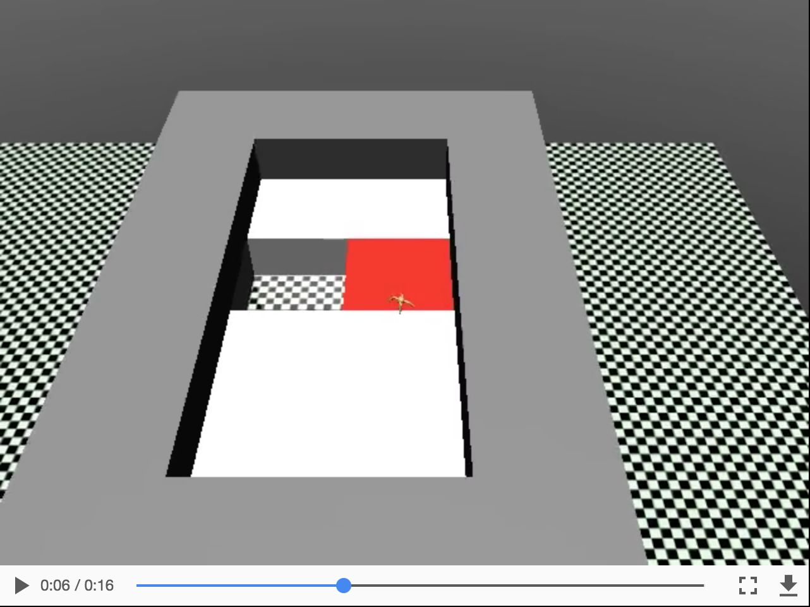
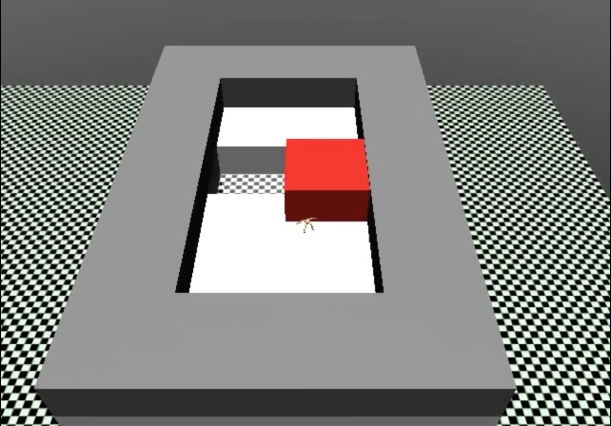
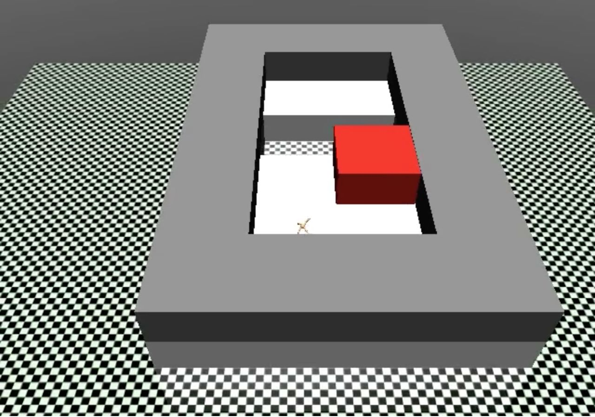
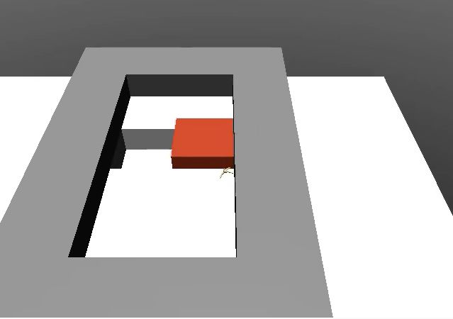
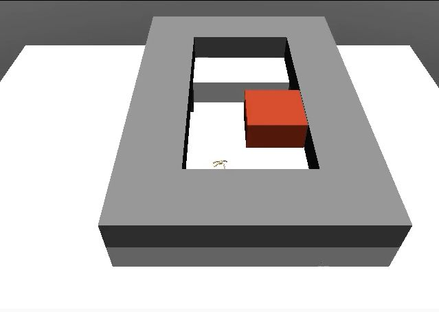
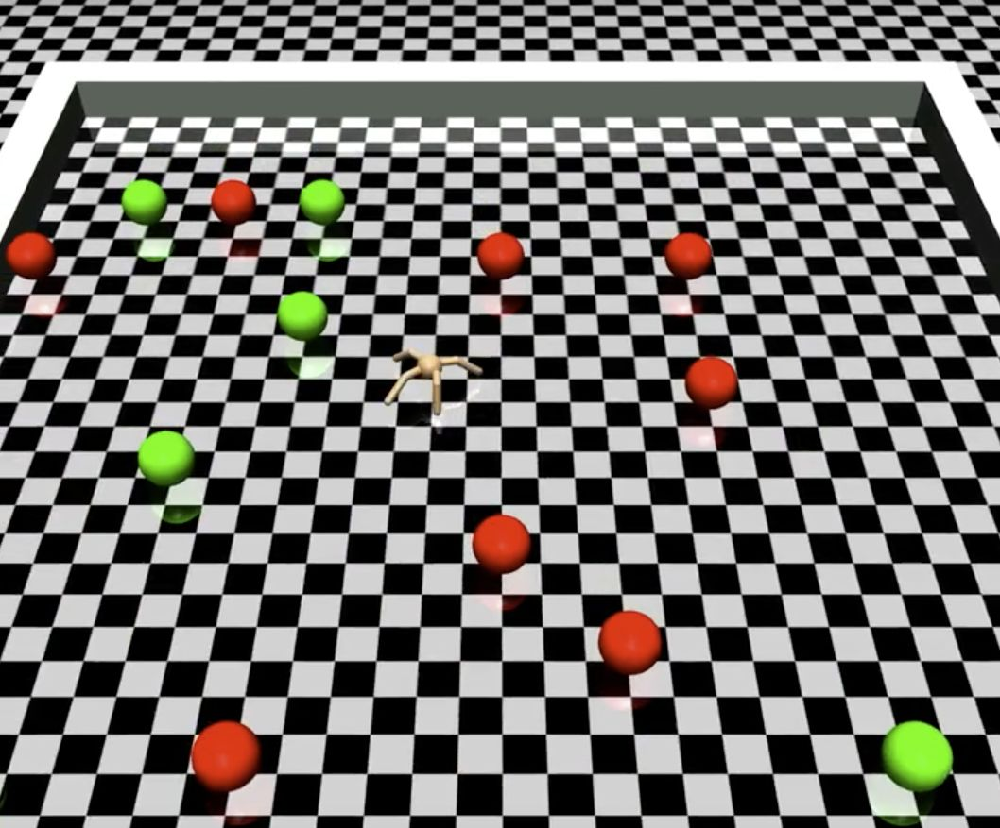
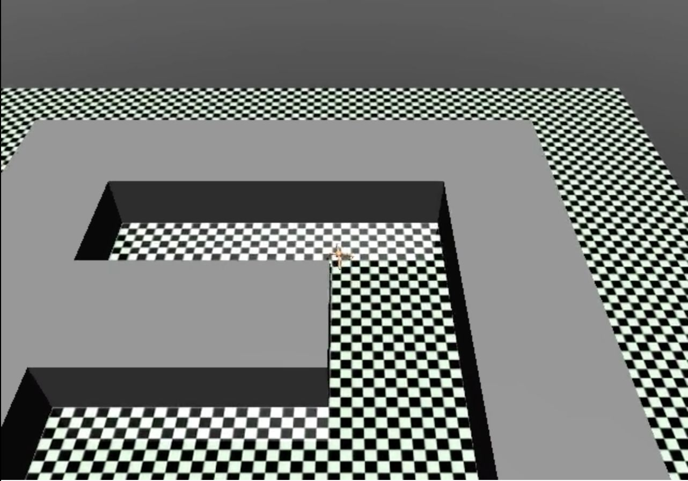
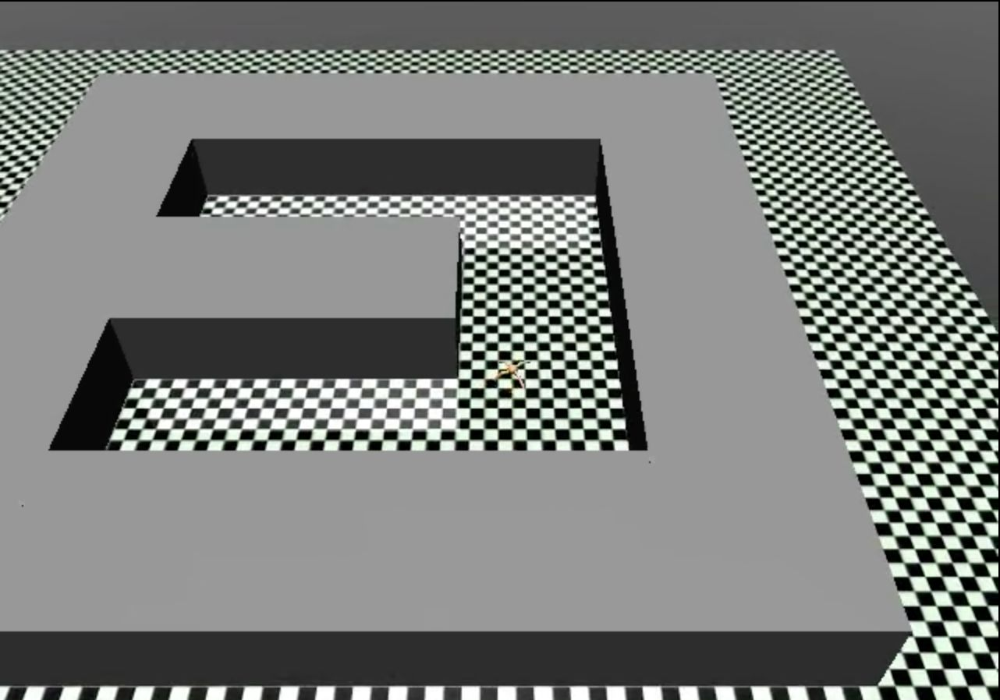
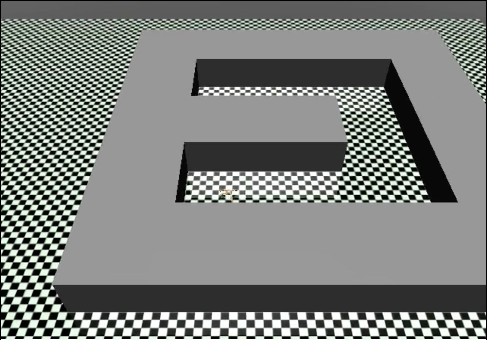
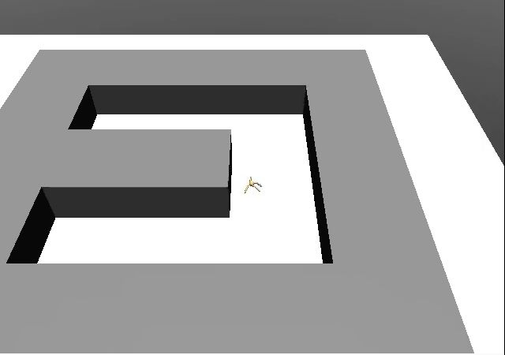
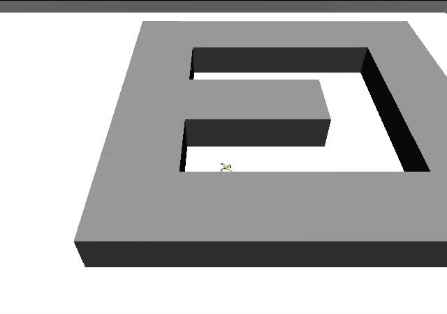

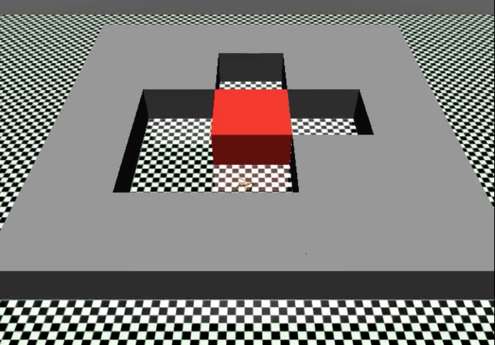
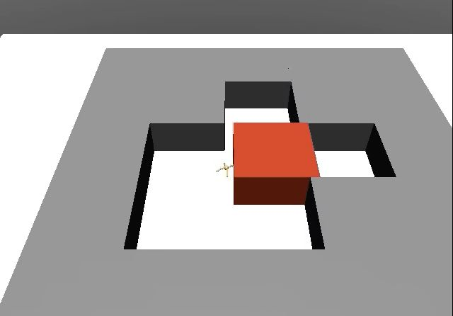

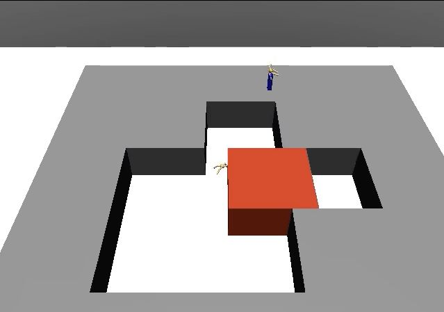
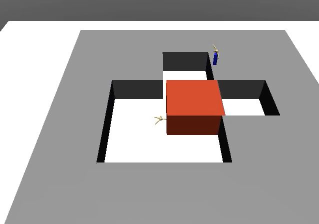

### Page 4

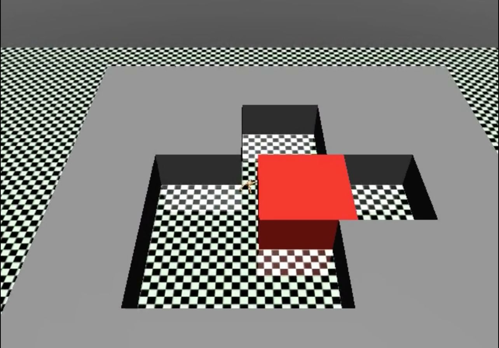
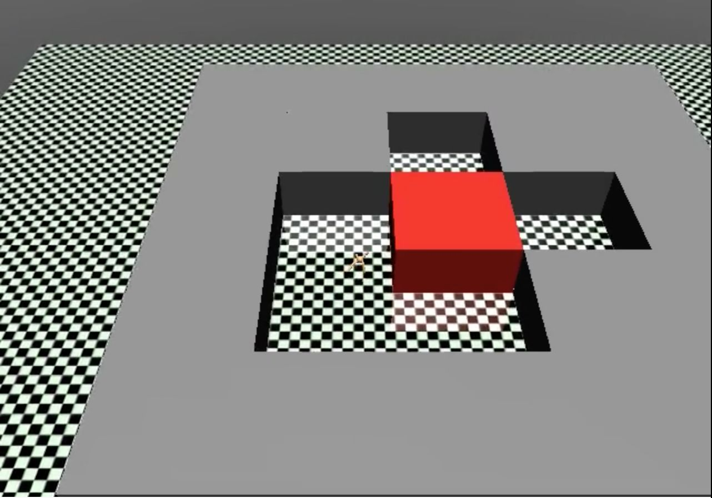

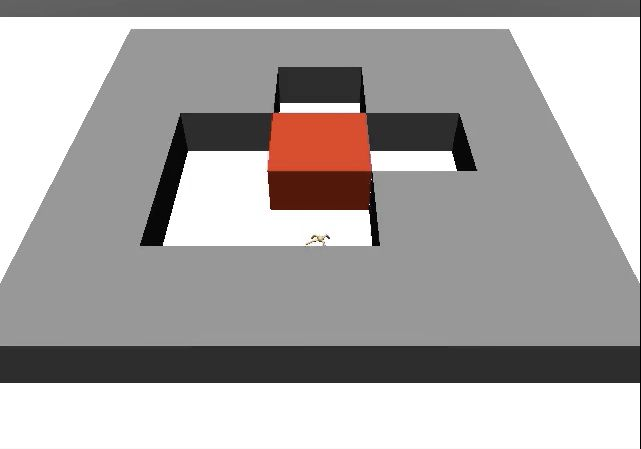

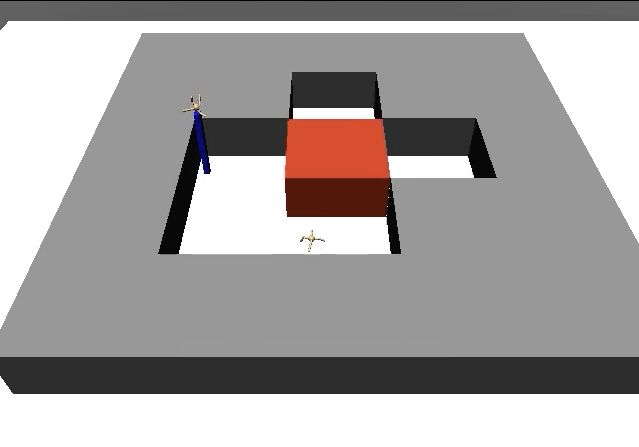

### Page 16

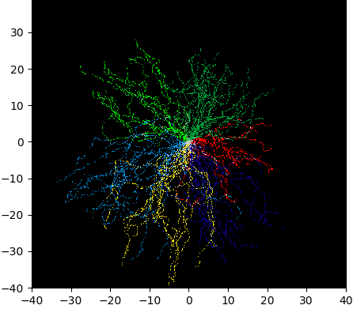
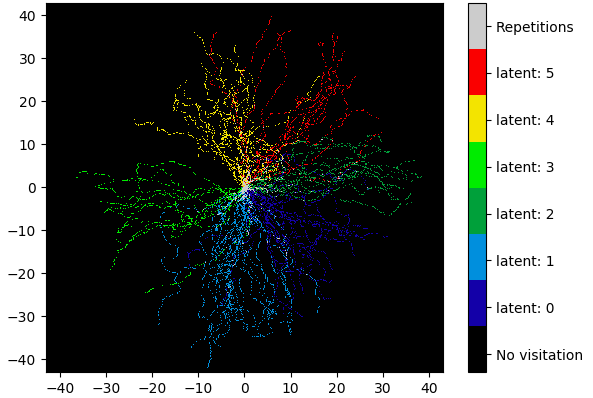
