|     |     |     |     |     | Delving | Deep | into Rectifiers: |     |     |     |     |     |     |     |
| --- | --- | --- | --- | --- | ------- | ---- | ---------------- | --- | --- | --- | --- | --- | --- | --- |
Surpassing Human-Level Performance on ImageNet Classification
|     |     | KaimingHe |     |     | XiangyuZhang |     | ShaoqingRen |     |     |     | JianSun |     |     |     |
| --- | --- | --------- | --- | --- | ------------ | --- | ----------- | --- | --- | --- | ------- | --- | --- | --- |
MicrosoftResearch
{kahe,v-xiangz,v-shren,jiansun}@microsoft.com
5102 beF 6  ]VC.sc[  1v25810.2051:viXra
Abstract
|     |     |     |     |     |     |     | and the            | use of | smaller | strides | [33,    | 24, | 2, 25]), | new non-  |
| --- | --- | --- | --- | --- | --- | --- | ------------------ | ------ | ------- | ------- | ------- | --- | -------- | --------- |
|     |     |     |     |     |     |     | linear activations |        | [21,    | 20,     | 34, 19, | 27, | 9], and  | sophisti- |
Rectified activation units (rectifiers) are essential for cated layer designs [29, 11]. On the other hand, bet-
state-of-the-art neural networks. In this work, we study ter generalization is achieved by effective regularization
rectifier neural networks for image classification from two techniques [12, 26, 9, 31], aggressive data augmentation
aspects. First, we propose a Parametric Rectified Linear [16,13,25,29],andlarge-scaledata[4,22].
Unit(PReLU)thatgeneralizesthetraditionalrectifiedunit.
|     |     |     |     |     |     |     | Among | these | advances, |     | the rectifier | neuron |     | [21, 8, 20, |
| --- | --- | --- | --- | --- | --- | --- | ----- | ----- | --------- | --- | ------------- | ------ | --- | ----------- |
PReLUimprovesmodelfittingwithnearlyzeroextracom-
|            |          |        |             |       |         |        | 34], e.g., | Rectified | Linear |     | Unit (ReLU), |     | is one | of several |
| ---------- | -------- | ------ | ----------- | ----- | ------- | ------ | ---------- | --------- | ------ | --- | ------------ | --- | ------ | ---------- |
| putational | cost and | little | overfitting | risk. | Second, | we de- |            |           |        |     |              |     |        |            |
rivearobustinitializationmethodthatparticularlyconsid- keys to the recent success of deep networks [16]. It expe-
|                   |     |                 |     |             |     |               | dites convergence |     | of  | the training |     | procedure | [16] | and leads |
| ----------------- | --- | --------------- | --- | ----------- | --- | ------------- | ----------------- | --- | --- | ------------ | --- | --------- | ---- | --------- |
| ers the rectifier |     | nonlinearities. |     | This method |     | enables us to |                   |     |     |              |     |           |      |           |
tobettersolutions[21,8,20,34]thanconventionalsigmoid-
| train extremely    | deep      | rectified | models   |               | directly | from scratch   |                     |            |     |                |     |              |          |           |
| ------------------ | --------- | --------- | -------- | ------------- | -------- | -------------- | ------------------- | ---------- | --- | -------------- | --- | ------------ | -------- | --------- |
|                    |           |           |          |               |          |                | like units.         | Despite    |     | the prevalence |     | of rectifier |          | networks, |
| and to investigate |           | deeper    | or wider | network       |          | architectures. |                     |            |     |                |     |              |          |           |
|                    |           |           |          |               |          |                | recent improvements |            |     | of models      |     | [33, 24,     | 11, 25,  | 29] and   |
| Based on           | our PReLU | networks  |          | (PReLU-nets), |          | we achieve     |                     |            |     |                |     |              |          |           |
|                    |           |           |          |               |          |                | theoretical         | guidelines |     | for training   |     | them [7,     | 23] have | rarely    |
| 4.94% top-5        | test      | error     | on the   | ImageNet      | 2012     | classifica-    |                     |            |     |                |     |              |          |           |
focusedonthepropertiesoftherectifiers.
| tion dataset. | This        | is a        | 26% relative | improvement |        | over the |         |        |     |             |        |          |     |          |
| ------------- | ----------- | ----------- | ------------ | ----------- | ------ | -------- | ------- | ------ | --- | ----------- | ------ | -------- | --- | -------- |
| ILSVRC        | 2014 winner | (GoogLeNet, |              | 6.66%       | [29]). | To our   |         |        |     |             |        |          |     |          |
|               |             |             |              |             |        |          | In this | paper, | we  | investigate | neural | networks |     | from two |
knowledge,ourresultisthefirsttosurpasshuman-levelper- aspects particularly driven by the rectifiers. First, we
formance(5.1%,[22])onthisvisualrecognitionchallenge.
|     |     |     |     |     |     |     | propose                       | a new      | generalization |     | of             | ReLU,                  | which         | we call     |
| --- | --- | --- | --- | --- | --- | --- | ----------------------------- | ---------- | -------------- | --- | -------------- | ---------------------- | ------------- | ----------- |
|     |     |     |     |     |     |     | ParametricRectifiedLinearUnit |            |                |     |                | (PReLU).Thisactivation |               |             |
|     |     |     |     |     |     |     | function                      | adaptively | learns         |     | the parameters |                        | of the        | rectifiers, |
|     |     |     |     |     |     |     | and improves                  |            | accuracy       | at  | negligible     | extra                  | computational |             |
1.Introduction cost. Second, we study the difficulty of training rectified
|               |     |        |          |        |      |          | modelsthatareverydeep. |               |     |               | Byexplicitlymodelingthenon- |     |        |            |
| ------------- | --- | ------ | -------- | ------ | ---- | -------- | ---------------------- | ------------- | --- | ------------- | --------------------------- | --- | ------ | ---------- |
| Convolutional |     | neural | networks | (CNNs) | [17, | 16] have |                        |               |     |               |                             |     |        |            |
|               |     |        |          |        |      |          | linearity              | of rectifiers |     | (ReLU/PReLU), |                             | we  | derive | a theoret- |
demonstratedrecognitionaccuracybetterthanorcompara-
|               |     |         |        |             |     |                | ically sound | initialization |     |     | method, | which | helps | with con- |
| ------------- | --- | ------- | ------ | ----------- | --- | -------------- | ------------ | -------------- | --- | --- | ------- | ----- | ----- | --------- |
| ble to humans | in  | several | visual | recognition |     | tasks, includ- |              |                |     |     |         |       |       |           |
vergenceofverydeepmodels(e.g.,with30weightlayers)
| ing recognizing      |     | traffic                         | signs [3], | faces | [30, 28], | and hand- |                             |     |     |     |                            |     |     |     |
| -------------------- | --- | ------------------------------- | ---------- | ----- | --------- | --------- | --------------------------- | --- | --- | --- | -------------------------- | --- | --- | --- |
|                      |     |                                 |            |       |           |           | traineddirectlyfromscratch. |     |     |     | Thisgivesusmoreflexibility |     |     |     |
| writtendigits[3,31]. |     | Inthiswork,wepresentaresultthat |            |       |           |           |                             |     |     |     |                            |     |     |     |
toexploremorepowerfulnetworkarchitectures.
surpasseshuman-levelperformanceonamoregenericand
| challenging | recognition |     | task - | the classification |     | task in the |        |            |     |          |      |          |     |       |
| ----------- | ----------- | --- | ------ | ------------------ | --- | ----------- | ------ | ---------- | --- | -------- | ---- | -------- | --- | ----- |
|             |             |     |        |                    |     |             | On the | 1000-class |     | ImageNet | 2012 | dataset, | our | PReLU |
1000-classImageNetdataset[22]. network (PReLU-net) leads to a single-model result of
Inthelastfewyears,wehavewitnessedtremendousim- 5.71%top-5error,whichsurpassesallexistingmulti-model
provements in recognition performance, mainly due to ad- results. Further, our multi-model result achieves 4.94%
vancesintwotechnicaldirections: buildingmorepowerful top-5erroronthetestset,whichisa26%relativeimprove-
models, and designing effective strategies against overfit- ment over the ILSVRC 2014 winner (GoogLeNet, 6.66%
ting. Ononehand,neuralnetworksarebecomingmoreca- [29]).Tothebestofourknowledge,ourresultsurpassesfor
pableoffittingtrainingdata,becauseofincreasedcomplex- the first time the reported human-level performance (5.1%
ity(e.g.,increaseddepth[25,29],enlargedwidth[33,24], in[22])onthisvisualrecognitionchallenge.
1

|     | f (y) |           |     |     | f (y) |           |     |                                |     |            |     |                        |     |     |     |
| --- | ----- | --------- | --- | --- | ----- | --------- | --- | ------------------------------ | --- | ---------- | --- | ---------------------- | --- | --- | --- |
|     |       |           |     |     |       |           |     | f(y ) =max(0,y                 |     | )+amin(0,y |     | )wherethecoefficientis |     |     |     |
|     |       |           |     |     |       |           |     | i                              | i   |            |     | i                      |     |     |     |
|     |       |           |     |     |       |           |     | sharedbyallchannelsofonelayer. |     |            |     | Thisvariantonlyintro-  |     |     |     |
|     |       | f (y) = y |     |     |       | f (y) = y |     |                                |     |            |     |                        |     |     |     |
ducesasingleextraparameterintoeachlayer.
| f (y) = 0 |     |     | y   |     |     | y   |     |     |     |     |     |     |     |     |     |
| --------- | --- | --- | --- | --- | --- | --- | --- | --- | --- | --- | --- | --- | --- | --- | --- |
f (y) = ay
Optimization
PReLUcanbetrainedusingbackpropagation[17]andopti-
|     |     |     |     |     |     |     |     | mizedsimultaneouslywithotherlayers. |     |     |     |     | Theupdateformu- |     |     |
| --- | --- | --- | --- | --- | --- | --- | --- | ----------------------------------- | --- | --- | --- | --- | --------------- | --- | --- |
Figure 1. ReLU vs. PReLU. For PReLU, the coefficient of the lationsof{a }aresimplyderivedfromthechainrule.
|     |     |     |     |     |     |     |     |     | i   |     |     |     |     |     | The |
| --- | --- | --- | --- | --- | --- | --- | --- | --- | --- | --- | --- | --- | --- | --- | --- |
negativepartisnotconstantandisadaptivelylearned.
|     |     |     |     |     |     |     |     | gradientofa | foronelayeris: |     |     |     |     |     |     |
| --- | --- | --- | --- | --- | --- | --- | --- | ----------- | -------------- | --- | --- | --- | --- | --- | --- |
i
|            |     |     |     |     |     |     |     |     | ∂E  | (cid:88) | ∂E   | ∂f(y   | )   |     |     |
| ---------- | --- | --- | --- | --- | --- | --- | --- | --- | --- | -------- | ---- | ------ | --- | --- | --- |
| 2.Approach |     |     |     |     |     |     |     |     |     | =        |      |        | i , |     | (2) |
|            |     |     |     |     |     |     |     |     | ∂a  | i        | ∂f(y | i ) ∂a | i   |     |     |
yi
| In this | section, | we  | first present |     | the PReLU | activation |     |     |     |     |     |     |     |     |     |
| ------- | -------- | --- | ------------- | --- | --------- | ---------- | --- | --- | --- | --- | --- | --- | --- | --- | --- |
function (Sec. 2.1). Then we derive our initialization whereE representstheobjectivefunction. Theterm ∂E
|        |          |           |          |     |             |        |     |                                            |     |     |     |     |     | ∂     | f (y )   |
| ------ | -------- | --------- | -------- | --- | ----------- | ------ | --- | ------------------------------------------ | --- | --- | --- | --- | --- | ----- | -------- |
| method | for deep | rectifier | networks |     | (Sec. 2.2). | Lastly | we  |                                            |     |     |     |     |     |       | i        |
|        |          |           |          |     |             |        |     | isthegradientpropagatedfromthedeeperlayer. |     |     |     |     |     | The g | ra d i - |
discussourarchitecturedesigns(Sec.2.3). entoftheactivationisgivenby:
| 2.1.ParametricRectifiers |     |     |     |     |     |     |     |     |      |     | (cid:40) |        |     |     |     |
| ------------------------ | --- | --- | --- | --- | --- | --- | --- | --- | ---- | --- | -------- | ------ | --- | --- | --- |
|                          |     |     |     |     |     |     |     |     | ∂f(y | )   | 0,       | ify >0 |     |     |     |
|                          |     |     |     |     |     |     |     |     |      | i = |          | i      | .   |     | (3) |
Weshowthatreplacingtheparameter-freeReLUactiva-
|           |         |            |     |            |      |          |       |     | ∂a  | i   | y i , | ify i ≤0 |     |     |     |
| --------- | ------- | ---------- | --- | ---------- | ---- | -------- | ----- | --- | --- | --- | ----- | -------- | --- | --- | --- |
| tion by a | learned | parametric |     | activation | unit | improves | clas- |     |     |     |       |          |     |     |     |
sificationaccuracy1. The summation (cid:80) runs over all positions of the feature
yi
|     |     |     |     |     |     |     |     | map. For      | the channel-shared |              | variant, |          | the gradient     | of  | a is |
| --- | --- | --- | --- | --- | --- | --- | --- | ------------- | ------------------ | ------------ | -------- | -------- | ---------------- | --- | ---- |
|     |     |     |     |     |     |     |     | ∂E = (cid:80) | (cid:80) ∂E        | ∂f(yi),where |          | (cid:80) | sumsoverallchan- |     |      |
Definition
|     |     |     |     |     |     |     |     | ∂a i        | yi ∂f(yi) | ∂a       |            | i   |        |       |     |
| --- | --- | --- | --- | --- | --- | --- | --- | ----------- | --------- | -------- | ---------- | --- | ------ | ----- | --- |
|     |     |     |     |     |     |     |     | nels of the | layer.    | The time | complexity |     | due to | PReLU | is  |
Formally,weconsideranactivationfunctiondefinedas: negligibleforbothforwardandbackwardpropagation.
|     |     |        | (cid:40) |       |     |     |     | Weadoptthemomentummethodwhenupdatinga |     |       |     |           |     |     | :   |
| --- | --- | ------ | -------- | ----- | --- | --- | --- | ------------------------------------- | --- | ----- | --- | --------- | --- | --- | --- |
|     |     |        | y ,      | ify   | >0  |     |     |                                       |     |       |     |           |     |     | i   |
|     |     |        | i        |       | i   |     |     |                                       |     |       |     |           |     |     |     |
|     |     | f(y )= |          |       | .   |     | (1) |                                       |     |       |     |           |     |     |     |
|     |     | i      | a y      | , ify | ≤0  |     |     |                                       |     |       |     | ∂E        |     |     |     |
|     |     |        | i        | i     | i   |     |     |                                       | ∆a  | :=µ∆a |     | +(cid:15) | .   |     | (4) |
|     |     |        |          |       |     |     |     |                                       |     | i     | i   |           |     |     |     |
∂a i
| Herey | istheinputofthenonlinearactivationf |     |     |     |     | ontheith |     |     |     |     |     |     |     |     |     |
| ----- | ----------------------------------- | --- | --- | --- | --- | -------- | --- | --- | --- | --- | --- | --- | --- | --- | --- |
i Here µ is the momentum and (cid:15) is the learning rate. It is
| channel, | anda | isacoefficientcontrollingtheslopeofthe |     |     |     |     |     |     |     |     |     |     |     |     |     |
| -------- | ---- | -------------------------------------- | --- | --- | --- | --- | --- | --- | --- | --- | --- | --- | --- | --- | --- |
i
|                                                      |                  |     |     |                        |     |     |     | worthnoticingthatwedonotuseweightdecay(l |     |     |                            |     |     | regular- |     |
| ---------------------------------------------------- | ---------------- | --- | --- | ---------------------- | --- | --- | --- | ---------------------------------------- | --- | --- | -------------------------- | --- | --- | -------- | --- |
| negativepart.                                        | Thesubscriptiina |     |     | i indicatesthatweallow |     |     |     |                                          |     |     |                            |     |     | 2        |     |
|                                                      |                  |     |     |                        |     |     |     | ization)whenupdatinga                    |     |     | . Aweightdecaytendstopusha |     |     |          |     |
| thenonlinearactivationtovaryondifferentchannels.When |                  |     |     |                        |     |     |     |                                          |     |     | i                          |     |     |          | i   |
a =0,itbecomesReLU;whena tozero,andthusbiasesPReLUtowardReLU.Evenwithout
| i   |     |     |     | i isalearnableparameter, |     |     |     |     |     |     |     |     |     |     |     |
| --- | --- | --- | --- | ------------------------ | --- | --- | --- | --- | --- | --- | --- | --- | --- | --- | --- |
regularization,thelearnedcoefficientsrarelyhaveamagni-
werefertoEqn.(1)asParametricReLU(PReLU).Figure1
|           |             |         |       |           |         |         |         | tude larger          | than 1 | in our | experiments.                   |      | Further,              | we do | not |
| --------- | ----------- | ------- | ----- | --------- | ------- | ------- | ------- | -------------------- | ------ | ------ | ------------------------------ | ---- | --------------------- | ----- | --- |
| shows the | shapes      | of ReLU | and   | PReLU.    | Eqn.(1) | is      | equiva- |                      |        |        |                                |      |                       |       |     |
|           |             |         |       |           |         |         |         | constraintherangeofa |        |        | sothattheactivationfunctionmay |      |                       |       |     |
| lenttof(y | i )=max(0,y |         | i )+a | i min(0,y | i ).    |         |         |                      |        | i      |                                |      |                       |       |     |
|           |             |         |       |           |         |         |         | be non-monotonic.    |        | We use | a =                            | 0.25 | as the initialization |       |     |
| If a      | is a small  | and     | fixed | value,    | PReLU   | becomes | the     |                      |        |        | i                              |      |                       |       |     |
i
throughoutthispaper.
| Leaky ReLU    | (LReLU) |             | in [20] | (a i       | = 0.01).    | The | motiva- |     |     |     |     |     |     |     |     |
| ------------- | ------- | ----------- | ------- | ---------- | ----------- | --- | ------- | --- | --- | --- | --- | --- | --- | --- | --- |
| tion of LReLU |         | is to avoid | zero    | gradients. | Experiments |     | in      |     |     |     |     |     |     |     |     |
[20] show that LReLU has negligible impact on accuracy ComparisonExperiments
| compared      | with | ReLU. | On the     | contrary, | our          | method | adap- |                |             |     |           |        |               |       |      |
| ------------- | ---- | ----- | ---------- | --------- | ------------ | ------ | ----- | -------------- | ----------- | --- | --------- | ------ | ------------- | ----- | ---- |
|               |      |       |            |           |              |        |       | We conducted   | comparisons |     | on        | a deep | but efficient | model |      |
| tively learns | the  | PReLU | parameters |           | jointly with | the    | whole |                |             |     |           |        |               |       |      |
|               |      |       |            |           |              |        |       | with 14 weight | layers.     |     | The model | was    | studied       | in    | [10] |
model. We hope for end-to-end training that will lead to (model E of [10]) and its architecture is described in Ta-
morespecializedactivations.
|     |     |     |     |     |     |     |     | ble1. Wechoosethismodelbecauseitissufficientforrep- |     |     |     |     |     |     |     |
| --- | --- | --- | --- | --- | --- | --- | --- | --------------------------------------------------- | --- | --- | --- | --- | --- | --- | --- |
PReLUintroducesaverysmallnumberofextraparam-
resentingacategoryofverydeepmodels,aswellastomake
eters. Thenumberofextraparametersisequaltothetotal
theexperimentsfeasible.
| number | of channels, | which | is  | negligible | when | considering |     |                |     |          |      |       |           |         |     |
| ------ | ------------ | ----- | --- | ---------- | ---- | ----------- | --- | -------------- | --- | -------- | ---- | ----- | --------- | ------- | --- |
|        |              |       |     |            |      |             |     | As a baseline, |     | we train | this | model | with ReLU | applied |     |
the total number of weights. So we expect no extra risk in the convolutional (conv) layers and the first two fully-
| of overfitting. |      | We also   | consider    | a channel-shared |            |                   | variant: |                                                  |     |                                  |     |     |     |     |     |
| --------------- | ---- | --------- | ----------- | ---------------- | ---------- | ----------------- | -------- | ------------------------------------------------ | --- | -------------------------------- | --- | --- | --- | --- | --- |
|                 |      |           |             |                  |            |                   |          | connected(fc)layers.                             |     | Thetrainingimplementationfollows |     |     |     |     |     |
|                 |      |           |             |                  |            |                   |          | [10]. Thetop-1andtop-5errorsare33.82%and13.34%on |     |                                  |     |     |     |     |     |
| 1Concurrent     | with | our work, | Agostinelli |                  | et al. [1] | also investigated |          |                                                  |     |                                  |     |     |     |     |     |
learningactivationfunctionsandshowedimprovementonothertasks. ImageNet2012,using10-viewtesting(Table2).
2

learnedcoefficients lievethatthisisamoreeconomicalwayofexploitinglow-
layer channel-shared channel-wise levelinformation, giventhelimitednumberof filters(e.g.,
conv1 7×7,64, /2 0.681 0.596 64). Second,forthechannel-wiseversion,thedeeperconv
pool1 3×3, /3 layersingeneralhavesmallercoefficients.Thisimpliesthat
conv21 2×2,128 0.103 0.321 the activations gradually become “more nonlinear” at in-
conv22 2×2,128 0.099 0.204
creasingdepths. Inotherwords,thelearnedmodeltendsto
conv23 2×2,128 0.228 0.294
keepmoreinformationinearlierstagesandbecomesmore
conv24 2×2,128 0.561 0.464
discriminativeindeeperstages.
pool2 2×2,
/2
conv31 2×2,256 0.126 0.196
2.2.InitializationofFilterWeightsforRectifiers
conv32 2×2,256 0.089 0.152
conv33 2×2,256 0.124 0.145 Rectifier networks are easier to train [8, 16, 34] com-
conv34 2×2,256 0.062 0.124
paredwithtraditionalsigmoid-likeactivationnetworks.But
conv35 2×2,256 0.008 0.134
abadinitializationcanstillhamperthelearningofahighly
conv36 2×2,256 0.210 0.198
non-linearsystem. Inthissubsection, weproposearobust
spp {6,3,2,1}
fc1 4096 0.063 0.074 initialization method that removes an obstacle of training
fc2 4096 0.031 0.075 extremelydeeprectifiernetworks.
fc3 1000 Recent deep CNNs are mostly initialized by random
weightsdrawnfromGaussiandistributions[16]. Withfixed
Table1.Asmallbutdeep14-layermodel[10]. Thefiltersizeand
standard deviations (e.g., 0.01 in [16]), very deep models
filternumberofeachlayerislisted. Thenumber/sindicatesthe
(e.g., >8 conv layers) have difficulties to converge, as re-
stridesthatisused. ThelearnedcoefficientsofPReLUarealso
portedbytheVGGteam[25]andalsoobservedinourex-
shown. For the channel-wise case, the average of {a } over the
i
periments. To address this issue, in [25] they pre-train a
channelsisshownforeachlayer.
model with 8 conv layers to initialize deeper models. But
thisstrategyrequiresmoretrainingtime,andmayalsolead
top-1 top-5
toapoorerlocaloptimum. In[29,18],auxiliaryclassifiers
ReLU 33.82 13.34 areaddedtointermediatelayerstohelpwithconvergence.
PReLU,channel-shared 32.71 12.87 Glorot and Bengio [7] proposed to adopt a properly
PReLU,channel-wise 32.64 12.75 scaleduniformdistributionforinitialization. Thisiscalled
“Xavier”initializationin[14]. Itsderivationisbasedonthe
Table 2. Comparisons between ReLU and PReLU on the small
assumptionthattheactivationsarelinear. Thisassumption
model. TheerrorratesareforImageNet2012using10-viewtest-
isinvalidforReLUandPReLU.
ing. Theimagesareresizedsothattheshortersideis256,during
In the following, we derive a theoretically more sound
bothtrainingandtesting. Eachviewis224×224. Allmodelsare
initialization by taking ReLU/PReLU into account. In our
trainedusing75epochs.
experiments,ourinitializationmethodallowsforextremely
deepmodels(e.g.,30conv/fclayers)toconverge,whilethe
“Xavier”method[7]cannot.
Then we train the same architecture from scratch, with
all ReLUs replaced by PReLUs (Table 2). The top-1 error
is reduced to 32.64%. This is a 1.2% gain over the ReLU ForwardPropagationCase
baseline. Table 2 also shows that channel-wise/channel-
Our derivation mainly follows [7]. The central idea is to
shared PReLUs perform comparably. For the channel-
investigatethevarianceoftheresponsesineachlayer.
shared version, PReLU only introduces 13 extra free pa-
Foraconvlayer,aresponseis:
rameters compared with the ReLU counterpart. But this
small number of free parameters play critical roles as ev-
y =W x +b . (5)
l l l l
idenced by the 1.1% gain over the baseline. This implies
theimportanceofadaptivelylearningtheshapesofactiva- Here,xisak2c-by-1vectorthatrepresentsco-locatedk×k
tionfunctions. pixelsincinputchannels. k isthespatialfiltersizeofthe
Table 1 also shows the learned coefficients of PReLUs layer. With n = k2c denoting the number of connections
foreachlayer. TherearetwointerestingphenomenainTa- ofaresponse,Wisad-by-nmatrix,wheredisthenumber
ble 1. First, the first conv layer (conv1) has coefficients of filters and each row of W represents the weights of a
(0.681 and 0.596) significantly greater than 0. As the fil- filter. b is a vector of biases, and y is the response at a
ters of conv1 are mostly Gabor-like filters such as edge or pixel of the output map. We use l to index a layer. We
texturedetectors,thelearnedresultsshowthatbothpositive havex =f(y )wheref istheactivation. Wealsohave
l l−1
and negative responses of the filters are respected. We be- c =d .
l l−1
3

We let the initialized elements in W be mutually inde- andisreshapedintoak2d-by-1vector.Wedenotenˆ =k2d.
l
pendent and share the same distribution. As in [7], we as- Note that nˆ (cid:54)= n = k2c. Wˆ is a c-by-nˆ matrix where the
sumethattheelementsinx arealsomutuallyindependent filtersarerearrangedinthewayofback-propagation. Note
l
andsharethesamedistribution,andx andW areindepen- thatWandWˆ canbereshapedfromeachother. ∆xisac-
l l
dentofeachother. Thenwehave: by-1vectorrepresentingthegradientatapixelofthislayer.
As above, we assume that w and ∆y are independent of
l l
Var[y ]=n Var[w x ], (6)
l l l l each other, then ∆x has zero mean for all l, when w is
l l
initializedbyasymmetricdistributionaroundzero.
wherenowy ,x ,andw representtherandomvariablesof
l l l In back-propagation we also have ∆y = f(cid:48)(y )∆x
eachelementiny ,W ,andx respectively. Weletw have l l l+1
l l l l wheref(cid:48) isthederivativeoff. FortheReLUcase, f(cid:48)(y )
zeromean.Thenthevarianceoftheproductofindependent l
is zero or one, and their probabilities are equal. We as-
variablesgivesus:
sumethatf(cid:48)(y )and∆x areindependentofeachother.
l l+1
Var[y l ]=n l Var[w l ]E[x2 l ]. (7) Thus we have E[∆y l ] = E[∆x l+1 ]/2 = 0, and also
E[(∆y )2] = Var[∆y ] = 1Var[∆x ]. Thenwecompute
HereE[x2 l ]istheexpectationofthesquareofx l .Itisworth thevari l anceofthegra l dient 2 inEqn.( l 1 + 1 1 ):
noticingthatE[x2](cid:54)=Var[x ]unlessx haszeromean. For
l l l
the ReLU activation, x = max(0,y ) and thus it does Var[∆x ] = nˆ Var[w ]Var[∆y ]
l l−1 l l l l
nothavezeromean. Thiswillleadtoaconclusiondifferent 1
= nˆ Var[w ]Var[∆x ]. (12)
from[7]. 2 l l l+1
Ifweletw haveasymmetricdistributionaroundzero
l−1
Thescalar1/2inbothEqn.(12)andEqn.(8)istheresultof
andb =0,theny haszeromeanandhasasymmetric
l−1 l−1
distributionaroundzero. ThisleadstoE[x2]= 1Var[y ] ReLU, though the derivations are different. With L layers
l 2 l−1 puttogether,wehave:
whenf isReLU.PuttingthisintoEqn.(7),weobtain:
1 (cid:32) (cid:89) L 1 (cid:33)
Var[y l ]= 2 n l Var[w l ]Var[y l−1 ]. (8) Var[∆x 2 ]=Var[∆x L+1 ] 2 nˆ l Var[w l ] . (13)
l=2
WithLlayersputtogether,wehave:
We consider a sufficient condition that the gradient is not
(cid:32) (cid:89) L 1 (cid:33) exponentiallylarge/small:
Var[y ]=Var[y ] n Var[w ] . (9)
L 1 2 l l 1
l=2 nˆ Var[w ]=1, ∀l. (14)
2 l l
Thisproductisthekeytotheinitializationdesign. Aproper
initialization method should avoid reducing or magnifying The only difference between this equation and Eqn.(10) is
the magnitudes of input signals exponentially. So we ex- thatnˆ l =k l 2d l whilen l =k l 2c l =k l 2d l−1 . Eqn.(14)results
(cid:112)
pect the above product to take a proper scalar (e.g., 1). A inazero-meanGaussiandistributionwhosestdis 2/nˆ .
l
sufficientconditionis: For the first layer (l = 1), we need not compute ∆x
1
because it represents the image domain. But we can still
1
2 n l Var[w l ]=1, ∀l. (10) adoptEqn.(14)inthefirstlayer,forthesamereasonasinthe
forwardpropagationcase-thefactorofasinglelayerdoes
Thisleadstoazero-meanGaussiandistributionwhosestan- notmaketheoverallproductexponentiallylarge/small.
(cid:112)
darddeviation(std)is 2/n l . Thisisourwayofinitializa- We note that it is sufficient to use either Eqn.(14) or
tion. Wealsoinitializeb=0. Eqn.(10) alone. For example, if we use Eqn.(14), then in
Forthefirstlayer(l=1),weshouldhaven 1 Var[w 1 ]=1 Eqn.(13)theproduct (cid:81)L l=2 1 2 nˆ l Var[w l ] = 1,andinEqn.(9)
becausethereisnoReLUappliedontheinputsignal. But the product (cid:81)L 1n Var[w ] = (cid:81)L n /nˆ = c /d ,
thefactor1/2doesnotmatterifitjustexistsononelayer. l=2 2 l l l=2 l l 2 L
whichisnotadiminishingnumberincommonnetworkde-
SowealsoadoptEqn.(10)inthefirstlayerforsimplicity.
signs. This means that if the initialization properly scales
the backward signal, then this is also the case for the for-
BackwardPropagationCase ward signal; and vice versa. For all models in this paper,
bothformscanmakethemconverge.
Forback-propagation, thegradientofaconvlayeriscom-
putedby:
∆x =Wˆ ∆y . (11) Discussions
l l l
Hereweuse∆xand∆y todenotegradients(∂E and ∂E) Iftheforward/backwardsignalisinappropriatelyscaledby
∂x ∂y
for simplicity. ∆y represents k-by-k pixels in d channels, a factor β in each layer, then the final propagated signal
4

|     | 1   |     |     |     |     |     |     |          |            |              |            |      |        |     |
| --- | --- | --- | --- | --- | --- | --- | --- | -------- | ---------- | ------------ | ---------- | ---- | ------ | --- |
|     |     |     |     |     |     |     |     | as 0.01, | the std of | the gradient | propagated | from | conv10 | to  |
conv2is1/(5.9×4.22×2.92×2.14)=1/(1.7×104)of
0.95
|     |     |     |     |     |     |     |     | whatwederive.                       | Thisnumbermayexplainwhydiminishing |     |     |     |     |     |
| --- | --- | --- | --- | --- | --- | --- | --- | ----------------------------------- | ---------------------------------- | --- | --- | --- | --- | --- |
|     | 0.9 |     |     |     |     |     |     | gradientswereobservedinexperiments. |                                    |     |     |     |     |     |
rorrE It is also worth noticing that the variance of the input
0.85
ours signal can be roughly preserved from the first layer to the
----------
|     |     |     |     |     |     |     |     | last. Incaseswhentheinputsignalisnotnormalized(e.g., |     |     |     |     |     |     |
| --- | --- | --- | --- | --- | --- | --- | --- | ---------------------------------------------------- | --- | --- | --- | --- | --- | --- |
0.8
Xavier
---------- it is in the range of [−128,128]), its magnitude can be
0.75 so large that the softmax operator will overflow. A solu-
|     | 0   | 0.5 | 1   | 1.5 | 2   | 2.5 | 3   |     |     |     |     |     |     |     |
| --- | --- | --- | --- | --- | --- | --- | --- | --- | --- | --- | --- | --- | --- | --- |
Epoch tion is to normalize the input signal, but this may impact
|        |        |             |     |            |       |       |           | other hyper-parameters. |     |     | Another solution | is  | to include | a   |
| ------ | ------ | ----------- | --- | ---------- | ----- | ----- | --------- | ----------------------- | --- | --- | ---------------- | --- | ---------- | --- |
| Figure | 2. The | convergence | of  | a 22-layer | large | model | (B in Ta- |                         |     |     |                  |     |            |     |
smallfactorontheweightsamongallorsomelayers,e.g.,
| ble3). | Thex-axisisthenumberoftrainingepochs. |     |     |     |     | They-axisis |     |     |     |     |     |     |     |     |
| ------ | ------------------------------------- | --- | --- | --- | --- | ----------- | --- | --- | --- | --- | --- | --- | --- | --- |
(cid:112)
|     |     |     |     |     |     |     |     | L 1/128onLlayers. |     | Inpractice,weuseastdof0.01for |     |     |     |     |
| --- | --- | --- | --- | --- | --- | --- | --- | ----------------- | --- | ----------------------------- | --- | --- | --- | --- |
thetop-1errorof3,000randomvalsamples,evaluatedonthecen-
|     |     |     |     |     |     |     |     | thefirsttwofclayersand0.001forthelast. |     |     |     | Thesenumbers |     |     |
| --- | --- | --- | --- | --- | --- | --- | --- | -------------------------------------- | --- | --- | --- | ------------ | --- | --- |
tercrop. WeuseReLUastheactivationforbothcases. Bothour (cid:112)
|     |     |     |     |     |     |     |     | are smaller | than they | should | be (e.g., | 2/4096) | and | will |
| --- | --- | --- | --- | --- | --- | --- | --- | ----------- | --------- | ------ | --------- | ------- | --- | ---- |
initialization(red)and“Xavier”(blue)[7]leadtoconvergence,but
oursstartsreducingerrorearlier. address the normalization issue of images whose range is
about[−128,128].

|     |       |     |     |     |     |     |     | For the                  | initialization |     | in the PReLU | case, | it is | easy to |
| --- | ----- | --- | --- | --- | --- | --- | --- | ------------------------ | -------------- | --- | ------------ | ----- | ----- | ------- |
|     | 0.95  |     |     |     |     |     |     | showthatEqn.(10)becomes: |                |     |              |       |       |         |
|     | 0.9   |     |     |     |     |     |     |                          | 1              |     |              |       |       |         |
|     |       |     |     |     |     |     |     |                          | (1+a2)n        |     | Var[w ]=1,   | ∀l,   |       | (15)    |
|     | rorrE |     |     |     |     |     |     |                          |                |     | l l          |       |       |         |
|     | 0.85  |     |     |     |     |     |     |                          | 2              |     |              |       |       |         |
ours
0.8 ---------- whereaistheinitializedvalueofthecoefficients. Ifa=0,
|     |      |     |                   |     |     |     |     | itbecomestheReLUcase; |     |                           | ifa = | 1, itbecomesthelinear |     |      |
| --- | ---- | --- | ----------------- | --- | --- | --- | --- | --------------------- | --- | ------------------------- | ----- | --------------------- | --- | ---- |
|     | 0.75 |     | ---------- Xavier |     |     |     |     |                       |     |                           |       |                       |     |      |
|     |      |     |                   |     |     |     |     | case(thesameas[7]).   |     | Similarly,Eqn.(14)becomes |       |                       |     | 1(1+ |
2
|     |     |     |     |     |     |     |     | a2)nˆ Var[w | ]=1. |     |     |     |     |     |
| --- | --- | --- | --- | --- | --- | --- | --- | ----------- | ---- | --- | --- | --- | --- | --- |
|     | 0   | 1 2 | 3   | 4 5 | 6 7 | 8 9 |     | l           | l    |     |     |     |     |     |
Epoch
Figure3.Theconvergenceofa30-layersmallmodel(seethemain Comparisonswith“Xavier”Initialization[7]
| text). | WeuseReLUastheactivationforbothcases. |     |     |     |     | Ourinitial- |     |     |     |     |     |     |     |     |
| ------ | ------------------------------------- | --- | --- | --- | --- | ----------- | --- | --- | --- | --- | --- | --- | --- | --- |
ization(red)isabletomakeitconverge. But“Xavier”(blue)[7] The main difference between our derivation and the
completelystalls-wealsoverifythatitsgradientsarealldimin- “Xavier” initialization [7] is that we address the rectifier
ishing.Itdoesnotconvergeevengivenmoreepochs.
|     |     |     |     |     |     |     |     | nonlinearities3. | The     | derivation | in       | [7] only   | considers | the    |
| --- | --- | --- | --- | --- | --- | --- | --- | ---------------- | ------- | ---------- | -------- | ---------- | --------- | ------ |
|     |     |     |     |     |     |     |     | linear case,     | and its | result     | is given | by n Var[w | ] =       | 1 (the |
l l
|     |     |     |     | βL  |     |     |     | forward | case), which | can | be implemented | as  | a zero-mean |     |
| --- | --- | --- | --- | --- | --- | --- | --- | ------- | ------------ | --- | -------------- | --- | ----------- | --- |
will be rescaled by a factor of after L layers, where L (cid:112)
|                              |     |     |     |                  |     |     |     | Gaussiandistributionwhosestdis |     |     |     | 1/n . Whenthereare |     |     |
| ---------------------------- | --- | --- | --- | ---------------- | --- | --- | --- | ------------------------------ | --- | --- | --- | ------------------ | --- | --- |
| canrepresentsomeoralllayers. |     |     |     | WhenLislarge,ifβ |     |     | >1, |                                |     |     | √   | l                  |     |     |
L
this leads to extremely amplified signals and an algorithm L layers, the std will be 1/ 2 of our derived std. This
|        |              |     |     |         |                      |     |      | number, | however, | is not | small enough | to completely |     | stall |
| ------ | ------------ | --- | --- | ------- | -------------------- | --- | ---- | ------- | -------- | ------ | ------------ | ------------- | --- | ----- |
| output | of infinity; | if  | β < | 1, this | leads to diminishing |     | sig- |         |          |        |              |               |     |       |
nals2. In either case, the algorithm does not converge - it the convergence of the models actually used in our paper
|     |     |     |     |     |     |     |     | (Table 3, | up to 22 | layers) | as shown | by experiments. |     | Fig- |
| --- | --- | --- | --- | --- | --- | --- | --- | --------- | -------- | ------- | -------- | --------------- | --- | ---- |
divergesintheformercase,andstallsinthelatter.
Our derivation also explains why the constant standard ure2comparestheconvergenceofa22-layermodel. Both
|           |        |            |        |        |              |       |       | methods               | are able | to make                         | them converge. |     | But ours | starts |
| --------- | ------ | ---------- | ------ | ------ | ------------ | ----- | ----- | --------------------- | -------- | ------------------------------- | -------------- | --- | -------- | ------ |
| deviation | of     | 0.01 makes | some   | deeper | networks     | stall | [25]. |                       |          |                                 |                |     |          |        |
|           |        |            |        |        |              |       |       | reducingerrorearlier. |          | Wealsoinvestigatethepossibleim- |                |     |          |        |
| We take   | “model | B”         | in the | VGG    | team’s paper | [25]  | as an |                       |          |                                 |                |     |          |        |
example.Thismodelhas10convlayersallwith3×3filters. pact on accuracy. For the model in Table 2 (using ReLU),
the“Xavier”initializationmethodleadsto33.90/13.44top-
| Thefilternumbers(d |     |     | l )are64forthe1stand2ndlayers,128 |     |     |     |     |     |     |     |     |     |     |     |
| ------------------ | --- | --- | --------------------------------- | --- | --- | --- | --- | --- | --- | --- | --- | --- | --- | --- |
forthe3rdand4thlayers,256forthe5thand6thlayers,and 1/top-5 error, and ours leads to 33.82/13.34. We have not
512fortherest. ThestdcomputedbyEqn.(14)( (cid:112) 2/nˆ )is observedclearsuperiorityofonetotheotheronaccuracy.
l
|     |     |     |     |     |     |     |     | Next, | we compare | the | two methods | on extremely |     | deep |
| --- | --- | --- | --- | --- | --- | --- | --- | ----- | ---------- | --- | ----------- | ------------ | --- | ---- |
0.059,0.042,0.029,and0.021whenthefilternumbersare
64, 128, 256, and 512 respectively. If the std is initialized modelswithupto30layers(27convand3fc). Weaddup
tosixteenconvlayerswith2562×2filtersinthemodelin
2Inthepresenceofweightdecay(l2regularizationofweights),when
thegradientcontributedbythelogisticlossfunctionisdiminishing, the 3There are other minor differences. In [7], the derived variance is
totalgradientisnotdiminishingbecauseoftheweightdecay. Awayof adoptedforuniformdistributions,andtheforwardandbackwardcasesare
diagnosingdiminishinggradientsistocheckwhetherthegradientismod- averaged. ButitisstraightforwardtoadopttheirconclusionforGaussian
ulatedonlybyweightdecay. distributionsandfortheforwardorbackwardcaseonly.
5

Table 1. Figure 3 shows the convergence of the 30-layer complexity,anditstimecomplexityisabout2.3×ofB(Ta-
model. Our initialization is able to make the extremely ble3,lastrow). TrainingA/BonfourK20GPUs,ortrain-
deepmodelconverge.Onthecontrary,the“Xavier”method ingConeightK40GPUs,takesabout3-4weeks.
completelystallsthelearning,andthegradientsaredimin- Wechoosetoincreasethemodelwidthinsteadofdepth,
ishingasmonitoredintheexperiments. becausedeepermodelshaveonlydiminishingimprovement
These studies demonstrate that we are ready to investi- orevendegradationonaccuracy. Inrecentexperimentson
gateextremelydeep,rectifiedmodelsbyusingamoreprin- small models [10], it has been found that aggressively in-
cipledinitializationmethod. Butinourcurrentexperiments creasingthedepthleadstosaturatedordegradedaccuracy.
onImageNet,wehavenotobservedthebenefitfromtrain- In the VGG paper [25], the 16-layer and 19-layer models
ing extremely deep models. For example, the aforemen- performcomparably. Inthespeechrecognitionresearchof
tioned 30-layer model has 38.56/16.59 top-1/top-5 error, [34],thedeepmodelsdegradewhenusingmorethan8hid-
whichisclearlyworsethantheerrorofthe14-layermodel denlayers(allbeingfc). Weconjecturethatsimilardegra-
in Table 2 (33.82/13.34). Accuracy saturation or degrada- dationmayalsohappenonlargermodelsforImageNet. We
tion was also observed in the study of small models [10], havemonitoredthetrainingproceduresofsomeextremely
VGG’s large models [25], and in speech recognition [34]. deepmodels(with3to9layersaddedonBinTable3),and
This is perhaps because the method of increasing depth is found both training and testing error rates degraded in the
notappropriate,ortherecognitiontaskisnotenoughcom- first20epochs(butwedidnotruntotheendduetolimited
plex. time budget, so there is not yet solid evidence that these
Thoughourattemptsofextremelydeepmodelshavenot largeandoverlydeepmodelswillultimatelydegrade). Be-
shownbenefits,ourinitializationmethodpavesafoundation causeofthepossibledegradation,wechoosenottofurther
forfurtherstudyonincreasingdepth. Wehopethiswillbe increasethedepthoftheselargemodels.
helpfulinothermorecomplextasks. On the other hand, the recent research [5] on small
datasets suggests that the accuracy should improve from
2.3.Architectures the increased number of parameters in conv layers. This
number depends on the depth and width. So we choose
Theaboveinvestigationsprovideguidelinesofdesigning
toincreasethewidthoftheconvlayerstoobtainahigher-
ourarchitectures,introducedasfollows.
capacitymodel.
Ourbaselineisthe19-layermodel(A)inTable3. Fora
WhileallmodelsinTable3areverylarge,wehavenot
bettercomparison,wealsolisttheVGG-19model[25].Our
observedsevereoverfitting. Weattributethistotheaggres-
modelAhasthefollowingmodificationsonVGG-19:(i)in
sivedataaugmentationusedthroughoutthewholetraining
thefirstlayer,weuseafiltersizeof7×7andastrideof2;
procedure,asintroducedbelow.
(ii)wemovetheotherthreeconvlayersonthetwolargest
feature maps (224, 112) to the smaller feature maps (56,
3.ImplementationDetails
28,14). Thetimecomplexity(Table3,lastrow)isroughly
unchangedbecausethedeeperlayershavemorefilters;(iii)
Training
we use spatial pyramid pooling (SPP) [11] before the first
fclayer. Thepyramidhas4levels-thenumbersofbinsare Our training algorithm mostly follows [16, 13, 2, 11, 25].
7×7,3×3,2×2,and1×1,foratotalof63bins. From a resized image whose shorter side is s, a 224×224
It is worth noticing that we have no evidence that our crop is randomly sampled, with the per-pixel mean sub-
model A is a better architecture than VGG-19, though our tracted. The scale s is randomly jittered in the range of
model A has better results than VGG-19’s result reported [256,512],following[25]. Onehalfoftherandomsamples
by [25]. In our earlier experiments with less scale aug- areflippedhorizontally[16]. Randomcoloraltering[16]is
mentation, we observed that our model A and our repro- alsoused.
duced VGG-19 (with SPP and our initialization) are com- Unlike [25] that appliesscale jittering only during fine-
parable. The main purpose of using model A is for faster tuning,weapplyitfromthebeginningoftraining. Further,
running speed. The actual running time of the conv lay- unlike[25]thatinitializesadeepermodelusingashallower
ers on larger feature maps is slower than those on smaller one,wedirectlytraintheverydeepmodelusingourinitial-
feature maps, when their time complexity is the same. In ization described in Sec. 2.2 (we use Eqn.(14)). Our end-
ourfour-GPUimplementation, ourmodelAtakes2.6sper to-endtrainingmayhelpimproveaccuracy,becauseitmay
mini-batch (128), and our reproduced VGG-19 takes 3.0s, avoidpoorerlocaloptima.
evaluatedonfourNvidiaK20GPUs. Other hyper-parameters that might be important are as
InTable3,ourmodelBisadeeperversionofA.Ithas follows.Theweightdecayis0.0005,andmomentumis0.9.
threeextraconvlayers. OurmodelCisawider(withmore Dropout(50%)isusedinthefirsttwofclayers. Themini-
filters) version of B. The width substantially increases the batch size is fixed as 128. The learning rate is 1e-2, 1e-3,
6

|     |     | inputsize |     |     | VGG-19[25] |     | modelA    |     | modelB    |     | modelC    |     |     |
| --- | --- | --------- | --- | --- | ---------- | --- | --------- | --- | --------- | --- | --------- | --- | --- |
|     |     |           |     |     | 3×3,64     |     | 7×7,96,/2 |     | 7×7,96,/2 |     | 7×7,96,/2 |     |     |
|     |     | 224       |     |     | 3×3,64     |     |           |     |           |     |           |     |     |
2×2maxpool,/2
3×3,128
|     |     | 112 |     |               | 3×3,128 |               |         |               |         |     |               |     |     |
| --- | --- | --- | --- | ------------- | ------- | ------------- | ------- | ------------- | ------- | --- | ------------- | --- | --- |
|     |     |     |     | 2×2maxpool,/2 |         | 2×2maxpool,/2 |         | 2×2maxpool,/2 |         |     | 2×2maxpool,/2 |     |     |
|     |     |     |     |               | 3×3,256 |               | 3×3,256 |               | 3×3,256 |     | 3×3,384       |     |     |
|     |     |     |     |               | 3×3,256 |               | 3×3,256 |               | 3×3,256 |     | 3×3,384       |     |     |
|     |     |     |     |               | 3×3,256 |               | 3×3,256 |               | 3×3,256 |     | 3×3,384       |     |     |
|     |     | 56  |     |               | 3×3,256 |               | 3×3,256 |               | 3×3,256 |     | 3×3,384       |     |     |
|     |     |     |     |               |         |               | 3×3,256 |               | 3×3,256 |     | 3×3,384       |     |     |
|     |     |     |     |               |         |               |         |               | 3×3,256 |     | 3×3,384       |     |     |
|     |     |     |     | 2×2maxpool,/2 |         | 2×2maxpool,/2 |         | 2×2maxpool,/2 |         |     | 2×2maxpool,/2 |     |     |
|     |     |     |     |               | 3×3,512 |               | 3×3,512 |               | 3×3,512 |     | 3×3,768       |     |     |
|     |     |     |     |               | 3×3,512 |               | 3×3,512 |               | 3×3,512 |     | 3×3,768       |     |     |
|     |     |     |     |               | 3×3,512 |               | 3×3,512 |               | 3×3,512 |     | 3×3,768       |     |     |
|     |     | 28  |     |               | 3×3,512 |               | 3×3,512 |               | 3×3,512 |     | 3×3,768       |     |     |
|     |     |     |     |               |         |               | 3×3,512 |               | 3×3,512 |     | 3×3,768       |     |     |
|     |     |     |     |               |         |               |         |               | 3×3,512 |     | 3×3,768       |     |     |
|     |     |     |     | 2×2maxpool,/2 |         | 2×2maxpool,/2 |         | 2×2maxpool,/2 |         |     | 2×2maxpool,/2 |     |     |
|     |     |     |     |               | 3×3,512 |               | 3×3,512 |               | 3×3,512 |     | 3×3,896       |     |     |
|     |     |     |     |               | 3×3,512 |               | 3×3,512 |               | 3×3,512 |     | 3×3,896       |     |     |
|     |     |     |     |               | 3×3,512 |               | 3×3,512 |               | 3×3,512 |     | 3×3,896       |     |     |
|     |     | 14  |     |               | 3×3,512 |               | 3×3,512 |               | 3×3,512 |     | 3×3,896       |     |     |
|     |     |     |     |               |         |               | 3×3,512 |               | 3×3,512 |     | 3×3,896       |     |     |
|     |     |     |     |               |         |               |         |               | 3×3,512 |     | 3×3,896       |     |     |
|     |     |     |     | 2×2maxpool,/2 |         | spp,{7,3,2,1} |         | spp,{7,3,2,1} |         |     | spp,{7,3,2,1} |     |     |
|     |     | fc  |     |               |         |               |         | 4096          |         |     |               |     |     |
1
|     |     | fc  |     |     |     |     |     | 4096 |     |     |     |     |     |
| --- | --- | --- | --- | --- | --- | --- | --- | ---- | --- | --- | --- | --- | --- |
2
|     |                        | fc 3           |     |     |      |     |      | 1000 |      |     |      |     |     |
| --- | ---------------------- | -------------- | --- | --- | ---- | --- | ---- | ---- | ---- | --- | ---- | --- | --- |
|     |                        | depth(conv+fc) |     |     | 19   |     | 19   |      | 22   |     |      | 22  |     |
|     | complexity(ops.,×1010) |                |     |     | 1.96 |     | 1.90 |      | 2.32 |     | 5.30 |     |     |
Table3.Architecturesoflargemodels.Here“/2”denotesastrideof2.
and1e-4,andisswitchedwhentheerrorplateaus. Thetotal Multi-GPUImplementation
numberofepochsisabout80foreachmodel.
WeadoptasimplevariantofKrizhevsky’smethod[15]for
|     |     |     |     |     |     |     | parallel training |     | on multiple | GPUs. | We  | adopt “data | paral- |
| --- | --- | --- | --- | --- | --- | --- | ----------------- | --- | ----------- | ----- | --- | ----------- | ------ |
lelism”[15]ontheconvlayers.TheGPUsaresynchronized
Testing
|     |     |     |     |     |     |     | before the | first  | fc layer. | Then          | the forward/backward |             | prop- |
| --- | --- | --- | --- | --- | --- | --- | ---------- | ------ | --------- | ------------- | -------------------- | ----------- | ----- |
|     |     |     |     |     |     |     | agations   | of the | fc layers | are performed |                      | on a single | GPU - |
We adopt the strategy of “multi-view testing on feature this means that we do not parallelize the computation of
| maps” | used | in the SPP-net | paper | [11]. | We further | im- |                |     |      |         |               |         |          |
| ----- | ---- | -------------- | ----- | ----- | ---------- | --- | -------------- | --- | ---- | ------- | ------------- | ------- | -------- |
|       |      |                |       |       |            |     | the fc layers. | The | time | cost of | the fc layers | is low, | so it is |
provethisstrategyusingthedenseslidingwindowmethod not necessary to parallelize them. This leads to a simpler
in[24,25].
|     |     |     |     |     |     |     | implementation |     | than the | “model | parallelism” | in  | [15]. Be- |
| --- | --- | --- | --- | --- | --- | --- | -------------- | --- | -------- | ------ | ------------ | --- | --------- |
Wefirstapplytheconvolutionallayersontheresizedfull sides, model parallelism introduces some overhead due to
imageandobtainthelastconvolutionalfeaturemap. Inthe thecommunicationoffilterresponses,andisnotfasterthan
featuremap, each14×14windowispooledusingtheSPP computingthefclayersonjustasingleGPU.
layer [11]. The fc layers are then applied on the pooled Weimplementtheabovealgorithmonourmodification
features to compute the scores. This is also done on the oftheCaffelibrary[14]. Wedonotincreasethemini-batch
horizontallyflippedimages. Thescoresofalldensesliding size(128)becausetheaccuracymaybedecreased[15]. For
windows are averaged [24, 25]. We further combine the the large models in this paper, we have observed a 3.8x
resultsatmultiplescalesasin[11]. speedupusing4GPUs,anda6.0xspeedupusing8GPUs.
7

modelA ReLU PReLU lievethatthisgainismainlyduetoourend-to-endtraining,
scales top-1 top-5 top-1 top-5 withouttheneedofpre-trainingshallowmodels.
Moreover,ourbestsinglemodel(C,PReLU)has5.71%
256 26.25 8.25 25.81 8.08
top-5 error. This result is even better than all previous
384 24.77 7.26 24.20 7.03
multi-model results (Table 7). Comparing A+PReLU with
480 25.46 7.63 24.83 7.39
B+PReLU,weseethatthe19-layermodelandthe22-layer
multi-scale 24.02 6.51 22.97 6.28
modelperformcomparably. Ontheother hand, increasing
Table4.ComparisonsbetweenReLU/PReLUonmodelAinIma- thewidth(Cvs.B,Table6)canstillimproveaccuracy.This
geNet2012usingdensetesting. indicatesthatwhenthemodelsaredeepenough,thewidth
becomesanessentialfactorforaccuracy.
4.ExperimentsonImageNet
ComparisonsofMulti-modelResults
Weperformtheexperimentsonthe1000-classImageNet
2012dataset[22]whichcontainsabout1.2milliontraining WecombinesixmodelsincludingthoseinTable6. Forthe
images,50,000validationimages,and100,000testimages time being we have trained only one model with architec-
(withnopublishedlabels).Theresultsaremeasuredbytop- tureC.TheothermodelshaveaccuracyinferiortoCbycon-
1/top-5errorrates[22]. Weonlyusetheprovideddatafor siderablemargins. Weconjecturethatwecanobtainbetter
training. Allresultsareevaluatedonthevalidationset,ex- resultsbyusingfewerstrongermodels.
ceptforthefinalresultsinTable7,whichareevaluatedon The multi-model results are in Table 7. Our result is
thetestset. Thetop-5errorrateisthemetricofficiallyused 4.94%top-5erroronthetestset. Thisnumberisevaluated
torankthemethodsintheclassificationchallenge[22]. bytheILSVRCserver,becausethelabelsofthetestsetare
not published. Our result is 1.7% better than the ILSVRC
2014winner(GoogLeNet,6.66%[29]),whichrepresentsa
ComparisonsbetweenReLUandPReLU
∼26%relativeimprovement. Thisisalsoa∼17%relative
In Table 4, we compare ReLU and PReLU on the large improvementoverthelatestresult(Baidu,5.98%[32]).
model A. We usethe channel-wise version of PReLU. For
faircomparisons,bothReLU/PReLUmodelsaretrainedus-
AnalysisofResults
ingthesametotalnumberofepochs,andthelearningrates
arealsoswitchedafterrunningthesamenumberofepochs. Figure 4 shows some example validation images success-
Table 4 shows the results at three scales and the multi- fully classified by our method. Besides the correctly pre-
scale combination. The best single scale is 384, possibly dictedlabels,wealsopayattentiontotheotherfourpredic-
becauseitisinthemiddleofthejitteringrange[256,512]. tionsinthetop-5results.Someofthesefourlabelsareother
For the multi-scale combination, PReLU reduces the top- objectsinthemulti-objectimages,e.g.,the“horse-cart”im-
1 error by 1.05% and the top-5 error by 0.23% compared age(Figure4,row1,col1)containsa“mini-bus”anditis
withReLU.TheresultsinTable2andTable4consistently alsorecognizedbythealgorithm. Someofthesefourlabels
show that PReLU improves both small and large models. are due to the uncertainty among similar classes, e.g., the
Thisimprovementisobtainedwithalmostnocomputational “coucal”image(Figure4,row2,col1)haspredictedlabels
cost. ofotherbirdspecies.
Figure 6 shows the per-class top-5 error of our result
(average of 4.94%) on the test set, displayed in ascend-
ComparisonsofSingle-modelResults
ing order. Our result has zero top-5 error in 113 classes -
Next we compare single-model results. We first show 10- theimagesintheseclassesareallcorrectlyclassified. The
view testing results [16] in Table 5. Here, each view is a threeclasseswiththehighesttop-5errorare“letteropener”
224-crop. The10-viewresultsofVGG-16arebasedonour (49%),“spotlight”(38%),and“restaurant”(36%). Theer-
testing using the publicly released model [25] as it is not rorisduetotheexistenceofmultipleobjects,smallobjects,
reportedin[25].Ourbest10-viewresultis7.38%(Table5). orlargeintra-classvariance. Figure5showssomeexample
Ourothermodelsalsooutperformtheexistingresults. images misclassified by our method in these three classes.
Table 6 shows the comparisons of single-model results, Someofthepredictedlabelsstillmakesomesense.
whichareallobtainedusingmulti-scaleandmulti-view(or In Figure 7, we show the per-class difference of top-5
dense) test. Our results are denoted as MSRA. Our base- error rates between our result (average of 4.94%) and our
linemodel(A+ReLU,6.51%)isalreadysubstantiallybetter team’s in-competition result in ILSVRC 2014 (average of
thanthebestexistingsingle-modelresultof7.1%reported 8.06%). The error rates are reduced in 824 classes, un-
forVGG-19inthelatestupdateof[25](arXivv5). Webe- changedin127classes,andincreasedin49classes.
8

|     |     |     |     |     |               | model | top-1 top-5  |      |     |     |     |     |
| --- | --- | --- | --- | --- | ------------- | ----- | ------------ | ---- | --- | --- | --- | --- |
|     |     |     |     |     | MSRA[11]      |       | 29.68 10.95  |      |     |     |     |     |
|     |     |     |     |     | VGG-16[25]    |       | 28.07† 9.33† |      |     |     |     |     |
|     |     |     |     |     | GoogLeNet[29] |       | -            | 9.15 |     |     |     |     |
|     |     |     |     |     | A,ReLU        |       | 26.48        | 8.59 |     |     |     |     |
|     |     |     |     |     | A,PReLU       |       | 25.59        | 8.23 |     |     |     |     |
|     |     |     |     |     | B,PReLU       |       | 25.53        | 8.13 |     |     |     |     |
|     |     |     |     |     | C,PReLU       |       | 24.27        | 7.38 |     |     |     |     |
Table5.Thesingle-model10-viewresultsforImageNet2012valset.†:Basedonourtests.
|     |     |     |               |     |     | team     |     | top-1 |     | top-5 |     |     |
| --- | --- | --- | ------------- | --- | --- | -------- | --- | ----- | --- | ----- | --- | --- |
|     |     |     |               |     |     | MSRA[11] |     | 27.86 |     | 9.08† |     |     |
|     |     |     | incompetition |     |     |          |     |       |     | 8.43† |     |     |
|     |     |     |               |     |     | VGG[25]  |     | -     |     |       |     |     |
ILSVRC14
|     |     |     |                  |     |     | GoogLeNet[29]    |     | -     |     | 7.89 |     |     |
| --- | --- | --- | ---------------- | --- | --- | ---------------- | --- | ----- | --- | ---- | --- | --- |
|     |     |     |                  |     |     | VGG[25](arXivv2) |     | 24.8  |     | 7.5  |     |     |
|     |     |     |                  |     |     | VGG[25](arXivv5) |     | 24.4  |     | 7.1  |     |     |
|     |     |     |                  |     |     | Baidu[32]        |     | 24.88 |     | 7.42 |     |     |
|     |     |     | post-competition |     |     | MSRA(A,ReLU)     |     | 24.02 |     | 6.51 |     |     |
|     |     |     |                  |     |     | MSRA(A,PReLU)    |     | 22.97 |     | 6.28 |     |     |
|     |     |     |                  |     |     | MSRA(B,PReLU)    |     | 22.85 |     | 6.27 |     |     |
|     |     |     |                  |     |     | MSRA(C,PReLU)    |     | 21.59 |     | 5.71 |     |     |
Table6.Thesingle-modelresultsforImageNet2012valset.†:Evaluatedfromthetestset.
|     |     |     |     |     |     |                   | team |     | top-5(test) |     |     |     |
| --- | --- | --- | --- | --- | --- | ----------------- | ---- | --- | ----------- | --- | --- | --- |
|     |     |     |     |     |     | MSRA,SPP-nets[11] |      |     | 8.06        |     |     |     |
incompetition
|     |     |     |     |     |     |     | VGG[25] |     | 7.32 |     |     |     |
| --- | --- | --- | --- | --- | --- | --- | ------- | --- | ---- | --- | --- | --- |
ILSVRC14
|     |     |     |                  |     |     | GoogLeNet[29]    |     |     | 6.66 |     |     |     |
| --- | --- | --- | ---------------- | --- | --- | ---------------- | --- | --- | ---- | --- | --- | --- |
|     |     |     |                  |     |     | VGG[25](arXivv5) |     |     | 6.8  |     |     |     |
|     |     |     | post-competition |     |     | Baidu[32]        |     |     | 5.98 |     |     |     |
|     |     |     |                  |     |     | MSRA,PReLU-nets  |     |     | 4.94 |     |     |     |
Table7.Themulti-modelresultsfortheImageNet2012testset.
ComparisonswithHumanPerformancefrom[22] gests that algorithms can do a better job on fine-grained
|             |        |               |     |          |            |      | recognition | (e.g.,    | 120 | species | of dogs in   | the dataset). The |
| ----------- | ------ | ------------- | --- | -------- | ---------- | ---- | ----------- | --------- | --- | ------- | ------------ | ----------------- |
| Russakovsky | et al. | [22] recently |     | reported | that human | per- |             |           |     |         |              |                   |
|             |        |               |     |          |            |      | second row  | of Figure |     | 4 shows | some example | fine-grained      |
formanceyieldsa5.1%top-5errorontheImageNetdataset. objects successfully recognized by our method - “coucal”,
Thisnumberisachievedbyahumanannotatorwhoiswell
|           |                   |          |        |                 |       |          | “komondor”, | and       | “yellow | lady’s  | slipper”. | While humans       |
| --------- | ----------------- | -------- | ------ | --------------- | ----- | -------- | ----------- | --------- | ------- | ------- | --------- | ------------------ |
| trained   | on the validation |          | images | to be better    | aware | of the   |             |           |         |         |           |                    |
|           |                   |          |        |                 |       |          | can easily  | recognize | these   | objects | as a      | bird, a dog, and a |
| existence | of relevant       | classes. |        | When annotating |       | the test |             |           |         |         |           |                    |
flower,itisnontrivialformosthumanstotelltheirspecies.
| images, | the human | annotator | is  | given a | special interface, |     |     |     |     |     |     |     |
| ------- | --------- | --------- | --- | ------- | ------------------ | --- | --- | --- | --- | --- | --- | --- |
Onthenegativeside,ouralgorithmstillmakesmistakesin
| where each           | class title | is accompanied                |     | by  | a row of | 13 ex- |                                    |         |               |     |               |                    |
| -------------------- | ----------- | ----------------------------- | --- | --- | -------- | ------ | ---------------------------------- | ------- | ------------- | --- | ------------- | ------------------ |
|                      |             |                               |     |     |          |        | casesthatarenotdifficultforhumans, |         |               |     |               | especiallyforthose |
| ampletrainingimages. |             | Thereportedhumanperformanceis |     |     |          |        |                                    |         |               |     |               |                    |
|                      |             |                               |     |     |          |        | requiring                          | context | understanding |     | or high-level | knowledge          |
estimatedonarandomsubsetof1500testimages.
(e.g.,the“spotlight”imagesinFigure5).
| Our | result (4.94%) | exceeds |     | the reported | human-level |     |     |     |     |     |     |     |
| --- | -------------- | ------- | --- | ------------ | ----------- | --- | --- | --- | --- | --- | --- | --- |
performance. Toourknowledge,ourresultisthefirstpub- While our algorithm produces a superior result on this
lished instance of surpassing humans on this visual recog- particulardataset,thisdoesnotindicatethatmachinevision
nition challenge. The analysis in [22] reveals that the two outperformshumanvisiononobjectrecognitioningeneral.
majortypesofhumanerrorscomefromfine-grainedrecog- Onrecognizingelementaryobjectcategories(i.e.,common
nitionandclassunawareness.Theinvestigationin[22]sug- objects or concepts in daily lives) such as the Pascal VOC
9

| GT: horse cart | GT: birdhouse | GT: forklift |     |     |     |     |     |     |
| -------------- | ------------- | ------------ | --- | --- | --- | --- | --- | --- |
1: horse cart 1: birdhouse 1: forklift GT: letter opener GT: letter opener GT: letter opener
2: minibus 2: sliding door 2: garbage truck 1: drumstick 1: Band Aid 1: fountain pen
3: oxcart 3: window screen 3: tow truck 2: candle 2: ruler 2: ballpoint
4: stretcher 4: mailbox 4: trailer truck 3: wooden spoon 3: rubber eraser 3: hammer
| 5: half track     | 5: pot       | 5: go-kart                |               |     |               |     |               |     |
| ----------------- | ------------ | ------------------------- | ------------- | --- | ------------- | --- | ------------- | --- |
|                   |              |                           | 4: spatula    |     | 4: pencil box |     | 4: can opener |     |
|                   |              |                           | 5: ladle      |     | 5: wallet     |     | 5: ruler      |     |
| GT: coucal        | GT: komondor | GT: yellow lady's slipper |               |     |               |     |               |     |
| 1: coucal         | 1: komondor  | 1: yellow lady's slipper  |               |     |               |     |               |     |
| 2: indigo bunting | 2: patio     | 2: slug                   |               |     |               |     |               |     |
| 3: lorikeet       | 3: llama     | 3: hen-of-the-woods       |               |     |               |     |               |     |
|                   |              |                           | GT: spotlight |     | GT: spotlight |     | GT: spotlight |     |
4: walking stick 4: mobile home 4: stinkhorn 1: grand piano 1: acoustic guitar 1: altar
5: custard apple 5: Old English sheepdog 5: coral fungus 2: folding chair 2: stage 2: candle
|              |                    |                 | 3: rocking chair |     | 3: microphone      |     | 3: perfume       |     |
| ------------ | ------------------ | --------------- | ---------------- | --- | ------------------ | --- | ---------------- | --- |
|              |                    |                 | 4: dining table  |     | 4: electric guitar |     | 4: restaurant    |     |
|              |                    |                 | 5: upright piano |     | 5: banjo           |     | 5: confectionery |     |
| GT: torch    | GT: banjo          | GT: go-kart     |                  |     |                    |     |                  |     |
| 1: stage     | 1: acoustic guitar | 1: go-kart      |                  |     |                    |     |                  |     |
| 2: spotlight | 2: shoji           | 2: crash helmet |                  |     |                    |     |                  |     |
| 3: torch     | 3: bow tie         | 3: racer        |                  |     |                    |     |                  |     |
4: microphone 4: cowboy hat 4: sports car GT: restaurant GT: restaurant GT: restaurant
5: feather boa 5: banjo 5: motor scooter 1: wine bottle 1: goblet 1: plate
|     |     |     | 2: candle       |     | 2: plate        |     | 2: meat loaf       |     |
| --- | --- | --- | --------------- | --- | --------------- | --- | ------------------ | --- |
|     |     |     | 3: red wine     |     | 3: candle       |     | 3: ice cream       |     |
|     |     |     | 4: French loaf  |     | 4: red wine     |     | 4: chocolate sauce |     |
|     |     |     | 5: wooden spoon |     | 5: dining table |     | 5: potpie          |     |
Figure5.Examplevalidationimagesincorrectlyclassifiedbyour
|                   |            |               | method,inthethreeclasseswiththehighesttop-5testerror. |     |     |     |     | Top: |
| ----------------- | ---------- | ------------- | ----------------------------------------------------- | --- | --- | --- | --- | ---- |
| GT: mountain tent | GT: geyser | GT: microwave |                                                       |     |     |     |     |      |
1: sleeping bag 1: geyser 1: microwave “letteropener”(49%top-5testerror).Middle:“spotlight”(38%).
| 2: mountain tent | 2: volcano | 2: washer |     |     |     |     |     |     |
| ---------------- | ---------- | --------- | --- | --- | --- | --- | --- | --- |
3: parachute 3: sandbar 3: toaster Bottom: “restaurant” (36%). For each image, the ground-truth
| 4: ski | 4: breakwater | 4: stove |     |     |     |     |     |     |
| ------ | ------------- | -------- | --- | --- | --- | --- | --- | --- |
5: flagpole 5: leatherback turtle 5: dishwasher labelandthetop-5labelspredictedbyourmethodarelisted.
References
|     |     |     | [1] F. Agostinelli,          | M.           | Hoffman,  | P. Sadowski, |      | and P. Baldi. |
| --- | --- | --- | ---------------------------- | ------------ | --------- | ------------ | ---- | ------------- |
|     |     |     | Learning                     | activation   | functions | to improve   | deep | neural net-   |
|     |     |     | works. arXiv:1412.6830,2014. |              |           |              |      |               |
|     |     |     | [2] K. Chatfield,            | K. Simonyan, |           | A. Vedaldi,  | and  | A. Zisserman. |
GT: sunscreen GT: flute GT: wooden spoon Returnofthedevilinthedetails: Delvingdeepintoconvo-
| 1: hair spray | 1: flute | 1: wok |     |     |     |     |     |     |
| ------------- | -------- | ------ | --- | --- | --- | --- | --- | --- |
2: ice lolly 2: oboe 2: frying pan lutionalnets. InBMVC,2014.
| 3: sunscreen | 3: panpipe | 3: spatula |     |     |     |     |     |     |
| ------------ | ---------- | ---------- | --- | --- | --- | --- | --- | --- |
4: water bottle 4: trombone 4: wooden spoon [3] D. Ciresan, U. Meier, and J. Schmidhuber. Multi-column
| 5: lotion | 5: bassoon | 5: hot pot |             |          |     |                       |     |          |
| --------- | ---------- | ---------- | ----------- | -------- | --- | --------------------- | --- | -------- |
|           |            |            | deep neural | networks | for | image classification. |     | In CVPR, |
2012.
Figure4.Examplevalidationimagessuccessfullyclassifiedbyour
method. Foreachimage,theground-truthlabelandthetop-5la- [4] J. Deng, W. Dong, R. Socher, L.-J. Li, K. Li, and L. Fei-
Fei.Imagenet:Alarge-scalehierarchicalimagedatabase.In
belspredictedbyourmethodarelisted.
CVPR,2009.
|     |     |     | [5] D.Eigen,J.Rolfe,R.Fergus,andY.LeCun. |     |     |     |     | Understanding |
| --- | --- | --- | ---------------------------------------- | --- | --- | --- | --- | ------------- |
deeparchitecturesusingarecursiveconvolutionalnetwork.
task[6],machinesstillhaveobviouserrorsincasesthatare
arXiv:1312.1847,2013.
trivial for humans. Nevertheless, we believe that our re- [6] M.Everingham,L.VanGool,C.K.Williams,J.Winn,and
sultsshowthetremendouspotentialofmachinealgorithms
|     |     |     | A. Zisserman. | The | Pascal | Visual | Object | Classes (VOC) |
| --- | --- | --- | ------------- | --- | ------ | ------ | ------ | ------------- |
tomatchhuman-levelperformanceonvisualrecognition. Challenge. IJCV,pages303–338,2010.
10

(cid:2)(cid:3)(cid:8)
|                       |     |     |     |     |     |     |     | appliedtohandwrittenzipcoderecognition. |     |     |     |     |     | Neuralcompu- |
| --------------------- | --- | --- | --- | --- | --- | --- | --- | --------------------------------------- | --- | --- | --- | --- | --- | ------------ |
| (cid:2)(cid:3)(cid:7) |     |     |     |     |     |     |     | tation,1989.                            |     |     |     |     |     |              |
(cid:2)(cid:3)(cid:6) [18] C.-Y.Lee,S.Xie,P.Gallagher,Z.Zhang,andZ.Tu.Deeply-
|     |     |     |     |     |     |     |     | supervisednets. |     | arXiv:1409.5185,2014. |     |     |     |     |
| --- | --- | --- | --- | --- | --- | --- | --- | --------------- | --- | --------------------- | --- | --- | --- | --- |
(cid:2)(cid:3)(cid:5)
|                       |                       |                                             |                       |                                             |                        |                        |                        | [19] M.                                     | Lin, Q. | Chen, | and S. | Yan. | Network          | in network. |
| --------------------- | --------------------- | ------------------------------------------- | --------------------- | ------------------------------------------- | ---------------------- | ---------------------- | ---------------------- | ------------------------------------------- | ------- | ----- | ------ | ---- | ---------------- | ----------- |
| (cid:2)(cid:3)(cid:4) |                       |                                             |                       |                                             |                        |                        |                        | arXiv:1312.4400,2013.                       |         |       |        |      |                  |             |
| (cid:2)               |                       |                                             |                       |                                             |                        |                        |                        | [20] A.L.Maas,A.Y.Hannun,andA.Y.Ng.         |         |       |        |      | Rectifiernonlin- |             |
|                       | (cid:4)(cid:2)(cid:2) | (cid:5)(cid:2)(cid:2) (cid:6)(cid:2)(cid:2) | (cid:7)(cid:2)(cid:2) | (cid:8)(cid:2)(cid:2) (cid:9)(cid:2)(cid:2) | (cid:10)(cid:2)(cid:2) | (cid:11)(cid:2)(cid:2) | (cid:12)(cid:2)(cid:2) |                                             |         |       |        |      |                  |             |
|                       |                       |                                             |                       |                                             |                        |                        |                        | earitiesimproveneuralnetworkacousticmodels. |         |       |        |      |                  | InICML,     |
2013.
| Figure | 6. The | per-class | top-5 | errors of | our result | (average | of  |         |          |               |     |           |        |               |
| ------ | ------ | --------- | ----- | --------- | ---------- | -------- | --- | ------- | -------- | ------------- | --- | --------- | ------ | ------------- |
|        |        |           |       |           |            |          |     | [21] V. | Nair and | G. E. Hinton. |     | Rectified | linear | units improve |
4.94%)onthetestset.Errorsaredisplayedinascendingorder.
|                       |     |     |     |     |     |     |     | restricted | boltzmann    |     | machines. | In ICML, |         | pages 807–814, |
| --------------------- | --- | --- | --- | --- | --- | --- | --- | ---------- | ------------ | --- | --------- | -------- | ------- | -------------- |
| (cid:3)(cid:4)(cid:7) |     |     |     |     |     |     |     | 2010.      |              |     |           |          |         |                |
|                       |     |     |     |     |     |     |     | [22] O.    | Russakovsky, | J.  | Deng, H.  | Su, J.   | Krause, | S. Satheesh,   |
(cid:3)(cid:4)(cid:6)(cid:5)
|     |     |     |     |     |     |     |     | S.  | Ma, Z. | Huang, A. | Karpathy, | A.  | Khosla, | M. Bernstein, |
| --- | --- | --- | --- | --- | --- | --- | --- | --- | ------ | --------- | --------- | --- | ------- | ------------- |
(cid:3)(cid:4)(cid:6)
|     |     |     |     |     |     |     |     | et al. | Imagenet | large | scale | visual | recognition | challenge. |
| --- | --- | --- | --- | --- | --- | --- | --- | ------ | -------- | ----- | ----- | ------ | ----------- | ---------- |
(cid:3)(cid:4)(cid:3)(cid:5)
arXiv:1409.0575,2014.
(cid:3)
|                                     |                       |                       |                                             |                       |                                               |                        |                        | [23] A. | M. Saxe, | J. L. McClelland, |     | and | S. Ganguli. | Exact so- |
| ----------------------------------- | --------------------- | --------------------- | ------------------------------------------- | --------------------- | --------------------------------------------- | ---------------------- | ---------------------- | ------- | -------- | ----------------- | --- | --- | ----------- | --------- |
| (cid:2)(cid:3)(cid:4)(cid:3)(cid:5) | (cid:6)(cid:3)(cid:3) | (cid:7)(cid:3)(cid:3) | (cid:8)(cid:3)(cid:3) (cid:9)(cid:3)(cid:3) | (cid:5)(cid:3)(cid:3) | (cid:10)(cid:3)(cid:3) (cid:11)(cid:3)(cid:3) | (cid:12)(cid:3)(cid:3) | (cid:13)(cid:3)(cid:3) |         |          |                   |     |     |             |           |
lutionstothenonlineardynamicsoflearningindeeplinear
|     |     |     |     |     |     |     |     | neuralnetworks. |     | arXiv:1312.6120,2013. |     |     |     |     |
| --- | --- | --- | --- | --- | --- | --- | --- | --------------- | --- | --------------------- | --- | --- | --- | --- |
Figure7.Thedifferenceoftop-5errorratesbetweenourresult(av-
|     |     |     |     |     |     |     |     | [24] P. Sermanet, |     | D. Eigen, | X. Zhang, | M.  | Mathieu, | R. Fergus, |
| --- | --- | --- | --- | --- | --- | --- | --- | ----------------- | --- | --------- | --------- | --- | -------- | ---------- |
erageof4.94%)andourteam’sin-competitionresultforILSVRC
|      |          |           |     |               |           |     |           | andY.LeCun.                             |     | Overfeat:Integratedrecognition,localization |     |     |     |       |
| ---- | -------- | --------- | --- | ------------- | --------- | --- | --------- | --------------------------------------- | --- | ------------------------------------------- | --- | --- | --- | ----- |
| 2014 | (average | of 8.06%) | on  | the test set, | displayed | in  | ascending |                                         |     |                                             |     |     |     |       |
|      |          |           |     |               |           |     |           | anddetectionusingconvolutionalnetworks. |     |                                             |     |     |     | 2014. |
order.Apositivenumberindicatesareducederrorrate.
|     |     |     |     |     |     |     |     | [25] K.    | Simonyan | and      | A. Zisserman.   |     | Very  | deep con-    |
| --- | --- | --- | --- | --- | --- | --- | --- | ---------- | -------- | -------- | --------------- | --- | ----- | ------------ |
|     |     |     |     |     |     |     |     | volutional |          | networks | for large-scale |     | image | recognition. |
[7] X. Glorot and Y. Bengio. Understanding the difficulty of arXiv:1409.1556,2014.
InInternational
trainingdeepfeedforwardneuralnetworks. [26] N. Srivastava, G. Hinton, A. Krizhevsky, I. Sutskever, and
Conference on Artificial Intelligence and Statistics, pages R.Salakhutdinov. Dropout: Asimplewaytopreventneural
249–256,2010. networksfromoverfitting.TheJournalofMachineLearning
[8] X.Glorot,A.Bordes,andY.Bengio. Deepsparserectifier Research,pages1929–1958,2014.
|     | networks. | InProceedingsofthe14thInternationalConfer- |     |     |     |     |     |         |                |           |     |              |     |               |
| --- | --------- | ------------------------------------------ | --- | --- | --- | --- | --- | ------- | -------------- | --------- | --- | ------------ | --- | ------------- |
|     |           |                                            |     |     |     |     |     | [27] R. | K. Srivastava, | J. Masci, | S.  | Kazerounian, |     | F. Gomez, and |
enceonArtificialIntelligenceandStatistics,pages315–323, J.Schmidhuber.Competetocompute.InNIPS,pages2310–
|     | 2011. |     |     |     |     |     |     | 2318,2013. |     |     |     |     |     |     |
| --- | ----- | --- | --- | --- | --- | --- | --- | ---------- | --- | --- | --- | --- | --- | --- |
[9] I.J.Goodfellow,D.Warde-Farley,M.Mirza,A.Courville, [28] Y.Sun,Y.Chen,X.Wang,andX.Tang. Deeplearningface
|      | andY.Bengio. | Maxoutnetworks. |               |     | arXiv:1302.4389,2013. |          |         |                |     |          |                              |     |     | NIPS, |
| ---- | ------------ | --------------- | ------------- | --- | --------------------- | -------- | ------- | -------------- | --- | -------- | ---------------------------- | --- | --- | ----- |
|      |              |                 |               |     |                       |          |         | representation |     | by joint | identification-verification. |     |     | In    |
| [10] | K. He        | and J. Sun.     | Convolutional |     | neural                | networks | at con- | 2014.          |     |          |                              |     |     |       |
strainedtimecost. arXiv:1412.1710,2014. [29] C. Szegedy, W. Liu, Y. Jia, P. Sermanet, S. Reed,
[11] K.He,X.Zhang,S.Ren,andJ.Sun. Spatialpyramidpool- D.Anguelov, D.Erhan, V.Vanhoucke, andA.Rabinovich.
ing in deep convolutional networks for visual recognition. Goingdeeperwithconvolutions. arXiv:1409.4842,2014.
arXiv:1406.4729v2,2014.
|     |     |     |     |     |     |     |     | [30] Y.Taigman,M.Yang,M.Ranzato,andL.Wolf. |     |     |     |     |     | Deepface: |
| --- | --- | --- | --- | --- | --- | --- | --- | ------------------------------------------ | --- | --- | --- | --- | --- | --------- |
[12] G.E.Hinton,N.Srivastava,A.Krizhevsky,I.Sutskever,and Closingthegaptohuman-levelperformanceinfaceverifica-
|     | R. R. | Salakhutdinov. |     | Improving | neural | networks | by pre- | tion. | InCVPR,2014. |     |     |     |     |     |
| --- | ----- | -------------- | --- | --------- | ------ | -------- | ------- | ----- | ------------ | --- | --- | --- | --- | --- |
ventingco-adaptationoffeaturedetectors.arXiv:1207.0580,
|     |     |     |     |     |     |     |     | [31] L.Wan,M.Zeiler,S.Zhang,Y.L.Cun,andR.Fergus. |     |     |     |     |     | Reg- |
| --- | --- | --- | --- | --- | --- | --- | --- | ------------------------------------------------ | --- | --- | --- | --- | --- | ---- |
2012.
|     |     |     |     |     |     |     |     | ularizationofneuralnetworksusingdropconnect. |     |     |     |     |     | InICML, |
| --- | --- | --- | --- | --- | --- | --- | --- | -------------------------------------------- | --- | --- | --- | --- | --- | ------- |
[13] A.G.Howard. Someimprovementsondeepconvolutional pages1058–1066,2013.
neuralnetworkbasedimageclassification.arXiv:1312.5402, [32] R.Wu,S.Yan,Y.Shan,Q.Dang,andG.Sun. Deepimage:
2013.
|     |     |     |     |     |     |     |     | Scalingupimagerecognition. |     |     |     | arXiv:1501.02876,2015. |     |     |
| --- | --- | --- | --- | --- | --- | --- | --- | -------------------------- | --- | --- | --- | ---------------------- | --- | --- |
[14] Y.Jia,E.Shelhamer,J.Donahue,S.Karayev,J.Long,R.Gir-
|     |     |     |     |     |     |     |     | [33] M.D.ZeilerandR.Fergus. |     |     |     | Visualizingandunderstanding |     |     |
| --- | --- | --- | --- | --- | --- | --- | --- | --------------------------- | --- | --- | --- | --------------------------- | --- | --- |
shick,S.Guadarrama,andT.Darrell. Caffe: Convolutional convolutionalneuralnetworks. InECCV,2014.
|     | architecture | for | fast feature | embedding. |     | arXiv:1408.5093, |     |     |     |     |     |     |     |     |
| --- | ------------ | --- | ------------ | ---------- | --- | ---------------- | --- | --- | --- | --- | --- | --- | --- | --- |
[34] M.D.Zeiler,M.Ranzato,R.Monga,M.Mao,K.Yang,Q.V.
2014.
Le,P.Nguyen,A.Senior,V.Vanhoucke,J.Dean,andG.E.
| [15] | A. Krizhevsky.                        |     | One weird | trick                 | for parallelizing |               | convolu- |              |                                            |     |     |     |     |     |
| ---- | ------------------------------------- | --- | --------- | --------------------- | ----------------- | ------------- | -------- | ------------ | ------------------------------------------ | --- | --- | --- | --- | --- |
|      |                                       |     |           |                       |                   |               |          | Hinton.      | Onrectifiedlinearunitsforspeechprocessing. |     |     |     |     | In  |
|      | tionalneuralnetworks.                 |     |           | arXiv:1404.5997,2014. |                   |               |          | ICASSP,2013. |                                            |     |     |     |     |     |
| [16] | A.Krizhevsky,I.Sutskever,andG.Hinton. |     |           |                       |                   | Imagenetclas- |          |              |                                            |     |     |     |     |     |
sificationwithdeepconvolutionalneuralnetworks.InNIPS,
2012.
| [17] | Y. LeCun, | B. Boser,   | J.  | S. Denker, | D.      | Henderson,      | R. E. |     |     |     |     |     |     |     |
| ---- | --------- | ----------- | --- | ---------- | ------- | --------------- | ----- | --- | --- | --- | --- | --- | --- | --- |
|      | Howard,   | W. Hubbard, |     | and L. D.  | Jackel. | Backpropagation |       |     |     |     |     |     |     |     |
11

## Extracted Images

### Page 10

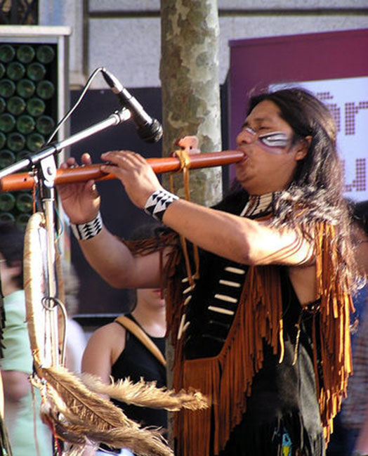
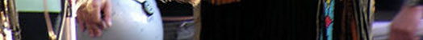
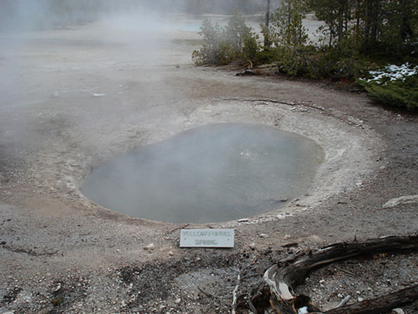
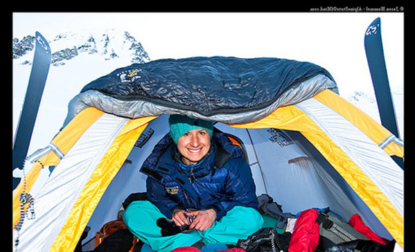
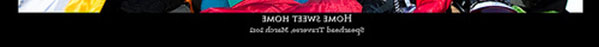
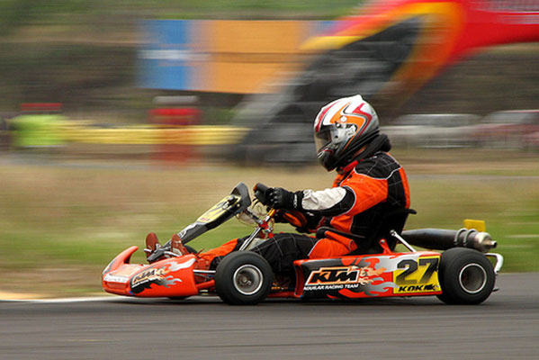
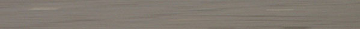

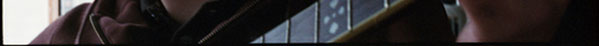

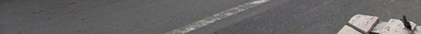

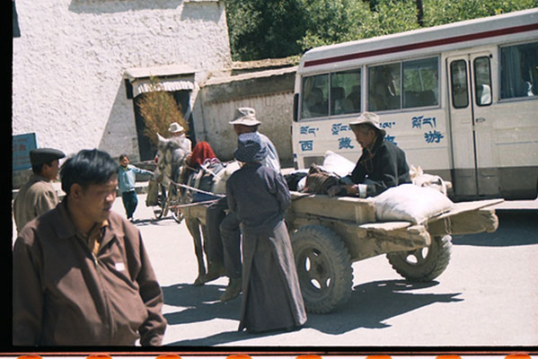
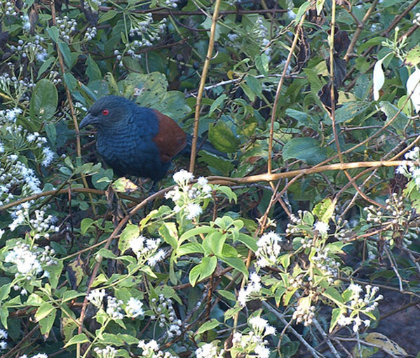

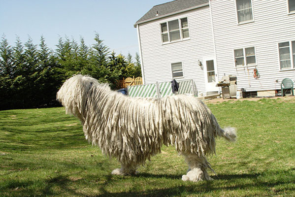
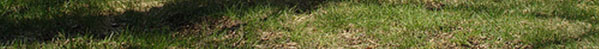

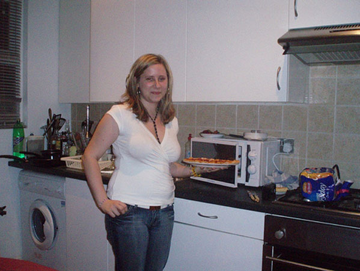

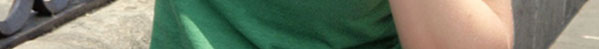
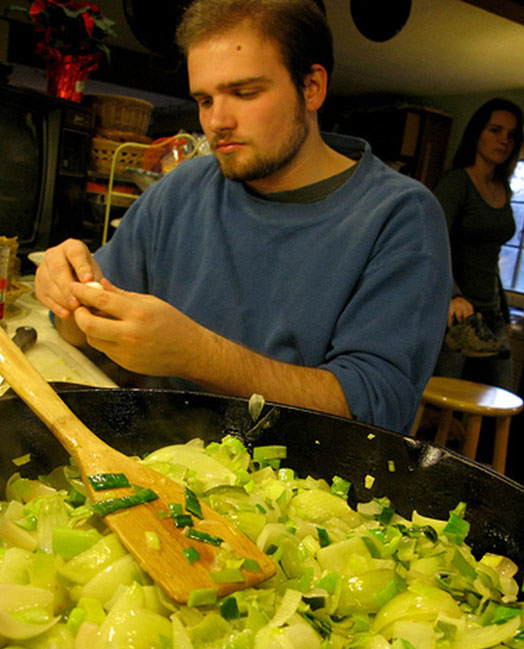
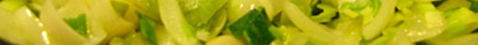
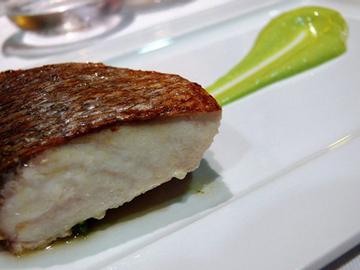

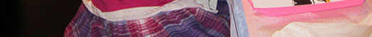
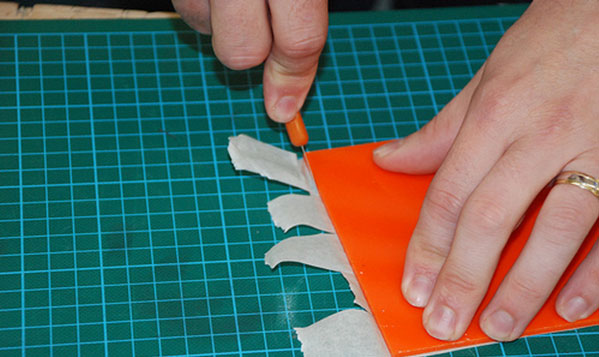

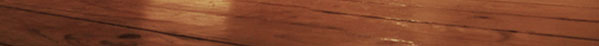

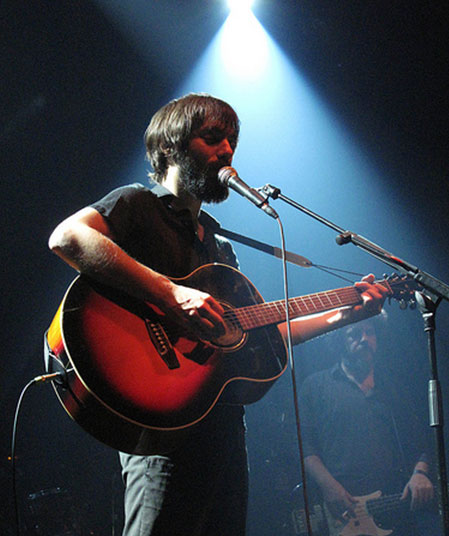
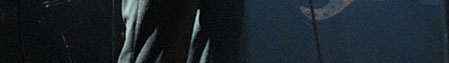
