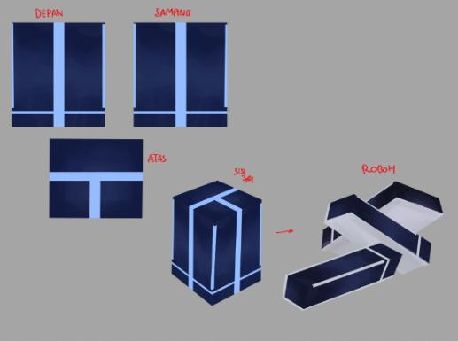
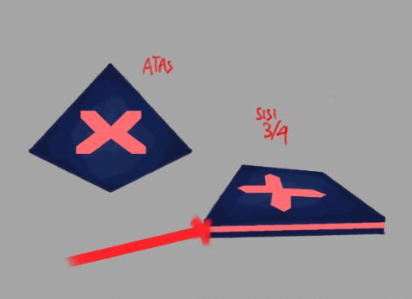
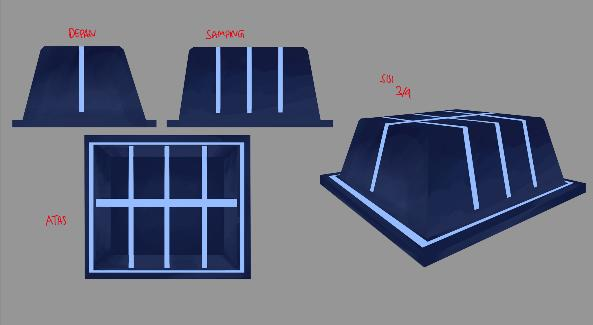
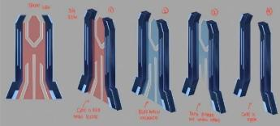
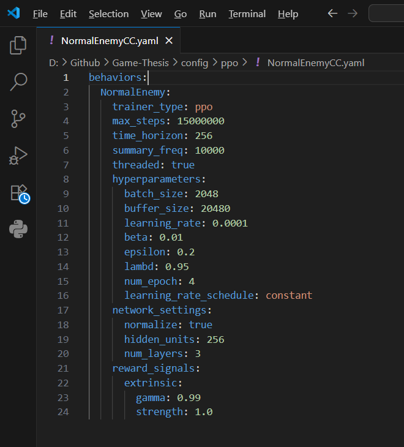

69
Objek Keterangan
3. Destructible Box
Objek ini adalah sebuah kotak yang ketika
dihancurkan oleh pemain memperoleh “Data”
dan darah (Health) untuk pemain.
4. Laser
Laser adalah salah satu objek tantangan yang
dapat menyerang dan melukai karakter
pemain dalam game.
5. Wall
Objek ini berperan sebagai tantangan maupun
pembantu untuk menghalau musuh dalam
arena.
6. Arena Door
Objek ini berperan sebagai tantangan pintu
yang terdapat pada setiap arena dan terbuka
jika pemain telah menyelesaikan objektif atau
membunuh seluruh musuh.
3.3 Reinforcement Learning (RL)
Setelah langkah sebelumnya menjabarkan keseluruhan alur pre-production,
kemudian merancang sistem reinforcement learning. Pada bagian ini dilakukan
langkah-langkah penerapan reinforcement learning pada sistem AI game.
Merujuk kembali pada algoritma reinforcement learning yang di mana
memiliki berbagai algoritma berdasarkan dua tipe policy yakni on-policy dan off-
policy [32]. Dari kedua tipe algoritma tersebut, terdapat dua algoritma yang lumrah
digunakan, yakni PPO dan SAC. Kedua algoritma ini telah diteliti dan diuji pada
penelitian yang berjudul “Comparative Study of SAC and PPO in Multi-Agent

70
Reinforcement Learning Using Unity ML-Agents” tahun 2023. Penelitian tersebut
menyimpulkan bahwa meskipun algoritma SAC memiliki performa 50% lebih baik
dari pelatihan yang diperlukan, namun PPO memiliki stabilitas dan efisiensi yang
lebih baik dikarenakan PPO merupakan algoritma on-policy, dibandingkan dengan
SAC yang merupakan algoritma off-policy. Selain itu, PPO memiliki sifat yang
lebih agresif terkait menyerang atau menghadapi lawan yang cocok dengan masalah
pada game Code Crusader: Anti-Virus Assault [36]. Oleh karena itu berdasarkan
kesimpulan di atas, algoritma PPO digunakan dalam penerapan reinforcement
learning pada penelitian ini dan berfokus pada penerapan sistem AI normal enemy.
Berikut adalah tahapan penerapan reinforcement learning.
3.3.1 Environment and Task Specifics
Pada tahapan ini dilakukan penjabaran mengenai environment yang berisikan
dunia dan objek apa saja yang digunakan dan task specifics yang berisikan state.
Berikut adalah environment dan state yang digunakan.
3.3.1.1 Environment
Environment yang digunakan adalah normal enemy arena berisikan digi-
chest, destructible box dan wall.
Tabel 3.23 Environment yang Digunakan
Komponen Keterangan
Normal Arena (9m X 9.5m) : Normal Arena dengan ukuran p x l (9m X 9.5m) yang
- Digi-Chest digunakan sebagai environment untuk normal enemy,
- Desctructible Box dimana terdapat 3 objek yang dapat muncul berupa digi-
- Wall chest, destructible box dan wall.
3.3.1.2 State
State yang digunakan adalah bagian dari normal enemy, yakni idle,
pathfinding, position of agent on the arena, attacking dan death. State yang
digunakan berkaitan dengan policy yang digunakan nantinya.
Tabel 3.24 State yang Digunakan
State Keterangan
Idle Normal Enemy melakukan idle (berdiam) sebelum berada
pada state yang lain terlebih dahulu.
Pathfinding Normal Enemy mencari jalan (pathfinding) untuk
mengelilingi arena.

71
State Keterangan
Position of Agent on the Arena Normal Enemy sesudah melakukan pathfinding, mencari dan
mendeteksi jika adanya pemain berdasarkan posisi normal
enemy pada arena (position of agent on the arena).
Attacking Setelah normal enemy mendeteksi pemain dan berhasil
mengejar hingga mendekati pemain. Maka normal enemy
memasuki state menyerang (attacking), dan menyerang jika
pemain berada dalam jangkauan serangan dari masing-
masing normal enemy.
Death Jika normal enemy terkena cukup serangan dan darahnya (HP
<= 0), maka normal enemy berada pada state mati (dead) dan
menjatuhkan material untuk peningkatan karakter pemain.
3.3.2 Agent Action Observations
Kemudian pada tahapan ini menjabarkan agent dan action yang digunakan
dalam penerapan. Berikut adalah agent dan action yang digunakan.
3.3.2.1 Agent
Agent yang digunakan adalah normal enemy berisikan creep, humanoid dan
bull.
Tabel 3.25 Agent yang Digunakan
Komponen Keterangan
Normal Enemy : Ketiga normal enemy digunakan sebagai agent dalam game,
- Creep dengan seluruh normal enemy memiliki fungsi state, action,
- Humanoid reward yang sama.
- Bull
3.3.2.2 Action
Action yang digunakan adalah idle, patroling, detecting, chasing, attacking
dan dead yang merupakan bagian state dan policy yang berkaitan pada normal
enemy.
Tabel 3.26 Action yang Digunakan
Action Keterangan
Idle Normal Enemy melakukan idle (berdiam) sebelum melakukan action yang
lain terlebih dahulu.
Patroling Normal Enemy melakukan patroling (berpatroli) sesudah melakukan idling
dan mencari jalan (pathfinding) untuk mengelilingi arena.
Detecting Normal Enemy sesudah melakukan patroling, mencari dan mendeteksi
(detecting) pemain berdasarkan posisi normal enemy pada arena (position of
agent on the arena).
Chasing Setelah berhasil mendeteksi pemain, normal enemy memasuki mode
mengejar pemain (chasing).
Attacking Setelah normal enemy mendeteksi pemain dan berhasil mengejar hingga
mendekati pemain. Maka normal enemy memasuki mode menyerang
(attacking), dan menyerang jika pemain berada dalam jangkauan serangan
dari masing-masing normal enemy.

72
Action Keterangan
Dead Jika normal enemy terkena cukup serangan dan darahnya (HP <= 0), maka
normal enemy mati (dead) dan menjatuhkan material untuk peningkatan
karakter pemain.
3.3.3 Reward Value Mechanism
Tahapan ini mengacu pada Acuan Reward Values dan mengambil acuan dari
mekanisme nilai reward dan punishment tersebut. Hal ini diperlukan untuk
menyesuaikan lebih rinci lagi terhadap state dan action yang diambil oleh agent.
Berikut adalah nilai acuan policy pelatihan pada Tabel 3.27.
Tabel 3.27 Acuan Reward Values
Nilai Mekanisme Reward
>+1 Agent menerima reward yang sangat besar.
+ 0.5 - 1 Agent menerima reward yang besar.
+ 0.005 – 0.5 Agent menerima reward.
Nilai Mekanisme Punishment
<-1 Agent menerima punishment yang sangat besar.
- 0.5 - 1 Agent menerima punishment yang besar.
- 0.005 – 0.5 Agent menerima punishment.
Nilai dari acuan mekanisme reward values didasari oleh penelitian yang
berjudul “Comparative Study of SAC and PPO in Multi-Agent Reinforcement
Learning Using Unity ML-Agents” tahun 2023. Penelitian ini menggunakan
mekanisme reward dengan batas nilai (1 − ϵ, 1 + ϵ) Batas ini digunakan untuk
menstabilkan pelatihan dan memastikan bahwa tidak ada nilai yang berlebihan
mempengaruhi saat dilakukan pelatihan. Selain itu, batas ini digunakan untuk
menghindari istilah “reward hacking”. Istilah ini menurut Amodei mengacu ketika
agent melakukan eksploitasi terhadap kelemahan dalam mekanisme reward values
untuk memperoleh reward tinggi tanpa mempelajari atau menyelesaikan tugas dan
action tersebut [42].
Dari nilai acuan tersebut terdapat ekspektasi tabel nilai reward awal untuk
setiap action yang dilakukan oleh agent. Tabel nilai ini berfokus pada action apa
saja yang mungkin terjadi jika nilai reward mencapai pada nilai tertentu. Meski
begitu, tidak selamanya action tersebut muncul saat nilai cumulative reward sudah
mencapai jarak nilai yang dapat dilakukan oleh action, karena sifat dinamis dari
reinforcement learning dan skenario yang tidak selalu sama. Berikut adalah tabel
ekspektasi action yang mungkin terjadi berdasarkan nilai reward dan punishment.

73

Tabel 3.28 Tabel Ekspektasi Action yang Mungkin Terjadi Berdasarkan Nilai Reward
| Action   | Nilai   |     |     | Keterangan  |     |     |
| -------- | ------- | --- | --- | ----------- | --- | --- |
Karena action ini merupakan action awal yang dilakukan
Idle  0  oleh agent, maka nilai ekspektasinya adalah 0 atau minus
jika agent tidak bergerak sama sekali.
Jika agent berhasil melakukan patroling dan mengelilingi
arena, maka nilai ekspektasinya dari 0.005 −  1, karena jika
| Patroling  | 0.005 −  1  |                   |            |        |                 |        |
| ---------- | ----------- | ----------------- | ---------- | ------ | --------------- | ------ |
|            |             | agent  melakukan  | patroling  | terus  | menerus,  maka  | nilai  |
cumulative reward bertambah.
Jika agent berhasil melakukan detecting saat melakukan
patroli, maka nilai ekspektasinya dari 0.5 −  1, karena jika
| Detecting  | 0.5 −  1  |     |     |     |     |     |
| ---------- | --------- | --- | --- | --- | --- | --- |
agent melakukan  detecting  setelah melakukan patroling,
maka nilai cumulative reward bertambah.
Jika agent berhasil melakukan chasing setelah mendeteksi
pemain, maka nilai ekspektasinya dari 0.5 −  1, karena jika
| Chasing  | 0.5 −  1  |     |     |     |     |     |
| -------- | --------- | --- | --- | --- | --- | --- |
agent melakukan chasing   setelah melakukan detecting,
maka nilai cumulative reward bertambah.
Jika agent berhasil melakukan attacking setelah mengejar
pemain, maka nilai ekspektasinya dari 1 +, karena jika
| Attacking  | 1 +  |                   |            |        |                |        |
| ---------- | ---- | ----------------- | ---------- | ------ | -------------- | ------ |
|            |      | agent  melakukan  | attacking  | terus  | menerus  maka  | nilai  |
cumulative reward bertambah.

Tabel 3.29 Tabel Ekspektasi Action yang Mungkin Terjadi Berdasarkan Nilai Punishment
| Action   | Nilai   |     |     | Keterangan  |     |     |
| -------- | ------- | --- | --- | ----------- | --- | --- |
Jika agent berhasil melakukan patroling dan mengelilingi
arena, maka nilai ekspektasinya dari -0.005 −   −1, karena
| Patroling  | -0.005 −  −1  |     |     |     |     |     |
| ---------- | ------------- | --- | --- | --- | --- | --- |
jika agent melakukan patroling terus menerus, maka nilai
cumulative reward bertambah.
Jika agent berhasil melakukan detecting saat melakukan
patroli, maka nilai ekspektasinya dari -0.5 −   −1, karena
| Detecting  | -0.5 −  −1  |              |            |              |                       |     |
| ---------- | ----------- | ------------ | ---------- | ------------ | --------------------- | --- |
|            |             | jika  agent  | melakukan  |   detecting  |   setelah  melakukan  |     |
patroling, maka nilai cumulative reward bertambah.
Jika agent berhasil melakukan chasing setelah mendeteksi
pemain, maka nilai ekspektasinya dari -0.5 −   −1, karena
| Chasing  |  -0.5 − −1  |     |     |     |     |     |
| -------- | ----------- | --- | --- | --- | --- | --- |
jika agent melakukan chasing  setelah melakukan detecting,
maka nilai cumulative reward bertambah.
Jika agent mati/dead, maka nilai ekspektasinya − 1, karena
| Dead  |  −1  |     |     |     |     |     |
| ----- | ---- | --- | --- | --- | --- | --- |
agent setelah dead tidak melakukan action kembali.
Kemudian terdapat juga policy yang di khususkan saat melakukan pelatihan.
Di mana policy pelatihan ini, mengambil dari apa saja yang bisa dilakukan oleh
agent seperti action, state, environment yang mempengaruhi dan juga mengambil
referensi dari penelitian sebelumnya sebagai acuan karena merupakan game aksi
dan memiliki policy yang bisa disesuaikan dengan policy pada game Code Crusader
[42]. Dalam policy ini, terdapat reward dan punishment yang diberikan ketika agent

74
membuat suatu action atau langkah yang diambil. Berikut adalah policy pelatihan
pada agent musuh yang digunakan pada Tabel 3.30.
Tabel 3.30 Policy Pelatihan pada Normal Enemy dengan Reward Values
Policy Reward Value
1. Jika agent normal enemy, kesulitan dalam bergerak atau tidak bergerak
sama sekali setelah 50 langkah atau lebih dari 2 detik, maka iterasi Iteration skipped
training (pelatihan) dilewati.
2. Jika agent tidak bergerak sama sekali, agent mendapatkan punishment. − 0.010 (Step)
3. Jika agent mendekati tembok atau obstacle maka agent mendapatkan
− 0.20 (Step)
punishment yang besar.
4. Jika agent berhasil bergerak dan berpatroli mengelilingi arena, maka
+ 0.005 (Step)
agent diberikan reward.
5. Jika agent berhasil menyelesaikan satu rotasi patroli dalam arena, maka
+ 0.5
agent diberikan reward.
6. Jika agent gagal bergerak dan berpatroli mengelilingi arena, maka agent
− 0.01 (Step)
diberikan punishment berupa punishment.
7. Jika agent berhasil mendekati pemain, maka agent mendapatkan
+ 0.01
reward.
8. Jika agent gagal mendekati pemain, maka agent mendapatkan
− 0.05 (Step)
punishment.
9. Jika agent berhasil mendeteksi pemain saat melakukan patroli, maka
+ 0.5
agent mendapatkan reward.
10. Jika agent mengejar pemain setelah mendeteksi pemain maka agent
+ 0.010 (Step)
mendapatkan reward.
11. Jika agent berhasil mengejar pemain maka agent mendapatkan reward
+ 0.5
yang besar.
12. Jika agent tidak mengejar pemain maka agent mendapatkan
− 0.05 (Step)
punishment.
13. Jika setelah mengejar pemain agent menyerang pemain, maka agent
+ 0.5
mendapatkan reward yang besar.
14. Jika agent tidak langsung menyerang pemain, maka agent mendapatkan
− 0.01 (Step)
punishment.
15. Jika serangan agent tidak mengenai pemain, maka agent mendapatkan
− 0.1
punishment.
16. Jika agent terkena serangan oleh pemain, maka agent mendapatkan
− 0.5
punishment yang besar.
17. Jika agent setelah menyerang berhasil dan menang melawan pemain,
+ 1
maka agent mendapatkan reward yang sangat besar.
18. Jika agent gagal menyerang dan kalah, maka agent mendapatkan
− 1
punishment yang sangat besar.
Dalam tabel bagian reward value, yang dimaksudkan dengan (+/− angka
(step)) adalah, nilainya bertambah atau berkurang per langkah. Sementara jika

75
angka tidak terdapat (step), maka nilai akan bertambah atau berkurang berdasarkan
action yang dilakukan.
Setelah menjabarkan tabel policy pelatihan, terdapat tabel ekspektasi
cumulative reward dalam skenario pelatihan. Tabel ini menggabungkan Tabel 3.28,
Tabel 3.29 dan Tabel 3.30 untuk mencari policy pelatihan dari action mana yang
agent pilih dalam jarak nilai cumulative reward tertentu. Hasil dari nilai cumulative
reward untuk policy pelatihan yang bersifat step, didapatkan dari melakukan
perkalian nilai policy pelatihan dengan 100 langkah/timesteps yang mengambil
penelitian Openai berjudul “Proximal Policy Optimization Algorithms,” Jul. 2017,
yang di mana state dan action agent bervariasi setiap 200 steps, dan diambil nilai
tengah 100 sebagai contoh perhitungan, serta nilai V(sₜ₊₁) = 0.250 yang diambil
dari neural network critic setelah melakukan action dan V(sₜ) = 0.300 dari neural
network critic sebelum melakukan action [37]. Tabel ini juga menjelaskan
kemungkinan apa yang dilakukan agent berikutnya setelah melakukan action dari
suatu policy. Berikut adalah ekspektasi policy dan action yang mungkin terjadi
berdasarkan nilai cumulative reward pada Tabel 3.31.
Tabel 3.31 Ekspektasi Policy dan Action yang Mungkin Terjadi Berdasarkan Nilai
Cumulative Reward
Cumulative
No Policy Action Keterangan
Reward
1. Jika agent normal enemy, kesulitan Tidak terdapat ekspektasi cumulative reward
dalam bergerak atau tidak bergerak karena episode/iterasi akan dilewat. Untuk
Idle Iteration
sama sekali setelah 50 langkah atau action, terdapat 2 ekspektasi berupa idle karena
Patroling Skipped
lebih dari 2 detik, maka iterasi agent tidak bergerak dan patroling karena agent
training (pelatihan) dilewati. kesulitan dalam bergerak.
2. Jika agent tidak bergerak sama Secara cumulative, agent menerima punishment
sekali, agent mendapatkan yang besar jika agent tidak bergerak sama sekali.
punishment. Hal ini berkaitan dengan action yang dapat
Idle
−1 dilakukan agent pada policy ini berupa idle,
Patroling
karena agent tidak bergerak dan patroling,
karena agent tidak bergerak dan melakukan
patroli.
3. Jika agent mendekati tembok atau Secara cumulative, agent menerima punishment
obstacle maka agent mendapatkan yang sangat besar jika agent mendekati tembok
punishment yang besar. atau obstacle. Hal ini berkaitan dengan action
Patroling − 20
yang sedang dilakukan agent pada policy ini
berupa patroling, dan agent mendekati tembok
atau obstacle pada saat mencari rute patroli.
4. Jika agent berhasil bergerak dan Secara cumulative, agent menerima reward yang
berpatroli mengelilingi arena, maka Patroling 0.5 besar jika agent berhasil bergerak dan berpatroli.
agent diberikan reward. Hal ini berkaitan dengan action yang sedang

76
Cumulative
No Policy Action Keterangan
Reward
dilakukan agent pada policy ini berupa
patroling, dan agent berhasil mencari rute
patroli.
5. Jika agent berhasil menyelesaikan Secara action, agent menerima reward yang
satu rotasi patroli dalam arena, besar jika agent berhasil menyelesaikan satu
maka agent diberikan reward. rotasi patroli dalam arena. Hal ini berkaitan
Patroling + 0.5 dengan action yang sedang dilakukan agent pada
policy ini berupa patroling, dan agent berhasil
mencari rute patroli dan menyelesaikan satu
rotasi dalam arena.
6. Jika agent gagal bergerak dan Secara cumulative, agent menerima punishment
berpatroli mengelilingi arena, maka yang sangat besar jika agent gagal bergerak dan
agent diberikan punishment berupa berpatroli mengelilingi arena. Hal ini berkaitan
punishment. Idle dengan action yang sedang dilakukan agent pada
− 1
Patroling policy ini berupa idle, karena agent hanya
terdiam dan tidak mencoba mengelilingi arena
serta patroling, karena agent gagal mencari rute
patroli jika agent berhasil bergerak.
7. Jika agent berhasil mendekati Secara cumulative, agent menerima reward yang
pemain, maka agent mendapatkan sangat besar jika agent berhasil mendekati
reward. pemain. Hal ini berkaitan dengan action yang
Detecting
1 sedang dilakukan agent pada policy ini berupa
Chasing
detecting, karena agent berawal dari mendeteksi
pemain. Kemudian chasing, karena agent
mendekati pemain.
8. Jika agent gagal mendekati pemain, Secara cumulative, agent menerima punishment
maka agent mendapatkan yang sangat besar jika agent gagal mendekati
punishment. pemain. Hal ini berkaitan dengan action yang
Detecting
− 10 sedang dilakukan agent pada policy ini berupa
Chasing
detecting, karena agent berawal dari mendeteksi
pemain. Kemudian chasing, karena agent gagal
mendekati pemain.
9. Jika agent berhasil mendeteksi Secara action, agent menerima reward yang
pemain saat melakukan patroli, besar jika agent berhasil mendeteksi pemain saat
maka agent mendapatkan reward. melakukan patroli. Hal ini berkaitan dengan
Patroling
action yang sedang dilakukan agent pada policy
Detecting + 0.5
ini berupa patroling, karena agent berawal dari
berpatroli mengelilingi arena. Kemudian
detecting, karena agent berhasil mendeteksi
pemain.
10. Jika agent mengejar pemain setelah Secara cumulative, agent menerima reward yang
mendeteksi pemain maka agent sangat besar jika agent mengejar setelah
mendapatkan reward. mendeteksi pemain. Hal ini berkaitan dengan
Detecting
2 action yang sedang dilakukan agent pada policy
Chasing
ini berupa detecting, karena agent berawal dari
mendeteksi pemain. Kemudian chasing, karena
agent mengejar pemain.
11. Jika agent berhasil mengejar Secara action, agent menerima reward yang
pemain maka agent mendapatkan besar jika agent berhasil mengejar pemain. Hal
reward yang besar. Chasing + 0.5 ini berkaitan dengan action yang sedang
dilakukan agent pada policy ini berupa chasing,
karena agent berhasil mengejar pemain.

77
Cumulative
No Policy Action Keterangan
Reward
12. Jika agent tidak mengejar pemain Secara cumulative, agent menerima punishment
maka agent mendapatkan yang sangat besar jika agent mengejar setelah
punishment. mendeteksi pemain. Hal ini berkaitan dengan
Chasing − 10
action yang sedang dilakukan agent pada policy
ini berupa chasing, karena agent tidak mengejar
pemain.
13. Jika setelah mengejar pemain agent Secara action, agent menerima reward yang
menyerang pemain, maka agent besar jika agent berhasil mengejar dan
mendapatkan reward yang besar. menyerang pemain. Hal ini berkaitan dengan
Chasing
+ 0.5 action yang sedang dilakukan agent pada policy
Attacking
ini berupa chasing, karena agent mengejar
pemain dan attacking ketika agent berhasil
menyerang pemain.
14. Jika agent tidak langsung Secara cumulative, agent menerima punishment
menyerang pemain, maka agent yang sangat besar jika agent tidak langsung
mendapatkan punishment. menyerang pemain. Hal ini berkaitan dengan
Attacking − 2
action yang sedang dilakukan agent pada policy
ini berupa attacking karena agent tidak langsung
menyerang pemain.
15. Jika serangan agent tidak mengenai Secara action, agent menerima punishment jika
pemain, maka agent mendapatkan agent tidak mengenai pemain. Hal ini berkaitan
punishment. Attacking − 0.1 dengan action yang sedang dilakukan agent pada
policy ini berupa attacking karena serangan dari
agent tidak mengenai pemain.
16. Jika agent terkena serangan oleh Secara action, agent menerima punishment yang
pemain, maka agent mendapatkan besar jika agent terkena serangan oleh pemain.
punishment yang besar. Hal ini berkaitan dengan action yang sedang
Attacking − 0.5
dilakukan agent pada policy ini berupa attacking
karena agent mencoba menyerang dan melawan
pemain meski terkena serangan dari pemain.
17. Jika agent setelah menyerang Secara action, agent menerima reward yang
berhasil dan menang melawan sangat besar jika agent berhasil menang melawan
pemain, maka agent mendapatkan pemain. Hal ini berkaitan dengan action yang
Attacking + 1
reward yang sangat besar. sedang dilakukan agent pada policy ini berupa
attacking karena agent berhasil menang
melawan pemain.
18. Jika agent gagal menyerang dan Secara action, agent menerima punishment yang
kalah, maka agent mendapatkan sangat besar jika agent kalah dan gagal
punishment yang sangat besar. menyerang pemain. Hal ini berkaitan dengan
Attacking action yang sedang dilakukan agent pada policy
− 1
Dead ini berupa attacking karena agent berhasil sedang
melawan pemain dan kalah. Kemudian dead,
karena setelah agent kalah maka dia akan
mati/dead.

78
3.3.4 Hyperparameter
Kemudian, terdapat konfigurasi yang mengatur kombinasi nilai optimal
parameter tertentu selama proses pelatihan model yang bernama hyperparameter.
Hyperparameter telah diatur berdasarkan dokumen pemandu unity ml agents dan
penelitian yang berjudul “Comparative Study of SAC and PPO in Multi-Agent
Reinforcement Learning Using Unity ML-Agents” tahun 2023, dengan rekomendasi
nilai untuk membantu optimasi pembelajaran dan performa pelatihan [36]. Berikut
adalah hyperparameter yang telah dilakukan konfigurasi :
Gambar 3.12 Hyperparameter

3.3.5 Policy and Update
Terakhir terdapat tahapan kemampuan pembaruan policy, tahapan ini
mengambil seluruh policy yang terdapat pada policy pelatihan beserta reward value.
Setelah itu, dilakukan pembaruan dari policy yang terjadi berdasarkan nilai reward
pada policy pelatihan, untuk memperbarui parameter policy yang optimal. Pada
perhitungan policy pelatihan ini mengambil referensi dari penelitian Openai
berjudul “Proximal Policy Optimization Algorithms,” Jul. 2017 dan melakukan
perkalian nilai policy pelatihan dengan 200 langkah/timesteps, yang di mana state
dan action agent bervariasi setiap 200 steps, dan diambil nilai tengah 100 sebagai
contoh perhitungan beserta nilai V(sₜ₊₁), V(sₜ), 𝜋 (𝑎 |𝑠 ) dan 𝜋 (𝑎 |𝑠 ) [37].
𝜃 𝑡 𝑡 𝜃 𝑡 𝑡
old
Berikut adalah perhitungan policy pelatihan dan hasil pembaruannya dalam policy
update.
3.3.5.1 Perhitungan Policy Pelatihan
1) Perhitungan policy “agent normal enemy, kesulitan dalam bergerak atau tidak
bergerak sama sekali setelah 50 langkah atau lebih dari 2 detik, maka iterasi
training (pelatihan) dilewati.” tidak akan dihitung, karena tidak memiliki nilai
reward dan policy ini melewati iterasi training.
2) Perhitungan policy “jika agent tidak bergerak sama sekali, agent
mendapatkan punishment”.
Tipe reward = step
Reward value = −0.01 (step)
Total reward = −1 (reward × 100 step)
Perhitungan ini, menjabarkan tipe reward (step/action), nilai reward value
beserta contoh langkah/steps. Kemudian setelah mendapatkan nilai total reward,
dilakukan perhitungan untuk mencari nilai TD (δₜ) (Rumus 2.2).
δₜ = r + γ × V(sₜ₊₁) − V(sₜ)
V(sₜ₊₁) = 0.250 (dari neural network critic setelah melakukan action)
V(sₜ) = 0.300 (dari neural network critic)
δₜ = −1 + 0.99 × 0.250 − 0.300
79

## Extracted Images

### Page 1

### Page 10

