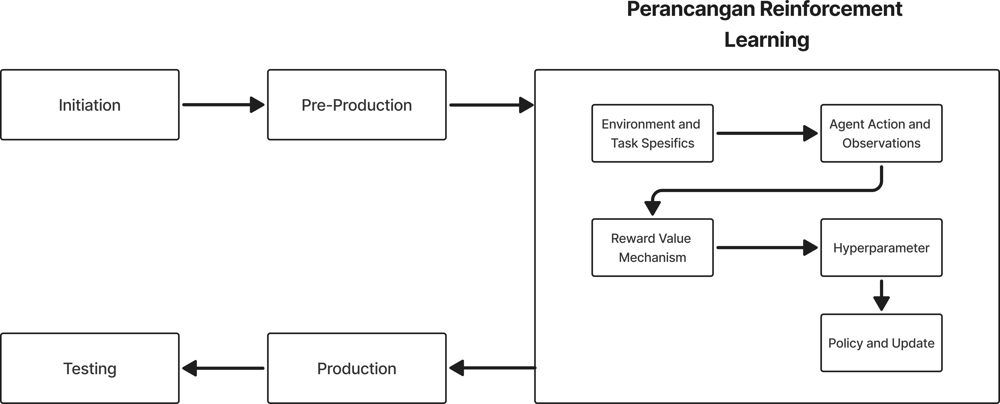
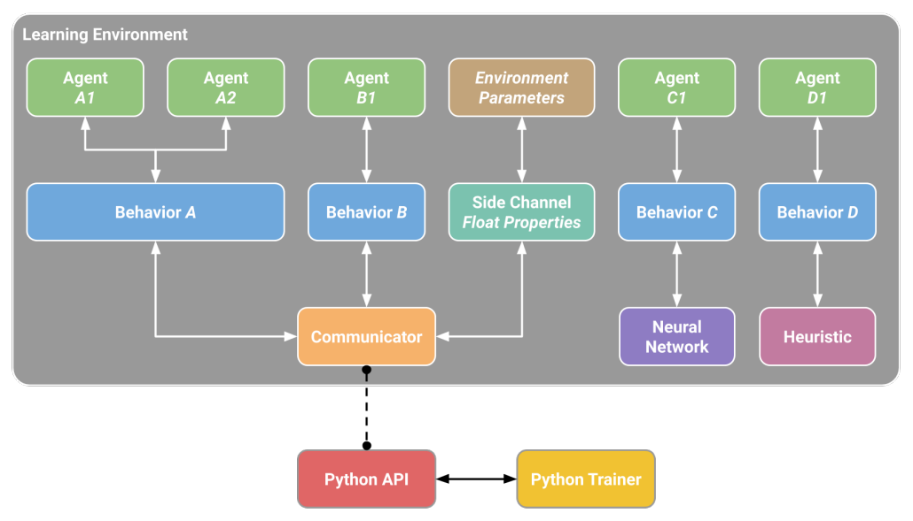
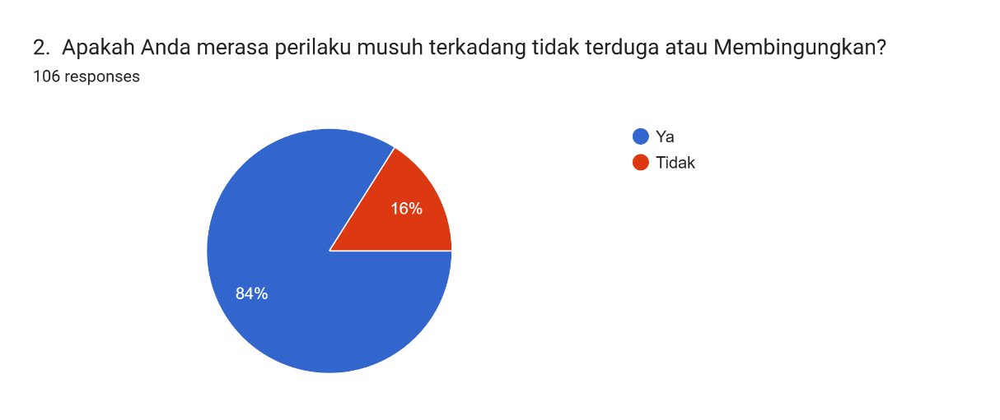
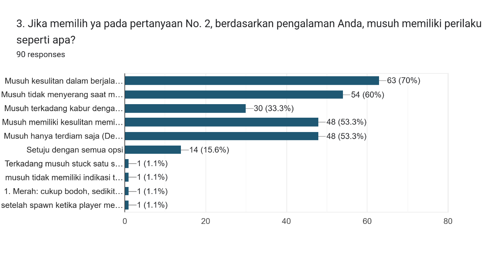
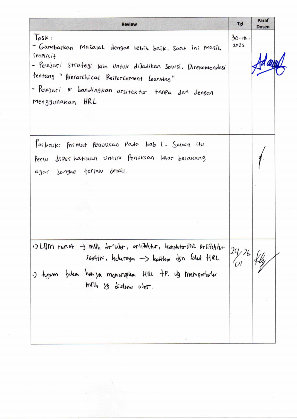
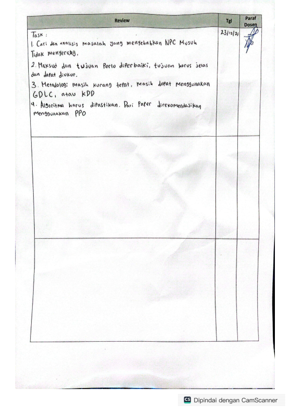

Penerapan

Hierarchical REINFORCEMENT LEARNING

PADA NON-PLAYABLE character Musuh Di

Game 3D ACTION Hack and Slash

**SKRIPSI**

Diajukan sebagai salah satu syarat untuk memperoleh gelar Sarjana (S1)

**RAVA RADITHYA RAZAN**

**10122108**

****

**PROGRAM STUDI TEKNIK INFORMATIKA**

**FAKULTAS TEKNIK DAN ILMU KOMPUTER**

**UNIVERSITAS KOMPUTER INDONESIA**

**2026**

# DAFTAR ISI

[DAFTAR ISI i](#_Toc221315718)

[DAFTAR GAMBAR iii](#_Toc221315719)

[DAFTAR TABEL iv](#_Toc221315720)

[DAFTAR SIMBOL v](#_Toc221315721)

[BAB 1 PENDAHULUAN 1](#_Toc221315722)

[1.1 Latar Belakang 1](#_Toc221315723)

[1.2 Rumusan Masalah 2](#_Toc221315724)

[1.3 Maksud dan Tujuan 2](#_Toc221315725)

[1.4 Batasan Masalah 2](#_Toc221315726)

[1.5 Metodologi Penelitian 3](#_Toc221315727)

[1.6 Sistematika Penulisan 4](#_Toc221315728)

[BAB 2 LANDASAN TEORI 5](#_Toc221315729)

[2.1 Game 5](#_Toc221315730)

[2.2 Game Engine 5](#_Toc221315731)

[2.3 Unity 5](#_Toc221315732)

[2.4 Unity ML-Agents 6](#_Toc221315733)

[2.5 C# 6](#_Toc221315734)

[2.6 Hack and Slash 6](#_Toc221315735)

[2.7 NPC 6](#_Toc221315736)

[2.8 Environment 7](#_Toc221315737)

[2.9 Stage 7](#_Toc221315738)

[2.10 Python 7](#_Toc221315739)

[2.11 PyTorch 7](#_Toc221315740)

[2.12 Tensorflow 8](#_Toc221315741)

[2.13 Tensorboard 8](#_Toc221315742)

[2.14 AI System 8](#_Toc221315743)

[2.15 Deep Learning 8](#_Toc221315744)

[2.16 Neural Network 9](#_Toc221315745)

[2.17 Reinforcement Learning 9](#_Toc221315746)

[2.17.2 Komponen Reinforcement Learning 9](#_Toc221315747)

[2.17.3 Metrik Evaluasi 10](#_Toc221315748)

[2.17.4 Deep Reinforcement Learning 10](#_Toc221315749)

[2.17.5 Proximal Policy Optimization (PPO) 10](#_Toc221315750)

[2.17.6 Hierarchical Reinforcement Learning (HRL) 11](#_Toc221315751)

[2.17.7 Hierarchical Critic Assignment (HCA) 11](#_Toc221315752)

[2.18 Game Experience Questionnaire (GEQ) 11](#_Toc221315753)

[DAFTAR PUSTAKA 12](#_Toc221315754)

[LAMPIRAN A HASIL KUISIONER PEMAIN 1](#_Toc221315755)

[LAMPIRAN B FORM REVIEW PEMBIMBING 2](#_Toc221315756)

# DAFTAR GAMBAR

[Gambar 1.1 Metodologi Penelitian 3](#_Toc221231983)

# DAFTAR TABEL

No table of figures entries found.

# DAFTAR SIMBOL

# PENDAHULUAN

## Latar Belakang

Industri *video game* saat ini menunjukkan pertumbuhan yang signifikan, ditandai dengan proyeksi peningkatan pendapatan yang tinggi hingga tahun 2025 [1]. Di dalam sebuah *game*, *Non-Player Character* (NPC) memiliki peran penting sebagai tantangan bagi pemain [2]. Namun, metode pengembangan NPC secara konvensional, seperti *behavior trees* atau *finite state machine*, sering menghadapi kendala seperti, perilaku yang kaku, dan mudah ditebak [3].

Sebagai upaya untuk mengatasi kekurangan tersebut, teknologi *Reinforcement Learning* (RL) digunakan untuk menghasilkan NPC yang lebih adaptif [4]. Walaupun begitu, implementasi RL pada lingkungan *game* yang kompleks sering kali memunculkan masalah baru. Permasalahan ini ditemukan pada *video game action 3D hack and slash* berjudul *“Code Crusader: Anti-Virus Assault”* yang telah mengimplementasikan algoritma *Proximal Policy optimization* (PPO). Namun, berdasarkan hasil kuisioner yang dilakukan oleh tim pengembang, ditemukan bahwa meskipun telah menggunakan RL, sistem masih mengalami kesulitan dalam memberikan respon yang sesuai. Data hasil kuisioner menunjukkan bahwa 84% pemain menilai bahwa perilaku musuh membingungkan. Secara lebih spesifik, 70% insiden teknis yang dilaporkan merupakan kegagalan navigasi, sementara 60% insiden lainnya merupakan insiden di mana musuh tidak menyerang pemain meski berada dalam jangkauan serangan (Lampiran A).

Masalah tersebut terjadi karena keterbatasan arsitektur algoritma PPO yang digunakan saat ini. Algoritma RL seperti PPO sering kali mengalami kegagalan dalam menyelesaikan tugas jangka panjang [5]. Hal ini menyebabkan pula masalah *credit assignment*, di mana agen kesulitan menghubungkan aksi yang dilakukan dengan *reward* yang diterima di masa depan [5]. Ketidakmampuan dalam memberikan evaluasi nilai yang presisi pada setiap aksi menyebabkan musuh gagal melakukan dan koordinasi serangan yang konsisten [6].

Sebagai solusi, penelitian ini akan menerapkan *Hierarchical Critic Assignment* (HCA) untuk mengatasi masalah-masalah tersebut melalui dekomposisi fungsi *critic* ke dalam beberapa level hierarki [6]. Dengan pendekatan *hierarchical critics*, sistem dapat memberikan evaluasi nilai yang lebih spesifik bagi *critic* tingkat tinggi (*manager*) dan *critic* tingkat rendah (*worker)* secara terpisah [2], [6].

## Rumusan Masalah

Berdasarkan latar belakang, dapat dirumuskan suatu masalah yaitu apakah dengan mengimplementasikan arsitektur *Hierarchical Critic Assignment* (HCA) sebagai pengambil keputusan pada NPC *game 3D action hack and slash* “*Code Crusader: Anti-Virus Assault”*, dapat meminimalisir kegagalan navigasi dan serangan musuh?

## Maksud dan Tujuan

Penelitian ini bermaksud untuk menerapkan teknik *Hierarchical Reinforcement Learning* dalam pengembangan *video game* ber-*genre* 3D *Hack and Slash*. Selain itu, penelitian ini memiliki tujuan sebagai berikut:

1. Mengembangkan agen musuh menggunakan model arsitektur HCA pada lingkungan *game* 3D.
2. Melatih agen musuh yang dapat mengambil keputusan secara adaptif dan dapat bergerak tanpa hambatan.
3. Meningkatkan kualitas interaksi permainan yang dapat dibuktikan melalui evaluasi kepuasan pemain menggunakan metode GEQ.

## Batasan Masalah

Masalah pada penelitian ini diberikan beberapa batasan agar penelitian ini tetap selaras dengan tujuan yang telah ditentukan. Berikut batasan masalah yang telah ditentukan dari penelitian ini:

1. Algoritma RL yang digunakan pada penelitian ini Adalah *Hierarchical Critics Assignment* (HCA).
2. Fokus implementasi hanya pada NPC musuh tipe *Normal Enemy* (*Creep, Humanoid, Bull*).
3. Pengembangan dilakukan dengan menggunakan Unity *Game Engine* dan Unity *ML-Agents* *Toolkit*.

## Metodologi Penelitian

Metodologi penelitian yang digunakan mengacu pada tahapan *Game Development Life Cycle* (GDLC) yang telah disesuaikan dengan kebutuhan pengembangan *Reinforcement Learning* [7]. Tahapan-tahapan tersebut dapat dilihat pada Gambar 1.1

Gambar . Metodologi Penelitian

1. Initiation

Pada tahapan ini dilakukan identifikasi masalah pada *game* melalui data kuisioner yang menunjukkan kegagalan navigasi dan juga serangan pada NPC musuh.

1. Pre-Production

Tahapan ini meliputi persiapan lingkungan pengembangan dan aset yang dibutuhkan dalam penelitian.

1. Perancangan Reinforcement Learning

Tahapan ini dilakukan perancangan sistem *reinforcement learning* (RL) yang akan digunakan pada agen. Perancangan mencakup penentuan penentuan batas lingkungan, parameter observasi, mekanisme *reward*, penentuan *hyperparameter*, dan logika pembaruan kebijakan.

1. *Production*

Tahapan ini merupakan proses pembuatan program dan implementasi dari model RL yang telah dibuat. Aktivitas difokuskan pada proses *training* agen menggunakan Unity ML-Agents Toolkit hingga menghasilkan model yang mampu mengambil keputusan secara adaptif.

1. *Testing*

Pada tahapan ini dilakukan pengujian terhadap hasil pelatihan agen untuk mengetahui tingkat perbaikan pada perilaku navigasi dan serangan musuh. Pengujian meliputi evaluasi teknis, validasi oleh ahli di bidang *game development*, serta pengukuran pengalaman pemain menggunakan metode *Game Experience Questionnaire (GEQ).*

## Sistematika Penulisan

Sistematika penulisan dalam penelitian ini dibagi menjadi 5 bab yang tersusun secara sistematis untuk memberikan gambaran umum mengenai penelitian yang dikerjakan.

**BAB 1 Pendahuluan**

Pada bab ini akan menjelaskan mengenai latar belakang, perumusan masalah, maksud dan tujuan, batasan masalah, metodologi penelitian dan juga sistematika penulisan.

**BAB 2 Landasan Teori**

Pada bab ini akan membahas tentang uraian hasil yang di dapatkan pada penelitian yang dilakukan, konsep dasar, penelitian terdahulu, dan teori dari para ahli yang berkaitan dengan penelitian. Meninjau permasalahan dan hal-hal yang berguna dari penelitian-penelitian serupa yang pernah dikerjakan sebelumnya, lalu menggunakannya untuk acuan dalam pemecahan masalah pada penelitian ini.

**BAB 3 Analisis dan Perancangan Sistem**

Pada bab ini akan membahas tentang hasil dari penelitian untuk mengetahui masalah apa yang muncul lalu mencoba untuk memecahkan masalah tersebut.

**BAB 4 Implementasi dan Pengujian Sistem**

Bab ini akan membahas tentang perancangan solusi beserta implementasinya dari masalah-masalah yang telah dianalisis sebelumnya.

**BAB 5 Kesimpulan dan Saran**

Pada bab terakhir ini akan membahas tentang kesimpulan dari hasil penelitian dan juga memberikan saran untuk pengembangan selanjutnya.

# LANDASAN TEORI

## Game

*Game* merupakan suatu sistem interaktif yang melibatkan satu atau lebih pemain yang berupaya mencapai tujuan tertentu di dalam batasan aturan yang telah ditentukan. *Game* tidak hanya dipahami sebagai media hiburan, tetapi juga sebagai sistem yang memiliki struktur formal berupa aturan, tujuan, konflik, serta hasil yang dapat diukur. Dalam konteks penelitian kecerdasan buatan, *game* sering digunakan sebagai lingkungan simulasi karena mampu merepresentasikan permasalahan dunia nyata ke dalam bentuk virtual yang terkontrol, sehingga menjadikannya platform yang cocok untuk menguji dan mengembangkan algoritma pembelajaran mesin, termasuk *deep reinforcement learning [8]*.

## Game Engine

*Game engine* merupakan platform perangkat lunak yang menyediakan kerangka kerja terintegrasi untuk pengembangan *game*. *Game engine* umumnya mencakup sistem *rendering*, fisika, animasi, *audio*, *input*, serta *scripting* yang memungkinkan pengembang membangun *game [9]*. Dengan adanya *game engine*, pengembang tidak perlu membangun sistem dasar dari awal sehingga dapat lebih fokus pada *desain gameplay* dan implementasi AI [10]. Dalam penelitian, *game engine* berperan sebagai fondasi utama dalam membangun lingkungan simulasi yang konsisten dan dapat dikontrol. Beberapa *game engine* yang umum digunakan antara lain Unity, Unreal Engine, dan Godot, yang masing-masing memiliki karakteristik dan keunggulan tersendiri.

## Unity

Unity merupakan salah satu game engine lintas platform yang banyak digunakan dalam pengembangan game 2D maupun 3D. Unity menyediakan berbagai fitur seperti sistem fisika real-time, pipeline rendering, sistem animasi, serta dukungan scripting menggunakan bahasa pemrograman C# [9]. Unity menjadi salah satu platform yang populer dalam penelitian AI karena lingkungan simulasi Unity dapat mengintegrasikan *framework machine learning* secara langsung [10]. Unity juga mampu mendukung eksperimen banyak agen dalam satu lingkungan simulasi [11], serta mendukung integrasi *machine learning* melalui Unity ML-Agents.

## Unity ML-Agents

Unity ML-Agents adalah *toolkit open-source* yang dikembangkan untuk mengintegrasikan *machine learning* ke dalam lingkungan Unity [9]. *Toolkit* ini memungkinkan karakter atau entitas di dalam *game* bertindak sebagai agen yang dapat dilatih menggunakan *reinforcement* *learning*, *imitation learning*, maupun metode pembelajaran lainnya [10]. Unity ML-Agents berfungsi sebagai penghubung antara lingkungan simulasi di Unity dan proses pelatihan model yang dijalankan di Python, serta menyediakan implementasi algoritma *deep reinforcement learning* yang dapat digunakan langsung oleh pengembang [9], [11]

## C#

C# merupakan bahasa pemrograman berorientasi objek yang digunakan sebagai bahasa utama dalam pengembangan *game* menggunakan Unity [9]. Bahasa ini dirancang untuk berjalan di atas platform .NET dan mendukung pengembangan aplikasi yang aman serta terstruktur. Dalam Unity, C# digunakan untuk mengatur logika game, perilaku karakter, serta interaksi antara agen dan environment. Pada penelitian ini, C# berperan dalam mendefinisikan state, action, serta mekanisme reward yang akan digunakan oleh agen reinforcement learning [10].

## Hack and Slash

*Hack and Slash* merupakan salah satu dari 16 *genre* *game* yang diakui secara akademis berdasarkan analisis terhadap 100 *game* paling sukses selama 34 tahun terakhir [12]. Genre ini fokus pada pertarungan jarak dekat menggunakan senjata dengan tempo yang cepat, di mana pemain menghadapi banyak musuh secara bersamaan dalam satu area.

## NPC

*Non-Player Character* atau NPC adalah karakter di dalam *game* yang tidak dikendalikan langsung oleh pemain, melainkan oleh sistem AI. NPC dapat berperan sebagai musuh, sekutu, maupun karakter pendukung yang berinteraksi dengan pemain [2]. Kualitas perilaku NPC sangat berpengaruh terhadap pengalaman bermain karena NPC yang tidak responsif atau terlalu kaku dapat menurunkan tingkat imersi [13].

## Environment

Environment dalam reinforcement learning merupakan representasi dunia tempat agen berinteraksi. Environment menyediakan informasi state kepada agen, menerima action yang diambil agen, serta memberikan reward sebagai umpan balik [14] . Perancangan *environment* yang tepat merupakan faktor dalam keberhasilan pelatihan agen, karena distribusi *state* yang dihasilkan secara langsung memengaruhi kualitas *policy* yang dipelajari [15]. Dalam konteks *game*, *environment* diwujudkan dalam bentuk dunia permainann yang mencakup area, objek, dan aturan yang memungkinkan agen mempelajari perilaku sesuai dengan permainan [11].

## Stage

*Stage* adalah area di game yang memiliki tujuan, tantangan, dan tata letak tertentu. Setiap *stage* biasanya dirancang dengan tingkat kesulitan yang berbeda untuk memberikan variasi pengalaman bermain [8]. Dalam konteks reinforcement learning, variasi *stage* memengaruhi distribusi *state* yang dihadapi agen selama pelatihan. Hal ini penting untuk menguji kemampuan generalisasi agen terhadap kondisi lingkungan yang berbeda [15]. Oleh karena itu, stage menjadi salah satu elemen penting dalam perancangan *environment* *game*.

## Python

Python merupakan bahasa pemrograman tingkat tinggi yang banyak digunakan dalam pengembangan machine learning dan data science. Python memiliki ekosistem library yang sangat luas sehingga mendukung proses pelatihan model pembelajaran mesin secara efisien [9]. Dalam Unity ML-Agents, Python digunakan untuk menjalankan algoritma *reinforcement learning* dan mengelola proses *training* agen melalui antarmuka komunikasi yang disediakan *toolkit [9], [11]*. Dengan memisahkan proses simulasi dan pelatihan, Python memungkinkan eksperimen dilakukan secara fleksibel menggunakan berbagai algoritma dan konfigurasi yang berbeda.

## PyTorch

PyTorch adalah *framework deep learning* berbasis Python yang mendukung komputasi *tensor* dan *automatic differentiation*. PyTorch dikenal karena fleksibilitasnya dalam membangun dan memodifikasi arsitektur *neural network [9]*. Dalam penelitian *reinforcement learning*, PyTorch sering digunakan untuk mengimplementasikan *policy network* dan *value network* [11]. *Framework* ini juga mendukung proses eksperimen yang iteratif sehingga memudahkan penyesuaian model .

## Tensorflow

TensorFlow merupakan *framework open-source* untuk *machine learning* yang menggunakan konsep *dataflow* *graph* dalam proses komputasi. *Framework* ini memungkinkan pembangunan dan pelatihan model *deep learning* berskala besar [16]. TensorFlow banyak digunakan dalam berbagai aplikasi AI karena stabilitas dan dukungan ekosistemnya.

## Tensorboard

TensorBoard adalah alat visualisasi yang digunakan untuk memantau dan menganalisis proses pelatihan model *machine learning*. TensorBoard menampilkan berbagai metrik seperti *reward*, *loss*, dan parameter model dalam bentuk grafik. Dalam *reinforcement learning*, visualisasi ini membantu peneliti memahami perkembangan pelatihan agen dan mendeteksi masalah seperti ketidakstabilan atau kegagalan konvergensi [15]. Pemantauan value loss dan cumulative reward melalui TensorBoard selama proses pelatihan terbukti bermanfaat untuk mengevaluasi konvergensi model secara real-time [11].

## AI System

AI *System* dalam *game* merupakan sistem yang mengatur perilaku entitas cerdas seperti NPC. Sistem ini menerima *input* berupa kondisi *game* dan menghasilkan *output* berupa keputusan atau aksi [8]. AI *System* dapat berbasis *rule*-*based*, *machine* *learning*, atau kombinasi keduanya. Dalam *game* *modern*, AI *system* dituntut untuk bersifat adaptif dan responsif terhadap perilaku pemain [13].

## Deep Learning

*Deep learning* adalah cabang dari *machine learning* yang menggunakan *neural* *network* dengan banyak lapisan untuk mempelajari representasi data yang kompleks. Kemampuannya memproses data berdimensi tinggi secara efektif melalui algoritma backpropagation telah merevolusi berbagai bidang seperti pengenalan gambar, pemrosesan bahasa alami, dan pengambilan keputusan [16]. Dalam konteks *game*, *deep learning* dapat digunakan untuk mempelajari pola perilaku dan pengambilan keputusan agen dari data observasi lingkungan [15].

## Neural Network

*Neural network* merupakan model komputasi yang terinspirasi dari cara kerja jaringan saraf biologis. *Neural network* terdiri dari lapisan input, satu atau lebih lapisan tersembunyi, dan lapisan output. Setiap neuron melakukan komputasi berbasis bobot dan fungsi aktivasi [16]. Kemampuan *neural network* dalam mempelajari representasi hierarkis dari data merupakan faktor keberhasilan *deep learning* dalam berbagai tugas kompleks [16]. Dalam *reinforcement learning,* *neural network* digunakan sebagai fungsi aproksimasi untuk *policy* dan *value* *function*, sehingga memungkinkan agen beroperasi pada ruang *state* berdimensi tinggi [15].

### Kaiming He Initialization

### *Swish Activation Function*

## Reinforcement Learning

*Reinforcement Learning* adalah paradigma pembelajaran mesin di mana agen belajar melalui interaksi dengan *environment* untuk memaksimalkan *reward* kumulatif [14]. Agen mengambil *action* berdasarkan *state* yang diterima, kemudian memperoleh *reward* sebagai umpan balik. Proses ini berlangsung secara iteratif hingga agen mempelajari kebijakan yang optimal. Secara umum, metode RL dapat dikategorikan ke dalam pendekatan berbasis nilai (*value-based*), berbasis kebijakan (*policy gradient*), dan berbasis model (*model-based*), masing-masing dengan karakteristik dan keunggulan tersendiri [15]. *Reinforcement learning* banyak digunakan dalam game karena kesesuaiannya dengan mekanisme interaksi berbasis aksi dan umpan balik [8], [15].

#### On Policy

Metode *on-policy* merupakan pendekatan RL di mana kebijakan yang digunakan untuk mengumpulkan data interaksi dengan lingkungan adalah kebijakan yang sama dengan kebijakan yang sedang dioptimalkan [4]. Dengan kata lain, agen belajar langsung dari perilakunya sendiri saat ini. Pendekatan ini cenderung stabil karena distribusi data selalu konsisten dengan kebijakan terbaru, namun memiliki kelemahan dalam efisiensi sampel karena data lama tidak dapat digunakan kembali [4].

#### Off Policy

Metode *off policy* memisahkan kebijakan eksplorasi dan kebijakan target. Agen dapat belajar dari data yang dikumpulkan oleh kebijakan lama atau bahkan kebijakan lain. Keunggulan utama pendekatan ini adalah efisiensi sampel yang lebih tinggi, namun sering kali membutuhkan mekanisme stabilisasi tambahan agar proses pembelajaran tetap konvergen [15].

### Komponen Reinforcement Learning

Reinforcement Learning terdiri dari beberapa komponen utama yang saling berinteraksi dalam proses pembelajaran [14]:

1. ***Agent***

Entitas yang mengambil keputusan.

1. ***Environment***

Sistem tempat agen berinteraksi.

1. ***State***

Representasi kondisi lingkungan.

1. ***Action***

Keputusan yang dapat diambil agen.

1. ***Reward***

Umpan balik numerik dari lingkungan.

1. ***Policy***

Fungsi pemetaan dari *state* ke *action*.

### Metrik Evaluasi

Evaluasi performa agen reinforcement learning umumnya dilakukan menggunakan beberapa memtrik utama [17]:

1. ***Cumulative Reward***

Total *reward* yang diperoleh selama episode.

1. ***Average reward***

Rata-rata *reward* per episode.

1. ***Convergence rate***

Kecepatan stabilisasi kebijakan.

### Deep Reinforcement Learning

*Deep Reinforcement Learning* (DRL) merupakan integrasi antara *reinforcement learning* dan *deep neural network* sebagai fungsi aproksimasi [16]. Pendekatan ini memungkinkan agen menangani *state* berdimensi tinggi seperti citra visual dan informasi spasial kompleks, yang umum ditemukan pada *game* 3D. DRL menjadi fondasi utama dalam pengembangan AI game modern karena kemampuannya mempelajari perilaku kompleks secara *end-to-end*.

### Proximal Policy Optimization (PPO)

*Proximal Policy Optimization* merupakan algoritma *on-policy* berbasis *actor-critic* yang dirancang untuk meningkatkan stabilitas pembaruan kebijakan [4]. PPO membatasi perubahan kebijakan menggunakan fungsi *objective* dengan *clipping*, sehingga mencegah *update* yang terlalu besar dan merusak proses pembelajaran. PPO banyak digunakan dalam *game* dan simulasi karena kemudahan implementasi serta performa yang stabil pada berbagai lingkungan kompleks [9].

### Hierarchical Reinforcement Learning (HRL)

*Hierarchical Reinforcement Learning* memperkenalkan struktur hierarki dalam kebijakan, di mana tugas kompleks dipecah menjadi sub-tugas yang lebih sederhana [3], [5]. *Policy* tingkat tinggi bertugas menentukan tujuan abstrak, sementara level rendah mengeksekusi aksi primitif untuk mencapai tujuan tersebut. Pendekatan hierarkis ini terbukti efektif dalam konteks pengembangan game karena memungkinkan agen menangani keputusan jangka panjang yang sulit diselesaikan oleh algoritma flat RL seperti PPO [2], serta mampu mengatasi masalah *long-term credit assignment* dan eksplorasi pada lingkungan dengan horizon waktu panjang [5].

### Hierarchical Critic Assignment (HCA)

*Hierarchical Critic Assignment* merupakan pendekatan HRL yang memperkenalkan beberapa critic pada level hierarki berbeda [6]. Setiap *critic* memberikan evaluasi nilai berdasarkan perspektif lokal maupun global, sehingga agen memperoleh informasi evaluatif yang lebih kaya dan juga lebih presisi. Pendekatan ini terbukti meningkatkan stabilitas pelatihan dan kualitas kebijakan secara signifikan, dengan cara mengatasi kelemahan mendasar PPO dalam hal *credit assignment* melalui pemberian sinyal evaluatif yang terdistribusi secara hierarkis [6].

### Hyperparameter

*Hyperparameter* adalah parameter eksternal yang ditentukan sebelum proses pelatihan dan tidak dipelajari secara langsung oleh model. Pemilihan *hyperparameter* sangat sensitif terhadap algoritma yang digunakan karena dapat secara langsung memengaruhi performa, stabilitas dan kecepatan konvergensi agen [14]. Berikut adalah *hyperparameter* umum yang digunakan dalam pelatihan *reinforcement learning*.

1. ***Gamma* (γ)**

*Discount factor* yang mengukur seberapa jauh agen memperhitungkan reward masa depan. Nilai mendekati 1 membuat agen lebih berorientasi jangka panjang.

1. ***Lambda* (λ)**

*Parameter* untuk menghitung *Generalized Advantage Estimation* (GAE), mengontrol keseimbangan antara bias dan varians dalam estimasi advantage.

1. ***Learning Rate***

Menentukan besarnya langkah pembaruan parameter jaringan saraf. Nilai terlalu besar menyebabkan ketidakstabilan, sedangkan nilai terlalu kecil memperlambat konvergensi.

1. ***Buffer Size***

Jumlah total pengalaman (observasi, aksi, *reward*) yang dikumpulkan sebelum dilakukan pembaruan *policy*.

1. ***Batch Size***

Jumlah sampel pengalaman yang digunakan dalam satu iterasi pembaruan.

1. ***Epsilon* (ε)**

Ambang batas perbedaan yang dapat diterima antara kebijakan lama dan baru dalam *clipped surrogate objective* PPO.

1. ***Beta* (β)**

Kekuatan regularisasi entropi untuk mendorong eksplorasi *action space*.

1. ***Max Steps***

Batas total langkah pelatihan keseluruhan [9].

## Game Experience Questionnaire (GEQ)

*Game Experience Questionnaire* (GEQ) merupakan instrumen evaluasi pengalaman pemain yang dikembangkan oleh Poels, de Kort, dan IJsselsteijn dalam proyek FUGA (T*he Fun of Gaming*) untuk mengukur aspek psikologis bermain game secara komprehensif dan reliabel [18]. GEQ dirancang dengan struktur modular yang memungkinkan peneliti memilih modul sesuai konteks pengujian. Instrumen ini telah diuji secara statistik dan terbukti sensitif terhadap perbedaan antar pemain, jenis game, serta konteks sosial permainan, sehingga banyak digunakan dalam penelitian *game* untuk menghubungkan kualitas sistem AI dengan persepsi subjektif pemain [13].

GEQ terdiri dari empat modul utama [18]. Pertama, *The Core Questionnaire* merupakan inti dari GEQ yang menilai pengalaman pemain selama sesi bermain berlangsung. Modul ini mencakup 33 pernyataan yang mengukur tujuh komponen utama, yaitu:

1. *Competence* – seberapa terampil dan berhasil pemain merasa saat bermain.
2. *Immersion* – tingkat keterlibatan dan keterikatan pemain dengan dunia *game.*
3. *Flow* – kondisi di mana pemain larut sepenuhnya dalam permainan.
4. *Tension* – rasa tertekan atau frustrasi yang dialami.
5. *Challenge* – tingkat kesulitan yang dirasakan pemain.
6. *Negative Affect* – emosi negatif seperti kebosanan atau kelelahan.
7. *Positive Affect* – emosi positif seperti kesenangan dan kepuasan.

Kedua, *In-Game* GEQ adalah versi ringkas dari *core questionnaire* yang memiliki 14 pernyataan dari tujuh komponen yang sama. Modul ini dirancang untuk diisi beberapa kali di tengah sesi bermain, sehingga memungkinkan pengukuran pengalaman secara *real-time* tanpa mengganggu alur permainan [18].

Ketiga, *The Social Presence Module* berfokus pada pengalaman pemain dalam berinteraksi dengan entitas sosial di dalam game, baik karakter virtual maupun pemain lain. Modul ini terdiri dari 17 pernyataan yang mengukur tiga komponen: *Psychological Involvement-Empathy* (rasa empati dan keterhubungan dengan karakter lain), *Psychological Involvement-Negative Feelings* (perasaan negatif seperti iri atau dendam), dan *Behavioural Involvement* (ketergantungan tindakan antar pemain atau karakter) [18].

Keempat, *The Post-Game Module* menilai perasaan pemain setelah sesi bermain berakhir melalui 17 pernyataan yang mencakup empat komponen: *Positive Experience* (perasaan positif setelah bermain seperti puas dan bangga), *Negative Experience* (perasaan negatif seperti bersalah atau menyesal), *Tiredness* (kelelahan fisik maupun mental), dan *Returning to Reality* (kesulitan kembali ke dunia nyata setelah bermain) [18].

Setiap pernyataan dalam GEQ dinilai menggunakan skala Likert 5 poin, mulai dari 0 (*Not at all*) hingga 4 (*Extremely*). Skor setiap komponen dihitung sebagai rata-rata nilai pernyataan yang masuk ke dalamnya, kemudian dikonversi ke dalam persentase untuk menentukan predikat hasil evaluasi. Predikat tersebut terbagi menjadi: *Extremely Poor* (0% – 20%), *Very Poor* (21% – 40%), *Moderate* (41% – 60%), *Good* (61% – 80%), dan *Excellent* (81% – 100%) [18]. Dalam penelitian ini, modul yang digunakan adalah The Core Questionnaire untuk menilai dampak penerapan HCA terhadap kualitas interaksi pemain dengan NPC musuh.

## *Game Development Lifecycle* (GDLC)

*Game Development Life Cycle* (GDLC) merupakan kerangka kerja pengembangan *video game* yang diadaptasi dari *Software Development Lifecycle* (SDLC), namun disesuaikan kembali dengan kebutuhan unik dalam proses pembuatan *game. Video game* merupakan kombinasi dari pengembangan sistem, seni, dan kreativitas sehingga memerlukan panduan yang lebih spesifik dari SDLC [19]. Terdapat beberapa model GDLC yang berbeda, di antaranya model yang dikembangan oleh Arnold Hendrick, Blitz Games Studios, Heather Chandler dan Ramadan & Widyani, masing - masing memiliki karakteristik yang berbeda sesuai dengan kondisi dan jenis *game* yang duikembangkan [7].

Dalam penelitian ini, metodologi yang digunakan mengacu pada model GDLC yang dikembangkan oleh Ramadan dan Widyani (2013), yang tersusun dalam enam tahapan saling terkait [19]. Model ini telah terbukti dapat diterapkan dengan baik pada pengembangan berbagai *genre video game*. Mustofa et al. [7] berhasil menerapkan model ini pada game bergenre RPG dan menyimpulkan bahwa GDLC Ramadan & Widyani memberikan keleluasaan bagi pengembang untuk mengeksplorasi desain *game* secara menyeluruh. Selain itu, Husniah et al. [20] juga menggunakan GDLC dalam pengembangan *game* berbasis *folklore* dan membuktikan bahwa kerangka ini efektif dalam mengarahkan proses produksi secara terstruktur, mulai dari konsep hingga pengujian. Penerapan GDLC dalam penelitian ini disesuaikan dengan kebutuhan pengembangan sistem AI menggunakan *reinforcement learning* pada *game* Code Crusader: Anti-Virus Assault.

### Initiation

Initiation adalah langkah pertama dalam GDLC. Pada tahap ini dilakukan pembuatan konsep dasar *game* yang mencakup gambaran umum *game* yang akan dikembangkan. Hasil dari tahap ini adalah konsep *game* dan deskripsi nya yang dijelaskan secara sederhana sebagai acuan untuk tahap selanjutnya [19]. Dalam penelitian ini, tahap *initiation* mencakup identifikasi masalah pada sistem AI musuh yang sudah ada.

### Pre-Production

Tahap *pre-production* merupakan tahapan yang melibatkan pembuatan dan revisi desain *game* serta pembuatan prototipe. Desain *game* berfokus pada penentuan *genre, gameplay, mechanic, storyline, character, challenge, fun factor* dan *Game Design Document* (GDD) [19]. Setelah GDD dibuat, prototipe dikembangkan untuk menilai desain dan keseluruhan ide *game*. Tahap ini berakhir saat revisi atau perubahan desain *game* telah disetujui dan didokumentasikan [19]. Pada penelitian ini, fase *pre-production* juga mencakup perancangan komponen *reinforcement learning* seperti *environment, state, action, reward mechanism, hyperparameter*, dan logika *policy update*.

### Production

*Production* merupakan tahapan yang mencakup pembuatan aset, program dan juga integrasi dari keduanya [19]. Pada tahap ini, desain yang telah didokumentasikan akan diimplementasikan secara detail. Kegiatan ini meliputi penyempurnaan mekanik, penambahan fitur, optimisasi, dan *debugging*. Dalam penelitian ini, tahap ini mencakup implementasi kode *reinforcement learning* serta pelatihan agen hingga menghasilkan model yang siap diuji.

### Testing

*Testing* adalah tahap pengujian internal untuk menguji fungsi operasional dan kemampuan bermain *game [19]*. Pengujian dilakukan menggunakan metode *playtesting* untuk menilai fungsionalitas fitur dan kesulitan permainan. Setiap *bug*, atau jalan buntu yang ditemukan akan didokumentasikan dan dianalisis. Husniah et al. [20] menerapkan pengujian *gameflow* dalam fase ini untuk mengukur tujuh elemen kualitas pengalaman bermain, yaitu *Concentration*, *Challenge*, *Player Skills*, *Control*, *Clear Goals*, *Feedback*, dan *Immersion*. Dalam penelitian ini, pengujian juga mencakup evaluasi pengalaman pemain menggunakan metode GEQ untuk menilai dampak sistem AI terhadap kualitas interaksi pemain. Hasil pengujian menentukan apakah pengembangan dapat dilanjutkan ke fase *Beta* atau perlu kembali ke siklus produksi.

# ANALISIS DAN PERANCANGAN SISTEM

Analisis dan Perancangan Sistem membahas tahapan metode penelitian yang dijalankan secara berurutan berdasarkan langkah dari metode penelitian yang telah dijelaskan sebelumnya. Langkah-langkah yang terdapat pada metode penelitian ini terpisah menjadi dua bagian yaitu, bagian analisis dan perancangan. Bagian analisis mencakup tahapan *initiation* dan bagian awal *pre-production*. Sementara itu, bagian analisis mencakup tahapan desain permainan, gambaran umum sistem, *flow*, dan *assets* pada tahapan *pre-production*, serta tahapan penerapan *hierarchical reinforcement learning*.

## Initiation

*Initiation* merupakan langkah awal pada *Game Development Life Cycle* (GDLC) yang menjelaskan analisis masalah yang terjadi pada sistem AI di *game Code Crusader: Anti-Virus Assault* dan analisis penerapan komponen *Hierarchical Reinforcement Learning* pada sistem AI tersebut. *Code Crusader: Anti-Virus Assault* merupakan *game action hack and slash* dengan berlatar tema *sci-fi* & *cyber* dengan genre *hack & slash*. Dalam *game* ini terdapat aturan yang berfungsi sebagai batasan apa saja yang bisa dilakukan di dalam *game*. Berikut merupakan aturan dan batasan dalam *game* *Code Crusader: Anti-Virus Assault* pada Tabel 3.1 Aturan *game Code Crusader.*

**Tabel 3.1 Aturan *game Code Crusader***

| **Elemen dan Objektif** | **Keterangan** |
| --- | --- |
| Objektif utama | Objektif utama dalam *game* adalah untuk memperbaiki *corrupted drive,* membunuh semua musuh dan juga mengalahkan bos. |
| Misi | Terdapat beragam misi yang harus diselesaikan oleh pemain, di antaranya: 1. Mengeliminasi musuh di dalam *game*. 2. Melakukan pemulihan pada *corrupted drive* dengan menggunakan *material data* sebagai alat tukar. 3. Mengakses *digi-chest* untuk memperoleh *reward* berupa berbagai *material*. |
| Area *Game* | Area di dalam *game* terbagi menjadi beberapa area, terdapat area *spawn*, area NPC *helper,* area objektif, *normal* arena, dan arena bos. |
| Kondisi kemenangan | Kondisi kemenangan dalam *game* adalah dengan memperbaiki semua *corrupted drive* dan mengalahkan bos pada *level game* |
| Kondisi kekalahan | Kondisi kekalahan dalam *game* adalah saat pemain menerima serangan sampai kehilangan seluruh darahnya (*health*) |
| Peningkatan karakter pemain | Pemain dapat meningkatkan atribut dari karakter (*health, attack,* dan *defense*) |

Di dalam game ini, pemain akan berperan sebagai anti-virus yang bertugas untuk menghentikan virus berbahaya. Virus-virus ini yang akan menjadi musuh dalam *game Code Crusader: Anti-Virus Assault*. Musuh di dalam *game* ini telah dilengkapi sistem AI sederhana yang memungkinkan musuh untuk bergerak dan bertindak sesuai dengan *action* yang dapat dilakukan. Berikut merupakan tipe musuh dengan *action* dan juga *behavior* dari setiap musuh pada Tabel 3.2 Tipe musuh dengan *action* dan *behavior* di dalam game.

**Tabel 3.2 Tipe musuh dengan *action* dan *behavior* di dalam *game***

| **Musuh** | ***Behavior*** | ***Action*** |
| --- | --- | --- |
| *Normal enemy:*   * + *Creep*   + *Humanoid*   + *Bull* | *Idle* | Musuh diam beberapa saat sebelum berpatroli. |
| *Patrolling* | Musuh mengitari arena untuk mencari pemain. |
| *Chasing* | Musuh mengejar pemain saat pemain berada pada jarak pandang |
| *Attacking* | Musuh menyerang pemain jika pemain berada di dalam jarak serang musuh |
| *Dead* | Musuh mati jika mendapatkan serangan dari pemain dan darahnya habis (Health <= 0) |

Setiap musuh di dalam *game Code Crusader: Anti-virus Assault* ditempatkan pada pada suatu lingkungan di dalam *game* yang dinamakan arena. Selain itu, terdapat juga lingkungan yang dinamakan area. Lingkungan ini dapat diisi dengan NPC netral, *objective*, dan tantangan. Saat ini, *game* memiliki satu *stage* yang berisikan 6 area dan 8 arena. Berikut merupakan daftar area dan arena, beserta NPC, objek dan tantangan pada dalam *stage* pada Tabel 3.3 Area, Arena, NPC, Objek dan tantangan dalam *game*.

**Tabel 3.3 Area, Arena, NPC, Objek dan tantangan dalam game.**

| **Area / Arena** | **Deskripsi Area / Arena** | **NPC** | **Objek dan tantangan** |
| --- | --- | --- | --- |
| *Spawn* area | Tempat pemain muncul pertama kali muncul di dalam lingkungan *game* | Tidak terdapat NPC | Objek: Platform |
| NPC *Helper* area 1 | Tempat NPC memberitahu pemain, cara menghancurkan *destructible box* | Netral: ZTE-1101 | Objek: Platform, *Destructible Box* |
| NPC *Helper* area 2 | Tempat NPC memberitahu pemain cara membuka digi-chest. | Netral: ZTE-1101 | Objek: Platform, *Digi-Chest* |
| NPC *Helper* area 3 | Tempat NPC memberitahu pemain cara menyelesaikan *objective* *corrupted drive* dan membuka *arena door.* | Netral: ZTE-1101 | Objek: Platform  Tantangan: *Corrupted Drive, Arena Door* |
| *Objective* Area 1 | Tempat pemain menyelesaikan *objective* *corrupted* *drive* dan membuka *arena door.* | Tidak terdapat NPC | Objek: Platform  Tantangan: *Corrupted Drive, Arena Door* |
| *Normal Enemy* Arena 1 | Tempat *normal enemy* berada dan pemain harus melawan dan mengalahkan semua musuh. | *Normal Enemy: Creep, Humanoid, Bull* | Tantangan: *Normal Enemy, Arena Door* |
| *Normal Enemy* Arena 2 | Tempat *normal enemy* berada dan pemain harus melawan dan mengalahkan semua musuh. | *Normal Enemy: Creep, Humanoid, Bull* | Tantangan: *Normal Enemy, Wall, Arena Door* |
| *Boss* Arena | Tempat *boss enemy* berada dan pemain harus mengalahkan *boss*. | *Boss Enemy: Armadillo* | Tantangan: *Boss Enemy, Arena Door* |

Meskipun *game Code Crusader: Anti-Virus Assault telah menerapkan sistem Reinforcement Learning* (RL), berdasarkan hasil kuisioner yang disebarkan oleh tim pengembang ditemukan masalah pada sistem AI musuh yang perlu diperbaiki. Data kuisioner disebarkan kepada 106 responden yang telah memainkan *game* ini. Berikut merupakan demografi dari responden kuisioner pada Tabel 3.4 Demografi Responden Kuisioner.

**Tabel 3.4 Demografi Responden Kuisioner**

| **Kategori** | **Sub-kategori** | **Jumlah dan Persentase** |
| --- | --- | --- |
| Profesi | Pelajar/Mahasiswa | 72 responden (67.9%) |
| Karyawan Swasta | 16 responden (15.1%) |
| Game Developer | 8 responden (7.5%) |
| Pegawai Negeri | 6 responden (5.7%) |
| Lainnya | 4 responden (3.8%) |
| Usia | 17-20 tahun | 5 responden (4.7%) |
| 20 – 25 Tahun | 75 responden (70.8%) |
| > 25 Tahun | 26 responden (24.5%) |
| Frekuensi bermain *game* | Sering | 38 responden (35.8%) |
| Kadang | 40 responden (37.7%) |
| Jarang | 19 responden (17.9%) |
| Tidak Pernah | 5 responden (4.7%) |

Dari 106 responden, sebanyak 89 responden (83.96%) menyatakan bahwa musuh di dalam *game* terkadang menghasilkan perilaku yang tidak terduga atau membingungkan. Sebanyak 79 responden (74.5%) menilai bahwa musuh di dalam *game* terlalu mudah dikalahkan, sehingga tantangan yang diberikan musuh belum optimal. Berdasarkan laporan responden yang menyatakan perilaku musuh membingungkan, ditemukan beberapa masalah spesifik pada sistem AI musuh. Berikut adalah masalah yang ditemukan pada sistem AI *game* berdasarkan kuesioner pada Tabel 3.5

**Tabel 3.5 Masalah Pada Sistem AI Game Berdasarkan Kuesioner**

|  |  |  |
| --- | --- | --- |
| **Masalah** | **Kategori Dan Tipe Musuh** | **Jumlah dan Persentase** |
| Kegagalan navigasi: musuh kesulitan berjalan dan tidak berpatroli dengan benar. | Kategori: Pathfinding  Tipe: Normal Enemy | 70 dari 106 responden (66.0%) |
| Musuh tidak menyerang pemain meskipun pemain sudah terdeteksi dalam jangkauan serangan. | Kategori: Decision Making, Behaviour  Tipe: Normal Enemy | 61 dari 106 responden (57.5%) |
| Musuh memiliki kesulitan dalam memilih antara menyerang atau kabur saat berhadapan dengan pemain. | Kategori: Decision Making, Behaviour  Tipe: Normal Enemy | 60 dari 106 responden (56.6%) |
| Musuh hanya terdiam saja dan tidak melakukan aksi apapun. | Kategori: Decision Making, Behaviour  Tipe: Normal Enemy | 50 dari 106 responden (47.2%) |
| Musuh terkadang kabur dengan sendirinya tanpa alasan yang jelas. | Kategori: Decision Making, Behaviour  Tipe: Normal Enemy | 37 dari 106 responden (34.9%) |

Setelah mendapatkan hasil kuisioner terkait masalah pada sistem AI pada *game*, dilakukan

## DAFTAR PUSTAKA

[1] Newzoo, “Free Version Global Games Market Report,” 2025. Accessed: Feb. 04, 2026. [Online]. Available: <https://newzoo.com/resources/trend-reports/newzoo-global-games-market-report-2025>

[2] S. Komulainen, “Assessing Viability of Hierarchical Reinforcement Learning in Video Game Development,” 2024.

[3] O. Nachum, S. Gu, H. Lee, and S. Levine, “Data-Efficient Hierarchical Reinforcement Learning,” Oct. 2018, [Online]. Available: <http://arxiv.org/abs/1805.08296>

[4] J. Schulman, F. Wolski, P. Dhariwal, A. Radford, and O. Klimov, “Proximal Policy Optimization Algorithms,” Aug. 2017, [Online]. Available: <http://arxiv.org/abs/1707.06347>

[5] A. Levy, G. Konidaris, R. Platt, and K. Saenko, “Learning Multi-Level Hierarchies with Hindsight,” Sep. 2019, [Online]. Available: <http://arxiv.org/abs/1712.00948>

[6] Z. Cao and C.-T. Lin, “Reinforcement Learning from Hierarchical Critics,” Mar. 2020, [Online]. Available: <http://arxiv.org/abs/1902.03079>

[7] Mustofa, J. Lasmana Putra, and C. Kesuma, “Penerapan Game Development Life Cycle Untuk Video Game Dengan Model Role Playing Game.” [Online]. Available: <http://jurnal.bsi.ac.id/index.php/co-science>

[8] G. N. Yannakakis and J. Togelius, *Artificial intelligence and games*. Springer International Publishing, 2018. doi: 10.1007/978-3-319-63519-4.

[9] Micheal. Lanham, *Hands-on reinforcement learning for games : implementing self-learning agents in games using artificial intelligence techniques*. Packt Publishing, 2020.

[10] A. Juliani *et al.*, “Unity: A General Platform for Intelligent Agents,” May 2020, [Online]. Available: <http://arxiv.org/abs/1809.02627>

[11] Y. Savid, R. Mahmoudi, R. Maskeliūnas, and R. Damaševičius, “Simulated Autonomous Driving Using Reinforcement Learning: A Comparative Study on Unity’s ML-Agents Framework,” *Information (Switzerland)*, vol. 14, no. 5, May 2023, doi: 10.3390/info14050290.

[12] A. A. Qaffas, “An operational study of video games’ genres,” *International Journal of Interactive Mobile Technologies*, vol. 14, no. 15, pp. 175–194, 2020, doi: 10.3991/IJIM.V14I15.16691.

[13] M. S. Ayoub, R. Tehseen, U. Omer, M. M. Awan, and R. Javaid, “Enhancing Non-Player Characters (NPC) Behaviour in Video Games Using Reinforcement Learning,” *International Journal of Agriculture & Sustainable Development*, pp. 966–985, May 2025, doi: 10.33411/ijist/202572966985.

[14] R. S. Sutton and A. G. Barto, “Reinforcement Learning: An Introduction Second edition, in progress.”

[15] K. Shao, Z. Tang, Y. Zhu, N. Li, and D. Zhao, “A Survey of Deep Reinforcement Learning in Video Games,” Dec. 2019, [Online]. Available: <http://arxiv.org/abs/1912.10944>

[16] Y. Lecun, Y. Bengio, and G. Hinton, “Deep learning,” May 27, 2015, *Nature Publishing Group*. doi: 10.1038/nature14539.

[17] J. A. Pandian, R. Thirunavukarasu, and R. Nagarajan, “Enhanced exploration in reinforcement learning using graph neural network based intrinsic reward mechanism,” *Sci. Rep.*, vol. 15, no. 1, Dec. 2025, doi: 10.1038/s41598-025-23769-3.

[18] W. A. Ijsselsteijn, D. Kort, and Y. A. W. & Poels, “GAME EXPERIENCE QUESTIONNAIRE.”

[19] R. Ramadan and Y. Widyani, *Game development life cycle guidelines*. Faculty of Computer Science, Universitas Indonesia, 2013.

[20] L. Husniah, B. F. Pratama, and H. Wibowo, “Gamification And GDLC (Game Development Life Cycle) Application For Designing The Sumbawa Folklore Game ”The Legend Of Tanjung Menangis (Crying Cape)”,” *Kinetik: Game Technology, Information System, Computer Network, Computing, Electronics, and Control*, pp. 351–358, Oct. 2018, doi: 10.22219/kinetik.v3i4.721.

1. HASIL KUISIONER PEMAIN

1. FORM REVIEW PEMBIMBING

|  |
| --- |
|  |
|  |