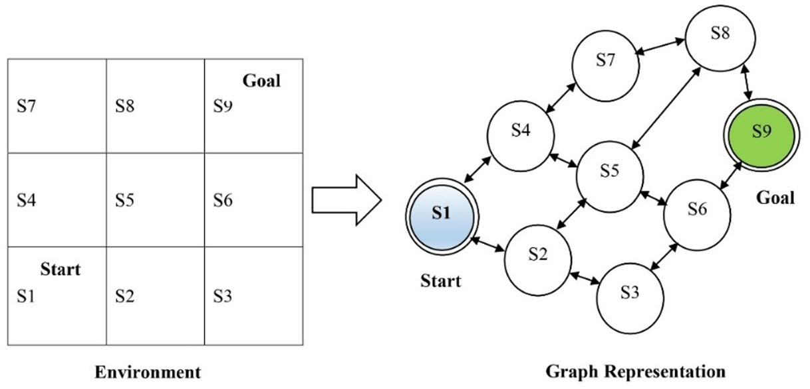
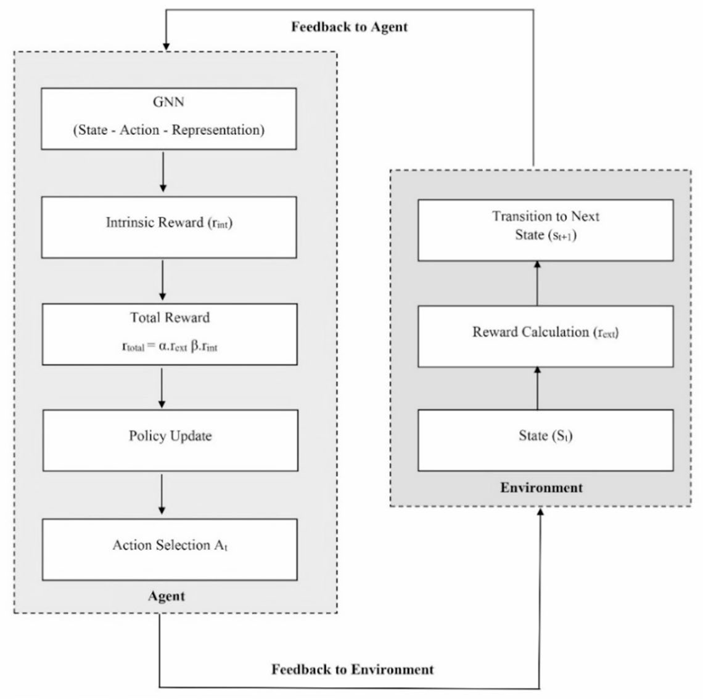
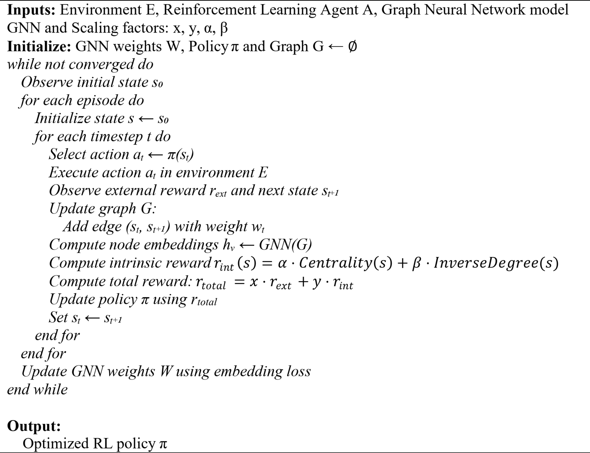
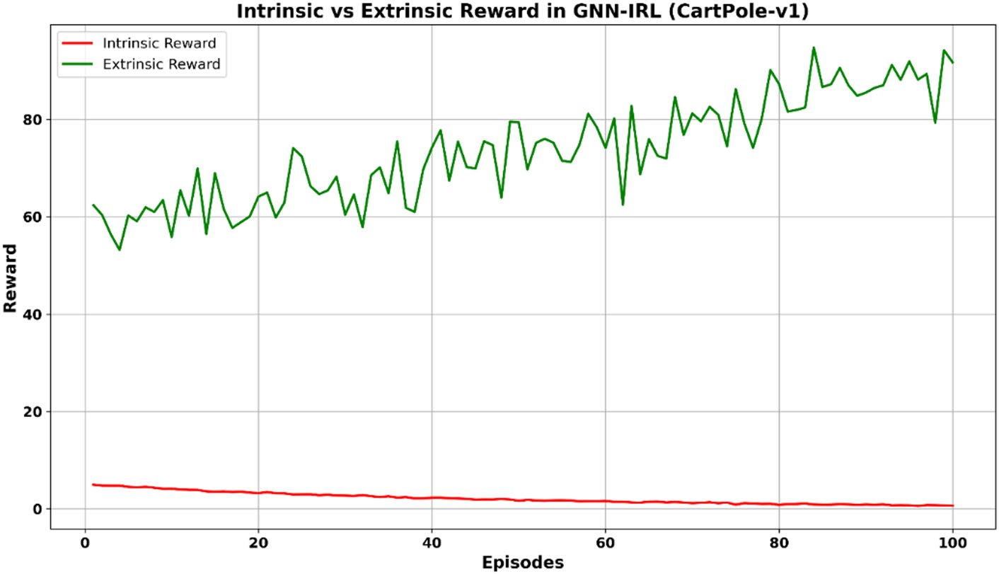
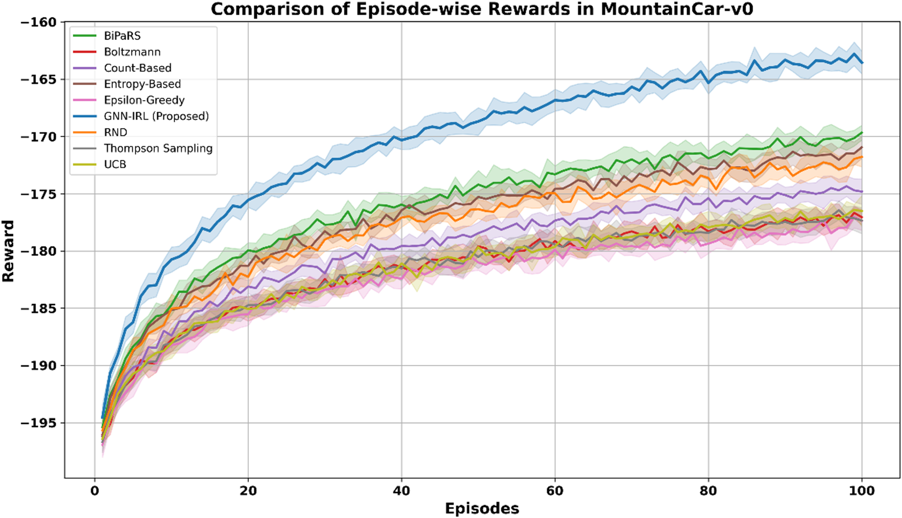
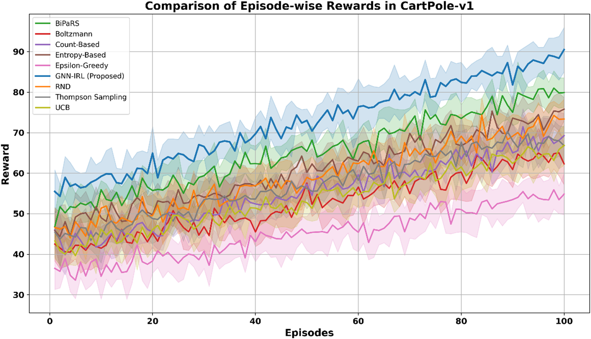
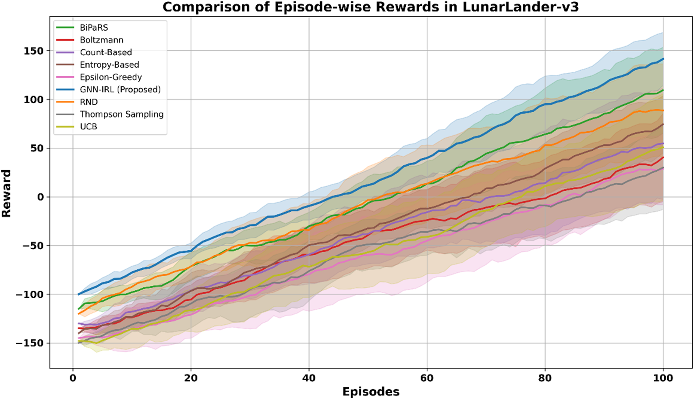
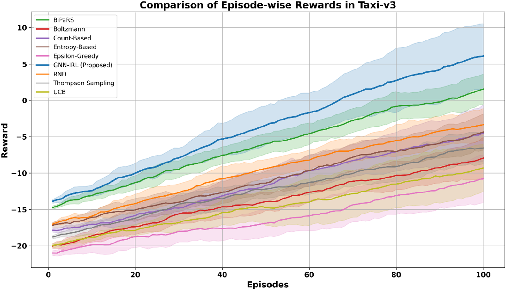
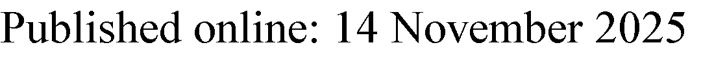

www.nature.com/scientificreports
OPEN Enhanced exploration in
reinforcement learning using graph
neural network based intrinsic
reward mechanism
J. Arun Pandian1, Ramkumar Thirunavukarasu1 & Rajganesh Nagarajan2
We propose a Graph Neural Network-based Intrinsic Reward Learning (GNN-IRL) framework to address
the exploration–exploitation trade-off in Reinforcement Learning (RL). This approach leverages the
structural modeling capabilities of Graph Neural Networks (GNNs) to represent the transitions and
relationships between states in the environment. Intrinsic rewards are computed based on centrality
measures and inverse degree analysis within the state graph, enabling the agent to identify and
explore novel or under-visited states. The effectiveness of GNN-IRL was validated in four benchmark
environments with discrete action spaces: CartPole-v1, MountainCar-v0, Taxi-v3, and LunarLander-v3.
Continuous state variables were discretized to construct state graphs, which facilitates the
implementation of GNN-IRL but may limit scalability to very high-dimensional continuous spaces.
The experimental results show that GNN-IRL outperforms state-of-the-art extrinsic and intrinsic
exploration strategies in terms of convergence rate, cumulative reward, exploration efficiency, and
state coverage. These findings demonstrate that GNN-IRL effectively balances exploration and
exploitation, thereby improving sample efficiency and accelerating policy learning in discretized RL
domains.
Keywords Reinforcement learning, Exploration–exploitation trade-off, Graph neural networks, Intrinsic
reward, State space exploration
Reinforcement Learning (RL) is a branch of Machine Learning (ML) that provides effective solutions for
sequential decision-making and control problems where autonomous learning is essential1. RL algorithms have
demonstrated promising results in addressing challenges involving stochastic behavior and sample inefficiency2.
In RL, the agent interacts with a dynamic environment and optimizes its actions based on the feedback received
in the form of rewards3. The agent continuously learns by exploring various states, performing actions, and
observing the outcomes. The primary goal of an RL algorithm is to train the agent to derive an optimal action-
selection policy through interaction with the environment4. RL has been successfully applied to diverse domains,
such as object detection5, resource optimization6, personalized recommendation7, manufacturing8, finance and
trading9, healthcare10, and logistics11.
One of the major challenges in RL is the well-known exploration–exploitation dilemma12. Balancing
exploration (discovering new states) and exploitation (using known information to maximize rewards) is key
to improving the learning performance of an agent13. Without an effective exploration strategy, the agent may
become trapped in local minima and fail to discover optimal policies. Efficient exploration involves understanding
the environment, collecting informative experiences, ranking the transitions, and adapting policies to maximize
the cumulative rewards.
Classical extrinsic exploration techniques, such as Epsilon-Greedy, Boltzmann Exploration, Thompson
Sampling, and Upper Confidence Bound (UCB), are widely used in both tabular and deep RL settings14. These
methods typically rely on probabilistic selection strategies but lack awareness of the structural relationships
among states. Consequently, they perform poorly in unfamiliar or sparse-reward environments.
Intrinsic exploration techniques have been introduced to address these limitations. It was inspired by intrinsic
motivation in psychology, where behavior is driven by internal rewards rather than external stimuli15. In RL,
1School of Computer Science Engineering and Information Systems, Vellore Institute of Technology, Vellore,
India. 2Sri Venkateswara College of Engineering, Sriperumbudur, India. email: arunpandian.j@vit.ac.in;
ramkumar.thirunavukarasu@vit.ac.in
Scientific Reports | (2025) 15:39986 | https://doi.org/10.1038/s41598-025-23769-3 1

www.nature.com/scientificreports/
intrinsic rewards act as internal signals that encourage exploration, particularly in environments with sparse
or deceptive reward structures16. These rewards are typically based on measures such as curiosity, surprise, or
state novelty. The most common intrinsic techniques are curiosity-driven, count-based, bipartite preference, and
entropy-based techniques. Intrinsic methods can lead to suboptimal policies if internal reward signals diverge
from task objectives. Furthermore, these methods may struggle with high-dimensional or complex state-action
spaces, leading to inefficient exploration or redundant behaviour.
There is a growing need for sophisticated exploration strategies that enable agents to navigate complex
environments efficiently, avoid revisiting uninformative states, and prioritize structurally important regions17.
In this context, Graph Neural Networks (GNNs) offer a powerful mechanism for modeling state transitions and
guiding exploration. GNNs are a class of artificial neural networks designed to operate on graph-structured
data18. They have demonstrated superior performance in domains where the relationships among entities
can be naturally represented as graphs. In RL, GNNs can help agents identify important states and model the
environment effectively. Structuring the state space as a graph enables better generalization, faster learning, and
informed exploration of previously unseen states19.
This study proposes a GNN-based Intrinsic Reward Learning (GNN-IRL) framework to enhance the
exploration efficiency of RL agents. The framework models the environment as a dynamic graph in which
nodes represent states and edges represent transitions. The agent uses GNNs to learn graph embeddings that
capture the structural and semantic information of the environment. Intrinsic rewards are computed based
on graph metrics, such as centrality and inverse degree, encouraging the agent to explore both influential
and underrepresented states. The proposed GNN-IRL is integrated with a Deep Q-Network (DQN), enabling
effective learning in environments with discrete action spaces.
The key contributions of this study are summarized as follows:
• A novel intrinsic reward learning method, GNN-IRL, was proposed to enhance the decision-making policy
of RL algorithms.
• The framework leverages GNNs to compute intrinsic rewards from the graph representations of the environ-
ment.
• Dynamic graph models state-action transitions, and the intrinsic reward is derived from node centrality and
inverse degree.
• The proposed method was integrated into the DQN model and evaluated in discrete action space environ-
ments.
• Experimental validation was conducted on benchmark discrete action space environments to demonstrate
improvements in the cumulative reward, convergence, and exploration quality.
• The proposed GNN-IRL method outperformed several state-of-the-art extrinsic and intrinsic exploration
strategies across key performance metrics.
The remainder of this paper is organized as follows: “Related research” reviews existing exploration techniques
and their limitations. “Graph neural network-based intrinsic reward learning” presents the design of the GNN-
IRL framework and the experimental setup. “Results and discussion” provides a comparative evaluation of the
baseline methods. Finally, “Conclusions and future works” concludes the study and discusses the future research
directions.
Related research
In Reinforcement Learning (RL), exploration refers to the process by which an agent discovers new states and
actions to maximize its cumulative reward20. Effective exploration is essential, particularly when an agent faces
sparse rewards or complex state-action spaces that include large local optima. A simple exploration strategy is
epsilon-greedy, where a time-decaying parameter ε controls the trade-off between exploration and exploitation.
Although this approach is simple and performs reasonably well in structured environments such as Atari
games21. The random selection of ε values often leads to inefficient learning in large or continuous state-action
spaces. In contrast, Boltzmann exploration introduces a temperature parameter (τ) to balance the probability
distribution of action selection. In22, this method was used by robotic agents to navigate unknown environments
by optimizing the trade-off between finding new paths and reusing familiar paths. As an alternative, Upper
Confidence Bound (UCB) techniques prioritize actions with uncertain outcomes by computing confidence
bounds on the expected rewards. In23, UCB was applied to explore states and actions with high uncertainty to
improve the Q-value estimation. In contrast, Thompson Sampling (TS) samples from the posterior distribution
of the Q-values and uses the same Q-function throughout an episode. This leads to a deeper exploration over
longer episodes, especially in sparse reward scenarios24. Most RL agents that follow extrinsic reward mechanisms
face the Noisy-TV problem25. The agent may become trapped in cycles of exploration that yield no useful rewards
or encounter environments with delayed rewards that prevent learning meaningful behavior. These situations
can cause agents to converge to suboptimal policies.
Intrinsic reward mechanisms have been introduced to address the challenges faced by traditional extrinsic
reward mechanisms26. These mechanisms assign additional internal rewards based on novelty or surprise,
encouraging agents to explore, even when extrinsic rewards are sparse or delayed. This self-motivation helps
agents discover informative parts of the state space and promotes better generalization of the model. Count-
based methods estimate novelty by tracking the frequencies of state visitation. Although effective, this approach
is difficult to scale in larger discrete or continuous state spaces. To alleviate this, researchers have applied count-
based techniques to reduced-dimensional feature spaces27. However, this still requires significant memory and
careful feature design28. Entropy-based exploration aims to maximize the uncertainty of state transitions by
Scientific Reports | (2025) 15:39986 | https://doi.org/10.1038/s41598-025-23769-3 2

www.nature.com/scientificreports/
promoting actions that result in unpredictable outcomes. In29, entropy was used to guide exploration in sparse
reward environments, such as Montezuma’s Revenge30, resulting in a strong performance.
Curiosity-driven exploration is another widely adopted intrinsic reward method, in which agents are
rewarded based on the surprisingness or novelty of their experiences. These methods are often categorized
into state-novelty and state-action novelty estimations26,31. In31, the authors applied state-novelty for anomaly
detection using intrinsic unsupervised rewards. In26, a forward dynamics model was used to compute rewards
based on the prediction error of the next state, which guided exploration in partially observable environments. A
prominent curiosity-driven technique is Random Network Distillation (RND)32, which assigns intrinsic rewards
based on the prediction error between a fixed, randomly initialized target network and a trainable predictor
network. When the agent visits novel states, the prediction error is high, resulting in stronger intrinsic rewards.
As familiar states are revisited, the predictor improves and the intrinsic reward decreases, naturally encouraging
exploration. Although RND avoids explicit state counting and offers scalability advantages, it requires high
memory and computational resources in high-dimensional or continuous state spaces. Furthermore, because
RND ignores environmental transition dynamics, it may perform poorly in stochastic or noisy environments.
The bipartite policy for reward shaping (BiPaRS) is a more recent method that employs two policies: one
for the main task and another for generating adaptive shaping rewards33. This architecture allows the agent
to dynamically adjust the reward structure based on its progress. BiPaRS demonstrated superior performance
in environments with sparse or misleading rewards. However, its effectiveness depends on well-coordinated
learning between the two policies, which can increase the training complexity and instability.
Despite these advancements, most intrinsic exploration methods suffer from high memory usage, difficulty
in feature representation, inefficiency in very sparse environments, and poor scalability in high-dimensional
settings. Table 1 summarizes the types and key limitations of prominent exploration techniques in reinforcement
learning.
Graph Neural Networks (GNNs) are neural architectures designed to process graph-structured data by
modeling the dependencies between entities34. GNNs have gained popularity in applications such as combinatorial
optimization and relational reasoning35. Q-learning36 is a fundamental RL algorithm that estimates the optimal
policy using a tabular method and Bellman updates. However, it becomes inefficient in high-dimensional state-
action spaces. Deep Q-Networks (DQN)37 were introduced to overcome the limitation. It approximates the
Q-function using neural networks and improves the scalability and generalization. In this study, we propose a
GNN-based intrinsic reward mechanism that leverages graph structural features, such as centrality and inverse
degree, to incentivize exploration. The Q-value function is modeled using a GNN within the DQN framework.
At each time step, the agent receives graph-based state observations and learns policies for action selection. The
proposed GNN-IRL framework is described in the following section.
Graph neural network-based intrinsic reward learning
The exploration process in RL techniques discovers new states in the environment by selecting different actions
from the action space. Exploring suitable states in the environment is crucial for improving the decision-making
policy of RL techniques. The proposed exploration technique uses a GNN to enhance the exploration process in
RL techniques. The proposed framework calculates the intrinsic reward using a dynamic graph of state-action
transitions. The nodes and edges of the graph represent the states and transitions, respectively. The proposed
exploration technique is called Graph Neural Network-based Intrinsic Reward Learning (GNN-IRL). It
combines the strengths of GNNs with the Intrinsic reward mechanisms to control exploration in RL techniques.
Figure 1 shows the interaction between the RL agent, GNN model, and intrinsic reward mechanism.
The subsequent subsections discuss how the states, actions, and transitions are represented by GNNs, the
computation of intrinsic rewards using the properties of GNNs, and the interaction between the RL agent and
the environment.
Graph neural network model
GNNs are a special type of deep neural network that can represent data in graph structures. However, traditional
deep neural networks represent data using vectors. The nodes in the graphs characterize the entities, and the
edges signify the relationships or transitions between the entities. GNNs are highly suitable for learning the
complex relationships between entities in relational data. GNNs were used in this study to enhance the learning
performance of the RL algorithms by visualizing the structure and dynamics of the environment for agents. In
Technique Type Limitations
Bipartite preference (e.g., BiPaRS) Intrinsic Requires coordination between two policies; lacks direct modeling of state structure.
Boltzmann Extrinsic Struggles in sparse reward settings; limited deep exploration capabilities.
Count-based Intrinsic High memory usage; difficult to apply in continuous state spaces.
Curiosity-driven (e.g., RND) Intrinsic Ignores transition dynamics; high computational demand in large environments
Entropy-based Intrinsic Sensitive to noise; difficult to tune entropy-based parameters.
Epsilon-Greedy Extrinsic Inefficient in large state-action spaces; depends heavily on ε decay schedule.
Thompson sampling Extrinsic Relies on accurate posterior sampling; may underperform in complex dynamics.
UCB Extrinsic Assumes known confidence bounds; scales poorly in high-dimensional spaces.
Table 1. Summary of existing exploration techniques.
Scientific Reports | (2025) 15:39986 | https://doi.org/10.1038/s41598-025-23769-3 3

www.nature.com/scientificreports/
Fig. 1. Layered architecture of the proposed Framework.
Fig. 2. Graph representation of state transition.
the proposed GNN-IRL, the states in the environment are denoted by the nodes of the GNN, and the action or
state transitions are represented by their edges. Figure 2 illustrates the graphical representation of the transition
between the states in the grid world environment.
The transitions between states (weights or edges) were computed using the probability of transitioning from
state s to s after selecting action a. The edge weight w is defined as Eq. 1.
i j ij
w ij =P(s j
|
s i ,a) (1)
Where P is the transition probability between states s and s while performing action a.
i j
The edge weights in the constructed state-transition graph were computed based on the estimated
transition probabilities. For each observed transition from state s to a subsequent state s′ under action a, an
empirical transition table was maintained, and an estimate P(s′|s, a) was made using normalized transition
counts accumulated over episodes. This allows the edge (s, s′) in the graph to be weighted proportionally to the
likelihood of observing a transition. This enables the agent to effectively model the structural dynamics of the
environment. Although the exact transition probabilities are not known a priori, this approach incrementally
approximates them through repeated environmental interactions, making it well-suited for stochastic but fully
observable settings with discrete state spaces. In cases of high environmental stochasticity, the transition graph
Scientific Reports | (2025) 15:39986 | https://doi.org/10.1038/s41598-025-23769-3 4

www.nature.com/scientificreports/
naturally encodes the uncertainty via distributed edge weights. This modeling strategy facilitates the reliable
computation of graph-theoretic measures used for intrinsic-reward generation.
Graph embeddings were used to capture the structural and semantic information of the environments. Graph
embeddings are vector representations of graph components, such as nodes and edges. Graph embeddings map
high-dimensional graph data into a continuous low-dimensional vector space. The vector representation of
states and transitions is useful in reinforcement learning for improving computational efficiency, particularly in
large and complex environments. Each node in the graph characterizes the unique state of the environment in
the RL. The edges represent actions or transitions between states. Node embedding describes the properties of
individual states, including their relationships with neighboring states. The node embeddings iteratively learn
about the nodes during the training process. The learning process of node embedding is controlled by Eq. 2.
|     |     | h(k) | W(k). |        | w ij | h(k 1)+b(k) |     |     |
| --- | --- | ---- | ----- | ------ | ---- | ----------- | --- | --- |
|     |     | =σ   |       |        |      | −           |     | (2) |
|     |     | j    |       | i N(j) | d d  | i           |     |     |
|     |     |      | (     | ∈      | i    | j           | )   |     |
∑
√
Where h(k)  is the embedding of the state j at the layer k. N(j) denotes the neighboring states of state j. The W(k)
j
and b(k) are the learnable weight and bias are at layer k. The σ is a nonlinear activation function. The d andd j
i
are the degrees of the nodes i and j.
Node embedding uses a Graph Convolutional Network (GCN) to encode graphs into vector data. The RL
agent used the embedding of the state-action graph to compute the novelty of a transition between states by
calculating the intrinsic rewards.
Intrinsic reward mechanism
Intrinsic rewards were used in this study to motivate the RL agent to learn about the environment by exploring
unvisited and minimally visited states. Intrinsic rewards ensure that the agent not only learns to maximize
the rewards but also effectively explores the environment to discover new states. The Intrinsic rewards were
calculated internally in the agent based on the properties of the state transition graph. The centrality and inverse
degree of a state of the environment were used to compute the intrinsic rewards in this study.
The centrality of the state measures its importance in the state space of the environment. This study
employed the centrality measure to calculate the intrinsic reward to explore the central or influential state, which
is commonly connected with most of the states. It is used to support the agent in visiting most states in the
environment. The calculation of state centrality is shown in Eq. 3.
|     |     |     |                |     | j N(s) | w ij |     |     |
| --- | --- | --- | -------------- | --- | ------ | ---- | --- | --- |
|     |     |     | Centrality(s)= |     | ∈      |      |     | (3) |
w
|     |     |     |     |     | ∑ i,j | S ij |     |     |
| --- | --- | --- | --- | --- | ----- | ---- | --- | --- |
∈
| Where w                                             |     |     |     |     | ∑                          |     |     |     |
| --------------------------------------------------- | --- | --- | --- | --- | -------------------------- | --- | --- | --- |
| ij is the edge weight between states i to j. This w |     |     |     |     | as calculated using Eq. 1. |     |     |     |
The inverse degree of a state signifies the reciprocal of its degree. The degree of a state represents the number
of directly connected adjacent states. The inverse degree gives higher importance to less connected states in the
environment. This factor encourages exploration of the RL agent. Equation 4 is used to compute the inverse
degree of the state.
1
|     |     |     | InverseDegree(s)= |     |     |     |     | (4) |
| --- | --- | --- | ----------------- | --- | --- | --- | --- | --- |
N(s)
|                                                                     |     |     |     |     |     | | | |     |     |
| ------------------------------------------------------------------- | --- | --- | --- | --- | --- | --- | --- | --- |
| Where the  N(s) is the number of neighboring states connected to s. |     |     |     |     |     |     |     |     |
| |
The combination of the centrality and inverse degree of the state helps the agent strategically explore both
dominant and underrepresented states. This ensures a more balanced and efficient exploration strategy for the
| RL agent. The calculation of Intrinsic reward r |            |     |                 | int is defined in Eq. 5. |     |                   |     |     |
| ----------------------------------------------- | ---------- | --- | --------------- | ------------------------ | --- | ----------------- | --- | --- |
|                                                 | r int(s)=α |     | Centrality(s)+β |                          |     | InverseDegree(s)  |     | (5) |
|                                                 |            |     | ·               |                          | ·   |                   |     |     |
where α and β are the scaling factors for controlling the influence of the centrality and inverse degree in the
calculation of the intrinsic reward r (s). These scaling factors are important hyperparameters that control the
int
contribution of centrality and inverse degree to the intrinsic reward calculation.
The Extrinsic rewards (r ext) is obtained by the agent after selecting the action. The Extrinsic reward function
was defined by an environment that evaluates the success of the action selected by the agent. The Extrinsic
reward estimation was calculated using Eq. 6.
|     |     |     | r ext(s | ,a,s j)=f(s | ,a,s | j)  |     |     |
| --- | --- | --- | ------- | ----------- | ---- | --- | --- | --- |
|     |     |     |         | i           | i    |     |     | (6) |
where s and s represent the current and next states, respectively, and a denotes the action selected in state s at
| i j |     |     |     |     |     |     |     | i   |
| --- | --- | --- | --- | --- | --- | --- | --- | --- |
time t.
The total reward signal was calculated using the intrinsic and extrinsic rewards of the state-action pairs. The
total reward optimizes the policy of the RL agent for the action selection. The total reward signal was computed
using Eq. 7.
|     |     |     | r     | =x r ext+y |     | r int  |     | (7) |
| --- | --- | --- | ----- | ---------- | --- | ------ | --- | --- |
|     |     |     | total | ·          | ·   |        |     |     |
5
Scientific Reports |        (2025) 15:39986  | https://doi.org/10.1038/s41598-025-23769-3

www.nature.com/scientificreports/
where x and y are the scaling factors for controlling the influence of intrinsic and extrinsic rewards in the total
reward calculation. These scaling factors control the influence of intrinsic and extrinsic rewards in the total
reward estimation.
The convergence was tested using the stopping criteria for the proposed GNN-IRL framework, which were
defined to ensure efficient and meaningful termination of the training process of the RL agent. The training
process stops when the RL agent meets at least one of the following three conditions.
 i.  Maximum total reward: the total reward, which is the sum of the extrinsic and intrinsic rewards, reaches its
maximum value.
|     |     | r r       | µ   |     |     |
| --- | --- | --------- | --- | --- | --- |
|     |     | total max |     |     | (8) |
|     |     | ≥         | −   |     |     |
Where the µ is a stabilization value and r max is the maximum possible reward that can be obtained.
 ii.  Intrinsic reward convergence: the intrinsic reward reaches zero or a predefined threshold.
|     |     | r     | δ   |     | (9) |
| --- | --- | ----- | --- | --- | --- |
|     |     | int ≤ |     |     |     |
where δ represents the minimum possible threshold for the intrinsic reward. It is either zero or nearly so.
Novel states unchanged: the number of novel states S novel(t) remains unchanged over consecutive epi-
 iii.
sodes. This signifies that the agent has completely explored the state space. It shows that no new states are
discovered by the agent for exploration.
|     | S novel(t)=S | novel(t 1)= | =S novel(t | M)  | (10) |
| --- | ------------ | ----------- | ---------- | --- | ---- |
|     |              | −           | ···        | −   |      |
Where M is a predefined patience parameter, and t is the current training episode.
The pseudocode algorithm of the proposed GNN-IRL approach uses the GNN and Intrinsic reward addition to
the existing strategy, which is presented in Algorithm 1.
6
Scientific Reports |        (2025) 15:39986  | https://doi.org/10.1038/s41598-025-23769-3

www.nature.com/scientificreports/
Hyperparameter Value Description
Number of Layers 3 Number of GNN layers for message passing.
Hidden Layer Size 64 Number of units in each hidden layer of the GNN.
Activation Function ReLU Non-linear activation function for GNN layers.
Dropout Rate 0.3 Dropout rate for regularization during training.
Learning Rate (GNN) 0.003 Learning rate for GNN-specific optimization.
Aggregation Function Mean Method to aggregate messages from neighboring nodes.
Node Embedding Dimension 32 Size of the learned node embeddings.
Message Passing Steps 2 Number of iterations for message passing.
Optimizer Adam Optimization algorithm for updating weights.
Table 2. Hyperparameter values of GNN.
Hyperparameter Value Description
Inverse Degree Factor 0.2 Scaling factor for inverse degree centrality contribution.
Intrinsic Reward Decay 0.96 Decay rate to reduce intrinsic reward over episodes.
Novel State Threshold 5 The threshold to determine if a state is considered novel.
Table 3. Hyperparameter values of intrinsic reward mechanism.
Hyperparameter Value Description
Learning Rate 0.0005 Learning rate for the RL agent.
Discount Factor (γ) 0.99 Weight given to future rewards.
Max Episodes 500 Total number of episodes for training.
Max Steps per Episode 200 Maximum Number of steps allowed in each episode.
Replay Buffer Size 10,000 Size of the buffer for experience replay.
Batch Size 32 Number of samples per training step.
Optimizer Adam Optimization algorithm for updating weights.
Table 4. Hyperparameter values of DQN Model.
Algorithm 1. GNN-IRL for exploration.Experimental setup and hyperparameter tuning
The proposed GNN-IRL was combined with the DQN algorithm to learn about discrete action space environments,
such as CartPole-v1, MountainCar-v0, Taxi-v3, and LunarLander-v3. Popular classical control environments
were used to implement and validate the proposed GNN-IRL technique. Hyperparameters play a crucial role in
improving the performance of machine-learning algorithms. The selection of suitable hyperparameter values is
an important process for obtaining optimal performance from learning techniques. This study used a random
search technique to tune the hyperparameter value selection. First, the hyperparameter values of the GNN for
the CartPole-v1 environment were optimized using a random search technique. The optimized hyperparameter
values of the GNN model for the CartPole-v1 environment are listed in Table 2.
The Intrinsic reward mechanism is the most important in the proposed GNN-IRL approach to assist the
RL agent in choosing the most appropriate action from the action space. Some hyperparameter values need
to be optimized in the intrinsic reward calculation to enhance the performance of the RL agent. The tuned
hyperparameter values of the intrinsic reward mechanism for the CartPole-v1 environment are listed in Table 3.
The proposed GNN-IRL exploration technique was implemented on the DQN model to validate its
performance and efficiency in different environments. Hence, the hyperparameters and their optimized values
of the DQN technique for the CartPole-v1 environment were tuned, as shown in Table 4.
The episode-wise rewards, intrinsic rewards, and novel states explored by the agent were used to validate
the efficiency and reliability of the proposed GNN-IRL for control problems. The training performance of the
proposed GNN-IRL exploration technique in CartPole-v1 is shown in Fig. 3.
The continuous improvement in episode-wise rewards and the corresponding decline in intrinsic reward
values observed in the CartPole-v1 environment demonstrate the consistency and stability of the proposed
GNN-IRL framework. Furthermore, the GNN-IRL-enhanced DQN model, equipped with optimized
hyperparameters, was evaluated on additional benchmark environments, including MountainCar-v0, Taxi-v3,
and LunarLander-v3. These experiments aimed to maximize the cumulative rewards and enhance the decision-
making capabilities of the agent. The quantitative and qualitative results, along with the limitations of the
proposed GNN-IRL exploration approach, are discussed in the subsequent sections. In addition, the framework
was compared with several widely adopted and recent exploration techniques using standard performance
evaluation metrics.
Scientific Reports | (2025) 15:39986 | https://doi.org/10.1038/s41598-025-23769-3 7

www.nature.com/scientificreports/
Fig. 3. Training performance of the GNN-IRL.
Results and discussion
The proposed GNN-IRL exploration approach was implemented using the DQN algorithm to learn and generate
a policy for action selection. Standard control environments, such as cartpole, mountain car, taxi, and lunar
lander, were used to analyze the performance of the proposed GNN-IRL and baseline exploration strategies. The
baseline exploration strategies used in this study were BiPaRS, Boltzmann exploration, count-based exploration,
epsilon-greedy exploration, RND, entropy-based exploration, Thompson sampling exploration, and UCB
exploration.
Experimental results
The episode-wise reward trajectories of the proposed GNN-IRL framework were compared with those of
several state-of-the-art exploration strategies, including RND, BiPaRS, Boltzmann, Count-Based, Entropy-
Based, Epsilon-Greedy, Thompson Sampling, and UCB, across four discrete-action benchmark environments:
CartPole-v1, MountainCar-v0, Taxi-v3, and LunarLander-v3. The average episode-wise rewards over 10
independent runs were used to ensure a fair comparison and to mitigate the stochastic variance in individual
trials. Both the mean reward and standard deviation were computed for each episode across the runs. A
state discretization process was applied to facilitate the implementation of the GNN-IRL and enable graph
construction from continuous or hybrid state spaces. In the CartPole-v1 environment, each dimension of the
continuous state vector was discretized using 10 uniform bins per dimension, resulting in 10⁴ = 10,000 unique
discrete states. Figure 4 illustrates the learning progression in CartPole-v1, with shaded areas representing ± 1
standard deviation, covering approximately 68% of the observed values to indicate variability. The GNN-
IRL consistently outperformed the baseline methods, achieving faster convergence and higher final rewards,
whereas strategies such as Epsilon-Greedy and Count-Based exhibited slower and noisier learning owing to less
structured exploration.
MountainCar-v0 uses 20 bins per dimension to capture finer motion and velocity resolution, producing 400
unique discrete states. These discrete states form the nodes in the environment graph, with edges representing
state transitions owing to agent actions. Figure 5 presents the results for the MountainCar-v0 environment,
which features sparse and delayed reward. GNN-IRL demonstrated superior performance by quickly discovering
the optimal trajectory to reach the goal state. Its structured exploration, driven by graph-based intrinsic rewards,
allows for more effective navigation of the state space compared to random or count-based methods, which often
struggle with convergence in this domain.
The Taxi-v3 environment is inherently discrete and grid-based, consisting of 500 distinct states defined
by the position of the agent, passenger location, and the destination. Therefore, no additional discretization
was required. The structured transitions of the environment allowed for straightforward graph construction,
facilitating efficient GNN operations on the experience of the agent. The Taxi-v3 environment, characterized by
a discrete grid layout with dynamic task-dependent transitions, such as varying passenger pickup and drop-off
locations, presents a structured yet challenging exploration setting. As shown in Fig. 6, the proposed GNN-IRL
framework achieved faster reward accumulation and a more stable learning curve than the baseline strategies.
This improvement highlights the ability of the model to exploit topological information from the state transition
graph of the environment, thereby enabling efficient navigation and consistent policy learning in discrete, goal-
conditioned environments.
In LunarLander-v3, although the environment has continuous state components, a discretization scheme
was applied by dividing each state dimension (e.g., position, velocity, angle, and leg contacts) into five bins
depending on sensitivity to reward dynamics. This produced 5,000 distinct discrete states after removing
unreachable combinations, enabling the GNN to compute intrinsic rewards based on the structural properties of
Scientific Reports | (2025) 15:39986 | https://doi.org/10.1038/s41598-025-23769-3 8

www.nature.com/scientificreports/
Fig. 4. Comparison of episode-wise rewards in CartPole-v1.
Fig. 5. Comparison of episode-wise rewards in MountainCar-v0.
the discretized environment graph. Figure 7 shows the performance in the LunarLander-v3 environment, which
is characterized by stochastic dynamics and moderately sparse rewards. The GNN-IRL approach maintained a
smooth and steady learning curve and attained higher cumulative rewards than all baseline techniques. Its ability
to consistently identify and prioritize novel and informative states results in efficient policy development, even
under uncertain transitions.
Overall, these results, averaged across multiple training runs, confirm the stability, scalability, and robustness
of the GNN-IRL in diverse discrete-action environments. Structured discretization enables the effective
construction of environment graphs, which, combined with intrinsic motivation based on graph metrics, allows
GNN-IRL to significantly improve exploration efficiency and reward optimization across tasks.
Ablation study
An ablation study was conducted to evaluate the individual contributions of the intrinsic reward components to
the proposed GNN-IRL framework. Specifically, this study examined three configurations: (i) centrality-based
intrinsic rewards only, (ii) inverse degree–based rewards only, and (iii) a combined formulation using various
Scientific Reports | (2025) 15:39986 | https://doi.org/10.1038/s41598-025-23769-3 9

www.nature.com/scientificreports/
Fig. 6. Comparison of episode-wise rewards in Taxi-v3.
Fig. 7. Comparison of episode-wise rewards in LunarLander-v3.
α/β weight settings. The performance was measured using a cumulative reward metric. The cumulative reward
measures the total reward accumulated over fixed episodes. The cumulative reward is computed using Eq. 11:
cumulativereward= E i=1 r ext(i) (11)
∑
Where E is the total number of episodes. The cumulative reward ranges from -∞ to +∞. A higher cumulative
reward denotes a greater performance of the RL agents.
As presented in Table 5, the combined approaches consistently outperformed individual components across
all benchmark environments. In particular, the equal weighting configuration (α = 0.5, β = 0.5) achieved the
highest cumulative reward, highlighting the complementary nature of centrality and inverse degree metrics in
driving effective exploration.
Table 6 presents an ablation study analyzing the impact of different weight configurations between intrinsic
(x) and extrinsic (y) rewards in the GNN-IRL framework across the four benchmark environments. The results
show that using only intrinsic or extrinsic rewards yields suboptimal performance. Equal contribution provides
Scientific Reports | (2025) 15:39986 | https://doi.org/10.1038/s41598-025-23769-3 10

www.nature.com/scientificreports/
 Configuration
|                                |     | α β     | CartPole-v1 | MountainCar-v0 | Taxi-v3 LunarLander-v3 |
| ------------------------------ | --- | ------- | ----------- | -------------- | ---------------------- |
| Centrality only                |     | 1.0 0.0 | 1108        | -123           | -285 19                |
| Inverse degree only            |     | 0.0 1.0 | 1122        | -118           | -175 26                |
| Equal weights                  |     | 0.5 0.5 | 1189        | -98            | -9 32                  |
| Centrality weighted higher     |     | 0.7 0.3 | 1157        | -105           | -85 13                 |
| Inverse degree weighted higher |     | 0.3 0.7 | 1162        | -101           | -53 16                 |
Table 5. Ablation study of intrinsic reward components in GNN-IRL.
 Configuration
|                           |     | x y CartPole-v1 |     | MountainCar-v0 | Taxi-v3 LunarLander-v3 |
| ------------------------- | --- | --------------- | --- | -------------- | ---------------------- |
| Intrinsic only            |     | 1.0 0.0 1143    |     | -107           | -38 13                 |
| Extrinsic only            |     | 0.0 1.0 1105    |     | -125           | -43 02                 |
| Equal contribution        |     | 0.5 0.5 1153    |     | -113           | -15 26                 |
| Intrinsic weighted higher |     | 0.7 0.3 1189    |     | -98            | -9 32                  |
| Extrinsic weighted higher |     | 0.3 0.7 1170    |     | -104           | -27 21                 |
Table 6. Ablation study of scaling factors in GNN-IRL.
|  Environment   | Discretization | #States | Cost (s/episode) | Cumulative reward |     |
| -------------- | -------------- | ------- | ---------------- | ----------------- | --- |
| CartPole-v1    | 5 bins/dim     |         | 625 0.12         | 1050              |     |
|                | 10 bins/dim    | 10,000  | 0.98             | 1189              |     |
|                | 20 bins/dim    | 160,000 | 6.5              | 1195              |     |
| MountainCar-v0 | 10 bins/dim    |         | 100 0.05         | –140              |     |
|                | 20 bins/dim    |         | 400 0.14         | –98               |     |
|                | 40 bins/dim    | 1600    | 0.45             | –95               |     |
| Taxi-v3        | Discrete grid  |         | 500 0.01         | –9                |     |
| LunarLander-v3 | 3 bins/dim     |         | 500 0.25         | –10               |     |
|                | 5 bins/dim     | 5,000   | 1.80             | 32                |     |
|                | 10 bins/dim    | 50,000  | 12.3             | 34                |     |
Table 7. Computational cost analysis of GNN-IRL under different discretization Configurations.
moderate improvements, whereas assigning a higher weight to intrinsic rewards (x = 0.7, y = 0.3) consistently
leads to superior cumulative rewards in all environments. This highlights that placing more importance on
intrinsic motivation enhances exploration and accelerates learning, especially in sparse or deceptive reward
settings.
The two ablation studies collectively demonstrate the effectiveness of both the structural components and
reward balancing strategy within the GNN-IRL framework. Overall, the findings confirm that leveraging a
hybrid reward mechanism grounded in structural graph features and appropriately balanced with extrinsic
feedback greatly improves the learning efficiency and agent performance across diverse environments.
Computational cost analysis
A comparative analysis of different discretization resolutions across benchmark environments highlights the
inherent trade-off between the computational cost and cumulative reward. Table 7 presents the computational
cost of GNN-IRL for various discretization configurations.
In CartPole-v1, increasing the number of bins from 5 to 10 significantly improved the performance, but further
refinement to 20 bins yielded only marginal gains while causing a steep rise in the computational overhead. A
similar trend was observed in MountainCar-v0, where the 20-bin configuration achieved the best balance, as
finer discretization provided only slight improvements in the reward but at a substantial computational cost.
For Taxi-v3, the environment is inherently discrete, eliminating the need for additional discretization while
delivering strong results. In LunarLander-v3, increasing the number of bins from 3 to 5 markedly enhanced
the cumulative rewards, but moving to 10 bins offered negligible additional benefits despite dramatically higher
costs. Collectively, these findings confirm that the chosen discretization strategies—10 bins per dimension
for CartPole-v1, 20 bins per dimension for MountainCar-v0, the natural grid for Taxi-v3, and five bins per
dimension for LunarLander-v3—represent the optimal compromise, ensuring high rewards with manageable
computational demands.
11
Scientific Reports |        (2025) 15:39986  | https://doi.org/10.1038/s41598-025-23769-3

www.nature.com/scientificreports/
Performance analysis
The performance of the exploration techniques was assessed using standard performance metrics, such as
convergence rate, convergence time, exploration efficiency, and state coverage. The average performance metric
values of ten independent runs for each method were used for the comparison. The convergence rate represents
the inverse of the number of episodes the RL agent takes to reach the threshold reward (r threshold). The
convergence rate is calculated using Eq. 12.
1
|     |     |     | ConvergenceRate= |     |             |     |     | (12) |
| --- | --- | --- | ---------------- | --- | ----------- | --- | --- | ---- |
|     |     |     |                  |     | E threshold |     |     |      |
Where E threshold is the episode taken for the agent to reach the r threshold. The convergence rate ranged from
0 to 1. A higher convergence rate indicates better performance.
The convergence time represents the total time (T) taken to reach the r . Equation 13 is used to
threshold
compute the convergence time of the exploration techniques.
|     |     | ConvergenceTime |     | (seconds)= | T(r threshold)  |     |     |      |
| --- | --- | --------------- | --- | ---------- | --------------- | --- | --- | ---- |
|     |     |                 |     |            |                 |     |     | (13) |
The exploration efficiency indicates the number of unique states visited during the training of the RL agent. This
refers to the percentage of episodes in which the agent successfully explores novel states. A higher exploration
efficiency indicates that the RL agent explores more states during training. Equation 14 shows how the exploration
efficiency is calculated.
UniqueStatesExplored
|     | Explorationefficiency |     |     | (%)= | |     | |   | 100  | (14) |
| --- | --------------------- | --- | --- | ------ | --- | --- | ---- | ---- |
TotalStatesVisited
|     |     |     |     |     |     | ×   |     |     |
| --- | --- | --- | --- | --- | --- | --- | --- | --- |
|     |     |     |     | |   |     | |   |     |     |
Moreover, state coverage is the proportion of the environment explored during training. The state coverage of
the RL agent was computed using Eq. 15:
UniqueStatesExplored
|     | Statecoverage |     | (%)= | |   |     | |   | 100  |     |
| --- | ------------- | --- | ---- | --- | --- | --- | ---- | --- |
(15)
|     |     |     |     | TotalStatesinEnvironment |     | ×   |     |     |
| --- | --- | --- | --- | ------------------------ | --- | --- | --- | --- |
|     |     |     |     | |                        |     | |   |     |     |
The comparison results of the proposed GNN-IRL and existing exploration techniques in the CartPole-v1
environment are presented in Table 8. The GNN-IRL framework demonstrated superior performance on all
evaluation metrics. It achieved the highest convergence rate of 0.0089 and the lowest convergence time of 1344 s,
indicating faster policy learning. Additionally, it obtained the highest cumulative reward of 1189 and state
coverage of 76%, highlighting its effectiveness in balancing exploration and exploitation compared with the
baseline methods.
Table 9 presents the results for the MountainCar-v0 environment. With 400 discrete states and a convergence
threshold of 50, the proposed GNN-IRL method again demonstrated superior performance, reaching the
convergence threshold in only 1469 s. It achieved a higher cumulative reward of -98, along with the highest
exploration efficiency and state coverage among all the compared techniques. These results confirm the
effectiveness of GNN-IRL in navigating sparse-reward continuous state space environments through graph-
based intrinsic motivation.
Taxi-v3 is a grid-based environment with dynamic task-based transitions, which also benefits from the
proposed approach. As shown in Table 10, the proposed GNN-IRL method achieved the highest cumulative
reward of -9, the least convergence time of 1259 s, and the widest state coverage of 91%. These results highlight
the ability of GNN-IRL to adaptively guide exploration in structured environments with sparse and delayed
reward signals.
The GNN-IRL model achieved the best overall performance in the LunarLander-v3 environment, as
presented in Table 11. It recorded the highest cumulative reward of 32 and led across all exploration metrics,
including convergence rate, efficiency, and state coverage.
 Technique
|                   | Convergence rate |     | Convergence time | Cumulative reward | Exploration efficiency |     | State coverage |     |
| ----------------- | ---------------- | --- | ---------------- | ----------------- | ---------------------- | --- | -------------- | --- |
| BiPaRS            | 0.0061           |     | 1980             | 1134              | 0.61                   |     | 0.69           |     |
| Boltzmann         | 0.0037           |     | 3216             | 996               | 0.45                   |     | 0.51           |     |
| Count-based       | 0.0036           |     | 3312             | 1093              | 0.55                   |     | 0.62           |     |
| Entropy-based     | 0.0052           |     | 2292             | 1076              | 0.54                   |     | 0.61           |     |
| Epsilon-Greedy    | 0.0034           |     | 3504             | 917               | 0.42                   |     | 0.48           |     |
| GNN-IRL           | 0.0089           |     | 1344             | 1189              | 0.68                   |     | 0.76           |     |
| RND               | 0.0056           |     | 2172             | 1109              | 0.59                   |     | 0.66           |     |
| Thompson sampling | 0.0043           |     | 2808             | 944               | 0.59                   |     | 0.66           |     |
| UCB               | 0.0037           |     | 3252             | 973               | 0.57                   |     | 0.64           |     |
Table 8. Performance comparison in CartPole-v1.
12
Scientific Reports |        (2025) 15:39986  | https://doi.org/10.1038/s41598-025-23769-3

www.nature.com/scientificreports/
 Technique
|                   | Convergence rate | Convergence time | Cumulative reward | Exploration efficiency | State coverage |
| ----------------- | ---------------- | ---------------- | ----------------- | ---------------------- | -------------- |
| BiPaRS            | 0.0061           | 2040             | -114              | 81                     | 85             |
| Boltzmann         | 0.0039           | 3328             | -155              | 68                     | 72             |
| Count-Based       | 0.0038           | 3432             | -156              | 72                     | 75             |
| Entropy-Based     | 0.0056           | 2327             | -134              | 76                     | 79             |
| Epsilon-Greedy    | 0.0036           | 3640             | -161              | 65                     | 70             |
| GNN-IRL           | 0.0088           | 1469             | -98               | 88                     | 90             |
| RND               | 0.0055           | 2360             | -127              | 78                     | 80             |
| Thompson Sampling | 0.0045           | 2886             | -138              | 66                     | 71             |
| UCB               | 0.0039           | 3367             | -147              | 67                     | 73             |
Table 9. Performance comparison in MountainCar-v0.
 Technique Convergence rate Convergence time Cumulative reward Exploration efficiency State coverage
| BiPaRS            | 0.0071 | 1635 | -42  | 83  | 85  |
| ----------------- | ------ | ---- | ---- | --- | --- |
| Boltzmann         | 0.0041 | 2980 | -139 | 69  | 72  |
| Count-based       | 0.004  | 3096 | -122 | 71  | 74  |
| Entropy-based     | 0.0058 | 2150 | -85  | 76  | 79  |
| Epsilon-Greedy    | 0.0038 | 3248 | -158 | 66  | 70  |
| GNN-IRL           | 0.0092 | 1259 | -9   | 89  | 91  |
| RND               | 0.0066 | 1782 | -68  | 79  | 82  |
| Thompson sampling | 0.0049 | 2673 | -128 | 68  | 71  |
| UCB               | 0.0042 | 2928 | -133 | 67  | 72  |
Table 10. Performance comparison in Taxi-v3.
 Technique Convergence rate Convergence time Cumulative reward Exploration efficiency (%) State coverage (%)
| BiPaRS            | 0.0072 | 1758 | 21  | 81  | 84  |
| ----------------- | ------ | ---- | --- | --- | --- |
| Boltzmann         | 0.0043 | 2704 | -38 | 64  | 69  |
| Count-Based       | 0.0053 | 2250 | -13 | 73  | 76  |
| Entropy-Based     | 0.0061 | 1984 | -5  | 78  | 80  |
| Epsilon-Greedy    | 0.0039 | 2921 | -46 | 61  | 64  |
| GNN-IRL           | 0.0091 | 1402 | 32  | 85  | 88  |
| RND               | 0.0065 | 1896 | 4   | 79  | 81  |
| Thompson Sampling | 0.0047 | 2508 | -26 | 68  | 72  |
| UCB               | 0.0045 | 2620 | -30 | 66  | 70  |
Table 11. Performance comparison in LunarLander-v3.
Table 12 also reports the standard deviations of the cumulative rewards from 10 independent trials. This
demonstrates that GNN-IRL not only outperforms other techniques but also exhibits the highest consistency
and stability across all environments.
The standard deviation values presented above demonstrate the robustness and consistency of the GNN-
IRL technique in different environments. The GNN-IRL consistently exhibited the lowest standard deviation
in the cumulative reward in all four environments, indicating higher training stability and more predictable
performance. These results further reinforce that GNN-IRL not only achieves superior average rewards but also
maintains a reliable learning behavior over multiple training runs.
The experimental results show that the proposed GNN-IRL achieves a superior convergence rate, convergence
time, cumulative reward, exploration efficiency, and state coverage compared with existing techniques in sparse-
reward and high-dimensional environments. The proposed GNN-IRL uses graph centrality and inverse degree
to calculate intrinsic rewards. This technique prioritizes novel states and balances exploration and exploitation
during the training process. This technique provides advantages such as systematic and adaptive exploration,
scalability to high-dimensional environments, and interpretable reward design for RL agents.
Limitations of the proposed approach
Although the proposed GNN-IRL framework demonstrated superior performance across discrete-action
environments, it has certain limitations. Its effectiveness depends on the quality of the constructed state-
13
Scientific Reports |        (2025) 15:39986  | https://doi.org/10.1038/s41598-025-23769-3

www.nature.com/scientificreports/
Technique CartPole-v1 MountainCar-v0 Taxi-v3 LunarLander-v3
BiPaRS 47.2 4.3 15.5 11.7
Boltzmann 58.6 8.2 22.4 17.3
Count-based 53.3 7.9 20.1 15.7
Entropy-based 51.4 5.8 17 12.4
Epsilon-Greedy 60.2 9.7 24.6 18.9
GNN-IRL 35.6 2.5 9.3 6.8
RND 50.9 6.7 13.9 14.3
Thompson sampling 57.5 8.6 21.2 16.6
UCB 59.1 8.3 22 17.1
Table 12. Standard deviation of cumulative rewards.
transition graph, and poorly structured or sparse graphs can reduce the informativeness of the intrinsic
rewards. The computation of graph-based metrics at each step introduces additional overhead, which may affect
the scalability of large or high-dimensional state spaces. The current formulation is designed for discrete or
discretized states, limiting its direct applicability to continuous or hybrid environments, and maintaining the
graph requires significant memory. Additionally, the performance can be sensitive to hyperparameters, such as
discretization resolution and reward weighting. Despite these limitations, GNN-IRL provides a systematic and
interpretable approach to exploration, with opportunities for future extensions to continuous actions and more
efficient graph representation.
Conclusions and future works
This study proposed a novel GNN-IRL framework to address the challenge of efficient exploration in RL.
GNN-IRL leverages the representational capabilities of Graph Neural Networks to model relationships among
states, enabling the agent to better understand the structural layout of the environment. Intrinsic rewards are
computed using graph-theoretic metrics, such as centrality and inverse degree, which encourage the exploration
of novel and informative regions of the state space. Experimental evaluations across discrete-action benchmark
environments, including CartPole-v1, MountainCar-v0, Taxi-v3, and LunarLander-v3, showed that GNN-IRL
consistently outperformed existing strategies, such as Boltzmann, Count-Based, Curiosity-Driven, Entropy-
Based, Epsilon-Greedy, Thompson Sampling, and UCB, achieving higher cumulative rewards, faster convergence,
improved exploration efficiency, and broader state coverage. The ability of GNN-IRL to identify structurally
significant states through node representations enables more effective exploration policies and accelerated
learning, particularly in sparse or deceptive reward environments. The dynamic adaptation of intrinsic rewards
based on evolving graph structures further enhances agent performance in complex or delayed-reward scenarios.
However, performance is influenced by the quality and granularity of the constructed state-transition graph, and
the computational overhead of graph analysis may limit the scalability in very large or continuous state spaces.
Future research directions include extending GNN-IRL to continuous control problems, high-dimensional
observation spaces and multi-agent systems. Integrating transfer learning to improve cross-domain adaptability,
implementing the approach in real-time physical systems such as robotics or autonomous navigation, and
exploring hybrid reward shaping strategies that combine graph-based intrinsic motivation with learned reward
priors could further enhance its practical applicability and performance in dynamic environments.
Data availability
The data generated and analyzed during the current study are available from the corresponding author on rea-
sonable request.
Received: 24 April 2025; Accepted: 8 October 2025
References
1. Pan, J. & Wei, Y. A deep reinforcement learning-based scheduling framework for real-time workflows in the cloud environment.
Expert Syst. Appl. 255, 124845 (2024).
2. Andersen, P. A., Goodwin, M. & Granmo, O. C. Towards safe and sustainable reinforcement learning for real-time strategy games.
Inf. Sci. 679, 120980 (2024).
3. Shakya, A. K., Pillai, G. & Chakrabarty, S. Reinforcement learning algorithms: A brief survey. Expert Syst. Appl. 231, 120495 (2023).
4. David, J. et al. The use of reinforcement learning algorithms in object tracking: A systematic literature review. Neurocomputing 596,
127954 (2024).
5. Yao, H., Dong, P., Cheng, S. & Yu, J. Regional attention reinforcement learning for rapid object detection. Comput. Electr. Eng. 98,
107747 (2022).
6. Zhou, X., Yang, J., Li, Y., Li, S. & Su, Z. Deep reinforcement learning-based resource scheduling for energy optimization and load
balancing in SDN-driven edge computing. Comput. Commun. 226, 107925 (2024).
7. Halder, S., Lim, K. H., Chan, J. & Zhang, X. A survey on personalized itinerary recommendation: from optimisation to deep
learning. Appl. Soft Comput. 152, 111200 (2024).
8. Wang, L., Pan, Z. & Wang, J. A review of reinforcement learning based intelligent optimization for manufacturing scheduling.
Complex. Syst. Model. Simul. 1, 4, 257–270 (2021).
Scientific Reports | (2025) 15:39986 | https://doi.org/10.1038/s41598-025-23769-3 14

www.nature.com/scientificreports/
9. Cheng, L. C. & Sun, J. S. Multi-agent-based deep reinforcement learning framework for multi-asset adaptive trading and portfolio
management. Neurocomputing 594, 127800 (2024).
10. Zhong, C. et al. A new cloud-based method for composition of healthcare services using deep reinforcement learning and Kalman
filtering. Comput. Biol. Med. 172, 108152 (2024).
11. Aboutorab, H., Hussain, O. K., Saberi, M. & Hussain, F. K. A reinforcement learning-based framework for disruption risk
identification in supply chains. Future Generation Comput. Syst. 126, 110–122 (2022).
12. Chen, Q., Zhang, Q. & Liu, Y. Balancing exploration and exploitation in episodic reinforcement learning. Expert Syst. Appl. 231,
120801 (2023).
13. Ladosz, P., Weng, L., Kim, M. & Oh, H. Exploration in deep reinforcement learning: A survey. Inform. Fusion. 85, 1–22 (2022).
14. Hao, J. et al. Exploration in deep reinforcement learning: from single-agent to multi-agent domain. IEEE Trans. Neural Networks
Learn. Syst. 35, 7, 8762–8782 (2023).
15. Moran, M. & Gordon, G. Deep curious feature selection: A recurrent, intrinsic-reward reinforcement learning approach to feature
selection. IEEE Trans. Artif. Intell. 5 (3), 1174–1184 (2024).
16. Zhao, A. et al. Self-referencing agents for unsupervised reinforcement learning. Neural Netw. 188, 107448 (2025).
17. Waikhom, L. & Patgiri, R. A survey of graph neural networks in various learning paradigms: methods, applications, and challenges.
Artif. Intell. Rev. 56 (7), 6295–6364 (2023).
18. Zhou, J. et al. Graph neural networks: A review of methods and applications. AI open. 1, 57–81 (2020).
19. Lu, H., Wang, L., Ma, X., Cheng, J. & Zhou, M. A survey of graph neural networks and their industrial applications. Neurocomputing
128761 (2024).
20. Wang, D., Wei, W., Li, L., Wang, X. & Liang, J. Rethinking exploration–exploitation trade-off in reinforcement learning via
cognitive consistency. Neural Netw. 187, 107342 (2025).
21. Mnih, V. et al. Human-level control through deep reinforcement learning. Nature 518, 7540, 529–533 (2015).
22. Toan, N. D. & Gon-Woo, K. Environment exploration for mapless navigation based on deep reinforcement learning. In 21st
International Conference on Control, Automation and Systems (ICCAS). 17–20 (2021).
23. Auer, P. Using confidence bounds for exploitation-exploration trade-offs. J. Mach. Learn. Res. 3, 397–422 (2003).
24. Thompson, W. R. On the likelihood that one unknown probability exceeds another in view of the evidence of two samples.
Biometrika 25, 3–4 (1933).
25. Kempka, M. et al. A doom-based AI research platform for visual reinforcement learning. In IEEE Conference on Computational
Intelligence and Games (CIG). 1–8. (2016).
26. Chen, C. et al. Nuclear norm maximization-based curiosity-driven reinforcement learning. IEEE Trans. Artif. Intell. 5 (5), 2410–
2421 (2024).
27. Junjie, Z. et al. Exploration approaches in deep reinforcement learning based on intrinsic motivation: A review. J. Comput. Res. Dev.
60, 2359–2382 (2023).
28. Still, S. & Precup, D. An information-theoretic approach to curiosity-driven reinforcement learning. Theory Biosci. 131, 139–148
(2012).
29. Aubret, A., Matignon, L. & Hassas, S. An information-theoretic perspective on intrinsic motivation in reinforcement learning: A
survey. Entropy 25 (2), 327 (2023).
30. Bellemare, M. G., Naddaf, Y., Veness, J. & Bowling, M. The arcade learning environment: an evaluation platform for general agents.
J. Artif. Intell. Res. 47, 253–279 (2013).
31. Pang, G., van den Hengel, A., Shen, C. & Cao, L. Towards deep supervised anomaly detection: Reinforcement learning from
partially labeled anomaly data. In Proceedings of the 27th ACM SIGKDD Conference on Knowledge Discovery & Data Mining.
1298–1308 (2021).
32. Yang, K., Tao, J., Lyu, J. & Li, X. Exploration and anti-exploration with distributional random network distillation. In Proceedings
of the 41st International Conference on Machine LearningJMLR.org (2024).
33. Hu, Y. et al. Learning to utilize shaping rewards: A new approach of reward shaping. In Proceedings of the 34th International
Conference on Neural Information Processing Systems (Curran Associates Inc., 2020).
34. Almasan, P. et al. Deep reinforcement learning Meets graph neural networks: Exploring a routing optimization use case. Comput.
Commun. 196, 184–194 (2022).
35. Wang, Z., Zhan, W., Duan, H. & Huang, H. Multiobjective optimization deep reinforcement learning for dependent task scheduling
based on spatio-temporal fusion graph neural network. Eng. Appl. Artif. Intell. 148, 110337 (2025).
36. Ramesh, S., Sathyavarapu, N. S. B., Sharma, S. J. & Khanna, V. A. A. N. K. Comparative analysis of Q-learning, SARSA, and deep
Q-network for microgrid energy management. Sci. Rep. 15, 694 (2025).
37. Liu, G. et al. Supervised contrastive deep Q-network for imbalanced radar automatic target recognition. Pattern Recogn. 161,
111264 (2025).
Acknowledgements
The authors would like to thank the Vellore Institute of Technology, Vellore, India, for providing funding and
infrastructure support essential for the completion and publication of this study.
Author contributions
A.P.J. contributed extensively to the conceptualization, methodology, formal analysis, software implementation,
and manuscript preparation. R.T., the corresponding author, played a key role in supervision, funding acquisi-
tion, and project administration, and also contributed to the review and editing of the manuscript. R.N. support-
ed the investigation and validation processes and assisted in data curation and manuscript revisions. All authors
have read and approved the final manuscript.
Funding
Open access funding provided by Vellore Institute of Technology. This work was supported by the Vellore In-
stitute of Technology, Vellore, India, under the Seed Grant scheme (Sanction ID: SG20240114). Open-access
funding was provided by the Vellore Institute of Technology.
Declarations
Competing interests
The authors declare no competing interests.
Scientific Reports | (2025) 15:39986 | https://doi.org/10.1038/s41598-025-23769-3 15

www.nature.com/scientificreports/
Additional information
Correspondence and requests for materials should be addressed to J.A.P. or R.T.
Reprints and permissions information is available at www.nature.com/reprints.
Publisher’s note Springer Nature remains neutral with regard to jurisdictional claims in published maps and
institutional affiliations.
Open Access This article is licensed under a Creative Commons Attribution 4.0 International License, which
permits use, sharing, adaptation, distribution and reproduction in any medium or format, as long as you give
appropriate credit to the original author(s) and the source, provide a link to the Creative Commons licence, and
indicate if changes were made. The images or other third party material in this article are included in the article’s
Creative Commons licence, unless indicated otherwise in a credit line to the material. If material is not included
in the article’s Creative Commons licence and your intended use is not permitted by statutory regulation or
exceeds the permitted use, you will need to obtain permission directly from the copyright holder. To view a copy
of this licence, visit http://creativecommons.org/licenses/by/4.0/.
© The Author(s) 2025
Scientific Reports | (2025) 15:39986 | https://doi.org/10.1038/s41598-025-23769-3 16

## Extracted Images

### Page 1

### Page 4

### Page 6

### Page 8

### Page 9

### Page 10

### Page 14

