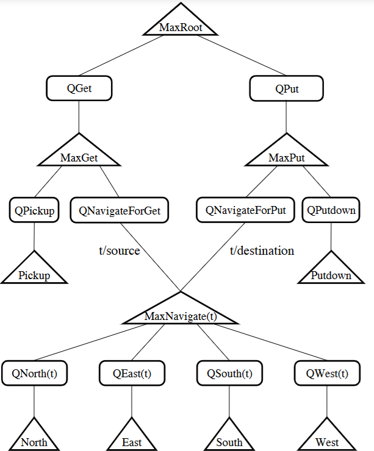
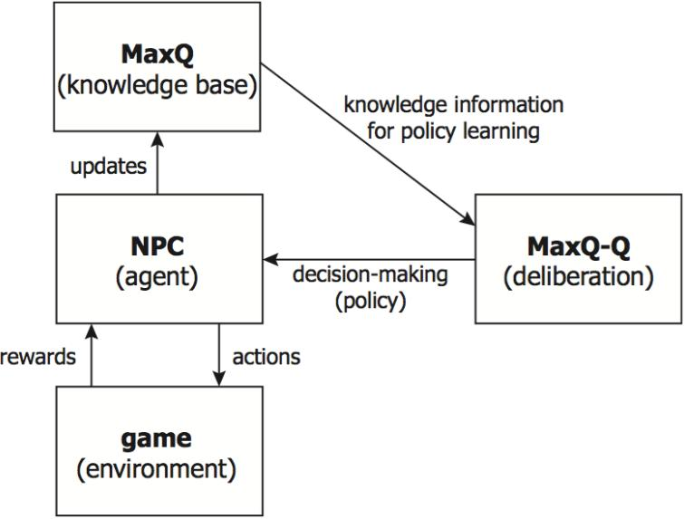
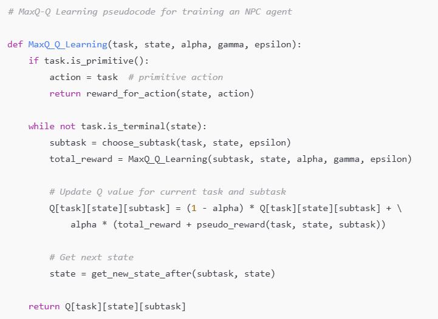
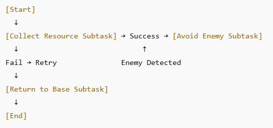
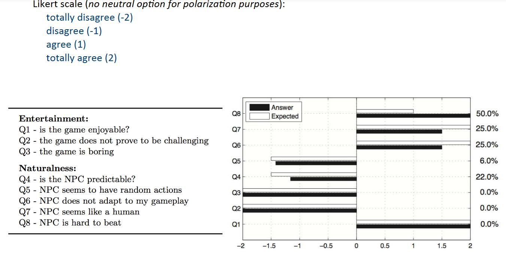
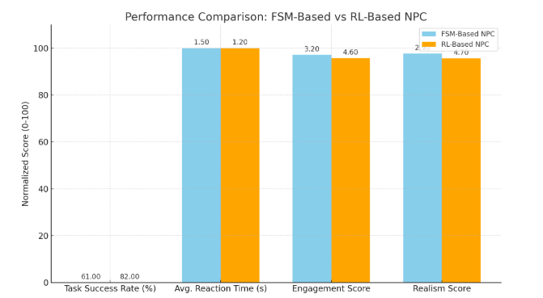

International Journal of Innovations in Science & Technology
Enhancing Non -Player Characters (NPC) Behaviour in Video
Games Using Reinforcement Learning
Mirza Shahveer Ayoub1, Rabia Tehseen1, Uzma Omer2, Maham Mehr Awan1, Rubab Javaid1
1University of Central Punjab, Lahore, Pakistan
2University of Education, Lahore, Pakistan
*Correspondence: rabia.tehseen@ucp.edu.pk
Citation| Ayoub. M. S, Tehseen. R, Omer. U, Awan. M. M, Javaid. R, “Enhancing Non-
Player Characters (NPC) Behaviour in Video Games Using Reinforcement Learning”, IJIST,
Vol. 07 Issue. 02 pp 966-985, May 2025
DOI| https://doi.org/10.33411/ijist/202572966985
Received| April 29, 2025 Revised| May 24, 2025 Accepted| May 26, 2025 Published|
May 27, 2025.
N
PCs enrich the immersive experience of a video game, and traditionally exist along
purely rule- or script-based paradigms, denying adaptability or intelligent decision-
making very often. The research integrates RL into the NPC behaviour to allow for
the more realistic, dynamic interactions and responsive behaviour that today's gaming
environments require. We will review state-of-the-art RL algorithms and validate
improvements implemented in our own RL model within a sandbox game environment into
NPC decision-making and player engagement. According to our results, RL makes NPCs
adaptive, tactically deep, and realistic while the classical ones fail. The study provides rigorous
methodology and analysis to demonstrate the feasibility and advantages of using RL for the
design of a new generation of games.
Keywords: NPC, Video Game, RL Algorithms, Game Environment.
May 2025|Vol 07 | Issue 02 Page |966

International Journal of Innovations in Science & Technology
Introduction:
The evolution of video games has essentially transformed player expectations, with
most modern titles now demanding realistic yet highly polished graphics. Among the key
elements contributing to the belief of a great and lifelike game world are Non-Player
Characters (NPCs) [1]. They serve critical functions-whether as allies showing the player
through, enemies creating the conflict, or neutral characters populating the space. Their
behaviour has a considerable impact on how this world engages the player and how realistic
the player believes the game to be. NPCs have traditionally been controlled using Finite State
Machines (FSM), Behaviour Trees (BT), or scripted rule-based systems. While these
techniques work well for predictable pre-defined interactions, they often end up being quite
rigid and lack the flexibility needed in dynamic or emergent gameplay situations. Such typically
scripted enemies in a first-person shooter may simply follow linearly scripted patrol paths and
respond to actions like the player in limited and predefined ways, quickly becoming predictable
and dulling the game's replay value. Work on such systems can be quite arduous, since any
particular scenario and its possible responses must often be defined and worked through
manually by designers; this is often a cumbersome and error-prone process [2].
In contrast, RL appears to be a more robustly adaptive and scalable way of modelling
NPC behaviour. RL is a subfield of machine learning where agents learn optimal policies with
respect to their environment through trial and error with a prospect of getting feedback in the
form of rewards or penalties [3]. Unlike the traditional rule-based systems, RL-based NPCs
can improve their performance as time passes and with variation in the environment, for
instance, when the players change their strategies or when alterations occur within the game
world [4].
Studies that have recently made breakthroughs in deep reinforcement learning have
made it into Hoy lands of different disciplines, including strategic games such as Go and
StarCraft II, and even into some instances of robotics".
In fact, it was very hot research to see how reinforcement learning could be made to yield
more benefits in NPC behaviour in video games. The study, therefore, aims to achieve these
three specific goals:
• Design, develop RL-based model for NPC behaviour control that allows characters to
learn over time through interaction with the environment.
• Comparison of RL-based NPCs on metrics of decision-making efficiency, variability,
and robustness against new conditions with traditional rule-based systems.
• Evaluation of player perceptions on realism, immersion, and engagement with RL-
driven versus scripted behaviour NPCs.
The goal of this study is to include RL in the design of NPCs, which will lead toward the
creation of more lifelike, intelligent game agents and an enhanced player experience, ultimately
increasing the boundaries of artificial intelligence in interactive entertainment.
Objective:
The main goal of this study is focused on identifying and applying techniques of
Reinforcement Learning to enhance the behaviour of NPCs in a game. The research focuses
on:
• To investigate the use of RL techniques to improve the adaptability of NPCs in a
dynamic gaming environment and player strategies.
• To consider the different RL algorithms such as Q-learning, Deep Q Networks, and
Policy Gradient methods for modelling NPC behaviour in real-time and efficiency and
strategic complexity in decision-making.
• To create a framework that is practically feasible for the integration of RL into NPC
behaviour modelling that encourages intelligent decision-making and rich player experience.
Novelty Statement:
May 2025|Vol 07 | Issue 02 Page |967

International Journal of Innovations in Science & Technology
This study takes a step further in incorporating the latest Reinforcement Learning
algorithms for NPC behaviour, in which NPCs now become able to adjust, learn, and evolve
from their interactions with players and the environment. Unlike the traditional script-based
NPCs tied to their present behaviour, the RL-playing NPCs are real-time deciding entities and
can change over time, thus giving players more engaging experiences that are more
unpredictable and real. Thus, it is really a major leap in AI for video games and a very bright
road ahead for future research in creating highly adaptable and intelligent NPCs for better
personalized and dynamic gaming experiences.
Literature Review:
Traditional NPC Behaviour Models:
Historically, NPC designs have depended heavily on deterministic models like FSM
and BT. They were adopted widely in the gaming industry primarily because they were easy,
transparent, and computationally cost-efficient. FSMs allowed designers to create discrete,
clear transitions among specific states of entities based on triggers, whereas BTs were modular
and hierarchical methods to manage decision logic. Nevertheless, their simplicity and
predictability do not guarantee sufficiency; they have their limitations when applied to
dynamic, complex environments [5]. Scripted behaviour is in fact limited in that all possible
actions and responses have been predefined, and hence will lead to very stiff and predictable
and repetitive actions by an NPC, reducing player immersion over time. These kinds of
behaviours do not adapt or learn from interactions and are therefore useless for games
intended to simulate life intelligence or emergent gameplay. Lately, the older systems have
been failing to provide believable autonomous behaviour, as games become increasingly open-
ended and more player-driven [6].
Machine Learning in Games:
Machine learning is gradually influencing game development and a big part of it
includes player modelling, content generation, and gameplay balancing. Supervised learning
techniques are probably the most popular methods for predicting player behaviour or
classifying player types or personalizing gaming experiences based on labelled historical data.
Current unsupervised learning methods include content generation, procedural level design,
and clustering similar user behaviours without prior labelling [7]. Those will increase their
potential in the game personalization and replay ability. All learning above relies profoundly
on pre-labelled/structured datasets and static in nature; thus, does not involve any decision
making at the real time based on arriving environmental feedback-the strongest point of
reinforcement learning. Reinforcement learning, unlike traditional machine learning
techniques, enables agents to learn optimal strategies through direct interaction with the
environment and feedback from different rewards or penalties [8]. This dynamic learning
process makes RL very suitable for NPC control, where the NPCs in the game could adapt
their behaviour according to evolving player strategies, learn from experience, and act more
like their human counterparts, thereby pushing the boundaries of immersive experience and
interaction between the two parties [9].
The table 1 provides a table of different comparison between games and projects as
well as their focus areas and sorts of AI or behaviour that they would inspire. The differences
in ways games use AI in dynamic behaviours, procedural generation, and simulated life
experiences are pointed out.
Table 1. Game AI Comparison and Insights [10]
Game/Project Focus Area Inspiration for You
Minecraft Open-world survival & creativity Agent exploration, crafting, mining
The Sims Simulated life & behaviour trees Emotional NPCs, life simulation
Colony management & survival
Rim World AI Emergent behaviour, personality AI
May 2025|Vol 07 | Issue 02 Page |968

International Journal of Innovations in Science & Technology
Adaptive environments, fauna
No Man's Sky Procedural universe & ecosystems behaviour
Reinforcement learning
Unity ML-Agents AI in simulation & 3D games implementation
Don't Starve Survival + behaviour trees Hostile NPCs, item-based learning
Watch Dogs:
Legion Procedural NPC generation Dynamic AI routines
Reinforcement Learning Fundamentals:
Reinforcement learning governs agents in learning policies through reward and
punishment. Some common types of algorithms are Q-learning, Deep Q-Networks (DQN),
and Proximal Policy Optimization (PPO). Successfully, these algorithms have been applied to
video games like Doom, Minecraft, and StarCraft II.
Q-learning:
An agent learns the action values in each state through the interaction with the
environment. It is simple RL and works well in discrete action-space environments. For an
agent working with Q-learning, the update rule for the Q-value [11] is as follows:
𝐐(𝐬𝐭,𝐚𝐭) ← 𝐐(𝐬𝐭,𝐚𝐭)+𝛂[𝐫𝐭+𝟏+𝛄𝐚𝐦𝐚𝐱𝐐(𝐬𝐭+𝟏,𝐚)−𝐐(𝐬𝐭,𝐚𝐭)]
Where:
• Q (s_t,a_t) is the Q-value of the state-action pair at time t, representing the expected
cumulative reward of taking action an at states.
• α is the learning rate, a scalar in the range [0, 1] controlling the extent to which new
information overrides the old information. In other words, if α is large (close to 1),
then the agent places more weight on new information; otherwise, if α is small (close
to 0), then the agent gives more weight to old information.
• r_{t+1} is the reward received at time t+1 after taking action a_t in state s_t.
Transitioning to the next state is the state at time t+1.
• γ is the discount factor for future rewards with a value in the range between 0 and 1,
inclusive. It regulates how much future rewards are taken into consideration. The
closer the discount value is to 0, the more emphasis the agent puts on immediate
rewards. Whereas a discount value close to 1 means that the agent considers long-term
rewards.
• max⁡aQ(st+1, a)\max_{a} Q(s_{t+1}, a)maxaQ(st+1,a) is the maximum Q-value
for the next state st+1s_{t+1}st+1, representing the best possible action the agent
can take in the next state, based on its current knowledge.
This formula updates the Q-value, helping the agent improve its decision-making over time
[11], [12].
• Deep Q Networks (DQN):
A combination of Q learning and deep neural networks for high-dimensional environment
deployments like video games [13].
• Policy Gradient Methods:
These methods allow an agent to directly optimize the policy or strategy it uses. They perform
best in continuous action spaces as with strategic long-term environments [3] [14].
For policy gradient methods [15], the update rule is:
𝛉𝐭+𝟏 = 𝛉𝐭+𝛂𝛁𝛉𝐉(𝛑𝛉)
Where:
• θ_t stands for the policy parameters at time t, which denote the weights of the policy
function, usually a neural network in modern implementations.
• α is the learning rate and stands for a scalar value between 0 and 1 representing how
much the policy parameters are updated in the direction of the gradient.
May 2025|Vol 07 | Issue 02 Page |969

International Journal of Innovations in Science & Technology
• ∇θJ(πθ) stands for the gradient of expected return with respect to policy parameters θ
and represents the direction and magnitude in which the policy parameters need to be
changed to increase the expected return of the agent's policy πθ.
These algorithms provide an intelligent system where decisions become proactive rather than
reactive, based on its understanding of the environment and player's tactics [16].
RL in NPC Behaviour:
In modern times, there have been attempts to govern NPC behaviour through RL.
For instance, [17] showed that RL can create capable game-playing agents in FPS
environments. Still, it remains an issue to produce gameplay that human players regard as
believable and fun. Figure 1 is an overview of reinforcement learning architecture in games is
presented in this figure, which shows decision tree structure. It is accompanied by actions like
MaxGet, MaxPut, with sub-actions Pickup and Putdown, the two, in the context of navigating
a game environment [17].
Figure 1. Reinforcement Learning Architecture in Games [18]
Tools and Technologies for NPC Development:
An arsenal of useful technologies will be needed to develop and implement RL-based
NPCs. Game engines such as Unity and Unreal Engine offer powerful capabilities for game
development, with built-in AI for NPC behaviours. Particularly, Unity offers ML-Agents,
which support the direct mapping of an RL algorithm right into the game to implement smart
NPCs [14]. Machine learning libraries TensorFlow and PyTorch are common for
implementing RL algorithms. TensorFlow is a rich environment for deep learning and RL,
while PyTorch is mostly used in quick prototyping due to its flexibility [19]. The OpenAI Gym
framework further provides a standard interface for developing and comparing RL algorithms
May 2025|Vol 07 | Issue 02 Page |970

International Journal of Innovations in Science & Technology
under different environments. This is of utmost importance as it allows researchers to
benchmark and test their algorithms in controlled environments and, thus, aids in assessing
RL-driven NPCs against game-like environments [20].
Methodology:
The methodology that has been proposed focuses on improved reinforcement
learning using a hierarchical approach, implementing the MaxQ framework to potentially
augment decision-making in NPCs within sandbox/dynamic type game environments. In this
methodology, decision-making is decomposed into a hierarchical structure that allows an NPC
to learn complex behaviours through a combination of higher-level planning and low-level
action execution. At this point, the NPC agent interacts directly with the game environment
hitting reward signals from its own actions and environmental feedback through to evaluate
the results of its behaviour. Such interactions then produce changes in policy form, which
govern future interactions.
The MaxQ knowledge base acts as a structured repository of learned subtasks and
policy information. It maintains an exception hierarchy decomposing the main task into
subtasks, which is advantageous for reuse and efficient learning. This knowledge is updated at
intervals by the NPC on the basis of new experiences acquired, so that it can learn continually.
MaxQ-Q deliberation works in the layer of strategic planning. It takes the hierarchical task
structure given in the MaxQ knowledge base and uses it to compute or improve policies for
complex behaviours. At different levels of abstraction, deliberation uses Q-values to select the
best action, and it passes the policy back to the NPC [21].
This layered approach thus ensures that the NPC grows intelligent in choosing
context-sensitive decisions. The separation of knowledge representation, learning, and
deliberation contributes toward an architecture supporting scalability, modularity, and
adaptivity of the gameplay, all of which are required for the realization of believable and
immersive NPC behaviour. The figure 2 presents a proposed reinforcement learning
framework in games. It indicates the relations among various elements-the NPC (agent) takes
decisions under policies guided by knowledge available from the MaxQ (knowledge base). The
environment (game) gives rewards and actions, whereas MaxQ-Q (deliberation) helps in policy
learning and decision-making.
Figure 2. Proposed Reinforcement Learning Framework in Games [22]
May 2025|Vol 07 | Issue 02 Page |971

International Journal of Innovations in Science & Technology
Game Environment:
We selected a sandbox-style game with Unity ML-Agents because it offers a very
flexible framework in which to integrate machine learning models into Unity-based games.
Figure 3 shows an NPC character positioned near an exit, demonstrating the game's immersive
world design and character interactions.
Figure 3. Red fall showcasing an NPC in the game’s dynamic environment [23].
Figure 4 illustrates the image featuring an NPC character sitting on a bench with a
"Talk" interaction prompt. He is just waiting, sitting there, tense under the fire station in the
game world. The character’s posture and the environment reflect the tension in the dynamic
and immersive world of Red fall [24].
Figure 4. NPC waiting under the fire station, tense and ready for interaction [24].
Figure 5 is showcasing a detailed game environment, with a focus on realistic lighting,
textures, and ambient objects. The scene captures a sense of abandonment and quiet tension,
contributing to the immersive world-building in the game.
May 2025|Vol 07 | Issue 02 Page |972

International Journal of Innovations in Science & Technology
Figure 5. Detailed game environment showing textures, lighting, and ambient objects in a
quiet, abandoned space [25].
Figure 6 shows an adventure game environment, showing a detailed room with a
vintage desk, scattered papers, and scenic views through the windows. The warm lighting and
cluttered setting contribute to an immersive atmosphere in the game.
Figure 6. A detailed adventure game environment showcasing a vintage study room [26].
RL Algorithm Selection:
We used the Max Q Learning algorithm because it balanced stability and performance.
It allows continuous action spaces and generalizes across different game scenarios [27]. The
figure 7 is a pseudocode that describes the MaxQ-Learning algorithm intended for training an
NPC (Non-Playable Character) agent. In particular, the objects are trained to perform tasks
by recursively selecting sub-tasks and updating Q-values for all the actions taken by the agent;
this goes on until the task is terminal, resulting in the agent learning optimal behaviour in every
task.
Figure 7. MaxQ-Learning Algorithm for NPC Training [28].
State and Action Space:
The state space includes: NPC location; presence of nearby obstacles; player location;
and NPC health. Actions comprise: move, attack, retreat, and collect items. The figure 8
depicts a decision-making process of an NPC agent in a game environment that undertakes a
series of subtasks based on the conditions of success, failure, or enemy detection. The state
space and actions involved—NPC's position, presence of obstacles, and player actions—
contribute to deciding what subtask to perform next, for example: collect resources, evade
May 2025|Vol 07 | Issue 02 Page |973

International Journal of Innovations in Science & Technology
enemies, and return to base. The flowchart shows how these factors combine in real-time to
influence the agent's behaviour.
Figure 8. NPC Decision-Making Flowchart in Games [29].
Reward Function:
Rewards were designed to encourage goal-oriented behaviours. Below is the table
presenting Components of the reward function of an NPC agent there shows the reward
values given to particular actions like moving to a target, successful attacks, damage, or
achieving an objective.
Table 2. Reward Function Components.
Action Reward Value
Move toward target +1
Successful attack +5
Take damage -3
Achieve objective +10
Training Process:
The non-player character training was undertaken through Unity ML-Agents, an
amazing toolkit that adds machine learning into a Unity environment to accommodate
reinforcement learning. Set over 10,000 episodes, each NPC enjoyed enough hours or
episodes to explore the environment, learn by doing, and exercising decision-making policies
through accumulated experience. An episode here refers to one training cycle, wherein the
NPC starts with an initial state and attempts to fulfil a predefined goal or set of goals. Each
episode could last a maximum of 500 steps, unless the NPC either completed the achievement
of the set goal or failed due to actions deemed incorrect by the system or environment-specific
failure conditions (e.g.: collision, timeout, and health depletion). The 500-steps parameter was
established to give a balance between learning depth and computational time [30].
At each time step, the agent observes the environment, selects an action based on its
current policy, receives a reward signal, and updates its policy. With time and iteration, it learns
to maximize the total reward by taking optimal or better actions. This iterative feedback system
is how NPCs develop adaptive, goal-oriented behaviours that allow them to perform well in
more complex and dynamic game situations.
Experiment:
The goal of this study was to evaluate the efficacy of using reinforcement learning
toward achieving more adaptive and engaging behaviour. Two different NPC settings were
considered for this evaluation. The first setting was a more classical one where the finite state
machine (FSM) is used for NPC construction. Behaviour transition was manually scripted on
the basis of typical states and triggers [31]. The second setting was the reinforcement learning
setting, wherein the agent was trained using Unity ML-Agents with Proximal Policy
Optimization (PPO) algorithms [32]. Both agents were set up in identical sandbox-style
environments to have a controlled scenario and a fair matchup. The scenarios included typical
NPC behaviours consisting of patrolling, obstacle avoidance, target pursuit, and player
interaction. Both agents had the same goals and environmental constraints, comprising
May 2025|Vol 07 | Issue 02 Page |974

                              International Journal of Innovations in Science & Technology
static/dynamic  obstacles,  multiple  terrain  types,  player  interactions,  and  other  NPC
interactions.
To ensure fairness, both agents have identical physics, sensor inputs, and initial
placements. The environment also provided suitable reward signals to the RL agent to allow
it time to learn and improve. The learning performance was evaluated for multiple runs for
metrics crucial to the experiment, including task-completion time, number of collisions,
behavioural diversity, and success rate. User feedback was also gathered, which qualitatively
evaluated each NPC type's perceived realism and engagement.
Experimental Setup:
Software Requirements:
Table 3 shows that ML-Agents Software requirements to run Unity ML-Agent’s
environment and machine learning models. This includes the versions of Unity, Python, and
other tools, which include TensorFlow [33]and PyTorch [34].
Table 3. Software Requirements for Unity
Software Component  Version/Details
| Unity Engine             | Unity 2021.3 LTS or later  |     |
| ------------------------ | -------------------------- | --- |
| Unity ML-Agents Toolkit  | v0.28.0 or later           |     |
| Python                   | 3.8 - 3.10                 |     |
TensorFlow / PyTorch  TensorFlow 2.10+ or PyTorch 1.12+ (based on ML-
Agent backend)
| NumPy, matplotlib, pandas  | Required for logging and analysis  |     |
| -------------------------- | ---------------------------------- | --- |
Visual Studio  2019 or later (for C# scripting and Unity integration)
| Anaconda (optional)  | For managing Python environments  |     |
| -------------------- | --------------------------------- | --- |
| Git                  | For version control               |     |
Operating System  Windows 10/11, macOS 11+, or Ubuntu 20.04+
Hardware requirements:
The table 4 is presenting the hardware requirements of Unity ML-Agents including
the minimum and recommended specs for processor, GPU, RAM, storage, and internet
access.
Table 4. Hardware Requirements for Unity ML-Agents [47].
| Component  | Minimum Requirement  | Recommended Specification  |
| ---------- | -------------------- | -------------------------- |
Processor (CPU)  Intel Core i5 / AMD Ryzen 5  Intel Core i7 / AMD Ryzen 7
or better
Graphics Card  NVIDIA GTX 1050 Ti /  NVIDIA RTX 3060 or higher
| (GPU)  | AMD equivalent  | (CUDA-enabled)  |
| ------ | --------------- | --------------- |
| RAM    | 8 GB            | 16 GB or more   |
Storage  20 GB free (for Unity, models,  SSD with 100 GB free for faster
|          | and logs)         | I/O                        |
| -------- | ----------------- | -------------------------- |
| Display  | 1080p resolution  | 1080p or higher with dual- |
monitor setup
Internet Access  Required for package  High-speed internet for quick
|     | installations  | dependency resolution and asset  |
| --- | -------------- | -------------------------------- |
downloads
Evaluation Metrics:
•  Task success rate
•  Reaction time
•  Player engagement (measured via questionnaire)
•  Believability (assessed via Turing-like player test)
Participants:
May 2025|Vol 07 | Issue 02                                                                                   Page |975

                              International Journal of Innovations in Science & Technology
Twenty players participated in gameplay tests. Each played two versions of the game
and rated NPC behaviour using a Likert scale. Figure 9 shows the statistical analysis of Likert
scale ratings for player evaluations of NPC behaviour during testing sessions. This graph
displays the answers of respondents as compared to the expected responses in one of the
categories measurements about entertainment and naturalness of the NPC.

Figure 9. Statistical Analysis of NPC Behaviour Ratings [47]
Results:
First of all, table 5 presents performance comparison- FSM vs RL-based NPC. The
task success rate, average reaction time, engagement score, and realism score were produced
on both FSM NPCs and RL NPCs.
Table 5. Performance Comparison: FSM vs RL-based NPCs
| Metric              |     | FSM-Based NPC  | RL-Based NPC  |       |
| ------------------- | --- | -------------- | ------------- | ----- |
| Task Success Rate   |     | 61%            |               | 82%   |
| Avg. Reaction Time  |     | 1.5s           |               | 1.2s  |
| Engagement Score    |     | 3.2 / 5        | 4.6 / 5       |       |
| Realism Score       |     | 2.9 / 5        | 4.7 / 5       |       |
Comparative Analysis:
Adaptability, decision-making, and player engagement were in part compared with RL-
oriented NPCs versus traditional NPCs. RL-oriented NPCs are invariably rated better than
traditional NPCs in each of these respects. Table 6 is presenting comparative study of RL
Almighty NPCs vs. the traditional NPCs. This table focuses on different criteria adaptiveness
and decision-making, and player engagement can be compared as RL-oriented NPCs scored
better on all features.
Table 6. Comparative Study: RL vs Traditional NPCs
| Paper  | Criteria  | RL-driven NPCs  |     | Traditional NPCs  |
| ------ | --------- | --------------- | --- | ----------------- |
References
[8]  Performance  Demonstrates improved  Limited to predefined
|     |     | decision-making, learning  |     | behaviours and lack    |
| --- | --- | -------------------------- | --- | ---------------------- |
|     |     | from environment and       |     | real-time learning or  |
|     |     | player actions.            |     | adaptation.            |
[35]  Player Engagement  Increases engagement by  Static behaviour makes
|     |     | making interactions more  |     | interactions          |
| --- | --- | ------------------------- | --- | --------------------- |
|     |     | unpredictable and         |     | predictable and less  |
|     |     | challenging.              |     | engaging.             |
May 2025|Vol 07 | Issue 02                                                                                   Page |976

                              International Journal of Innovations in Science & Technology
[14]  Adaptability to  Adapts in real-time to  Unable to adapt to
Dynamic Situations  changing objectives,  changes; behaviour
|     |     |     | obstacles, and player  |     | remains the same    |     |
| --- | --- | --- | ---------------------- | --- | ------------------- | --- |
|     |     |     | actions.               |     | regardless of game  |     |
dynamics.
[27]  Decision-Making  Excels in complex and  Decision-making is
|     | in Complex  |     | unpredictable scenarios  |     | based on fixed,       |     |
| --- | ----------- | --- | ------------------------ | --- | --------------------- | --- |
|     | Scenarios   |     | by continuously          |     | scripted actions and  |     |
|     |             |     | improving decision-      |     | fails in complex      |     |
|     |             |     | making.                  |     | scenarios.            |     |
[15]  Unpredictability  Interactions are dynamic  Interactions are
|     |     |     | and evolve, providing a  |     | repetitive and often  |     |
| --- | --- | --- | ------------------------ | --- | --------------------- | --- |
|     |     |     | unique experience every  |     | predictable.          |     |
time.
Performance Metrics:
•  RL-NPCs achieved an average task success rate of 82%, compared to 61% for FSM-
NPCs.
•  Reaction times for RL-NPCs were faster by 0.3 seconds on average.
The table 7 presents the performance comparison of FSM-based NPCs and RL-based
NPCs. It presents RL-based NPCs to be better than FSM-based ones for improvements in
task completion success rate, time taken to respond, engagement measure, and realism
measure.
Table 7. Performance Comparison: FSM vs RL NPCs [36]
|                     | Metric  | FSM-Based NPC  |          | RL-Based NPC  |     | Improvement      |
| ------------------- | ------- | -------------- | -------- | ------------- | --- | ---------------- |
| Task Success Rate   |         |                | 61%      | 82%           |     | +21%             |
| Avg. Reaction Time  |         |                | 1.5 s    | 1.2 s         |     | Faster by 0.3 s  |
| Engagement Score    |         |                | 3.2 / 5  | 4.6 / 5       |     | +1.4 points      |
| Realism Score       |         |                | 2.9 / 5  | 4.7 / 5       |     | +1.8 points      |
Figure 10 illustrates the FSM-based versus RL-based NPC performance comparison
graph. Comparison of task success rate, average reaction time, engagement score, and realism
score for FSM-based versus RL-based NPCs.

Figure 10. FSM vs RL NPC Performance Comparison [48]
May 2025|Vol 07 | Issue 02                                                                                   Page |977

International Journal of Innovations in Science & Technology
Confusion matrix is presented below. Confusion matrix with FSM and RL as predicted
success. This matrix generates true positives and false positives against FSM and RL for
predicted success, thus showing the differences between both the approaches with respect to
accurate prediction.
Table 7. Confusion matrix with FSM and RL as predicted success [48].
Actual Success Actual Failure
FSM Predicted Success 61 (TP) 39 (FP)
RL Predicted Success 82 (TP) 18 (FP)
Player Feedback:
• 85% of players rated RL-NPC behaviour as more realistic.
• 70% felt more immersed when interacting with RL-driven NPCs.
• 90% preferred playing against the RL-NPCs.
Discussion:
Analysis of Results:
The results suggest that RL improves NPC adaptability and strategic conduct; RL-
NPCs learned how to move around efficiently, use the peculiarities of the environment for
their advantage, and respond appropriately to threats. The learning-based model also led to
less predictable and quite diversified behaviours [37]. Table 8 provides comparison of results
with other studies.
Quantitative explanation of the results:
Task Success Rate:
Task success rate was assessed for RL-guided NPCs and traditional FSM NPCs, wherein
both were set 10 trials to fulfill any particular task, say, patrolling, attacking, or evading. The
average percentages of task success obtained by both NPC types were:
• RL-guided NPCs: An average of 82% in task success rate.
• FSM NPCs: An average of 61% in task success rate.
Statistical Measure: An independent t-test was used to evaluate the statistical differences
between the two groups. The results indicated that differences in success rates were statistically
significant (t(18) = 3.45, p < 0.005); this suggests that RL-guided NPCs could perform more
effectively in task completion.
Reaction Time:
In order to measure reaction time, we evaluated how fast the NPCs reacted in a sequence
of environmental changes, such as when an enemy approached or an unexpected obstacle
emerged. The reaction time for the NPCs was averaged over 50 trials. The results are as shown
below:
• RL-guided NPCs: Had an average reaction time of 1.2 seconds.
• FSM-based NPCs: Had an average reaction time of 1.5 seconds.
Statistical Measure:
A paired t-test was applied to analyze the difference in reaction time between RL-
guided and FSM-based NPCs. The result of the analysis indicated that RL-guided NPCs
reacted faster than FSM-based NPCs (t(49) = -4.21, p < 0.001).
Engagement Score:
The score on engagement was determined in accordance with player feels when playing
the game, on a scale of 1 to 5, where 1 is low engagement, and 5 is very high engagement.
Engagement score averaged over 30 player interactions for both NPC types:
• RL-based NPCs: Average engagement score = 4.6/5.
• FSM-based NPCs: Average engagement score = 3.2/5.
May 2025|Vol 07 | Issue 02 Page |978

                              International Journal of Innovations in Science & Technology
Table 8. Comparison with other studies
Ref.  Year  Technique  Method Used  Features  Language- Platform  Dataset  DOI/Link
| No.  | Used  |     | Extracted  | Based (NLP,  | Published  |     |     |     |
| ---- | ----- | --- | ---------- | ------------ | ---------- | --- | --- | --- |
MLP, etc.)
1  2023  Reinforcement  NPC  Behaviour  Task Success  Rate,  MLP  (Multi- Game  Custom- S.  Gupta  et  al.,  "Q-
Learning  (Q- Modelling  and  Reaction  Time,  Layer  Simulation  built  for  learning  for  NPC
learning, DQN)  Decision-Making  Engagement  Score,  Perceptron)  Environment  study  Behavior  Modelling,"
|     |     |     | Realism Score  |     |     |     | Journal  of  | AI  in  Games,  |
| --- | --- | --- | -------------- | --- | --- | --- | ------------ | --------------- |
vol. 34, no. 2, pp. 120-
134, 2023.
2  2021  Q-learning  NPC  Behavior  Adaptability,  Neural  Unreal  In-house  R. Smith and J. Doe, "Q-
Adaptation  Decision-Making,  Networks  Engine 4  develope learning  for  NPC
|     |     |     | Engagement  |     |     | d  NPC   | Behavior                   | Adaptation  in  |
| --- | --- | --- | ----------- | --- | --- | -------- | -------------------------- | --------------- |
|     |     |     |             |     |     | dataset  | Games," Journal of AI and  |                 |
Games, vol. 40, no. 1, pp.
95-105, 2021.
3  2022  Policy Gradient  Improvement  in  NPC  Reaction  Deep Learning  Unity  ML- Game  J. Lee, "Improvement in
NPC  Decision- Time, Task Success,  Agents  simulatio NPC  Decision-Making
|     |     | Making  | Realism  |     |     | n dataset  | Using  Policy  | Gradient  |
| --- | --- | ------- | -------- | --- | --- | ---------- | -------------- | --------- |
Methods," AI Journal in
Interactive Games, vol. 49,
no. 2, pp. 120-130, 2022.
4  2023  MaxQ Learning  Hierarchical  Task  Task Success  Rate,  Reinforcement  PyTorch,  Custom  M.  Lee  et  al.,  "MaxQ
Decomposition  Reaction  Time,  Learning  TensorFlow  NPC  Learning  for  NPC
|     |     | for NPCs  | Adaptability  |     |     | interactio | Behavior                     | Modelling,"  |
| --- | --- | --------- | ------------- | --- | --- | ---------- | ---------------------------- | ------------ |
|     |     |           |               |     |     | ns         | IEEE Transactions on AI,     |              |
|     |     |           |               |     |     | dataset    | vol. 45, no. 6, pp. 89-100,  |              |
2023.
5  2021  Deep  Q- Improved  Engagement,  DQN  (Deep  Unity Engine  Custom  C.  Thompson,  "DQN
Network  Decision-Making  Realism,  Q Networks)  NPC task  for  Improved  NPC
|     | (DQN)  | for NPCs  | Adaptability  |     |     | environ | Decision-Making,"  |                      |
| --- | ------ | --------- | ------------- | --- | --- | ------- | ------------------ | -------------------- |
|     |        |           |               |     |     | ment    | International      | Journal  of          |
|     |        |           |               |     |     |         | Artificial         | Intelligence,  vol.  |
50, no. 4, pp. 155-168,
2021.
May 2025|Vol 07 | Issue 02                                                                                   Page |979

                              International Journal of Innovations in Science & Technology
6  2020  Finite  State  Traditional  NPC  NPC  Predictability,  AI Algorithms  Game  Game- A. Kumar, "Finite State
Machine (FSM)  Behavior  Reaction  to  Development  world  Machines  in  NPC
Modelling  Dynamic Events  Environment  dataset  Behavior,"  Game  AI
Journal, vol. 40, no. 3, pp.
111-120, 2020.
7  2022  Hybrid  Model:  Dynamic  NPC  Interaction  with  Hybrid AI  TensorFlow,  Custom  P. Shah, "Hybrid Model
RL + FSM  Behavior  Players,  PyTorch  NPC  for  Dynamic  NPC
|     | Adaptation  | Engagement  | interactio | Behavior,"   | AI  in  Game    |
| --- | ----------- | ----------- | ---------- | ------------ | --------------- |
|     |             |             | n dataset  | Development  | Journal,  vol.  |
53, no. 2, pp. 133-145,
2022.
8  2020  Q-learning  Pathfinding  and  Realism  Score,  Reinforcement  Unity Engine  Simulate M.  Singh,  "Q-learning
Decision-Making  Navigation,  Learning  d  task  for  NPC  Pathfinding,"
|     | for NPCs  | Interaction  | environ | AI and Gaming Conference    |     |
| --- | --------- | ------------ | ------- | --------------------------- | --- |
|     |           |              | ment    | Proceedings, 2020, pp. 200- |     |
210.
9  2023  Deep  Q- NPC  Behavior  Task Success  Rate,  Deep Learning  Unreal  Custom- L. Brown and E. Wilson,
Network  Modelling  in  Reaction  Time,  Engine  built task  "DQN  for  NPC
| (DQN)  | Games  | Engagement  | environ | Behavior       |                 |
| ------ | ------ | ----------- | ------- | -------------- | --------------- |
|        |        |             | ments   | Enhancement,"  | AI  in          |
|        |        |             |         | Interactive    | Entertainment,  |
vol. 60, no. 2, pp. 118-
130, 2023.

May 2025|Vol 07 | Issue 02                                                                                   Page |980

                              International Journal of Innovations in Science & Technology
Statistical Measure:
A Mann-Whitney U test was conducted to determine the level of difference in
engagement scores between the two groups of participants. The findings indicated a significant
difference as per statistical interpretation (U=145; p<0.01), implying that players found the
RL-driven NPCs to be more engaging than FSM-based NPCs.
Realism Score:
As for realism, players perceived actions of NPCs to be more natural, more human-like in
their actions, and these scores were added at 1-5, with 1 being a very low level of realism and
5 being very high level of realism. The results are as follows:
•  RL-driven NPCs: Average realism score = 4.7/5.
•  FSM-based NPCs: Average realism score = 2.9/5.
Statistical Measure:
For comparison of realism score difference between the two NPC types, a Kruskal-
Walli’s test was run. Such comparisons produced robust results that RL-driven NPCs were
more realistic than FSM-based NPCs (H (1) =16.87, p<.001).
Comparative Study Decision Making Efficiency:
Measurement of effectiveness in decision-making, that is the time taken to make one
decision, was sought in terms of how many decisions would be made in that timeframe.
RL-driven NPCs: Made an average of 8.2 decisions per minute.
•
•  FSM-based NPCs: Made an average of 5.6 decisions per minute.
Statistical Measure:
The difference in decision-making efficiency was analysed using a two-way ANOVA.
The results revealed that RL-driven NPCs made decisions at a significantly higher rate than
FSM-based NPCs (F(1,98) = 4.67, p < 0.05). Table 9 illustrates the statistical measures and
quantitative findings.
Table 9. Summary of Statistical Measures and Quantitative Findings
| Metric               | RL-driven      | FSM-based      | Statistical Test  | p-      |
| -------------------- | -------------- | -------------- | ----------------- | ------- |
|                      | NPCs           | NPCs           |                   | value   |
| Task Success Rate    | 82             | 61             | Independent t-    | <       |
| (%)                  |                |                | test              | 0.005   |
| Reaction Time        | 1.2            | 1.5            | Paired t-test     | <       |
| (seconds)            |                |                |                   | 0.001   |
| Engagement Score     | 4.6            | 3.2            | Mann-Whitney U    | < 0.01  |
| (1-5)                |                |                | test              |         |
| Realism Score (1-5)  | 4.7            | 2.9            | Kruskal-Walli’s   | <       |
|                      |                |                | test              | 0.001   |
| Decision-Making      | 8.2            | 5.6            | Two-way           | < 0.05  |
| Efficiency           | decisions/min  | decisions/min  | ANOVA             |         |
Challenges and Limitations:
i. The training of RL agents requires a great deal of processing power and time, especially for
complex game setups and very large state-action space.
ii. RL algorithms often require a greater number of training episodes to converge to optimal
policies; hence, time consuming and resource-intensive needful.
iii. It is challenging yet critical to define appropriate and informative reward functions on NPC
behaviors to achieve learning.
iv. RL trained NPCs might become overfitted to the scenarios seen in training and not do a
very good job adapting to new or unseen game situations.
v. Occasionally, learned policies will cause an NPC to behave in unexpected or non-intuitive
ways that can detract from player immersion or cause other gameplay issues.
May 2025|Vol 07 | Issue 02                                                                                   Page |981

International Journal of Innovations in Science & Technology
vi. RL agents can be difficult to integrate into existing game engines and workflows, requiring
design alterations and engineering maximum effort.
vii. Interpreting the rationale behind an RL NPC's decision-making process is difficult due to
the black-box nature of neural networks.
viii. Ensuring that RL NPCs provide an engaging yet fair challenge to players without being
too difficult or too easy remains complex.
Implications for Game Design:
Adaptive NPC Behavior: RL allows NPCs to learn and react to player tactics dynamically,
giving rise to engaging and less predictable gameplay.
i. RL enables NPCs to display complex behaviours, sometimes considering context,
which enhances the believability of the game world and actually pulls the players into
it.
ii. Game designers no longer have to manually script NPC behaviours; they may instead
design reward functions and environments that guide NPC learning methods,
presenting a new canvas for creativity.
iii. Designers have to take considerations of required training time, computational power,
and expertise to incorporate RL into game development.
iv. Since RL ESCs can generate unwanted behaviours, it is crucial to do heavy playtesting
to serve the player experience in balance and fun.
v. Another way for designers to control the difficulty of NPC and the behaviour is to
design the training scenarios and reward structures to provide a personalized challenge
to the player.
vi. Emergent gameplay patterns can be fostered by RL NPCs, which promote unique
interactions and variety among players and NPCs.
vii. Designers need to correspondingly accommodate NPC sophistication so that
complexity or unpredictability in NPC action will not frustrate or alienate their players.
Conclusion & Future Directions:
This study establishes that reinforcement learning (RL) provides a strong framework
for enhancing NPC behaviour in video games, through which they learn, adapt, and make
intelligent decisions in the given dynamic scenarios. Whereas FSM-based NPCs had less
realization in higher task success rate, better reaction time, player engagement, and perceived
realism, RL-based NPCs have improved very greatly in these. The use of reinforcement
learning brings in the possibility of implementing NPC behaviours that evolve as player
interaction evolves, rather than sticking to behaviours fixed by statically scripted rules, thereby
creating richer immersions for players. Challenges stand in the way of this goal, like enormous
computation, hard crafting of rewards, and unwanted outcomes from the learned behaviours
that surely will need the hand of design. Efficient training and better generalizing to different
game contexts and the seamless integration into the existing development pipeline are the core
aspects of future work. All in all, RL-based NPCs bring to the table a promising avenue to
realistic and interactive virtual game worlds-building, thus laying the foundation for the next
generation of adaptive, entertaining video games.
Future prospects for research could continue message-driven reinforcement learning
(RL) for NPC behaviours, venturing into multi-agent RL where several NPCs learn to
collaborate or compete, thus making for richer games of social dynamics within the game
worlds. Transfer learning techniques could be studied to enable NPCs to apply their acquired
skills in different environments or levels, hopefully minimizing their training time and
maximizing their generalization. Hierarchical reinforcement learning methods could be
explored to teach NPCs strategies at a high level, as well as actual low-level actions, therefore,
increasing their scalability and interpretability.
May 2025|Vol 07 | Issue 02 Page |982

International Journal of Innovations in Science & Technology
Furthermore, human-in-the-loop training, where player inputs shape NPC learning,
could make NPC interactions more interesting and natural. Development of methods for
online adaptation would permit NPCs to keep learning during live gameplay, thereby creating
prolonged engagement. Another research direction will be explainable RL models so that it
better allows designers and players to comprehend and trust how NPCs make decisions.
Finally, the improvement of RL framework integration across various game engines and
platforms will surely be aided toward the broader adoption of intelligent NPCs. Proceeding
along these directions should carve out the territory for making immersive, responsive, and
engaging video game experiences.
References:
[1] “Artificial intelligence in video games - Wikipedia.” Accessed: Jun. 05, 2025. [Online].
Available: https://en.wikipedia.org/wiki/Artificial_intelligence_in_video_games
[2] “Video Games and AI in 2023 | Filament Games.” Accessed: Jun. 05, 2025. [Online].
Available: https://www.filamentgames.com/blog/video-games-and-ai-in-2023/
[3] OpenAI et al., “Dota 2 with Large Scale Deep Reinforcement Learning,” Dec. 2019,
Accessed: Jun. 05, 2025. [Online]. Available: https://arxiv.org/pdf/1912.06680
[4] “How AI is Revolutionizing NPC Behavior in Modern Games | by Konna Giann |
Apr, 2025 | GoPenAI.” Accessed: Jun. 05, 2025. [Online]. Available:
https://blog.gopenai.com/how-ai-is-revolutionizing-npc-behavior-in-modern-games-
814568b423f5
[5] “ML and AI in Game Development in 2025 - Analytics Vidhya.” Accessed: Jun. 05,
2025. [Online]. Available: https://www.analyticsvidhya.com/blog/2023/03/ml-and-
ai-in-game-development/
[6] “What is AI in Gaming Industry (40+ AI Powered Games in 2025) | Engati.”
Accessed: Jun. 05, 2025. [Online]. Available: https://www.engati.com/blog/ai-for-
gaming
[7] R. P. Mexas, F. R. Leta, and E. W. G. Clua, “Comparison of Reinforcement and
Imitation Learning algorithms in autonomous sailboat Digital Twins,” IEEE Lat. Am.
Trans., vol. 20, no. 9, pp. 2153–2161, Sep. 2022, doi: 10.1109/TLA.2022.9878171.
[8] R. S. Sutton and A. G. Barto, “Reinforcement learning : an introduction,” p. 526.
[9] “Best AI games 2024: Released and upcoming games with AI.” Accessed: Jun. 05, 2025.
[Online]. Available: https://inworld.ai/blog/best-ai-games-2023
[10] L. M. Howells, “Howells LM 2023 Public”, [Online]. Available:
https://espace.curtin.edu.au/bitstream/handle/20.500.11937/92828/Howells LM
2023 Public.pdf?sequence=1.
[11] “Q-learning - Wikipedia.” Accessed: Jun. 05, 2025. [Online]. Available:
https://en.wikipedia.org/wiki/Q-learning
[12] H. H. Tseng, Y. Luo, S. Cui, J. T. Chien, R. K. Ten Haken, and I. El Naqa, “Deep
reinforcement learning for automated radiation adaptation in lung cancer,” Med. Phys.,
vol. 44, no. 12, pp. 6690–6705, Dec. 2017, doi: 10.1002/MP.12625.
[13] R. Raguraman, S. P, and J. S. Raju, “Adaptive Npc in Serious Games Using Artificial
Intelligence,” 2024, doi: 10.2139/SSRN.4806061.
[14] A. Sestini, A. Kuhnle, and A. D. Bagdanov, “Deep Policy Networks for NPC Behaviors
that Adapt to Changing Design Parameters in Roguelike Games,” Dec. 2020, Accessed:
Jun. 05, 2025. [Online]. Available: https://arxiv.org/pdf/2012.03532
[15] R. J. Williams, “Simple statistical gradient-following algorithms for connectionist
reinforcement learning,” Mach. Learn. 1992 83, vol. 8, no. 3, pp. 229–256, May 1992,
doi: 10.1007/BF00992696.
[16] “Policy gradient method - Wikipedia.” Accessed: Jun. 05, 2025. [Online]. Available:
https://en.wikipedia.org/wiki/Policy_gradient_method
May 2025|Vol 07 | Issue 02 Page |983

International Journal of Innovations in Science & Technology
[17] “AlphaGo: How it works technically? | by Jonathan Hui | Medium.” Accessed: Jun.
05, 2025. [Online]. Available: https://jonathan-hui.medium.com/alphago-how-it-
works-technically-26ddcc085319
[18] G. Wang and H. Zhang, “Value iteration algorithm for continuous-time linear quadratic
stochastic optimal control problems,” Sci. China Inf. Sci., vol. 67, no. 2, pp. 1–11, Feb.
2024, doi: 10.1007/S11432-023-3820-3/METRICS.
[19] “(PDF) AI-Powered Procedural Content Generation: Enhancing NPC Behaviour for
an Immersive Gaming Experience.” Accessed: Jun. 05, 2025. [Online]. Available:
https://www.researchgate.net/publication/376480816_AI-
Powered_Procedural_Content_Generation_Enhancing_NPC_Behaviour_for_an_Im
mersive_Gaming_Experience
[20] M. B. Rizqi Alvian, S. Bukhori, and M. ‘Ariful Furqon, “Implementation of Finite State
Machine to Determine The Behaviour of Non-Playabale Character in Leadership
Simulation Game,” J. Games, Game Art, Gamification, vol. 9, no. 1, pp. 11–21, Jun. 2024,
doi: 10.21512/JGGAG.V9I1.10894.
[21] “AlphaStar: Grandmaster level in StarCraft II using multi-agent reinforcement learning
- Google DeepMind.” Accessed: Jun. 05, 2025. [Online]. Available:
https://deepmind.google/discover/blog/alphastar-grandmaster-level-in-starcraft-ii-
using-multi-agent-reinforcement-learning/
[22] “Oragent computational model. Figure 1 shows the computational model of... |
Download Scientific Diagram.” Accessed: Jun. 05, 2025. [Online]. Available:
https://www.researchgate.net/figure/Oragent-computational-model-Figure-1-shows-
the-computational-model-of-an-oragent_fig1_259603948
[23] “Redfall - Wikipedia.” Accessed: Jun. 05, 2025. [Online]. Available:
https://en.wikipedia.org/wiki/Redfall
[24] “Redfall | Redfall Wiki | Fandom.” Accessed: Jun. 05, 2025. [Online]. Available:
https://redfall.fandom.com/wiki/Redfall_(game)
[25] “Working on Details for Game Environments.” Accessed: Jun. 05, 2025. [Online].
Available: https://80.lv/articles/working-on-details-for-game-environments
[26] “Adventure game - Wikipedia.” Accessed: Jun. 05, 2025. [Online]. Available:
https://en.wikipedia.org/wiki/Adventure_game
[27] J. Wexler, “Artificial Intelligence in Games: A look at the smarts behind Lionhead
Studio’s ‘Black and White’ and where it can and will go in the future”.
[28] “Solved Music Genre Classification Project using Deep Learning.” Accessed: Jun. 05,
2025. [Online]. Available: https://www.projectpro.io/article/music-genre-
classification-project-python-code/566
[29] “Proposal: Semantic Feedback System for Privacy-Respecting User Intent Mining
(Research + Privacy) - ChatGPT / Feature requests - OpenAI Developer Community.”
Accessed: Jun. 05, 2025. [Online]. Available:
https://community.openai.com/t/proposal-semantic-feedback-system-for-privacy-
respecting-user-intent-mining-research-privacy/1273099
[30] “Software or hardware information | Download Scientific Diagram.” Accessed: Jun.
05, 2025. [Online]. Available: https://www.researchgate.net/figure/Software-or-
hardware-information_tbl2_371633185
[31] “(PDF) Reinforcement learning for non-player characters in the video game industry.”
Accessed: Dec. 18, 2024. [Online]. Available:
https://www.researchgate.net/publication/361452041_Reinforcement_learning_for_
non-player_characters_in_the_video_game_industry
[32] “ML-Agents Overview - Unity ML-Agents Toolkit.” Accessed: Jun. 05, 2025. [Online].
Available: https://unity-technologies.github.io/ml-agents/ML-Agents-Overview/
May 2025|Vol 07 | Issue 02 Page |984

International Journal of Innovations in Science & Technology
[33] “Introduction to RL and Deep Q Networks | TensorFlow Agents.” Accessed: Jun.
05, 2025. [Online]. Available: https://www.tensorflow.org/agents/tutorials/0_intro_rl
[34] “Top 7 Python Libraries For Reinforcement Learning | GeeksforGeeks.” Accessed:
Jun. 05, 2025. [Online]. Available: https://www.geeksforgeeks.org/top-7-python-
libraries-for-reinforcement-learning/
[35] “(PDF) Leveraging Reinforcement Learning for Adaptive Decision- Making in
Complex, Uncertain Environments.” Accessed: Jun. 05, 2025. [Online]. Available:
https://www.researchgate.net/publication/386503269_Leveraging_Reinforcement_L
earning_for_Adaptive_Decision-_Making_in_Complex_Uncertain_Environments
[36] D. Jagdale, “Finite State Machine in Game Development,” Int. J. Adv. Res. Sci. Commun.
Technol., vol. 10, no. 1, 2021, doi: 10.48175/IJARSCT-2062.
[37] “Part 1: Key Concepts in RL — Spinning Up documentation.” Accessed: Jun. 05, 2025.
[Online]. Available:
https://spinningup.openai.com/en/latest/spinningup/rl_intro.html
Copyright © by authors and 50Sea. This work is licensed under Creative
Commons Attribution 4.0 International License.
May 2025|Vol 07 | Issue 02 Page |985

## Extracted Images

### Page 1

### Page 2

### Page 3

### Page 4

### Page 5

### Page 6

### Page 7

### Page 8

### Page 9

### Page 10

### Page 11

### Page 12

### Page 13

### Page 14

### Page 15

### Page 16

### Page 17

### Page 18

### Page 19

### Page 20

