|                          | FeUdal | Networks | for | Hierarchical | Reinforcement |     |     |                        | Learning          |     |     |
| ------------------------ | ------ | -------- | --- | ------------ | ------------- | --- | --- | ---------------------- | ----------------- | --- | --- |
| AlexanderSashaVezhnevets |        |          |     |              |               |     |     | VEZHNICK@GOOGLE.COM    |                   |     |     |
| SimonOsindero            |        |          |     |              |               |     |     | OSINDERO@GOOGLE.COM    |                   |     |     |
| TomSchaul                |        |          |     |              |               |     |     |                        | SCHAUL@GOOGLE.COM |     |     |
| NicolasHeess             |        |          |     |              |               |     |     |                        | HEESS@GOOGLE.COM  |     |     |
| MaxJaderberg             |        |          |     |              |               |     |     | JADERBERG@GOOGLE.COM   |                   |     |     |
| DavidSilver              |        |          |     |              |               |     |     | DAVIDSILVER@GOOGLE.COM |                   |     |     |
| KorayKavukcuoglu         |        |          |     |              |               |     |     |                        | KORAYK@GOOGLE.COM |     |     |
7102 raM 6  ]IA.sc[  2v16110.3071:viXra
DeepMind
Abstract
|                                  |     |     |     |        | mains a      | major       | challenge   | for     | these methods, |       | especially in |
| -------------------------------- | --- | --- | --- | ------ | ------------ | ----------- | ----------- | ------- | -------------- | ----- | ------------- |
|                                  |     |     |     |        | environments |             | with sparse | reward  | signals,       | such  | as the in-    |
| WeintroduceFeUdalNetworks(FuNs): |     |     |     | anovel |              |             |             |         |                |       |               |
|                                  |     |     |     |        | famous       | Montezuma’s |             | Revenge | ATARI          | game. | It is symp-   |
architectureforhierarchicalreinforcementlearn-
|     |     |     |     |     | tomatic | that the | standard | approach | on  | the ATARI | bench- |
| --- | --- | --- | --- | --- | ------- | -------- | -------- | -------- | --- | --------- | ------ |
ing. Ourapproachisinspiredbythefeudalrein-
|            |            |                      |             |          | mark suite                                    | (Bellemare |               | et al., | 2012)             | is to use        | an action-   |
| ---------- | ---------- | -------------------- | ----------- | -------- | --------------------------------------------- | ---------- | ------------- | ------- | ----------------- | ---------------- | ------------ |
| forcement  | learning   | proposal             | of Dayan    | and Hin- |                                               |            |               |         |                   |                  |              |
|            |            |                      |             |          | repeat heuristic,                             |            | where         | each    | action translates |                  | into several |
| ton, and   | gains      | power and            | efficacy by | decou-   |                                               |            |               |         |                   |                  |              |
|            |            |                      |             |          | (usually4)consecutiveactionsintheenvironment. |            |               |         |                   |                  | Yetan-       |
| pling      | end-to-end | learning across      | multiple    | levels   |                                               |            |               |         |                   |                  |              |
|            |            |                      |             |          | other dimension                               |            | of complexity |         | is seen           | in non-Markovian |              |
| – allowing | it         | to utilise different | resolutions | of       |                                               |            |               |         |                   |                  |              |
environmentsthatrequirememory–theseareparticularly
| time. | Our framework | employs | a Manager | mod- |     |     |     |     |     |     |     |
| ----- | ------------- | ------- | --------- | ---- | --- | --- | --- | --- | --- | --- | --- |
challenging,sincetheagenthastolearnwhichpartsofex-
| uleandaWorkermodule. |     | TheManageroperates |     |     |     |     |     |     |     |     |     |
| -------------------- | --- | ------------------ | --- | --- | --- | --- | --- | --- | --- | --- | --- |
periencetostoreforlater,usingonlyasparserewardsignal.
| at a lower | temporal | resolution | and sets | abstract |     |     |     |     |     |     |     |
| ---------- | -------- | ---------- | -------- | -------- | --- | --- | --- | --- | --- | --- | --- |
goals which are conveyed to and enacted by the The framework we propose takes inspiration from feudal
Worker. TheWorkergeneratesprimitiveactions
reinforcementlearning(FRL)introducedbyDayan&Hin-
ateverytickoftheenvironment. Thedecoupled ton(1993),wherelevelsofhierarchywithinanagentcom-
structureofFuNconveysseveralbenefits–inad- municate via explicit goals. Some key insights from FRL
dition to facilitating very long timescale credit arethatgoalscanbegeneratedinatop-downfashion,and
assignment it also encourages the emergence of thatgoalsettingcanbedecoupledfromgoalachievement;
sub-policies associated with different goals set a level in the hierarchy communicates to the level below
by the Manager. These properties allow FuN to it what must be achieved, but does not specify how to do
dramatically outperform a strong baseline agent so. Makinghigherlevelsreasonatalowertemporalreso-
ontasksthatinvolvelong-termcreditassignment lutionnaturallystructurestheagentsbehaviourintotempo-
or memorisation. We demonstrate the perfor- rallyextendedsub-policies.
manceofourproposedsystemonarangeoftasks
|     |     |     |     |     | The architecture |     | explored |     | in this | work | is a fully- |
| --- | --- | --- | --- | --- | ---------------- | --- | -------- | --- | ------- | ---- | ----------- |
fromtheATARIsuiteandalsofroma3DDeep-
|     |     |     |     |     | differentiable | neural | network |     | with two | levels | of hierarchy |
| --- | --- | --- | --- | --- | -------------- | ------ | ------- | --- | -------- | ------ | ------------ |
MindLabenvironment.
(thoughthereareobviousgeneralisationstodeeperhierar-
|     |     |     |     |     | chies).  | The top    | level, | the Manager, |             | sets goals | at a lower     |
| --- | --- | --- | --- | --- | -------- | ---------- | ------ | ------------ | ----------- | ---------- | -------------- |
|     |     |     |     |     | temporal | resolution | in     | a latent     | state-space |            | that is itself |
1.Introduction learntbytheManager. Thelowerlevel,theWorker,oper-
atesatahighertemporalresolutionandproducesprimitive
Deep reinforcement learning has recently enjoyed suc- actions,conditionedonthegoalsitreceivesfromtheMan-
cesses in many domains (Mnih et al., 2015; Schulman ager. The Worker is motivated to follow the goals by an
etal.,2015;Levineetal.,2015;Mnihetal.,2016;Lillicrap intrinsic reward. However, significantly, no gradients are
etal.,2015). Nevertheless,long-termcreditassignmentre-
propagatedbetweenWorkerandManager;theManagerre-
|     |     |     |     |     | ceives its  | learning                                | signal | from | the environment |     | alone. In |
| --- | --- | --- | --- | --- | ----------- | --------------------------------------- | ------ | ---- | --------------- | --- | --------- |
|     |     |     |     |     | otherwords, | theManagerlearnstoselectlatentgoalsthat |        |      |                 |     |           |
maximiseextrinsicreward.

|     |     |     |     |     |     |     |     |     |     |     |     |     | (R-VM) (cid:7570)cos(s t t (cid:7636) t+c -s,g) t t |
| --- | --- | --- | --- | --- | --- | --- | --- | --- | --- | --- | --- | --- | --------------------------------------------------- |
Transition policy gradient
FeUdalNetworksforHierarchicalReinforcementLearning
| Thekeycontributionsofourproposalare:(1)Aconsistent, |     |     |     |     |     |     |     | Manager |     |     |     |     |     |
| --------------------------------------------------- | --- | --- | --- | --- | --- | --- | --- | ------- | --- | --- | --- | --- | --- |
goal
end-to-enddifferentiablemodelthatembodiesandgeneral- Transition
|     |     |     |     |     |     |     |     | s t ∈Rd |     | f  Mrnn | g t ∈Rd |     | policy gradient |
| --- | --- | --- | --- | --- | --- | --- | --- | ------- | --- | ------- | ------- | --- | --------------- |
izestheprinciplesofFRL.(2)Anovel,approximatetransi- No gradient
tionpolicygradientupdatefortrainingtheManager,which
|     |     |     |     |     |     |     |     | f  Mspace |     |     |     | Worker |     |
| --- | --- | --- | --- | --- | --- | --- | --- | --------- | --- | --- | --- | ------ | --- |
exploitsthesemanticmeaningofthegoalsitproduces. (3) (cid:7592)
|                                                     |     |     |     |     |     |     | f  percept |       |     |         | k=16 << d=256 |     |     |
| --------------------------------------------------- | --- | --- | --- | --- | --- | --- | ---------- | ----- | --- | ------- | ------------- | --- | --- |
| Theuseofgoalsthataredirectionalratherthanabsolutein |     |     |     |     |     |     | x          | z ∈Rd |     |         |               |     |     |
|                                                     |     |     |     |     |     |     | t          | t     |     | w ∈Rkx1 |               |     |     |
nature. (4) A novel RNN design for the Manager – a di- t action
Policy gradient
|     |     |     |     |     |     |     |     |     |     |     |     | X a | t   |
| --- | --- | --- | --- | --- | --- | --- | --- | --- | --- | --- | --- | --- | --- |
latedLSTM–whichextendsthelongevityoftherecurrent
|                                                   |                                          |     |     |     |     |     |     | f  Wrnn |     | U∈R|a|xk |     |     |     |
| ------------------------------------------------- | ---------------------------------------- | --- | --- | --- | --- | --- | --- | ------- | --- | -------- | --- | --- | --- |
| statememoriesandallowsgradientstoflowthroughlarge |                                          |     |     |     |     |     |     |         |     | t        |     |     |     |
| hopsintime,                                       | enablingeffectiveback-propagationthrough |     |     |     |     |     |     |         |     |          |     |     |     |
hundredsofsteps. Figure1. TheschematicillustrationofFuN(section3)
| Our ablative  | analysis     | (Section | 5.4)        | confirms | that      | transi- |                                               |     |     |     |                               |                        |        |
| ------------- | ------------ | -------- | ----------- | -------- | --------- | ------- | --------------------------------------------- | --- | --- | --- | ----------------------------- | ---------------------- | ------ |
| tional policy | gradient     | and      | directional | goals    | are       | crucial |                                               |     |     |     |                               |                        |        |
|               |              |          |             |          |           |         | end,theytendtodegeneratetooneoft(cid:7636)wot |     |     |     | (cid:7570)ℒ(r+(cid:7571)cos(S | trivit+acltstolutions: | -S,g)) |
| for best      | performance. | Our      | experiments | on a     | selection | of      |                                               |     |     |     |                               |                        |        |
Policy gradient
|       |                  |     |              |             |     |     | (i) only | one active | option | that | solves | the whole | task; (ii) |
| ----- | ---------------- | --- | ------------ | ----------- | --- | --- | -------- | ---------- | ------ | ---- | ------ | --------- | ---------- |
| ATARI | games (including |     | the infamous | Montezuma’s |     | re- |          |            |        |      |        |           |            |
venge) andon severalmemory tasksin the3D DeepMind a policy-over-options that changes options at every step,
Labenvironment(Beattieetal.,2016)showthatFuNsig- micro-managing the behaviour. Consequently, regularis-
ers(Baconetal.,2017;Vezhnevetsetal.,2016)areusually
nificantlyimproveslong-termcreditassignmentandmem-
orisation. introducedtosteerthesolutiontowardsmultipleoptionsof
|     |     |     |     |     |     |     | extended     | length.   | This | is believed | to           | provide | an inductive |
| --- | --- | --- | --- | --- | --- | --- | ------------ | --------- | ---- | ----------- | ------------ | ------- | ------------ |
|     |     |     |     |     |     |     | bias towards | re-usable |      | temporal    | abstractions |         | and to help  |
2.RelatedWork
generalisation.
Buildinghierarchicalagentsisalongstandingtopicinre- A key difference between our approach and the options
| inforcement | learning | (Sutton | et al., | 1999; Precup, |     | 2000; |           |         |        |          |     |           |          |
| ----------- | -------- | ------- | ------- | ------------- | --- | ----- | --------- | ------- | ------ | -------- | --- | --------- | -------- |
|             |          |         |         |               |     |       | framework | is that | in our | proposal | the | top level | produces |
Dayan & Hinton, 1993; Dietterich, 2000; Boutilier et al., a meaningful and explicit goal for the bottom level to
1997;Dayan,1993;Kaelbling,2014;Parr&Russell,1998;
|        |               |       |              |       |         |     | achieve.  | Sub-goalsemergeasdirectionsinthelatentstate- |     |          |     |              |         |
| ------ | ------------- | ----- | ------------ | ----- | ------- | --- | --------- | -------------------------------------------- | --- | -------- | --- | ------------ | ------- |
| Precup | et al., 1997; | 1998; | Schmidhuber, | 1991; | Sutton, |     |           |                                              |     |          |     |              |         |
|        |               |       |              |       |         |     | space and | are naturally                                |     | diverse. | We  | also achieve | signif- |
1995; Wiering & Schmidhuber, 1997; Vezhnevets et al., icantly better scores on ATARI than Option-Critic (sec-
| 2016; Bacon | et al., | 2017). | The options | framework |     | (Sut- |     |     |     |     |     |     |     |
| ----------- | ------- | ------ | ----------- | --------- | --- | ----- | --- | --- | --- | --- | --- | --- | --- |
tion5).
tonetal.,1999;Precup,2000)isapopularformulationfor
|             |             |     |            |                  |     |     | There has | also | been | a significant |     | progress | in non- |
| ----------- | ----------- | --- | ---------- | ---------------- | --- | --- | --------- | ---- | ---- | ------------- | --- | -------- | ------- |
| considering | the problem |     | with a two | level hierarchy. |     | The |           |      |      |               |     |          |         |
bottom level – an option – is a sub-policy with a termi- hierarchicaldeepRLmethodsbyusingauxiliarylossesand
|     |     |     |     |     |     |     | rewards. | (Bellemare | et  | al., 2016a) | have | significantly | ad- |
| --- | --- | --- | --- | --- | --- | --- | -------- | ---------- | --- | ----------- | ---- | ------------- | --- |
nationcondition,whichtakesinenvironmentobservations
andoutputsactionsuntiltheterminationconditionismet. vancedthestate-of-the-artonMontezuma’sRevengebyus-
Anagentpicksanoptionusingitspolicy-over-options(the ing pseudo-count based auxiliary rewards for exploration,
|                                                    |     |     |     |     |     |     | which stimulate |     | agents | to explore | new | parts | of the state |
| -------------------------------------------------- | --- | --- | --- | --- | --- | --- | --------------- | --- | ------ | ---------- | --- | ----- | ------------ |
| toplevel)andsubsequentlyfollowsituntiltermination, |     |     |     |     |     | at  |                 |     |        |            |     |       |              |
which point the policy-over-options is queried again and space. The recently proposed UNREAL agent (Jaderberg
etal.,2016)alsodemonstratesastrongimprovementbyus-
| theprocesscontinues. |     | Optionsaretypicallylearnedusing |     |     |     |     |     |     |     |     |     |     |     |
| -------------------- | --- | ------------------------------- | --- | --- | --- | --- | --- | --- | --- | --- | --- | --- | --- |
sub-goals and ‘pseudo-rewards’ that are provided explic- ing unsupervised auxiliary tasks to help refine its internal
itly(Suttonetal.,1999;Dietterich,2000;Dayan&Hinton, representations. Wenotethatthesebenefitsareorthogonal
tothoseprovidedbyFuN,andthatbothapproachescould
| 1993). | For a simple, | tabular | case (Wiering | &   | Schmidhu- |     |     |     |     |     |     |     |     |
| ------ | ------------- | ------- | ------------- | --- | --------- | --- | --- | --- | --- | --- | --- | --- | --- |
ber,1997;Schauletal.,2015),eachstatecanbeusedasa becombinedwithFuNforevengreatereffect.
| sub-goal.                                            | Given the | options, | a policy-over-options |     |     | can be |            |     |     |     |     |     |     |
| ---------------------------------------------------- | --------- | -------- | --------------------- | --- | --- | ------ | ---------- | --- | --- | --- | --- | --- | --- |
| learnedusingstandardtechniquesbytreatingoptionsasac- |           |          |                       |     |     |        | 3.Themodel |     |     |     |     |     |     |
tions. Recently(Tessleretal.,2016;Kulkarnietal.,2016)
|     |     |     |     |     |     |     | WhatisFuN? |     | FuNisamodularneural-networkconsist- |     |     |     |     |
| --- | --- | --- | --- | --- | --- | --- | ---------- | --- | ----------------------------------- | --- | --- | --- | --- |
havedemonstratedthatcombiningdeeplearningwithpre-
definedsub-goalsdeliverspromisingresultsinchallenging ing of two modules – the Worker and the Manager. The
|                           |      |           |            |         |          |     | Manager       | internally | computes |        | a latent       | state | representation |
| ------------------------- | ---- | --------- | ---------- | ------- | -------- | --- | ------------- | ---------- | -------- | ------ | -------------- | ----- | -------------- |
| environments              | like | Minecraft | and Atari, | however | sub-goal |     |               |            |          |        |                |       |                |
|                           |      |           |            |         |          |     | s and outputs |            | a goal   | vector | g . The Worker |       | produces ac-   |
| discoverywasnotaddressed. |      |           |            |         |          |     | t             |            |          |        | t              |       |                |
tionsconditionedonexternalobservation,itsownstate,and
A recent work of (Bacon et al., 2017) shows the possibil- the Managers goal. The Manager and the Worker share
| ity of learning  | options | jointly | with         | a policy-over-options |        |        |              |        |                                      |       |                |     |          |
| ---------------- | ------- | ------- | ------------ | --------------------- | ------ | ------ | ------------ | ------ | ------------------------------------ | ----- | -------------- | --- | -------- |
|                  |         |         |              |                       |        |        | a perceptual | module | which                                | takes | an observation |     | from the |
| in an end-to-end | fashion |         | by extending | the                   | policy | gradi- |              |        |                                      |       |                |     |          |
|                  |         |         |              |                       |        |        | environmentx |        | andcomputesasharedintermediaterepre- |       |                |     |          |
t
ent theorem to options. When options are learnt end-to- sentation z . The Manager’s goals g are trained using an
|     |     |     |     |     |     |     |     | t   |     |     | t   |     |     |
| --- | --- | --- | --- | --- | --- | --- | --- | --- | --- | --- | --- | --- | --- |

FeUdalNetworksforHierarchicalReinforcementLearning
approximate transition policy gradient. This is a particu- 3.2.Learning
larlyefficientformofpolicygradienttrainingthatexploits
We consider a standard reinforcement learning setup. At
theknowledgethattheWorker’sbehaviourwillultimately
each step t, the agent receives an observation x from the
alignwiththegoaldirectionsithasbeenset. TheWorker t
environment and selects an action a from a finite set of
is then trained via intrinsic reward to produce actions that t
possibleactions.Theenvironmentrespondswithanewob-
cause these goal directions to be achieved. Figure 1a il-
servationx andascalarrewardr . Theprocesscontin-
lustratestheoveralldesignandthefollowingequationsde- t+1 t
uesuntiltheterminalstateisreached,afterwhichitrestarts.
scribetheforwarddynamicsofournetwork:
Thegoaloftheagentistomaximisethediscountedreturn
R = (cid:80)∞ γkr with γ ∈ [0,1]. The agent’s be-
t k=0 t+k+1
z =f percept (x ) (1) haviour is defined by its action-selection policy π. FuN
t t
produces a distribution over possible actions (a stochastic
policy)asdefinedineq.6.
Mspace
s =f (z ) (2)
t t
The conventional wisdom would be to train the whole ar-
hM,gˆ =f Mrnn (s ,hM );g =gˆ/||gˆ||; (3) chitecture monolithically through gradient descent on ei-
t t t t−1 t t t ther the policy directly or via TD-learning. Notice, that
since FuN is fully differentiable we could train it end-to-
t
(cid:88) endusingapolicygradientalgorithmoperatingontheac-
w =φ( g ) (4)
t i tions taken by the Worker. The outputs g of the Manager
i=t−c
would be trained by gradients coming from the Worker.
This,howeverwoulddepriveManager’sgoalsgofanyse-
hW,U t =f Wrnn (z t ,hW t−1 ) (5) manticmeaning,makingthemjustinternallatentvariables
of the model. We propose instead to independently train
π =SoftMax(U w ) (6) Managertopredictadvantageousdirections(transitions)in
t t t
statespaceandtointrinsicallyrewardtheWorkertofollow
these directions. If theWorker can fulfil thegoal of mov-
whereboththeManagerandtheWorkerarerecurrent.Here
inginthesedirections(asitisrewardedfordoing),thenwe
hM and hW correspond to the internal states of the Man-
ought to end up taking advantageous trajectories through
ager and the Worker respectively. A linear transform φ
state-space. Weformalisethisinthefollowingupdaterule
mapsagoalg intoanembeddingvectorw ∈Rk,whichis
t t
fortheManager:
thencombinedviaproductwithmatrixU (Workersoutput)
t
toproducepolicyπ–vectorofprobabilitiesoverprimitive
actions. Thenextsectionprovidesthedetailsongoalem- ∇g =AM∇ d (s −s ,g (θ)), (7)
t t θ cos t+c t t
bedding and the following sections 3.2,3.3 describes how
FuNistrained. where AM = R − VM(x ,θ) is the Manager’s ad-
t t t t
vantage function, computed using a value function esti-
3.1.Goalembedding mate VM(x ,θ) from the internal critic; d (α,β) =
t t cos
αTβ/(|α||β|)isthecosinesimilaritybetweentwovectors.
The goal g modulates the policy via a multiplicative
Note:thedependenceofsonθisignoredwhencomputing
interaction in a low dimensional goal-embedding space
∇ d – this avoids trivial solutions. Notice that now g
Rk,k << d. The Worker first produces an embedding θ cos t
acquiresasemanticmeaningasanadvantageousdirection
vector for every action, represented by rows of matrix
in the latent state space at a horizon c, which defines the
U ∈ R|a|×k (eq. 5). To incorporate goals from the Man-
temporalresolutionoftheManager.
ager,thelastcgoalsarefirstpooledbysummationandthen
embedded into a vector w ∈ Rk using a linear projection TheintrinsicrewardthatencouragestheWorkertofollow
φ (eq. 4). The projection φ is linear, with no biases, and thegoalsisdefinedas:
islearntwithgradientscomingfromtheWorker’sactions.
c
The embedding matrix U is then combined with the goal rI =1/c (cid:88) d (s −s ,g ) (8)
t cos t t−i t−i
embedding w via a matrix-vector product (eq. 6). Since
i=1
φ has no biases it can never produce a constant non-zero
vector – which is the only way the setup could ignore the WeusedirectionsbecauseitismorefeasiblefortheWorker
Manager’s input. This makes sure that the goal output by to be able to reliably cause directional shifts in the latent
theManageralwaysinfluencesthefinalpolicy.Noticehow, state than it is to assume that the Worker can take us to
duetopoolingofgoalsoverseveraltime-steps,thecondi- (potentially)arbitrarynewabsolutelocations. Italsogives
tioningfromtheManagervariessmoothly. adegreeofinvariancetothegoalsandallowsforstructural

FeUdalNetworksforHierarchicalReinforcementLearning
generalisation–thesamedirectionalsub-goalgcaninvoke Ingeneral,theWorkermayfollowacomplextrajectory. A
a sub-policy that is valid and useful in a large part of the naive application of policy gradients requires the agent to
latentstatespace;e.g.evadeanenemy,swimupforair,etc. learn from samples of these trajectories. But if we know
Wecompareabsoluteagainstdirectionalgoalsempirically wherethesetrajectoriesarelikelytoendup,bymodelling
insection5.4. thetransitions,thenwecanskipdirectlyovertheWorker’s
behaviourandinsteadfollowthepolicygradientofthepre-
| The original | feudal |     | reinforcement | learning |     | formulation |        |             |             |     |              |      |         |
| ------------ | ------ | --- | ------------- | -------- | --- | ----------- | ------ | ----------- | ----------- | --- | ------------ | ---- | ------- |
|              |        |     |               |          |     |             | dicted | transition. | FuN assumes |     | a particular | form | for the |
ofDayan&Hinton(1993)advocatedcompletelyconceal-
|            |                                         |          |             |     |            |           | transitionmodel:thatthedirectioninstate-space,s |     |     |     |     |                    | t+c −s t , |
| ---------- | --------------------------------------- | -------- | ----------- | --- | ---------- | --------- | ----------------------------------------------- | --- | --- | --- | --- | ------------------ | ---------- |
| ing the    | reward                                  | from the | environment |     | from lower | levels of |                                                 |     |     |     |     |                    |            |
|            |                                         |          |             |     |            |           | followsavonMises-Fisherdistribution.            |     |     |     |     | Specifically,ifthe |            |
| hierarchy. | Inpracticewetakeasofterapproachbyadding |          |             |     |            |           |                                                 |     |     |     |     |                    |            |
meandirectionofthevonMises-Fisherdistributionisgiven
anintrinsicrewardforfollowingthegoals,butretainingthe
|                          |      |           |     |                          |                  |     | byg(o | t )(whichforcompactnesswewriteasg |                              |      |        | t )wewould |            |
| ------------------------ | ---- | --------- | --- | ------------------------ | ---------------- | --- | ----- | --------------------------------- | ---------------------------- | ---- | ------ | ---------- | ---------- |
| environmentrewardaswell. |      |           |     | TheWorkeristhentrainedto |                  |     |       |                                   |                              |      |        |            |            |
|                          |      |           |     |                          |                  |     | have  | p(s                               | |s ,o ) ∝ edcos(st+c−st,gt). |      |        | If this    | functional |
| maximiseaweightedsumR    |      |           |     | +αRI,whereαisahyper-     |                  |     |       | t+c                               | t t                          |      |        |            |            |
|                          |      |           |     | t t                      |                  |     |       | were                              |                              |      |        |            |            |
|                          |      |           |     |                          |                  |     | form  |                                   | indeed correct,              | then | we see | that our   | proposed   |
| parameter                | that | regulates | the | influence                | of the intrinsic | re- |       |                                   |                              |      |        |            |            |
updateheuristicfortheManager,eqn.7,isinfacttheproper
| ward. The | Workers | policy |     | π can be | trained to | maximise |     |     |     |     |     |     |     |
| --------- | ------- | ------ | --- | -------- | ---------- | -------- | --- | --- | --- | --- | --- | --- | --- |
formforthetransitionpolicygradientarrivedatineqn.10.
intrinsicrewardbyusinganyoff-theshelfdeepreinforce-
ment learning algorithm. Here we use an advantage actor Note that the Worker’s intrinsic reward (eqn. 8) is based
critic(Mnihetal.,2016): on the log-likelihood of state trajectory. Through that the
|                        |     |         |     |           |        |      | FuN                                     | architecture | actively | encourages | the                | functional     | form |
| ---------------------- | --- | ------- | --- | --------- | ------ | ---- | --------------------------------------- | ------------ | -------- | ---------- | ------------------ | -------------- | ---- |
|                        |     | ∇π =AD∇ |     | logπ(a    | |x ;θ) | (9)  |                                         |              |          |            |                    |                |      |
|                        |     | t       | t θ | t         | t      |      | ofthetransitionmodeltoholdtrue.         |              |          |            | BecausetheWorkeris |                |      |
|                        |     |         |     |           |        |      | learningtoachievetheManager’sdirection, |              |          |            |                    | itstransitions |      |
| TheAdvantagefunctionAD |     |         |     | = (R +αRI | −VD(x  | ;θ)) |                                         |              |          |            |                    |                |      |
t t t t t should,overtime,closelyfollowadistributionaroundthis
is calculated using an internal critic, which estimates the direction, and hence our approximation for transition pol-
valuefunctionsforbothrewards.
icygradientsshouldholdreasonablywell.
NotethattheWorkerandManagercanpotentiallyhavedif-
ferentdiscountfactorsγ forcomputingthereturn. Thisal- 4.Architecturedetails
lows,forinstance,theWorkertobemoregreedyandfocus
Thissectionprovidestheparticulardetailsofthemodelas
| on immediate |     | rewards | while | the Manager | can | consider a |     |     |     |     |     |     |     |
| ------------ | --- | ------- | ----- | ----------- | --- | ---------- | --- | --- | --- | --- | --- | --- | --- |
percept
long-termperspective. describedinsection3. Theperceptualmodulef is
|     |     |     |     |     |     |     | a convolutional |        | network | (CNN) | followed    | by a    | fully con- |
| --- | --- | --- | --- | --- | --- | --- | --------------- | ------ | ------- | ----- | ----------- | ------- | ---------- |
|     |     |     |     |     |     |     | nected          | layer. | The CNN | has a | first layer | with 16 | 8x8 fil-   |
3.3.TransitionPolicyGradients
|     |     |     |     |     |     |     | ters | of stride | 4, followed | by a | layer with | with 32 | 4x4 fil- |
| --- | --- | --- | --- | --- | --- | --- | ---- | --------- | ----------- | ---- | ---------- | ------- | -------- |
WenowmotivateourproposedupdaterulefortheManager ters of stride 2. The fully connected layer has 256 hidden
asanovelformofpolicygradientwithrespecttoamodel
units. Eachconvolutionalandfully-connectedlayerisfol-
of the Worker’s behaviour. Consider a high-level policy lowed by a rectifier non-linearity1. The state space which
o = µ(s ,θ) that selects among sub-policies (possibly the Manager implicitly models in formulating its goals is
| t   | t   |     |     |     |     |     |     |     |     |     |     |     |     |
| --- | --- | --- | --- | --- | --- | --- | --- | --- | --- | --- | --- | --- | --- |
Mspace
fromacontinuousset),whereweassumefornowthatthese computed via f , which is another fully connected
sub-policies are fixed duration behaviours (lasting for c layerfollowedbyarectifiernon-linearity. Thedimension-
steps).Correspondingtoeachsub-policyisatransitiondis-
|     |     |     |     |     |     |     | alityoftheembeddingvectors,w,issetask |     |     |     |     | =   | 16. Toen- |
| --- | --- | --- | --- | --- | --- | --- | ------------------------------------- | --- | --- | --- | --- | --- | --------- |
tribution, p(s t+c |s t ,o t ), that describes the distribution of courageexplorationintransitionpolicy,ateverystepwith
statesthatweendupattheendofthesub-policy,giventhe
asmallprobability(cid:15)weemitarandomgoalsampledfrom
startstateandthesub-policyenacted.Thehigh-levelpolicy auni-variateGaussian.
| can be composed |     | with | the transition | distribution |     | to give a |     |     |     |     |     |     |     |
| --------------- | --- | ---- | -------------- | ------------ | --- | --------- | --- | --- | --- | --- | --- | --- | --- |
Wrnn
‘transitionpolicy’πTP(s |s )=p(s |s ,µ(s ,θ))de- The Worker’s recurrent network f is a standard
|             |                  |     | t+c     | t          | t+c t   | t             |        |             |                |        |              |     |           |
| ----------- | ---------------- | --- | ------- | ---------- | ------- | ------------- | ------ | ----------- | -------------- | ------ | ------------ | --- | --------- |
|             |                  |     |         |            |         |               | LSTM   | (Hochreiter | & Schmidhuber, |        | 1997).       | For | the Man-  |
| scribing    | the distribution |     | over    | end states | given   | start states. |        |             |                |        |              |     |           |
|             |                  |     |         |            |         |               | ager’s | recurrent   | network,       | f Mrnn | , we propose | a   | novel de- |
| It is valid | to refer         | to  | this as | a policy   | because | the original  |        |             |                |        |              |     |           |
MDP is isomorphic to a new MDP with policy πTP and sign – the dilated LSTM, which is introduced in the next
|            |          |     |         |         |           |        | section. | Bothf | Mrnn andf | Wrnn | have256hiddenunits. |     |     |
| ---------- | -------- | --- | ------- | ------- | --------- | ------ | -------- | ----- | --------- | ---- | ------------------- | --- | --- |
| transition | function | s   | = πTP(s | ) (i.e. | the state | always |          |       |           |      |                     |     |     |
|            |          | t+c |         | t       |           |        |          |       |           |      |                     |     |     |
transitionstotheendstatepickedbythetransitionpolicy).
1ThisissubstantiallythesameCNNasin(Mnihetal.,2016;
Asaresult,wecanapplythepolicygradienttheoremtothe 2015), theonlydifferenceisthatinthepre-processingstagewe
transitionpolicyπTP,soastofindtheperformancegradi- retainallcolourchannels.
entwithrespecttothepolicyparameters,
| ∇ πTP | =E[(R | −V(s | ))∇ | logp(s | |s ,µ(s | ,θ))] |     |     |     |     |     |     |     |
| ----- | ----- | ---- | --- | ------ | ------- | ----- | --- | --- | --- | --- | --- | --- | --- |
| θ t   |       | t    | t   | θ      | t+c t   | t     |     |     |     |     |     |     |     |
(10)

FeUdalNetworksforHierarchicalReinforcementLearning
montezuma_revenge
3000
| 2500 | FuN, 0.99 |     |     |     |     |     |     |     |     |     |     |     |     |     |
| ---- | --------- | --- | --- | --- | --- | --- | --- | --- | --- | --- | --- | --- | --- | --- |
LSTM, 0.99
2000
erocS
start
1500
15
tnuoc laoG
1000
10
500
| 0   |                 |         |     |     |     |     |     |     |     |           |     |     |     | 5   |
| --- | --------------- | ------- | --- | --- | --- | --- | --- | --- | --- | --------- | --- | --- | --- | --- |
| 0   | 200             | 400 600 | 800 |     |     |     |     |     |     |           |     |     |     |     |
|     | Training epochs |         |     |     |     |     | 0   |     |     | Time step |     |     |     |     |
180
|     |     | (a) |     |     |     |     |     |     |     | (b) |     |     |     |     |
| --- | --- | --- | --- | --- | --- | --- | --- | --- | --- | --- | --- | --- | --- | --- |
Figure2.a)LearningcurveonMontezuma’sRevengeb)Thisisavisualisationofsub-goalslearntbyFuNinthefirstroom. Foreach
time step we compute the latent state s and the corresponding goal g . We then find a future state for which cos(s −s ,g ) is
|     |     |     |     |     | t   |     |     | t   |     |     |     |     | t   | t t |
| --- | --- | --- | --- | --- | --- | --- | --- | --- | --- | --- | --- | --- | --- | --- |
maximized. Theplotcorrespondstothenumberofpaststatesforwhichaframemaximizesthegoal-i.e. thetallerthebar,themore
frequentlythatstatewasamaximizeroftheexpressionforsomepreviousstate. NoticethatFuNhaslearntasemanticallymeaningful
sub-goals–thetallbarsintheplot(i.e.consistentgoals)correspondtointerpretablyusefulwaypointsinMontezuma.
4.1.DilatedLSTM revenge–aninfamouslyhardATARIgame–insection5.1.
|     |     |     |     |     |     |     |     | Section | 5.2 presents | results | on  | more ATARI |     | games and |
| --- | --- | --- | --- | --- | --- | --- | --- | ------- | ------------ | ------- | --- | ---------- | --- | --------- |
We propose a novel RNN architecture for the Manager, extensively compares FuN to LSTM baseline with differ-
| which   | operates | at lower         | temporal | resolution |             | than | the data |              |            |       |               |              |            |          |
| ------- | -------- | ---------------- | -------- | ---------- | ----------- | ---- | -------- | ------------ | ---------- | ----- | ------------- | ------------ | ---------- | -------- |
|         |          |                  |          |            |             |      |          | ent discount | factors    | and   | BPTT lengths. |              | In section | 5.3 we   |
| stream. | We       | define a dilated | LSTM     |            | analogously | to   | dilated  |              |            |       |               |              |            |          |
|         |          |                  |          |            |             |      |          | present      | results on | a set | of visual     | memorisation |            | tasks in |
convolutionalnetworks(Yu&Koltun,2016).Foradilation
|          |             |            |            |             |     | {hˆi}r        |         | 3Denvironment.                  | Section5.4presentsanablationstudyof |     |     |     |     |     |
| -------- | ----------- | ---------- | ---------- | ----------- | --- | ------------- | ------- | ------------------------------- | ----------------------------------- | --- | --- | --- | --- | --- |
| radius   | r let the   | full state | of the     | network     | be  | h =           | ,       |                                 |                                     |     |     |     |     |     |
|          |             |            |            |             |     |               | i=1     | FuN,validatingourdesignchoices. |                                     |     |     |     |     |     |
| i.e. it  | is composed | of         | r separate | groups      |     | of sub-states | or      |                                 |                                     |     |     |     |     |     |
| ‘cores’. | At time     | t the      | network    | is governed |     | by the        | follow- |                                 |                                     |     |     |     |     |     |
hˆt%r,g = LSTM(s ,hˆt%r;θ LSTM ),where Baseline. Our main baseline is a recurrent LSTM net-
| ingequations: |     | t t |     | t   |     |     |     |         |          |                |     |         |      |          |
| ------------- | --- | --- | --- | --- | --- | --- | --- | ------- | -------- | -------------- | --- | ------- | ---- | -------- |
|               |     |     |     |     | t−1 |     |     | work on | top of a | representation |     | learned | by a | CNN. The |
%denotesthemodulooperationandallowsustoindicate
whichgroupofcoresiscurrentlybeingupdated. Wemake LSTM (Hochreiter & Schmidhuber, 1997) architecture is
|                |          |          |               |         | LSTM    |          |        | a widely     | used recurrent |         | network | and it           | was demonstrated |          |
| -------------- | -------- | -------- | ------------- | ------- | ------- | -------- | ------ | ------------ | -------------- | ------- | ------- | ---------------- | ---------------- | -------- |
| the parameters |          | of the   | LSTM          | network | θ       | explicit | to     |              |                |         |         |                  |                  |          |
|                |          |          |               |         |         |          |        | to perform   | very well      | on      | a suite | of reinforcement |                  | learn-   |
| stress         | that the | same set | of parameters |         | governs | the      | update |              |                |         |         |                  |                  |          |
|                |          |          |               |         |         |          |        | ing problems | (Mnih          | et al., | 2016).  | LSTM             | uses             | 316 hid- |
foreachofthergroupswithinthedLSTM.
|     |     |     |     |     |     |     |     | den units2 | and its | inputs | are the | feature | representation | of  |
| --- | --- | --- | --- | --- | --- | --- | --- | ---------- | ------- | ------ | ------- | ------- | -------------- | --- |
Ateachtimesteponlythecorrespondingpartofthestateis
|     |     |     |     |     |     |     |     | anobservationandthepreviousactionoftheagent. |     |     |     |     |     | Action |
| --- | --- | --- | --- | --- | --- | --- | --- | -------------------------------------------- | --- | --- | --- | --- | --- | ------ |
updatedandtheoutputispooledacrossthepreviouscout- probabilitiesandthevaluefunctionestimateareregressed
puts. Thisallowsther groupsofcoresinsidethedLSTM from its hidden state. All the methods the same CNN ar-
topreservethememoriesforlongperiods,yetthedLSTM chitecture,inputpre-processing,andanactionrepeatof4.
asawholeisstillabletoprocessandlearnfromeveryin-
| put experience, |     | and is | also able | to update |     | its output | at ev- |     |     |     |     |     |     |     |
| --------------- | --- | ------ | --------- | --------- | --- | ---------- | ------ | --- | --- | --- | --- | --- | --- | --- |
Optimisation.
|     |     |     |     |     |     |     |     |     | We  | use | the A3C | method | (Mnih | et al., |
| --- | --- | --- | --- | --- | --- | --- | --- | --- | --- | --- | ------- | ------ | ----- | ------- |
erystep. ThisideaissimilartoclockworkRNNs(Koutn´ık
|     |     |     |     |     |     |     |     | 2016) for | all reinforcement |     | learning |     | experiments. | It  |
| --- | --- | --- | --- | --- | --- | --- | --- | --------- | ----------------- | --- | -------- | --- | ------------ | --- |
etal.,2014),howevertherethetoplevel“ticks”atafixed,
|          |               |          |                    |          |     |                   |       | was shown        | to achieve |         | state-of-the-art |     | results     | on sev- |
| -------- | ------------- | -------- | ------------------ | -------- | --- | ----------------- | ----- | ---------------- | ---------- | ------- | ---------------- | --- | ----------- | ------- |
| slow     | pace, whereas | the      | dLSTM              | observes |     | all the available |       |                  |            |         |                  |     |             |         |
|          |               |          |                    |          |     |                   |       | eral challenging | benchmarks |         | (Mnih            | et  | al., 2016). | We      |
| training | data          | instead. | In the experiments |          |     | we set r          | = 10, |                  |            |         |                  |     |             |         |
|          |               |          |                    |          |     |                   |       | cut the          | trajectory | and run | backpropagation  |     | through     | time    |
andthiswasalsousedasthepredictionshorizon,c.
|     |     |     |     |     |     |     |     | (BPTT)  | (Mozer, 1989) | after  | K            | forward | passes | of a net- |
| --- | --- | --- | --- | --- | --- | --- | --- | ------- | ------------- | ------ | ------------ | ------- | ------ | --------- |
|     |     |     |     |     |     |     |     | work or | if a terminal | signal | is received. |         | For    | FuN K =   |
5.Experiments 400, for LSTM, unless otherwise stated, K = 40. We
|          |     |                 |     |       |             |      |     | discuss | different choice |     | of K for | LSTM | in section | 5.2. |
| -------- | --- | --------------- | --- | ----- | ----------- | ---- | --- | ------- | ---------------- | --- | -------- | ---- | ---------- | ---- |
| The goal | of  | our experiments |     | is to | demonstrate | that | FuN |         |                  |     |          |      |            |      |
Theoptimizationprocessruns32asynchronousthreadsus-
| learns | non-trivial, | helpful, | and | interpretable |     | sub-policies |     |            |          |     |           |                    |     |     |
| ------ | ------------ | -------- | --- | ------------- | --- | ------------ | --- | ---------- | -------- | --- | --------- | ------------------ | --- | --- |
|        |              |          |     |               |     |              |     | ing shared | RMSProp. |     | There are | 3 hyper-parameters |     | in  |
andsub-goals,andalsotovalidatecomponentsofthearchi-
|     |     |     |     |     |     |     |     | FuN and | 2 in the | LSTM | baselines. |     | For each | method, |
| --- | --- | --- | --- | --- | --- | --- | --- | ------- | -------- | ---- | ---------- | --- | -------- | ------- |
tecture. Westartbydescribingtechnicaldetailsoftheex-
2ThischoicemeansthatFuNandtheLSTMbaselinetohave
perimentalsetupandthenpresentresultsonMontezuma’s
roughlythesamenumberoftotalparameters.

FeUdalNetworksforHierarchicalReinforcementLearning
Example frame LSTM Full FuN sub-policy 1 sub-policy 2 sub-policy 3 sub-policy 4
Figure3.Visualisationofsub-policieslearntonseaquestgame.Wesamplearandomgoalandfeeditasaconstantconditioningforthe
Workerandrecorditsbehaviour.Wefilteroutonlytheimageoftheshipandaveragetheframes,acquiringtheheat-mapofagentsspatial
location. Fromlefttoright: i)anexampleframeofthegameii)policylearntbyLSTMbaselineiii)fullpolicylearntbyFuNfollowed
bysetofdifferentsub-policies. Noticehowsub-policiesareconcentratedarounddifferentareasoftheplayablespace. Sub-policy3is
usedtoswimupforoxygen.
|      | ms_pacman |     |      | amidar |      | gravitar |      | enduro |      | frostbite |     |           |
| ---- | --------- | --- | ---- | ------ | ---- | -------- | ---- | ------ | ---- | --------- | --- | --------- |
| 5000 |           |     | 4500 |        | 3500 |          | 1800 |        | 8000 |           |     |           |
|      |           |     | 4000 |        |      |          | 1600 |        |      |           |     | FuN, 0.95 |
|      |           |     |      |        | 3000 |          |      |        | 7000 |           |     |           |
| 4000 |           |     | 3500 |        |      |          | 1400 |        | 6000 |           |     | FuN, 0.99 |
2500
|            |     |     | 3000    |     |      |     | 1200  |     | 5000 |     |     | LSTM, 0.95   |
| ---------- | --- | --- | ------- | --- | ---- | --- | ----- | --- | ---- | --- | --- | ------------ |
| erocS 3000 |     |     | 2500    |     | 2000 |     | 1000  |     |      |     |     |              |
|            |     |     |         |     |      |     |       |     | 4000 |     |     | LSTM, 0.99   |
| 2000       |     |     | 2 0 0 0 |     | 1500 |     | 8 0 0 |     |      |     |     | LSTM, 0.99,  |
|            |     |     | 1 5 0 0 |     |      |     | 6 0 0 |     | 3000 |     |     |              |
|            |     |     |         |     | 1000 |     |       |     |      |     |     | BPTT=100     |
| 1000       |     |     | 1000    |     |      |     | 400   |     | 2000 |     |     |              |
|            |     |     |         |     | 500  |     |       |     | 1000 |     |     |              |
|            |     |     | 500     |     |      |     | 200   |     |      |     |     |              |
|            | 0   |     | 0       |     | 0    |     | 0     |     | 0    |     |     |              |
0 50 100 150 200 0 50 100 150 200 0 50 100 150 200 0 50 100 150 200 0 50 100 150 200
|       | space_invaders |     |       | hero |       | seaquest |      | alien |     | breakout |     |     |
| ----- | -------------- | --- | ----- | ---- | ----- | -------- | ---- | ----- | --- | -------- | --- | --- |
| 16000 |                |     | 40000 |      | 70000 |          | 3500 |       | 700 |          |     |     |
| 14000 |                |     | 35000 |      | 60000 |          | 3000 |       | 600 |          |     |     |
| 12000 |                |     | 30000 |      |       |          |      |       |     |          |     |     |
|       |                |     |       |      | 50000 |          | 2500 |       | 500 |          |     |     |
| 10000 |                |     | 25000 |      |       |          |      |       |     |          |     |     |
| erocS |                |     |       |      | 40000 |          | 2000 |       | 400 |          |     |     |
| 8000  |                |     | 20000 |      |       |          |      |       |     |          |     |     |
|       |                |     |       |      | 30000 |          | 1500 |       | 300 |          |     |     |
| 6000  |                |     | 15000 |      |       |          |      |       |     |          |     |     |
|       |                |     |       |      | 20000 |          | 1000 |       | 200 |          |     |     |
| 4000  |                |     | 10000 |      |       |          |      |       |     |          |     |     |
| 2000  |                |     | 5000  |      | 10000 |          | 500  |       | 100 |          |     |     |
|       | 0              |     | 0     |      | 0     |          | 0    |       | 0   |          |     |     |
0 50 100 150 200 0 50 100 150 200 0 50 100 150 200 0 50 100 150 200 0 50 100 150 200
Training epochs Training epochs Training epochs Training epochs Training epochs
Figure4.ATARItrainingcurves.Epochscorrespondstoamilliontrainingstepsofanagent.Thevalueistheaverageperepisodescore
oftop5agents,accordingtothefinalscore.Weusedtwodifferentdiscountfactors0.95and0.99.
we ran 100 experiments, each using randomly sampled hyper-parameter search for the LSTM baseline to see any
hyper-parameters. Learning rate and entropy penalty progressatallforthatmodel. Wehaveexperimentedwith
were sampled from a LogUniform(10−4,10−3) interval many different hyper-parameter configurations for LSTM
for LSTM. For FuN the learning rate was sampled from baseline, for instance expanding learning rate search to
LogUniform(10−4.5,10−3.5),toaccountforhighergradi- LogUniform(10−3,10−2),
|     |     |     |     |     |     |     |     |     |     | and | we report | on the configu- |
| --- | --- | --- | --- | --- | --- | --- | --- | --- | --- | --- | --------- | --------------- |
ents due to longer BPTT unrolls. The learning rate was ration that worked best. We use a small discount 0.99 for
linearly annealed from a sampled value to half the initial LSTM;forFuNweuse0.99inWorkerand0.999inMan-
rateforallagents. ToexploreintrinsicmotivationinFuN, ager. Figure 2b analyses the sub-goals learnt by FuN in
we sample its weight α ∼ Uniform(0,1). We define a thefirstroom. Theyturnouttobemeaningfulmilestones,
training epoch as one million observations. When report- which bridge the agents progress to its first extrinsic re-
ing learning curves, we plot the average episode score of ward–pickingupthekey. Interestingly, twoofthelearnt
the top 5 agents (according to the final score) against the sub-goalscorrespondtoroughlythesamelocationsasthe
training epochs. For all ATARI experiments we clip the ones hand-crafted in (Kulkarni et al., 2016) (ladder and
rewardto[−1,+1]interval key),butheretheyarelearntbytheagentitself. Figure2a
|     |     |     |     |     |     |     | plots | the learning | curves. | Notice | how FuN | starts learning |
| --- | --- | --- | --- | --- | --- | --- | ----- | ------------ | ------- | ------ | ------- | --------------- |
5.1.Montezuma’srevenge much earlier and achieves much higher scores. It takes
|                                         |          |         |             |             |               |              | > 300                         | epochs | for LSTM     | to         | reach the             | score 400, which  |
| --------------------------------------- | -------- | ------- | ----------- | ----------- | ------------- | ------------ | ----------------------------- | ------ | ------------ | ---------- | --------------------- | ----------------- |
| Montezuma’s                             |          | revenge | is          | one of the  | hardest       | games avail- |                               |        |              |            |                       |                   |
|                                         |          |         |             |             |               |              | corresponds                   |        | to solving   | the first  | room (take            | the key, open     |
| ablethroughtheALE(Bellemareetal.,2012). |          |         |             |             |               | Thegame      |                               |        |              |            |                       |                   |
|                                         |          |         |             |             |               |              | a door);                      | it     | stagnates at | that score | until                 | about 900 epochs, |
| is infamous                             |          | for     | challenging | agents with | lethal        | traps and    |                               |        |              |            |                       |                   |
|                                         |          |         |             |             |               |              | whenitstartsexploringfurther. |        |              |            | FuNsolvesthefirstroom |                   |
| sparse                                  | rewards. |         | We had      | to broaden  | and intensify | our          |                               |        |              |            |                       |                   |

FeUdalNetworksforHierarchicalReinforcementLearning
in less than 200 epochs and immediately moves on to ex- Qualitative analysis on Seaquest To qualitatively in-
plore further, eventually visiting several other rooms and spectsub-policieslearntbytheWorkerweusethefollow-
scoringupto2600points. ing procedure: first, we record goals emitted by Manager
|     |     |     |     |     |     |     |     | during the       | play; we then | sample     | one of them | and      | provide |
| --- | --- | --- | --- | --- | --- | --- | --- | ---------------- | ------------- | ---------- | ----------- | -------- | ------- |
|     |     |     |     |     |     |     |     | it as a constant | input to      | the Worker | for the     | duration | of an   |
5.2.ATARI
|     |     |     |     |     |     |     |     | episode | and record its behaviour. |     | This allows | us  | to quali- |
| --- | --- | --- | --- | --- | --- | --- | --- | ------- | ------------------------- | --- | ----------- | --- | --------- |
Experimentsinthissectionvalidatethatthecapabilitiesof
|            |        |          |          |           |           |        |        | tativelyinspectwhatkindofsub-policiesemerge. |                    |     |               |           | Figure3 |
| ---------- | ------ | -------- | -------- | --------- | --------- | ------ | ------ | -------------------------------------------- | ------------------ | --- | ------------- | --------- | ------- |
| FuN go     | beyond | what     | standard | tools for | long-term |        | credit |                                              |                    |     |               |           |         |
|            |        |          |          |           |           |        |        | plotssub-policieslearntontheseaquestgame.    |                    |     |               | Noticehow |         |
| assignment | –      | discount | factors  | and BPTT  | unroll    | length | –      |                                              |                    |     |               |           |         |
|            |        |          |          |           |           |        |        | different                                    | options correspond | to  | rough spatial | positions | or      |
can provide for a baseline LSTM agent. We use two dis- manoeuvres for the agent’s submarine – for instance sub-
| counts | 0.99 and | 0.95 | for both | FuN | and LSTM | agents. |     |     |     |     |     |     |     |
| ------ | -------- | ---- | -------- | --- | -------- | ------- | --- | --- | --- | --- | --- | --- | --- |
policy3correspondstoswimmingupforair.
| (For the | experiments |       | on FuN       | only the | discount | for      | the  |               |              |     |           |            |        |
| -------- | ----------- | ----- | ------------ | -------- | -------- | -------- | ---- | ------------- | ------------ | --- | --------- | ---------- | ------ |
| Manager  | changes,    | while | the Worker’s |          | discount | is fixed | at   |               |              |     |           |            |        |
|          |             |       |              |          |          |          |      | Option-critic | architecture |     | (Bacon et | al., 2017) | is, to |
| 0.95.)   | For the     | LSTM  | we explore   | BPTT     | of       | 40 and   | 100, |               |              |     |           |            |        |
thebestofourknowledge,theonlyotherend-to-endtrain-
| while for | FuN | we use | a BPTT | unroll | of 400. | For | LSTM |     |     |     |     |     |     |
| --------- | --- | ------ | ------ | ------ | ------- | --- | ---- | --- | --- | --- | --- | --- | --- |
ablesystemwithsub-policies.Theexperimentalresultsfor
| with BPTT | 100 | we search | for | learning | rate | in the | inter- |     |     |     |     |     |     |
| --------- | --- | --------- | --- | -------- | ---- | ------ | ------ | --- | --- | --- | --- | --- | --- |
Option-Criticon4ATARI(Baconetal.,2017)gamesshow
valLogUniform(10−4.5,10−3.5),asforFuN.Weuseadi-
|           |          |        |      |          |         |     |       | scores similar | those from                            | a flat | DQN (Mnih | et  | al., 2015) |
| --------- | -------- | ------ | ---- | -------- | ------- | --- | ----- | -------------- | ------------------------------------- | ------ | --------- | --- | ---------- |
| verse set | of ATARI | games, | some | of which | involve |     | long- |                |                                       |        |           |     |            |
|           |          |        |      |          |         |     |       | baselineagent. | Noticethatourbaseline(Mnihetal.,2016) |        |           |     |            |
termcreditassignmentandsomewhicharemorereactive.
ismuchstrongerthanDQN.WealsoranFuNonthesame
Figure 4 plots the learning curves. A few categories games as Option-Critic (Asterix, Ms. Pacman, Seaquest
emerge. OnMs. Pacman,Amidar,andGravitarFuNwith and Zaxxon) and after 200 epochs it achieves a similar
a low Manager discount of 0.99 strongly outperforms all score on Seaquest, doubles it on Ms. Pacman, more than
other methods. All of these games are known to require triples it on Zaxxon and gets more than 20x improvement
long-termreasoningtoplaywell. Endurostandsoutasall on Asterix. Figure 7 presents our results on Asterix and
the LSTM agents completely fail at it. In this game the Zaxxon. WetooktheapproximateperformanceofOption-
agent controls a racing car and scores points for overtak- Criticfromtheoriginalpaper–8000forAsterixand6000
ingotherracers;thisrequiresacceleratingandsteeringfor for Zaxxon. Plots in the original paper also suggest that
significant amount of time before the first reward is expe- score stagnates around these levels, notice that our score
| rienced. | Frostbiteisahardgame(Vezhnevetsetal.,2016; |      |          |                |     |        |     | keepsgoingup. |     |     |     |     |     |
| -------- | ------------------------------------------ | ---- | -------- | -------------- | --- | ------ | --- | ------------- | --- | --- | --- | --- | --- |
| Lake et  | al., 2016)                                 | that | requires | both long-term |     | credit | as- |               |     |     |     |     |     |
signmentandgoodexploration.Thebest-performingfrost- 5.3.MemoryinLabyrinth
biteagentisFuNwith0.95Managerdiscount,whichout-
|          |          |      |        |          |      |     |       | DeepMind | Lab (Beattie | et al., | 2016) is | a first-person | 3D  |
| -------- | -------- | ---- | ------ | -------- | ---- | --- | ----- | -------- | ------------ | ------- | -------- | -------------- | --- |
| performs | the rest | by a | factor | of 7. On | Hero | and | Space |          |              |         |          |                |     |
Invaders all agents perform equally well. On Seaquest game platform extended from OpenArena. It’s a visually
complex3Denvironmentwithagentactionscorresponding
| and Breakout, |         | the baseline | LSTM       | with     | a more | aggressive |       |                           |     |                           |     |     |     |
| ------------- | ------- | ------------ | ---------- | -------- | ------ | ---------- | ----- | ------------------------- | --- | ------------------------- | --- | --- | --- |
|               |         |              |            |          |        |            |       | tomovementandorientation. |     | Weuse4differentlevelsthat |     |     |     |
| discount      | of 0.95 | is the       | best. This | suggests |        | that in    | these |                           |     |                           |     |     |     |
games long-term credit assignment is not important and testlong-termcreditassignmentandvisualmemory:
theagentisbetteroffoptimisingmoreimmediaterewards
in a greedy fashion. Alien is the only game where us- Watermaze isareproductionoftheMorriswatermaze
experiment(Morris,1981)fromthebehaviouralsciencelit-
| ing different | discounts |     | doesn’t | meaningfully |     | influence | the |     |     |     |     |     |     |
| ------------- | --------- | --- | ------- | ------------ | --- | --------- | --- | --- | --- | --- | --- | --- | --- |
agents performance; here we see the baseline LSTM out- erature. An agent is dropped into a circular pool of wa-
performsourFuNmodel,althoughbothstillachieveasat- terwithaconcealedplatformatunknownrandomlocation.
isfactory scores. We provide qualitative analysis of sub- Theagentcanmovearoundanduponsteppingontheplat-
policieslearntonSeaquestinsupplementarymaterial. formitreceivesarewardandthetrialrestarts.Theplatform
|          |       |           |     |          |     |              |     | remains | in the same location |     | for the rest | of the | episode, |
| -------- | ----- | --------- | --- | -------- | --- | ------------ | --- | ------- | -------------------- | --- | ------------ | ------ | -------- |
| Note how | using | an unroll | for | BPTT=100 | in  | the baseline |     |         |                      |     |              |        |          |
whileagentstartseachtrialatarandomlocation.Thewalls
LSTMsignificantlyhurtsitsperformance(hencewedonot
ofthepoolaredecoratedwithvisualcuestoassistlocalisa-
explorelongerunrolls),whileFuNperformsverywellwith
tion.
| BPTT of    | 400 | thanks to         | its ability | to leverage |      | the dLSTM. |     |        |                    |        |           |       |     |
| ---------- | --- | ----------------- | ----------- | ----------- | ---- | ---------- | --- | ------ | ------------------ | ------ | --------- | ----- | --- |
| Being able | to  | train a recurrent |             | network     | over | very long  | se- |        |                    |        |           |       |     |
|            |     |                   |             |             |      |            |     | T-maze | is another classic | animal | cognition | test. | The |
quencescouldbeanenablingtoolformanymemoryrelated
|     |     |     |     |     |     |     |     | agentspawnsinasmallT-shapedmaze. |     |     |     | Twoobjectswith |     |
| --- | --- | --- | --- | --- | --- | --- | --- | -------------------------------- | --- | --- | --- | -------------- | --- |
task,aswedemonstrateinsection5.3.
randomlychosenshapeandcolourarespawnedattheleft
|     |     |     |     |     |     |     |     | andright”baiting”locations. |                  | Oneofthemisassignedare- |        |      |           |
| --- | --- | --- | --- | --- | --- | --- | --- | --------------------------- | ---------------- | ----------------------- | ------ | ---- | --------- |
|     |     |     |     |     |     |     |     | ward of                     | +1 and the other | a reward                | of -1. | When | the agent |

FeUdalNetworksforHierarchicalReinforcementLearning
+10 -10 -1 +1
Goal
+1 Goal
non-match T-maze
(a) (b)
Figure5.a)Schematicillustrationoft-mazeandnon-matchdomainsb)FuNinwatermaze. Firsttwoplotsfromtheleft,areavisual-
isationofFuNtrajectoriesduringoneepisode. Thefirsttrajectory(green)performsasearchforthetargetindifferentlocations,while
subsequentones(othercolours)performsearchesalongacircleofafixedradiusmatchedtothatofthetarget,alwaysfindingthetarget.
Therightmostplotvisualisesdifferentlearntsub-policies,producedbysamplingarandomg andfixingitfor200steps. Eachcolour
correspondstoadifferentg,theblackcirclerepresentsthestartinglocation.
60
50
40
30
20
10
0
0 20 40 60 80 100 120 140
Training epochs
erocS
non-match T-maze T-maze+ Water maze
10 20 50
FuN 45 FuN
8 15 LSTM 40 LSTM
6 35
10
30
4
25
5
2 20
FuN 0 FuN 0 15
LSTM LSTM 10
2 5 5
0 20 40 60 80 100 120 140 0 20 40 60 80 100 120 140 0 20 40 60 80 100 120 140
Training epochs Training epochs Training epochs
Figure6. TrainingcurvesformemorytasksonLabyrinth.
250000
200000
150000
100000
50000
0
0 50 100 150
Training epochs
erocS
asterix 25000 zaxxon played in one of two display pods. There is a pad in the
O Fu p N tion-Critic O Fu p N tion-Critic middle,whichupontouching,theagentisrewardedwith1
20000
point,andisteleportedtoasecondroomwhichhastwoob-
15000 jectsinit,oneofwhichmatchestheobjectintheprevious
room. Collectingthematchingobjectgivesarewardof-10
10000
points,collectingthenonmatchingobjectgivesarewardof
5000 10points. Onceeitheriscollected, theagentisteleported
backtothefirstroom,withthesameobjectbeingshown.
0
0 50 100 150
Training epochs For all agents we include reward as a part of the observa-
tion. Figure5aillustratesT-mazeandnon-matchenviron-
Figure7.Comparison to Option-Critic on Zaxxon and Asterix.
ments and figure 6 plots the learning curves. FuN consi-
ScoreforOption-Criticistakenfromtheoriginalpaper
tentlyoutperformstheLSTMbaseline–itlearnsfasterand
also reaches a higher final reward. We analyse the FuN
agent’s behaviour in more detail in Figure 5b. It demon-
collectsoneoftheobjects,itreceivestherewardandisre-
stratesthatFuNlearnsmeaningfulsub-policies,whichare
spawned at the beginning of the T-maze. The objects are
thenefficientlyintegratedwithmemorytoproducereward-
alsore-instantiatedinthesamelocationsandwiththesame
ing behaviour. Interestingly, the LSTM agent doesn’t ap-
rewards on the re-spawn event. The agent should remem-
pear to use its memory for water maze task at all, always
berwhichobjectgivesthepositiverewardacrossre-spawns
circlingthemazeattheroughlythesameradius.
and collect it as many times as possible within the fixed
time given for the episode. T-maze+ is a modification of
5.4.Ablativeanalysis
T-maze,whereateachtrialthelengthofcorridorscanvary,
addingadditionaldimensionofcomplexity. Thissection empiricallyvalidates themaininnovations of
thispaper: transitionpolicygradientfortrainingtheMan-
ager; relative rather than absolute goals; lower temporal
Non-match isavisualmemorisationtask. Eachtrialbe-
resolutionforManager;intrinsicmotivationfortheWorker.
gins in small room with an out of reach object being dis-

FeUdalNetworksforHierarchicalReinforcementLearning
|      | ms_pacman |     |      | amidar |     |      | gravitar |     |      |     | enduro |     |     |     |
| ---- | --------- | --- | ---- | ------ | --- | ---- | -------- | --- | ---- | --- | ------ | --- | --- | --- |
| 5000 |           |     | 4500 |        |     | 3500 |          |     | 1600 |     |        |     |     |     |
4000
|       |     |     |      |     |     | 3000 |     |     | 1400 |     |     |     |                 |     |
| ----- | --- | --- | ---- | --- | --- | ---- | --- | --- | ---- | --- | --- | --- | --------------- | --- |
| 4000  |     |     | 3500 |     |     |      |     |     |      |     |     |     | FuN             |     |
|       |     |     |      |     |     | 2500 |     |     | 1200 |     |     |     |                 |     |
|       |     |     | 3000 |     |     |      |     |     |      |     |     |     | Non feudal FuN  |     |
| 3000  |     |     |      |     |     |      |     |     | 1000 |     |     |     | Pure feudal FuN |     |
| erocS |     |     | 2500 |     |     | 2000 |     |     |      |     |     |     |                 |     |
|       |     |     |      |     |     |      |     |     | 800  |     |     |     | Manager viaPG   |     |
|       |     |     | 2000 |     |     | 1500 |     |     |      |     |     |     | Absolute goals  |     |
| 2000  |     |     |      |     |     |      |     |     | 600  |     |     |     |                 |     |
1500
|      |     |     |      |     |     | 1000 |     |     | 400 |     |     |     |     |     |
| ---- | --- | --- | ---- | --- | --- | ---- | --- | --- | --- | --- | --- | --- | --- | --- |
| 1000 |     |     | 1000 |     |     |      |     |     |     |     |     |     |     |     |
|      |     |     |      |     |     | 500  |     |     | 200 |     |     |     |     |     |
500
| 0   |     |     |     | 0   |     | 0   |     |     | 0   |     |     |     |     |     |
| --- | --- | --- | --- | --- | --- | --- | --- | --- | --- | --- | --- | --- | --- | --- |
0 50 100 150 200 0 50 100 150 200 0 50 100 150 200 0 50 100 150 200
Training epochs Training epochs Training epochs Training epochs
|      |           |     |      |           | Figure8. | Ablativeanalysis |        |     |      |                |     |     |     |     |
| ---- | --------- | --- | ---- | --------- | -------- | ---------------- | ------ | --- | ---- | -------------- | --- | --- | --- | --- |
|      | frostbite |     |      | ms_pacman |          |                  | amidar |     |      | space_invaders |     |     |     |     |
| 3500 |           |     | 4000 |           |          | 2000             |        |     | 4500 |                |     |     |     |     |
FuN
| 3000 |     |     | 3500 |     |     |     |     |     | 4000 |     |     |     |     |     |
| ---- | --- | --- | ---- | --- | --- | --- | --- | --- | ---- | --- | --- | --- | --- | --- |
FuN transfer
|      |     |     | 3000 |     |     | 1500 |     |     | 3500 |     |     |     |               |     |
| ---- | --- | --- | ---- | --- | --- | ---- | --- | --- | ---- | --- | --- | --- | ------------- | --- |
| 2500 |     |     |      |     |     |      |     |     |      |     |     |     | LSTM transfer |     |
|      |     |     | 2500 |     |     |      |     |     | 3000 |     |     |     | LSTM          |     |
erocS 2000
2500
|      |     |     | 2000 |     |     | 1000 |     |     |      |     |     |     |     |     |
| ---- | --- | --- | ---- | --- | --- | ---- | --- | --- | ---- | --- | --- | --- | --- | --- |
| 1500 |     |     |      |     |     |      |     |     | 2000 |     |     |     |     |     |
|      |     |     | 1500 |     |     |      |     |     | 1500 |     |     |     |     |     |
1000
|     |        |     | 1000 |          |     | 500 |        |     | 1000 |      |     |     |     |     |
| --- | ------ | --- | ---- | -------- | --- | --- | ------ | --- | ---- | ---- | --- | --- | --- | --- |
| 500 |        |     | 500  |          |     |     |        |     | 500  |      |     |     |     |     |
| 0   |        |     |      | 0        |     | 0   |        |     | 0    |      |     |     |     |     |
| 0   | 50 100 | 150 |      | 0 50 100 | 150 | 0   | 50 100 | 150 |      | 0 50 | 100 | 150 |     |     |
Figure9. Actionrepeattransfer
Transition policy gradient First we consider a ‘non- overwhelmedbytherecurrentgradient. Reducingthehori-
Feudal’FuN–ithasexactlythesamenetworkarchitecture zoncto1didhurttheperformance,althoughinterestingly
as FuN, but the Managers output g is trained with gradi- lesssothanotherablations. Itseemsthatevenathightem-
ents coming directly from the Worker and no intrinsic re- poralresolutionManagercapturescertainpropertiesofthe
wardisused, muchlikeinOption-Criticarchitecture(Ba- underlying MDP and communicate them down to Worker
con et al., 2017). Second, g is learnt using a standard inahelpfulway. Thisconfirmsthatbylearningintwosep-
policy gradient approach with the Manager emitting the arate formulations FuN is able to capture richer structural
meanofaGaussiandistributionfromwhichgoalsaresam- propertiesoftheenvironmentandthustrainfaster.
pled(asiftheManagerweresolvingacontinuouscontrol
| problem | (Schulman | et  | al., 2016; | Mnih et | al., 2016; | Lilli- |                            |     |     |     |     |                         |     |     |
| ------- | --------- | --- | ---------- | ------- | ---------- | ------ | -------------------------- | --- | --- | --- | --- | ----------------------- | --- | --- |
|         |           |     |            |         |            |        | Intrinsicmotivationweight. |     |     |     |     | Thissectionlookattheim- |     |     |
crap et al., 2015)). Third, we explore a variant of FuN in pactoftheweightα,whichregulatestherelativeweightof
whichg specifiesabsolute,ratherthanrelative/directional,
intrinsicreward(ifα=0thenintrinsicrewardisnotused).
goals(andtheWorker’sintrinsicrewardisadjustedaccord- Wetrainagentswithlearningrateandentropypenaltyfixed
| ingly) | but otherwise | everything |     | is the same. | The | experi- | to10−3.5 |                           |     |     |     |     |               |     |
| ------ | ------------- | ---------- | --- | ------------ | --- | ------- | -------- | ------------------------- | --- | --- | --- | --- | ------------- | --- |
|        |               |            |     |              |     |         |          | andonlyvaryαbetween[0,1]. |     |     |     |     | Figure11shows |     |
ments(Figure8)revealthat,althoughalternativesdowork
|     |     |     |     |     |     |     | scatter | plots | of agents | final | score | vs α | hyper-parameter. |     |
| --- | --- | --- | --- | --- | --- | --- | ------- | ----- | --------- | ----- | ----- | ---- | ---------------- | --- |
to some degree their performance is significantly inferior. Noticeaclearcorrelationbetweenthescoreandhighvalue
WealsoevaluateapurelyfeudalversionofFuN–inwhich
|                                                |     |     |     |     |     |      | of α | on gravitar | and | amidar; | however | on  | other games | the |
| ---------------------------------------------- | --- | --- | --- | --- | --- | ---- | ---- | ----------- | --- | ------- | ------- | --- | ----------- | --- |
| theWorkeristrainedfromtheintrinsicrewardalone. |     |     |     |     |     | This |      |             |     |         |         |     |             |     |
optimalvalueofαcanbelessthanto1.
| ablationperformsbetterthanother, |           |     |       | butstillinferiortothe |            |     |        |      |       |          |     |        |             |      |
| -------------------------------- | --------- | --- | ----- | --------------------- | ---------- | --- | ------ | ---- | ----- | -------- | --- | ------ | ----------- | ---- |
| full FuN                         | approach. | It  | shows | that allowing         | the Worker | to  |        |      |       |          |     |        |             |      |
|                                  |           |     |       |                       |            |     | Dilate | LSTM | agent | baseline |     | One of | innovations | this |
experiencetheexternalrewardisbeneficial.
|     |     |     |     |     |     |     | paper | presents | is         | dLSTM | design   | for   | a Recurrent | net-  |
| --- | --- | --- | --- | --- | --- | --- | ----- | -------- | ---------- | ----- | -------- | ----- | ----------- | ----- |
|     |     |     |     |     |     |     | work. | In       | principle, |       | it could | alone | be used     | in an |
Temporalresolutionablations. Animportantfeatureof agent on top of a CNN, without the rest of FuN struc-
FuNistheabilityoftheManagertooperateatalowtem- tures. We evaluate such an agent as an additional base-
poral resolution. This is achieved through dilation in the line. We use the same hyper-parameters as for FuN –
LSTMandthroughthepredictionhorizonc. Toinvestigate BPTT=400, discount = 0.99, learning rate sampled in
their influence we use two baselines: i) the Manager uses theintervalLogUniform(10−4.5,10−3.5),entropypenalty
LogUniform(10−4,10−3).
a vanilla LSTM with no dilation; ii) FuN with Manager’s Figure 12 plots the learning
prediction horizon c = 1. Figure 10 presents the results. curves for FuN, LSTM and dLSTM agents. dLSTM gen-
The non-dilated LSTM fails catastrophically, most likely erally underperforms both LSTM and FuN. The power of

FeUdalNetworksforHierarchicalReinforcementLearning
|      | ms_pacman |     |      |     | amidar |     |      | gravitar |     |      | enduro |     |     |     |
| ---- | --------- | --- | ---- | --- | ------ | --- | ---- | -------- | --- | ---- | ------ | --- | --- | --- |
| 5000 |           |     | 4500 |     |        |     | 3500 |          |     | 1600 |        |     |     |     |
4000
|            |     |     |      |     |     |     | 3000 |     |     | 1400 |     |     | FuN                |     |
| ---------- | --- | --- | ---- | --- | --- | --- | ---- | --- | --- | ---- | --- | --- | ------------------ | --- |
| 4000       |     |     | 3500 |     |     |     |      |     |     |      |     |     | No dilation        |     |
|            |     |     |      |     |     |     | 2500 |     |     | 1200 |     |     |                    |     |
|            |     |     | 3000 |     |     |     |      |     |     |      |     |     | Manager horizon =1 |     |
| erocS 3000 |     |     |      |     |     |     |      |     |     | 1000 |     |     |                    |     |
|            |     |     | 2500 |     |     |     | 2000 |     |     |      |     |     |                    |     |
800
|      |     |     | 2000 |     |     |     | 1500 |     |     |     |     |     |     |     |
| ---- | --- | --- | ---- | --- | --- | --- | ---- | --- | --- | --- | --- | --- | --- | --- |
| 2000 |     |     |      |     |     |     |      |     |     | 600 |     |     |     |     |
1500
|      |     |     |      |     |     |     | 1000 |     |     | 400 |     |     |     |     |
| ---- | --- | --- | ---- | --- | --- | --- | ---- | --- | --- | --- | --- | --- | --- | --- |
| 1000 |     |     | 1000 |     |     |     |      |     |     |     |     |     |     |     |
|      |     |     |      |     |     |     | 500  |     |     | 200 |     |     |     |     |
500
| 0   |     |     | 0   |     |     |     | 0   |     |     | 0   |     |     |     |     |
| --- | --- | --- | --- | --- | --- | --- | --- | --- | --- | --- | --- | --- | --- | --- |
0 50 100 150 200 0 50 100 150 200 0 50 100 150 200 0 50 100 150 200
Training epochs Training epochs Training epochs Training epochs
Figure10.LearningcurvesforablationsofFuNthatinvestigateinfluenceofdLSTMintheManagerandManagerspredictionhorizon
c.Nodilation–FuNtrainedwitharegularLSTMintheManager;Managerhorizon=1–FuNtrainedwithc=1.
|             | gravitar |     |      |     |        |     |      | ms. pacman |     |     |      |        |     |     |
| ----------- | -------- | --- | ---- | --- | ------ | --- | ---- | ---------- | --- | --- | ---- | ------ | --- | --- |
|             |          |     |      |     | amidar |     |      |            |     |     |      | enduro |     |     |
| 3 0 0 0     |          |     |      |     |        |     | 3 5  | 0 0        |     |     |      |        |     |     |
|             |          |     | 4000 |     |        |     |      |            |     |     | 1500 |        |     |     |
| 2 5 0 0     |          |     |      |     |        |     | 3 0  | 0 0        |     |     |      |        |     |     |
|             |          |     | 3000 |     |        |     | 2500 |            |     |     |      |        |     |     |
| drawer 2000 |          |     |      |     |        |     |      |            |     |     | 1000 |        |     |     |
| 1500        |          |     | 2000 |     |        |     | 2000 |            |     |     |      |        |     |     |
1500
| 1000 |     |     |      |     |     |     |      |     |     |     | 500 |     |     |     |
| ---- | --- | --- | ---- | --- | --- | --- | ---- | --- | --- | --- | --- | --- | --- | --- |
|      |     |     | 1000 |     |     |     | 1000 |     |     |     |     |     |     |     |
| 50 0 |     |     |      |     |     |     | 50   | 0   |     |     | 0   |     |     |     |
| 0    |     |     |      | 0   |     |     |      |     |     |     |     |     |     |     |
0
| 5000.2 |     |     | 10000.2 |     |     |     | 5000.2 |     |     |     | 5000.2 |     |     |     |
| ------ | --- | --- | ------- | --- | --- | --- | ------ | --- | --- | --- | ------ | --- | --- | --- |
0.0 0.2 0.4 0.6 0.8 1.0 0.0 0.2 0.4 0.6 0.8 1.0 0.0 0.2 0.4 0.6 0.8 1.0 0.0 0.2 0.4 0.6 0.8 1.0
|     |     | Figure11. |     | Scatterplotofagentsrewardafter200epochsvsintrinsicrewardweightα. |     |     |     |     |     |     |     |     |     |     |
| --- | --- | --------- | --- | ---------------------------------------------------------------- | --- | --- | --- | --- | --- | --- | --- | --- | --- | --- |
dLSTMisintheabilitytooperateatlowertemporalreso- but explicitly temporally sensitive aspects of the agent.)
lution,whichisusefulintheManager,butnotsomuchon Wethentrainthisagentwithoutactionrepeat. Asabase-
it’sown. line we use an LSTM agent transferred in a similar way
(withadjusteddiscounts)aswellasFuNandLSTMagents
5.5.ATARIactionrepeattransfer trainedwithoutactionrepeatfromscratch. Figure9shows
|     |     |     |     |     |     |     |     | the corresponding |     | learning | curves. | The | transferred | FuN |
| --- | --- | --- | --- | --- | --- | --- | --- | ----------------- | --- | -------- | ------- | --- | ----------- | --- |
OneoftheadvantagesofFuNistheclearseparationofdu-
|              |     |         |             |     |         |        |     | agent (green | curve)                                      | significantly |     | outperforms | every | other |
| ------------ | --- | ------- | ----------- | --- | ------- | ------ | --- | ------------ | ------------------------------------------- | ------------- | --- | ----------- | ----- | ----- |
| ties between |     | Manager | and Worker. | The | Manager | learns | a   |              |                                             |               |     |             |       |       |
|              |     |         |             |     |         |        |     | method.      | Furthermoreitshowspositivetransferoneachen- |               |     |             |       |       |
transitionpolicy,whiletheWorkerlearnstooperateprimi-
vironment,whereasLSTMonlyshowspositivetransferon
tiveactionstoenactthesetransitions.Thistransitionpolicy
|     |     |     |     |     |     |     |     | Ms. Pacman. |     |     |     |     |     |     |
| --- | --- | --- | --- | --- | --- | --- | --- | ----------- | --- | --- | --- | --- | --- | --- |
isinvarianttotheunderlyingembodimentoftheagent–the
| way its | primitive | actions | translate | into | state | space | transi- |     |     |     |     |     |     |     |
| ------- | --------- | ------- | --------- | ---- | ----- | ----- | ------- | --- | --- | --- | --- | --- | --- | --- |
6.Discussionandfuturework
| tions.  | Potentially, | the            | transition | policy     | can | be transferred |       |     |     |     |     |     |     |     |
| ------- | ------------ | -------------- | ---------- | ---------- | --- | -------------- | ----- | --- | --- | --- | --- | --- | --- | --- |
| between | agents       | with different |            | embodiment |     | – e.g.         | robot |     |     |     |     |     |     |     |
Howtocreateagentsthatcanlearntodecomposetheirbe-
| models | with | physical | design or | different | operational |     | fre- |     |     |     |     |     |     |     |
| ------ | ---- | -------- | --------- | --------- | ----------- | --- | ---- | --- | --- | --- | --- | --- | --- | --- |
haviourintomeaningfulprimitivesandthenreusethemto
quency. We provide evidence towards that possibility by moreefficientlyacquirenewbehavioursisalongstanding
transferringpoliciesacrossagentswithdifferentactionre-
|     |     |     |     |     |     |     |     | researchquestion. |     | Thesolutiontothisquestionmaybean |     |     |     |     |
| --- | --- | --- | --- | --- | --- | --- | --- | ----------------- | --- | -------------------------------- | --- | --- | --- | --- |
peatonATARI.3
|     |     |     |     |     |     |     |     | important | stepping | stone | towards | agents | with general | in- |
| --- | --- | --- | --- | --- | --- | --- | --- | --------- | -------- | ----- | ------- | ------ | ------------ | --- |
Toperformtransfer,weinitialisetheFuNsystemwithpa- telligenceandcompetence. ThispaperintroducedFeUdal
rameters extracted from an agent trained with action re- Networks,anovelarchitecturethatformulatessub-goalsas
directionsinlatentstatespace,which,iffollowed,translate
| peat of | 4 and | then make | the | following | adjustments: |     | (i) |     |     |     |     |     |     |     |
| ------- | ----- | --------- | --- | --------- | ------------ | --- | --- | --- | --- | --- | --- | --- | --- | --- |
we accordingly adjust the discounts for all rewards; (ii) intoameaningfulbehaviouralprimitives. FuNclearlysep-
we increase the dilation of the dLSTM by a factor of 4; arates the module that discovers and sets sub-goals from
(iii) we increase the Manager’s goal horizon c by a fac- themodulethatgeneratesthebehaviourthroughprimitive
tor of 4. (These modifications adapt all the “hard-wired” actions. This creates a natural hierarchy that is stable and
|         |        |     |             |      |     |                |     | allowsbothmodulestolearnincomplementaryways. |     |     |     |     |     | Our |
| ------- | ------ | --- | ----------- | ---- | --- | -------------- | --- | -------------------------------------------- | --- | --- | --- | --- | --- | --- |
| 3Action | repeat | is  | a heuristic | used | in  | all successful |     |                                              |     |     |     |     |     |     |
experimentsclearlydemonstratethatthismakeslong-term
| agents             | (Mnih et | al., 2015;                                | 2016; | Bellemare | et al., | 2016b; | Vezh- |                   |     |     |              |      |            |      |
| ------------------ | -------- | ----------------------------------------- | ----- | --------- | ------- | ------ | ----- | ----------------- | --- | --- | ------------ | ---- | ---------- | ---- |
|                    |          |                                           |       |           |         |        |       | credit assignment |     | and | memorisation | more | tractable. | This |
| nevetsetal.,2016). |          | Itenablesbetterexploration,easescreditas- |       |           |         |        |       |                   |     |     |              |      |            |      |
signment,andsavescomputationbyrepeatinganyactionchosen alsoopensmanyavenuesforfurtherresearch,forinstance:
bytheagentseveral(=4)times. deeper hierarchies can be constructed by setting goals at

FeUdalNetworksforHierarchicalReinforcementLearning
|     |       | ms_pacman   |      | amidar |     | gravitar    |     |            | enduro |      | frostbite |       |     |     |
| --- | ----- | ----------- | ---- | ------ | --- | ----------- | --- | ---------- | ------ | ---- | --------- | ----- | --- | --- |
|     |       | 5000        | 4500 |        |     | 3500        |     | 1600       |        | 3000 |           |       |     |     |
|     |       | F u N       | 4000 | F u N  |     | F u N       |     | 1400 F     | u N    |      |           | F u N |     |     |
|     |       | 4000 LS T M |      | LS T M |     | 3000 LS T M |     | LS         | T M    | 2500 |           | LS T  | M   |     |
|     |       | dLSTM       | 3500 | dLSTM  |     | 2500 dLSTM  |     | 1200 dLSTM |        |      |           | dLSTM |     |     |
|     |       |             | 3000 |        |     |             |     | 1000       |        | 2000 |           |       |     |     |
|     | erocS | 3000        | 2500 |        |     | 2000        |     |            |        |      |           |       |     |     |
|     |       |             |      |        |     |             |     | 800        |        | 1500 |           |       |     |     |
|     |       | 2000        | 2000 |        |     | 1500        |     |            |        |      |           |       |     |     |
|     |       |             | 1500 |        |     |             |     | 600        |        | 1000 |           |       |     |     |
|     |       |             |      |        |     | 1000        |     | 400        |        |      |           |       |     |     |
|     |       | 1000        | 1000 |        |     |             |     |            |        | 500  |           |       |     |     |
|     |       |             | 500  |        |     | 500         |     | 200        |        |      |           |       |     |     |
|     |       | 0           |      | 0      |     | 0           |     | 0          |        |      | 0         |       |     |     |
0 50 100 150 200 0 50 100 150 200 0 50 100 150 200 0 50 100 150 200 0 50 100 150 200
|     |             | space_invaders |       |     | hero     | seaquest |          |         | alien |     | breakout |     |     |     |
| --- | ----------- | -------------- | ----- | --- | -------- | -------- | -------- | ------- | ----- | --- | -------- | --- | --- | --- |
|     | 16000       |                | 40000 |     |          | 4500     |          | 3500    |       | 600 |          |     |     |     |
|     |             | F u N          |       |     |          | 4000     |          | F       | u N   |     | F u N    |     |     |     |
|     | 14000       | LS T M         | 35000 |     |          |          |          | 3000 LS | T M   | 500 | LS T M   |     |     |     |
|     | 12000       | dLSTM          | 30000 |     |          | 3500     |          | dLSTM   |       |     | dLSTM    |     |     |     |
|     |             |                |       |     |          | 3000     |          | 2500    |       | 400 |          |     |     |     |
|     | erocS 10000 |                | 25000 |     |          |          |          | 2000    |       |     |          |     |     |     |
|     |             | 8000           | 20000 |     |          | 2500     |          |         |       | 300 |          |     |     |     |
|     |             |                |       |     |          | 2000     |          | 1500    |       |     |          |     |     |     |
|     |             | 6000           | 15000 |     |          | 1500     |          |         |       | 200 |          |     |     |     |
|     |             | 4000           | 10000 |     | FuN      |          | FuN      | 1000    |       |     |          |     |     |     |
|     |             |                |       |     | L S T M  | 1000     | L S T M  |         |       |     |          |     |     |     |
|     |             | 2000           | 5000  |     |          | 500      |          | 500     |       | 100 |          |     |     |     |
|     |             |                |       |     | d L S TM |          | d L S TM |         |       |     |          |     |     |     |
0 0 50 100 150 200 0 0 50 100 150 200 0 0 50 100 150 200 0 0 50 100 150 200 0 0 50 100 150 200
|     |     | Training epochs |                                                              | Training epochs |     | Training epochs |     | Training epochs |     |     | Training epochs |     |     |     |
| --- | --- | --------------- | ------------------------------------------------------------ | --------------- | --- | --------------- | --- | --------------- | --- | --- | --------------- | --- | --- | --- |
|     |     | Figure12.       | LearningcurvesfordLSTMbasedagentwithLSTMandFuNforcomparison. |                 |     |                 |     |                 |     |     |                 |     |     |     |
multipletimescales, scalingagentstotrulylargeenviron- An evaluation platform for general agents. Journal of
ments with sparse rewards and partial observability. The ArtificialIntelligenceResearch,2012.
modularstructureofFuNisalsolendsitselftotransferand
|           |          |          |             |     |            |        | Bellemare, |     | Marc | G., | Ostrovski, | Georg, | Guez, | Arthur, |
| --------- | -------- | -------- | ----------- | --- | ---------- | ------ | ---------- | --- | ---- | --- | ---------- | ------ | ----- | ------- |
| multitask | learning | – learnt | behavioural |     | primitives | can be |            |     |      |     |            |        |       |         |
re-usedtoacquirenewcomplexskills, oralternativelythe Thomas,PhilipS.,andMunos,Re´mi. Increasingtheac-
transitional policies of the Manager can be transferred to tion gap: New operators for reinforcement learning. In
ProceedingsoftheAAAIConferenceonArtificialIntel-
agentswithdifferentembodiment.
ligence,2016b.
7.Acknowledgements
Boutilier,Craig,Brafman,RonenI,andGeib,Christopher.
We thank Alex Graves, Daan Wierstra, Olivier Pietquin, Prioritizedgoaldecompositionofmarkovdecisionpro-
|         |              |                |     |              |      |            | cesses:         |     | Towardasynthesisofclassicalanddecisionthe- |               |     |     |     |     |
| ------- | ------------ | -------------- | --- | ------------ | ---- | ---------- | --------------- | --- | ------------------------------------------ | ------------- | --- | --- | --- | --- |
| Oriol   | Vinyals,     | Joseph Modayil |     | and Vlad     | Mnih | for many   |                 |     |                                            |               |     |     |     |     |
|         |              |                |     |              |      |            | oreticplanning. |     |                                            | InIJCAI,1997. |     |     |     |     |
| helpful | discussions, | suggestions    |     | and comments |      | on the pa- |                 |     |                                            |               |     |     |     |     |
per.
|     |     |     |     |     |     |     | Dayan,  | Peter. | Improving |     | generalization |                 | for temporal | dif-   |
| --- | --- | --- | --- | --- | --- | --- | ------- | ------ | --------- | --- | -------------- | --------------- | ------------ | ------ |
|     |     |     |     |     |     |     | ference |        | learning: | The | successor      | representation. |              | Neural |
References
Computation,1993.
| Bacon,                     | Pierre-Luc, | Precup, | Doina,       | and | Harb, | Jean. The |               |       |     |                                  |          |     |           |            |
| -------------------------- | ----------- | ------- | ------------ | --- | ----- | --------- | ------------- | ----- | --- | -------------------------------- | -------- | --- | --------- | ---------- |
|                            |             |         |              |     |       |           | Dayan,        | Peter | and | Hinton,                          | Geoffrey |     | E. Feudal | reinforce- |
| option-criticarchitecture. |             |         | InAAAI,2017. |     |       |           |               |       |     |                                  |          |     |           |            |
|                            |             |         |              |     |       |           | mentlearning. |       |     | InNIPS.MorganKaufmannPublishers, |          |     |           |            |
1993.
| Beattie, | Charles,    | Leibo,  | Joel Z.,  | Teplyashin, |           | Denis, Ward, |                     |     |     |     |                                   |     |     |     |
| -------- | ----------- | ------- | --------- | ----------- | --------- | ------------ | ------------------- | --- | --- | --- | --------------------------------- | --- | --- | --- |
| Tom,     | Wainwright, | Marcus, | Ku¨ttler, |             | Heinrich, | Lefrancq,    |                     |     |     |     |                                   |     |     |     |
|          |             |         |           |             |           |              | Dietterich,ThomasG. |     |     |     | Hierarchicalreinforcementlearning |     |     |     |
Andrew, Green, Simon, Valde´s, V´ıctor, Sadik, Amir, J. Artif.
|                |     |         |           |        |     |              | with | the | maxq | value | function | decomposition. |     |     |
| -------------- | --- | ------- | --------- | ------ | --- | ------------ | ---- | --- | ---- | ----- | -------- | -------------- | --- | --- |
| Schrittwieser, |     | Julian, | Anderson, | Keith, |     | York, Sarah, |      |     |      |       |          |                |     |     |
Intell.Res.(JAIR),2000.
| Cant, | Max, | Cain, Adam, |     | Bolton, | Adrian, | Gaffney, |     |     |     |     |     |     |     |     |
| ----- | ---- | ----------- | --- | ------- | ------- | -------- | --- | --- | --- | --- | --- | --- | --- | --- |
Stephen, King, Helen, Hassabis, Demis, Legg, Shane, Hochreiter, Sepp and Schmidhuber, Ju¨rgen. Long short-
| and | Petersen, | Stig. | Deepmind | lab. | arXiv | preprint |             |     |     |                         |     |     |     |     |
| --- | --------- | ----- | -------- | ---- | ----- | -------- | ----------- | --- | --- | ----------------------- | --- | --- | --- | --- |
|     |           |       |          |      |       |          | termmemory. |     |     | Neuralcomputation,1997. |     |     |     |     |
arXiv:1612.03801,2016.
|     |     |     |     |     |     |     | Jaderberg, |     | Max, | Mnih, | Volodymyr, |     | Czarnecki, | Woj- |
| --- | --- | --- | --- | --- | --- | --- | ---------- | --- | ---- | ----- | ---------- | --- | ---------- | ---- |
Bellemare, Marc, Srinivasan, Sriram, Ostrovski, Georg, ciech Marian, Schaul, Tom, Leibo, Joel Z, Silver,
Schaul, Tom, Saxton, David, and Munos, Remi. Uni- David, and Kavukcuoglu, Koray. Reinforcement learn-
fying count-based exploration and intrinsic motivation. ing with unsupervised auxiliary tasks. arXiv preprint
InNIPS,2016a.
arXiv:1611.05397,2016.
Bellemare, Marc G, Naddaf, Yavar, Veness, Joel, and Kaelbling,LesliePack. Hierarchicallearninginstochastic
Bowling, Michael. The arcade learning environment: domains: Preliminaryresults. InICML,2014.

FeUdalNetworksforHierarchicalReinforcementLearning
Koutn´ık,Jan,Greff,Klaus,Gomez,Faustino,andSchmid- Schaul, Tom, Horgan, Dan, Gregor, Karol, and Silver,
huber,Ju¨rgen. Aclockworkrnn. InICML,2014. David. Universalvaluefunctionapproximators. ICML,
2015.
Kulkarni,TejasD.,Narasimhan,KarthikR.,Saeedi,Arda-
| van,andTenenbaum,JoshuaB.                           |             |       |          | Hierarchicaldeeprein- |     |     |                      |                         |     |         |
| --------------------------------------------------- | ----------- | ----- | -------- | --------------------- | --- | --- | -------------------- | ----------------------- | --- | ------- |
|                                                     |             |       |          |                       |     |     | Schmidhuber,Ju¨rgen. | Neuralsequencechunkers. |     | Techni- |
| forcementlearning:Integratingtemporalabstractionand |             |       |          |                       |     |     | calreport,1991.      |                         |     |         |
| intrinsic                                           | motivation. | arXiv | preprint | arXiv:1604.06057,     |     |     |                      |                         |     |         |
2016. Schulman, John, Levine, Sergey, Moritz, Philipp, Jordan,
|               |        |            |        |     |               |     | MichaelI,andAbbeel,Pieter. |              | Trustregionpolicyopti- |     |
| ------------- | ------ | ---------- | ------ | --- | ------------- | --- | -------------------------- | ------------ | ---------------------- | --- |
| Lake, Brenden |        | M, Ullman, | Tomer  |     | D, Tenenbaum, |     |                            |              |                        |     |
|               |        |            |        |     |               |     | mization.                  | InICML,2015. |                        |     |
| Joshua        | B, and | Gershman,  | Samuel | J.  | Building      | ma- |                            |              |                        |     |
chines that learn and think like people. arXiv preprint Schulman, John, Moritz, Philipp, Levine, Sergey, Jordan,
arXiv:1604.00289,2016. Michael, and Abbeel, Pieter. High-dimensional con-
tinuouscontrolusinggeneralizedadvantageestimation.
Levine,Sergey,Finn,Chelsea,Darrell,Trevor,andAbbeel,
ICLR,2016.
Pieter. End-to-endtrainingofdeepvisuomotorpolicies.
arXivpreprintarXiv:1504.00702,2015. Sutton, Richard S. Td models: Modeling the world at a
|     |     |     |     |     |     |     | mixtureoftimescales. | InICML,1995. |     |     |
| --- | --- | --- | --- | --- | --- | --- | -------------------- | ------------ | --- | --- |
Lillicrap,TimothyP,Hunt,JonathanJ,Pritzel,Alexander,
Heess, Nicolas, Erez, Tom, Tassa, Yuval, Silver, David, Sutton,RichardS,Precup,Doina,andSingh,Satinder. Be-
| and Wierstra, |     | Daan. Continuous |     | control | with | deep re- |                        |     |                       |     |
| ------------- | --- | ---------------- | --- | ------- | ---- | -------- | ---------------------- | --- | --------------------- | --- |
|               |     |                  |     |         |      |          | tweenmdpsandsemi-mdps: |     | Aframeworkfortemporal |     |
inforcementlearning. arXivpreprintarXiv:1509.02971, abstraction in reinforcement learning. Artificial intelli-
| 2015. |     |     |     |     |     |     | gence,1999. |     |     |     |
| ----- | --- | --- | --- | --- | --- | --- | ----------- | --- | --- | --- |
Mnih, Volodymyr, Kavukcuoglu, Koray, Silver, David, Tessler, Chen, Givony, Shahar, Zahavy, Tom, Mankowitz,
| Rusu, | Andrei | A., Veness, | Joel, | Bellemare, |     | Marc G., |           |                   |                     |     |
| ----- | ------ | ----------- | ----- | ---------- | --- | -------- | --------- | ----------------- | ------------------- | --- |
|       |        |             |       |            |     |          | Daniel J, | and Mannor, Shie. | A deep hierarchical | ap- |
Graves,Alex,Riedmiller,Martin,Fidjeland,AndreasK.,
|     |     |     |     |     |     |     | proachtolifelonglearninginminecraft. |     | arXivpreprint |     |
| --- | --- | --- | --- | --- | --- | --- | ------------------------------------ | --- | ------------- | --- |
Ostrovski,Georg,Petersen,Stig,Beattie,Charles,Sadik,
arXiv:1604.07255,2016.
| Amir, | Antonoglou, | Ioannis, | King, | Helen, |     | Kumaran, |     |     |     |     |
| ----- | ----------- | -------- | ----- | ------ | --- | -------- | --- | --- | --- | --- |
Dharshan, Wierstra, Daan, Legg, Shane, and Hassabis, Vezhnevets, Alexander, Mnih, Volodymyr, Osindero, Si-
Demis.Human-levelcontrolthroughdeepreinforcement mon, Graves, Alex, Vinyals, Oriol, Agapiou, John, and
learning. Nature,518(7540):529–533,022015. kavukcuoglu,koray. Strategicattentivewriterforlearn-
|                  |     |        |       |               |     |        | ingmacro-actions. | InNIPS,2016. |     |     |
| ---------------- | --- | ------ | ----- | ------------- | --- | ------ | ----------------- | ------------ | --- | --- |
| Mnih, Volodymyr, |     | Badia, | Adria | Puigdomenech, |     | Mirza, |                   |              |     |     |
Mehdi,Graves,Alex,Lillicrap,TimothyP,Harley,Tim,
|     |     |     |     |     |     |     | Wiering, Marco | and Schmidhuber, | Ju¨rgen. Hq-learning. |     |
| --- | --- | --- | --- | --- | --- | --- | -------------- | ---------------- | --------------------- | --- |
Silver, David, andKavukcuoglu, Koray. Asynchronous AdaptiveBehavior,1997.
| methodsfordeepreinforcementlearning. |     |     |     |     | ICML,2016. |     |                             |     |                          |     |
| ------------------------------------ | --- | --- | --- | --- | ---------- | --- | --------------------------- | --- | ------------------------ | --- |
|                                      |     |     |     |     |            |     | Yu,FisherandKoltun,Vladlen. |     | Multi-scalecontextaggre- |     |
Morris,RichardGM. Spatiallocalizationdoesnotrequire ICLR,2016.
gationbydilatedconvolutions.
| thepresenceoflocalcues. |     |     | Learningandmotivation,12 |     |     |     |     |     |     |     |
| ----------------------- | --- | --- | ------------------------ | --- | --- | --- | --- | --- | --- | --- |
(2):239–260,1981.
| Mozer, Michael |              | C. A focused |              | back-propagation |         | algo- |     |     |     |     |
| -------------- | ------------ | ------------ | ------------ | ---------------- | ------- | ----- | --- | --- | --- | --- |
| rithm          | for temporal | pattern      | recognition. |                  | Complex | sys-  |     |     |     |     |
tems,1989.
| Parr, Ronald               | and    | Russell, | Stuart.     | Reinforcement |                  | learning |     |     |     |     |
| -------------------------- | ------ | -------- | ----------- | ------------- | ---------------- | -------- | --- | --- | --- | --- |
| withhierarchiesofmachines. |        |          | NIPS,1998.  |               |                  |          |     |     |     |     |
| Precup,                    | Doina. | Temporal | abstraction |               | in reinforcement |          |     |     |     |     |
learning.PhDthesis,UniversityofMassachusetts,2000.
| Precup, Doina,                       |     | Sutton, Richard | S,  | and Singh, | Satinder     | P.  |     |     |     |     |
| ------------------------------------ | --- | --------------- | --- | ---------- | ------------ | --- | --- | --- | --- | --- |
| Planningwithclosed-loopmacroactions. |     |                 |     |            | Technicalre- |     |     |     |     |     |
port,1997.
| Precup,     | Doina,  | Sutton, Richard  | S,  | and      | Singh, | Satinder. |     |     |     |     |
| ----------- | ------- | ---------------- | --- | -------- | ------ | --------- | --- | --- | --- | --- |
| Theoretical | results | on reinforcement |     | learning |        | with tem- |     |     |     |     |
porallyabstractoptions.InEuropeanConferenceonMa-
chineLearning(ECML).Springer,1998.

## Extracted Images

### Page 5

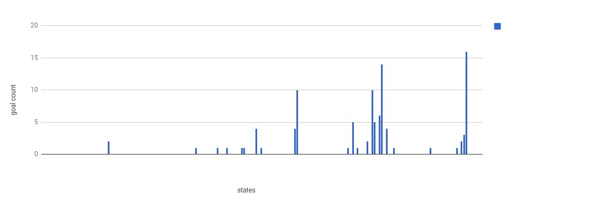
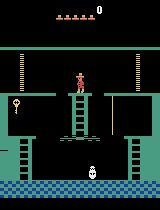
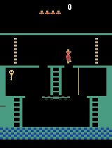
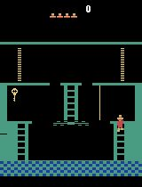
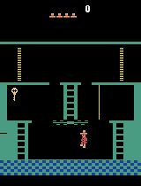
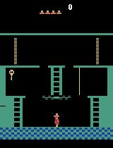
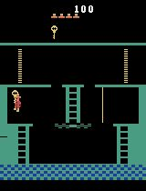

### Page 6

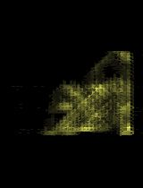
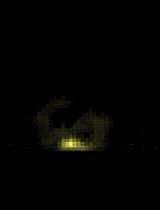
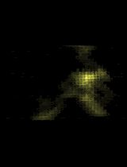
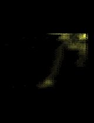
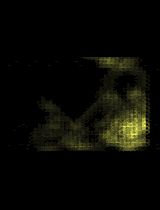
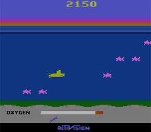
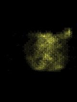

### Page 8

