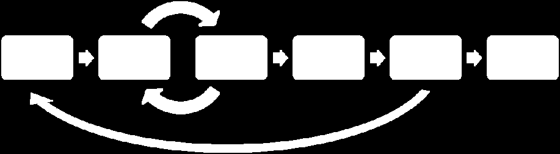
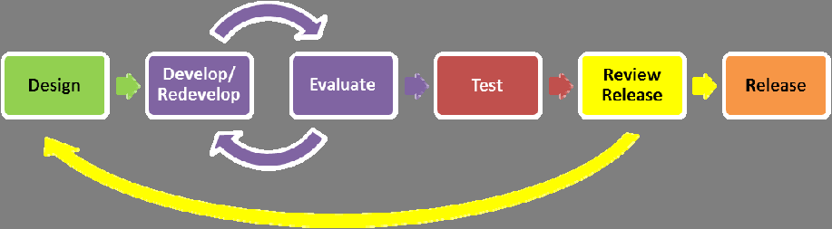
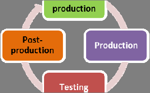
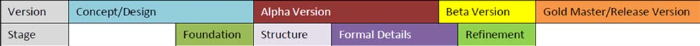
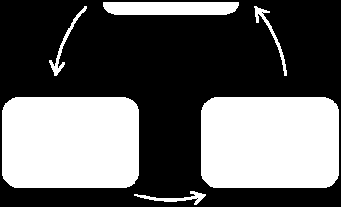
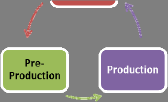

|     |     |     |     |     |     |     |     |     |
| --- | --- | --- | --- | --- | --- | --- | --- | --- |

| ICACSIS | 2013 |     |     |     |     | ISBN: | 978-979-1421-19-5 |     |
| ------- | ---- | --- | --- | --- | --- | ----- | ----------------- | --- |
Game Development Life Cycle Guidelines
Rido Ramadan and Yani Widyani
Data and Software Engineering Research Group
School of Electrical Engineering and Informatics, Institut Teknologi Bandung
Email: rido.ramadan@gmail.com, yani@informatika.org

Abstract— Game is a kind of software with goal  project, published by both independent (indie) game
to provide entertainment. However, during the real  studio and well-known companies. However, there is
no silver bullet, no single GDLC is perfect. There are
game development practice, simply adopting the
| software  | development  | life  | cycle  (SDLC)  | is  not  | three questions arise:   |     |     |     |
| --------- | ------------ | ----- | -------------- | -------- | ------------------------ | --- | --- | --- |
enough, as the developers face several challenges  1. What are the steps and the phases of a game
during its life cycle. To address the problem, game  development process?
development  uses  a  kind  of  specific  approach  2. What are quality criterias that must be considered
called  game  development  life  cycle  (GDLC)  to  during each phase?
direct the game development. However, none of the
|     |     |     |     |     | 3. What  | kind  of  GDLC  which  | can  be  | the  best  |
| --- | --- | --- | --- | --- | -------- | ---------------------- | -------- | ---------- |
existing  GDLCs  explicitly  address  how  to  practice  in  a  proper  game  development  and
| successfully  | deliver  | a  good  | quality  game.  |   This  |     |     |     |     |
| ------------- | -------- | -------- | --------------- | ------- | --- | --- | --- | --- |
deliver a good quality product?
paper presents a new game development life cycle
The goal of this research is to propose a new GDLC
model and guidelines to successfully deliver a good
and the guidelines. The guidelines itself is used to
| quality  | game.  Several  |     | quality  criterias  | are  |           |                         |       |      |
| -------- | --------------- | --- | ------------------- | ---- | --------- | ----------------------- | ----- | ---- |
|          |                 |     |                     |      | properly  | conduct  the  proposed  | GDLC  | and  |
explicitly considered at each phase.
successfully deliver a good quality game.
I.  INTRODUCTION
II.  TERM AND DEFINITION
THE birth of video games has slowly shifted the
| meaning of traditional games into a digitalized  |     |     |     |     | A.  Video Games  |     |     |     |
| ------------------------------------------------ | --- | --- | --- | --- | ---------------- | --- | --- | --- |
multimedia games. The term of games refer to the  Video games, or simply called games in this paper,
meaning of video games. Nowadays, games can be
is a type of play activity, conducted in the context of a
played  in  almost  any  device,  and  that  is  why  pretended reality, in which the participant(s) try to
developing games can be a profitable industry. To
achieve a pre-determined goal and mediated in a form
| support  | the  growth  | of  gaming  | industry,  | several  | of digital media [4].  |     |     |     |
| -------- | ------------ | ----------- | ---------- | -------- | ---------------------- | --- | --- | --- |
original  equipment  manufacturer  (OEM)  publicly  To play a game, one must played it on a proper
distribute their software development kit (SDK) and
platform. Gaming platform can be categorized into
application  programming  interface  (API)  to  attract  three types: console, mobile, and cross-platform. Each
people to become “indie developer” [1].
|     |     |     |     |     | platform  has  | different  characteristics  | and  | SDK  |
| --- | --- | --- | --- | --- | -------------- | --------------------------- | ---- | ---- |
According to Pressman, game is a kind of software  distribution  method.  Console  SDK  has  closed
| which  provides  | entertainment  |     | [2].  However,  | game  |     |     |     |     |
| ---------------- | -------------- | --- | --------------- | ----- | --- | --- | --- | --- |
distribution method, while most of the mobile SDK
| development  | using  | only  software  | development  | life  |                      |                    |       |          |
| ------------ | ------ | --------------- | ------------ | ----- | -------------------- | ------------------ | ----- | -------- |
|              |        |                 |              |       | can  be  downloaded  | freely,  although  | with  | several  |
cycle (SDLC) faces several challenges [3][4]. While  constraints. That’s why mobile games development
| SDLC  is  | a  systematical  | process  | of  engineering  | to  |     |     |     |     |
| --------- | ---------------- | -------- | ---------------- | --- | --- | --- | --- | --- |
has become increasingly more popular [1].
develop software [2], game is not purely a product of
B.  Software Development Life Cycle
pure engineering. Game also is not just pure art, a
creation of creativity and imaginative thinking, but  Software  development  life  cycle  (SDLC),  also
game  is  more  like  a  craft,  created  from  the  known as software process models, is a development
combination  of  interleaving,  multidiscipline  aspect,  strategy that encompasses the process, methods, and
from  art,  music,  programming,  acting,  and  the  tools which is used to do the software development
management and integration of those aspects [3][5].  [2][6]. The typical SDLC phases are shown in Fig. 1.
| Therefore,  | a  game  | development  | requires  | specific  |     |     |     |     |
| ----------- | -------- | ------------ | --------- | --------- | --- | --- | --- | --- |
guidelines which govern its development process, the
game development lifecycle (GDLC).

The  GDLC  in  question  appears  in  many  forms.  Fig. 1.  Typical software development life cycle.
| There are many practices on how a GDLC applied in  |     |     |     |     |     |     |     |     |
| -------------------------------------------------- | --- | --- | --- | --- | --- | --- | --- | --- |
Analysis is related in gathering and measuring the

user requirements to create the software requirement

| /13/$13.00 ©2013 IEEE |     |     |     |     | 95  |     |     |     |
| --------------------- | --- | --- | --- | --- | --- | --- | --- | --- |

| ICACSIS | 2013 |     |     |     |     |     |     |     |     | ISBN: 978-979-1421-19-5 |     |
| ------- | ---- | --- | --- | --- | --- | --- | --- | --- | --- | ----------------------- | --- |
specifications. In design phase those requirements are  TABLE I
RELATIONSHIP BETWEEN PROTOTYPE STAGE AND QUALITY
| translated  | into  | more  | detailed  | models  | and  software  |     |     |     |     |     |     |
| ----------- | ----- | ----- | --------- | ------- | -------------- | --- | --- | --- | --- | --- | --- |
CRITERIA
modules representation. During code generation or
|     |     |     |     |     |     |     |     |     |  lanoitcnuF |  yllanretnI  etelpmoC  decnalaB |  elbisseccA |
| --- | --- | --- | --- | --- | --- | --- | --- | --- | ----------- | ------------------------------- | ----------- |
implementation, the models are translated into source
|            |             |     |               |                  |     |     | Prototype  |     |     |     |  nuF |
| ---------- | ----------- | --- | ------------- | ---------------- | --- | --- | ---------- | --- | --- | --- | ---- |
| code  and  | executable  |     | application.  | Finally testing  |     | is  |            |     |     |     |      |
Stage
conducted to ensure that all elements work properly
and meet the specification.
|     |     |     |     |     |     |     | Foundations  |     |     |     | (cid:57)    |
| --- | --- | --- | --- | --- | --- | --- | ------------ | --- | --- | --- | ----------- |
C.  Game Prototype Usability Quality Criteria  Structure  (cid:57)      (cid:57)
| In this research, the criteria used to assess the game  |     |     |     |     |     |     | Formal  |     |           |                     |     |
| ------------------------------------------------------- | --- | --- | --- | --- | --- | --- | ------- | --- | --------- | ------------------- | --- |
|                                                         |     |     |     |     |     |     |         |     | (cid:57)  | (cid:57)  (cid:57)  |     |
Details
| quality  | is  based  | on  | Fullerton’s  | game  | prototype  |     |             |     |     |     |                     |
| -------- | ---------- | --- | ------------ | ----- | ---------- | --- | ----------- | --- | --- | --- | ------------------- |
|          |            |     |              |       |            |     | Refinement  |     |     |     | (cid:57)  (cid:57)  |
usability quality criteria[7]. Prototype is categorized
into  four  prototype  stages  in  which  each  stage  is  A.  Blitz Games Studios GDLC
related to quality criteria shown in Table I.   Blitz Games Studios [9] defines  six steps of their
Four prototype stages are:  (1) Foundations, that is
GDLC. Those steps are shown in Fig. 2.
| the  most  | basic  | prototype  |     | which  represents  |     | the  |     |     |     |     |     |
| ---------- | ------ | ---------- | --- | ------------------ | --- | ---- | --- | --- | --- | --- | --- |
gameplay basic concepts in the form of either low
fidelity prototype or incomplete game; (2) Structure,

that is a refined version of foundations which already
Fig. 2.  Blitz Games Studios GDLC consists of 7 phases.
has the core gameplay logic, mechanics, and game

rules; (3) Formal details, the refinement of structure
A game development is started from pitch (1) to
that includes necessary rules and procedures to make
create the initial design and game concept. After the
the game fully functional; and (4) Refinement, the
|     |     |     |     |     |     |     | concept  | is  made,  | it  is  | refined  through  | the  pre- |
| --- | --- | --- | --- | --- | --- | --- | -------- | ---------- | ------- | ----------------- | --------- |
refined and almost finished game.
production (2), in which the game design, concept
Each stages related to quality criterias. Functional
|     |     |     |     |     |     |     | art,  and  | the  game  | design  | document  | is  made.  The  |
| --- | --- | --- | --- | --- | --- | --- | ---------- | ---------- | ------- | --------- | --------------- |
means the game’s feature is playable and operating
well. Functional is tested via the accomplishment of  realization of the concept is done through the main
production (3) process. Through a lengthy process of
each playtest scenario. Internally complete indicates
all rules, branches, and conditions has been properly  main production, the game build then is tested by
addressed. It is tested via observation of inexistencies  internal team members, called alpha (4) testing. When
the build has satisfied the needs of alpha testing, a
| of  three  | types  | of  errors  | during  | playtest.  | Balanced  |     |     |     |     |     |     |
| ---------- | ------ | ----------- | ------- | ---------- | --------- | --- | --- | --- | --- | --- | --- |
indicates the game’s difficulty is just fit, not too hard  next phase testing called beta (5) testing is conducted
and not too easy. Balanced is tested via discussion or  to the third party tester. The game is launched in
| questionnaire  |      | about  the  | game  | difficulty  | and            | game  | master (6) phase.  |     |     |     |     |
| -------------- | ---- | ----------- | ----- | ----------- | -------------- | ----- | ------------------ | --- | --- | --- | --- |
| progression.   | Fun  | means       | the   | game        | is  engaging,  |       |                    |     |     |     |     |
B.  Arnold Hendrick’s GDLC
| entertaining,  | challenging,  |     | and  | makes  | player  | keeps  |     |     |     |     |     |
| -------------- | ------------- | --- | ---- | ------ | ------- | ------ | --- | --- | --- | --- | --- |
coming and coming. Fun is very subjective, therefore  Arnold  Hendrick  [8]  defines  five  steps  of
it is tested via questionnaire or direct feedback from  developing a game, shown in Fig. 3.
| players.     | Accessible  | means       |        | the  game       | is  easy  | to      |     |     |     |     |     |
| ------------ | ----------- | ----------- | ------ | --------------- | --------- | ------- | --- | --- | --- | --- | --- |
| understand,  | easy        | to          | learn  | and  intuitive  | enough.   |         |     |     |     |     |     |
| Accessible   | can         | be  tested  | by     | observing       | the       | player  |     |     |     |     |     |
capability to navigate and grasp the control of the
game and the time needed to learn the user interface.  Fig. 3.  Arnold Hendrick's GDLC consists of 5 phases.

Starting point of creating a game is to create the
III.  RELATED WORKS
initial design, concept arts, and several prototype in
Game  development  life  cycle  (GDLC)  is  a  prototype (1) phase. The next step, pre-production
guideline which encompasses the game development
(2), is to make the documentation in a form of game
process [8]. Several GDLC have been proposed by  design  document. Production  (3)  is related  to  the
different  organization,  but  none  of  them  properly  construction of assets, source code, and the integration
address how to ensure the qualities and successfully
of those aspects. When the build is ready, beta(4)
deliver good quality games. There are four GDLCs  testing is conducted to draw users’ feedback. Live(5)
which become the consideration in developing a new
is when the game has already been pass the testing and
GDLC guidelines.
ready to play.

C.  Doppler Interactive GDLC
|     |     |     |     |     |     |     | Joshua   | McGrath       | [10]  | from  Doppler      | Interactive  |
| --- | --- | --- | --- | --- | --- | --- | -------- | ------------- | ----- | ------------------ | ------------ |
|     |     |     |     |     |     |     | defines  | seven  steps  | in    | game  development  | process.     |
Those steps are shown in Fig. 4.
96

|     |     |     |     |     |     |     |     |     |     |     |     |
| --- | --- | --- | --- | --- | --- | --- | --- | --- | --- | --- | --- |

| ICACSIS | 2013 |     |     |     |          |              |     | ISBN: 978-979-1421-19-5 |       |               |     |
| ------- | ---- | --- | --- | --- | -------- | ------------ | --- | ----------------------- | ----- | ------------- | --- |
|         |      |     |     |     | Doppler  | Interactive  |     | GDLC                    | [10]  | and  Heather  |     |
Chandler’s GDLC [11] are iterative process. However,
|     |     |     |     |     | Doppler      | Interactive  | GDLC    | [10]            | emphasizes  |             | on   |
| --- | --- | --- | --- | --- | ------------ | ------------ | ------- | --------------- | ----------- | ----------- | ---- |
|     |     |     |     |     | engineering  | aspect       | rather  | than            | Heather     | Chandler’s  |      |
|     |     |     |     |     | GDLC         | [11].  Both  | of      | them  includes  |             | internal    | and  |
external testing, though in the latter, internal testing is
|     |     |     |     |     | included  | as  testing  | activity  | rather  | than  | explicitly  |     |
| --- | --- | --- | --- | --- | --------- | ------------ | --------- | ------- | ----- | ----------- | --- |

appear as a development phase.
Fig. 4.  Doppler Interactive GDLC consists of 6 iterative phases.
|     |     |     |     |     | From the four mentioned GDLCs, it can be inferred  |     |     |     |     |     |     |
| --- | --- | --- | --- | --- | -------------------------------------------------- | --- | --- | --- | --- | --- | --- |
This GDLC applies an iterative approach to develop
that the game development process consists of three
a game. Design (1) is related to the creation of game  key activities: (1) Design and prototype: the process
initial design and the game design document. After the
of creating initial game design, game concept, and put
design  is  ready,  start  develop  a  game  engine  for  it into a form of playable prototype, (2) Production:
current game in develop (2) phase, then test it out in  the process of making the source code, creating the
evaluate  (3)  phase.  If  the  build  is  not  satisfying,  assets, and integrating them as one, (3) Testing: the
redevelop (2) it. If it passes the evaluation, advance to  process  of  playtesting,  whether  it  is  conducted  by
test (4) phase to test the game (not just the engine) to  internal team members or third party testers.
The relationship between each GDLC’s phase and
the internal team and doing the bug fixing. After that,
the game is released to the third party in  review  the three key actvities above are shown in Table II.
From the comparison between GDLCs’ activities and
release (5). Repeat the whole process from (1) to (5)
|     |     |     |     |     | SDLC’s  | activities,  | the  | most  prominent  |     | difference  |     |
| --- | --- | --- | --- | --- | ------- | ------------ | ---- | ---------------- | --- | ----------- | --- |
until the game is ready to launch in release (6) phase.
between SDLC and GDLC is the assets management
D.  Heather Chandler’s GDLC  during game design and production phase. Haddad &
|     |     |     |     |     | Kanode [3] explain that  |     |     | game is created  |     | from  | the  |
| --- | --- | --- | --- | --- | ------------------------ | --- | --- | ---------------- | --- | ----- | ---- |
Heather Chandler [11] defines the four steps in game
development  process.  The  corresponding  steps  is  synergy of multidiscipline aspects, one of them is the
called the production cycle and can be seen in Fig. 5.  creative aspect. What makes assets significant is the
|     |     |     |     |     | fact  that  | software  | emphasizes  |     | functionality,  |     | game  |
| --- | --- | --- | --- | --- | ----------- | --------- | ----------- | --- | --------------- | --- | ----- |
emphasizes both functionality and user engagement.

TABLE II
GAME DEVELOPMENT KEY ACTIVITIES
|     |     |     |     |     | Linear GDLC  |            |     | Iterative GDLC   |           |          |     |
| --- | --- | --- | --- | --- | ------------ | ---------- | --- | ---------------- | --------- | -------- | --- |
|     |     |     |     |     | Blitz Games  | Arnold     |     | Doopler          | Heather   | Generic  |     |
|     |     |     |     |     | Studios      | Hendrick   |     | Interactive      | Chandler  | Phase    |     |
|     |     |     |     |     | Pitching     |            |     |                  |           |          |     |
|     |     |     |     |     | Pre-         | Prototype  |     | Design           | Pre-      | Design   | &   |
Fig. 5.  Heather Chandler GDLC consists of 4 phases in a cycle.  production  Pre- production  Prototype
|     |     |     |     |     |     | production  |     |     |     |     |     |
| --- | --- | --- | --- | --- | --- | ----------- | --- | --- | --- | --- | --- |
A game development consists of several production  Main  Production  Develop/  Production  Production
cycle started from pre-production (1) which defines  production  Redevelop
Evaluate
game design and project planning. After the design
|     |     |     |     |     | Alpha   | Beta   |     | Test  | Testing  | Testing  |     |
| --- | --- | --- | --- | --- | ------- | ------ | --- | ----- | -------- | -------- | --- |
and plan has been fixed and approved, it is time move
|     |     |     |     |     | Beta   |     |     | Review  |     |     |     |
| --- | --- | --- | --- | --- | ------ | --- | --- | ------- | --- | --- | --- |
into  action  to  production  (2)  which  is  related  to  release
creation of both technical and artistic aspects. Then,  Master  Live  Release  Post-
test (3) the game and fix the bugs. When a build is  production

| considered  | finished  | for  a  single  | cycle,  | post- |     |     |     |     |     |     |     |
| ----------- | --------- | --------------- | ------- | ----- | --- | --- | --- | --- | --- | --- | --- |
production (4) is conducted to deliver the current  In order to properly handle the game quality, each
prototype stage should be addressed in the appropriate
documentation and post-mortem activities.
development phases. Prototype stages span from the
|     |     |     |     |     | beginning  | up  | to  near  | the  completion  |     | of  | game  |
| --- | --- | --- | --- | --- | ---------- | --- | --------- | ---------------- | --- | --- | ----- |
IV.  ANALYSIS ON GDLCS
development. The relationship between development
Each  GDLC  has  different  characteristics  and  timeline and prototype stages are shown in Fig. 6.
| several pros and cons. Blitz Games Studios GDLC [9]  |             |         |             |           |     |     |     |     |     |     |     |
| ---------------------------------------------------- | ----------- | ------- | ----------- | --------- | --- | --- | --- | --- | --- | --- | --- |
| and  Arnold                                          | Hendrick’s  | GDLC    | [6]  apply  |   linear  |     |     |     |     |     |     |     |
|                                                      |             |         |             |           |     |     |     |     |     |     |     |
approach in games development. However, the former
Timeline
is more complete since it includes internal (alpha) and
|     |     |     |     |     |     | :  Foundations  |     |     :  | Formal Details  |     |     |
| --- | --- | --- | --- | --- | --- | --------------- | --- | ------ | --------------- | --- | --- |
external (beta) testing. The trade-off is Blitz Games

Studios GDLC [9] takes a longer phase than Arnold
|                       |     |     |     |     |     | :  Structure  |     |     :  | Refinement  |     |     |
| --------------------- | --- | --- | --- | --- | --- | ------------- | --- | ------ | ----------- | --- | --- |
| Hendrick’s GDLC [8].  |     |     |     |     |     |               |     |        |             |     |     |
Fig. 6. Game development timeline and prototype stages
97

ICACSIS 2013 ISBN: 978-979-1421-19-5
Production Cycle
Fig. 7. The Proposed GDLC model. It consists of 6 development phases. Production cycle consists of Pre-production, Production, and
Testing.
Foundation, the first prototype, is related to fun
V. THE PROPOSED GDLC quality criteria. Foundation is used to show the mock-
up of core gameplay and game capabilities. The fun
The new GDLC is proposed to answer the three
quality criteria in foundation is tested via
research questions: what steps needed to develop a
questionnaire or discussion.
game, what are the quality criteria that must me
Structure, the refinement over Foundation, and
considered during each step, and how to create a good
related to fun and functional quality criteria. The
quality game. The main principles of the newly
main characteristic of structure is showing both the
proposed GDLC are as follows:
core gameplay of the game and its related core
1. The proposed GDLC is developed from the
mechanics such as arithmetic, logic, and game rules.
analysis above and derived from the key
Questionnaire and discussion is used to test the fun
activities in the relevant GDLC phases.
quality criteria. The functional quality criteria is
2. The proposed GDLC applies an iterative
tested via playtesting, where the tester are given some
approach to enable higher degree of flexibility
task and goals to achieve according to the testing
towards changes during game development.
scenario.
3. The proposed GDLC is created to address the
Pre-production ends when the revision or changes of
quality criteria of each prototype stage in order
game design has been approved and documented in
to maintain the quality of the final product.
the GDD.
The proposed GDLC consists of six development
phases is shown in the Fig. 7. C. Production
A. Initiation Production is the core process which revolves
around the assets creation, source codes creation, and
The first step to do in creating a game is to create a
the integration of both elements. The related
rough concept what kind of game that will be created.
prototypes in this phases are formal details and
The output of initation is the game concept and a
refinement.
simple game description.
Formal Details is a refined structure with more
B. Pre-production complete mechanics and assets. The production
activities which are related to the creation and the
Pre-production is one of the first and foremost phase
refinement of formal details are balancing the game
in the production cycle. Pre-production involves the
(related to balanced quality criteria), adding new
creation and the revision of game design and the
features, improving overall perfomance, and fixing the
creation of game prototype. Game design focuses on
bug (related to functional and internally complete
defining game genre, gameplay, mechanics, storyline,
quality criteria). Game balancing means adjustments
characters, challenges, fun factors, technical aspects,
related to game difficulty to make the game’s
and its elements documentation in game design
difficulty fit just right.
document (GDD).
Refinement is a complete prototype which is the
After the GDD has been made, a form of prototype
subject of game polishing. The related quality criteria
is made to assess the game design and the whole idea.
are fun and accessible. The activities during the
In the first iteration of production cycle, the created
refinement are directed to make the game more fun,
prototypes are foundations and structure, while in the
challenging, and easier to understand. Only minor
next iterations, the related prototypes to be refined are
changes allowed in this phase.
formal details and refinement.
98

ICACSIS 2013 ISBN: 978-979-1421-19-5
D. Testing sharing, post-mortems, and planning for maintenance
and game expansion.
Testing in this context means internal testing
conducted to test the game usability and playability.
The testing method is specific to each prototype stage. VI. GAME DEVELOPMENT GUIDELINES
Formal Details Testing are conducted using The proposed GDLC mentioned before are just
playtest to assess the features functionality and the steps taken to create a game. In order to successfully
game difficulty (related to balanced). The method to create and deliver the game, the guidelines are made
test functional quality criteria is via features to accompany the GDLC application. It consists of
playtesting. To test the internally complete quality introduction of game development, role management,
criteria, it can be done via playtesting simultaneously initiation, pre-production, production, testing, beta
with functionality test. When a tester discover bugs, testing, and release [12].
loopholes, or dead-ends during playtesting, the causes Role Management chapter provides explanation,
and scenarios to reproduce the error needed to be importance, and responsibilities of each roles.
documented and analyzed. To test the balanced Initiation chapter provides methods on how to
quality criteria, playtesting with several different generate ideas and game concepts. To help the
treatments is used to categorized whether a treatment ideation of game, the guidelines provides
is too difficult, too easy, or just fine. brainstorming help section in a form of questions.
Refinement Testing are related to fun and Pre-production chapter provides explanation of
accessibility quality criteria. In refinement testing, each game design elements, such as game description,
fun is tested via playtest and direct feedback from characters, storyline, control, features and concept
fellow developers, whether it is boring, frustrating, arts, documentation in form of game design document
challenging, etc. Accessibility can be tested via (GDD), making prototypes and the pre-production
observing the tester behavior. If tester find it difficult phase deliverable checklist. The prototypes made are
to play and understand the game, it means that the evaluated using the methods specified in the
game is not accessible enough. guidelines.
The output of testing is bug report, change request, Production chapter focuses on programming and
and development decision. The result will decide assets creation. The guidelines provides different kind
whether it is time to advance to the next phase (Beta) of assets, method to achieve specified quality criteria,
or reiterate the production cycle. and examples of changes in game archicture. All of
them are compiled in a form of deliverable checklist.
E. Beta
Testing chapter provides testing methods related to
Beta is phase to conduct third-party or external tester
each quality criteria on each prototype stage and
called beta testing. Beta testing still using the same
example of each testing method.
testing methods as the previous testing method, since
Beta chapter explains the importance of beta
the related prototypes in the beta testing are both
testing, beta testing type, and provides the methods,
formal details and refinement. The tester selection
checklist, and questionnaire sample in playtesting.
method comes in two types: closed beta and open
Release chapter explains how to release game
beta. Closed beta is only allow invited individuals to
package, post-production activities, and planning for
be the participant, while open beta allow anyone who
game package.
register become the participant.
The quality criteria in beta are closely related to the
VII. EVALUATION
current prototype stage. In formal details testing, the
testers are demanded to discover the bugs (related to In order to verify the proposed GDLC and its
functional and internally complete quality criteria). guidelines, both of them are used in a game
In refinement testing, the testers are given more development project. The success parameter of this
freedom to enjoy the game, as the goals are more research are the validity of proposed GDLC and the
directed to get the feedback (related to fun and application of this GDLC successfully deliver a good
accessibility quality criteria). quality game [13].
The output of beta testing are bug reports and user The proposed GDLC is applied in a project called
feedbacks. Beta session is closed mainly due to 2 Feline Project, a project to create a mobile game.
reasons, either the beta term ended or the number of Feline Project had lasted for 8 months with so many
specified beta tester has already given their test report. changes occured, either change request for asset style,
From here, it may lead to production cycle again to main feature, or control method. The Feline Project
refine the product or continue to releasing the game if was done in four production cycle [13].
the result is satisfactory. At first iteration, the initiation of Feline Project
produced the game concepts, then it was being refined
F. Release into game design in pre-production phase. The game
It is time when the game build has reach final stage design was translated into Feline GDD and a
and ready to be released to public. Release involves foundation prototype was made. The testing showed
product launching, project documentation, knowledge the curiosity of each team member (related to fun), so
the prototype was refined into structure prototype. The
99

ICACSIS 2013 ISBN: 978-979-1421-19-5
structure prototype had several core features and criteria, which are fun, functional, balanced,
showed the game is both functional and fun, so the internally complete, and accessible. Finally, the
development was continued. During the development application of the proposed GDLC by following our
of formal details, first iteration showed there was two GDLC guidelines has successfully delivered a good
lack of quality achievement, so the second and third quality game.
iteration game design was focused to add To further enchance the result of this research, it is
functionalities and fix the quality lacking. Formal necessary to analyze the relationship between game
details from third iteration passed the internal quality development life cycle and capability maturity models
testing related to balanced, functional, and internally (CMM) [14] so that the process can be measured in a
complete. standard software engineering process measurements.
The build was beta tested to 60 testers, with 5
testers complained about the game progression felt REFERENCES
empty, the rest was good. According to the result,
[1] Skillz, "Not Just Hype: The Rise of Indie Game Developers,"
game balanced was not achieved so the focus of the (2013, March 15). [Online]. Available:
next iteration was to fix it. http://skillz.com/corporate/2013/03/15/not-just-hype-the-rise-
The fourth iteration changes several features related of-indie-game-developers.
[2] R. S. Pressman, Software Engineering: A Practioner
to balanced. The prototype had reached refinement
Approach, 5th ed. (Book style), New York City: John Wiley &
phase, so development also took on making the game Sons, 2001.
more accessible. The second beta testing result to 25 [3] H. M. Haddad and C. M. Kanode, "Software Engineering
testers had shown satisfying result, as all the quality Challenges in Game Development," in Sixth International
Conference on Information Technology: New Generations,
criteria had already been achieved. Through four
2009.
iteration, Feline Project succeeded in producing a [4] F. Petrillo, M. Pimenta dan F. Trindade, “What Went Wrong?
good quality game. A Survey of Problems in Game Development,” in ACM
The application of the proposed GDLC in Feline Computers in Entertainment, vol. 7 no. 1, pp. 13.1-13.22,
2009.
Project showed that it could succesfully create and
[5] E. Adams, Fundamentals of Game Design, 2nd Ed (Book
deliver a good quality mobile game [13]. As for the style), Berkeley: New Riders, 2009.
GDLC validation, the proposed GDLC contains the [6] S. R. Schach, Object-Oriented and Classical Software
key activities defined in section IV, with the mapping Engineering, 6th Ed., New York: McGraw Hill, 2002.
[7] T. Fullerton, Game Design Workshop - A Playcentric
as follows: Pre-production equals to Game Design and
Approach to Creating Innovative Games, 2nd Ed. (Book
Prototype, Production equals to Production, and style), Burlington: Elsevier, 2008.
Testing and Beta Testing equals to Testing [13]. [8] A. Hendrick, "Project Management for Game Development,"
(2009, June 15). [Online]. Available:
http://mmotidbits.com/2009/06/15/project-management-for-
VIII. CONCLUSION AND FUTURE WORKS game-development/.
There are three key phases of game development. [9] Blitz Games Studios, "Project Lifecycle," 2011. [Online].
Available:
They are design and prototype, production, and
http://www.blitzgamesstudios.com/blitz_academy/game_dev/
testing. They combines both engineering process and project_lifecycle.
artistics creational process in term of developing a [10] J. McGrath, "The Game Development Lifecycle - A theory for
game. The combination between engineering and arts the extension of the Agile project methodology," (2011 April
3). [Online]. Available:
is the aspect that a simple software development life
http://blog.dopplerinteractive.com/2011/04/game-
cycle do not consider as a significant thing and development-lifecycle-theory-for.html.
become a challenge in software development. [11] H. M. Chandler, Game Production Handbook (Book style),
The proposed GDLC consist of six phases, they are Sudbury: Jones and Bartletts Publishers, 2010.
[12] R. Ramadan, The Game Development Life Cycle Handbook
Initiation, Pre-production, Production, Testing,
(Unpublished work style), unpublished.
Beta, and Release. The proposed GDLC takes on the [13] R. Ramadan, “Pengembangan Metode Pembangunan Game
iterative approach to enable higher degree of (Thesis style),” Undergraduate thesis, Informatics
flexibility towards changes during the development Engineering, Institut Teknologi Bandung, Bandung, 2013.
[14] Schorsch, T., “The Capability Im-Maturity Model,”
process. In order to deliver a good quality game, the
CrossTalk, (1996, November), Available:
GDLC product is assessed through 5 usability quality http://www.stsc.hill.af.mil/crosstalk/1996/11/xt96d11h.asp.
100

## Extracted Images

### Page 1

### Page 2

### Page 3

### Page 4

