KINETIK, Vol. 3, No. 4, November 2018, Pp. 351-358
ISSN : 2503-2259
E-ISSN : 2503-2267 351
Gamification and GDLC (Game Development Life Cycle)
Application for Designing the Sumbawa Folklore Game ”The
Legend of Tanjung Menangis (Crying Cape)”
Lailatul Husniah*1, Bayu Fajar Pratama 2, Hardianto Wibowo3
1,2,3Universitas Muhammadiyah Malang
husniah@umm.ac.id*1, bayu_437014@webmail.umm.ac.id2, ardi@umm.ac.id3
Abstract
Sumbawa is popularly known as one of the regions in Indonesia, having a well-known
folklore among the Sumbawa people, entitled the legend of Tanjung Menangis (Crying Cape).
However, Tanjung Menangis is commonly recognized for its beauty than the stories contained.
Therefore, a research is carried out by developing a game that is employed as a tool to introduce
the story of Tanjung Menangis Legend as effort to preserve the original story of the mainland
Sumbawa. The media game is chosen due to its favoured technology by children and adolescent
as the target users of this research. This study applies Game Development Life Cycle (GDLC)
method in the development stage which consists of several stages includinng: pre-production,
production, testing, and post-production by adding an element of gamification. The game is tested
on students at Labangka Elementary School in Sumbawa district in an age range of 10-15 years.
After playing the game, the majority of respondents states that students gain knowledge about
the Legend of Tanjung Menangis as reported from the results of the t-test with a probability value
of 7.369x10-41, which is far below the value of α = 0.05. This result means that there was an
increase in user knowledge of application. The test results also showed that all respondents
agreed that the game of The Legend of Tanjung Menangis was used as one of the media used
to introduce the story of the original Sumbawa people. In addition, the testing results as conducted
with playtesting and gameflow test achieved good grades, with a range of values 4.5-4.81 of the
seven elements tested, including: Concentration, Challenge, Player Skills, Control, Clear Goals,
Feedback, and Immersion.
Keywords: The Legend of Tanjung Menangis, Sumbawa, folklore, Gamification and Game
Development Life Cycle
1. Introduction
Indonesia also recognized as an archipelago country country consisting of many islands
and having diverse customs or cultures in each region [1] [2]. One of the notable areas in
Indonesia is Sumbawa which has its own customs and culture. Sumbawa has a Samawa tribe
that has a variety of folklores that are passed down through generations orally [3]. One of the
folktales that experienced growth and development in the midst of the Samawa tribe is a story
about the legend of Tanjung Menangis [3]. Along with the time and technology, Tanjung Menangis
is commonly known by younger generations due to its beautiful beaches compared to the stories
contained.
Efforts to introduce Indonesian culture and tourism through games have been carried out
by several local researchers such as developing the Desktop-based games created to introduce:
the story of Lake Toba origin [2], the Android game "Visit Indonesia" as a learning medium to
introduce Indonesian tourism and culture [ 4], and games about traditional Angklek of Sleman,
Yogyakarta game [5]. In addition to introducing efforts, games can also be maintained as learning
media, triggering several previous studies, such as: a 3D-based Corruption Eradication
Education game by using Unity 3D [6], Analysis of the Effect on Using Educational Games on
Mastery of Foreign Language Vocabulary with Case Study on Arabic Language Education Game
[7], and Math Games as an Effort to Increase Understanding of Mathematics in Elementary
School Students [8].
Games can be defined as a complex activity which has rule, play, and culture [9]. Games
are also one of the types of facilities that can be used to fill leisure time and release fatigue, and
are currently developing not only in the field of entertainment [10]. With current technological
Husniah, L., Pratama, B., & Wibowo, H. (2018). Gamification and GDLC (Game Development Life
C ycle) Application for Designing The Sumbawa Folklore Game ”The Legend of Tanjung Menangis
(Crying Cape)”. Kinetik: Game Technology, Information System, Computer Network, Computing,
Electronics, and Control, 3(4). doi:http://dx.doi.org/10.22219/kinetik.v3i4.721
Receive August 03, 2018; Revise August 16, 2018; Accepted August 20, 2018

352 ISSN: 2503-2259; E-ISSN: 2503-2267
developments, games not only are played on game consoles, but can be played on other devices
such as in smartphones and computers.
Gamification is the integration of elements and game thinking in activities that are not
games [11]. Gamification is also defined as the introduction or application of game elements such
as the elements which create fun feature in the game to be implemented in other areas of life [12].
Gamification primarily aims to improve the user positive motivation for activities given or the use
of technology, and thus, increase the quantity and quality of output from the activities provided
[13]. The game has several distinctive features that play key roles in gamification, including: users,
challenges / tasks, points, levels, badges, and user ratings or levels [11]. Users are identified as
all participants such as employees or clients in the corporate environment and students in
educational institutions. Challenges / tasks are efforts carried out by the user and are progressed
towards the specified goals (by carrying out the tasks or challenges given, the user gets
accumulated points as a result of carrying out the task). Points will determine the level passed by
the user as marked by a badge as a reward for completing the action and will decide the user
ranking based on the user achievement. Gamification in a game allows the game to be fun to
play. Players will be rewarded when successfully carrying out activities or by passing an obstacle
in the game. It impacts on increasing interest and feedback from players in the game.
In an effort to provide knowledge for children in a fun way, the game is applied as one of
the media to provide knowledge by using gamification related to the legend of Tanjung Menangis.
The purpose of this study is to develop a game which engages the original story of Sumbawa
people by using the unity 3D game engine as a media to introduce storyof Tanjung Menangis
Legend.
2. Research Method
The Game Development Life Cycle (GDLC) as defined by Heather Chandler was chosen
as the method of developing the game of Tanjung Menangis Legend. The GDLC method offered
by Heather Chandler is considered as the most suitable approach in this study, due to its simple
steps which suit to the conditions and objectives of the study. There are several steps taken,
which include: pre-production, production, testing, and post-production as depicted in Figure 1
[14] [15]. This study applies one development cycle.
pre-
production
post-
production
production
testing
Figure 1. Stages in Game Development
2.1 Pre-Production
The pre-production stage is conducted to define game design and project planning such as
the game concept which includes: game titles, game genres, target markets; as well as
gamification stages including: game mechanics and aesthetics. The game of Sumbawa Folklore
entitled “Tanjung Menangis Legend" is developed with the Adventure game genre, in which the
target market is 10-15 years olds.
Game Mechanics in this game consist of: Points, Badges, Challenges / Quests, Constraints
and levels. Points are obtained through the completion of each level in each chapter. Each chapter
has a different way of achieving points. There are 3 chapters designed, including: for chapter 1,
a player can get points by attacking the enemy (if a player gets an attack value above 0, he will
get 1 point, if the attack value is equal to 0, the value obtained is 0); for chapter 2, a player gets
the point through the percentage of correct amount; and lastly for chapter 3, a player gets points
by collecting stars found in the game. The position of the star is designed to be unseen by the
user by a black object application as a cover. Badges in this game are designed as the form of
achievements that players will get when they successfully solve the existed challenges as
KINETIK Vol. 3, No. 4, November 2018: 351-358

KINETIK ISSN: 2503-2259; E-ISSN: 2503-2267 353
presented in the scene achievement (Table 1). Challenges / Quests in this game are actualized
in the form of challenges in each chapter, in which: chapter 1, in the form of monsters and
criminals; chapter 2, in the forms of time continuing to progress; and chapter 3, in the forms of a
trap and monster. Difficulties will increase as player level increases. Constraint is designed to
stop the player to continue to the next level or chapter before the player completes the challenge
found at the ongoing level. Levels are in the form of visualization to show the progress of a player.
Levels in the game are separated into 3 chapters having 3 levels for each chapter. Overall, there
are 9 levels in all games.
Table 1. Achievement and Rewards
Appreciation Condition and terms
Chapter 1 Badges Complete chapter 1
Chapter 2 Badges Complete chapter 2
Chapter 3 Badges Complete chapter 3
Gold Badges Get values above 90 for each level in chapter 1 and 2, in chapter 3 by
getting 3 items. (winning condition)
Silver Badges Get a value between 80 and 90 in winning conditions in chapter 1 and 2,
in chapter 3 collect 2 items.
Bronze Badges Get a value below 80 in chapter 1 and 2 in a winning condition, or get 1
item in chapter 3.
Adventure Badges Complete games.
Game Aesthetics is intended to create personal and emotional elements from gamification
and is described as the desired emotional response arising from the user, when interacting with
the game system [12], [16]. This game is designed to have two of the eight components of
aesthetics as stated by Hunicke, LeBlanc and Zubek, which are: sensation and challenge.
Sensation means that game as a sense of pleasure for the senses to generate emotions from
players as created through visual, audio and touch manipulation. Therefore, each chapter in this
game has a different background design as illustrated in Figure 2. The game has audio which is
slightly made differently in background music for each chapter. Meanwhile, touch is designed in
the form of menus in: control options, game controls, and sound control settings that become
interactions between players and games.
Figure2. Sequentially from Left to Right is the Background Design in Chapter 1, 2, and 3
Figure3. Sequentially from Left to Right on Line 1 is the Design of NPC Monsters and Criminals
in Chapter 1 and the Time Bomb in Chapter 2 While Row 2 is the Design of NPC Sharks in
Chapter 2, and the Design of Traps and Monsters in Chapter 3
Gamification and GDLC (Game Development Life Cycle) Application for…
Lailatul Husniah, Bayu Fajar Pratama, Hardianto Wibowo

354 ISSN: 2503-2259; E-ISSN: 2503-2267
Challenge is actualized by adding obstacles or challenges in the form of NPC monsters,
sharks and criminals and in other forms such as time bombs and traps that are designed
differently for each chapter. Challenges or constraints are made for users to feel a satisfaction
when they can pass or resolve obstacles and challenges that exist. On the other hand, obstacles
or challenges can train players to face obstacles or challenges to continuously survive. NPC
monsters, sharks, baddies, time bombs and traps are illustrated in Figure 3.
2.2 Production
Production plays as a core process related to the creation of technical and artistic aspects
which implement concept, design, and contained plan in Game Design Document (GDD) that has
been made thoroughly in the game. Creation of assets, creation of source code, and integration
of both elements are carried out at this stage [14]. Figure 4 demonstrates an example of the
implementation of the main menu and achievement design. Further, the implementation of the
chapter design and level menu are presented in Figure 5. The chapter menu has 3 main buttons
which are used to move the menu level in each chapter.
Figure 4. Sequentially from Left to Right sre Examples of the Implementation of the Main Menu
and Achievement Design
Figure 5. Sequentially from Left to Right are Examples of Implementing Designs for
Chapters and Level Menu
Figure 6 is the implementation of the challenge that has been designed and planned at the
pre-production stage. Players will fight monsters with random numbers when firstly opening
chapter 1. In chapter 2, the player will display a colorful button and the direction of the arrow with
the color corresponding to one of the buttons. At the top of the menu, information about the
number of correct and wrong players is provided in this game. There are several conditions related
to the number of right and wrong players, which are marked with: if the button and direction of the
arrow have the same color and the arrow leads to the button, the user may not press the button,
but must draw the direction of the arrow towards the same color button to get the correct value;
however, if the direction of the arrow is in the opposite direction, then the user may not press or
draw the direction of the arrow, but must press the same color button as the arrow. The point is,
the correct amount will increase when the user presses the button according to the color of the
arrow direction and the boat object. NPC shark will move when the user selects the wrong button
that will stop the boat and move the NPC shark towards the boat.
Gameplay in chapter 3 is in black arena colour moving towards the target which is always
in the lower right position. The user must go to the target by passing the black arena by using 4
control buttons, which are: left, right, up, and down. Several traps and monsters appear in the
black arena; if caught in a trap then healt points are reduced and if hit by a monster, the monster
must be defeated by playing paper rock scissors. The user can continue to move towards the
KINETIK Vol. 3, No. 4, November 2018: 351-358

KINETIK ISSN: 2503-2259; E-ISSN: 2503-2267 355
target after successfully passing the existing obstacles and the game ends when the user fails
through obstacles. The implementation of the design in chapter 3 is illustrated in Figure 7.
Figure 6. Sequentially from the Left to Right is the Design Implementation of Chapter 1 and 2
Figure 7. Chapter 3 Design Implementation
The story of Tanjung Menangis Legend is conveyed through the game flow by adding a
prologue to each chapter and story at the end of the game (epilogue) to perfectly end the story.
The stories are packaged in the form of simple animations to engage the player understanding
with the storyline and the legend of Tanjung Menangis entirely while playing the game. Especially,
for the game final story, users are required to press the right arrow button until it reaches a certain
point. The implementation of the design for prologue and epilogue stories is demonstrated in
Figure 8.
Figure 8. Example of Several Scenes for Prologue and Epilog Animation in the Legend of
Tanjung Menangis Game
2.3 Testing
Testing is performed when a game development is accomplished for one cycle [14]. Testing
in this context is done to test the usefulness of the game and to assess the feature functionality
and difficulty of the game related to balance. The method used to test the usefulness of the game
Gamification and GDLC (Game Development Life Cycle) Application for…
Lailatul Husniah, Bayu Fajar Pratama, Hardianto Wibowo

|            |     |     |     |     |          |
| ---------- | --- | --- | --- | --- | -------- |
ISSN: 2503-2259; E-ISSN: 2503-2267
356
and to assess the functionality of the features and the difficulty of the game can be conducted
through playtesting along with test functions and gameflow tests. When a tester finds a bug, gap,
or game that suddenly ends during playtesting, it is necessary to record the cause and the taken
scenario  to reproduce  the  game.  The  test  scenario is  made  for users  to  play games  on
smartphones and to collect feedback about several aspects contained in the game such as
graphics or game views, gameplay, story and game control, adjusted to playtesting criteria and
gameflow test (such as concentration, challenge, player skills, control, clear goals, feedback, and
immersion) [17] [18]. Testing is carried out on 30 respondents ranging in age from 10 to 15 in
Labangka District Elementary School, Sumbawa Regency. The results of testing is presented in
Table 2.

Table 2. Playtesting and Gameflow Test Result
| Element  |     | Criteria  | 0  1  2  3  | 4  5  | Value  |
| -------- | --- | --------- | ----------- | ----- | ------ |
Players don't feel burdened by unimportant
|     |     |     | 0  0  0  0  | 30  0  | 5   |
| --- | --- | --- | ----------- | ------ | --- |
tasks.
The game can quickly attract the attention
Concentration
of players and keep it focused throughout  0  0  0  8  22  0  4.7
the game.
|     |     |     |         |     | 4.87  |
| --- | --- | --- | ------- | --- | ----- |
The game provides a different level of
|     |     |     | 0  0  0  12  | 18  0  | 4.6  |
| --- | --- | --- | ------------ | ------ | ---- |
challenge
The level of challenge increases as the
|             |                                   |     | 0  0  0  9  | 21  0  | 4.7  |
| ----------- | --------------------------------- | --- | ----------- | ------ | ---- |
| Challenges  | ability of the player progresses  |     |             |        |      |
The game provides new challenges for the
|     |     |     | 0  0  0  8  | 22  0  | 4.7  |
| --- | --- | --- | ----------- | ------ | ---- |
next chapter
|     |     |     |         |     | 4.68  |
| --- | --- | --- | ------- | --- | ----- |
Players are taught to play through a short
|     |     |     | 0  0  0  1  | 29  0  | 4.96  |
| --- | --- | --- | ----------- | ------ | ----- |
tutorial at the beginning of the game
The game can improve the ability of
|     |     |     | 0  0  0  8  | 22  0  | 4.7  |
| --- | --- | --- | ----------- | ------ | ---- |
players as the game progresses
| Player Skills  | The player gets the right reply for the effort  |     |             |        |      |
| -------------- | ----------------------------------------------- | --- | ----------- | ------ | ---- |
|                |                                                 |     | 0  0  0  8  | 22  0  | 4.7  |
and development of his abilities
The game interfaces and rules are easy to
|     |     |     | 0  0  0  1  | 29  0  | 4.96  |
| --- | --- | --- | ----------- | ------ | ----- |
learn and use
|     |     |     |         |     | 4.85  |
| --- | --- | --- | ------- | --- | ----- |
Players can feel control of the interaction
|     |     |     | 0  0  0  3  | 27  0  | 4.9  |
| --- | --- | --- | ----------- | ------ | ---- |
units in the game
Players can feel control over the game
|          |            |     | 0  0  0  8  | 22  0  | 4.7  |
| -------- | ---------- | --- | ----------- | ------ | ---- |
| Control  | interface  |     |             |        |      |
Players can feel control and influence of
|     |     |     | 0  0  0  9  | 21  0  | 4.7  |
| --- | --- | --- | ----------- | ------ | ---- |
their actions in the game
|     |     |     |         |     | 4.78  |
| --- | --- | --- | ------- | --- | ----- |
The main purpose of the game is easy to
|     |     |     | 0  0  0  1  | 29  0  | 4.96  |
| --- | --- | --- | ----------- | ------ | ----- |
understand
| Clear Goals  | Game side goals can be clearly  |     |              |        |       |
| ------------ | ------------------------------- | --- | ------------ | ------ | ----- |
|              |                                 |     | 0  0  0  10  | 20  0  | 4.66  |
understood
|     |     |     |         |     | 4.82  |
| --- | --- | --- | ------- | --- | ----- |
Players always know their status and score  0  0  0  1  29  0  4.96
Feedback  Players receive feedback for their actions  0  0  3  11  16  0  4.43
|     |     |     |         |     | 4.70  |
| --- | --- | --- | ------- | --- | ----- |
Players feel that time is running fast when
|     |     |     | 0  0  0  0  | 30  0  | 5   |
| --- | --- | --- | ----------- | ------ | --- |
playing games
Players engage in games emotionally  0  0  0  1  29  0  4.96
Immersion
Players become less aware of the
|     |     |     | 0  0  0  1  | 29  0  | 4.96  |
| --- | --- | --- | ----------- | ------ | ----- |
surrounding environment
|     |     |          |         |     | 4.98  |
| --- | --- | -------- | ------- | --- | ----- |
|     |     | Overall  |         |     | 4.81  |
0 – N/A, 1 – not at all, 2 – below average, 3 – average, 4 – above average, 5 – well done
KINETIK Vol. 3, No. 4, November 2018: 351-358

KINETIK ISSN: 2503-2259; E-ISSN: 2503-2267 357
Playtesting and Gameflow Test Result
Graphic
5.10 4.98
5.00 4.87 4.85
4.90 4.78 4.82
4.80 4.68 4.70
4.70
4.60
4.50
.
Figure 9. Playtesting and Gameflow Test Result Graphic
2.4 Post-Production
Post-production is carried out to present current documentation and post-mortem activities
[14]. The main post-production goals are to create a closing device and to complete a postmortem
[15]. Post-production in this research is done by filing related assets and game documents for the
development of the next game.
3. Results and Discussion
The result of this study is the creation of a game to introduce the Legend of Tanjung
Menangis story. The results of playtesting and gameflow test for each element present various
values and achieve good results for the average of all elements (Figure 9). During the trial, the
game can run well presenting no bugs. In addition to a number of questions related to the criteria
of gameflow test, there are also several questions given to the same respondents through
questionnaires before and after playing the game. This is performed to compare the level of
knowledge obtained by respondents or users [19] [7] [20] [4]. The results of the answers are then
counted from the number of "yes" answers before and after playing the game, then t-test is done
based on the results of the answers. The test results of the t-test show a probability value of
7.369x10-41 which is far below the value of α = 0.05, which means there is an increase in user
knowledge of application as demonstrated in Table 3. This research result is in line with the results
of questionnaire on the user opinion agreeing that the Legend of Tanjung Menangis game can be
applied as a medium to introduce the story of "Tanjung Menangis Legend" as shown in Table 4.
Table 3. Test Results of User Knowledge Testing Before and After Playing "The Legend of
Tanjung Menangis" Game
Before After
Questions
Yes No Yes No
Can you mention the name of Sumbawa royal princess? 0 30 30 0
Can you mention what name that heals princess? 0 30 30 0
Do you know the origin of the water used to cure the princess? 0 30 30 0
Can you tell a story about the legend of Tanjung Meanngis? 0 30 29 1
Table 4. Evaluation Result on the Feasibility of Game as a Media to Introduce the Legend of
Tanjung Menangis story
Question Yes No
Do you agree if the The Legend of Tanjung Menangis game becomes one of the 30 0
media to preserve that legend story?
4. Conclusion
This research has produced a game that raises the The Legend of Tanjung Menangis story
by using the unity 3D game engine. The GDLC method can be properly implemented by
incorporating gamification elements for the development of the game. The test results as
conducted with playtesting and gameflow present that respondents provide feedback to the
Gamification and GDLC (Game Development Life Cycle) Application for…
Lailatul Husniah, Bayu Fajar Pratama, Hardianto Wibowo

358 ISSN: 2503-2259; E-ISSN: 2503-2267
Legend of Tanjung Menangis game with good value, with a range of value from 4.5-4.81 out of 7
tested elements, including: Concentration, Challenge, Player Skills, Control, Clear Goals,
Feedback, and Immersion. Based on the tests, it is apparent that all respondents have less
knowledge or even ever hear the legend of Tanjung Menangis before. After playing the game, the
majority of respondents state that they gain knowledge about the legend of Tanjung Menangis
story as presented in the results of the t-test (with a probability value of 7.369x10-41, which is far
below the value of α = 0.05), meaning that there is an increase in user knowledge of application.
All respondents agree that The Legend of Tanjung Menangis game deserves to be used as one
of the media to introduce the original story of the Sumbawa community.
References
[1] Buyut, K. Manglayang, J. Buyut, and K. Palasara, "Analysis of the Legend of Dewi Bungur
Sari, Jawara Paledang Opat, and Buyut Kutan Manglayang Kunta Palasara Jeung Buyut in
Ujuberung Bandung Community (Structure, Story Context, Creation Process, and
Function)," 2009.
[2] I. E. Sulistya and F. Maspiyanti, " Desktop-based Game of The Legend of Origin of Lake
Toba," Journal TAM (Technology Acceptance Model), Vol. 9, No. 2, Pp. 30–35, 2018.
[3] Pragmatic Value and its Relevance, " The Legend of Crying Cape: People's Receptions,
Pragmatic Values, and Their Relevance to the Development of Literary Teaching Materials,"
2002.
[4] U. Fatimah, "Analysis and Design of Android Games 'Visit Indonesia' as a Learning Media
to Introduce Tourism and Indonesian Culture," Yogyakarta, 2014.
[5] H. A. F. Puji Handayani Putri, and M. Suyanto, "Designing a Game Design Document of
Serious Game on Traditional Engkel Sleman in Yogyakarta Games," in the National Seminar
on Informatics 2015, 2015, Pp. 1–7.
[6] R. N. Cahyar, “Making 3D Eradication of Corruptor Education Games Using Unity 3D,”
Surakarta, 2015.
[7] M. S. Khairy, D. Herumurti, and I. Kuswardayan, “Analysis of the Effect of Using Educational
Games on Mastery of Foreign Language Vocabulary with Case Study of Arabic Language
Educational Games,” Khazanah Informatika, Vol. Ii, No. 2, Pp. 42–48, 2016.
[8] D. H. Dwi Krisbiantoro, “Math Games As An Effort to Increase Understanding of Mathematics
in Primary School Students,” Jurnal Telematika, Vol. 10, No. 2, Pp. 1–11.
[9] Wahyu Pratama, “Adventure Game on Pandora's Box Mystery,” Jurnal Telematika, Vol. 7,
No. 2, Pp. 13–31, 2014.
[10] M. S. Khairy, D. Herumurti, and I. Kuswardayan, “Analysis of the Effect of Using Educational
Games on Mastery of Foreign Language Vocabulary with Case Study on Arabic Language
Educational Games,” Vol. II, No. 2, Pp. 42–48, 2016.
[11] G. Kiryakova, N. Angelova, and L. Yordanova, “Gamifcation in Education,” 2013.
[12] E. Farquhar Buzzard, “Gamification and The Future of Education,” 2016.
[13] B. Morschheuser, K. Werder, J. Hamari, and J. Abe, “How to Gamify? A Method for
Designing Gamification,” Hawaii International International Conference on Systems Science
(HICSS 2017), Pp. 1298–1307, 2017.
[14] Y. W. Rido Ramadan, “Game Development Life Cycle Guidelines,” in International
Conference on Advanced Computer Science and Information Systems, 2013.
[15] P. Nguyen, “Game Production and Role of Game Producer,” SAVONIA UNIVERSITY, 2014.
[16] R. Hunicke, M. LeBlanc, and R. Zubek, “MDA: A Formal Approach to Game Design and
Game Research,” Work. Challenges Game AI, Pp. 1–4, 2004.
[17] P. Sweetser and P. Wyeth, “GameFlow: A Model for Evaluating Player Enjoyment in
Games,” Vol. 3, No. 3, Pp. 1–24, 2005.
[18] T. Fullerton, "Game Design Workshop: A Playcentric Approach to Creating Innovative
Games," Second Ed. Morgan Kaufmann, 2008.
[19] I. Effendy, “The Effect of Pre-test and Post-test on Learning Outcomes of the Education and
Training Field of HDW.DEV.100.2.A in Students of State Vocational High School 2 Lubuk
Basung," VOLT-Journal of Science. Educator. Electrical Engineering, Vol. 1, No. 2, 2016.
[20] M. B. Nendya, S. Gandang, and R. G. Santosa, "Mapping Non-Playable Character Behavior
in Role Playing Game Based by Using the Finite State Machine Method,” Electronics and
Industrial Engineering Journal, Vol. 1, No. 2, Pp. 185–202, 2015.
KINETIK Vol. 3, No. 4, November 2018: 351-358

## Extracted Images

### Page 3

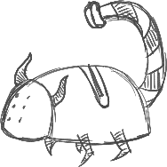
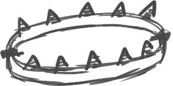

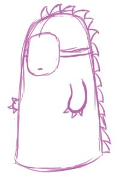
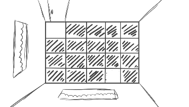

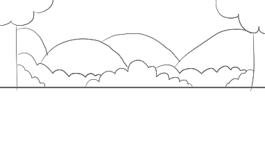

### Page 4

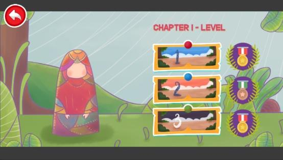
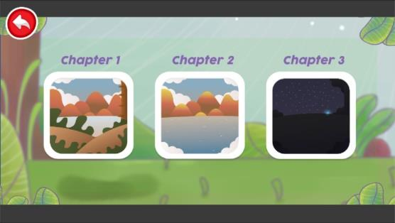
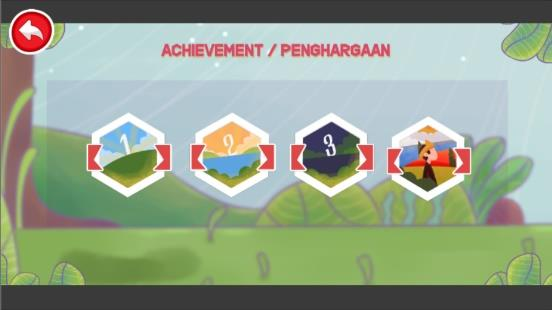
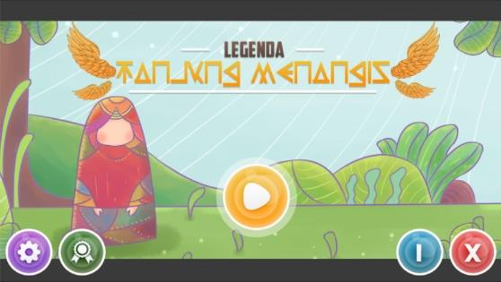

### Page 5

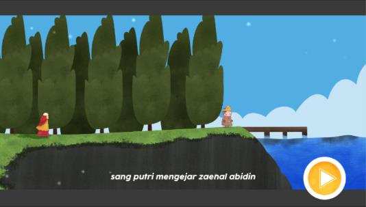
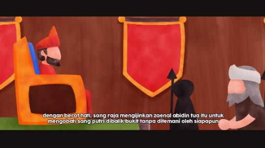
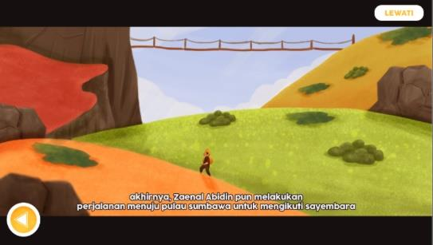
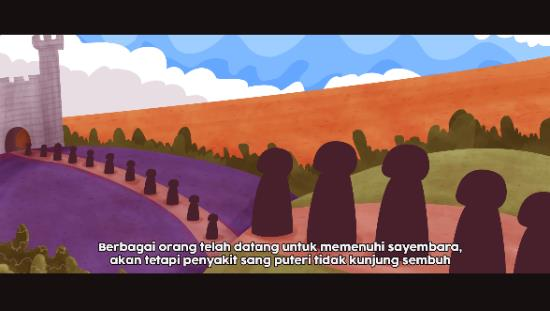
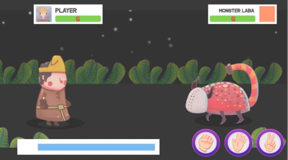
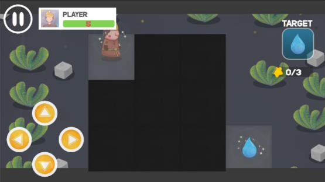
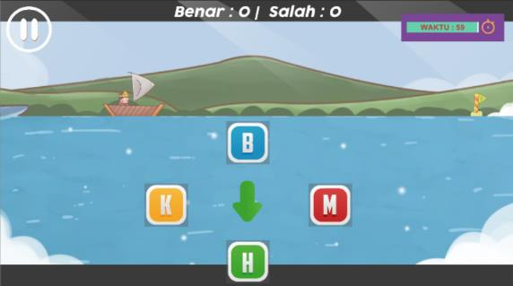
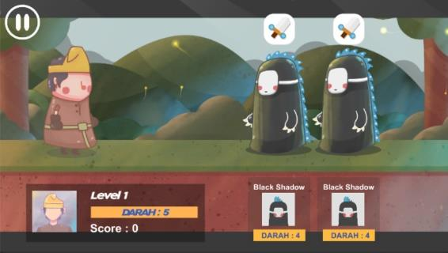
