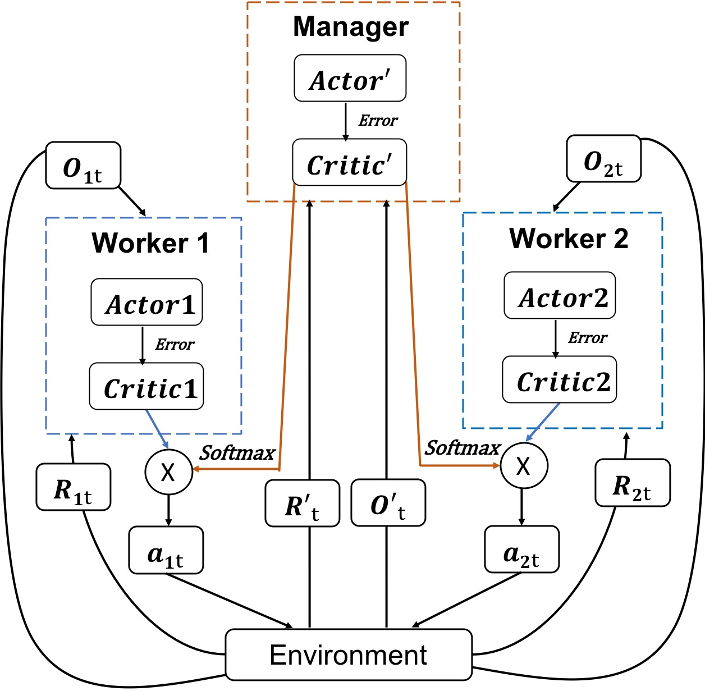
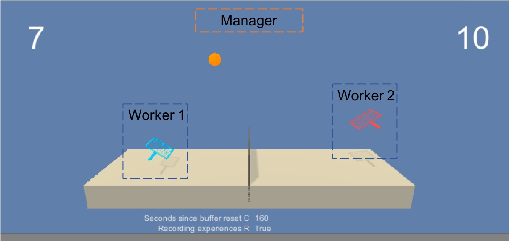
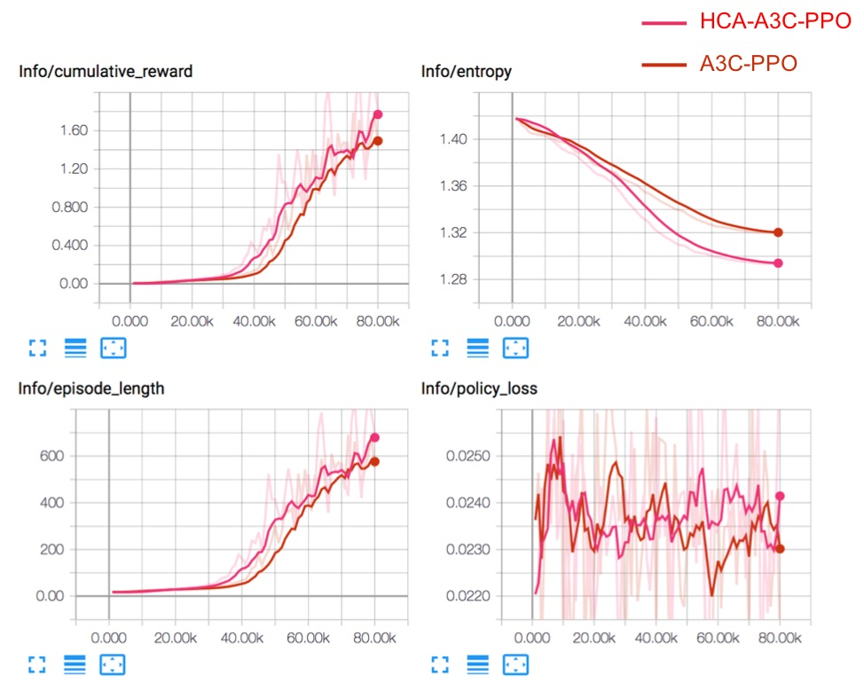
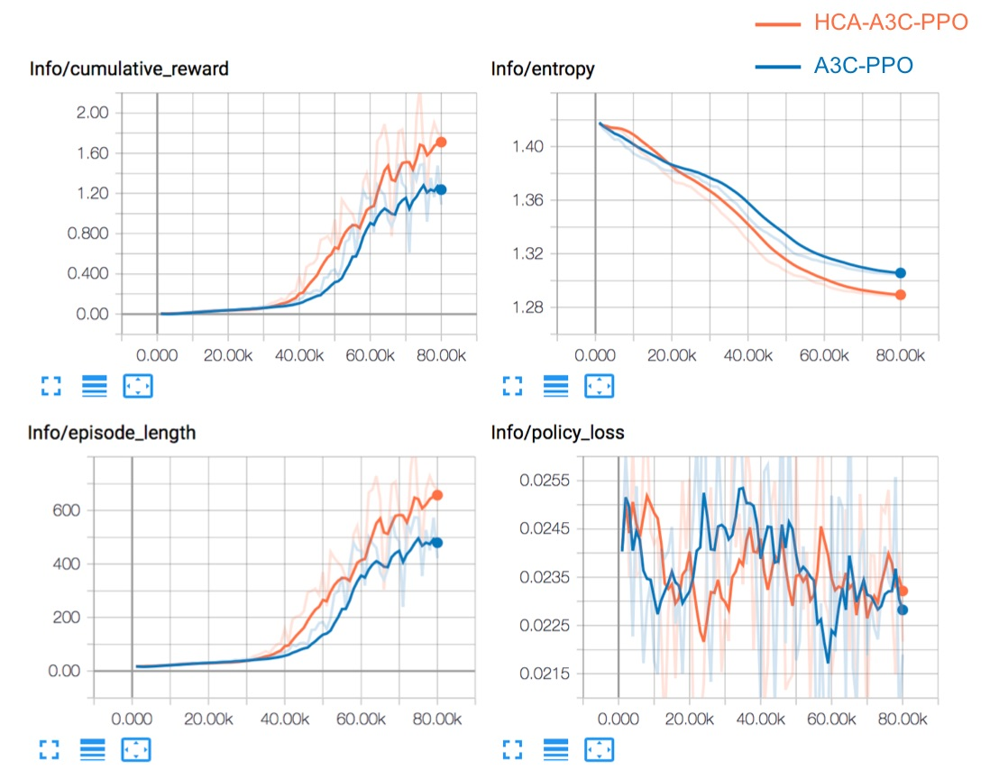
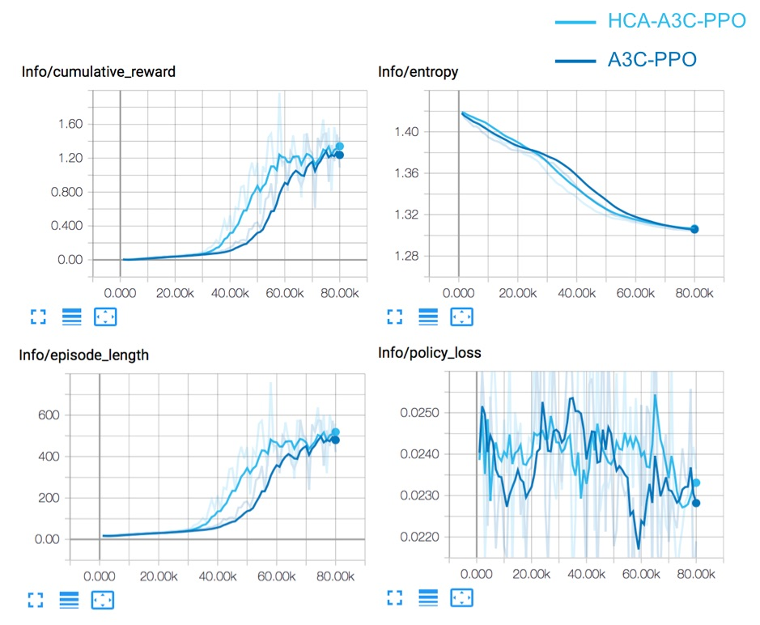
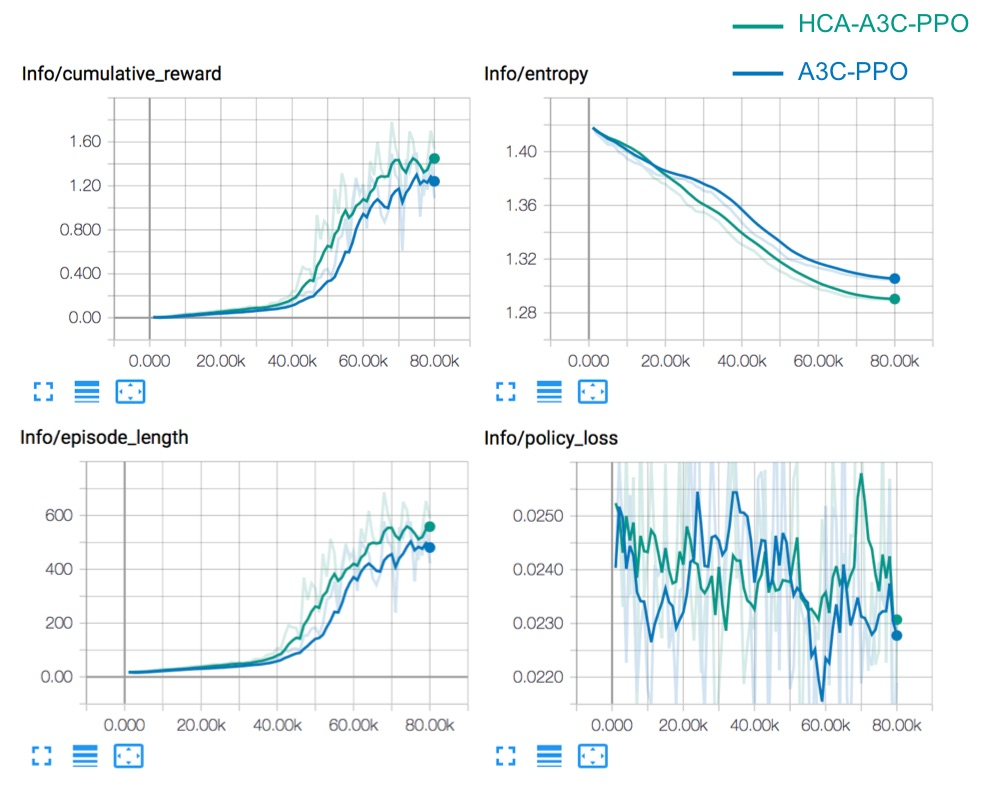

Hierarchical Critic Assignment for Multi-agent Reinforcement Learning
|     |     |     |     |     | ZehongCao1,2 |     | and | Chin-TengLin1 |     |     |     |     |     |     |     |
| --- | --- | --- | --- | --- | ------------ | --- | --- | ------------- | --- | --- | --- | --- | --- | --- | --- |
1CentreforArtificialIntelligence,SchoolofSoftware,FacultyofEngineeringandIT,Universityof
TechnologySydney,NSW,Australia.
2DisciplineofICT,SchoolofTechnology,EnvironmentsandDesign,CollegeofSciencesand
Engineering,UniversityofTasmania,TAS,Australia
{Zehong.Cao,Chin-Teng.Lin}@uts.edu.au
9102 beF 11  ]GL.sc[  2v97030.2091:viXra
Abstract
|         |        |                |     |     |        |            |     | ditionally: | maximise | one’s        | benefit   | under    | the       | worst-case | as-       |
| ------- | ------ | -------------- | --- | --- | ------ | ---------- | --- | ----------- | -------- | ------------ | --------- | -------- | --------- | ---------- | --------- |
|         |        |                |     |     |        |            |     | sumption    | that     | the opponent | will      | always   | endeavour |            | to min-   |
| In this | paper, | we investigate |     | the | use of | global in- |     |             |          |              |           |          |           |            |           |
|         |        |                |     |     |        |            |     | imise that  | benefit. | This         | principle | suggests |           | using      | opponent- |
formationtospeedupthelearningprocessandin-
independentalgorithms.Theminimax-Qalgorithm[Littman,
| crease      | the | cumulative | rewards |     | of multi-agent | re-        |     |               |     |             |           |     |            |     |            |
| ----------- | --- | ---------- | ------- | --- | -------------- | ---------- | --- | ------------- | --- | ----------- | --------- | --- | ---------- | --- | ---------- |
|             |     |            |         |     |                |            |     | 2001] employs |     | the minimax | principle |     | to compute |     | strategies |
| inforcement |     | learning   | (MARL)  |     | tasks.         | Within the |     |               |     |             |           |     |            |     |            |
andvaluesforthestagegames,andatemporal-differencerule
actor-criticMARL,weintroducemultiplecoopera-
|     |     |     |     |     |     |     |     | similar to | Q-learning | is  | used to | propagate |     | the values | across |
| --- | --- | --- | --- | --- | --- | --- | --- | ---------- | ---------- | --- | ------- | --------- | --- | ---------- | ------ |
tivecriticsfromtwolevelsofthehierarchyandpro-
statetransitions.Ifconsideringpolicygradientmethods,each
| pose | a hierarchical |     | critic-based |     | MARL | algorithm. |     |     |     |     |     |     |     |     |     |
| ---- | -------------- | --- | ------------ | --- | ---- | ---------- | --- | --- | --- | --- | --- | --- | --- | --- | --- |
agentcanusemodel-basedpolicyoptimisationtolearnopti-
Inourapproach,theagentisallowedtoreceivein-
|     |     |     |     |     |     |     |     | mal policies | via | back-propagation |     | such | as  | the Monte-Carlo |     |
| --- | --- | --- | --- | --- | --- | --- | --- | ------------ | --- | ---------------- | --- | ---- | --- | --------------- | --- |
formationfromlocalandglobalcriticsinacompe-
|         |       |                |     |              |          |           |     | policy gradient |             | and Deterministic |     | Policy |             | Gradient   | (DPG) |
| ------- | ----- | -------------- | --- | ------------ | -------- | --------- | --- | --------------- | ----------- | ----------------- | --- | ------ | ----------- | ---------- | ----- |
| tition  | task. | The agent      | not | only         | receives | low-level |     |                 |             |                   |     |        |             |            |       |
|         |       |                |     |              |          |           |     | [Silver et      | al., 2014]. | Unfortunately,    |     |        | traditional | Q-Learning |       |
| details | but   | also considers |     | coordination |          | from high |     |                 |             |                   |     |        |             |            |       |
andpolicygradientmethodsarepoorlysuitedtomulti-agent
| levels | to obtain | global | information |     | for | increasing |     |     |     |     |     |     |     |     |     |
| ------ | --------- | ------ | ----------- | --- | --- | ---------- | --- | --- | --- | --- | --- | --- | --- | --- | --- |
environments.Thus,[Loweetal.,2017]presentedanadapta-
| operationalperformance. |     |     |     | Here,wedefinemultiple |     |     |     |     |     |     |     |     |     |     |     |
| ----------------------- | --- | --- | --- | --------------------- | --- | --- | --- | --- | --- | --- | --- | --- | --- | --- | --- |
tionofactor-criticmethodsthatconsiderstheactionpolicies
| cooperative |     | critics | in a top-down |     | hierarchy, | called |     |     |     |     |     |     |     |     |     |
| ----------- | --- | ------- | ------------- | --- | ---------- | ------ | --- | --- | --- | --- | --- | --- | --- | --- | --- |
ofotheragentsandcansuccessfullylearnpoliciesthatrequire
| the | Hierarchical | Critic | Assignment |     | (HCA) | frame- |     |     |     |     |     |     |     |     |     |
| --- | ------------ | ------ | ---------- | --- | ----- | ------ | --- | --- | --- | --- | --- | --- | --- | --- | --- |
complexmulti-agentcoordination.
| work. | Our | experiment, |     | a two-player | tennis | com- |     |     |     |     |     |     |     |     |     |
| ----- | --- | ----------- | --- | ------------ | ------ | ---- | --- | --- | --- | --- | --- | --- | --- | --- | --- |
OnehintatenablingMARLalgorithmstoovercomethese
| petition | task | performed | in  | the Unity | environment, |     |     |     |     |     |     |     |     |     |     |
| -------- | ---- | --------- | --- | --------- | ------------ | --- | --- | --- | --- | --- | --- | --- | --- | --- | --- |
tested the HCA multi-agent framework based on challengesmaylieinthewayinwhichmultipleagentsarehi-
erarchicallystructured[Mnihetal.,2015].Inspiredbyfeudal
| the  | Asynchronous |        | Advantage    | Actor-Critic |       | (A3C) |     |               |          |         |     |        |     |          |       |
| ---- | ------------ | ------ | ------------ | ------------ | ----- | ----- | --- | ------------- | -------- | ------- | --- | ------ | --- | -------- | ----- |
|      |              |        |              |              |       |       |     | reinforcement | learning | [Dayan, |     | 1993], | the | DeepMind | group |
| with | Proximal     | Policy | Optimization |              | (PPO) | algo- |     |               |          |         |     |        |     |          |       |
proposedFeudalNetworks(FuNs)[Vezhnevetsetal.,2017],
| rithm. | The | results | showed | that | the HCA | frame- |     |     |     |     |     |     |     |     |     |
| ------ | --- | ------- | ------ | ---- | ------- | ------ | --- | --- | --- | --- | --- | --- | --- | --- | --- |
whichemployamanagermoduleandaworkermoduleforhi-
| work | outperforms |     | the non-hierarchical |     |     | critic base- |     |     |     |     |     |     |     |     |     |
| ---- | ----------- | --- | -------------------- | --- | --- | ------------ | --- | --- | --- | --- | --- | --- | --- | --- | --- |
linemethodonMARLtasks. erarchicalreinforcementlearning. Themanagersetsabstract
goals,whichareconveyedtoandenactedbytheworker,who
|     |     |     |     |     |     |     |     | generates | primitive | actions | at every | tick | of  | the environment. |     |
| --- | --- | --- | --- | --- | --- | --- | --- | --------- | --------- | ------- | -------- | ---- | --- | ---------------- | --- |
1 Introduction Furthermore, the FuNs structure has been extended to co-
|              |               |              |         |       |            |             |     | operative | reinforcement |        | learning | [Ahilan        | and | Dayan,    | 2019], |
| ------------ | ------------- | ------------ | ------- | ----- | ---------- | ----------- | --- | --------- | ------------- | ------ | -------- | -------------- | --- | --------- | ------ |
| The analysis | of            | multi-agent  | systems |       | is a topic | of interest | in  |           |               |        |          |                |     |           |        |
|              |               |              |         |       |            |             |     | whereby   | the manager   | learns |          | to communicate |     | sub-goals | to     |
| the field    | of artificial | intelligence |         | (AI). | Although   | multi-agent |     |           |               |        |          |                |     |           |        |
systemshavebeenwidelystudiedinroboticcontrol,decision multipleworkers. Indeed,thesepropertiesofextractingsub-
supportsystems,anddatamining,onlyrecentlyhavetheybe- goals from the manager allow FuN to dramatically outper-
guntoattractinterestinAI[Gonza´lez-Brionesetal., 2018]. formastrongbaselineagentontasks.
Asignificantportionofresearchonmulti-agentlearningcon- However,almostalltheaboveMARLmethodsignorethis
cernsreinforcementlearning(RL)techniques[Busoniuetal., critical fact that an agent might have access to the multiple
2010],whichcanprovidelearningpoliciesforachievingtar- cooperative critics to speed up the learning process and in-
get tasks by maximising rewards provided by the environ- crease the rewards on competition tasks. In particular, it is
ment. In the multi-agent reinforcement learning (MARL) frequentlythecasethathigh-levelagentsagreetobeassigned
framework,eachagentlearnsbyinteractingwithitsdynamic differentobservationsthatco-workwithlow-levelagentsfor
environment to solve a cooperative or competitive task. At thebenefitofhierarchicalcooperation. Forexample,military
each time step, the agent perceives the state of the environ- personnel typically have different roles and responsibilities.
ment and takes an action, which causes the environment to The commander is required to monitor multiple information
transitintoanewstate. sources, assess changing operational conditions and recom-
Inacompetitivegameofmultipleplayers(fortwoagents, mendcoursesofactiontosoldiers. Theadvancedhierarchi-
whenp = −p ),themini-maxprinciplecanbeappliedtra- calMARLtechnologiescanevaluatetherelativeimportance
| 1   | 2   |     |     |     |     |     |     |     |     |     |     |     |     |     |     |
| --- | --- | --- | --- | --- | --- | --- | --- | --- | --- | --- | --- | --- | --- | --- | --- |

of new and changing data and make recommendations that updateperformedbythealgorithmcanbewrittenas
willbothimprovedecision-makingcapabilitiesandempower
;θ(cid:48))A(s
|     |     |     |     |     |     |     | (cid:53) θ(cid:48) | logπ(a | t |s t | t ,a | t ;θ,θ v ) |     |
| --- | --- | --- | --- | --- | --- | --- | ------------------ | ------ | ------ | ---- | ---------- | --- |
commanderstomakepracticaljudgementsasquicklyaspos-
sible. where A(s ,a ;θ,θ ) is an estimate of the advantage func-
t t v
| Ourproposedframeworkinthispaperdiffersfromexisting |     |     |     |     |     | tion. |     |     |     |     |     |     |
| -------------------------------------------------- | --- | --- | --- | --- | --- | ----- | --- | --- | --- | --- | --- | --- |
approaches,namely,theuseofglobalinformationtospeedup Theadvantagefunctionisgivenby
| andincreasethecumulativerewardsofMARLtasks. |     |     |     |     | Within |     |     |     |     |     |     |     |
| ------------------------------------------- | --- | --- | --- | --- | ------ | --- | --- | --- | --- | --- | --- | --- |
k−1
the actor-critic MARL, we introduce multiple cooperative (cid:88) γirt+i+γkV(s
|     |     |     |     |     |     |     |     |     | t+k | ;θ)−V(s | t ;θ v | )   |
| --- | --- | --- | --- | --- | --- | --- | --- | --- | --- | ------- | ------ | --- |
criticsfromtwolevelsofthehierarchyandproposeahierar-
| chical critic-based | multi-agent |     | reinforcement | learning | algo- |     | i=0 |     |     |     |     |     |
| ------------------- | ----------- | --- | ------------- | -------- | ----- | --- | --- | --- | --- | --- | --- | --- |
rithm. Themaincontributionsofourproposedapproachare wherekcanvaryfromstatetostateandisupperboundedby
| the following: | (1) The agent | is  | allowed | to receive the | infor- | t . |     |     |     |     |     |     |
| -------------- | ------------- | --- | ------- | -------------- | ------ | --- | --- | --- | --- | --- | --- | --- |
max
Aswithvalue-basedmethods,thismethodreliesonactor-
mationfromlocalandglobalcriticsinacompetitiontask.(2)
Theagentnotonlyreceiveslow-leveldetailsbutalsoconsid- learners and accumulate updates for improving the training
ers coordination from high levels receiving global informa- stability.Theparametersofθofthepolicyandθ v ofthevalue
tiontoincreaseoperationalperformance. (3)Wedefinemul- functionareshared,eveniftheyareshowntobeseparatefor
tiple cooperative critics in the top-bottom hierarchy, called generality. Forexample, aconvolutionalneuralnetworkhas
|                  |                   |     |       |            |     | onesoftmaxoutputforthepolicyπ(a |     |     |     |     | |s ;θ)andonelinear |     |
| ---------------- | ----------------- | --- | ----- | ---------- | --- | ------------------------------- | --- | --- | --- | --- | ------------------ | --- |
| the Hierarchical | Critic Assignment |     | (HCA) | framework. | We  |                                 |     |     |     | t   | t                  |     |
|                  |                   |     |       |            |     |                                 |     |     | V(s | ;θ  | ),                 |     |
assume that HCA is a generalised RL framework and thus output for the value function t v with all non-output
| more applicable | to multi-agent   |       | learning. | These benefits       | can | layersshared. |                                 |     |     |     |     |     |
| --------------- | ---------------- | ----- | --------- | -------------------- | --- | ------------- | ------------------------------- | --- | --- | --- | --- | --- |
| potentially     | be obtained when | using | any       | type of hierarchical |     |               |                                 |     |     |     |     |     |
|                 |                  |       |           |                      |     | 2.3           | ProximalPolicyOptimization(PPO) |     |     |     |     |     |
MARLalgorithm.
| The remainder | of this | paper | is organised | as follows. | In  |     | Algorithm |     |     |     |     |     |
| ------------- | ------- | ----- | ------------ | ----------- | --- | --- | --------- | --- | --- | --- | --- | --- |
Section 2, we introduce the RL background for developing PPO [Schulman et al., 2017] is a new family of policy gra-
themultiplecooperativecriticframeworkinmulti-agentdo- dient methods for reinforcement learning, which alternate
mains. Section 3 describes the baseline and proposes the between sampling data through interactions with the envi-
HCA framework for hierarchical MARL. Section 4 presents ronmentandoptimisingasurrogateobjectivefunctionusing
anexperimentaldesigninasimpleUnitytennistaskwithfour
|     |     |     |     |     |     | stochasticgradientascent. |     |     | Whereasstandardpolicygradient |     |     |     |
| --- | --- | --- | --- | --- | --- | ------------------------- | --- | --- | ----------------------------- | --- | --- | --- |
typesofsettings. Section5demonstratesthetrainingperfor- methods perform one gradient update per data sample, the
manceresultsofthebaselineandproposedHCAframework. objective function enables multiple epochs of minibatch up-
Finally,wesummarisethepaperanddiscusssomedirections dates,whichissimplertoimplement,moregeneral,andhas
| forfutureworkinSection6. |     |     |     |     |     | bettersamplecomplexity. |                     |     |        |     |            |         |
| ------------------------ | --- | --- | --- | --- | --- | ----------------------- | ------------------- | --- | ------ | --- | ---------- | ------- |
|                          |     |     |     |     |     | PPO                     | can be investigated |     | in the | A3C | framework. | Specif- |
2 Background ically, if using a neural network architecture that shares pa-
|     |     |     |     |     |     | rametersbetweenthepolicyandvaluefunction, |     |     |     |     |     | alossfunc- |
| --- | --- | --- | --- | --- | --- | ----------------------------------------- | --- | --- | --- | --- | --- | ---------- |
2.1 Theory
tionmustbeusedtocombinethepolicysurrogateandavalue
InastandardRLframework[Kaelblingetal.,1996],anagent functionerrorterm. Thisobjectivecanfurtherbeaugmented
interactswiththeexternalenvironmentoveranumberoftime by adding an entropy bonus to ensure sufficient exploration.
|     | s   |     |     |     | a   |     |     |     |     |     |     |     |
| --- | --- | --- | --- | --- | --- | --- | --- | --- | --- | --- | --- | --- |
steps. Here, is the set of all possible states, and is all To approximately maximise each iteration, the “surrogate”
possible actions. At each time step t, the agent in state s t , objectivefunctionisasfollows:
| byperceivingtheobservationinformationO |     |     |     | fromtheenvi- |     |                 |     |     |             |     |          |            |
| -------------------------------------- | --- | --- | --- | ------------ | --- | --------------- | --- | --- | ----------- | --- | -------- | ---------- |
|                                        |     |     |     | t            |     | LCLIP+VF+S(θ)=ε |     |     | [LCLIP(θ)−c |     | LVF(θ)+c | S[π ](s )] |
ronment,receivesfeedbackfromtherewardsource,say,R , t t t 1 t 2 θ t
t
| by taking            | action a . Then, | the                          | agent | moves to a new | state |        |                                                  |     |     |     |     |     |
| -------------------- | ---------------- | ---------------------------- | ----- | -------------- | ----- | ------ | ------------------------------------------------ | --- | --- | --- | --- | --- |
|                      | t                |                              |       |                |       | wherec | 1 andc 2 arecoefficients,Sdenotesanentropybonus, |     |     |     |     |     |
| s t+1),andtherewardR |                  | t+1)associatedwiththetransi- |       |                |       |        |                                                  |     |     |     |     |     |
( ( LC LIP is a surrogate objective, and LV F is a squared-error
|           |                                           |     |     |     |     | t     |     |     |     |     | t   |     |
| --------- | ----------------------------------------- | --- | --- | --- | --- | ----- | --- | --- | --- | --- | --- | --- |
| tion(s ,a | ,s t+1))isdetermined.Theagentcanchooseany |     |     |     |     | loss. |     |     |     |     |     |     |
| t         | t (                                       |     |     |     |     |       |     |     |     |     |     |     |
actionasafunctionofthehistory,andthegoalofareinforce-
mentlearningagentistocollectasmuchrewardaspossible 2.4 Hierarchies
withminimaldelay.
Hierarchicalreinforcementlearning(HRL)isapromisingap-
|     |     |     |     |     |     | proach | to extending | traditional |     | RL methods | to  | solve more |
| --- | --- | --- | --- | --- | --- | ------ | ------------ | ----------- | --- | ---------- | --- | ---------- |
2.2 AsynchronousAdvantageActor-Critic(A3C)
|     |     |     |     |     |     | complex | tasks [Kulkarni |     | et al., | 2016]. | In its most | straight- |
| --- | --- | --- | --- | --- | --- | ------- | --------------- | --- | ------- | ------ | ----------- | --------- |
The A3C structure [Mnih et al., 2016] can master a variety forward setting, the hierarchy corresponds to a rooted di-
ofcontinuousmotorcontroltasksaswellaslearnedgeneral rected tree, with the highest-level manager as the root node
strategiesforexploringgamespurelyfromsensorandvisual andeachworkerreportingtoonlyasinglemanager. Apop-
inputs. A3Cmaintainsapolicyπ(a |s ;θ)andanestimate ularschemeismeta-learningsharedhierarchies[Fransetal.,
|     |     |     | t   | t   |     |     |     |     |     |     |     |     |
| --- | --- | --- | --- | --- | --- | --- | --- | --- | --- | --- | --- | --- |
of the value function V(s ;θ ). This variant of actor-critic 2017], which learn a hierarchical policy whereby a master
t v
can operate in the forward view and uses the same mix of policy switches between a set of sub-policies. The master
n-step returns to update both the policy and the value func- selects an action every n time steps, and a sub-policy exe-
tion. Thepolicyandthevaluefunctionareupdatedafterev- cuted for n time steps constitutes a high-level action. An-
ery t actions or when a terminal state is reached. The otherscheme[Nachumetal.,2018]islearninggoal-directed
max

behavioursinenvironments,wherelowerlevelcontrollersare hierarchies, we are the first to develop an HCA framework
supervisedwithgoalsthatarelearnedandproposedautomat- allowing a worker to receive multiple critics computed lo-
icallybythehigherlevelcontrollers. callyandglobally. Themanagerisresponsibleforcollecting
broaderobservationsandestimatingthecorrespondingglobal
| 3 Methods |     |     |     |     |     |     |     | critic.AsshowninFig.1,theHCAframeworkisconstructed |     |     |     |     |
| --------- | --- | --- | --- | --- | --- | --- | --- | -------------------------------------------------- | --- | --- | --- | --- |
bythetwo-levelhierarchieswithonemanageragentandtwo
| Toward the | propagation |     | of the critics | in  | the hierarchies, |     | we  |               |                                        |     |     |     |
| ---------- | ----------- | --- | -------------- | --- | ---------------- | --- | --- | ------------- | -------------------------------------- | --- | --- | --- |
|            |             |     |                |     |                  |     |     | workeragents. | Thelocalandglobalcriticsareimplemented |     |     |     |
proposeHCA,aframeworkforMARLthatconsidersmulti-
bythesoftmaxfunctionillustratedinthe‘multiple-criticas-
| ple cooperative | critics | from | two | levels | of the | hierarchy. | To  |     |     |     |     |     |
| --------------- | ------- | ---- | --- | ------ | ------ | ---------- | --- | --- | --- | --- | --- | --- |
signment’subsection.
speedupthelearningprocessandincreasethecumulativere-
wards,theagentisallowedtoreceiveinformationfromlocal
andglobalcriticsinacompetitiontask.
| 3.1 Baseline: | A3C-PPO |     |     |     |     |     |     |     |     |     |     |     |
| ------------- | ------- | --- | --- | --- | --- | --- | --- | --- | --- | --- | --- | --- |
A3CandPPO-basedRLalgorithmshaveperformedcompa-
rablytoorbetterthanstate-of-the-artapproacheswhilebeing
| muchsimplertoimplementandtune. |     |     |     | Inparticular,PPOhas |     |     |     |     |     |     |     |     |
| ------------------------------ | --- | --- | --- | ------------------- | --- | --- | --- | --- | --- | --- | --- | --- |
becomethedefaultreinforcementlearningalgorithmatOpe-
| nAIbecauseofitseaseofuseandgoodperformance. |         |           |            |      |              |             | Here,   |     |     |     |     |     |
| ------------------------------------------- | ------- | --------- | ---------- | ---- | ------------ | ----------- | ------- | --- | --- | --- | --- | --- |
| we provide                                  | the A3C | algorithm | with       | PPO, | called       | A3C-PPO,    |         |     |     |     |     |     |
| whichisastate-of-the-artdeepRLalgorithm.    |         |           |            |      |              | Itcanbeused |         |     |     |     |     |     |
| as the baseline                             | to      | validate  | experiment |      | environments |             | as well |     |     |     |     |     |
asstartingpointsforthedevelopmentofnovelalgorithms.
3.2 Multiple-CriticAssignment
ToapplyexistingRLmethodstotheproblemofagentswith
variableattentiontomorethanonecritic,weconsiderasoft-
maxapproachforresolvingthemultiple-criticlearningprob-
lem. Intermsofadvantageactor-criticmethods,theactorisa
| policyfunctionπ(a |     | |s ;θ)thatcontrolshowouragentacts, |     |     |     |     |     |     |     |     |     |     |
| ----------------- | --- | ---------------------------------- | --- | --- | --- | --- | --- | --- | --- | --- | --- | --- |
t t
| andthecriticisavaluefunctionV(s |     |     |     | ;θ  | )thatmeasureshow |     |     |     |     |     |     |     |
| ------------------------------- | --- | --- | --- | --- | ---------------- | --- | --- | --- | --- | --- | --- | --- |
t v
| good these       | actions   | are. | For multiple | critics, |          | the update | ad-    |     |     |     |     |     |
| ---------------- | --------- | ---- | ------------ | -------- | -------- | ---------- | ------ | --- | --- | --- | --- | --- |
| vantage function | performed |      | by the       | softmax  | function |            | can be |     |     |     |     |     |
writtenas
m
(cid:91)
| A(s ,a )=softmax |     |     | {π(a | |s ;θ)−V(s(i) |     | ;θ(i) | )}  |     |     |     |     |     |
| ---------------- | --- | --- | ---- | ------------- | --- | ----- | --- | --- | --- | --- | --- | --- |
| t t              |     |     | t    | t             |     | t     | v   |     |     |     |     |     |
i=1
|     |     |     |     |     |     |     |     | Figure1. | TheHCAframework. | Themulti-agenthierarchy |     |     |
| --- | --- | --- | --- | --- | --- | --- | --- | -------- | ---------------- | ----------------------- | --- | --- |
,wheremisthetotalnumberofcritics.
|                  |          |      |            |             |       |          |         | withonemanageragentandtwoworkeragents. |                  |         | Theworker     |     |
| ---------------- | -------- | ---- | ---------- | ----------- | ----- | -------- | ------- | -------------------------------------- | ---------------- | ------- | ------------- | --- |
| The advantage    | function |      | calculates | the         | extra | reward   | if tak- |                                        |                  |         |               |     |
|                  |          |      |            |             |       |          |         | receives multiple                      | critics computed | locally | and globally, | and |
| ing this action, | which    | tell | us the     | improvement |       | compared | to      |                                        |                  |         |               |     |
themanagerprovidestheglobalcritic.
theaverageactiontakenatthatstate.Inotherwords,themax-
| A(s        | ,a )             |     |                         |          |            |        |          |          |                 |           |                 |     |
| ---------- | ---------------- | --- | ----------------------- | -------- | ---------- | ------ | -------- | -------- | --------------- | --------- | --------------- | --- |
| imised     | t t indicates    |     | that the                | gradient | is         | pushed | in that  |          |                 |           |                 |     |
| direction. | Based on         | the | A3C structure,          |          | the policy |        | function |          |                 |           |                 |     |
|            |                  |     |                         |          |            |        |          | Here, we | applied the HCA | framework | in the A3C-PPO, |     |
| {π(a |s    | ;θ)wouldestimate |     | (cid:80)k−1γirt+i+γkV(s |          |            |        | ;θ).     |          |                 |           |                 |     |
t t i=0 t+k called HCA-A3C-PPO, or simply HCA. The successfully
Furthermore,weconsiderthentimestepintervalsofmul-
trainedHCA-A3C-PPOmodelrequirestuningofthetrained
tiplecritics,andtheupdateadvantagefunctioncanbewritten hyperparameters, which is beneficial to the output of the
as
trainingprocesscontainingtheoptimisedpolicy.
ht
(cid:91)
| A(s ,a )=softmax |     |     | {π(a | |s ;θ)−V(s(i) |     | ;θ(i) | )}  | 4 Experiment |                  |           |              |     |
| ---------------- | --- | --- | ---- | ------------- | --- | ----- | --- | ------------ | ---------------- | --------- | ------------ | --- |
| t t              |     |     | t    | t             |     | t     | v   |              |                  |           |              |     |
|                  |     | i=1 |      |               |     |       |     | We apply     | our proposed HCA | framework | to scenarios | in  |
,whereh isthetotalnumberofcritics. which two agents compete with each other. We empirically
t
Ifh t = h t+kT , h t = m, wherek = 2,3,4,...andT isa showthesuccessofourframeworkcomparedtotheexisting
timeperiodwithntimesteps;otherwise,h =1. methodincompetitivescenarios. Wehavereleasedcodesfor
t
boththemodelandtheenvironmentsonGitHub.
3.3 HCA-A3C-PPO
For simplicity, the experiments generally used two-level hi- 4.1 UnityPlatformforMARL
erarchies such as a multi-agent hierarchy with one manager Since many existing platforms, such as OpenAI Gym, lack
agentandtwoworkeragents. Topropagatethecriticsinthe theabilitytoflexiblyconfigurethesimulation,thesimulation

|     |     | Types | Agents    |     |     | ObservationSpaces |          |             |           |          | InputVariables |     |     |     |     |
| --- | --- | ----- | --------- | --- | --- | ----------------- | -------- | ----------- | --------- | -------- | -------------- | --- | --- | --- | --- |
|     |     | Type1 | worker1&2 |     |     | ball(position     |          | ,velocity   | )         |          | 8variables     |     |     |     |     |
|     |     |       |           |     |     |                   | t        | t           |           |          |                |     |     |     |     |
|     |     |       |           |     |     | racket(position   |          | ,velocity   | )         |          |                |     |     |     |     |
|     |     |       |           |     |     |                   |          | t           | t         |          |                |     |     |     |     |
|     |     |       |           |     |     | ball(position     |          | ,velocity   |           |          |                |     |     |     |     |
|     |     |       | manager   |     |     |                   | t        | t           | )         |          | 10variables    |     |     |     |     |
|     |     |       |           |     |     | racket(position   |          | t ,velocity | t )       |          |                |     |     |     |     |
|     |     |       |           |     |     | distance(ball     | ,racket  | )           |           |          |                |     |     |     |     |
|     |     |       |           |     |     |                   | t        | t           |           |          |                |     |     |     |     |
|     |     | Type2 | worker1&2 |     |     | ball(position     |          | ,velocity   | )         |          | 8variables     |     |     |     |     |
|     |     |       |           |     |     |                   | t        | t           |           |          |                |     |     |     |     |
|     |     |       |           |     |     | racket(position   |          | ,velocity   | )         |          |                |     |     |     |     |
|     |     |       |           |     |     |                   |          | t           | t         |          |                |     |     |     |     |
|     |     |       | manager   |     |     | ball(position     | (t−1,t)  | ,velocity   | (t−1,t))  | )        | 16variables    |     |     |     |     |
|     |     |       |           |     |     | racket(position   |          | ,velocity   |           |          | )              |     |     |     |     |
|     |     |       |           |     |     |                   |          | (t−1,t)     |           | (t−1,t)) |                |     |     |     |     |
|     |     | Type3 | worker1&2 |     |     | ball(position     |          | ,velocity   | )         |          | 8variables     |     |     |     |     |
|     |     |       |           |     |     |                   | t        | t           |           |          |                |     |     |     |     |
|     |     |       |           |     |     | racket(position   |          | ,velocity   | )         |          |                |     |     |     |     |
|     |     |       |           |     |     |                   |          | t           | t         |          |                |     |     |     |     |
|     |     |       | manager   |     |     | ball(position     |          | ,velocity   |           | )        | 20variables    |     |     |     |     |
|     |     |       |           |     |     |                   | (t−1,t)  |             | (t−1,t)   |          |                |     |     |     |     |
|     |     |       |           |     |     | racket(position   |          | ,velocity   |           | )        |                |     |     |     |     |
|     |     |       |           |     |     |                   |          | (t−1,t)     |           | (t−1,t)  |                |     |     |     |     |
|     |     |       |           |     |     | distance(ball     |          | ,racket     |           | )        |                |     |     |     |     |
|     |     |       |           |     |     |                   | (t−1,t)  |             | (t−1,t)   |          |                |     |     |     |     |
|     |     | Type4 | worker1&2 |     |     | ball(position     |          | ,velocity   | )         |          | 8variables     |     |     |     |     |
|     |     |       |           |     |     |                   | t        | t           |           |          |                |     |     |     |     |
|     |     |       |           |     |     | racket(position   |          | ,velocity   | )         |          |                |     |     |     |     |
|     |     |       |           |     |     |                   |          | t           | t         |          |                |     |     |     |     |
|     |     |       | manager   |     |     | ball(position     | ht=ht+kT | ,velocity   |           | ht=ht+kT | ) 10variables  |     |     |     |     |
|     |     |       |           |     |     | racket(position   |          |             | ,velocity |          | )              |     |     |     |     |
|     |     |       |           |     |     |                   |          | ht=ht+kT    |           | ht=ht+kT |                |     |     |     |     |
|     |     |       |           |     |     | distance(ball     |          | ,racket     |           |          | )              |     |     |     |     |
|     |     |       |           |     |     |                   | ht=ht+kT |             | ht=ht+kT  |          |                |     |     |     |     |
Table1:Fourtypesofmulti-agentobservations
environment becomes a black box from the perspective of vector action space is continuous, with a size of 3, corre-
thelearningsystem. TheUnityplatform,anewopen-source spondingtomovement towardthenetor awayfromthenet,
| toolkit,   | hasbeendevelopedforcreatingandinteractingwith |     |               |     |     |       |         | andjumping. |     |     |     |     |     |     |     |
| ---------- | --------------------------------------------- | --- | ------------- | --- | --- | ----- | ------- | ----------- | --- | --- | --- | --- | --- | --- | --- |
| simulation | environments.                                 |     | Specifically, |     | the | Unity | Machine |             |     |     |     |     |     |     |     |
LearningAgentsToolkit(ML-AgentsToolkit)[Julianietal.,
2018]isanopen-sourceUnitypluginthatenablesgamesand
| simulations | to serve | as  | environments |     | for training | intelligent |     |     |     |     |     |     |     |     |     |
| ----------- | -------- | --- | ------------ | --- | ------------ | ----------- | --- | --- | --- | --- | --- | --- | --- | --- | --- |
agents. Thetoolkitsupportsdynamicmulti-agentinteraction,
| and agents | can | be trained | using | RL  | through | a simple-to-use |     |     |     |     |     |     |     |     |     |
| ---------- | --- | ---------- | ----- | --- | ------- | --------------- | --- | --- | --- | --- | --- | --- | --- | --- | --- |
PythonAPI.
| 4.2 UnityScenario: |             |             | TennisCompetition |          |     |                 |     |     |     |     |     |     |     |     |     |
| ------------------ | ----------- | ----------- | ----------------- | -------- | --- | --------------- | --- | --- | --- | --- | --- | --- | --- | --- | --- |
| We set             | up a tennis | competition |                   | scenario | in  | Unity including |     |     |     |     |     |     |     |     |     |
atwo-playergamewherebyagentscontrolracketstobounce
| the ball | over a | net. The | goal | of this | task | is that the | agents |     |     |     |     |     |     |     |     |
| -------- | ------ | -------- | ---- | ------- | ---- | ----------- | ------ | --- | --- | --- | --- | --- | --- | --- | --- |
mustbouncetheballbetweenoneanotherwhilenotdropping
Figure2TenniscompetitioninUnity
| orsendingtheballoutofbounds. |              |     |                | Furthermore,asshownin |             |           |      |     |     |     |     |     |     |     |     |
| ---------------------------- | ------------ | --- | -------------- | --------------------- | ----------- | --------- | ---- | --- | --- | --- | --- | --- | --- | --- | --- |
| Fig. 2,                      | we construct | a   | new learning   |                       | environment | involving |      |     |     |     |     |     |     |     |     |
| the two-layer                | hierarchy    |     | by introducing |                       | a manager   | to        | look | at  |     |     |     |     |     |     |     |
ThehyperparametersfortheRLusedfortrainingarespec-
| broader | observation | spaces. |     | The information |     | that | the low- |     |     |     |     |     |     |     |     |
| ------- | ----------- | ------- | --- | --------------- | --- | ---- | -------- | --- | --- | --- | --- | --- | --- | --- | --- |
ifiedinTable2,whichprovidestheinitialisationsettingsthat
levelagents(racketworkers1and2)collectincludestheposi-
|     |     |     |     |     |     |     |     | we  | used in | the tennis | competition | learning |     | environment. | In  |
| --- | --- | --- | --- | --- | --- | --- | --- | --- | ------- | ---------- | ----------- | -------- | --- | ------------ | --- |
tionofthetargetandthepositionoftheagentitself,aswellas
|                        |            |             |                                |       |        |                 |          | PPO,           | the batch     | size        | and buffer     | size        | represent    | the number  |        |
| ---------------------- | ---------- | ----------- | ------------------------------ | ----- | ------ | --------------- | -------- | -------------- | ------------- | ----------- | -------------- | ----------- | ------------ | ----------- | ------ |
| thevelocityoftheagent. |            |             | Thestatobservationofthemanager |       |        |                 |          |                |               |             |                |             |              |             |        |
|                        |            |             |                                |       |        |                 |          | of experiences |               | in          | each iteration | of gradient |              | descent and | the    |
| contains               | additional | variables,  |                                | such  | as the | distance        | between  |                |               |             |                |             |              |             |        |
|                        |            |             |                                |       |        |                 |          | number         | of            | experiences | to collect     | before      | updating     | the         | policy |
| the ball               | and the    | racket      | and information                |       | about  | the             | previous |                |               |             |                |             |              |             |        |
|                        |            |             |                                |       |        |                 |          | model,         | respectively. |             | Beta controls  |             | the strength | of entropy  |        |
| time steps.            | These      | observation |                                | state | spaces | are continuous, |          |                |               |             |                |             |              |             |        |
regularisation,andepsiloninfluenceshowrapidlythepolicy
| and we   | need them   | for    | initialisation. |       | Here, | we provide | four     |                          |     |     |     |                           |     |     |     |
| -------- | ----------- | ------ | --------------- | ----- | ----- | ---------- | -------- | ------------------------ | --- | --- | --- | ------------------------- | --- | --- | --- |
|          |             |        |                 |       |       |            |          | canevolveduringtraining. |     |     |     | Gammaandlambdaindicatethe |     |     |     |
| types of | observation | spaces | in              | Table | 1 to  | test our   | proposed |                          |     |     |     |                           |     |     |     |
rewarddiscountrateforthegeneralisedadvantageestimator
HCAframeworkandbaselineA3C-PPO.
andtheregularisationparameter,respectively.
Ofnote,theagentrewardfunctionis+0.1whenhittingthe
balloverthenetand-0.1whenlettingtheballhittheground
|                                |     |     |     |     |                     |     |     | 5   | Results |     |     |     |     |     |     |
| ------------------------------ | --- | --- | --- | --- | ------------------- | --- | --- | --- | ------- | --- | --- | --- | --- | --- | --- |
| orwhentheballishitoutofbounds. |     |     |     |     | Theobservationspace |     |     |     |         |     |     |     |     |     |     |
includes 8-20 variable vectors corresponding to the position WeprovidethetrainingperformanceoftheHCAframework
andvelocityoftheballandracket,aswellasthedistancebe- (HCA-A3C-PPO) and baseline algorithm (A3C-PPO). The
tween the ball and the racket in continuous time steps. The HCA framework has been shown to be efficient and more

Parameters Values Parameters Values A3C-PPO, orange line) and baseline (A3C-PPO, blue line)
batchsize 1024 beta 5∗10−3 performance.AsshowninFig.4,theHCAframeworkresults
| buffersize |     | 10240 | epsilon |     |     | 0.2 |             |            |     |        |     |                |        |
| ---------- | --- | ----- | ------- | --- | --- | --- | ----------- | ---------- | --- | ------ | --- | -------------- | ------ |
|            |     |       |         |     |     |     | show higher | cumulative |     | reward | and | longer episode | length |
gamma 0.99 hiddenunits 128 withshorttrainingsteps.Bothmethodsexperienceasuccess-
lambda 0.95 learningrate 3∗10−4 fultrainingprocess,astheybothpresentedaslowlydecreased
maxsteps 8∗104 memorysize 256 entropyandultimatedecreasedmagnitudeofthepolicyloss.
| normalise      |     | true | num.         | epoch |     | 3    |     |     |     |     |     |     |     |
| -------------- | --- | ---- | ------------ | ----- | --- | ---- | --- | --- | --- | --- | --- | --- | --- |
| num. layers    |     | 2    | timehorizon  |       |     | 64   |     |     |     |     |     |     |     |
| sequencelength |     | 64   | summaryfreq. |       |     | 1000 |     |     |     |     |     |     |     |
Table2:Parametersinthelearningenvironment
| general than                         | the        | baseline                        | algorithm; | as             | such,           | we chose an |     |     |     |     |     |     |     |
| ------------------------------------ | ---------- | ------------------------------- | ---------- | -------------- | --------------- | ----------- | --- | --- | --- | --- | --- | --- | --- |
| example                              | scenario   | for use                         | with the   | two-player     | tennis          | compe-      |     |     |     |     |     |     |     |
| tition. Tostudy                      |            | the training                    | process    | in more        | detail,         | we used     |     |     |     |     |     |     |     |
| TensorBoard                          | (smoothing |                                 | =0.7)      | to demonstrate |                 | the dynamic |     |     |     |     |     |     |     |
| rewards,                             | episodes,  | andpolicieswithfourtypes(type1, |            |                |                 | type        |     |     |     |     |     |     |     |
| 2,type3andtype4)ofobservationspaces. |            |                                 |            |                | Inparticular,we |             |     |     |     |     |     |     |     |
focusontwoindices,cumulativerewardandepisodelength,
whichrepresentthemeancumulativeepisoderewardandthe
meanlengthofeachepisodeintheenvironmentforallagents,
respectively.
5.1 Type1: HCAvs. Baseline Figure 4. Graphs depicting mean cumulative episodic re-
ward,meanepisodelength,meanentropyandpolicyloss(y-
Consideringthe10variablevectorsoftheobservationspaces axis)withrespecttothetimestepsofthesimulation(inthou-
of the manager, we compare our HCA framework (HCA- sands,x-axis)duringthetrainingprocess.
| A3C-PPO, | pink-red | line) | and baseline | (A3C-PPO, |     | dark-red |     |     |     |     |     |     |     |
| -------- | -------- | ----- | ------------ | --------- | --- | -------- | --- | --- | --- | --- | --- | --- | --- |
line)performance. AsshowninFig. 3,theHCAframework 5.3 Type3: HCAvs. Baseline
resultsshowedhighercumulativerewardandlongerepisode
Consideringthe16variablevectorsoftheobservationspaces
length with short training steps. Both methods experience a of the manager, we compare our HCA framework (HCA-
successful training process, as they both presented a slowly A3C-PPO,light-blueline)andbaseline(A3C-PPO,dark-blue
decreasedentropyandultimatelydecreasedmagnitudeofthe
|     |     |     |     |     |     |     | line)performance. |     | AsshowninFig. |     |     | 5,theHCAframework |     |
| --- | --- | --- | --- | --- | --- | --- | ----------------- | --- | ------------- | --- | --- | ----------------- | --- |
policyloss.
|     |     |     |     |     |     |     | results show | higher   | cumulative |        | reward  | and longer     | episode    |
| --- | --- | --- | --- | --- | --- | --- | ------------ | -------- | ---------- | ------ | ------- | -------------- | ---------- |
|     |     |     |     |     |     |     | length with  | short    | training   | steps. | Both    | methods        | experience |
|     |     |     |     |     |     |     | a successful | training | process,   |        | as they | both presented | slowly     |
decreasedentropyandultimatelydecreasedmagnitudeofthe
policyloss.
| Figure        | 3. Graphs | depicting | the      | mean     | cumulative     | episodic    |     |     |     |     |     |     |     |
| ------------- | --------- | --------- | -------- | -------- | -------------- | ----------- | --- | --- | --- | --- | --- | --- | --- |
| reward, mean  | episode   | length,   | mean     | entropy  | and            | policy loss |     |     |     |     |     |     |     |
| (y-axis) with | respect   | to        | the time | steps of | the simulation | (in         |     |     |     |     |     |     |     |
thousands,x-axis)duringthetrainingprocess.
|     |     |     |     |     |     |     | Figure | 5. Graphs | depicting |     | the mean | cumulative | episodic |
| --- | --- | --- | --- | --- | --- | --- | ------ | --------- | --------- | --- | -------- | ---------- | -------- |
5.2 Type2: HCAvs. Baseline reward, mean episode length, mean entropy and policy loss
Consideringthe16variablevectorsoftheobservationspaces (y-axis) with respect to the time steps of the simulation (in
in the manager, we compare our HCA framework (HCA- thousands,x-axis)duringthetrainingprocess.

| 5.4 Type4: | HCAvs. |     | Baseline |     |     |     |     | References |     |     |     |     |     |     |
| ---------- | ------ | --- | -------- | --- | --- | --- | --- | ---------- | --- | --- | --- | --- | --- | --- |
Considering the 10 variable vectors (with 5-time-step inter- [AhilanandDayan,2019] Sanjeevan Ahilan and Peter
| vals) of the | observation |     | spaces | of the manager, |     | we compare |     |        |        |             |     |             |                 |     |
| ------------ | ----------- | --- | ------ | --------------- | --- | ---------- | --- | ------ | ------ | ----------- | --- | ----------- | --------------- | --- |
|              |             |     |        |                 |     |            |     | Dayan. | Feudal | multi-agent |     | hierarchies | for cooperative |     |
ourHCAframework(HCA-A3C-PPO,greenline)andbase-
|                                    |     |     |     |     |               |     |     | reinforcementlearning. |     |     | arXivpreprintarXiv:1901.08492, |     |     |     |
| ---------------------------------- | --- | --- | --- | --- | ------------- | --- | --- | ---------------------- | --- | --- | ------------------------------ | --- | --- | --- |
| line(A3C-PPO,blueline)performance. |     |     |     |     | AsshowninFig. |     | 6,  | 2019.                  |     |     |                                |     |     |     |
theHCAframeworkresultsshowedhighercumulativereward
|                |            |            |      |                |                |        |      | [Busoniuetal.,2010] |           | LucianBusoniu,RobertBabusˇka,and |     |                |         |           |
| -------------- | ---------- | ---------- | ---- | -------------- | -------------- | ------ | ---- | ------------------- | --------- | -------------------------------- | --- | -------------- | ------- | --------- |
| and longer     | episode    | length     | with | short training |                | steps. | Both |                     |           |                                  |     |                |         |           |
|                |            |            |      |                |                |        |      | Bart De             | Schutter. | Multi-agent                      |     | reinforcement  |         | learning: |
| methods        | experience | successful |      | training       | processes,     | as     | they |                     |           |                                  |     |                |         |           |
|                |            |            |      |                |                |        |      |                     |           | Innovations                      |     | in multi-agent | systems | and       |
| both presented | slowly     | decreased  |      | entropy        | and ultimately |        | de-  | An overview.        |           |                                  |     |                |         |           |
creasedmagnitudeofthepolicyloss. applications-1,310:183–221,2010.
|     |     |     |     |     |     |     |     | [Dayan,1993]                               | Peter                               | Dayan.      | Improving | generalization             |              | for      |
| --- | --- | --- | --- | --- | --- | --- | --- | ------------------------------------------ | ----------------------------------- | ----------- | --------- | -------------------------- | ------------ | -------- |
|     |     |     |     |     |     |     |     | temporal                                   | difference                          | learning:   |           | The successor              | representa-  |          |
|     |     |     |     |     |     |     |     | tion. NeuralComputation,5(4):613–624,1993. |                                     |             |           |                            |              |          |
|     |     |     |     |     |     |     |     | [Fransetal.,2017]                          |                                     | Kevin       | Frans,    | Jonathan                   | Ho,          | Xi Chen, |
|     |     |     |     |     |     |     |     | PieterAbbeel,andJohnSchulman.              |                                     |             |           | Metalearningshared         |              |          |
|     |     |     |     |     |     |     |     | hierarchies.                               | arXivpreprintarXiv:1710.09767,2017. |             |           |                            |              |          |
|     |     |     |     |     |     |     |     | [Gonza´lez-Brionesetal.,2018]              |                                     |             |           | Alfonso Gonza´lez-Briones, |              |          |
|     |     |     |     |     |     |     |     | Fernando                                   | De La                               | Prieta,     | Mohd      | Mohamad,                   | Sigeru       | Omatu,   |
|     |     |     |     |     |     |     |     | and Juan                                   | Corchado.                           | Multi-agent |           | systems                    | applications | in       |
|     |     |     |     |     |     |     |     | energy optimization                        |                                     | problems:   |           | A state-of-the-art         |              | review.  |
Energies,11(8):1928,2018.
|     |     |     |     |     |     |     |     | [Julianietal.,2018] |     | Arthur | Juliani, | Vincent-Pierre |     | Berges, |
| --- | --- | --- | --- | --- | --- | --- | --- | ------------------- | --- | ------ | -------- | -------------- | --- | ------- |
EshVckay,YuanGao,HunterHenry,MarwanMattar,and
|     |     |     |     |     |     |     |     | Danny Lange. |                                     | Unity: | A general | platform | for | intelligent |
| --- | --- | --- | --- | --- | --- | --- | --- | ------------ | ----------------------------------- | ------ | --------- | -------- | --- | ----------- |
|     |     |     |     |     |     |     |     | agents.      | arXivpreprintarXiv:1809.02627,2018. |        |           |          |     |             |
[Kaelblingetal.,1996]
Figure 6. Graphs depicting the mean cumulative episodic Leslie Pack Kaelbling, Michael L
reward, mean episode length, mean entropy and policy loss Littman, and Andrew W Moore. Reinforcement learn-
|               |         |     |          |          |                |     |     | ing: A survey. |     | Journal | of artificial | intelligence |     | research, |
| ------------- | ------- | --- | -------- | -------- | -------------- | --- | --- | -------------- | --- | ------- | ------------- | ------------ | --- | --------- |
| (y-axis) with | respect | to  | the time | steps of | the simulation |     | (in |                |     |         |               |              |     |           |
4:237–285,1996.
thousands,x-axis)duringthetrainingprocess.
|              |     |     |     |     |     |     |     | [Kulkarnietal.,2016] |         | Tejas |         | D Kulkarni, |            | Karthik |
| ------------ | --- | --- | --- | --- | --- | --- | --- | -------------------- | ------- | ----- | ------- | ----------- | ---------- | ------- |
| 6 Conclusion |     |     |     |     |     |     |     | Narasimhan,          | Ardavan |       | Saeedi, | and Josh    | Tenenbaum. |         |
Inthisstudy,wedevelopedtheHCAframeworkusingglobal Hierarchical deep reinforcement learning: Integrating
informationtospeedupthelearningprocessandincreasethe temporal abstraction and intrinsic motivation. In Ad-
|            |          |        |      |            |     |       |        | vances | in neural | information |     | processing | systems, | pages |
| ---------- | -------- | ------ | ---- | ---------- | --- | ----- | ------ | ------ | --------- | ----------- | --- | ---------- | -------- | ----- |
| cumulative | rewards. | Within | this | framework, | the | agent | is al- |        |           |             |     |            |          |       |
3675–3683,2016.
lowedtoreceiveinformationfromlocalandglobalcriticsin
a competition task. We tested the proposed framework in a [Littman,2001] Michael L Littman. Value-function rein-
two-playertenniscompetitiontaskintheUnityenvironment Cognitive Systems
|                                    |     |     |     |     |                |     |     | forcement | learning | in markov |     | games. |     |     |
| ---------------------------------- | --- | --- | --- | --- | -------------- | --- | --- | --------- | -------- | --------- | --- | ------ | --- | --- |
| bycomparingwithabaselinealgorithm: |     |     |     |     | A3C-PPO.There- |     |     |           |          |           |     |        |     |     |
Research,2(1):55–66,2001.
sultsshowedthattheHCAframeworkoutperformsthenon-
|     |     |     |     |     |     |     |     | [Loweetal.,2017] |     | Ryan | Lowe, | Yi Wu, Aviv | Tamar, | Jean |
| --- | --- | --- | --- | --- | --- | --- | --- | ---------------- | --- | ---- | ----- | ----------- | ------ | ---- |
hierarchicalcriticbaselinemethodonMARLtasks.
|           |       |         |         |          |            |     |     | Harb, OpenAI | Pieter | Abbeel, |     | and Igor Mordatch. |     | Multi- |
| --------- | ----- | ------- | ------- | -------- | ---------- | --- | --- | ------------ | ------ | ------- | --- | ------------------ | --- | ------ |
| In future | work, | we will | explore | weighted | approaches |     | to  |              |        |         |     |                    |     |        |
agentactor-criticformixedcooperative-competitiveenvi-
fusecriticsfromdifferentlayersandconsideroptimisingthe
|                                   |     |     |     |                       |     |     |     | ronments. | InAdvancesinNeuralInformationProcessing |     |     |     |     |     |
| --------------------------------- | --- | --- | --- | --------------------- | --- | --- | --- | --------- | --------------------------------------- | --- | --- | --- | --- | --- |
| temporalscalingindifferentlayers. |     |     |     | Furthermore,wewillex- |     |     |     |           |                                         |     |     |     |     |     |
Systems,pages6379–6390,2017.
tendthenumberofagentsandthenumberoflayers,andeven
allow for more than one manager at the highest level of the [Mnihetal.,2015] Volodymyr Mnih, Koray Kavukcuoglu,
hierarchy. Weexpectthe possibility, inmoreexoticcircum- DavidSilver,AndreiARusu,JoelVeness,MarcGBelle-
stances, of considering more general multi-agent reinforce- mare, Alex Graves, Martin Riedmiller, Andreas K Fidje-
ment loops in which each agent can potentially achieve the land,GeorgOstrovski,etal. Human-levelcontrolthrough
maximumrewardhierarchically. deep reinforcement learning. Nature, 518(7540):529,
2015.
Acknowledgments
|     |     |     |     |     |     |     |     | [Mnihetal.,2016] |     | Volodymyr | Mnih, | Adria | Puigdomenech |     |
| --- | --- | --- | --- | --- | --- | --- | --- | ---------------- | --- | --------- | ----- | ----- | ------------ | --- |
This work was partially supported by grants from the Badia,MehdiMirza,AlexGraves,TimothyLillicrap,Tim
Australian Research Council under Discovery Projects Harley, David Silver, and Koray Kavukcuoglu. Asyn-
[DP180100670andDP180100656],USArmyResearchLab- chronousmethodsfordeepreinforcementlearning. InIn-
oratory [W911NF-10-2-0022 and W911NF-10-D-0002/TO ternationalconferenceonmachinelearning,pages1928–
| 0023],andAustraliaDefenceScienceTechnologyGroup. |     |     |     |     |     |     |     | 1937,2016. |     |     |     |     |     |     |
| ------------------------------------------------ | --- | --- | --- | --- | --- | --- | --- | ---------- | --- | --- | --- | --- | --- | --- |

[Nachumetal.,2018] Ofir Nachum, Shane Gu, Honglak
Lee, and Sergey Levine. Data-efficient hierarchical re-
inforcement learning. arXiv preprint arXiv:1805.08296,
2018.
[Schulmanetal.,2017] John Schulman, Filip Wolski, Pra-
fulla Dhariwal, Alec Radford, and Oleg Klimov. Prox-
imal policy optimization algorithms. arXiv preprint
arXiv:1707.06347,2017.
[Silveretal.,2014] DavidSilver,GuyLever,NicolasHeess,
Thomas Degris, Daan Wierstra, and Martin Riedmiller.
Deterministicpolicygradientalgorithms. InICML,2014.
[Vezhnevetsetal.,2017] Alexander Sasha Vezhnevets, Si-
mon Osindero, Tom Schaul, Nicolas Heess, Max Jader-
berg, David Silver, and Koray Kavukcuoglu. Feudal
networks for hierarchical reinforcement learning. arXiv
preprintarXiv:1703.01161,2017.

## Extracted Images

### Page 3

### Page 4

### Page 5

### Page 6

