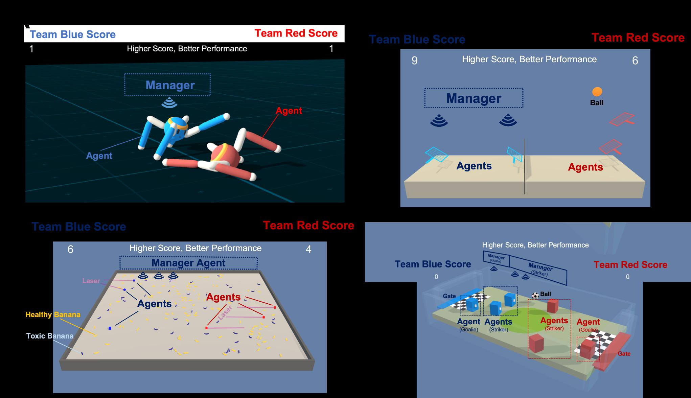

Hierarchical and Non Hierarchical Multi Agent InteractionsBased on Unity
- -
Reinforcement Learning
Zehong Cao Kaichiu Wong
University of Tasmania, University of Tasmania, Australia
Australia kaichiu.wong@utas.edu.au
zhcaonctu@gmail.com
zehong.cao@utas.edu.au
Chin-Teng Lin
Quan Bai University ofTechnology Sydney,
University of Tasmania, Australiachin-teng.lin@uts.edu.au
Australia
OpenAIGym[1]andDeepMindLab[6],whichwere
quan.bai@utas.edu.au
developedto
ABSTRAC
algorithmsarecurrentlyavailable,including
Theopen-sourceUnityplatform, whereagents canbe
trained using hierarchical or non-hierarchical investigate how agents learn complex tasks.
reinforcement learning, supports the use of games However, the above RL platforms, such as OpenAI
and simulations as environments for multiple- agent Gym, lack the ability to flexibly con- figure the
interactions. In this demonstration, we present simulation for multiple agents; therefore, the
hierarchical and non-hierarchical multi-agent simulation environment is an unmodifiable black box
interactions based on Unity rein- forcement learning, from the perspective of the learning system.
specifically, hierarchical reinforcement learn- ing Recently, the Unity platform released a new open-
that sets different levels of agent’s observations to source toolkit [4] developed for creating and
achieve the goal. We created four multi-agent interacting with RL simulation environments. The
scenarios in the Unity environment, namely, Crawler, toolkit enables games and simu-lations to serve as
Tennis, Banana Collector, and Soc- cer, to test the environments for training and testing intelligent RL
interaction performances of hierarchical and non- agents, and these trained agents can be used for
hierarchical reinforcement learning. The simulation- multiple pur- poses, including testing game builds
interaction performances show that hierarchical and evaluating different gamedesigns in multi-agent
reinforcement learning can be applied to multi- interactions.
agent environments and can compete with agents To coordinate and test agent-agent interactions,
trained via non-hierarchical reinforcement learning. we use RL to train agents in a developed
The demonstration video can be viewed at the
environment to achieve an optimisedpolicy. Some
following link: https://youtu.be/YQYQwLPXaL4
state-of-art RL algorithms have been developed to
optimise the training performance, such as proximal
KEYWORDS
policy optimi- sation (PPO) [7], which simplifies the
Unity, Multi-Agent Interactions, Hierarchical, trainingimplementationto handlecomplexscenarios.
Reinforcement Learning Furthermore, to accelerate the learning process and
improvegeneralisation in a multi-agent environment,
1 INTRODUCTION hierarchical reinforcement learning (HRL) was
proposed to learn a policy composed of multiple
Reinforcement learning (RL) typically refers to a
layers, each of which is responsiblefor control at a
goal-oriented al- gorithmthatlearns howto achieve
different level of temporal abstraction [9] [3]. One
complex tasks with mimicinghuman performance.
recent example of an HRL framework is feudal
In the agent training process, an agent ob- serves
networks(FuNs)
the environment and takes actions to receive
[8] proposed by the DeepMind group, which
rewards for accomplishing tasks in the process of
employ a manager module and a worker module for
achieving a goal. The agent ispunished for making
hierarchical training. This frame- work was extended
incorrect decisions and rewarded for making the
by [2] to a method called hierarchical critics
right decisions, which makes this approach one of
assignment (HCA), which assigns a virtual manager
the most reliable training methods [5]. Many
that can be added on top of all worker agents in
platforms that enable users to develop and test RL

| the environment |           | to         | observe       | the            | global    | environment       |             |     |     |     |     |     |     |     |     |
| --------------- | --------- | ---------- | ------------- | -------------- | --------- | ----------------- | ----------- | --- | --- | --- | --- | --- | --- | --- | --- |
| and provide     |           | global     | critic        | signal         |           | to push           | worker      |     |     |     |     |     |     |     |     |
| agents          | towards   | the        | goal.         | Each           | worker    | agent             | must        |     |     |     |     |     |     |     |     |
| observe         | the       | local      | environment   |                | and       | take              | actions     |     |     |     |     |     |     |     |     |
| based           | on local  | and        | global        | critics.       | In        | our investigation |             |     |     |     |     |     |     |     |     |
| of existing     | studies,  |            | wedid         | not            | find any  | methods           | that        |     |     |     |     |     |     |     |     |
| support         | different |            | RL            | types          |           | for               | multi-agent |     |     |     |     |     |     |     |     |
| interaction     | in        | flexible   | environments. |                |           | This              | lack of     |     |     |     |     |     |     |     |     |
| research        | motivated |            | us            | to use         | RL        | (non-hierarchical |             |     |     |     |     |     |     |     |     |
| approach)       | and       | HRL        | (hierarchical |                | approach) |                   | for two     |     |     |     |     |     |     |     |     |
| agent teams     |           | separately |               | to demonstrate |           |                   | the testing |     |     |     |     |     |     |     |     |
performancewithreal-timeinteractions.
| In this | demonstration, |         |     | to       | support |     | interaction |     |     |     |     |     |     |     |     |
| ------- | -------------- | ------- | --- | -------- | ------- | --- | ----------- | --- | --- | --- | --- | --- | --- | --- | --- |
| among   | multiple       | agents, |     | we train | agents  |     | separately  |     |     |     |     |     |     |     |     |
via RL (using the PPOalgorithm)and HRL (using the Figure 1: Multi-agent interactions in four
scenarios
| HCA algorithm) |           | approaches  |                 |            | while        | playing   | aseries |     |     |     |     |     |     |     |     |
| -------------- | --------- | ----------- | --------------- | ---------- | ------------ | --------- | ------- | --- | --- | --- | --- | --- | --- | --- | --- |
| of game        | scenarios |             | in the          | Unity      | environment. |           | We      |     |     |     |     |     |     |     |     |
| developed      | four      | multi-agent |                 | simulation |              | scenarios | in      |     |     |     |     |     |     |     |     |
| the Unity      | platform, |             | namely,Crawler, |            |              | Tennis,   | Banana  |     |     |     |     |     |     |     |     |
Collector and Soccer. The original versions of these 2.1 Crawler
scenarios were designed by Unity: we modified The Crawler scenario is a modified scenario that
them to use RL and HRL algorithms for multi-agent originally allows a single agent to learn to walk in
| interaction |                | tasks. | Our | demonstration |         |     | makes the |            |       |         |         |          |          |     |         |
| ----------- | -------------- | ------ | --- | ------------- | ------- | --- | --------- | ---------- | ----- | ------- | ------- | -------- | -------- | --- | ------- |
|             |                |        |     |               |         |     |           | Unity. As  | shown | in Fig. | 1-A,    | we       | initiate | a   | crawler |
| following   | contributions: |        |     | 1) we         | develop |     | new game  |            |       |         |         |          |          |     |         |
|             |                |        |     |               |         |     |           | agent with | two   | arms    | and two | forearms |          | and | create  |
environments to assist with RL and HRL designs and the logic for agents to learn to fight and compete
interactions for testing multi-agent systems; 2) the with each otherduring the training progress. The
| agents    | trained | by    | HRL             | achieve | better    | performance |             |              |              |            |     |          |             |        |         |
| --------- | ------- | ----- | --------------- | ------- | --------- | ----------- | ----------- | ------------ | ------------ | ---------- | --- | -------- | ----------- | ------ | ------- |
|           |         |       |                 |         |           |             |             | agents       | are required |            | to  | learn    | to maintain |        | their   |
| with high | scores  |       | in competition- |         | based     |             | interaction |              |              |            |     |          |             |        |         |
|           |         |       |                 |         |           |             |             | body balance |              | and to     | not | touch    | the         | ground | while   |
| games;    | and     | 3) we | consider        | the     | potential |             | impact on   |              |              |            |     |          |             |        |         |
|           |         |       |                 |         |           |             |             | walking      | to the       | opponent’s |     | position |             | and    | then to |
applications in multi-agent competitions. fight against the opponent and cause the
challengertolosetheirbalancetoobtainareward.
| 2 DEMONSTRATION |     |     |     | SCENARIOS |     |     |     |              |     |       |        |        |             |     |     |
| --------------- | --- | --- | --- | --------- | --- | --- | --- | ------------ | --- | ----- | ------ | ------ | ----------- | --- | --- |
|                 |     |     |     |           |     |     |     | In addition, | as  | shown | in the | GitHub | repository, |     | the |
In the Unity platform with a new open-source task goal, agent reward function, and behaviour
toolkit [4], we de- veloped four multi-agent parameters, including action and observation
scenarios as shown in Fig. 1, namely, Crawler, spaces, are defined for the crawler agents.
| Tennis,     | Banana | Collector   |             | and          | Soccer, | to          | simulate |            |             |      |         |             |       |         |       |
| ----------- | ------ | ----------- | ----------- | ------------ | ------- | ----------- | -------- | ---------- | ----------- | ---- | ------- | ----------- | ----- | ------- | ----- |
| multi-      | agent  | competitive |             | interactions |         |             | 1 . The  | 2.2 Tennis |             |      |         |             |       |         |       |
| experiments |        | in each     | scenarioare |              | defined |             | in terms |            |             |      |         |             |       |         |       |
|             |        |             |             |              |         |             |          | Tennis     | competition |      | is used |             | as an | example | to    |
| of two      | agent  | teams:      | the         | blue         | team    | and         | the red  |            |             |      |         |             |       |         |       |
|             |        |             |             |              |         |             |          | simulate   | a sports    | game |         | of bouncing |       | a ball  | to an |
| team.       | Agents | from        | the         | blue         | team    | are trained | via      |            |             |      |         |             |       |         |       |
HRL (hierarchical approach), whereas agents from opponent’s area in a multi-agent
| the red | team | are | trained | via | RL (non-hierarchical |     |     |              |     |            |     |     |          |     |         |
| ------- | ---- | --- | ------- | --- | -------------------- | --- | --- | ------------ | --- | ---------- | --- | --- | -------- | --- | ------- |
|         |      |     |         |     |                      |     |     | environment. |     | The agents |     | are | required | to  | control |
approach). Each agent targets a specific scenario the movement of a racket to ensure that the ball
| goal to        | receive | the | maximum                    |     | game | score,          | and |            |           |            |              |               |              |             |           |
| -------------- | ------- | --- | -------------------------- | --- | ---- | --------------- | --- | ---------- | --------- | ---------- | ------------ | ------------- | ------------ | ----------- | --------- |
|                |         |     |                            |     |      |                 |     | does not   | drop      | or fall    | outside      | ofthe         |              | boundaries  | on        |
| the game       | scores  |     | are recorded               |     | for  | the pre-trained |     |            |           |            |              |               |              |             |           |
|                |         |     |                            |     |      |                 |     | their side | of        | the field. |              | As an         | extension    |             | of the    |
| RLandHRLagents |         |     | duringtheinteractionstage. |     |      |                 |     |            |           |            |              |               |              |             |           |
|                |         |     |                            |     |      |                 |     | original   | scenario, | as         | shown        | in Fig.       | 1-B,         | we          | increased |
|                |         |     |                            |     |      |                 |     | the number | ofagents  |            | to two       | each          | on           | the         | blue and  |
|                |         |     |                            |     |      |                 |     | red teams, | where     | the        | blue         | team,assigned |              | to          | the HRL   |
|                |         |     |                            |     |      |                 |     | scenario,  | has       | a virtual  | manager      |               | on top       | of the      | agents    |
|                |         |     |                            |     |      |                 |     | to observe | the       | global     | environment. |               | Furthermore, |             | as        |
|                |         |     |                            |     |      |                 |     | shown      | in the    | GitHub     | repository,  |               | the task     | goal,       | agent     |
|                |         |     |                            |     |      |                 |     | reward     | function, |            | and          | behaviour     |              | parameters, |           |
|                |         |     |                            |     |      |                 |     | including  | action    | and        | observation  |               | spaces,      | aredefined  |           |
forthe tennisagents.
|     |     |     |     |     |     |     |     | 2.3 Banana  |           | Collector |          |        |           |          |          |
| --- | --- | --- | --- | --- | --- | --- | --- | ----------- | --------- | --------- | -------- | ------ | --------- | -------- | -------- |
|     |     |     |     |     |     |     |     | The Banana  |           | Collector | scenario |        | involves  |          | multiple |
|     |     |     |     |     |     |     |     | agents      | competing | to        | collect  | target |           | bananas. | The      |
|     |     |     |     |     |     |     |     | environment |           | consists  | of       | two    | different |          | types of |
|     |     |     |     |     |     |     |     | banana,     | healthy   | bananas   |          | and    | toxic     | bananas. | Each     |

agent must learn how to move and collect as many withDynamicTermination.InProceedingsofthe18thInternational
|     |     |     |     |     |     |     |     | Conference | on  | Autonomous | Agents | and | Multi- Agent | Systems. |
| --- | --- | --- | --- | --- | --- | --- | --- | ---------- | --- | ---------- | ------ | --- | ------------ | -------- |
healthy (yellow) ba- nanas as possible while International Foundation for Autonomous Agents and Multiagent
avoiding toxic (purple) bananas. When an agent Systems,2006–2008.
touches and collects a toxic banana, the agent is [4]Arthur Juliani, Vincent-Pierre Berges, Esh Vckay, Yuan Gao,
|        |         |     |      |           |     |         |         | Hunter  | Henry,   | Marwan Mattar, | and         | Danny   | Lange. | 2018. Unity: A |
| ------ | ------- | --- | ---- | --------- | --- | ------- | ------- | ------- | -------- | -------------- | ----------- | ------- | ------ | -------------- |
| frozen | for 20s | and | then | continues | to  | collect | healthy |         |          |                |             |         |        |                |
|        |         |     |      |           |     |         |         | general | platform | for            | intelligent | agents. | arXiv  | preprint       |
bananas. As shown in Fig. 1-C, we create a arXiv:1809.02627(2018).
|         |     |        |               |     |        |     |            | [5]Leslie | Pack Kaelbling, | Michael             | L   | Littman,  | and Andrew | W Moore.      |
| ------- | --- | ------ | ------------- | --- | ------ | --- | ---------- | --------- | --------------- | ------------------- | --- | --------- | ---------- | ------------- |
| manager | on  | top of | the blue-team |     | agents |     | trained by |           |                 |                     |     |           |            |               |
|         |     |        |               |     |        |     |            | 1996.     | Rein-           | forcement learning: |     | A survey. | Journal    | of artificial |
HRL to observe the global environment. We also intelligenceresearch4(1996),
| define | the task | goal, | agent |     | reward | function, | and | 237–285. |     |     |     |     |     |     |
| ------ | -------- | ----- | ----- | --- | ------ | --------- | --- | -------- | --- | --- | --- | --- | --- | --- |
behaviour parameters, including action and [6]Joel Z Leibo, Cyprien de Masson d’Autume, Daniel Zoran, David
|             |                      |        |     |     |           |         |     | Amos,         | Charles   | Beattie,         | Keith      | Anderson,                | Antonio          | García   |
| ----------- | -------------------- | ------ | --- | --- | --------- | ------- | --- | ------------- | --------- | ---------------- | ---------- | ------------------------ | ---------------- | -------- |
| observation |                      | spaces | for | the | collector | agents, | as  |               |           |                  |            |                          |                  |          |
|             |                      |        |     |     |           |         |     | Castañeda,    | Manuel    | Sanchez,         | Simon      | Green,AudrunasGruslys,et |                  |          |
|             |                      |        |     |     |           |         |     | al. 2018.     | Psychlab: | a                | psychology |                          | laboratory       | for deep |
| shownin     | theGitHubrepository. |        |     |     |           |         |     |               |           |                  |            |                          |                  |          |
|             |                      |        |     |     |           |         |     | reinforcement |           | learning agents. | arXiv      | preprint                 | arXiv:1801.08116 |          |
(2018).
2.4 Soccer [7]John Schulman,Filip Wolski,Prafulla Dhariwal, Alec Radford, and
|     |     |     |     |     |     |     |     | Oleg Klimov.2017. |     | Proximal | policy | optimization | algorithms. | arXiv |
| --- | --- | --- | --- | --- | --- | --- | --- | ----------------- | --- | -------- | ------ | ------------ | ----------- | ----- |
As shown in Fig. 1-D, we create a two agent teams preprintarXiv:1707.06347(2017).
|     |     |     |     |     |     |     |     | [8]Alexander | Sasha | Vezhnevets, | Simon | Osindero, |     | Tom Schaul, |
| --- | --- | --- | --- | --- | --- | --- | --- | ------------ | ----- | ----------- | ----- | --------- | --- | ----------- |
Soccerscenarioinwhichtheagentsaimtoattackthe
NicolasHeess,MaxJaderberg,DavidSilver,andKorayKavukcuoglu.
other team’s gate and defences without the ball 2017. Feudal networks for hierar- chical reinforcement learning. In
being kicked into their own gate. Each team has two Proceedings of the 34th International Conference on Machine
types of agents, a goalie and a striker, who aim to Learning-Volume70.JMLR.org,3540–3549.
[9]FangkaiYang,DaomingLyu,BoLiu,andStevenGustafson.2018.
| defend | their | own gate | and | score | by  | attacking | the |        |       |                  |     |          |     |              |
| ------ | ----- | -------- | --- | ----- | --- | --------- | --- | ------ | ----- | ---------------- | --- | -------- | --- | ------------ |
|        |       |          |     |       |     |           |     | Peorl: | Inte- | grating symbolic |     | planning | and | hierarchical |
arXiv
opponent’s gate, respectively. For the blue-team reinforcement learning for robust decision-making.
preprintarXiv:1804.07779(2018).
| agents,      | we add | a         | virtual     | manager       |         | to obtain   | global     |     |     |     |     |     |     |     |
| ------------ | ------ | --------- | ----------- | ------------- | ------- | ----------- | ---------- | --- | --- | --- | --- | --- | --- | --- |
| observations |        | and give  | critics     | of            | the     | agents’     | actions.   |     |     |     |     |     |     |     |
| As presented |        | inthe     | GitHub      | repository,   |         | the         | task goal, |     |     |     |     |     |     |     |
| agent        | reward | function, |             | and behaviour |         | parameters, |            |     |     |     |     |     |     |     |
| including    | action | and       | observation |               | spaces, | aredefined  |            |     |     |     |     |     |     |     |
forthesocceragents.
3 CONCLUSION
| In summary,          |                 | our        | demonstration |                | shows       |              | that the   |     |     |     |     |     |     |     |
| -------------------- | --------------- | ---------- | ------------- | -------------- | ----------- | ------------ | ---------- | --- | --- | --- | --- | --- | --- | --- |
| Unity platform       |                 | can        | support       | the            | development |              | of new     |     |     |     |     |     |     |     |
| games                | and simulations |            | for           | RL             | andHRL      | environments |            |     |     |     |     |     |     |     |
| with multi-agent     |                 |            | interactions. |                | We          | created      | four       |     |     |     |     |     |     |     |
| scenarios            | with            | multiple   |               | agents         |             | in           | the Unity  |     |     |     |     |     |     |     |
| environment,         |                 | namely,    |               | Crawler,       |             | Tennis,      | Banana     |     |     |     |     |     |     |     |
| Collector,           | and             | Soccer.    | We            | also presented |             | hi-          | erarchical |     |     |     |     |     |     |     |
| and non-hierarchical |                 |            | multi-agent   |                |             | interactions | by         |     |     |     |     |     |     |     |
| means                | of RL           | and HRL    | algorithms    |                | and         | showed       | that       |     |     |     |     |     |     |     |
| the HRL-trained      |                 | agentswith |               | a              | virtual     | manager      | that       |     |     |     |     |     |     |     |
| can observe          |                 | global     | information   |                |             | achieve      | better     |     |     |     |     |     |     |     |
| performance          |                 | with       | higher        |                | game        | scores       | as         |     |     |     |     |     |     |     |
| demonstrating        |                 | in         | the           | video.         | We          | believe      | our        |     |     |     |     |     |     |     |
| demonstration        |                 | has        | a             | potential      | impact      |              | on high    |     |     |     |     |     |     |     |
| attentions           | to              | HRL        | and the       | relevant       |             | applications | in         |     |     |     |     |     |     |     |
multi-agentcompetitions.
ACKNOWLEDGMENTS
| This research  |             | was sponsored |           | in  | part   | by the       | Office of |     |     |     |     |     |     |     |
| -------------- | ----------- | ------------- | --------- | --- | ------ | ------------ | --------- | --- | --- | --- | --- | --- | --- | --- |
| Naval Research |             | Global,       | US,       | and | was    | accomplished |           |     |     |     |     |     |     |     |
| under          | Cooperative |               | Agreement |     | Number |              | ONRG -    |     |     |     |     |     |     |     |
NICOP-N62909-19-1-2058.
REFERENCES
| [1]Greg    | Brockman, | Vicki           | Cheung, |           | Ludwig | Pettersson, | Jonas    |     |     |     |     |     |     |     |
| ---------- | --------- | --------------- | ------- | --------- | ------ | ----------- | -------- | --- | --- | --- | --- | --- | --- | --- |
| Schneider, |           | John Schul-man, |         | Jie Tang, | and    | Wojciech    | Zaremba. |     |     |     |     |     |     |     |
2016.Openaigym.arXivpreprintarXiv:1606.01540(2016).
| [2]Zehong | Cao | and Chin-Teng |     | Lin. 2019. | Reinforcement |     | Learning |     |     |     |     |     |     |     |
| --------- | --- | ------------- | --- | ---------- | ------------- | --- | -------- | --- | --- | --- | --- | --- | --- | --- |
fromHierarchicalCritics.arXivpreprintarXiv:1902.03079(2019).
| [3]DonggeHan, |                  | Wendelin | Boehmer, |              | Michael       | Wooldridge,and | Alex     |     |     |     |     |     |     |     |
| ------------- | ---------------- | -------- | -------- | ------------ | ------------- | -------------- | -------- | --- | --- | --- | --- | --- | --- | --- |
| Rogers.       | 2019.Multi-Agent |          |          | Hierarchical | Reinforcement |                | Learning |     |     |     |     |     |     |     |

## Extracted Images

### Page 2

