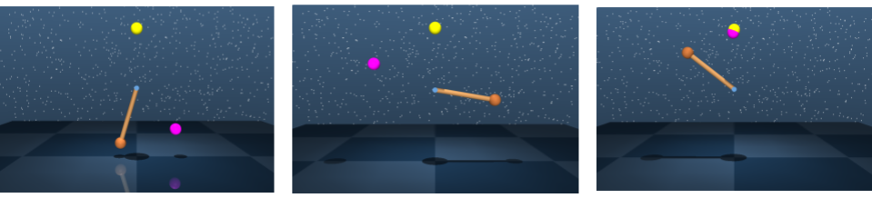
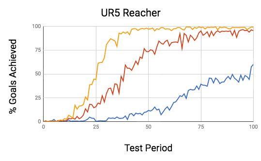
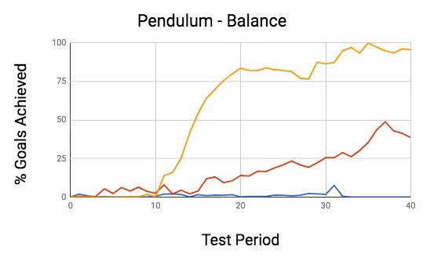
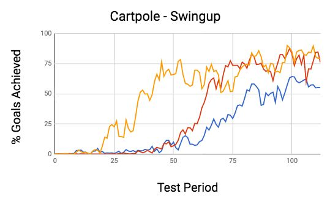
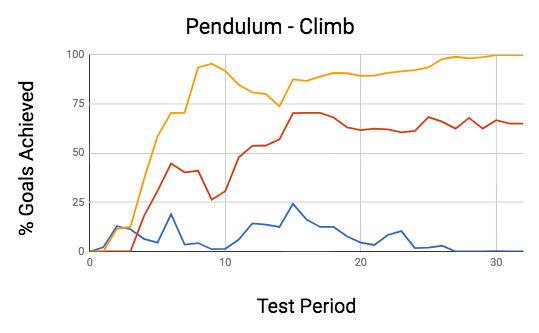
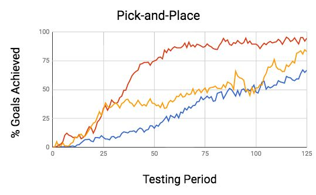

|     |     |     | Hierarchical |              | Actor-Critic |     |     |     |
| --- | --- | --- | ------------ | ------------ | ------------ | --- | --- | --- |
|     |     |     | AndrewLevy1  | RobertPlatt2 | KateSaenko1  |     |     |     |
Abstract sequencesofactionsaremoredifficulttolearn,particularly
|     |     |     |     |     | whenrewardsaresparse. | Theprocessofpropagatingback |     |     |
| --- | --- | --- | --- | --- | --------------------- | --------------------------- | --- | --- |
Theabilitytolearnatdifferentresolutionsintime
mayhelpovercomeoneofthemainchallengesin Q-valuesfromtheactionsthatproducethesparserewardto
|     |     |     |     |     | theprecedingactionstakeslonger. |     | Theissueoflong-term |     |
| --- | --- | --- | --- | --- | ------------------------------- | --- | ------------------- | --- |
deepreinforcementlearning—sampleefficiency.
8102 beF 82  ]IA.sc[  3v84900.2171:viXra
Hierarchicalagentsthatoperateatdifferentlev- creditassignmentalsobecomesmoresevereastheaction-
elsoftemporalabstractioncanlearntasksmore valuefunctionneedstolearnQ-valuesforalargerportion
|     |     |     |     |     | of the state-action | space. | Second, learning | at the lowest |
| --- | --- | --- | --- | --- | ------------------- | ------ | ---------------- | ------------- |
quicklybecausetheycandividetheworkoflearn-
ing behaviors among multiple policies and can levelrestrainsexploration. Agentsthatcanproposehigher
levelsubgoalscanmorequicklydeterminethedistantstates
| alsoexploretheenvironmentatahigherlevel. |     |     |     | In  |                                                |     |     |         |
| ---------------------------------------- | --- | --- | --- | --- | ---------------------------------------------- | --- | --- | ------- |
|                                          |     |     |     |     | thatarehelpfulinachievingcertainbehaviorgoals. |     |     | Afaster |
thispaper,wepresentanovelapproachtohierar-
chicalreinforcementlearningcalledHierarchical explorationofthestatespaceoftheenvironmentmayspeed
uptheprocessoflearningarobustpolicy.
Actor-Critic(HAC)thatenablesagentstolearnto
breakdownproblemsinvolvingcontinuousaction
YetmostexistinghierarchicalRLmethodsdonotprovide
spacesintosimplersubproblemsbelongingtodif-
anapproachforbreakingdowntasksinvolvingcontinuous
| ferenttimescales. |     | HAChastwokeyadvantages |     |     |     |     |     |     |
| ----------------- | --- | ---------------------- | --- | --- | --- | --- | --- | --- |
actionspacesthatguaranteesshorterpoliciesateachlevel
overmostexistinghierarchicallearningmethods:
|     |     |     |     |     | ofabstractionandisend-to-end. |     | Mostcurrenthierarchical |     |
| --- | --- | --- | --- | --- | ----------------------------- | --- | ----------------------- | --- |
(i)thepotentialforfasterlearningasagentslearn approachesonlyenableagentstolearnathigherlevelsifthe
shortpoliciesateachlevelofthehierarchyand
actionspaceisdiscrete(Dayan&Hinton,1993)(Vezhnevets
| (ii)anend-to-endapproach. |     |     | Wedemonstratethat |     |              |                                          |     |     |
| ------------------------- | --- | --- | ----------------- | --- | ------------ | ---------------------------------------- | --- | --- |
|                           |     |     |                   |     | etal.,2017). | Further,manyexistinghierarchicallearning |     |     |
HACsignificantlyaccelerateslearninginaseries
approachesdonotimplementhierarchicalagentsthatequi-
| of  | tasks that require | behavior | over a relatively |     |     |     |     |     |
| --- | ------------------ | -------- | ----------------- | --- | --- | --- | --- | --- |
tablydivideuptheworkoflearningabehavioramongthe
longtimehorizonandinvolvesparserewards. agent’smultiplepolicies. Forinstance, manyapproaches
|     |     |     |     |     | choose to | decompose problems | into smaller | state spaces |
| --- | --- | --- | --- | --- | --------- | ------------------ | ------------ | ------------ |
ratherthanintosmallertimescales(Dayan&Hinton,1993).
1.Introduction
Thiscanbeproblematicincontinuousactionspaceenviron-
Despitemajorsuccessesinbothsimulatedandreal-world mentsasapolicythatactswithinasmallregionofthestate
spacemayneedalengthysequenceofactionstoescapethat
tasks,akeyproblemwithmanydeepreinforcementlearning
(RL)algorithmsisthattheyareslow. Learningisparticu- region. Mostexistinghierarchicalapproachesalsorequire
larly slow when the rewards granted to agents are sparse. non-trivialmanualworkincludingdesigningnon-sparsere-
wardfunctions,preselectingthesetofpossiblehigherlevel
Onemajorreasonforreinforcementlearning’spoorsample
efficiencyisthatmanyexistingalgorithmsforceagentsto subgoals rather than learning them from experience, and
|          |                  |             |              |         | staggering | the training of | different policies | (Sutton et al., |
| -------- | ---------------- | ----------- | ------------ | ------- | ---------- | --------------- | ------------------ | --------------- |
| learn at | the lowest level | of temporal | abstraction. | For in- |            |                 |                    |                 |
stance,ifasimulatedrobotagentisgivenataskinvolving 1999)(Kulkarnietal.,2016).
locomotion,theagentwillneedtolearntheentiresequence
Inthispaper,weintroduceanovelapproachtohierarchi-
ofjointtorquestoaccomplishthetask(Lillicrapetal.,2015)
calreinforcementlearningcalledHierarchicalActor-Critic
insteadoftryingtobreaktheproblemdownatahigherlevel.
(HAC).Thealgorithmenablesagentstolearntodividetasks
Learningexclusivelyatlowlevelsofabstractionslowsdown involvingcontinuousstateandactionspacesintosimpler
| learningfortwokeyreasons. |     | First,agentsmustlearnlonger |     |     |                                         |     |             |     |
| ------------------------- | --- | --------------------------- | --- | --- | --------------------------------------- | --- | ----------- | --- |
|                           |     |                             |     |     | problemsbelongingtodifferenttimescales. |     | HACachieves |     |
sequencesofactionsinordertoachievethedesiredbehav-
thisobjectivebyimplementingagentsthatlearnmultiple
ior. Thisisproblematicbecausepoliciesinvolvinglonger
|     |     |     |     |     | policiesinparallel. | Eachsuccessivepolicyinthehierarchy |     |     |
| --- | --- | --- | --- | --- | ------------------- | ---------------------------------- | --- | --- |
1DepartmentofComputerScience,BostonUniversity,Boston, is responsible for learning how to break down problems
MA,USA2CollegeofInformationandComputerScience,North- into subproblems with increasingly fine time resolutions.
easternUniversity,Boston,MA,USA. Figure1shouldprovidesomeintuitiononhowHACagents
|     |     |     |     |     | learn at different | time scales. | The figure shows | an agent |
| --- | --- | --- | --- | --- | ------------------ | ------------ | ---------------- | -------- |

HierarchicalActor-Critic
Start Goal action. Eachgoal-basedactornetworklearnslimitedlength
policiesthatoperateatdifferenttimeresolutionsduetoa
High-Level criticalfeatureofthealgorithm—timelimits. Eachactor
|     | Policy |     |     |     |     | networkhasonlyacertainnumberofactionstoachieveits |     |                               |     |     |     |     |
| --- | ------ | --- | --- | --- | --- | ------------------------------------------------- | --- | ----------------------------- | --- | --- | --- | --- |
|     |        |     |     |     |     | higherlevelinputgoal.                             |     | Section3explainshowtimelimits |     |     |     |     |
enableeachactornetworktospecializeinadifferenttime
Goal
scale.
| Mid-Level |     |     |     |     |     | AnotherkeyadvantageofHACisthatitprovidesanend-to- |     |     |     |     |     |     |
| --------- | --- | --- | --- | --- | --- | ------------------------------------------------- | --- | --- | --- | --- | --- | --- |
Policy
|     |     |     |     |     |     | endhierarchicallearningapproach.               |          |       |          | HAClearnstoseparate |            |     |
| --- | --- | --- | --- | --- | --- | ---------------------------------------------- | -------- | ----- | -------- | ------------------- | ---------- | --- |
|     |     |     |     |     |     | goals into                                     | subgoals | using | just the | agent’s             | experience | and |
|     |     |     |     |     |     | thealgorithmonlyrequiressparserewardfunctions. |          |       |          |                     |            | The |
hierarchicalpoliciesarealsolearnedinparallelanddonot
Goal
needtobelearnedindifferentphases.
Low-Level For this paper, we ran a series of experiments compar-
Policy
|     |     |     |     |     |     | ing the          | performance | of           | agents     | that did  | and | did not use |
| --- | --- | --- | --- | --- | --- | ---------------- | ----------- | ------------ | ---------- | --------- | --- | ----------- |
|     |     |     |     |     |     | the Hierarchical |             | Actor-Critic | algorithm. |           | The | tasks exam- |
|     |     |     |     |     |     | ined include     | pendulum,   |              | reacher,   | cartpole, | and | pick-and-   |
Time
|     |     |     |     |     |     | placeenvironments. |              | Ineachtask,agentsthatusedHierar- |     |              |     |            |
| --- | --- | --- | --- | --- | --- | ------------------ | ------------ | -------------------------------- | --- | ------------ | --- | ---------- |
|     |     |     |     |     |     | chical             | Actor-Critic | significantly                    |     | outperformed |     | those that |
Figure1.Example HAC Hierarchy. Agent in figure uses three did not. In some tasks, the use of Hierarchical Actor-
policiestolearnabehavior. Eachpolicyspecializesinbreaking Critic appears to be the difference between consistently
downproblemsintosubproblemswithfinertimeresolutions. solving a task and rarely solving a task. A video show-
|     |     |     |     |     |     | ing the | results | of our experiments |     | is available |     | at https: |
| --- | --- | --- | --- | --- | --- | ------- | ------- | ------------------ | --- | ------------ | --- | --------- |
//www.youtube.com/watch?v=m3EYeBpGepo.
| thatusesthreepoliciestoaccomplishsomebehavior. |       |           |     |                  |     | The  |     |     |     |     |     |     |
| ---------------------------------------------- | ----- | --------- | --- | ---------------- | --- | ---- | --- | --- | --- | --- | --- | --- |
| solid vertical                                 | lines | represent | the | time resolutions | of  | sub- |     |     |     |     |     |     |
2.Background
| goals output | by  | each policy. | The | more distance | there | is  |     |     |     |     |     |     |
| ------------ | --- | ------------ | --- | ------------- | ----- | --- | --- | --- | --- | --- | --- | --- |
betweenconsecutiveverticallines,themoretimetheagent
HierarchicalActor-Criticbuildsoffthreetechniquesfrom
hastoachieveeachsubgoal. Thelow-levelpolicyoutputs thereinforcementlearningliterature: (i)theDeepDetermin-
actualagentactionssotheverticallinesforthelow-level
isticPolicyGradient(DDPG)learningalgorithm(Lillicrap
policycanbeinterpretedassubgoalsrequiringoneaction. etal.,2015),(ii)UniversalValueFunctionApproximators
Inthefigure,thehigh-levelpolicybreaksdowntheendgoal (UVFA)(Schauletal.,2015),and(iii)HindsightExperience
| into three | subgoals | with | relatively | large time | resolutions. |     |     |     |     |     |     |     |
| ---------- | -------- | ---- | ---------- | ---------- | ------------ | --- | --- | --- | --- | --- | --- | --- |
Replay(HER)(Andrychowiczetal.,2017).
Themid-levelpolicyspecializesindividingeachsubgoal
DDPGservesasthekeylearninginfrastructurewithinHier-
fromthehigh-levelpolicyintothreesubgoalsbelongingto
archicalActor-Critic.DDPGisanactor-criticalgorithmand
| shortertimescales. |     | Finally,thelow-levelpolicyspecializes |     |     |     |     |     |     |     |     |     |     |
| ------------------ | --- | ------------------------------------- | --- | --- | --- | --- | --- | --- | --- | --- | --- | --- |
thususestwoneuralnetworkstoenableagentstolearnfrom
indecomposingeachsubgoalfromthemid-levelpolicyinto
threeagentactions,whichrepresentthesmallesttimereso- experience. Theactornetworklearnsadeterministicpolicy
|     |     |     |     |     |     | that maps | from | states to | actions | π : S | → A. | The critic |
| --- | --- | --- | --- | --- | --- | --------- | ---- | --------- | ------- | ----- | ---- | ---------- |
lution. Acrucialbenefitofhavingeachpolicyspecializein
|     |     |     |     |     |     | network | approximates | the | Q-function |     | or the | action-value |
| --- | --- | --- | --- | --- | --- | ------- | ------------ | --- | ---------- | --- | ------ | ------------ |
breakingdowngoalsofparticulartimescaleintosubgoals
Qπ(s
|     |     |     |     |     |     | function | of the | current policy |     | t ,a | t ) = | E[R t |s t ,a t ], |
| --- | --- | --- | --- | --- | --- | -------- | ------ | -------------- | --- | ---- | ----- | ------------------ |
ofacertainsmallertimescaleisthatthepoliciesthatare
|                  |             |                |      |               |             | in which        | R is    | the discounted |                | sum | of future | rewards      |
| ---------------- | ----------- | -------------- | ---- | ------------- | ----------- | --------------- | ------- | -------------- | -------------- | --- | --------- | ------------ |
| learned          | are limited | in length.     | This | is beneficial | because     |                 | t       |                |                |     |           |              |
|                  |             |                |      |               |             | (cid:80)∞ γi−tr | . Thus, | the            | critic network |     | maps      | from (state, |
| shorter policies |             | can be learned |      | more quickly  | than longer |                 | i       |                |                |     |           |              |
i=t
action)pairstoexpectedlong-termrewardQ:S×A→R.
ones. Further,havingmultiplepoliciesthatoperateatdif-
Inordertolearnanear-optimalpolicythatresultsinlarge
| ferent levels | of  | temporal | abstraction | is helpful | because | it  |     |     |     |     |     |     |
| ------------- | --- | -------- | ----------- | ---------- | ------- | --- | --- | --- | --- | --- | --- | --- |
expectedlong-termreward,DDPGfollowsacyclicalpro-
| enableshigh-levelexploration, |     |     |     | whichcanalsoaccelerate |     |                         |     |     |                            |     |     |     |
| ----------------------------- | --- | --- | --- | ---------------------- | --- | ----------------------- | --- | --- | -------------------------- | --- | --- | --- |
|                               |     |     |     |                        |     | cesscomposedoftwosteps: |     |     | (i)policyevaluationand(ii) |     |     |     |
learning.
|     |     |     |     |     |     | policy | improvement. | In  | the policy | evaluation |     | phase, the |
| --- | --- | --- | --- | --- | --- | ------ | ------------ | --- | ---------- | ---------- | --- | ---------- |
HierarchicalActor-Critichelpsagentslearnahierarchyof
|     |     |     |     |     |     | agent first | interacts | with | the environment |     | for | a period of |
| --- | --- | --- | --- | --- | --- | ----------- | --------- | ---- | --------------- | --- | --- | ----------- |
policiessimilartoFigure1usingasetofactor-criticnet- time using a noisy policy π(s)+N(0,1), in which N(·)
works. Eachactor-criticnetworkisresponsibleforlearning
|     |     |     |     |     |     | is some | normal | distribution. | The | transitions |     | experienced |
| --- | --- | --- | --- | --- | --- | ------- | ------ | ------------- | --- | ----------- | --- | ----------- |
one of the policies within the hierarchy. The policies or arestoredas(s ,a ,r ,s )tuplesinareplaybuffer. The
|     |     |     |     |     |     |     | t   | t t t+1 |     |     |     |     |
| --- | --- | --- | --- | --- | --- | --- | --- | ------- | --- | --- | --- | --- |
actornetworksthatarelearnedaregoal-based,meaningthat agentthenupdatesitsapproximationoftheQ-functionof
theytakeasinputthecurrentstateandagoalandoutputan

HierarchicalActor-Critic
| the current                  | policy | by performing |                            | mini-batch |        | gradient de- |     |        |     |     |     |     |     |
| ---------------------------- | ------ | ------------- | -------------------------- | ---------- | ------ | ------------ | --- | ------ | --- | --- | --- | --- | --- |
| scentonthelossfunctionL=(Q(s |        |               |                            | ,a         | )−y    | )2,inwhich   |     | Action |     |     |     |     |     |
|                              |        |               |                            | t          | t t    |              |     |        |     |     |     |     |     |
| the target                   | y t is | the Bellman   | estimate                   |            | of the | Q-function   |     |        |     |     |     |     |     |
| y = r +γQ(s                  |        | ,π(s          | )). Inthepolicyimprovement |            |        |              |     |        |     |     |     |     |     |
| t t                          |        | t+1 t+1       |                            |            |        |              |     |        |     |     |     |     |     |
phase,theagentmodifiesitspolicybasedontheupdated
|     |     |     |     |     |     |     |     | Neural  |     | Low-Level  |     |     |     |
| --- | --- | --- | --- | --- | --- | --- | --- | ------- | --- | ---------- | --- | --- | --- |
approximationoftheaction-valuefunction. Theactorfunc- Network Actor
tionistrainedbymovingitsparametersinthedirectionof
| thegradientofQw.r.t. |     | theactorsparameters. |     |     |     |     |     |     |     |     |     |     |     |
| -------------------- | --- | -------------------- | --- | --- | --- | --- | --- | --- | --- | --- | --- | --- | --- |
UniversalValueFunctionApproximatorsisasecondidea State Subgoal
thatiscriticaltoHAC.UVFAextendstheaction-valuefunc-
| tiontoincorporategoals.          |           |        | TheQ-functionnowrepresents |           |       |                     |     |     |         |     |             |       |     |
| -------------------------------- | --------- | ------ | -------------------------- | --------- | ----- | ------------------- | --- | --- | ------- | --- | ----------- | ----- | --- |
| the expected                     | long-term | reward |                            | of taking | an    | action given        |     |     |         |     |             |       |     |
| thecurrentstateandgoalQπ(s       |           |        |                            |           |       |                     |     |     | Neural  |     | High-Level  |       |     |
|                                  |           |        | t                          | ,a t ,g t | )=E[R | t |s t ,a t ,g t ]. |     |     |         |     |             |       |     |
|                                  |           |        |                            |           |       |                     |     |     | Network |     |             | Actor |     |
| Eachgoalhasitsownrewardfunctionr |           |        |                            |           | (s ,a | ,s )and             |     |     |         |     |             |       |     |
|                                  |           |        |                            |           | g t   | t t+1               |     |     |         |     |             |       |     |
| discountfunctionγ                |           | (s).   | γ (s)=0whentheagentisina   |           |       |                     |     |     |         |     |             |       |     |
|                                  |           | g      | g                          |           |       |                     |     |     |         |     |             |       |     |
statethatachievestheprescribedgoalasthecurrentstate
can be viewed as a terminating one. Goals are critical to State Goal
HACbecausegoalsareoftenhierarchicalandcanbebroken
| downintosubgoals. |     | Goalsarealsousefulbecausetheycan |     |     |     |     |     |     |     |     |     |     |     |
| ----------------- | --- | -------------------------------- | --- | --- | --- | --- | --- | --- | --- | --- | --- | --- | --- |
beusedeasilywithsparseandbinaryrewardfunctions. Figure2. Hierarchicalpolicywith1subgoallayer
HindsightExperienceReplayisanothercomponentfrom
thereinforcementlearningliteraturethatisintegraltoHi-
3.1.Architecture
| erarchicalActor-Critic. |              | HERhelpsagentslearngoal-based |        |        |           |     |               |        |           |     |          |                |     |
| ----------------------- | ------------ | ----------------------------- | ------ | ------ | --------- | --- | ------------- | ------ | --------- | --- | -------- | -------------- | --- |
| policies                | more quickly | when                          | sparse | reward | functions | are |               |        |           |     |          |                |     |
|                         |              |                               |        |        |           |     | The objective | of the | algorithm | is  | to learn | a hierarchical |     |
used. TheideabehindHERisthateventhoughanagent policy like the one shown in Figure 2. The hierarchical
mayhavefailedtoachieveitsgivengoalinanepisode,the
policyiscomposedofmultiplegoal-basedpoliciesoractor
| agent did | learn | a sequence | of actions |     | to achieve | a differ- |           |            |         |       |          |             |     |
| --------- | ----- | ---------- | ---------- | --- | ---------- | --------- | --------- | ---------- | ------- | ----- | -------- | ----------- | --- |
|           |       |            |            |     |            |           | networks. | Each actor | network | takes | as input | the current |     |
ent objective in hindsight — the state in which the agent stateandhigherlevelgoalandoutputsanactionbelonging
| finished. | Learning | how | to achieve | different |     | goals in the |                         |     |                             |     |     |     |     |
| --------- | -------- | --- | ---------- | --------- | --- | ------------ | ----------------------- | --- | --------------------------- | --- | --- | --- | --- |
|           |          |     |            |           |     |              | toaparticulartimescale. |     | Forthesubgoalactornetworks, |     |     |     |     |
goalspaceshouldhelptheagentbetterdeterminehowto such as the bottom network in Figure 2, this action is a
achievetheoriginalgoal. HindsightExperienceReplayis proposedsubgoal. Theproposedsubgoalisadesiredfuture
implementedbycreatingaseparatecopyofthetransitions
|     |     |     |     |     |     |     | state or set | of future | states | for the | agent. | For the | actor |
| --- | --- | --- | --- | --- | --- | --- | ------------ | --------- | ------ | ------- | ------ | ------- | ----- |
(s t ,a t ,r t ,s t+1 ,g)thatoccurredinanepisodeandreplacing networkoperatingatthelowestlevelofabstraction,such
(i)theoriginalgoalwiththegoalachievedinhindsightand
|     |     |     |     |     |     |     | as the top | network in | Figure | 2, the | action | is the agent’s |     |
| --- | --- | --- | --- | --- | --- | --- | ---------- | ---------- | ------ | ------ | ------ | -------------- | --- |
(ii)theoriginalrewardwiththeappropriatevaluegiventhe actual output. In our experiments, we trained agents that
| newgoal. |     |     |     |     |     |     | usedhierarchicalpoliciescomposedoftwoandthreeactor |                                   |     |     |     |     |     |
| -------- | --- | --- | --- | --- | --- | --- | -------------------------------------------------- | --------------------------------- | --- | --- | --- | --- | --- |
|          |     |     |     |     |     |     | networks.                                          | Additionallayerscanbeeasilyadded. |     |     |     |     |     |
3.HierarchicalActor-Critic
Eachactornetworkhasitsowncriticnetworkandreplay
|     |     |     |     |     |     |     | buffertolearnanear-optimalpolicy. |     |     |     | Theactornetworks |     |     |
| --- | --- | --- | --- | --- | --- | --- | --------------------------------- | --- | --- | --- | ---------------- | --- | --- |
WeintroduceanewhierarchicalRLapproachcalledHierar-
fromFigure2areshownconnectedtotheirrespectivecritic
| chicalActor-Critic. |     | Thealgorithmhelpsagentslearnlong |     |     |     |     |     |     |     |     |     |     |     |
| ------------------- | --- | -------------------------------- | --- | --- | --- | --- | --- | --- | --- | --- | --- | --- | --- |
timehorizontasksinvolvingcontinuousactionspacesand networks in Figure 3. Each critic network approximates
|                                                   |     |     |     |     |     |     | the Q-function | for its                               | associated | policy | Qπi(s | ,a ,g | ) = |
| ------------------------------------------------- | --- | --- | --- | --- | --- | --- | -------------- | ------------------------------------- | ---------- | ------ | ----- | ----- | --- |
| sparserewardsmorequicklybyenablingagentstolearnto |     |     |     |     |     |     |                |                                       |            |        |       | t t   | t   |
|                                                   |     |     |     |     |     |     | E[R |s ,a      | ,g ]usingtheBellmanequationasatargety |            |        |       |       | =   |
break down those tasks into easier subtasks belonging to t t t t t
Qπi(s
differenttimescales. HACdirectlyaddressestheissueof r g +γ g t+1 ,π i (s t+1 ),g t ). r g issparseandbinaryand
isgrantedwhentheagenthasreachedastatewithinacertain
lengthypoliciesthathindermanyexistingnon-hierarchical
and hierarchical approaches as HAC agents learn limited distanceofthegoal. Asdescribedin(Schauletal.,2015),
|                                           |     |     |     |     |             |     | γ = 0 when | the prescribed |     | goal | has been | achieved | as a |
| ----------------------------------------- | --- | --- | --- | --- | ----------- | --- | ---------- | -------------- | --- | ---- | -------- | -------- | ---- |
| policiesateachleveloftemporalabstraction. |     |     |     |     | Theapproach |     | g          |                |     |      |          |          |      |
terminatingstatehasbeenreached.
isalsoend-to-endasitlearnssubgoalpoliciesatdifferent
levelsoftemporalabstractiononitsownandinparalleland
3.2.TemporalAbstractionviaLimitedPolicies
onlyrequiressparserewardfunctions.
Eachactornetworkwithinthehierarchicalpolicylearnsa
|     |     |     |     |     |     |     | limitedlengthpolicyasaresultoftimelimits. |     |     |     |     | Actornet- |     |
| --- | --- | --- | --- | --- | --- | --- | ----------------------------------------- | --- | --- | --- | --- | --------- | --- |

HierarchicalActor-Critic
|     |     |     |     |     |     | to different | time scales. | In  | order | to achieve | the | last state |
| --- | --- | --- | --- | --- | --- | ------------ | ------------ | --- | ----- | ---------- | --- | ---------- |
Q-Value
reachedonthe100thaction,theagentcouldhavechosen
|     | Neural  |     |     |     |     | every10thstatetobeasubgoalstate.             |     |     |     | Thisisavalidbreak- |     |     |
| --- | ------- | --- | --- | --- | --- | -------------------------------------------- | --- | --- | --- | ------------------ | --- | --- |
|     | Network |     |     |     |     | downbecausetheendgoalisreachedinnomorethan10 |     |     |     |                    |     |     |
Low-Level
subgoalsandeachsubgoalisachievedinnomorethan10
Actor-Critic
|     | State Subgoal | Action |     |     |     |                    |     |                                  |     |     |     |     |
| --- | ------------- | ------ | --- | --- | --- | ------------------ | --- | -------------------------------- | --- | --- | --- | --- |
|     |               |        |     |     |     | actionsbytheagent. |     | Fromthisbreakdown,thehigherlevel |     |     |     |     |
network’sreplaybufferreceivesasequenceof10transitions
Neural
|     |     | Network |     |     |     | showinghowitcanusesubgoalsbelongingtolargertime |            |     |           |     |       |            |
| --- | --- | ------- | --- | --- | --- | ----------------------------------------------- | ---------- | --- | --------- | --- | ----- | ---------- |
|     |     |         |     |     |     | resolutions                                     | to achieve | the | hindsight | end | goal. | Similarly, |
State Subgoal thelow-levelnetwork’sreplaybufferreceives10sequences
of10transitionseachshowinghowitcanuseactionsbe-
|     |     |     |     |     |     | longing to | the smallest | time | scale | to achieve | each | of the |
| --- | --- | --- | --- | --- | --- | ---------- | ------------ | ---- | ----- | ---------- | ---- | ------ |
Q-Value
|     |         |     |     |     |     | 10subgoals.                                       | Overthecourseofmanyepisodes,eachactor |     |     |     |     |     |
| --- | ------- | --- | --- | --- | --- | ------------------------------------------------- | ------------------------------------- | --- | --- | --- | --- | --- |
|     | Neural  |     |     |     |     | networklearnstoachievegoalswithactionsbelongingto |                                       |     |     |     |     |     |
Network
|     |     |     |     |     |     | itsrespectivetimescale. |     | Thus,timelimitsarecriticalfor |     |     |     |     |
| --- | --- | --- | --- | --- | --- | ----------------------- | --- | ----------------------------- | --- | --- | --- | --- |
High-Level
Goal Subgoal Actor-Critic helping each actor network specialize in a different time
State
resolutionbecausetheyprovideasimplewaytodivideupa
sequenceofactionsthatachievedsomegoalintomultiple
Neural
Network
sequencesbelongingtodifferenttimescales.
State Goal Learning limited policies at different time resolutions
presentssignificantbenefitsaswellasnewchallengesfor
|     |     |     |     |     |     | the agent. | The key | benefit | is that | it should | be  | easier to |
| --- | --- | --- | --- | --- | --- | ---------- | ------- | ------- | ------- | --------- | --- | --------- |
Figure3.Actor-Criticnetworksforhierarchicalpolicywith1sub-
learnmultipleshorterpoliciesinparallelthanonelongpol-
goallayer.
|     |     |     |     |     |     | icy. Credit | assignment | is  | less of | a problem | as  | the critic |
| --- | --- | --- | --- | --- | --- | ----------- | ---------- | --- | ------- | --------- | --- | ---------- |
functionforeachpolicyonlyneedstolearnQ-valuesfora
|     |     |     |     |     |     | morelimitedregionofthestate-action-goalspace. |     |     |     |     |     | Learning |
| --- | --- | --- | --- | --- | --- | --------------------------------------------- | --- | --- | --- | --- | --- | -------- |
workscanonlytakeacertainnumberofactionstoachieve
isfasterbecausereinforcementlearningagentsessentially
| theirhigherlevelgoal. | Forthelowestlevelactornetwork, |     |     |     |     |     |     |     |     |     |     |     |
| --------------------- | ------------------------------ | --- | --- | --- | --- | --- | --- | --- | --- | --- | --- | --- |
thismeansitcanonlyexecuteacertainnumberofactual learnfromendtobeginningwhensparserewardsareused.
Thisbackwardslearningprocessoccursmorequicklyifthe
| agentactionstoachieveasubgoal. |            |       | Forhigherlevelsubgoal |             |      |                             |     |     |                         |     |     |     |
| ------------------------------ | ---------- | ----- | --------------------- | ----------- | ---- | --------------------------- | --- | --- | ----------------------- | --- | --- | --- |
|                                |            |       |                       |             |      | policyrequiresfeweractions. |     |     | However,theuseoflimited |     |     |     |
| actor networks,                | the policy | limit | means                 | the network | must |                             |     |     |                         |     |     |     |
policiesalsoresultsinasignificantnewdilemma—sub-
| achieve its | higher level                           | goal within | a maximum |     | number |                                              |     |     |     |     |     |         |
| ----------- | -------------------------------------- | ----------- | --------- | --- | ------ | -------------------------------------------- | --- | --- | --- | --- | --- | ------- |
|             |                                        |             |           |     |        | goalactornetworksnowhaveconflictingmissions. |     |     |     |     |     | Subgoal |
| ofsubgoals. | Thepolicylengthlimitforactornetworkiis |             |           |     |        |                                              |     |     |     |     |     |         |
controlledbyahyperparameterT . Inourexperiments,we actor networks need to learn a policy that can simultane-
i
ously(i)achieveitshigherlevelgoalinasfewactions(i.e.,
| generallyusedthesamevalueforT |     |                            | foreachactornetwork |     |     |                                                     |     |     |     |     |     |     |
| ----------------------------- | --- | -------------------------- | ------------------- | --- | --- | --------------------------------------------------- | --- | --- | --- | --- | --- | --- |
|                               |     |                            | i                   |     |     | subgoals)aspossiblebutalso(ii)outputsubgoalsthatcan |     |     |     |     |     |     |
| withinthehierarchicalpolicy.  |     | Thislimitthusrestrictseach |                     |     |     |                                                     |     |     |     |     |     |     |
beachievedbythelower-levelactornetworkinalimited
actornetworktoonlylearninghowtoachievegoalsthatcan
|     |     |     |     |     |     | numberofsteps. | Producingsubgoalsthataretooambitious |     |     |     |     |     |
| --- | --- | --- | --- | --- | --- | -------------- | ------------------------------------ | --- | --- | --- | --- | --- |
beaccomplishedwithinacertainnumberofactions,which
shortensthegoal-basedpolicythatislearned. maynotbeachievablebylowerlevellayersastheyspecial-
|     |     |     |     |     |     | ize in limited | policies. | Overly | ambitious |     | subgoals | could |
| --- | --- | --- | --- | --- | --- | -------------- | --------- | ------ | --------- | --- | -------- | ----- |
ThecombinationoftimelimitsandHindsightExperience thusresultinthefailureofthehigherlevelactornetwork
Replayenableseachactornetworktospecializeindifferent
|     |     |     |     |     |     | to achieve | its own goal. | To  | simultaneously |     | solve | both of |
| --- | --- | --- | --- | --- | --- | ---------- | ------------- | --- | -------------- | --- | ----- | ------- |
timeresolutions. Actornetworkslearntooperateatdiffer- itsconflictingobjectives,theupperandlowerlevellayers
enttimescaleslargelyasaresultofhindsightlearning,in needtocoordinateastheupperlevelneedstounderstand
which the agent learns how to achieve the goal states the thetypesofsubgoalsthelowerlevelcanaccomplish.
agentactuallyreachedduringanepisodewiththehelpof
Wetaketwostepstoincentivizesubgoalactornetworkito
HER.Thefollowingexampleshouldprovidesomeclarity.
outputsubgoalsthatcanbeachievedbyactornetworki−1
Consideranagentusingatwolayerhierarchicalpolicywith
|         |             |          |            |         |      | innomorethanT |     | actions. | First,asintheexampledis- |     |     |     |
| ------- | ----------- | -------- | ---------- | ------- | ---- | ------------- | --- | -------- | ------------------------ | --- | --- | --- |
| T = T = | 10, meaning | that the | agent must | achieve | each |               | i−1 |          |                          |     |     |     |
0 1
subgoalinnomorethan10agentactionsandachievethe cussedabove,allexperiencetransitionspassedtothereplay
|                                |     |     |     |                |     | buffersofsubgoalactornetworkscontainactions(i.e. |     |     |     |     |     | sub- |
| ------------------------------ | --- | --- | --- | -------------- | --- | ------------------------------------------------ | --- | --- | --- | --- | --- | ---- |
| endgoalinnomorethan10subgoals. |     |     |     | Evenintheworst |     |                                                  |     |     |     |     |     |      |
goals)thatwereactuallyachievedbythesucceeding,lower
casescenarioinwhichtheagentfailsafter100agentactions
levelactornetworkwithinthemaximumnumberofactions.
toachieveanyofthe10subgoalsandtheendgoal,theagent
|     |     |     |     |     |     | Second, HAC | penalizes | proposed |     | subgoals | that | were not |
| --- | --- | --- | --- | --- | --- | ----------- | --------- | -------- | --- | -------- | ---- | -------- |
willstillbeabletolearnhowitcouldhavedividedupthe
task of achieving the final state into problems belonging achieved. Acertainpercentageofthetimedefinedbyahy-

HierarchicalActor-Critic
Algorithm1HierarchicalActor-Critic Algorithm2TransitionProcessing
|     |     |     |     |     |     |     |     | FunctionProcessTrans(s |     |     | ,a  | ,r  | ,s  | ,g ) |
| --- | --- | --- | --- | --- | --- | --- | --- | ---------------------- | --- | --- | --- | --- | --- | ---- |
InitializeActor-Criticnetworks[(π 0 ,Q 0 ),...,(π n ,Q n )] ti ti ti+1 ti+1 ti+1
InitializeReplayBuffers(R ,...,R ) ifsubgoallayeranda notachievedthen
|     |                                      |       |     | 0      | n   |     |     |               |       |               | ti   |       |      |     |
| --- | ------------------------------------ | ----- | --- | ------ | --- | --- | --- | ------------- | ----- | ------------- | ---- | ----- | ---- | --- |
|     | forepisode=1toM                      |       | do  |        |     |     |     | R             | ←(s   | ,g(cid:48) ,r | ,s   | ,g    | )    |     |
|     |                                      |       |     |        |     |     |     | i             | ti    | ti            | ti+1 | ti+1  | ti+1 |     |
|     | Sampleactualgoal,G,andinitialstate,s |       |     |        |     | 0   |     | ifTestingthen |       |               |      |       |      |     |
|     | fort                                 | =1toT | do  |        |     |     |     |               | R ←(s | ,a            | ,−T  | ,s ,g | )    |     |
|     |                                      | n     | n   |        |     |     |     |               | i     | ti ti         | i    | ti+1  | ti+1 |     |
|     | TestingBooleanB                      |       |     | ←{0,1} |     |     |     | endif         |       |               |      |       |      |     |
|     | Samplelayernsubgoalfromπ             |       |     |        |     |     |     | else          |       |               |      |       |      |     |
n
|     |      | g ←π              | (s(t ),G)+B·N(0,1) |     |     |     |     | R                  | ←(s             | ,a ,r | ,s   | ,g                | )    |       |
| --- | ---- | ----------------- | ------------------ | --- | --- | --- | --- | ------------------ | --------------- | ----- | ---- | ----------------- | ---- | ----- |
|     |      | tn                | n n                |     |     |     |     | i                  | ti              | ti    | ti+1 | ti+1              | ti+1 |       |
|     |      | .                 | . .                |     |     |     |     | ifsubgoallayerthen |                 |       |      |                   |      |       |
|     | fort | =1toT             | do                 |     |     |     |     |                    | StoreHERtrans(s |       |      | ,g(cid:48) ,TBD,s |      | ,TBD) |
|     |      | 0                 | 0                  |     |     |     |     |                    |                 |       | ti   | ti                | ti+1 |       |
|     |      | Sampleactionfromπ |                    |     |     |     |     | else               |                 |       |      |                   |      |       |
0
a ←π (s(t ),g )+B·N(0,1) StoreHERtrans(s ti ,a ti ,TBD,s ti+1 ,TBD)
|     |     | t0                       | 0   | 0 1     |             |     |     |             |     |     |     |     |     |     |
| --- | --- | ------------------------ | --- | ------- | ----------- | --- | --- | ----------- | --- | --- | --- | --- | --- | --- |
|     |     | ProcessTrans(s           |     | ,a ,r   | ,s ,g       | )   |     | endif       |     |     |     |     |     |     |
|     |     |                          | t0  | t0 t0+1 | t0+1 t1     |     |     |             |     |     |     |     |     |     |
|     |     | ifg t1 ,...,Gachievedort |     |         | 0 =T 0 then |     |     | endfunction |     |     |     |     |     |     |
PerformHERonlayer0transitions
break
endif
|     | endfor         |     |     |          |        |     | arepassedtoeachactornetwork’sreplaybuffer. |                |           |              |                |         |                | Inorder      |
| --- | -------------- | --- | --- | -------- | ------ | --- | ------------------------------------------ | -------------- | --------- | ------------ | -------------- | ------- | -------------- | ------------ |
|     |                |     |     |          |        |     | to                                         | learn policies |           | of a certain |                | length, | actor networks | need         |
|     |                | .   | . . |          |        |     |                                            |                |           |              |                |         |                |              |
|     |                |     |     |          |        |     | to                                         | be passed      | sequences |              | of transitions |         | of the         | same length. |
|     | ProcessTrans(s |     | ,g  | ,r       | ,s ,G) |     |                                            |                |           |              |                |         |                |              |
|     |                |     | t n | tn tn+ 1 | tn+1   |     |                                            |                |           |              |                |         |                |              |
ifGachievedo r t =T th en Also, asdiscussedabove, inorderforeachsubgoalactor
n n
networktolearntooutputeffectivesubgoalsthatbelongto
PerformHERonlayerntransitions
|     |     | break |     |     |     |     | itsrespectivetimeresolution,certaintransitionsneedtobe |     |     |     |     |     |     |     |
| --- | --- | ----- | --- | --- | --- | --- | ------------------------------------------------------ | --- | --- | --- | --- | --- | --- | --- |
passedtoeachactornetwork.
endif
endfor
|     |     |     |     |     |     |     | HAC | proceeds | as  | follows. | The | initial | state | and end goal |
| --- | --- | --- | --- | --- | --- | --- | --- | -------- | --- | -------- | --- | ------- | ----- | ------------ |
UpdateActor-CriticNetworks
arepassedtotheactornetworkn,whichthentriggersthe
|     | endfor |     |     |     |     |     | passingofaseriesofsubgoalsfromhigherlevelactornet- |     |             |       |           |     |        |               |
| --- | ------ | --- | --- | --- | --- | --- | -------------------------------------------------- | --- | ----------- | ----- | --------- | --- | ------ | ------------- |
|     |        |     |     |     |     |     | works                                              | to  | lower level | actor | networks. |     | If the | agent is in a |
subgoaltestingphase,noisewillnotbeaddedtothesesub-
|     |     |     |     |     |     |     | goals. | The | cascade | of  | subgoals | terminates |     | when the last |
| --- | --- | --- | --- | --- | --- | --- | ------ | --- | ------- | --- | -------- | ---------- | --- | ------------- |
perparameter,agentswilltestsubgoalsbynotaddingnoise
subgoalispassedtothelowestlevelactorfunction,which
| to  | the subgoals |     | and actions | prescribed | by its | hierarchical |                                 |     |     |     |     |                     |     |     |
| --- | ------------ | --- | ----------- | ---------- | ------ | ------------ | ------------------------------- | --- | --- | --- | --- | ------------------- | --- | --- |
|     |              |     |             |            |        |              | islocatedintheinnermostforloop. |     |     |     |     | Thelowestlevelactor |     |     |
policy. Noiseneedstoberemovedwhentestingsubgoals
becauseanagentmaymissasubgoalduetonoiseaddedto then has T 0 attempts to try to achieve the provided sub-
goal. Aftereachactionbythelowestlevelactornetwork,
| lowerlevelactions. |     |     | Subgoalsthatcannotbeachievedwith |     |     |     |     |     |     |     |     |     |     |     |
| ------------------ | --- | --- | -------------------------------- | --- | --- | --- | --- | --- | --- | --- | --- | --- | --- | --- |
twocopiesoftransitionsarecreatedasaresultofthecall
| theagent’scurrent,noise-freepolicywillbepenalized. |     |     |     |     |     | In  |                                             |     |     |     |     |     |     |     |
| -------------------------------------------------- | --- | --- | --- | --- | --- | --- | ------------------------------------------- | --- | --- | --- | --- | --- | --- | --- |
|                                                    |     |     |     |     |     |     | totheProcessTransfunctionshowninAlgorithm2. |     |     |     |     |     |     | The |
ourexperiments,iflayeriproposedasubgoalthatwasnot
|     |     |     |     |     |     |     | firsttransition(s |     |     | ,a ,r | ,s  | ,g  | )isplacedinreplay |     |
| --- | --- | --- | --- | --- | --- | --- | ----------------- | --- | --- | ----- | --- | --- | ----------------- | --- |
achieved,layerireceivedarewardof−T . Inaddition,we t0 t0 t0+1 t0+1 t1
i
setγg =0whenasubgoalismissedduringtestingasthe bufferR 0 . Thistransitionindicateswhethertheactiona t0
|                                                  |     |     |     |     |     |     | taken           | in state | s   | was able  | to  | achieve            | goal | g . The sec- |
| ------------------------------------------------ | --- | --- | --- | --- | --- | --- | --------------- | -------- | --- | --------- | --- | ------------------ | ---- | ------------ |
| Q-valueofamissedproposedsubgoalshouldnotdependon |     |     |     |     |     |     |                 |          | t0  |           |     |                    |      | t1           |
|                                                  |     |     |     |     |     |     | ondtransition(s |          |     | ,a ,TBD,s |     | ,TBD)awaitsfurther |      |              |
theQ-valueofadifferentstate. Ifγg =0,thenthereward t0 t0 t0+1
|                                |        |              |         |               |                |              | processingduringHindsightExperienceReplay. |       |       |                                 |     |                            |                  | Oncethe     |
| ------------------------------ | ------ | ------------ | ------- | ------------- | -------------- | ------------ | ------------------------------------------ | ----- | ----- | ------------------------------- | --- | -------------------------- | ---------------- | ----------- |
| forproposingthesubgoalmustbe−T |        |              |         |               | i orless.      | Otherwise,   |                                            |       |       |                                 |     |                            |                  |             |
|                                |        |              |         |               |                |              | lowest                                     | level | actor | has run                         | out | of T                       | attempts         | or achieves |
| proposing                      |        | the missed   | subgoal | may           | have a larger  | Q-value      |                                            |       |       |                                 |     | 0                          |                  |             |
|                                |        |              |         |               |                |              | anyofthehigher-levelgoalsg                 |       |       |                                 |     | ,...,G,HindsightExperience |                  |             |
| than                           | some   | subgoals     | that do | efficiently   | guide          | the agent to |                                            |       |       |                                 | t1  |                            |                  |             |
|                                |        |              |         |               |                |              | Replayisexecuted.                          |       |       | DuringHER,afewrandomtransitions |     |                            |                  |             |
| the                            | goal,  | and the      | subgoal | actor network | may            | not update   |                                            |       |       |                                 |     |                            |                  |             |
|                                |        |              |         |               |                |              | areselectedtoserveashindsightgoals.        |       |       |                                 |     |                            | Asaresult,forthe |             |
| its                            | policy | as a result. | We      | observed      | that the extra | penalty      |                                            |       |       |                                 |     |                            |                  |             |
selectedtransitionandallprecedingtransitions,theTBD
| for                                                | proposing | a   | missed subgoal | works | as intended | as the |                                      |               |     |                 |     |     |            |           |
| -------------------------------------------------- | --------- | --- | -------------- | ----- | ----------- | ------ | ------------------------------------ | ------------- | --- | --------------- | --- | --- | ---------- | --------- |
|                                                    |           |     |                |       |             |        | goalcomponentisreplacedwithg(cid:48) |               |     |                 |     |     | =f(s       | ),inwhich |
| subgoallayerwouldadjusttoproposingmoreconservative |           |     |                |       |             |        |                                      |               |     |                 |     | t1  | t1+1       |           |
|                                                    |           |     |                |       |             |        | f(·)                                 | is a function |     | that transforms |     | an  | array from | the state |
subgoalsthatthelower-levellayercanachieve.
|     |     |     |     |     |     |     | spacetothethegoalspace. |     |     |     | g(cid:48) | canthusbeinterpretedas |     |     |
| --- | --- | --- | --- | --- | --- | --- | ----------------------- | --- | --- | --- | --------- | ---------------------- | --- | --- |
t1
|     |     |     |     |     |     |     | thesubgoalachievedinhindsight. |     |     |     |     | TheTBDrewardcom- |     |     |
| --- | --- | --- | --- | --- | --- | --- | ------------------------------ | --- | --- | --- | --- | ---------------- | --- | --- |
3.3.Algorithm
ponentisthenreplacedwithitsappropriatevaluegiventhe
ThemainpartoftheHACalgorithm,showninAlgorithm1, updatedgoal. ThepurposeoftheseHERtransitionsisthus
isconcernedwithensuringthecorrectexperiencetransitions tohelptheagentslearnthesequencesofactionsthatwere

HierarchicalActor-Critic
usedtoachievehindsightgoals,eventhoughthesehindsight weretherebyonlyusingDDPGandHER.Avideoshowing
goalsmaybedifferentthantheoriginaltargetgoals. After the results of our experiments is available at https://
www.youtube.com/watch?v=m3EYeBpGepo.
HERisexecutedforthelowestlevelactornetwork,control
isthenpassedtotheprecedinghigherlevelactornetwork.
4.1.Environments
| The completion |     | of the | innermost | for | loop consists | of 1 |     |     |     |     |     |
| -------------- | --- | ------ | --------- | --- | ------------- | ---- | --- | --- | --- | --- | --- |
subgoal action for actor network 1. Different transitions WeassessedHAConthefollowing5tasks. Eachofthese
| will be | created | depending | on  | (i) whether | its | original pro- |             |                 |     |                |        |
| ------- | ------- | --------- | --- | ----------- | --- | ------------- | ----------- | --------------- | --- | -------------- | ------ |
|         |         |           |     |             |     |               | simulations | was built using | the | Mujoco physics | engine |
posed subgoal g was achieved by actor network 0 and (Todorovetal.,2012).
t1
| (ii) whether | the | agent | is currently |     | in a testing | phase. If |     |     |     |     |     |
| ------------ | --- | ----- | ------------ | --- | ------------ | --------- | --- | --- | --- | --- | --- |
the proposed subgoal was not achieved, the transition 1. Pendulum-Climb
| (s ,g(cid:48) | ,r  | ,s  | ,g ) is | passed | to replay | buffer R | .   |     |     |     |     |
| ------------- | --- | --- | ------- | ------ | --------- | -------- | --- | --- | --- | --- | --- |
t1 t1 t1+1 t1+1 t2 1 Thegoalofthistaskisfortheagenttoswingthepen-
| This transition |     | indicates | whether | the | subgoal | achieved in |       |                |         |        |             |
| --------------- | --- | --------- | ------- | --- | ------- | ----------- | ----- | -------------- | ------- | ------ | ----------- |
|                 |     |           |         |     |         |             | dulum | to its maximum | height, | marked | by a yellow |
g(cid:48)
hindsight, , was able to achieve the higher level goal cube. Theagentonlyneedstotouchtheyellowsphere
t1
g . Iftheproposedsubgoalwasmissedandtheagentis
| t2  |     |     |     |     |     |     | locatedatthepeakanddoesnotneedtotrytobalance |     |     |     |     |
| --- | --- | --- | --- | --- | --- | --- | -------------------------------------------- | --- | --- | --- | --- |
currentlytestingsubgoals,theactornetwork1ispenalized thepole. Wefoundthatanefficientpolicycouldsolve
| withthetransition(s |     |                                | ,g ,−T | ,s     | ,g ). | Ontheother |                                      |     |     |     |     |
| ------------------- | --- | ------------------------------ | ------ | ------ | ----- | ---------- | ------------------------------------ | --- | --- | --- | --- |
|                     |     |                                | t1 t1  | 1 t1+1 | t2    |            | thistaskinaround100low-levelactions. |     |     |     |     |
| hand,ifsubgoalg     |     | wasachievedbyactornetwork0,the |        |        |       |            |                                      |     |     |     |     |
t1
2. Pendulum-Balance
| transition | (s t1 | ,g t1 ,r t1+1 | ,s t1+1 | ,g t2 | ) is passed | to R 1 . Fi- |     |     |     |     |     |
| ---------- | ----- | ------------- | ------- | ----- | ----------- | ------------ | --- | --- | --- | --- | --- |
nally,anadditionaltransition(s ,g(cid:48) ,TBD,s ,TBD) The goal for this environment is to balance the pen-
|     |     |     |     | t1 t1 |     | ti+1 |     |     |     |     |     |
| --- | --- | --- | --- | ----- | --- | ---- | --- | --- | --- | --- | --- |
iscreatedforHindsightExperienceReplay.Actornetwork1 dulum at its peak near the yellow sphere. Thus, to
thenproposesasecondsubgoalforactornetwork0andthe achievethegoalthepolemustbelocatednearthepeak
processbeginsagain. Thekeyinsighthereisthatthesecond and have angular velocity near 0. Figure 4 shows a
|     |     |     |     |     |     |     | fewframesfromasuccessfulepisode. |     |     | Wefoundthat |     |
| --- | --- | --- | --- | --- | --- | --- | -------------------------------- | --- | --- | ----------- | --- |
componentorthe”action”componentineverytransition
passed to the subgoal actor networks identifies a subgoal anefficientpolicycouldsolvethistaskinaround150
thathasbeenachievedbythelowerlevelactornetworkin low-levelactions.
| nomorethanT        |     | steps,exceptforthetransitionsthatpe- |     |     |     |     |               |     |     |     |     |
| ------------------ | --- | ------------------------------------ | --- | --- | --- | --- | ------------- | --- | --- | --- | --- |
|                    |     | i−1                                  |     |     |     |     | 3. UR5Reacher |     |     |     |     |
| nalizebadsubgoals. |     | Asaresult,eachsubgoalactornetwork    |     |     |     |     |               |     |     |     |     |
Thegoalofthistaskisfortheagenttolearntomoveto
| learns to | output | actions | that | both belong | to a | a particular |     |     |     |     |     |
| --------- | ------ | ------- | ---- | ----------- | ---- | ------------ | --- | --- | --- | --- | --- |
arandomlydesignatedpoint,markedbyayellowcube.
timeresolutionandarehelpfultowardsachievingtheactor
|     |     |     |     |     |     |     | The | agent in this task | is a simulated | UR5, | a 6 DOF |
| --- | --- | --- | --- | --- | --- | --- | --- | ------------------ | -------------- | ---- | ------- |
network’shigherlevelgoal.
|     |     |     |     |     |     |     | roboticarm. | Tomakethetaskrequirealongertime |     |     |     |
| --- | --- | --- | --- | --- | --- | --- | ----------- | ------------------------------- | --- | --- | --- |
After interacting with the environment for one or more horizon,thegoallocationisalwaysinthequadrantin
episodesandfillingitsreplaybufferswithtransitions,the frontandoppositethestartinglocationofthegripper.
agentnowlearnsfromtheexperiencebyupdatingitsactor- Wefoundthatanefficientpolicycouldsolvethistask
criticfunctions. Mini-batchgradientdescentisperformed inaround60individualactions.
onthecriticnetworktopushtheQ-functionclosertothe
4. CartpoleSwingup
| Bellmanestimates. |           | Next,theparametersoftheactorfunc- |               |     |                 |        |     |                    |       |                |           |
| ----------------- | --------- | --------------------------------- | ------------- | --- | --------------- | ------ | --- | ------------------ | ----- | -------------- | --------- |
|                   |           |                                   |               |     |                 |        | The | goal for this task | is to | swing the pole | up to the |
| tion θ            | are moved | in                                | the direction |     | of the gradient | of the |     |                    |       |                |           |
i
|                  |     |                                       |     |     |     |     | yellowcube. | Inordertoachievethegoal,theangular |     |     |     |
| ---------------- | --- | ------------------------------------- | --- | --- | --- | --- | ----------- | ---------------------------------- | --- | --- | --- |
| Q-functionw.r.tθ |     | i . Forthelowestlevelactornetwork,up- |     |     |     |     |             |                                    |     |     |     |
velocityofthepolemustalsobenear0andtheposition
datingitsactor-criticnetworkshouldenabletheactortofind
moreefficientroutestoachievingitsshortertermgoals. For ofthecartmustbebelowtheyellowcube. Wefound
thatanefficientpolicycouldsolvethistaskinaround
eachsubgoalactor-criticlayer,updatingitsactor-criticnet-
170low-levelactions.
workmeansfindingabetterwaytobalanceitsconflicting
objectivesoffindingthesequenceofsubgoalsthatcan(i) 5. 1-ObjectPick-and-Place
mostquicklysolvethehigherlevelgoaland(ii)beachieved
TheideaforthistaskwastoassesshowHierarchical
| innomorethanT |     |     | stepsbythesucceedingactorlayer. |     |     |     |                                                 |                                         |     |     |     |
| ------------- | --- | --- | ------------------------------- | --- | --- | --- | ----------------------------------------------- | --------------------------------------- | --- | --- | --- |
|               |     | i−1 |                                 |     |     |     | Actor-Criticwouldperforminataskwithnaturalhier- |                                         |     |     |     |
|               |     |     |                                 |     |     |     | archy.                                          | Theobjectiveinthistaskistopickuptheblue |     |     |     |
4.Experiments rod and move it to the yellow rod. The agent is a 2
|     |     |     |     |     |     |     | jointrobotworm. | Ourmoreefficientagentscansolve |     |     |     |
| --- | --- | --- | --- | --- | --- | --- | --------------- | ------------------------------ | --- | --- | --- |
WeevaluatedtheHierarchicalActor-Criticapproachona
thistaskinaround110steps.
| totalof5tasks: |           | Pendulum-Climb,Pendulum-Balance,UR5 |     |     |     |        |     |     |     |     |     |
| -------------- | --------- | ----------------------------------- | --- | --- | --- | ------ | --- | --- | --- | --- | --- |
| Reacher,       | Cartpole, | and1-ObjectPick-and-Place.          |     |     |     | Ineach |     |     |     |     |     |
States,Actions,Rewards
environment,wecomparedtheperformanceofagentsusing
Thestatespaceinallenvironmentsincludejointspositions
0,1,and2subgoallayers. Agentsusing0subgoallayers andjointvelocities. Theactionsarejointtorques. Further,

HierarchicalActor-Critic
Figure4.ThreeframesfromasuccessfulepisodeofthePendulum-Balancetask.Theagentlearnstoreachthegoal(touchtheyellow
sphere)bybreakingdownthetaskintosubgoals(touchthepurplespheres).
inthePendulum-Balancetask,theagentneededtoboth
| Table1. | Environmentsubgoalandgoaldescriptions |     |     |                                |         |          |                     |        |         |
| ------- | ------------------------------------- | --- | --- | ------------------------------ | ------- | -------- | ------------------- | ------ | ------- |
|         |                                       |     |     | swing the                      | pole to | its peak | and maintain a      | near 0 | angular |
|         |                                       |     |     | velocitywhenthepolewasupright. |         |          | Thus,thegoalforthis |        |         |
TASK SUBGOAL GOAL taskwas3-dimensionalandincludedthe(x,y)coordinates
| PENDULUM-CLIMB   |     | θ             | θ             |                                                  |     |     |     |     |     |
| ---------------- | --- | ------------- | ------------- | ------------------------------------------------ | --- | --- | --- | --- | --- |
|                  |     | xy            | xy            | ofmaximumheightofthependulumandthedesiredangular |     |     |     |     |     |
|                  |     | ,θ˙           | ,θ˙           |                                                  |     |     |     |     |     |
| PENDULUM-BALANCE |     | θ xy          | θ xy          | velocityof0.                                     |     |     |     |     |     |
| UR5REACHER       |     | θ effectorxyz | θ effectorxyz |                                                  |     |     |     |     |     |
| CARTPOLE         |     | θ ,θ˙         | θ ,θ˙         |                                                  |     |     |     |     |     |
|                  |     | xy            | xy            | 4.2.Results                                      |     |     |     |     |     |
| PICK-AND-PLACE   |     | θ             | θ             |                                                  |     |     |     |     |     |
|                  |     | xy            | xy            |                                                  |     |     |     |     |     |
TheaccompanyingvideoandFigure4.1showtheresults
|              |            |               |                   | of our experiments. |          | In Figure | 4.1, each       | chart plots | the   |
| ------------ | ---------- | ------------- | ----------------- | ------------------- | -------- | --------- | --------------- | ----------- | ----- |
| each network | within the | stack has its | own sparse reward |                     |          |           |                 |             |       |
|              |            |               |                   | percentage          | of goals | achieved  | by agents using | 0, 1,       | and 2 |
function. Inourexperiment,arewardof-1wasgrantedif
|                                            |      |                |                      | subgoallayersineachtestingperiod. |          |                              | Testingperiodsare |         |        |
| ------------------------------------------ | ---- | -------------- | -------------------- | --------------------------------- | -------- | ---------------------------- | ----------------- | ------- | ------ |
| an actor network                           | took | an action that | did not complete its |                                   |          |                              |                   |         |        |
|                                            |      |                |                      | separated                         | by about | 300 episodes                 | and each          | testing | period |
| goalandarewardof0iftheactionwassuccessful. |      |                | Also,                |                                   |          |                              |                   |         |        |
|                                            |      |                |                      | consistsof64episodes.             |          | Eachplotrepresentstheaverage |                   |         |        |
alargernegativerewardwasissuedforsubgoalnetworks performanceover7-10runsofeachtask. Agentslearneach
thatproposedasubgoalthatthelowerlevellayerscouldnot
|                  |             |            |                  | taskfromscratchandthusbeginwithnopre-training. |     |     |     |     | In  |
| ---------------- | ----------- | ---------- | ---------------- | ---------------------------------------------- | --- | --- | --- | --- | --- |
| achieve. Rewards | are granted | by a layer | if the agent has |                                                |     |     |     |     |     |
episode0,agentsaretherebyusingrandompolicies.
| movedwithinacertaindistanceofthelayer’sgoal. |     |     | Further, |     |     |     |     |     |     |
| -------------------------------------------- | --- | --- | -------- | --- | --- | --- | --- | --- | --- |
the rewards granted by each network are independent of ThekeyresultfromourworkisthattheuseofHierarchi-
|                                      |                                        |     |                | cal Actor-Critic | resulted                             |     | in a substantial improvement |     | in  |
| ------------------------------------ | -------------------------------------- | --- | -------------- | ---------------- | ------------------------------------ | --- | ---------------------------- | --- | --- |
| eachother.                           | Forinstance,anagentmaymissthelow-level |     |                |                  |                                      |     |                              |     |     |
|                                      |                                        |     |                | performance.     | Inall5environments,agentsthatusedHAC |     |                              |     |     |
| subgoalbutachieveahigh-levelsubgoal. |                                        |     | Inthiscase,the |                  |                                      |     |                              |     |     |
transitionpassedtothelow-levelreplaybufferwillstilllist learnedarobustpolicysignificantlyfaster. Indeed,formany
tasks,agentsthatusednosubgoallayerswerenotableto
thenegativerewardfortakingthatactiongiventhecurrent
stateandsubgoalbecausetheactionwasunsuccessful. consistentlysolvethetask.
ThevideoandtheframesinFigure4alsodemonstratethat
GoalsandSubgoals
Table1showsthesubgoalsandendgoalsforeachtask. θ thealgorithmisworkingasintended–theagentsarelearn-
xy
andθ˙representCartesianjointpositionsandjointvelocities, inghowtobreakproblemsdownintoeasiersubproblems.
InthePendulum-Balanceenvironment,thesubgoalsrep-
| respectively. | Thesubgoalsinourexperimentswereessen- |     |     |     |     |     |     |     |     |
| ------------- | ------------------------------------- | --- | --- | --- | --- | --- | --- | --- | --- |
resentedbypurplespheresshowthattheagenthaslearned
tiallydesiredfuturestatesthattheagentlearnstoachieve
thatifitwantstobalancethepoleuprightitfirstneedsto
| along the | way to reaching | the end goal. | For some of our |     |     |     |     |     |     |
| --------- | --------------- | ------------- | --------------- | --- | --- | --- | --- | --- | --- |
experiments, weusedalowerdimensionalversionofthe swing back and forth. In the UR5 Reacher environment,
ifthegoallocationmarkedbytheyellowcubeisfaraway
stateasthesubgoal.
fromanagentusing2subgoallayers,theagentwilloften
TheendgoalshowninthelastcolumnofTable1depends
|     |     |     |     | put the high-level |     | subgoal | marker, the green | cube, | about |
| --- | --- | --- | --- | ------------------ | --- | ------- | ----------------- | ----- | ----- |
onthebehaviortheuserwouldliketheagenttolearn. The halfwaytotheendgoal. Thelow-levelsubgoals,marked
morespecificthedesiredbehavior,themoresimilartheend
bythepurplecubes,thenappeartoguideagenttowardthe
| goalshouldbetothestate. |     | Forinstance,inourPendulum |     |                    |     |                                    |     |     |     |
| ----------------------- | --- | ------------------------- | --- | ------------------ | --- | ---------------------------------- | --- | --- | --- |
|                         |     |                           |     | high-levelsubgoal. |     | Thisindicatestheagenthaslearnedhow |     |     |     |
-Climbtask,theagentjustneededtolearntoswingupto toeffectivelyseparatehigh-levelgoalsintoeasierlow-level
| thepeakinasfewactionsaspossible. |     |     | Theagentdidnot |     |     |     |     |     |     |
| -------------------------------- | --- | --- | -------------- | --- | --- | --- | --- | --- | --- |
goals. Similarhierarchicalbehaviorisevidentinthepick-
needtotrytobalancethepole. Thus,forthistasktheend and-place environments. In the 1-Object Pick-and-Place,
goalwas2-dimensionalandincludesthe(x,y)coordinates thehigh-levelsubgoal,representedbythegreensphereand
| ofmaximumheightofthependulum. |     |     | Ontheotherhand, |     |     |     |     |     |     |
| ----------------------------- | --- | --- | --------------- | --- | --- | --- | --- | --- | --- |

HierarchicalActor-Critic
Figure5.TheaboveplotscomparetheperformanceofagentsthatusethebaselineDDPG+HERmethodwith0subgoallayers(blue),and
ourHACmethodwith1(red)and2(yellow)subgoallayers,foreachofthefivetasks.Performanceismeasuredbythepercentageofend
goalsachievedineachtestingperiod,whichconsistsof64episodes.
rod,willoftenappearinthevicinityofthebluerodwhen needtolearntocompletetheirgoalsbylearninghowtogive
thebluerodhasnotyetbeenpickedup. Oncethebluerod taskstotheirownsub-managers. DayanandHinton(Dayan
hasbeenattached,thehigh-levelsubgoalmovestotheyel- &Hinton,1993)showthatafeudalstructureoutperforms
lowrod. Thelow-levelsubgoal,representedbythepurple anon-hierarchicalQ-learningapproach. Akeydifference
sphereandrod,againguidetheagenttothegreenhigh-level betweenHACandfeudalreinforcementlearningisthatthe
subgoal. latter breaks down problems along the spatial dimension
instead of the temporal dimension. This is problematic
We also observed that for most trials in each task except
for two reasons. First, it is unclear how the state space
forthepick-and-placetask,agentsusing2subgoallayers
wouldbedividedforhigh-dimensionalandcontinuousstate
learnedsignificantlyfasterthanagentsusing1subgoallayer.
spaces. Second,eveniftherewasawaytodivideahigh-
Agentusing2subgoallayerslearnanextrapolicybuteach
dimensional continuous state space, the feudal approach
ofthethreepoliciesspecializeinlearningshorterpolicies
does not guarantee the hierarchical policies learned will
thanthe2policieslearnedbyagentsusing1subgoallayer.
each be short. There may be some small region of the
Thisresultfurthersupportsthemainpremiseofthealgo-
continuousstatespacethatisdifficulttomaneuverandmay
rithm—hierarchicalagentsthatlearnmoreshorterpolicies
requiremanyactionsfromamanager. HAC,ontheother
inparallelcanoutperformagentslearningfewerlongerpoli-
hand,motivatesitsactornetworkstolearnshorterpolicies,
cies.
whichcanacceleratelearning.
Anotherpopularframeworkinhierarchicalreinforcement
5.RelatedWork
learningistheoptionsframework(Suttonetal.,1999). This
HierarchicalRLisatopicofongoingresearch(Suttonetal., approachgenerallyusesahierarchyoftwolayerstoenable
1999),(Dayan&Hinton,1993),(Vezhnevetsetal.,2017), agentstobreakproblemsdown.Thelow-levellayerconsists
(Dietterich,1998). Onepopularhierarchicalreinforcement ofmultipleoptions,eachofwhichisapolicythatcansolvea
learningapproachisfeudalreinforcementlearning(Dayan specifictask.Thehigh-levellayerisresponsibleforlearning
& Hinton, 1993). In feudal reinforcement learning, the the sequence of these specific policies that can achieve a
statespaceisdividedintoincreasinglysmallregionsateach task. HACusesadifferentapproachtobreakingproblems
levelofabstraction. DayanandHinton(Dayan&Hinton, down. Instead of having the high-level policy select one
1993) present a grid world example, in which a maze is ofmanyspecificlow-levelpolicies,thehigh-levelnetwork
continuallydividedintoquartersateachlevel. Eachlevel provides a subgoal to a single low-level network, which
hasasetofmanagersthatareinchargeofprovidinggoals is trained to achieve a variety of subgoals as it learns a
andrewardstothe4sub-managersbelow. Sub-managers goal-basedpolicy. Usingonelow-levelgoal-basedpolicy

HierarchicalActor-Critic
| networkinsteadofseveralnon-goal-basedpoliciesshould |     |     |     |     |     | References |     |     |     |     |     |     |     |
| --------------------------------------------------- | --- | --- | --- | --- | --- | ---------- | --- | --- | --- | --- | --- | --- | --- |
providesomeefficiencyadvantagesbecauselearninghow
Andrychowicz,Marcin,Crow,Dwight,Ray,Alex,Schnei-
toachieveonesubgoalwilloftenhelpinlearninghowto
|                           |     |                               |     |     |     | der, Jonas, |      | Fong,  | Rachel, | Welinder, |         | Peter, | Mc-     |
| ------------------------- | --- | ----------------------------- | --- | --- | --- | ----------- | ---- | ------ | ------- | --------- | ------- | ------ | ------- |
| achievedifferentsubgoals. |     | Forinstance,inapick-and-place |     |     |     |             |      |        |         |           |         |        |         |
|                           |     |                               |     |     |     | Grew,       | Bob, | Tobin, | Josh,   | Pieter    | Abbeel, |        | OpenAI, |
task,learninghowpickupanddropoffanobjectinacertain
|     |     |     |     |     |     | and Zaremba, |     | Wojciech. |     | Hindsight |     | experience | re- |
| --- | --- | --- | --- | --- | --- | ------------ | --- | --------- | --- | --------- | --- | ---------- | --- |
locationshouldhelptheagentlearntopickupanddropoff
|     |     |     |     |     |     | play. In | Guyon, | I., | Luxburg, | U.  | V., Bengio, |     | S., Wal- |
| --- | --- | --- | --- | --- | --- | -------- | ------ | --- | -------- | --- | ----------- | --- | -------- |
theobjectinadifferenttargetlocation.
|     |     |     |     |     |     | lach, H., | Fergus, | R., | Vishwanathan, |     | S., | and | Garnett, |
| --- | --- | --- | --- | --- | --- | --------- | ------- | --- | ------------- | --- | --- | --- | -------- |
Kulkarnietal.(Kulkarnietal.,2016)proposedanapproach R. (eds.), Advances in Neural Information Processing
withsomesimilaritiestoboththeoptionsframeworkand Systems 30, pp. 5055–5065. Curran Associates, Inc.,
http://papers.nips.cc/paper/
| HAC.Thealgorithm,namedhierarchical-DQN(h-DQN), |     |     |     |     |     | 2017. | URL |     |     |     |     |     |     |
| ---------------------------------------------- | --- | --- | --- | --- | --- | ----- | --- | --- | --- | --- | --- | --- | --- |
aimstohelpagentssolvetasksinenvironmentswithdiscrete 7090-hindsight-experience-replay.pdf.
| action spaces.                   | Agents | implemented | with               | h-DQN | break |                |     |         |          |        |           |            |         |
| -------------------------------- | ------ | ----------- | ------------------ | ----- | ----- | -------------- | --- | ------- | -------- | ------ | --------- | ---------- | ------- |
|                                  |        |             |                    |       |       | Dayan, Peter   | and | Hinton, | Geoffrey |        | E. Feudal | reinforce- |         |
| downtasksusingtwovaluefunctions. |        |             | Thehigh-levellayer |       |       |                |     |         |          |        |           |            |         |
|                                  |        |             |                    |       |       | ment learning. |     | In      | Hanson,  | S. J., | Cowan,    | J.         | D., and |
attemptstolearnasequenceofsubgoalsthatcanaccomplish
|         |               |                |     |         |          | Giles, | C. L. | (eds.), | Advances | in  | Neural | Information |     |
| ------- | ------------- | -------------- | --- | ------- | -------- | ------ | ----- | ------- | -------- | --- | ------ | ----------- | --- |
| a task. | The low-level | layer attempts | to  | learn a | sequence |        |       |         |          |     |        |             |     |
ProcessingSystems5,pp.271–278.Morgan-Kaufmann,
ofindividualactionsthatcanachievetheprovidedsubgoal.
|     |     |     |     |     |     | 1993. | URL | http://papers.nips.cc/paper/ |     |     |     |     |     |
| --- | --- | --- | --- | --- | --- | ----- | --- | ---------------------------- | --- | --- | --- | --- | --- |
Thelow-levellayerthuslearnsagoal-basedpolicyandvalue
714-feudal-reinforcement-learning.
functionssimilartoHAC.However,unliketheHierarchical
pdf.
Actor-Criticmethod,h-DQNdoesnotenableagentstolearn
thesequenceofhigh-levelsubgoalsfromscratchwhileusing
|     |     |     |     |     |     | Dietterich,ThomasG. |     |     | Themaxqmethodforhierarchical |     |     |     |     |
| --- | --- | --- | --- | --- | --- | ------------------- | --- | --- | ---------------------------- | --- | --- | --- | --- |
onlysparserewardfunctions. InthepapersMontezumas reinforcementlearning.InInProceedingsoftheFifteenth
Revengeexample,theagentwasprovidedwiththesetofthe InternationalConferenceonMachineLearning,pp.118–
possiblesubgoals,whichincludedobjectsinthegamesuch 126.MorganKaufmann,1998.
| asdoors,ladders,andkeys. |     | Theagentwasthenresponsible |     |     |     |     |     |     |     |     |     |     |     |
| ------------------------ | --- | -------------------------- | --- | --- | --- | --- | --- | --- | --- | --- | --- | --- | --- |
forlearningtheordertheseitemsneededtobereached. An Kulkarni,TejasD,Narasimhan,Karthik,Saeedi,Ardavan,
|              |                 |                |           |         |           | andTenenbaum,Josh. |                                            |     | Hierarchicaldeepreinforcement |     |     |     |     |
| ------------ | --------------- | -------------- | --------- | ------- | --------- | ------------------ | ------------------------------------------ | --- | ----------------------------- | --- | --- | --- | --- |
| external     | reward function | was also       | used      | to help | the agent |                    |                                            |     |                               |     |     |     |     |
|              |                 |                |           |         |           | learning:          | Integratingtemporalabstractionandintrinsic |     |                               |     |     |     |     |
| more quickly | find the        | order of these | subgoals. |         | One key   |                    |                                            |     |                               |     |     |     |     |
|              |                 |                |           |         |           | motivation.        | InLee,D.D.,Sugiyama,M.,Luxburg,U.V.,       |     |                               |     |     |     |     |
reasonHierarchicalActor-Criticdoesnotneedaidslikesets
Guyon,I.,andGarnett,R.(eds.),AdvancesinNeuralIn-
ofsubgoalsormanually-engineeredrewardfunctionsisthe
useofHindsightExperienceReplay. WithHER,aslongas formationProcessingSystems29,pp.3675–3683.Curran
Associates,Inc.,2016.
theagentcanoccasionallyachievegoalsthatarenearbythe
intendedgoal,theagentshouldhaveachancetolearnthe
Lillicrap,TimothyP.,Hunt,JonathanJ.,Pritzel,Alexander,
desiredbehavior. Heess,Nicolas,Erez,Tom,Tassa,Yuval,Silver,David,
|     |     |     |     |     |     | andWierstra,Daan. |     |     | Continuouscontrolwithdeeprein- |     |     |     |     |
| --- | --- | --- | --- | --- | --- | ----------------- | --- | --- | ------------------------------ | --- | --- | --- | --- |
6.Conclusion forcementlearning. CoRR,abs/1509.02971,2015. URL
http://arxiv.org/abs/1509.02971.
WeintroducedanewtechniquecalledHierarchicalActor-
|     |     |     |     |     |     | Schaul, Tom, | Horgan, |     | Daniel, | Gregor, | Karol, | and | Silver, |
| --- | --- | --- | --- | --- | --- | ------------ | ------- | --- | ------- | ------- | ------ | --- | ------- |
Criticthatusestemporalabstractiontobreakdowncomplex
|                                |     |     |                        |     |     | David. | Universal |     | value function |     | approximators. |     | In  |
| ------------------------------ | --- | --- | ---------------------- | --- | --- | ------ | --------- | --- | -------------- | --- | -------------- | --- | --- |
| problemsintoeasiersubproblems. |     |     | Ourresultsindicatethat |     |     |        |           |     |                |     |                |     |     |
onlyusingonepolicytolearnachallengingbehaviorinan Bach, Francis and Blei, David (eds.), Proceedings of
|             |             |         |        |              |     | the 32nd | International |     | Conference  |     | on Machine |          | Learn- |
| ----------- | ----------- | ------- | ------ | ------------ | --- | -------- | ------------- | --- | ----------- | --- | ---------- | -------- | ------ |
| environment | with sparse | rewards | can be | problematic. | A   |          |               |     |             |     |            |          |        |
|             |             |         |        |              |     | ing,     |               |     | Proceedings |     | of Machine | Learning |        |
betterapproachmaybetolearnasetofpoliciesoperatingat volume 37 of
differenttimeresolutionsthatworktogethertolearnsome Research, pp. 1312–1320, Lille, France, 07–09 Jul
|     |     |     |     |     |     | 2015. PMLR. |     | URL | http://proceedings.mlr. |     |     |     |     |
| --- | --- | --- | --- | --- | --- | ----------- | --- | --- | ----------------------- | --- | --- | --- | --- |
behavior.
press/v37/schaul15.html.
Acknowledgements Sutton, R. S., Precup, D., and Singh, S. Between MDPs
|               |               |        |       |             |     | andsemi-MDPs:            |     | aframeworkfortemporalabstraction |                                |     |     |     |     |
| ------------- | ------------- | ------ | ----- | ----------- | --- | ------------------------ | --- | -------------------------------- | ------------------------------ | --- | --- | --- | --- |
| This research | was supported | by NSF | award | IIS-1724237 |     |                          |     |                                  |                                |     |     |     |     |
|               |               |        |       |             |     | inreinforcementlearning. |     |                                  | ArtificialIntelligenceJournal, |     |     |     |     |
andbyDARPA.
112:181–211,1999.
Todorov,Emanuel,Erez,Tom,andTassa,Yuval.Mujoco:A
|     |     |     |     |     |     | physicsengineformodel-basedcontrol. |     |     |     |     |     | 2012IEEE/RSJ |     |
| --- | --- | --- | --- | --- | --- | ----------------------------------- | --- | --- | --- | --- | --- | ------------ | --- |
InternationalConferenceonIntelligentRobotsandSys-
tems,pp.5026–5033,2012.

HierarchicalActor-Critic
| Vezhnevets, | Alexander Sasha, | Osindero, Simon, | Schaul, |
| ----------- | ---------------- | ---------------- | ------- |
Tom,Heess,Nicolas,Jaderberg,Max,Silver,David,and
| Kavukcuoglu,Koray. | Feudalnetworksforhierarchical |                       |       |
| ------------------ | ----------------------------- | --------------------- | ----- |
| reinforcement      | learning.                     | CoRR, abs/1703.01161, | 2017. |
URLhttp://arxiv.org/abs/1703.01161.

## Extracted Images

### Page 7

### Page 8

