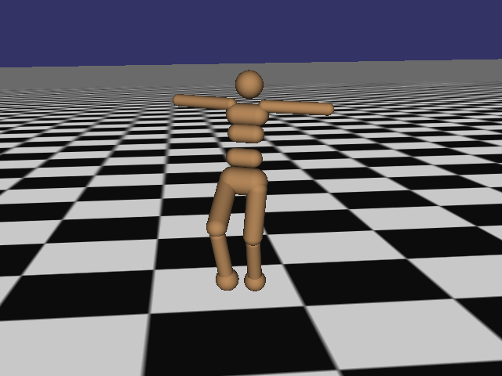
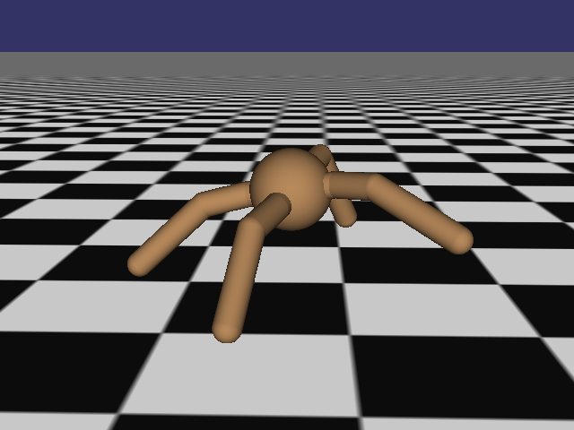
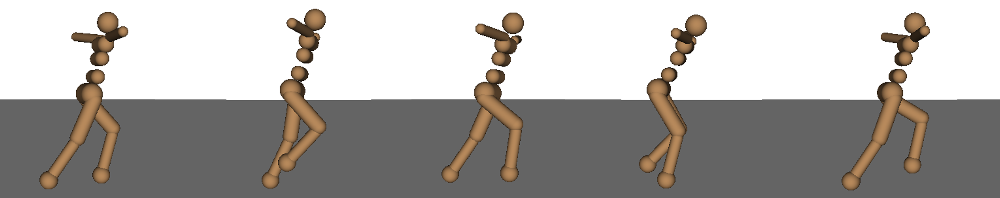
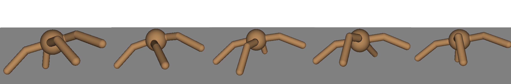
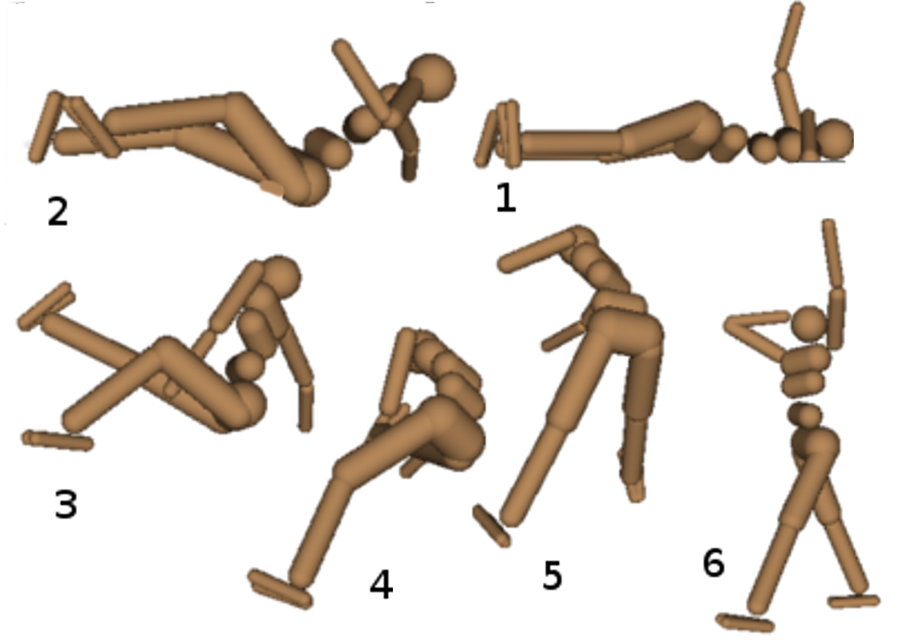

PublishedasaconferencepaperatICLR2016
HIGH-DIMENSIONAL CONTINUOUS CONTROL USING
GENERALIZED ADVANTAGE ESTIMATION
JohnSchulman,PhilippMoritz,SergeyLevine,MichaelI.JordanandPieterAbbeel
DepartmentofElectricalEngineeringandComputerScience
UniversityofCalifornia,Berkeley
{joschu,pcmoritz,levine,jordan,pabbeel}@eecs.berkeley.edu
ABSTRACT
Policygradientmethodsareanappealingapproachinreinforcementlearningbe-
causetheydirectlyoptimizethecumulativerewardandcanstraightforwardlybe
used with nonlinear function approximators such as neural networks. The two
mainchallengesarethelargenumberofsamplestypicallyrequired,andthediffi-
cultyofobtainingstableandsteadyimprovementdespitethenonstationarityofthe
incomingdata. Weaddressthefirstchallengebyusingvaluefunctionstosubstan-
tiallyreducethevarianceofpolicygradientestimatesatthecostofsomebias,with
an exponentially-weighted estimator of the advantage function that is analogous
to TD(λ). We address the second challenge by using trust region optimization
procedure for both the policy and the value function, which are represented by
neuralnetworks.
Our approach yields strong empirical results on highly challenging 3D locomo-
tion tasks, learning running gaits for bipedal and quadrupedal simulated robots,
andlearningapolicyforgettingthebipedtostandupfromstartingoutlyingon
theground.Incontrasttoabodyofpriorworkthatuseshand-craftedpolicyrepre-
sentations,ourneuralnetworkpoliciesmapdirectlyfromrawkinematicstojoint
torques. Our algorithm is fully model-free, and the amount of simulated experi-
encerequiredforthelearningtaskson3Dbipedscorrespondsto1-2weeksofreal
time.
1 INTRODUCTION
Thetypicalproblemformulationinreinforcementlearningistomaximizetheexpectedtotalreward
ofapolicy. Akeysourceofdifficultyisthelongtimedelaybetweenactionsandtheirpositiveor
negative effect on rewards; this issue is called the credit assignment problem in the reinforcement
learning literature (Minsky, 1961; Sutton & Barto, 1998), and the distal reward problem in the
behavioralliterature(Hull,1943). Valuefunctionsofferanelegantsolutiontothecreditassignment
problem—they allow us to estimate the goodness of an action before the delayed reward arrives.
Reinforcementlearningalgorithmsmakeuseofvaluefunctionsinavarietyofdifferentways; this
paper considers algorithms that optimize a parameterized policy and use value functions to help
estimatehowthepolicyshouldbeimproved.
When using a parameterized stochastic policy, it is possible to obtain an unbiased estimate of the
gradientoftheexpectedtotalreturns(Williams,1992;Suttonetal.,1999;Baxter&Bartlett,2000);
thesenoisygradientestimatescanbeusedinastochasticgradientascentalgorithm. Unfortunately,
thevarianceofthegradientestimatorscalesunfavorablywiththetimehorizon, sincetheeffectof
anactionisconfoundedwiththeeffectsofpastandfutureactions. Anotherclassofpolicygradient
algorithms, called actor-critic methods, use a value function rather than the empirical returns, ob-
taininganestimatorwithlowervarianceatthecostofintroducingbias(Konda&Tsitsiklis,2003;
Hafner&Riedmiller,2011). Butwhilehighvariancenecessitatesusingmoresamples,biasismore
pernicious—evenwithanunlimitednumberofsamples,biascancausethealgorithmtofailtocon-
verge,ortoconvergetoapoorsolutionthatisnotevenalocaloptimum.
We propose a family of policy gradient estimators that significantly reduce variance while main-
taining a tolerable level of bias. We call this estimation scheme, parameterized by γ ∈ [0,1] and
1
8102
tcO
02
]GL.sc[
6v83420.6051:viXra

PublishedasaconferencepaperatICLR2016
λ ∈ [0,1],thegeneralizedadvantageestimator(GAE).Relatedmethodshavebeenproposedinthe
contextofonlineactor-criticmethods(Kimura&Kobayashi,1998;Wawrzyn´ski,2009).Weprovide
amoregeneralanalysis,whichisapplicableinboththeonlineandbatchsettings,anddiscussanin-
terpretationofourmethodasaninstanceofrewardshaping(Ngetal.,1999),wheretheapproximate
valuefunctionisusedtoshapethereward.
We present experimental results on a number of highly challenging 3D locomotion tasks, where
weshowthatourapproachcanlearncomplexgaitsusinghigh-dimensional,generalpurposeneural
network function approximators for both the policy and the value function, each with over 104
parameters. The policies perform torque-level control of simulated 3D robots with up to 33 state
dimensionsand10actuators.
Thecontributionsofthispaperaresummarizedasfollows:
1. Weprovidejustificationandintuitionforaneffectivevariancereductionschemeforpolicygra-
dients,whichwecallgeneralizedadvantageestimation(GAE).Whiletheformulahasbeenpro-
posedinpriorwork(Kimura&Kobayashi,1998;Wawrzyn´ski,2009),ouranalysisisnoveland
enablesGAEtobeappliedwithamoregeneralsetofalgorithms,includingthebatchtrust-region
algorithmweuseforourexperiments.
2. Weproposetheuseofatrustregionoptimizationmethodforthevaluefunction,whichwefindis
arobustandefficientwaytotrainneuralnetworkvaluefunctionswiththousandsofparameters.
3. Bycombining(1)and(2)above,weobtainanalgorithmthatempiricallyiseffectiveatlearning
neural network policies for challenging control tasks. The results extend the state of the art in
using reinforcement learning for high-dimensional continuous control. Videos are available at
https://sites.google.com/site/gaepapersupp.
2 PRELIMINARIES
We consider an undiscounted formulation of the policy optimization problem. The initial state
s is sampled from distribution ρ . A trajectory (s ,a ,s ,a ,...) is generated by sampling ac-
| 0   |     |     |     | 0   |     |     | 0   | 0 1 1 |     |     |     |
| --- | --- | --- | --- | --- | --- | --- | --- | ----- | --- | --- | --- |
tions according to the policy a ∼ π(a |s ) and sampling the states according to the dynamics
|     |     |     |     | t   | t   | t   |     |     |     |     |     |
| --- | --- | --- | --- | --- | --- | --- | --- | --- | --- | --- | --- |
s ∼P(s |s ,a ),untilaterminal(absorbing)stateisreached. Arewardr =r(s ,a ,s )
| t+1 |     | t+1 t | t   |     |     |     |     |     |     | t t | t t+1 |
| --- | --- | ----- | --- | --- | --- | --- | --- | --- | --- | --- | ----- |
(cid:80)∞
isreceivedateachtimestep. Thegoalistomaximizetheexpectedtotalreward r t , whichis
t=0
assumedtobefiniteforallpolicies.Notethatwearenotusingadiscountaspartoftheproblemspec-
ification; it will appear below as an algorithm parameter that adjusts a bias-variance tradeoff. But
(cid:80)∞
thediscountedproblem(maximizing γtr )canbehandledasaninstanceoftheundiscounted
|     |     |     |     |     | t=0 | t   |     |     |     |     |     |
| --- | --- | --- | --- | --- | --- | --- | --- | --- | --- | --- | --- |
probleminwhichweabsorbthediscountfactorintotherewardfunction,makingittime-dependent.
Policygradientmethodsmaximizetheexpectedtotalrewardbyrepeatedlyestimatingthegradient
(cid:80)∞
g := ∇ E[ r ]. Thereareseveraldifferentrelatedexpressionsforthepolicygradient,which
|     | θ   | t=0 t |     |     |     |     |     |     |     |     |     |
| --- | --- | ----- | --- | --- | --- | --- | --- | --- | --- | --- | --- |
havetheform
|     |     |     |     |     | (cid:34) |     |     | (cid:35) |     |     |     |
| --- | --- | --- | --- | --- | -------- | --- | --- | -------- | --- | --- | --- |
∞
|     |     |     |     | =E  | (cid:88) |     |      |         |     |     |     |
| --- | --- | --- | --- | --- | -------- | --- | ---- | ------- | --- | --- | --- |
|     |     |     |     | g   |          | Ψ ∇ | logπ | (a |s ) | ,   |     | (1) |
|     |     |     |     |     |          | t θ | θ    | t t     |     |     |     |
t=0
whereΨ maybeoneofthefollowing:
t
1. (cid:80)∞ r : totalrewardofthetrajectory. 4. Qπ(s ,a ): state-actionvaluefunction.
|     |     | t=0 t |     |     |     |     |     | t   | t   |     |     |
| --- | --- | ----- | --- | --- | --- | --- | --- | --- | --- | --- | --- |
2. (cid:80)∞ r : rewardfollowingactiona . 5. Aπ(s ,a ): advantagefunction.
|     |                  | t(cid:48)=t t(cid:48) |                       |     |     | t   |     | t      | t      |                  |     |
| --- | ---------------- | --------------------- | --------------------- | --- | --- | --- | --- | ------ | ------ | ---------------- | --- |
|     | 3. (cid:80)∞     | r −b(s                | ): baselinedversionof |     |     |     |     |        |        |                  |     |
|     |                  | t(cid:48)=t t(cid:48) | t                     |     |     |     |     |        |        |                  |     |
|     |                  |                       |                       |     |     |     |     | +Vπ(s  | )−Vπ(s |                  |     |
|     | previousformula. |                       |                       |     |     |     |     | 6. r t | t+1    | t ): TDresidual. |     |
Thelatterformulasusethedefinitions
|     |      |           |         | (cid:34) |     | (cid:35) |                      |      |         | (cid:34) (cid:35) |     |
| --- | ---- | --------- | ------- | -------- | --- | -------- | -------------------- | ---- | ------- | ----------------- | --- |
|     |      |           |         |          | ∞   |          |                      |      |         | ∞                 |     |
|     |      | Vπ(s ):=E |         | (cid:88) |     |          | Qπ(s                 | ):=E |         | (cid:88)          |     |
|     |      |           | st+1:∞, |          | r   |          |                      | ,a   | st+1:∞, | r                 | (2) |
|     |      | t         | at:∞    |          | t+l |          |                      | t t  | at+1:∞  | t+l               |     |
|     |      |           |         |          | l=0 |          |                      |      |         | l=0               |     |
|     | Aπ(s | ):=Qπ(s   |         | )−Vπ(s   |     |          |                      |      |         |                   |     |
|     |      | t ,a t    |         | t ,a t   |     | t ),     | (Advantagefunction). |      |         |                   | (3) |
2

PublishedasaconferencepaperatICLR2016
Here,thesubscriptofEenumeratesthevariablesbeingintegratedover,wherestatesandactionsare
sampledsequentiallyfromthedynamicsmodelP(s |s ,a )andpolicyπ(a |s ),respectively.
t+1 t t t t
The colon notation a : b refers to the inclusive range (a,a+1,...,b). These formulas are well
knownandstraightforwardtoobtain;theyfollowdirectlyfromProposition1,whichwillbestated
shortly.
The choice Ψ = Aπ(s ,a ) yields almost the lowest possible variance, though in practice, the
t t t
advantagefunctionisnotknownandmustbeestimated.Thisstatementcanbeintuitivelyjustifiedby
thefollowinginterpretationofthepolicygradient: thatastepinthepolicygradientdirectionshould
increase the probability of better-than-average actions and decrease the probability of worse-than-
averageactions. Theadvantagefunction,byit’sdefinitionAπ(s,a)=Qπ(s,a)−Vπ(s),measures
whether or not the action is better or worse than the policy’s default behavior. Hence, we should
choose Ψ to be the advantage function Aπ(s ,a ), so that the gradient term Ψ ∇ logπ (a |s )
t t t t θ θ t t
pointsinthedirectionofincreasedπ (a |s )ifandonlyifAπ(s ,a ) > 0. SeeGreensmithetal.
θ t t t t
(2004) for a more rigorous analysis of the variance of policy gradient estimators and the effect of
usingabaseline.
Wewillintroduceaparameterγ thatallowsustoreducevariancebydownweightingrewardscor-
responding to delayed effects, at the cost of introducing bias. This parameter corresponds to the
discount factor used in discounted formulations of MDPs, but we treat it as a variance reduction
parameter in an undiscounted problem; this technique was analyzed theoretically by Marbach &
Tsitsiklis(2003);Kakade(2001b);Thomas(2014). Thediscountedvaluefunctionsaregivenby:
(cid:34) ∞ (cid:35) (cid:34) ∞ (cid:35)
(cid:88) (cid:88)
Vπ,γ(s t ):=E st+1:∞, γlr t+l Qπ,γ(s t ,a t ):=E st+1:∞, γlr t+l (4)
at:∞ at+1:∞
l=0 l=0
Aπ,γ(s ,a ):=Qπ,γ(s ,a )−Vπ,γ(s ). (5)
t t t t t
Thediscountedapproximationtothepolicygradientisdefinedasfollows:
(cid:34) ∞ (cid:35)
(cid:88)
gγ :=E s0:∞ Aπ,γ(s t ,a t )∇ θ logπ θ (a t |s t ) . (6)
a0:∞
t=0
Thefollowingsectiondiscusseshowtoobtainbiased(butnottoobiased)estimatorsforAπ,γ,giving
usnoisyestimatesofthediscountedpolicygradientinEquation(6).
Before proceeding, we will introduce the notion of a γ-just estimator of the advantage function,
which is an estimator that does not introduce bias when we use it in place of Aπ,γ (which is not
known and must be estimated) in Equation (6) to estimate gγ.1 Consider an advantage estimator
Aˆ (s ,a ),whichmayingeneralbeafunctionoftheentiretrajectory.
t 0:∞ 0:∞
Definition1. TheestimatorAˆ isγ-justif
t
(cid:104) (cid:105)
E s0:∞ Aˆ t (s 0:∞ ,a 0:∞ )∇ θ logπ θ (a t |s t ) =E s0:∞ [Aπ,γ(s t ,a t )∇ θ logπ θ (a t |s t )]. (7)
a0:∞ a0:∞
ItfollowsimmediatelythatifAˆ isγ-justforallt,then
t
(cid:34) ∞ (cid:35)
E s0:∞ (cid:88) Aˆ t (s 0:∞ ,a 0:∞ )∇ θ logπ θ (a t |s t ) =gγ (8)
a0:∞
t=0
One sufficient condition for Aˆ to be γ-just is that Aˆ decomposes as the difference between two
t t
functionsQ andb ,whereQ candependonanytrajectoryvariablesbutgivesanunbiasedestimator
t t t
of the γ-discounted Q-function, and b is an arbitrary function of the states and actions sampled
t
beforea .
t
Proposition 1. Suppose that Aˆ can be written in the form Aˆ (s ,a ) = Q (s ,a )−
t t 0:∞ 0:∞ t t:∞ t:∞
b (s ,a ) such that for all (s ,a ), E [Q (s ,a )] = Qπ,γ(s ,a ).
t 0:t 0:t−1 t t st+1:∞,at+1:∞|st,at t t:∞ t:∞ t t
ThenAˆisγ-just.
1Note, that we have already introduced bias by using Aπ,γ in place of Aπ; here we are concerned with
obtaining an unbiased estimate of gγ, which is a biased estimate of the policy gradient of the undiscounted
MDP.
3

PublishedasaconferencepaperatICLR2016
The proof is provided in Appendix B. It is easy to verify that the following expressions are γ-just
advantageestimatorsforAˆ :
t
• (cid:80)∞ γlr • Aπ,γ(s ,a )
l=0 t+l t t
• Qπ,γ(s ,a ) • r +γVπ,γ(s )−Vπ,γ(s ).
t t t t+1 t
3 ADVANTAGE FUNCTION ESTIMATION
This section will be concerned with producing an accurate estimate Aˆ of the discounted advan-
t
tage function Aπ,γ(s ,a ), which will then be used to construct a policy gradient estimator of the
t t
followingform:
N ∞
gˆ= 1 (cid:88)(cid:88) Aˆn∇ logπ (an|sn) (9)
N t θ θ t t
n=1t=0
wherenindexesoverabatchofepisodes.
LetV beanapproximatevaluefunction. DefineδV =r +γV(s )−V(s ),i.e.,theTDresidual
t t t+1 t
ofV withdiscountγ (Sutton&Barto,1998). NotethatδV canbeconsideredasanestimateofthe
t
advantageoftheactiona .Infact,ifwehavethecorrectvaluefunctionV =Vπ,γ,thenitisaγ-just
t
advantageestimator,andinfact,anunbiasedestimatorofAπ,γ:
(cid:104) (cid:105)
E δVπ,γ =E [r +γVπ,γ(s )−Vπ,γ(s )]
st+1 t st+1 t t+1 t
=E [Qπ,γ(s ,a )−Vπ,γ(s )]=Aπ,γ(s ,a ). (10)
st+1 t t t t t
However,thisestimatorisonlyγ-justforV = Vπ,γ,otherwiseitwillyieldbiasedpolicygradient
estimates.
Next,letusconsidertakingthesumofkoftheseδterms,whichwewilldenotebyAˆ(k)
t
Aˆ(1) :=δV =−V(s )+r +γV(s ) (11)
t t t t t+1
Aˆ(2) :=δV +γδV =−V(s )+r +γr +γ2V(s ) (12)
t t t+1 t t t+1 t+2
Aˆ(3) :=δV +γδV +γ2δV =−V(s )+r +γr +γ2r +γ3V(s ) (13)
t t t+1 t+2 t t t+1 t+2 t+3
k−1
Aˆ(k) := (cid:88) γlδV =−V(s )+r +γr +···+γk−1r +γkV(s ) (14)
t t+l t t t+1 t+k−1 t+k
l=0
Theseequationsresultfromatelescopingsum, andweseethatAˆ(k) involvesak-stepestimateof
t
thereturns,minusabaselineterm−V(s ). AnalogouslytothecaseofδV =Aˆ(1),wecanconsider
t t t
Aˆ(k) tobeanestimatoroftheadvantagefunction,whichisonlyγ-justwhenV = Vπ,γ. However,
t
notethatthebiasgenerallybecomessmallerask → ∞,sincethetermγkV(s )becomesmore
t+k
heavilydiscounted,andtheterm−V(s )doesnotaffectthebias. Takingk →∞,weget
t
∞ ∞
Aˆ(∞) = (cid:88) γlδV =−V(s )+ (cid:88) γlr , (15)
t t+l t t+l
l=0 l=0
whichissimplytheempiricalreturnsminusthevaluefunctionbaseline.
4

PublishedasaconferencepaperatICLR2016
The generalized advantage estimator GAE(γ,λ) is defined as the exponentially-weighted average
ofthesek-stepestimators:
(cid:16) (cid:17)
AˆGAE(γ,λ) :=(1−λ) Aˆ(1)+λAˆ(2)+λ2Aˆ(3)+...
t t t t
=(1−λ) (cid:0) δV +λ(δV +γδV )+λ2(δV +γδV +γ2δV )+... (cid:1)
t t t+1 t t+1 t+2
=(1−λ)(δV(1+λ+λ2+...)+γδV (λ+λ2+λ3+...)
t t+1
+γ2δV (λ2+λ3+λ4+...)+...)
t+2
(cid:18) (cid:18) 1 (cid:19) (cid:18) λ (cid:19) (cid:18) λ2 (cid:19) (cid:19)
=(1−λ) δV +γδV +γ2δV +...
t 1−λ t+1 1−λ t+2 1−λ
∞
(cid:88)
= (γλ)lδV (16)
t+l
l=0
FromEquation(16),weseethattheadvantageestimatorhasaremarkablysimpleformulainvolving
adiscountedsumofBellmanresidualterms. Section4discussesaninterpretationofthisformulaas
thereturnsinanMDPwithamodifiedrewardfunction. Theconstructionweusedaboveisclosely
analogoustotheoneusedtodefineTD(λ)(Sutton&Barto,1998),howeverTD(λ)isanestimator
ofthevaluefunction,whereashereweareestimatingtheadvantagefunction.
Therearetwonotablespecialcasesofthisformula,obtainedbysettingλ=0andλ=1.
GAE(γ,0): Aˆ :=δ =r +γV(s )−V(s ) (17)
t t t t+1 t
∞ ∞
GAE(γ,1): Aˆ := (cid:88) γlδ = (cid:88) γlr −V(s ) (18)
t t+l t+l t
l=0 l=0
GAE(γ,1) is γ-just regardless of the accuracy of V, but it has high variance due to the sum of
terms. GAE(γ,0) is γ-just for V = Vπ,γ and otherwise induces bias, but it typically has much
lowervariance. Thegeneralizedadvantageestimatorfor0 < λ < 1makesacompromisebetween
biasandvariance,controlledbyparameterλ.
We’vedescribedanadvantageestimatorwithtwoseparateparametersγ andλ,bothofwhichcon-
tributetothebias-variancetradeoffwhenusinganapproximatevaluefunction. However,theyserve
differentpurposesandworkbestwithdifferentrangesofvalues. γmostimportantlydeterminesthe
scaleofthevaluefunctionVπ,γ, whichdoesnotdependonλ. Takingγ < 1introducesbiasinto
thepolicygradientestimate,regardlessofthevaluefunction’saccuracy. Ontheotherhand,λ < 1
introducesbiasonlywhenthevaluefunctionisinaccurate. Empirically,wefindthatthebestvalue
of λ is much lower than the best value of γ, likely because λ introduces far less bias than γ for a
reasonablyaccuratevaluefunction.
Usingthegeneralizedadvantageestimator,wecanconstructabiasedestimatorofgγ,thediscounted
policygradientfromEquation(6):
(cid:34) ∞ (cid:35) (cid:34) ∞ ∞ (cid:35)
gγ ≈E (cid:88) ∇ logπ (a |s )AˆGAE(γ,λ) =E (cid:88) ∇ logπ (a |s ) (cid:88) (γλ)lδV , (19)
θ θ t t t θ θ t t t+l
t=0 t=0 l=0
whereequalityholdswhenλ=1.
4 INTERPRETATION AS REWARD SHAPING
In this section, we discuss how one can interpret λ as an extra discount factor applied after per-
forming a reward shaping transformation on the MDP. We also introduce the notion of a response
functiontohelpunderstandthebiasintroducedbyγ andλ.
Reward shaping (Ng et al., 1999) refers to the following transformation of the reward function of
an MDP: let Φ : S → R be an arbitrary scalar-valued function on state space, and define the
transformedrewardfunctionr˜by
r˜(s,a,s(cid:48))=r(s,a,s(cid:48))+γΦ(s(cid:48))−Φ(s), (20)
5

PublishedasaconferencepaperatICLR2016
which in turn defines a transformed MDP. This transformation leaves the discounted advantage
functionAπ,γ unchangedforanypolicyπ. Toseethis,considerthediscountedsumofrewardsofa
| trajectorystartingwithstates |     |     | :   |     |     |     |     |     |     |     |
| ---------------------------- | --- | --- | --- | --- | --- | --- | --- | --- | --- | --- |
t
|     | ∞        |        |             |       | ∞              |        |              |       |      |      |
| --- | -------- | ------ | ----------- | ----- | -------------- | ------ | ------------ | ----- | ---- | ---- |
|     | (cid:88) | γlr˜(s |             |       | (cid:88) γlr(s |        |              |       |      |      |
|     |          |        | t+l ,a t ,s | t+l+1 | )=             | t+l ,a | t+l ,s t+l+1 | )−Φ(s | t ). | (21) |
|     | l=0      |        |             |       | l=0            |        |              |       |      |      |
LettingQ˜π,γ,V˜π,γ,A˜π,γ
bethevalueandadvantagefunctionsofthetransformedMDP,oneobtains
fromthedefinitionsofthesequantitiesthat
|     | Q˜π,γ(s,a)=Qπ,γ(s,a)−Φ(s) |     |     |     |     |     |     |     |     | (22) |
| --- | ------------------------- | --- | --- | --- | --- | --- | --- | --- | --- | ---- |
V˜π,γ(s,a)=Vπ,γ(s)−Φ(s)
(23)
A˜π,γ(s,a)=(Qπ,γ(s,a)−Φ(s))−(Vπ,γ(s)−Φ(s))=Aπ,γ(s,a).
(24)
Vπ,γ
Note that if Φ happens to be the state-value function from the original MDP, then the trans-
formedMDPhastheinterestingpropertythatV˜π,γ(s)iszeroateverystate.
Notethat(Ngetal.,1999)showedthattherewardshapingtransformationleavesthepolicygradient
and optimal policy unchanged when our objective is to maximize the discounted sum of rewards
(cid:80)∞
γtr(s ,a ,s ). Incontrast,thispaperisconcernedwithmaximizingtheundiscountedsum
| t=0                         | t t | t+1 |                                       |     |     |     |     |     |     |     |
| --------------------------- | --- | --- | ------------------------------------- | --- | --- | --- | --- | --- | --- | --- |
| ofrewards,wherethediscountγ |     |     | isusedasavariance-reductionparameter. |     |     |     |     |     |     |     |
Having reviewed the idea of reward shaping, let us consider how we could use it to get a policy
gradient estimate. The most natural approach is to construct policy gradient estimators that use
discountedsumsofshapedrewardsr˜. However,Equation(21)showsthatweobtainthediscounted
sumoftheoriginalMDP’srewardsr minusabaselineterm. Next,let’sconsiderusinga“steeper”
discountγλ,where0≤λ≤1. It’seasytoseethattheshapedrewardr˜equalstheBellmanresidual
| termδV,introducedinSection3,wherewesetΦ=V. |     |           |     |       |       | LettingΦ=V,weseethat |              |     |     |      |
| ------------------------------------------ | --- | --------- | --- | ----- | ----- | -------------------- | ------------ | --- | --- | ---- |
|                                            |     | ∞         |     |       |       | ∞                    |              |     |     |      |
|                                            |     | (cid:88)  |     |       |       | (cid:88)             | =AˆGAE(γ,λ). |     |     |      |
|                                            |     | (γλ)lr˜(s |     | ,a ,s | )=    | (γλ)lδV              |              |     |     | (25) |
|                                            |     |           | t+l | t     | t+l+1 |                      | t+l          | t   |     |      |
|                                            |     | l=0       |     |       |       | l=0                  |              |     |     |      |
Hence,byconsideringtheγλ-discountedsumofshapedrewards,weexactlyobtainthegeneralized
advantageestimatorsfromSection3. Asshownpreviously,λ=1givesanunbiasedestimateofgγ,
whereasλ<1givesabiasedestimate.
Tofurtheranalyzetheeffectofthisshapingtransformationandparametersγandλ,itwillbeuseful
tointroducethenotionofaresponsefunctionχ,whichwedefineasfollows:
|     |     |     |            | )=E[r |        | ]−E[r  |     |         |     |      |
| --- | --- | --- | ---------- | ----- | ------ | ------ | --- | ------- | --- | ---- |
|     |     |     | χ(l;s t ,a | t     | t+l |s | t ,a t | t+l | |s t ]. |     | (26) |
(cid:80)∞
Note that Aπ,γ(s,a) = γlχ(l;s,a), hence the response function decomposes the advantage
l=0
function across timesteps. The response function lets us quantify the temporal credit assignment
problem:longrangedependenciesbetweenactionsandrewardscorrespondtononzerovaluesofthe
responsefunctionforl(cid:29)0.
Next,letusrevisitthediscountfactorγ andtheapproximationwearemakingbyusingAπ,γ rather
than Aπ,1. The discounted policy gradient estimator from Equation (6) has a sum of terms of the
form
∞
(cid:88)
|     | ∇   | logπ (a | |s )Aπ,γ(s |     | ,a )=∇ | logπ | (a |s ) | γlχ(l;s | ,a ). | (27) |
| --- | --- | ------- | ---------- | --- | ------ | ---- | ------- | ------- | ----- | ---- |
|     | θ   | θ       | t t        | t   | t      | θ θ  | t t     |         | t t   |      |
l=0
Using a discount γ < 1 corresponds to dropping the terms with l (cid:29) 1/(1−γ). Thus, the error
introducedbythisapproximationwillbesmallifχrapidlydecaysaslincreases,i.e.,iftheeffectof
anactiononrewardsis“forgotten”after≈1/(1−γ)timesteps.
If the reward function r˜ were obtained using Φ = Vπ,γ, we would have E[r˜ |s ,a ] =
|     |     |     |     |     |     |     |     |     | t+l | t t |
| --- | --- | --- | --- | --- | --- | --- | --- | --- | --- | --- |
E[r˜ |s ] = 0forl > 0, i.e., theresponsefunctionwouldonlybenonzeroatl = 0. Therefore,
t+l t
thisshapingtransformationwouldturntemporallyextendedresponseintoanimmediateresponse.
GiventhatVπ,γ
completelyreducesthetemporalspreadoftheresponsefunction,wecanhopethat
agoodapproximationV ≈Vπ,γ partiallyreducesit. Thisobservationsuggestsaninterpretationof
Equation(16): reshapetherewardsusingV toshrinkthetemporalextentoftheresponsefunction,
andthenintroducea“steeper”discountγλtocutoffthenoisearisingfromlongdelays,i.e.,ignore
| terms∇ logπ | (a  | |s )δV | wherel(cid:29)1/(1−γλ). |     |     |     |     |     |     |     |
| ----------- | --- | ------ | ----------------------- | --- | --- | --- | --- | --- | --- | --- |
| θ           | θ t | t t+l  |                         |     |     |     |     |     |     |     |
6

PublishedasaconferencepaperatICLR2016
| 5 VALUE | FUNCTION | ESTIMATION |     |     |     |     |     |     |     |
| ------- | -------- | ---------- | --- | --- | --- | --- | --- | --- | --- |
A variety of different methods can be used to estimate the value function (see, e.g., Bertsekas
(2012)). When using a nonlinear function approximator to represent the value function, the sim-
plestapproachistosolveanonlinearregressionproblem:
N
(cid:88)
|     |     |     | minimize |     | (cid:107)V (s )−Vˆ | (cid:107)2, |     |     | (28) |
| --- | --- | --- | -------- | --- | ------------------ | ----------- | --- | --- | ---- |
|     |     |     |          |     | φ n                | n           |     |     |      |
φ
n=1
(cid:80)∞
where Vˆ = γlr is the discounted sum of rewards, and n indexes over all timesteps in a
| t   | l=0 | t+l |     |     |     |     |     |     |     |
| --- | --- | --- | --- | --- | --- | --- | --- | --- | --- |
batch of trajectories. This is sometimes called the Monte Carlo or TD(1) approach for estimating
thevaluefunction(Sutton&Barto,1998).2
For the experiments in this work, we used a trust region method to optimize the value function
in each iteration of a batch optimization procedure. The trust region helps us to avoid overfitting
to the most recent batch of data. To formulate the trust region problem, we first compute σ2 =
| 1 (cid:80)N | )−Vˆ |     |     |     |     |     |     |     |     |
| ----------- | ---- | --- | --- | --- | --- | --- | --- | --- | --- |
(cid:107)V (s (cid:107)2,whereφ istheparametervectorbeforeoptimization. Thenwesolve
| N n=1 | φold n | n   | old |     |     |     |     |     |     |
| ----- | ------ | --- | --- | --- | --- | --- | --- | --- | --- |
thefollowingconstrainedoptimizationproblem:
N
(cid:88)
|     |     | minimize |     | (cid:107)V | (s )−Vˆ (cid:107)2 |     |     |     |     |
| --- | --- | -------- | --- | ---------- | ------------------ | --- | --- | --- | --- |
|     |     |          |     | φ          | n n                |     |     |     |     |
φ
n=1
N
|     |     |           |     | 1 (cid:88) (cid:107)V | (s )−V | (s )(cid:107)2 |            |     |      |
| --- | --- | --------- | --- | --------------------- | ------ | -------------- | ---------- | --- | ---- |
|     |     | subjectto |     |                       | φ n    | φold n         | ≤(cid:15). |     | (29) |
|     |     |           |     | N                     | 2σ2    |                |            |     |      |
n=1
ThisconstraintisequivalenttoconstrainingtheaverageKLdivergencebetweenthepreviousvalue
function and the new value function to be smaller than (cid:15), where the value function is taken to pa-
| rameterizeaconditionalGaussiandistributionwithmeanV |     |     |     |     |     | (s)andvarianceσ2. |     |     |     |
| --------------------------------------------------- | --- | --- | --- | --- | --- | ----------------- | --- | --- | --- |
φ
Wecomputeanapproximatesolutiontothetrustregionproblemusingtheconjugategradientalgo-
| rithm(Wright&Nocedal,1999). |     |          | Specifically,wearesolvingthequadraticprogram |        |     |     |     |     |     |
| --------------------------- | --- | -------- | -------------------------------------------- | ------ | --- | --- | --- | --- | --- |
|                             |     | minimize |                                              | gT(φ−φ | )   |     |     |     |     |
old
φ
N
1 (cid:88)
|     |     | subjectto |     | (φ−φ | )TH(φ−φ |     | )≤(cid:15). |     | (30) |
| --- | --- | --------- | --- | ---- | ------- | --- | ----------- | --- | ---- |
|     |     |           |     |      | old     | old |             |     |      |
N
n=1
(cid:80)
whereg isthegradientoftheobjective,andH = 1 j jT,wherej = ∇ V (s ). Notethat
|     |     |     |     |     | N n | n n | n φ | φ n |     |
| --- | --- | --- | --- | --- | --- | --- | --- | --- | --- |
H isthe“Gauss-Newton”approximationoftheHessianoftheobjective,anditis(uptoaσ2factor)
theFisherinformationmatrixwheninterpretingthevaluefunctionasaconditionalprobabilitydis-
tribution. Usingmatrix-vectorproductsv →Hvtoimplementtheconjugategradientalgorithm,we
computeastepdirections ≈ −H−1g. Thenwerescales → αssuchthat 1(αs)TH(αs) = (cid:15)and
2
takeφ = φ +αs. Thisprocedureisanalogoustotheprocedureweuseforupdatingthepolicy,
old
whichisdescribedfurtherinSection6andbasedonSchulmanetal.(2015).
6 EXPERIMENTS
Wedesignedasetofexperimentstoinvestigatethefollowingquestions:
1. Whatistheempiricaleffectofvaryingλ ∈ [0,1]andγ ∈ [0,1]whenoptimizingepisodictotal
rewardusinggeneralizedadvantageestimation?
2. Can generalized advantage estimation, along with trust region algorithms for policy and value
functionoptimization,beusedtooptimizelargeneuralnetworkpoliciesforchallengingcontrol
problems?
2AnothernaturalchoiceistocomputetargetvalueswithanestimatorbasedontheTD(λ)backup(Bertsekas,
2012;Sutton&Barto,1998),mirroringtheexpressionweuseforpolicygradientestimation:V ˆλ =V (s )+
t φ ol d n
(cid:80)∞ (γλ)lδ
t+l .Whileweexperimentedwiththischoice,wedidnotnoticeadifferenceinpe rforma n c ef rom
l=0
theλ=1estimatorinEquation(28).
7

PublishedasaconferencepaperatICLR2016
6.1 POLICYOPTIMIZATIONALGORITHM
While generalized advantage estimation can be used along with a variety of different policy gra-
dient methods, for these experiments, we performed the policy updates using trust region policy
optimization(TRPO)(Schulmanetal.,2015). TRPOupdatesthepolicybyapproximatelysolving
thefollowingconstrainedoptimizationproblemeachiteration:
|     | minimizeL | θold (θ) |     |     |     |     |
| --- | --------- | -------- | --- | --- | --- | --- |
θ
θold(π
|     | subjectto | D       | ,π )≤(cid:15) |     |     |     |
| --- | --------- | ------- | ------------- | --- | --- | --- |
|     |           | KL θold | θ             |     |     |     |
N
|     |        | 1    | (cid:88) π (a | |s )   |     |     |
| --- | ------ | ---- | ------------- | ------ | --- | --- |
|     | whereL | (θ)= | θ n           | n Aˆ   |     |     |
|     |        | θold |               | n      |     |     |
|     |        | N    | π θold (a n   | |s n ) |     |     |
n=1
N
|     |     | θold(π    | 1 (cid:88) |           |                     |      |
| --- | --- | --------- | ---------- | --------- | ------------------- | ---- |
|     | D   | ,π        | )= D       | (π (·|s   | )(cid:107)π (·|s )) | (31) |
|     |     | KL θold θ | N          | KL θold n | θ n                 |      |
n=1
As described in (Schulman et al., 2015), we approximately solve this problem by linearizing the
objectiveandquadraticizingtheconstraint,whichyieldsastepinthedirectionθ−θ ∝−F−1g,
old
whereF istheaverageFisherinformationmatrix,andg isapolicygradientestimate. Thispolicy
update yields the same step direction as the natural policy gradient (Kakade, 2001a) and natural
actor-critic(Peters&Schaal,2008),howeveritusesadifferentstepsizedeterminationschemeand
numericalprocedureforcomputingthestep.
Sincepriorwork(Schulmanetal.,2015)comparedTRPOtoavarietyofdifferentpolicyoptimiza-
tion algorithms, we will not repeat these comparisons; rather, we will focus on varying the γ,λ
parametersofpolicygradientestimatorwhilekeepingtheunderlyingalgorithmfixed.
For completeness, the whole algorithm for iteratively updating policy and value function is given
below:
| Initializepolicyparameterθ |     | 0 andvaluefunctionparameterφ |                       | 0 . |     |     |
| -------------------------- | --- | ---------------------------- | --------------------- | --- | --- | --- |
| fori=0,1,2,...             | do  |                              |                       |     |     |     |
| Simulatecurrentpolicyπ     |     | untilN                       | timestepsareobtained. |     |     |     |
θi
| ComputeδV | atalltimestepst∈{1,2,...,N},usingV |                         |     | =V  | .   |     |
| --------- | ---------------------------------- | ----------------------- | --- | --- | --- | --- |
|           | t                                  |                         |     | φi  |     |     |
| ComputeAˆ | (cid:80)∞                          |                         |     |     |     |     |
|           | =                                  | (γλ)lδV atalltimesteps. |     |     |     |     |
|           | t l=0                              | t+l                     |     |     |     |     |
| Computeθ  | withTRPOupdate,Equation(31).       |                         |     |     |     |     |
i+1
| Computeφ | withEquation(30). |     |     |     |     |     |
| -------- | ----------------- | --- | --- | --- | --- | --- |
i+1
endfor
Note that the policy update θ → θ is performed using the value function V for advantage
|     |     | i i+1 |     |     | φi  |     |
| --- | --- | ----- | --- | --- | --- | --- |
estimation,notV . Additionalbiaswouldhavebeenintroducedifweupdatedthevaluefunction
φi+1
first. To see this, consider the extreme case where we overfit the value function, and the Bellman
residualr +γV(s )−V(s )becomeszeroatalltimesteps—thepolicygradientestimatewould
| t   | t+1 | t   |     |     |     |     |
| --- | --- | --- | --- | --- | --- | --- |
bezero.
6.2 EXPERIMENTALSETUP
Weevaluatedourapproachontheclassiccart-polebalancingproblem,aswellasseveralchallenging
3Dlocomotiontasks:(1)bipedallocomotion;(2)quadrupedallocomotion;(3)dynamicallystanding
up,forthebiped,whichstartsofflayingonitsback. ThemodelsareshowninFigure1.
6.2.1 ARCHITECTURE
Weusedthesameneuralnetworkarchitectureforallofthe3Drobottasks,whichwasafeedforward
networkwiththreehiddenlayers,with100,50and25tanhunitsrespectively.Thesamearchitecture
wasusedforthepolicyandvaluefunction. Thefinaloutputlayerhadlinearactivation. Thevalue
functionestimatorusedthesamearchitecture,butwithonlyonescalaroutput. Forthesimplercart-
poletask,weusedalinearpolicy,andaneuralnetworkwithone20-unithiddenlayerasthevalue
function.
8

PublishedasaconferencepaperatICLR2016
Figure 1: Top figures: robot models used for 3D locomotion. Bottom figures: a sequence of
framesfromthelearnedgaits. Videosareavailableathttps://sites.google.com/site/
gaepapersupp.
6.2.2 TASKDETAILS
Forthecart-polebalancingtask,wecollected20trajectoriesperbatch,withamaximumlengthof
1000timesteps,usingthephysicalparametersfromBartoetal.(1983).
ThesimulatedrobottasksweresimulatedusingtheMuJoCophysicsengine(Todorovetal.,2012).
The humanoid model has 33 state dimensions and 10 actuated degrees of freedom, while the
quadruped model has 29 state dimensions and 8 actuated degrees of freedom. The initial state
for these tasks consisted of a uniform distribution centered on a reference configuration. We used
50000timestepsperbatchforbipedallocomotion,and200000timestepsperbatchforquadrupedal
locomotionandbipedalstanding. Eachepisodewasterminatedafter2000timestepsiftherobothad
notreachedaterminalstatebeforehand. Thetimestepwas0.01seconds.
Therewardfunctionsareprovidedinthetablebelow.
Task Reward
3Dbipedlocomotion v −10−5(cid:107)u(cid:107)2−10−5(cid:107)f (cid:107)2+0.2
fwd impact
Quadrupedlocomotion v −10−6(cid:107)u(cid:107)2−10−3(cid:107)f (cid:107)2+0.05
fwd impact
Bipedgettingup −(h −1.5)2−10−5(cid:107)u(cid:107)2
head
Here, v := forwardvelocity, u := vectorofjointtorques, f := impactforces, h :=
fwd impact head
heightofthehead.
In the locomotion tasks, the episode is terminated if the center of mass of the actor falls below a
predefinedheight: .8mforthebiped,and.2mforthequadruped. Theconstantoffsetinthereward
function encourages longer episodes; otherwise the quadratic reward terms might lead lead to a
policythatendstheepisodesasquicklyaspossible.
6.3 EXPERIMENTALRESULTS
All results are presented in terms of the cost, which is defined as negative reward and is mini-
mized. Videosofthelearnedpoliciesareavailableathttps://sites.google.com/site/
gaepapersupp. In plots, “No VF” means that we used a time-dependent baseline that did not
dependonthestate,ratherthananestimateofthestatevaluefunction. Thetime-dependentbaseline
wascomputedbyaveragingthereturnateachtimestepoverthetrajectoriesinthebatch.
6.3.1 CART-POLE
Theresultsareaveragedacross21experimentswithdifferentrandomseeds. Resultsareshownin
Figure 2, and indicate that the best results are obtained at intermediate values of the parameters:
γ ∈[0.96,0.99]andλ∈[0.92,0.99].
9

PublishedasaconferencepaperatICLR2016
0
2
4
6
8
10
0 10 20 30 40 50
number of policy iterations
tsoc
Cart-pole learning curves (at γ=0.99)
No VF
λ=1.0
λ=0.99
λ=0.98
λ=0.96
λ=0.92
λ=0.84
λ=0.68
λ=0.36
λ=0
Figure 2: Left: learning curves for cart-pole task, using generalized advantage estimation with
varyingvaluesofλatγ =0.99. Thefastestpolicyimprovementisobtainbyintermediatevaluesof
λintherange[0.92,0.98]. Right: performanceafter20iterationsofpolicyoptimization,asγandλ
arevaried. Whitemeanshigherreward. Thebestresultsareobtainedatintermediatevaluesofboth.
0.0
0.5
1.0
1.5
2.0
2.5
0 100 200 300 400 500
number of policy iterations
tsoc
3D Biped
2
0
2
4
γ=0.96,λ=0.96
γ=0.98,λ=0.96
γ=0.99,λ=0.96 6
γ=0.995,λ=0.92
γ=0.995,λ=0.96 8
γ=0.995,λ=0.98
γ=0.995,λ=0.99
γ=0.995,λ=1.0 10
γ=1,λ=0.96
γ=1, No value fn
12
0 200 400 600 800 1000
number of policy iterations
tsoc
3D Quadruped
γ=0.995, No value fn
γ=0.995,λ=1
γ=0.995,λ=0.96
Figure3: Left: Learningcurvesfor3Dbipedallocomotion,averagedacrossninerunsofthealgo-
rithm. Right: learningcurvesfor3Dquadrupedallocomotion,averagedacrossfiveruns.
6.3.2 3DBIPEDALLOCOMOTION
Eachtrialtookabout2hourstorunona16-coremachine,wherethesimulationrolloutswereparal-
lelized,aswerethefunction,gradient,andmatrix-vector-productevaluationsusedwhenoptimizing
the policy and value function. Here, the results are averaged across 9 trials with different random
seeds. Thebestperformanceisagainobtainedusingintermediatevaluesofγ ∈ [0.99,0.995],λ ∈
[0.96,0.99]. The result after 1000 iterations is a fast, smooth, and stable gait that is effectively
completely stable. We can compute how much “real time” was used for this learning process:
0.01seconds/timestep×50000timesteps/batch×1000batches/3600·24seconds/day=5.8days.Hence,
itisplausiblethatthisalgorithmcouldberunonarealrobot,ormultiplerealrobotslearninginpar-
allel,iftherewereawaytoresetthestateoftherobotandensurethatitdoesn’tdamageitself.
6.3.3 OTHER3DROBOTTASKS
Theothertwomotorbehaviorsconsideredarequadrupedallocomotionandgettingupofftheground
forthe3Dbiped. Again, weperformed5trialsperexperimentalcondition, withdifferentrandom
seeds (and initializations). The experiments took about 4 hours per trial on a 32-core machine.
We performed a more limited comparison on these domains (due to the substantial computational
resourcesrequiredtoruntheseexperiments),fixingγ =0.995butvaryingλ={0,0.96},aswellas
anexperimentalconditionwithnovaluefunction. Forquadrupedallocomotion,thebestresultsare
obtainedusingavaluefunctionwithλ = 0.96Section6.3.2. For3Dstanding, thevaluefunction
alwayshelped,buttheresultsareroughlythesameforλ=0.96andλ=1.
10

PublishedasaconferencepaperatICLR2016
2.5
2.0
1.5
1.0
0.5
0.0
0 100 200 300 400 500
number of policy iterations
tsoc
3D Standing Up
γ=0.99, No value fn
γ=0.99,λ=1
γ=0.99,λ=0.96
Figure4: (a)Learningcurvefromquadrupedalwalking,(b)learningcurvefor3Dstandingup,(c)
clipsfrom3Dstandingup.
7 DISCUSSION
Policygradientmethodsprovideawaytoreducereinforcementlearningtostochasticgradientde-
scent, by providing unbiased gradient estimates. However, so far their success at solving difficult
controlproblemshasbeenlimited,largelyduetotheirhighsamplecomplexity.Wehavearguedthat
thekeytovariancereductionistoobtaingoodestimatesoftheadvantagefunction.
Wehaveprovidedanintuitivebutinformalanalysisoftheproblemofadvantagefunctionestimation,
and justified the generalized advantage estimator, which has two parameters γ,λ which adjust the
bias-variancetradeoff. Wedescribedhowtocombinethisideawithtrustregionpolicyoptimization
and a trust region algorithm that optimizes a value function, both represented by neural networks.
Combiningthesetechniques,weareabletolearntosolvedifficultcontroltasksthathavepreviously
beenoutofreachforgenericreinforcementlearningmethods.
Ourmainexperimentalvalidationofgeneralizedadvantageestimationisinthedomainofsimulated
roboticlocomotion. Asshowninourexperiments,choosinganappropriateintermediatevalueofλ
intherange[0.9,0.99]usuallyresultsinthebestperformance. Apossibletopicforfutureworkis
howtoadjusttheestimatorparametersγ,λinanadaptiveorautomaticway.
Onequestionthat meritsfutureinvestigationis therelationshipbetweenvaluefunction estimation
errorandpolicygradientestimationerror. Ifthisrelationshipwereknown,wecouldchooseanerror
metricforvaluefunctionfittingthatiswell-matchedtothequantityofinterest,whichistypicallythe
accuracyofthepolicygradientestimation. Somecandidatesforsuchanerrormetricmightinclude
theBellmanerrororprojectedBellmanerror,asdescribedinBhatnagaretal.(2009).
Anotherenticingpossibilityistouseasharedfunctionapproximationarchitectureforthepolicyand
thevaluefunction,whileoptimizingthepolicyusinggeneralizedadvantageestimation. Whilefor-
mulatingthisprobleminawaythatissuitablefornumericaloptimizationandprovidesconvergence
guarantees remains an open question, such an approach could allow the value function and policy
representationstoshareusefulfeaturesoftheinput,resultinginevenfasterlearning.
Inconcurrentwork,researchershavebeendevelopingpolicygradientmethodsthatinvolvedifferen-
tiationwithrespecttothecontinuous-valuedaction(Lillicrapetal.,2015;Heessetal.,2015).While
wefoundempiricallythattheone-stepreturn(λ=0)leadstoexcessivebiasandpoorperformance,
thesepapersshowthatsuchmethodscanworkwhentunedappropriately. However,notethatthose
papersconsidercontrolproblemswithsubstantiallylower-dimensionalstateandactionspacesthan
theonesconsideredhere.Acomparisonbetweenbothclassesofapproachwouldbeusefulforfuture
work.
ACKNOWLEDGEMENTS
WethankEmoTodorovforprovidingthesimulatoraswellasinsightfuldiscussions,andwethank
GregWayne,YuvalTassa,DaveSilver,CarlosFlorensaCampo,andGregBrockmanforinsightful
discussions. This research was funded in part by the Office of Naval Research through a Young
11

PublishedasaconferencepaperatICLR2016
InvestigatorAwardandundergrantnumberN00014-11-1-0688,DARPAthroughaYoungFaculty
Award,bytheArmyResearchOfficethroughtheMASTprogram.
A FREQUENTLY ASKED QUESTIONS
A.1 WHAT’STHERELATIONSHIPWITHCOMPATIBLEFEATURES?
Compatible features are often mentioned in relation to policy gradient algorithms that make use
of a value function, and the idea was proposed in the paper On Actor-Critic Methods by Konda
& Tsitsiklis (2003). These authors pointed out that due to the limited representation power of the
policy,thepolicygradientonlydependsonacertainsubspaceofthespaceofadvantagefunctions.
Thissubspaceisspannedbythecompatiblefeatures∇ logπ (a |s ),wherei∈{1,2,...,dimθ}.
θi θ t t
Thistheoryofcompatiblefeaturesprovidesnoguidanceonhowtoexploitthetemporalstructureof
theproblemtoobtainbetterestimatesoftheadvantagefunction,makingitmostlyorthogonaltothe
ideasinthispaper.
Theideaofcompatiblefeaturesmotivatesanelegantmethodforcomputingthenaturalpolicygradi-
ent(Kakade,2001a;Peters&Schaal,2008). Givenanempiricalestimateoftheadvantagefunction
Aˆ ateachtimestep,wecanprojectitontothesubspaceofcompatiblefeaturesbysolvingthefol-
t
lowingleastsquaresproblem:
minimize (cid:88) (cid:107)r·∇ logπ (a |s )−Aˆ (cid:107)2. (32)
θ θ t t t
r
t
If Aˆ is γ-just, the least squares solution is the natural policy gradient (Kakade, 2001a). Note that
anyestimatoroftheadvantagefunctioncanbesubstitutedintothisformula,includingtheoneswe
deriveinthispaper. Forourexperiments,wealsocomputenaturalpolicygradientsteps,butweuse
themorecomputationallyefficientnumericalprocedurefromSchulmanetal.(2015), asdiscussed
inSection6.
A.2 WHYDON’TYOUJUSTUSEAQ-FUNCTION?
Previousactorcriticmethods,e.g. inKonda&Tsitsiklis(2003),useaQ-functiontoobtainpoten-
tiallylow-variancepolicygradientestimates. Recentpapers,includingHeessetal.(2015);Lillicrap
etal.(2015), haveshownthataneuralnetworkQ-functionapproximatorcanusedeffectivelyina
policygradientmethod. However,thereareseveraladvantagestousingastate-valuefunctioninthe
mannerofthispaper. First,thestate-valuefunctionhasalower-dimensionalinputandisthuseasier
tolearnthanastate-actionvaluefunction. Second,themethodofthispaperallowsustosmoothly
interpolatebetweenthehigh-biasestimator(λ=0)andthelow-biasestimator(λ=1).Ontheother
hand,usingaparameterizedQ-functiononlyallowsustouseahigh-biasestimator. Wehavefound
thatthebiasisprohibitivelylargewhenusingaone-stepestimateofthereturns,i.e.,theλ=0esti-
mator,Aˆ =δV =r +γV(s )−V(s ). Weexpectthatsimilardifficultywouldbeencountered
t t t t+1 t
when using an advantage estimator involving a parameterized Q-function, Aˆ = Q(s,a)−V(s).
t
ThereisaninterestingspaceofpossiblealgorithmsthatwoulduseaparameterizedQ-functionand
attempt to reduce bias, however, an exploration of these possibilities is beyond the scope of this
work.
B PROOFS
ProofofProposition1: FirstwecansplittheexpectationintotermsinvolvingQandb,
E [∇ logπ (a |s )(Q (s ,a )−b (s ,a ))]
s0:∞,a0:∞ θ θ t t t 0:∞ 0:∞ t 0:t 0:t−1
=E [∇ logπ (a |s )(Q (s ,a ))]
s0:∞,a0:∞ θ θ t t t 0:∞ 0:∞
−E [∇ logπ (a |s )(b (s ,a ))] (33)
s0:∞,a0:∞ θ θ t t t 0:t 0:t−1
12

PublishedasaconferencepaperatICLR2016
We’llconsiderthetermswithQandbinturn.
|     | E   |             | [∇ logπ       | (a        | |s )Q (s             | ,a   | )]       |        |            |
| --- | --- | ----------- | ------------- | --------- | -------------------- | ---- | -------- | ------ | ---------- |
|     |     | s0:∞,a0:∞   | θ             | θ t       | t t 0:∞              | 0:∞  |          |        |            |
|     |     | =E          | (cid:2)E      |           | [∇ logπ              | (a   | |s )Q (s | ,a     | )] (cid:3) |
|     |     | s0:t,a0:t   | st+1:∞,at+1:∞ |           | θ                    | θ    | t t t    | 0:∞    | 0:∞        |
|     |     | =E          | (cid:2)       |           | )E                   |      |          |        | (cid:3)    |
|     |     | s0:t,a0:t   | ∇ θ           | logπ θ (a | t |s t st+1:∞,at+1:∞ |      | [Q t (s  | 0:∞ ,a | 0:∞ )]     |
|     |     | =E          |               |           | )Aπ(s                |      |          |        |            |
|     |     | s0:t,a0:t−1 | [∇            | θ logπ    | θ (a t |s t          | t ,a | t )]     |        |            |
Next,
E
|     |     | s0:∞,a0:∞   | [∇ θ logπ | θ (a t      | |s t )b t (s 0:t | ,a 0:t−1 | )]        |           |         |
| --- | --- | ----------- | --------- | ----------- | ---------------- | -------- | --------- | --------- | ------- |
|     |     | =E          | (cid:2)E  |             |                  |          |           |           | (cid:3) |
|     |     |             |           |             | [∇ logπ          | (a       | |s )b (s  | ,a        | )]      |
|     |     | s0:t,a0:t−1 |           | st+1:∞,at:∞ | θ                | θ        | t t t     | 0:t 0:t−1 |         |
|     |     |             | (cid:2)E  |             |                  |          |           |           | (cid:3) |
|     |     | =E          |           |             | [∇ logπ          | (a       | |s )]b (s | ,a        | )       |
|     |     | s0:t,a0:t−1 |           | st+1:∞,at:∞ | θ                | θ        | t t t     | 0:t       | 0:t−1   |
|     |     | =E          | [0·b      | (s          | ,a )]            |          |           |           |         |
|     |     | s0:t,a0:t−1 |           | t 0:t       | 0:t−1            |          |           |           |         |
=0.
REFERENCES
Barto,AndrewG,Sutton,RichardS,andAnderson,CharlesW. Neuronlikeadaptiveelementsthatcansolve
difficult learning control problems. Systems, Man and Cybernetics, IEEE Transactions on, (5):834–846,
1983.
Baxter,JonathanandBartlett,PeterL.ReinforcementlearninginPOMDPsviadirectgradientascent.InICML,
pp.41–48,2000.
Bertsekas,DimitriP. Dynamicprogrammingandoptimalcontrol,volume2. AthenaScientific,2012.
Bhatnagar,Shalabh,Precup,Doina,Silver,David,Sutton,RichardS,Maei,HamidR,andSzepesva´ri,Csaba.
Advances in
Convergent temporal-difference learning with arbitrary smooth function approximation. In
NeuralInformationProcessingSystems,pp.1204–1212,2009.
Greensmith,Evan,Bartlett,PeterL,andBaxter,Jonathan.Variancereductiontechniquesforgradientestimates
| inreinforcementlearning. |     |     | TheJournalofMachineLearningResearch,5:1471–1530,2004. |     |     |     |     |     |     |
| ------------------------ | --- | --- | ----------------------------------------------------- | --- | --- | --- | --- | --- | --- |
Hafner, RolandandRiedmiller, Martin. Reinforcementlearninginfeedbackcontrol. Machinelearning, 84
(1-2):137–169,2011.
Heess,Nicolas,Wayne,Greg,Silver,David,Lillicrap,Timothy,Tassa,Yuval,andErez,Tom.Learningcontin-
| uouscontrolpoliciesbystochasticvaluegradients. |                         |     |       |                                     | arXivpreprintarXiv:1510.09142,2015. |     |     |     |     |
| ---------------------------------------------- | ----------------------- | --- | ----- | ----------------------------------- | ----------------------------------- | --- | --- | --- | --- |
| Hull,Clark.                                    | Principlesofbehavior.   |     | 1943. |                                     |                                     |     |     |     |     |
| Kakade,Sham.                                   | Anaturalpolicygradient. |     |       | InNIPS,volume14,pp.1531–1538,2001a. |                                     |     |     |     |     |
Kakade,Sham. Optimizingaveragerewardusingdiscountedrewards. InComputationalLearningTheory,pp.
605–615.Springer,2001b.
Kimura, Hajime and Kobayashi, Shigenobu. An analysis of actor/critic algorithms using eligibility traces:
| Reinforcementlearningwithimperfectvaluefunction. |     |     |     |     |     | InICML,pp.278–286,1998. |     |     |     |
| ------------------------------------------------ | --- | --- | --- | --- | --- | ----------------------- | --- | --- | --- |
Konda,VijayRandTsitsiklis,JohnN. Onactor-criticalgorithms. SIAMjournalonControlandOptimization,
42(4):1143–1166,2003.
Lillicrap, Timothy P, Hunt, Jonathan J, Pritzel, Alexander, Heess, Nicolas, Erez, Tom, Tassa, Yuval, Sil-
ver, David, and Wierstra, Daan. Continuous control with deep reinforcement learning. arXiv preprint
arXiv:1509.02971,2015.
Marbach,PeterandTsitsiklis,JohnN. Approximategradientmethodsinpolicy-spaceoptimizationofmarkov
| rewardprocesses. |     | DiscreteEventDynamicSystems,13(1-2):111–148,2003. |     |     |     |     |     |     |     |
| ---------------- | --- | ------------------------------------------------- | --- | --- | --- | --- | --- | --- | --- |
Minsky,Marvin. Stepstowardartificialintelligence. ProceedingsoftheIRE,49(1):8–30,1961.
Ng,AndrewY,Harada,Daishi,andRussell,Stuart. Policyinvarianceunderrewardtransformations: Theory
| andapplicationtorewardshaping. |     |     |     | InICML,volume99,pp.278–287,1999. |     |     |     |     |     |
| ------------------------------ | --- | --- | --- | -------------------------------- | --- | --- | --- | --- | --- |
Peters,JanandSchaal,Stefan. Naturalactor-critic. Neurocomputing,71(7):1180–1190,2008.
13

PublishedasaconferencepaperatICLR2016
Schulman,John,Levine,Sergey,Moritz,Philipp,Jordan,MichaelI,andAbbeel,Pieter. Trustregionpolicy
optimization. arXivpreprintarXiv:1502.05477,2015.
Sutton,RichardSandBarto,AndrewG. Introductiontoreinforcementlearning. MITPress,1998.
Sutton,RichardS,McAllester,DavidA,Singh,SatinderP,andMansour,Yishay. Policygradientmethodsfor
reinforcementlearningwithfunctionapproximation. InNIPS,volume99,pp.1057–1063.Citeseer,1999.
Thomas,Philip. Biasinnaturalactor-criticalgorithms. InProceedingsofThe31stInternationalConference
onMachineLearning,pp.441–448,2014.
Todorov, Emanuel, Erez, Tom, and Tassa, Yuval. Mujoco: A physics engine for model-based control. In
IntelligentRobotsandSystems(IROS),2012IEEE/RSJInternationalConferenceon,pp.5026–5033.IEEE,
2012.
Wawrzyn´ski,Paweł.Real-timereinforcementlearningbysequentialactor–criticsandexperiencereplay.Neural
Networks,22(10):1484–1497,2009.
Williams,RonaldJ. Simplestatisticalgradient-followingalgorithmsforconnectionistreinforcementlearning.
Machinelearning,8(3-4):229–256,1992.
Wright,StephenJandNocedal,Jorge. Numericaloptimization. SpringerNewYork,1999.
14

## Extracted Images

### Page 9

### Page 10

### Page 11

