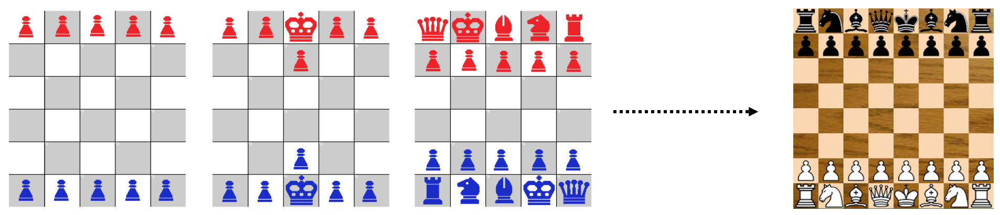
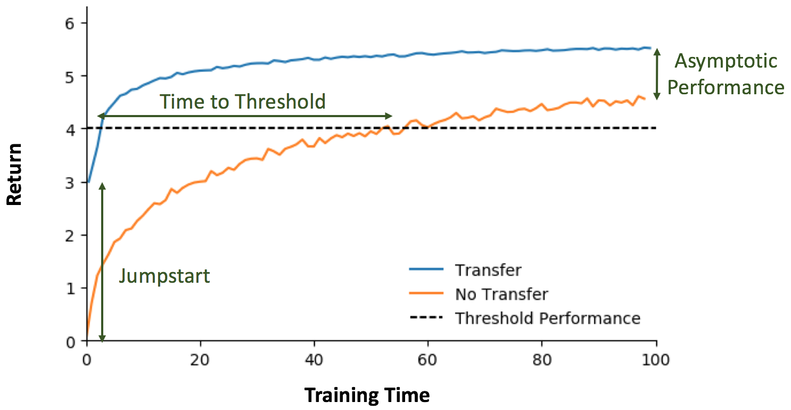
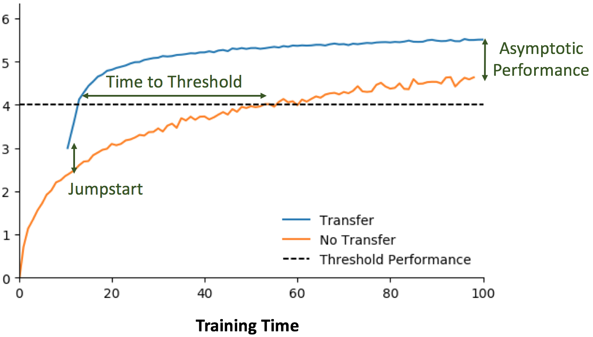
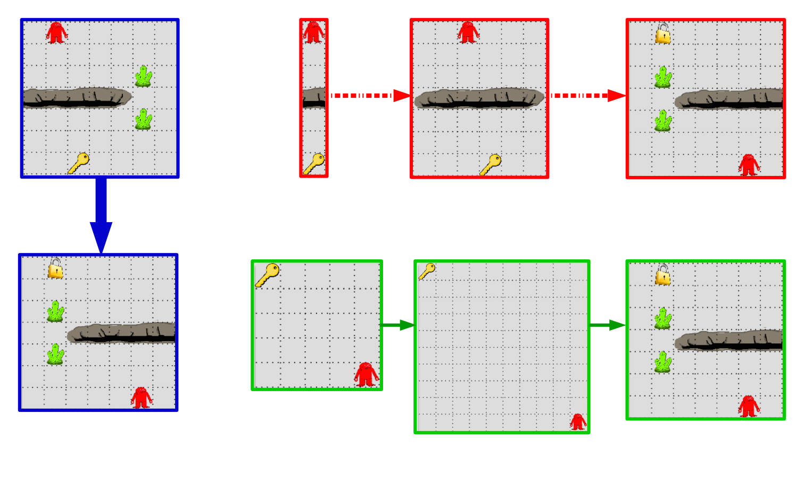
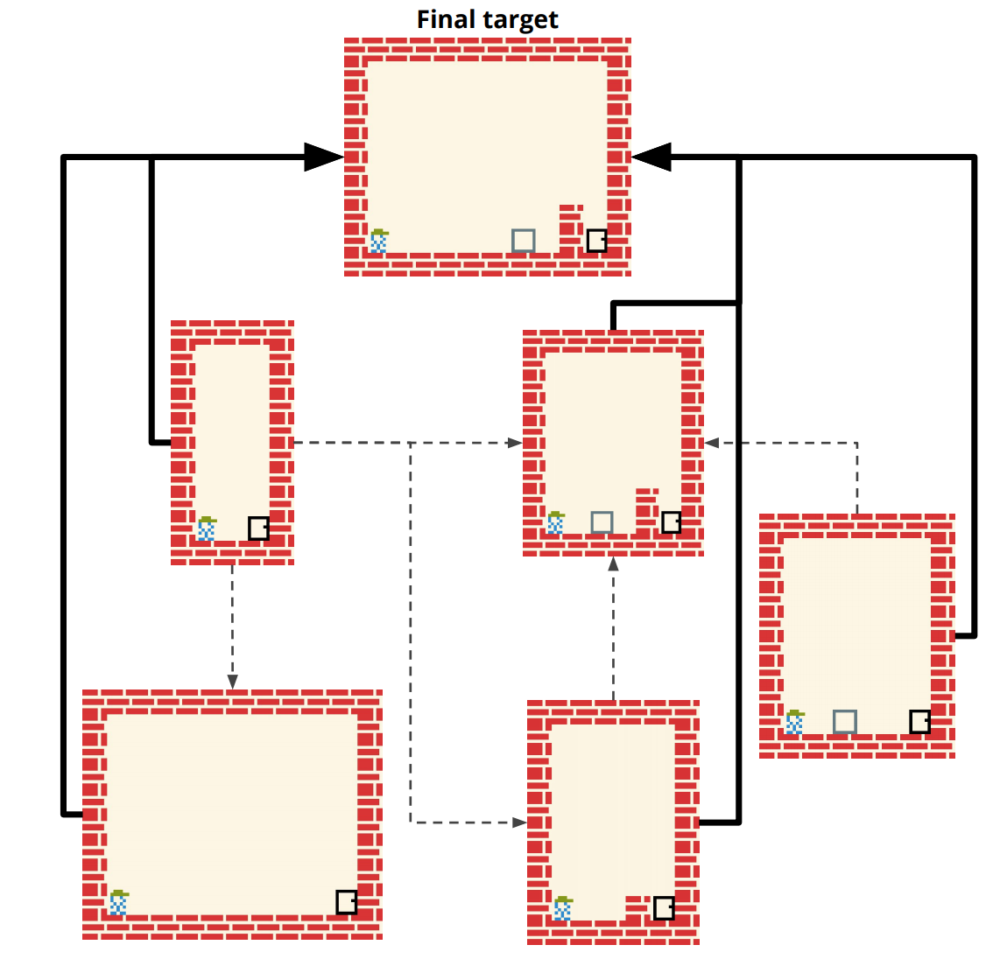
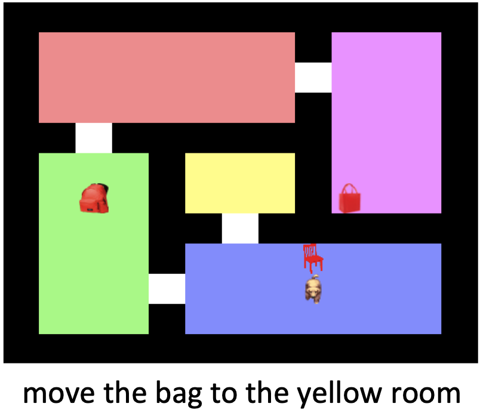
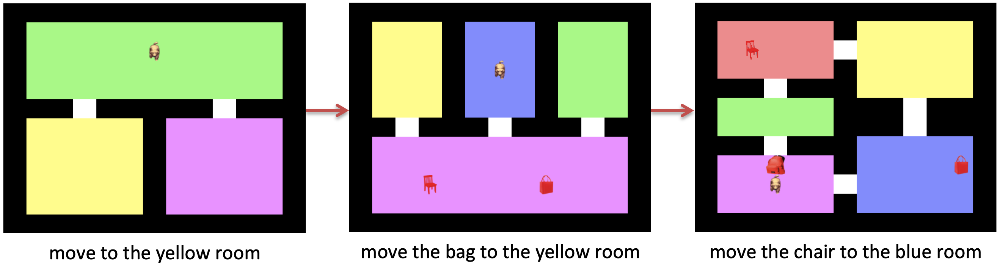

JournalofMachineLearningResearch21(2020)1-50 Submitted3/20;Revised7/20;Published7/20
| Curriculum |     | Learning |     | for Reinforcement |     | Learning |     | Domains: |
| ---------- | --- | -------- | --- | ----------------- | --- | -------- | --- | -------- |
|            |     |          | A   | Framework         | and | Survey   |     |          |
sanmit@cs.utexas.edu
| Sanmit     | Narvekar    |           |         |     |     |     |                      |     |
| ---------- | ----------- | --------- | ------- | --- | --- | --- | -------------------- | --- |
| Department | of Computer |           | Science |     |     |     |                      |     |
| University | of Texas    | at Austin |         |     |     |     |                      |     |
| Bei Peng   |             |           |         |     |     |     | bei.peng@cs.ox.ac.uk |     |
| Department | of Computer |           | Science |     |     |     |                      |     |
0202 peS 71  ]GL.sc[  2v06940.3002:viXra
| University | of Oxford |     |     |     |     |     |                        |     |
| ---------- | --------- | --- | --- | --- | --- | --- | ---------------------- | --- |
| Matteo     | Leonetti  |     |     |     |     |     | m.leonetti@leeds.ac.uk |     |
| School of  | Computing |     |     |     |     |     |                        |     |
| University | of Leeds  |     |     |     |     |     |                        |     |
jivko.sinapov@tufts.edu
Jivko Sinapov
| Department | of Computer |     | Science |     |     |     |     |     |
| ---------- | ----------- | --- | ------- | --- | --- | --- | --- | --- |
Tufts University
| Matthew    | E. Taylor    |              |           |     |     | matthew.e.taylor@ualberta.ca |                      |     |
| ---------- | ------------ | ------------ | --------- | --- | --- | ---------------------------- | -------------------- | --- |
| Alberta    | Machine      | Intelligence | Institute |     |     |                              |                      |     |
| Department | of Computing |              | Science   |     |     |                              |                      |     |
| University | of Alberta   |              |           |     |     |                              |                      |     |
| Peter      | Stone        |              |           |     |     |                              | pstone@cs.utexas.edu |     |
| Department | of Computer  |              | Science   |     |     |                              |                      |     |
| University | of Texas     | at Austin    |           |     |     |                              |                      |     |
| and Sony   | AI           |              |           |     |     |                              |                      |     |
| Editor:    | George       | Konidaris    |           |     |     |                              |                      |     |
Abstract
Reinforcementlearning(RL)isapopularparadigmforaddressingsequentialdecisiontasks
in which the agent has only limited environmental feedback. Despite many advances over
the past three decades, learning in many domains still requires a large amount of inter-
action with the environment, which can be prohibitively expensive in realistic scenarios.
To address this problem, transfer learning has been applied to reinforcement learning such
thatexperiencegainedinonetaskcanbeleveragedwhenstartingtolearnthenext,harder
task. More recently, several lines of research have explored how tasks, or data samples
themselves, can be sequenced into a curriculum for the purpose of learning a problem that
mayotherwisebetoodifficulttolearnfromscratch. Inthisarticle,wepresentaframework
for curriculum learning (CL) in reinforcement learning, and use it to survey and classify
existing CL methods in terms of their assumptions, capabilities, and goals. Finally, we
use our framework to find open problems and suggest directions for future RL curriculum
| learning  | research. |            |           |               |           |          |          |     |
| --------- | --------- | ---------- | --------- | ------------- | --------- | -------- | -------- | --- |
| Keywords: |           | curriculum | learning, | reinforcement | learning, | transfer | learning |     |
(cid:13)c2020SanmitNarvekar,BeiPeng,MatteoLeonetti,JivkoSinapov,MatthewE.Taylor,andPeterStone.
License: CC-BY4.0,seehttps://creativecommons.org/licenses/by/4.0/. Attributionrequirementsareprovided
athttp://jmlr.org/papers/v21/20-212.html.

Narvekar, Peng, Leonetti, Sinapov, Taylor, and Stone
Figure 1: Different subgames in the game of Quick Chess, which are used to form a cur-
riculum for learning the full game of Chess.
1. Introduction
Curricula are ubiquitous throughout early human development, formal education, and life-
long learning all the way to adulthood. Whether learning to play a sport, or learning to
become an expert in mathematics, the training process is organized and structured so as
to present new concepts and tasks in a sequence that leverages what has previously been
learned. Inavarietyofhumanlearningdomains,thequalityofthecurriculahasbeenshown
to be crucial in achieving success. Curricula are also present in animal training, where it is
commonly referred to as shaping (Skinner, 1958; Peterson, 2004).
Asamotivatingexample, considerthegameofQuickChess(showninFigure1), agame
designedtointroducechildrentothefullgameofchess, byusingasequenceofprogressively
more difficult “subgames.” For example, the first subgame is played on a 5x5 board with
only pawns, where the player learns how pawns move, get promoted, and take other pieces.
Next, in the second subgame, the king piece is added, which introduces a new objective:
keeping the king alive. In each successive subgame, new elements are introduced (such as
new pieces, a larger board, or different configurations) that require learning new skills and
building upon knowledge learned in previous games. The final game is the full game of
chess.
The idea of using such curricula to train artificial agents dates back to the early 1990s,
where the first known applications were to grammar learning (Elman, 1993; Rohde and
Plaut, 1999), robotics control problems (Sanger, 1994), and classification problems (Bengio
et al., 2009). Results showed that the order of training examples matters and that gen-
erally, incremental learning algorithms can benefit when training examples are ordered in
increasing difficulty. The main conclusion from these and subsequent works in curriculum
learning is that starting small and simple and gradually increasing the difficulty of the task
can lead to faster convergence as well as increased performance on a task.
Recently, research in reinforcement learning (RL) (Sutton and Barto, 1998) has been
exploring how agents can leverage transfer learning (Lazaric et al., 2008; Taylor and Stone,
2009)tore-useknowledgelearnedfromasourcetaskwhenattemptingtolearnasubsequent
target task. As knowledge is transferred from one task to the next, the sequence of tasks
induces a curriculum, which has been shown to improve performance on a difficult problem
and/or reduce the time it takes to converge to an optimal policy.
2

Curriculum Learning for Reinforcement Learning Domains
Many groups have beenstudying how such a curriculum canbe generated automatically
to train reinforcement learning agents, and many approaches to do so now exist. However,
what exactly constitutes a curriculum and what precisely qualifies an approach as being
an example of curriculum learning is not clearly and consistently defined in the literature.
There are many ways of defining a curriculum: for example, the most common way is as an
ordering of tasks. At a more fundamental level, a curriculum can also be defined as an or-
deringofindividualexperiencesamples. Inaddition, acurriculumdoesnotnecessarilyhave
to be a simple linear sequence. One task can build upon knowledge gained from multiple
source tasks, just as courses in human education can build off of multiple prerequisites.
Methods for curriculum generation have separately been introduced for areas such as
robotics, multi-agent systems, human-computer and human-robot interaction, and intrinsi-
cally motivated learning. This body of work, however, is largely disconnected. In addition,
many landmark results in reinforcement learning, from TD-Gammon (Tesauro, 1995) to
AlphaGo (Silver et al., 2016) have implicitly used curricula to guide training. In some
domains, researchers have successfully used methodologies that align with our definition of
curriculum learning without explicitly describing it that way (e.g., self-play). Given the
many landmark results that have utilized ideas from curriculum learning, we think it is
very likely that future landmark results will also rely on curricula, perhaps more so than
researchers currently expect. Thus, having a common basis for discussion of ideas in this
area is likely to be useful for future AI challenges.
Overview
The goal of this article is to provide a systematic overview of curriculum learning (CL) in
RL settings and to provide an over-arching framework to formalize this class of methods.
We aim to define classification criteria for computational models of curriculum learning for
RL agents, that describe the curriculum learning research landscape over a broad range of
frameworks and settings. The questions we address in this survey include:
• Whatisacurriculum, andhowcanitberepresentedforreinforcementlearningtasks?
At the most basic level, a curriculum can be thought of as an ordering over experience
samples. However, it can also be represented at the task level, where a set of tasks
can be organized into a sequence or a directed acyclic graph that specifies the order
in which they should be learned. We address this question in detail in Section 3.1.
• What is the curriculum learning method, and how can such methods be evaluated?
We formalize this class of methods in Section 3.2 as consisting of three parts, and
extend metrics commonly used in transfer learning (introduced in Section 2) to the
curriculum setting to facilitate evaluation in Section 3.3.
• How can tasks be constructed for use in a curriculum? The quality of a curriculum
is dependent on the quality of tasks available to select from. Tasks can either be
generated in advance, or dynamically and on-the-fly with the curriculum. Section 4.1
surveys works that examine how to automatically generate good intermediate tasks.
• How can tasks or experience samples be sequenced into a curriculum? In practice,
most curricula for RL agents have been manually generated for each problem. How-
3

Narvekar, Peng, Leonetti, Sinapov, Taylor, and Stone
ever, inrecentyears, automatedmethodsforgeneratingcurriculahavebeenproposed.
Each makes different assumptions about the tasks and transfer methodology used. In
Section 4.2, we survey these different automated approaches, as well as describe how
humans have approached curriculum generation for RL agents.
• How can an agent transfer knowledge between tasks as it learns through a curricu-
lum? Curriculum learning approaches make use of transfer learning methods when
moving from one task to another. Since the tasks in the curriculum can vary in
state/action space, transition function, or reward function, it’s important to transfer
relevantandreusableinformationfromeachtask, andeffectivelycombineinformation
from multiple tasks. Methods to do this are enumerated and discussed in Section 4.3.
The next section provides background in reinforcement learning and transfer learning.
In Section 3, we define the curriculum learning method, evaluation metrics, and the di-
mensions along which we will classify curriculum learning approaches. Section 4, which
comprises the core of the survey, provides a detailed overview of the existing state of the art
in curriculum learning in RL, with each subsection considering a different component of the
overall curriculum learning approach. Section 5 discusses paradigms related to curriculum
learning for RL, such as curriculum learning for supervised learning and for human educa-
tion. Finally, in Section 6, we identify gaps in the existing literature, outline the limitations
of existing CL methods and frameworks, and provide a list of open problems.
2. Background
Inthissection,weprovidebackgroundonReinforcementLearning(RL)andTransferLearn-
ing (TL).
2.1 Reinforcement Learning
Reinforcementlearningconsiderstheproblemofhowanagentshouldactinitsenvironment
over time, so as to maximize some scalar reward signal. We can formalize the interaction
of an agent with its environment (also called a task) as a Markov Decision Process (MDP).
In this article, we restrict our attention to episodic MDPs:1
Definition 1 An episodic MDP M is a 6-tuple (S,A,p,r,∆s ,S ), where S is the set of
0 f
states, A is the set of actions, p(s(cid:48)|s,a) is a transition function that gives the probability of
transitioning to state s(cid:48) after taking action a in state s, and r(s,a,s(cid:48)) is a reward function
that gives the immediate reward for taking action a in state s and transitioning to state s(cid:48).
In addition, we shall use ∆s to denote the initial state distribution, and S to denote the
0 f
set of terminal states.
We consider time in discrete time steps. At each time step t, the agent observes its state
and chooses an action according to its policy π(a|s). The goal of the agent is to learn an
1. In continuing tasks, a discount factor γ is often included. For simplicity, and due to the fact that
tasks typically terminate in curriculum learning settings, we present the undiscounted case. But unless
otherwise noted, our definitions and discussions can easily apply to the discounted case as well.
4

|     | Curriculum | Learning | for Reinforcement |     | Learning | Domains |
| --- | ---------- | -------- | ----------------- | --- | -------- | ------- |
π∗,
optimal policy which maximizes the expected return G t (the cumulative sum of rewards
| R) until | the episode ends | at timestep | T:  |     |     |     |
| -------- | ---------------- | ----------- | --- | --- | --- | --- |
T−t
(cid:88)
|     |     |     | G = | R   |     |     |
| --- | --- | --- | --- | --- | --- | --- |
|     |     |     | t   | t+i |     |     |
i=1
There are three main classes of methods to learn π∗: value function approaches, policy
search approaches, and actor-critic methods. In value function approaches, a value v (s) is
π
firstlearnedforeachstates,representingtheexpectedreturnachievablefromsbyfollowing
policy π. Through policy evaluation and policy improvement, this value function is used
to derive a policy better than π, until convergence towards an optimal policy. Using a
value function in this process requires a model of the reward and transition functions of
the environment. If the model is not known, one option is to learn an action-value function
instead, q (s,a), whichgivestheexpectedreturnfortakingactionainstatesandfollowing
π
π after:
(cid:88)
|     | q (s,a) | = p(s(cid:48)|s,a)[r(s,a,s(cid:48))+q |     | (s(cid:48),a(cid:48))] | , where | a(cid:48) ∼ π(·|s(cid:48)) |
| --- | ------- | ------------------------------------- | --- | ---------------------- | ------- | -------------------------- |
|     | π       |                                       |     | π                      |         |                            |
s(cid:48)
The action-value function can be iteratively improved towards the optimal action-value
function q with on-policy methods such as SARSA (Sutton and Barto, 1998). The optimal
∗
action-valuefunctioncanalsobelearneddirectlywithoff-policymethodssuchasQ-learning
(Watkins and Dayan, 1992). An optimal policy can then be obtained by choosing action
argmax q (s,a) in each state. If the state space is large or continuous, the action-value
| a   | ∗   |     |     |     |     |     |
| --- | --- | --- | --- | --- | --- | --- |
functioncaninsteadbeestimatedusingafunctionapproximator(suchasaneuralnetwork),
| q(s,a;w) | ≈ q (s,a), where | w are | the weights | of the network. |     |     |
| -------- | ---------------- | ----- | ----------- | --------------- | --- | --- |
∗
In contrast, policy search methods directly search for or learn a parameterized policy
π (a|s), without using an intermediary value function. Typically, the parameter θ is modi-
θ
fied using search or optimization techniques to maximize some performance measure J(θ).
For example, in the episodic case, J(θ) could correspond to the expected value of the policy
| parameterized | by θ from | the starting | state s | ∼ ∆s : | v (s ). |     |
| ------------- | --------- | ------------ | ------- | ------ | ------- | --- |
|               |           |              |         | 0 0    | π θ 0   |     |
A third class of methods, actor-critic methods, maintain a parameterized representation
of both the current policy and value function. The actor is a parameterized policy that
dictates how the agent selects actions. The critic estimates the (action-)value function for
the actor using a policy evaluation method such as temporal-difference learning. The actor
then updates the policy parameter in the direction suggested by the critic. An example of
actor-critic methods is Deterministic Policy Gradient (Silver et al., 2014).
| 2.2 Transfer | Learning |     |     |     |     |     |
| ------------ | -------- | --- | --- | --- | --- | --- |
Inthestandardreinforcementlearningsetting,anagentusuallystartswitharandompolicy,
anddirectlyattemptstolearnanoptimalpolicyforthetargettask. Whenthetargettaskis
difficult, for example due to adversarial agents, poor state representation, or sparse reward
| signals, | learning can be | very slow. |     |     |     |     |
| -------- | --------------- | ---------- | --- | --- | --- | --- |
Transfer learning is one class of methods and area of research that seeks to speed up
training of RL agents. The idea behind transfer learning is that instead of learning on the
target task tabula rasa, the agent can first train on one or more source task MDPs, and
5

Narvekar, Peng, Leonetti, Sinapov, Taylor, and Stone
transfer the knowledge acquired to aid in solving the target. This knowledge can take the
form of samples (Lazaric et al., 2008; Lazaric and Restelli, 2011), options (Soni and Singh,
2006), policies (Fern´andez et al., 2010), models (Fachantidis et al., 2013), or value functions
(Taylor and Stone, 2005). As an example, in value function transfer (Taylor et al., 2007),
the parameters of an action-value function q (s,a) learned in a source task are used to
source
initialize the action-value function in the target task q (s,a). This biases exploration
target
and action selection in the target task based on experience acquired in the source task.
Some of these methods assume that the source and target MDPs either share state and
action spaces, or that a task mapping (Taylor et al., 2007) is available to map states and
actions in the target task to known states and actions in the source. Such mappings can
be specified by hand, or learned automatically (Taylor et al., 2008; Ammar et al., 2015).
Other methods assume the transition or reward functions do not change between tasks.
The best method to use varies by domain, and depends on the relationship between source
and target tasks. Finally, while most methods assume that knowledge is transferred from
one source task to one target task, some methods have been proposed to transfer knowledge
from several source tasks directly to a single target (Svetlik et al., 2017). See Taylor and
Stone (2009) or Lazaric (2012) for a survey of transfer learning techniques.
2.3 Evaluation Metrics for Transfer Learning
There are several metrics to quantify the benefit of transferring from a source task to
a target task (Taylor and Stone, 2009). Typically, they compare the learning trajectory
on the target task for an agent after transfer, with an agent that learns directly on the
target task from scratch (see Figure 2a). One metric is time to threshold, which computes
how much faster an agent can learn a policy that achieves expected return G ≥ δ on
0
the target task if it transfers knowledge, as opposed to learning the target from scratch,
where δ is some desired performance threshold. Time can be measured in terms of CPU
time, wall clock time, episodes, or number of actions taken. Another metric is asymptotic
performance, which compares the final performance after convergence in the target task of
learners when using transfer versus no transfer. The jumpstart metric instead measures
the initial performance increase on the target task as a result of transfer. Finally, the total
reward ratio compares the total reward accumulated by the agent during training up to a
fixed stopping point, using transfer versus not using transfer.
An important evaluation question is whether to include time spent learning in source
tasks into the cost of using transfer. The transfer curve in Figure 2a shows performance on
the target task, and starts at time 0, even though time has already been spent learning one
or more source tasks. Thus, it does not reflect time spent training in source tasks before
transferring to the target task. This is known in transfer learning as the weak transfer
setting, where time spent training in source tasks is treated as a sunk cost. On the other
hand, in the strong transfer setting, the learning curves must account for time spent in all
source tasks. One way to do this is to offset the curves to reflect time spent in source tasks,
as shown in Figure 2b. Another option is to freeze the policy while learning on source tasks,
and plot that policy’s performance on the target task.
6

|     | Curriculum | Learning | for | Reinforcement | Learning | Domains |
| --- | ---------- | -------- | --- | ------------- | -------- | ------- |
|     |            | (a)      |     |               |          | (b)     |
Figure 2: Performance metrics for transfer learning using (a) weak transfer and (b) strong
|        | transfer with | offset   | curves. |     |     |     |
| ------ | ------------- | -------- | ------- | --- | --- | --- |
| 3. The | Curriculum    | Learning | Method  |     |     |     |
A curriculum serves to sort the experience an agent acquires over time, in order to accel-
erate or improve learning. In the rest of this section we formalize this concept and the
methodology of curriculum learning, and describe how to evaluate the benefits and costs of
using a curriculum. Finally, we provide a list of attributes which we will use to categorize
| curriculum | learning | approaches | in the | rest of this | survey. |     |
| ---------- | -------- | ---------- | ------ | ------------ | ------- | --- |
3.1 Curricula
A curriculum is a general concept that encompasses both schedules for organizing past
experiences, and schedules for acquiring experience by training on tasks. As such, we first
propose a fully general definition of curriculum, and then follow it with refinements that
| apply to | special cases | common | in the | literature. |     |     |
| -------- | ------------- | ------ | ------ | ----------- | --- | --- |
We assume a task is modeled as a Markov Decision Process, and define a curriculum as
follows:
Definition 2 (Curriculum) Let T be a set of tasks, where m i = (S i ,A i ,p i ,r i ) is a
task in T. Let DT be the set of all possible transition samples from tasks in T: DT =
{(s,a,r,s(cid:48)) | ∃m ∈ T s.t. s ∈ S ,a ∈ A ,s(cid:48) ∼ p (·|s,a),r ← r (s,a,s(cid:48))}. A curricu-
|     | i   |     | i   | i   | i   | i   |
| --- | --- | --- | --- | --- | --- | --- |
lum C = (V,E,g,T) is a directed acyclic graph, where V is the set of vertices, E ⊆
{(x,y) | (x,y) ∈ V × V ∧ x (cid:54)= y} is the set of directed edges, and g : V → P(DT) is a
function that associates vertices to subsets of samples in DT, where P(DT) is the power set
DT.
of A directed edge (cid:104)v ,v (cid:105) in C indicates that samples associated with v ∈ V should
j k j
be trained on before samples associated with v k ∈ V. All paths terminate on a single sink
| node v | ∈ V.2 |     |     |     |     |     |
| ------ | ----- | --- | --- | --- | --- | --- |
t
A curriculum can be created online, where edges are added dynamically based on the
learning progress of the agent on the samples at a given vertex. It can also be designed
2. In theory, a curriculum could have multiple sink nodes corresponding to different target tasks. For the
purpose of exposition, we assume a separate curriculum is created and used for each task.
7

|     | Narvekar, | Peng, | Leonetti, | Sinapov, Taylor, | and Stone |     |
| --- | --------- | ----- | --------- | ---------------- | --------- | --- |
completely offline, where the graph is generated before training, and edges are selected
| based on | properties | of the samples | associated | with different | vertices. |     |
| -------- | ---------- | -------------- | ---------- | -------------- | --------- | --- |
Creating a curriculum graph at the sample level can be computationally difficult for
large tasks, or large sets of tasks. Therefore, in practice, a simplified representation for a
curriculum is often used. There are 3 common dimensions along which this simplification
canhappen. Thefirstisthesingle-taskcurriculum,whereallsamplesusedinthecurriculum
| come from | a single | task: |     |     |     |     |
| --------- | -------- | ----- | --- | --- | --- | --- |
Definition 3 (Single-task Curriculum) Asingle-taskcurriculumisacurriculumC where
the cardinality of the set of tasks considered for extracting samples |T| = 1, and consists of
| only the | target task | m . |     |     |     |     |
| -------- | ----------- | --- | --- | --- | --- | --- |
t
A single-task curriculum essentially considers how best to organize and train on experi-
ence acquired from a single task. This type of curriculum is common in experience replay
| methods | (Schaul et | al., 2016). |     |     |     |     |
| ------- | ---------- | ----------- | --- | --- | --- | --- |
A second common simplification is to learn a curriculum at the task level, where each
vertex in the graph is associated with samples from a single task. At the task level, a
curriculum can be defined as a directed acyclic graph of intermediate tasks:
Definition 4 (Task-level Curriculum) For each task m ∈ T, let DT be the set of all
|     |     |     |     |     | i i |     |
| --- | --- | --- | --- | --- | --- | --- |
samples associated with task m : DT = {(s,a,r,s(cid:48)) | s ∈ S ,a ∈ A ,s(cid:48) ∼ p (·|s,a),r ←
|     |     |     | i i |     | i i | i   |
| --- | --- | --- | --- | --- | --- | --- |
(s,a,s(cid:48))}.
r i A task-level curriculum is a curriculum C = (V,E,g,T) where each vertex is
associated with samples from a single task in T. Thus, the mapping function g is defined
| as g : V | → {DT | m | ∈ T}. |     |     |     |     |
| -------- | --------- | ----- | --- | --- | --- | --- |
|          | i         | i     |     |     |     |     |
In reinforcement learning, the entire set of samples from a task (or multiple tasks) is
usually not available ahead of time. Instead, the samples experienced in a task depend on
the agent’s behavior policy, which can be influenced by previous tasks learned. Therefore,
while generating a task-level curriculum, the main challenge is how to order tasks such that
the behavior policy learned is useful for acquiring good samples in future tasks. In other
words, selecting andtraining on atask minduces a mapping functiong, and determines the
set of samples DT that will be available at the next vertex based on the agent’s behavior
i
policy as a result of learning m. The same task is allowed to appear at more than one
vertex, similar to how in Definition 2 the same set of samples can be associated with more
than one vertex. Therefore, tasks can be revisited when the agent’s behavior policy has
changed. Several works have considered learning task-level curricula over a graph of tasks
(Svetlik et al., 2017; MacAlpine and Stone, 2018). An example can be seen in Figure 3b.
Finally, another simplification of the curriculum is the linear sequence. This is the
simplest and most common structure for a curriculum in existing work:
Definition 5 (Sequence Curriculum) A sequence curriculum is a curriculum C where
the indegree and outdegree of each vertex v in the graph C is at most 1, and there is exactly
| one source | node and | one sink node. |     |     |     |     |
| ---------- | -------- | -------------- | --- | --- | --- | --- |
These simplifications can be combined to simplify a curriculum along multiple dimen-
sions. For example, the sequence simplification and task-level simplification can be com-
8

|     | Curriculum |     | Learning | for | Reinforcement | Learning Domains |
| --- | ---------- | --- | -------- | --- | ------------- | ---------------- |
bined to produce a task-level sequence curriculum. This type of curriculum can be rep-
resented as an ordered list of tasks [m ,m ,...m ]. An example can be seen in Figure 3a
|           |     |             |     |     | 1 2 n |     |
| --------- | --- | ----------- | --- | --- | ----- | --- |
| (Narvekar | et  | al., 2017). |     |     |       |     |
Afinalimportantquestionwhendesigningcurriculaisdeterminingthestoppingcriteria:
that is, how to decide when to stop training on samples or tasks associated with a vertex,
andmoveontothenextvertex. Inpractice, typicallytrainingisstoppedwhenperformance
onthetaskorsetofsampleshasconverged. Trainingtoconvergenceisnotalwaysnecessary,
so another option is to train on each vertex for a fixed number of episodes or epochs. Since
more than one vertex can be associated with the same samples/tasks, this experience can
| be revisited   | later | on       | in the curriculum. |     |     |     |
| -------------- | ----- | -------- | ------------------ | --- | --- | --- |
| 3.2 Curriculum |       | Learning |                    |     |     |     |
Curriculum learning is a methodology to optimize the order in which experience is accumu-
lated by the agent, so as to increase performance or training speed on a set of final tasks.
Through generalization, knowledge acquired quickly in simple tasks can be leveraged to
reduce the exploration of more complex tasks. In the most general case, where the agent
can acquire experience from multiple intermediate tasks that differ from the final MDP,
| there are | 3 key | elements | to this | method: |     |     |
| --------- | ----- | -------- | ------- | ------- | --- | --- |
• Task Generation. The quality of a curriculum is dependent on the quality of tasks
available to choose from. Task generation is the process of creating a good set of
intermediate tasks from which to obtain experience samples. In a task-level curricu-
lum, these tasks form the nodes of the curriculum graph. This set of intermediate
tasks may either be pre-specified, or dynamically generated during the curriculum
| construction |     | by  | observing | the agent. |     |     |
| ------------ | --- | --- | --------- | ---------- | --- | --- |
• Sequencing. Sequencingexamineshowtocreateapartialorderingoverthesetofex-
perience samples D: that is, how to generate the edges of the curriculum graph. Most
existingworkhasusedmanuallydefinedcurricula, whereahumanselectstheordering
of samples or tasks. However, recently automated methods for curriculum sequencing
have begun to be explored. Each of these methods make different assumptions about
the tasks and transfer methodology used. These methods will be the primary focus
| of  | this survey. |     |     |     |     |     |
| --- | ------------ | --- | --- | --- | --- | --- |
• Transfer Learning. Whencreatingacurriculumusingmultipletasks,theintermedi-
atetasksmaydifferinstate/actionspace, rewardfunction, ortransitionfunctionfrom
the final task. Therefore, transfer learning is needed to extract and pass on reusable
knowledge acquired in one task to the next. Typically, work in transfer learning has
examined how to transfer knowledge from one or more source tasks directly to the
target task. Curriculum learning extends the transfer learning scenario to consider
trainingsessionsinwhichtheagentmustrepeatedlytransferknowledgefromonetask
| to  | another, | up  | to a set | of final | tasks. |     |
| --- | -------- | --- | -------- | -------- | ------ | --- |
9

Narvekar, Peng, Leonetti, Sinapov, Taylor, and Stone
(a) (b)
Figure 3: Examples of structures of curricula from previous work. (a) Linear sequences in
a gridworld domain (Narvekar et al., 2017) (b) Directed acyclic graphs in block
dude (Svetlik et al., 2017).
3.3 Evaluating Curricula
Curricula can be evaluated using the same metrics as for transfer learning (cf. Section 2.3),
bycomparingperformanceonthetargettaskafterfollowingthecompletecurriculum,versus
performance following no curriculum (i.e., learning from scratch). If there are multiple final
tasks,themetricscaneasilybeextended: forexample,bycomparingtheaverageasymptotic
performance over a set of tasks, or the average time to reach a threshold performance level
over a set of tasks.
Similarly, it is possible to distinguish between weak and strong transfer. However, in
curriculum learning, there is the additional expense required to build the curriculum itself,
in addition to training on intermediate tasks in the curriculum, which can also be factored
in when evaluating the cost of the curriculum. As in the transfer learning case, cost can be
measured in terms of wall clock time, or data/sample complexity.
Mostexistingapplicationsofcurriculainreinforcementlearninghaveusedcurriculacre-
ated byhumans. In thesecases, itcan bedifficult toassess how much time, effort, and prior
knowledge was used to design the curriculum. Automated approaches to generate a cur-
riculum also typically require some prior knowledge or experience in potential intermediate
tasks, in order to guide the sequencing of tasks. Due to these difficulties, these approaches
have usually treated curriculum generation as a sunk cost, focusing on evaluating the per-
formance of the curriculum itself, and comparing it versus other curricula, including those
designed by people.
The bestset ofevaluationcriteria to useultimately depends on thespecific problemand
settings being considered. For example, how expensive is it to collect data on the final task
compared to intermediate tasks? If intermediate tasks are relatively inexpensive, we can
treat time spent in them as sunk costs. Is it more critical to improve initial performance,
finalperformance, orreachingadesiredperformancethreshold? Ifdesigningthecurriculum
10

Curriculum Learning for Reinforcement Learning Domains
will require human interaction, how will this time be factored into the cost of using a
curriculum? Many of these questions depend on whether we wish to evaluate the utility
of a specific curriculum (compared to another curriculum), or whether we wish to evaluate
the utility of using a curriculum design approach versus training without one.
3.4 Dimensions of Categorization
We categorize curriculum learning approaches along the following seven dimensions, or-
ganized by attributes (in bold) and the values (in italics) they can take. We use these
dimensions to create a taxonomy of surveyed work in Section 4.
1. Intermediate task generation: target / automatic / domain experts / naive users.
In curriculum learning, the primary challenge is how to sequence a set of tasks to
improve learning speed. However, finding a good curriculum depends on first having
useful source tasks to select from. Most methods assume the set of possible source
tasks is fixed and given ahead of time. In the simplest case, only samples from the
target task are used. When more than one intermediate task is used, typically they
are manually designed by humans. We distinguish such tasks as designed by either
domain experts, who have knowledge of the agent and its learning algorithm, or naive
users, who do not have this information. On the other hand, some works consider
automatically creating tasks online using a set of rules or generative process. These
approaches may still rely on some human input to control/tune hyper-parameters,
such as the number of tasks generated, or to verify that generated tasks are actually
solvable.
2. Curriculum representation: single / sequence / graph. Aswediscussedpreviously,
the most general form of a curriculum is a directed acyclic graph over subsets of
samples. However, in practice, simplified versions of this representation are often
used. In the simplest case, a curriculum is an ordering over samples from a single
task. When multiple tasks can be used in a curriculum, curricula are often created at
the task-level. These curricula can be represented as a linear chain, or sequence. In
thiscase, thereisexactlyonesourceforeachintermediatetaskinthecurriculum. Itis
uptothe transferlearningalgorithmtoappropriatelyretainand combineinformation
gathered from previous tasks in the chain. More generally, they can be represented as
a full directed acyclic graph of tasks. This form supports transfer learning methods
that transfer from many-to-one, one-to-many, and many-to-many tasks.
3. Transfer method: policies / value function / task model / partial policies / shap-
ing reward / other / no transfer. Curriculum learning leverages ideas from transfer
learning to transfer knowledge between tasks in the curriculum. As such, the trans-
fer learning algorithm used affects how the curriculum will be produced. The type
of knowledge transferred can be low-level knowledge, such as an entire policy, an
(action-)value function, or a full task model, which can be used to directly initialize
the learner in the target task. It can also be high-level knowledge, such as partial
policies (e.g. options) or shaping rewards. This type of information may not fully ini-
tialize the learner in the target task, but it could be used to guide the agent’s learning
process in the target task. We use partial policies as an umbrella term to represent
11

Narvekar, Peng, Leonetti, Sinapov, Taylor, and Stone
closely related ideas such as options, skills, and macro-actions. When samples from
a single task are sequenced, no transfer learning algorithm is necessary. Finally, we
use other to refer to other types of transfer learning methods. We categorize papers
along this dimension based on what is transferred between tasks in the curriculum in
each paper’s experimental results.
4. Curriculum sequencer: automatic / domain experts / naive users. Curriculum
learningisathree-partmethod,consistingoftaskgeneration,sequencing,andtransfer
learning. While much of the attention of this survey is on automated sequencing
approaches, many works consider the other parts of this method, and assume the
sequencing is done by a human or oracle. Thus, we identify and categorize the type
of sequencing approach used in each work similar to task generation: it can be done
automatically by a sequencing algorithm, or manually by humans that are either
domain experts or naive users.
5. Curriculum adaptivity: static / adaptive. Another design question when creating
a curriculum is whether it should be generated in its entirety before training, or
dynamically adapted during training. We refer to the former type as static and to
the latter as adaptive. Static approaches use properties of the domain and possibly
of the learning agent, to generate a curriculum before any task is learned. Adaptive
methods, on the other hand, are influenced by properties that can only be measured
during learning, such as the learning progress by the agent on the task it is currently
facing. For example, learning progress can be used to guide whether subsequent tasks
shouldbeeasierorharder,aswellashowrelevantataskisfortheagentataparticular
point in the curriculum.
6. Evaluation metric: time to threshold / asymptotic / jumpstart / total reward. We
discussed four metrics to quantify the effectiveness of learned curricula in Section
3.3. When calculating these metrics, one can choose whether to treat time spent
generating the curriculum and training on the curriculum as a sunk cost, or whether
to account for both of these for performance. Specifically, there are three ways to
measure the cost of learning and training via a curriculum. 1) The cost of generating
and using the curriculum is treated as a sunk cost, and the designer is only concerned
with performance on the target task after learning. This case corresponds to the weak
transfer setting. 2) The cost of training on intermediate tasks in the curriculum is
accounted for, when comparing to training directly on the target task. This case is
most common when it is hard to evaluate the cost of generating the curriculum itself,
for example if it was hand-designed by a human. 3) Lastly, the most comprehensive
case accounts for the cost of generating the curriculum as well as training via the
curriculum. We will refer to the last two as strong transfer, and indicate it by bolding
thecorrespondingmetric. Notethatachievingasymptoticperformanceimprovements
implies strong transfer.
7. Application area: toy / sim robotics / real robotics / video games / other. Curricu-
lum learning methods have been tested in a wide variety of domains. Toy domains
consistofenvironmentssuchasgridworlds,cart-pole,andotherlowdimensionalenvi-
ronments. Sim robotics environments simulate robotic platforms, such as in MuJoCo.
12

Curriculum Learning for Reinforcement Learning Domains
Real robotics papers test their method on physical robotic platforms. Video games
consist of game environments such as Starcraft or the Arcade Learning Environment
(Atari). Finally, other is used for custom domains that do not fit in these categories.
We list these so that readers can better understand the scalability and applicability
of different approaches, and use these to inform what methods would be suitable for
their own problems.
4. Curriculum Learning for Reinforcement Learning Agents
In this section, we systematically survey work on each of the three central elements of
curriculum learning: task generation (Section 4.1), sequencing (Section 4.2), and transfer
learning (Section 4.3). For each of these subproblems, we provide a table that categorizes
work surveyed according to the dimensions outlined in Section 3. The bulk of our attention
will be devoted to the subproblem most commonly associated with curriculum learning:
sequencing.
4.1 Task Generation
Task generation is the problem of creating intermediate tasks specifically to be part of a
curriculum. In contrast to the life-long learning scenario, where potentially unrelated tasks
are constantly proposed to the agent (Thrun, 1998), the aim of task generation is to create
a set of tasks such that knowledge transfer through them is beneficial. Therefore, all the
generated tasks should be relevant to the final task(s) and avoid negative transfer, where
using a task for transfer hurts performance. The properties of the research surveyed in this
section are reported in Table 1.
Very limited work has been dedicated to formally studying this subproblem in the con-
textofreinforcementlearning. Allknownmethodsassumethedomaincanbeparameterized
using some kind of representation, where different instantiations of these parameters create
differenttasks. Forinstance,Narvekaretal.(2016)introduceanumberofmethodstocreate
intermediate tasks for a specific final task. The methods hinge on a definition of a domain
as a set of MDPs identified by a task descriptor, which is a vector of parameters specifying
the degrees of freedom in the domain. For example, in the quick chess example (see Section
1), these parameters could be the size of the board, number of pawns, etc. By varying
the degrees of freedom and applying task restrictions, the methods define different types of
tasks. Methods introduced include: task simplification, which directly changes the degrees
of freedom to reduce the task dimensions; promising initialization, which modifies the set
of initial states by adding states close to high rewards; mistake learning, which rewinds the
domain to a state a few steps before a mistake is detected and resumes learning from there;
and several other methods. The set of methods determine different kinds of possible tasks,
which form a space of tasks in which appropriate intermediate tasks can be chosen.
Da Silva and Reali Costa (2018) propose a similar partially automated task generation
procedure in their curriculum learning framework, based on Object-Oriented MDPs. Each
task is assumed to have a class environment parameterized by a number of attributes.
A function, which must be provided by the designer, creates simpler versions of the final
task by instantiating the attributes with values that make the tasks easier to solve. For
example, continuing the quick chess example, the attributes could be the types of pieces,
13

Narvekar, Peng, Leonetti, Sinapov, Taylor, and Stone
Citation Intermediate Curriculum Transfer Curriculum Curriculum Evaluation Application
Task Representation Method Sequencer Adaptivity Metric Area
Generation
DaSilvaandRealiCosta(2018) automatic graph valuefunction automatic static timetothreshold,totalreward toy,videogames
Narvekaretal.(2016) automatic sequence valuefunction domainexperts adaptive asymptotic videogames
Schmidhuber(2013) automatic sequence partialpolicies automatic adaptive asymptotic other
StoneandVeloso(1994) automatic sequence other domainexperts adaptive timetothreshold other
Table 1: The papers discussed in Section 4.1, categorized along the dimensions presented
in Section 3.4. Bolded values under evaluation metric indicate strong transfer.
and the values are the number of each type of piece. The presence of different kinds and
numbers of objects provide a range of tasks with different levels of difficulty. However, since
the generation is mostly random, the designer has to make sure that the tasks are indeed
solvable.
Generating auxiliary intermediate tasks is a problem that has been studied in non-RL
contexts as well. For instance, Stone and Veloso (1994) consider how to semiautomatically
create subproblems to aid in learning to solve difficult planning problems. Rather than
using a static analysis of the domain’s properties, they propose to use a partially completed
search trajectory of the target task to identify what makes a problem difficult, and suggest
auxiliary tasks. For example, if the task took too long and there are multiple goals in the
task, try changing the order of the goals. Other methods they propose include reducing the
number of goals, creating tasks to solve difficult subgoals, and changing domain operators
and objects available for binding.
Lastly,Schmidhuber(2013)introducedPowerplay,aframeworkthatfocusesoninventing
new problems to train a more and more general problem solver in an unsupervised fashion.
The system searches for both a new task and a modification of the current problem solver,
such that the modified solver can solve all previous tasks, plus the new one. The search acts
onadomain-dependentencodingoftheproblemandthesolver, andhasbeendemonstrated
on pattern recognition and control tasks (Srivastava et al., 2013). The generator of the task
and new solver is given a limited computational budget, so that it favors the generation
of the simplest tasks that could not be solved before. Furthermore, a possible task is to
solveallprevioustasks, butwithamorecompactrepresentationofthesolver. Theresulting
iterativeprocessmakesthesystemincreasinglymorecompetentatdifferenttasks. Thetask
generation process effectively creates a curriculum, although in this context there are no
final tasks, and the system continues to generate pairs of problems and solvers indefinitely,
without any specific goal.
4.2 Sequencing
Given a set of tasks, or samples from them, the goal of sequencing is to order them in a
way that facilitates learning. Many different sequencing methods exist, each with their own
set of assumptions. One of the fundamental assumptions of curriculum learning is that we
can configure the environment to create different tasks. For the practitioner attempting
to use curriculum learning, the amount of control one has to shape the environment af-
fects the type of sequencing methods that could be applicable. Therefore, we categorize
sequencing methods by the degree to which intermediate tasks may differ. Specifically, they
14

Curriculum Learning for Reinforcement Learning Domains
form a spectrum, ranging from methods that simply reorder experience in the final task
without modifying any property of the corresponding MDP, to ones that define entirely
new intermediate tasks, by progressively adjusting some or all of the properties of the final
task.
In this subsection, we discuss the different sequencing approaches. First, in Section
4.2.1, we consider methods that reorder samples in the target task to derive a curriculum.
Experience replay methods are one such example. In Section 4.2.2, we examine multi-
agent approaches to curriculum generation, where the cooperation or competition between
two (typically evolving) agents induces a sequence of progressively challenging tasks, like
a curriculum. Then, in Section 4.2.3, we begin describing methods that explicitly use
intermediate tasks, starting with ones that vary in limited ways from the target task. In
particular, these methods only change the reward function and/or the initial and terminal
state distributions to create a curriculum. In Section 4.2.4, we discuss methods that relax
this assumption, and allow intermediate tasks that can vary in any way from the target
task MDP. Finally, in Section 4.2.5, we discuss work that explores how humans sequence
tasks into a curriculum.
4.2.1 Sample Sequencing
First we consider methods that reorder samples from the final task, but do not explicitly
change the domain itself. These ideas are similar to curriculum learning for supervised
learning(Bengioetal.,2009),wheretrainingexamplesarepresentedtoalearnerinaspecific
order, rather than completely randomly. Bengio et al. (2009) showed that ordering these
examples from simple to complex can improve learning speed and generalization ability.
An analogous process can be used for reinforcement learning. For example, many current
reinforcement learning methods, such as Deep Q Networks (DQN) (Mnih et al., 2015) use
a replay buffer to store past state-action-reward experience tuples. At each training step,
experience tuples are sampled from the buffer and used to train DQN in minibatches. The
original formulation of DQN performed this sampling uniformly randomly. However, as in
thesupervisedsetting,samplescanbereorderedor“prioritized,”accordingtosomemeasure
of usefulness or difficulty, to improve learning.
ThefirsttodothistypeofsamplesequencinginthecontextofdeeplearningwereSchaul
et al. (2016). They proposed Prioritized Experience Replay (PER), which prioritizes and
replays important transitions more. Important transitions are those with high expected
learning progress, which is measured by their temporal difference (TD) error. Intuitively,
replaying samples with larger TD errors allows the network to make stronger updates. As
transitions are learned, the distribution of important transitions changes, leading to an
implicit curriculum over the samples.
Alternativemetricsforpriority/importancehavebeenexploredaswell. Renetal.(2018)
propose to sort samples using a complexity index (CI) function, which is a combination of
a self-paced prioritized function and a coverage penalty function. The self-paced prioritized
function selects samples that would be of appropriate difficulty, while the coverage function
penalizes transitions that are replayed frequently. They provide one specific instantiation
of these functions, which are used in experiments on the Arcade Learning Environment
(Bellemareetal.,2013),andshowthatitperformsbetterthanPERinmanycases. However,
15

Narvekar, Peng, Leonetti, Sinapov, Taylor, and Stone
Citation Intermediate Curriculum Transfer Curriculum Curriculum Evaluation Application
Task Representation Method Sequencer Adaptivity Metric Area
Generation
SampleSequencing(Section4.2.1)
Andrychowiczetal.(2017) target single notransfer automatic adaptive asymptotic simrobotics
Fangetal.(2019) target single notransfer automatic adaptive asymptotic simrobotics
KimandChoi(2018) target single notransfer automatic adaptive asymptotic toy,other
Leeetal.(2019) target single notransfer automatic adaptive timetothreshold toy,videogames
Renetal.(2018) target single notransfer automatic adaptive asymptotic videogames
Schauletal.(2016) target single notransfer automatic adaptive asymptotic videogames
Co-learning(Section4.2.2)
Bakeretal.(2020) automatic sequence policies automatic adaptive asymptotic,timetothreshold other
Bansaletal.(2018) automatic sequence policies automatic adaptive asymptotic simrobotics
Pintoetal.(2017) automatic sequence policies automatic adaptive timetothreshold simrobotics
Sukhbaataretal.(2018) automatic sequence policies automatic adaptive timetothreshold,asymptotic toy,videogames
Vinyalsetal.(2019) automatic sequence policies automatic adaptive asymptotic videogames
RewardandInitial/TerminalStateDistributionChanges(Section4.2.3)
Asadaetal.(1996) domainexperts sequence valuefunction automatic adaptive asymptotic sim/realrobotics
BaranesandOudeyer(2013) automatic sequence partialpolicies automatic adaptive asymptotic sim/realrobotics
Florensaetal.(2017) automatic sequence policies automatic adaptive asymptotic simrobotics
Florensaetal.(2018) automatic sequence policies automatic adaptive asymptotic simrobotics
Ivanovicetal.(2019) automatic sequence policies automatic adaptive asymptotic simrobotics
Racaniereetal.(2019) automatic sequence policies automatic adaptive asymptotic toy,videogames
Riedmilleretal.(2018) domainexperts sequence policies automatic adaptive timetothreshold sim/realrobotics
WuandTian(2017) domainexperts sequence taskmodel automatic both asymptotic videogames
NoRestrictions(Section4.2.4)
Bassichetal.(2020) domainexperts sequence policies automatic adaptive asymptotic,timetothreshold toy
DaSilvaandRealiCosta(2018) automatic graph valuefunction automatic static timetothreshold,totalreward toy,videogames
Foglinoetal.(2019a) domainexperts sequence valuefunction automatic static timetothreshold,asymptotic,totalreward toy
Foglinoetal.(2019b) domainexperts sequence valuefunction automatic static totalreward toy
Foglinoetal.(2019c) domainexperts sequence valuefunction automatic static totalreward toy
JainandTulabandhula(2017) domainexperts sequence valuefunction automatic adaptive timetothreshold,totalreward toy
Matiisenetal.(2017) domainexperts sequence policies automatic adaptive asymptotic toy,videogames
Narvekaretal.(2017) automatic sequence valuefunction automatic adaptive timetothreshold toy
NarvekarandStone(2019) domainexperts sequence valuefunction,shapingreward automatic adaptive timetothreshold toy,videogames
Svetliketal.(2017) domainexperts graph shapingreward automatic static asymptotic,timetothreshold toy,videogames
Human-in-the-loopCurriculumGeneration(Section4.2.5)
HosuandRebedea(2016) target single notransfer automatic adaptive asymptotic videogames
Khanetal.(2011) domainexperts sequence notransfer naiveusers static N/A other
MacAlpineandStone(2018) domainexperts graph policies domainexperts static asymptotic simrobotics
Pengetal.(2018) domainexperts sequence taskmodel naiveusers static timetothreshold other
Stanleyetal.(2005) domainexperts sequence partialpolicies domainexperts adaptive asymptotic videogames
Table 2: The papers discussed in Section 4.2, categorized along the dimensions presented
in Section 3.4. Bolded values under evaluation metric indicate strong transfer.
these functions must be designed individually for each domain, and designing a broadly
applicable domain-independent priority function remains an open problem.
Kim and Choi (2018) consider another extension of prioritized experience replay, where
the weight/priority of a sample is jointly learned with the main network via a secondary
neural network. The secondary network, called ScreenerNet, learns to predict weights ac-
cording to the error of the sample by the main network. Unlike PER, this approach is
memoryless, which means it can directly predict the significance of a training sample even
if that particular example was not seen. Thus, the approach could potentially be used
to actively request experience tuples that would provide the most information or utility,
creating an online curriculum.
Instead of using sample importance as a metric for sequencing, an alternative idea is to
restructure the training process based on trajectories of samples experienced. For example,
when learning, typically easy to reach states are encountered first, whereas harder to reach
states are encountered later on in the learning cycle. However, in practical settings with
16

Curriculum Learning for Reinforcement Learning Domains
sparse rewards, these easy to reach states may not provide a reward signal. Hindsight
Experience Replay (HER) (Andrychowicz et al., 2017) is one method to make the most
of these early experiences. HER is a method that learns from “undesired outcomes,” in
addition to the desired outcome, by replaying each episode with a goal that was actually
achieved rather than the one the agent was trying to achieve. The problem is set up as
learning a Universal Value Function Approximator (UVFA) (Schaul et al., 2015), which is a
value function v (s,g) defined over states s and goals g . The agent is given an initial state
π
s and a desired goal state g. Upon executing its policy, the agent may not reach the goal
1
state g, and instead land on some other terminal state s . While this trajectory does not
T
help to learn to achieve g, it does help to learn to achieve s . Thus, this trajectory is added
T
to the replay buffer with the goal state substituted with s , and used with an off-policy RL
T
algorithm. HER forms a curriculum by taking advantage of the implicit curriculum present
in exploration, where early episodes are likely to terminate on easy to reach states, and
more difficult to reach states are found later in the training process.
One of the issues with vanilla HER is that all goals in seen trajectories are replayed
evenly, but some goals may be more useful at different points of learning. Thus, Fang et al.
(2019) later proposed Curriculum-guided HER (CHER) to adaptively select goals based on
two criteria: curiosity, which leads to the selection of diverse goals, and proximity, which
selects goals that are closer to the true goal. Both of these criteria rely on a measure
of distance or similarity between goal states. At each minibatch optimization step, the
objective selects a subset of goals that maximizes the weighted sum of a diversity and
proximity score. They manually impose a curriculum that starts biased towards diverse
goals and gradually shifts towards proximity based goals using a weighting factor that is
exponentially scaled over time.
OtherthanPERandHER,thereareotherworksthatreorder/resampleexperiencesina
novelwaytoimprovelearning. Oneexampleistheepisodicbackwardupdate(EBU)method
developed by Lee et al. (2019). In order to speed up the propagation of delayed rewards
(e.g., a reward might only be obtained at the end of an episode), Lee et al. (2019) proposed
to sample a whole episode from the replay buffer and update the values of all transitions
within the sampled episode in a backward fashion. Starting from the end of the sampled
episode, the max Bellman operator is applied recursively to update the target Q-values
until the start of the sampled episode. This process basically reorders all the transitions
within each sampled episode from the last timestep of the episode to the first, leading to an
implicit curriculum. Updating highly correlated states in a sequence while using function
approximation is known to suffer from cumulative overestimation errors. To overcome this
issue, a diffusion factor β ∈ (0,1) was introduced to update the current Q-value using a
weighted sum of the new bootstrapped target value and the pre-existing Q-value estimate.
Their experimental results show that in 49 Atari games, EBU can achieve the same mean
and median human normalized performance of DQN by using significantly fewer samples.
Methods that sequence experience samples have wide applicability and found broad
success in many applications, since they can be applied directly on the target task without
needing to create intermediate tasks that alter the environment. In the following sections,
we consider sequencing approaches that progressively alter how much intermediate tasks in
the curriculum may differ.
17

Narvekar, Peng, Leonetti, Sinapov, Taylor, and Stone
4.2.2 Co-learning
Co-learning is a multi-agent approach to curriculum learning, in which the curriculum
emerges from the interaction of several agents (or multiple versions of the same agent)
in the same environment. These agents may act either cooperatively or adversarially to
drive the acquisition of new behaviors, leading to an implicit curriculum where both sets
of agents improve over time. Self-play is one methodology that fits into this paradigm, and
many landmark results such as TD-Gammon (Tesauro, 1995) and more recently AlphaGo
(Silver et al., 2016) and AlphaStar (Vinyals et al., 2019) fall into this category. Rather than
describing every work that uses self-play or co-learning, we describe a few papers that focus
on how the objectives of the multiple agents can be set up to facilitate co-learning.
Sukhbaataretal.(2018)proposedanovelmethodcalledasymmetricself-playthatallows
an agent to learn about the environment without any external reward in an unsupervised
manner. This method considers two agents, a teacher and a student, using the paradigm of
“the teacher proposing a task, and the student doing it.” The two agents learn their own
policiessimultaneouslybymaximizinginterdependentrewardfunctionsforgoal-basedtasks.
The teacher’s task is to navigate to an environment state that the student will use either
as 1) a goal, if the environment is resettable, or 2) as a starting state, if the environment is
reversible. In the first case, the student’s task is to reach the teacher’s final state, while in
the second case, the student starts from the teacher’s final state with the aim of reverting
the environment to its original initial state. The student’s goal is to minimize the number
of actions it needs to complete the task. The teacher, on the other hand, tries to maximize
the difference between the actions taken by the student to execute the task, and the actions
spent by the teacher to set up the task. The teacher, therefore, tries to identify a state that
strikesabalancebetweenbeingthesimplestgoal(intermsofnumberofteacheractions)for
itself to find, and the most difficult goal for the student to achieve. This process is iterated
to automatically generate a curriculum of intrinsic exploration.
Another example of jointly training a pair of agents adversarially for policy learning
in single-agent RL tasks is Robust Adversarial RL (RARL) by Pinto et al. (2017). Unlike
asymmetric self-play (Sukhbaatar et al., 2018), in which the teacher defines the goal for
the student, RARL trains a protagonist and an adversary, where the protagonist learns
to complete the original RL task while being robust to the disturbance forces applied by
the adversarial agent. RARL is targeted at robotic systems that are required to generalize
effectively from simulation, and learn robust policies with respect to variations in physical
parameters. Suchvariationsaremodeledasdisturbancescontrolledbyanadversarialagent,
and the adversarial agent’s goal is to learn the optimal sequence of destabilizing actions via
a zero-sum game training procedure. The adversarial agent tries to identify the hardest
conditions under which the protagonist agent may be required to act, increasing the agent’s
robustness. Learning takes place in turns, with the protagonist learning against a fixed
antagonist’s policy, and then the antagonist learning against a fixed protagonist’s policy.
Each agent tries to maximize its own return, and the returns are zero-sum. The set of
“destabilizing actions” available to the antagonist is assumed to be domain knowledge, and
given to the adversary ahead of time.
For multi-agent RL tasks, several works have shown how simple interaction between
multiple learning agents in an environment can result in emergent curricula. Such ideas
18

Curriculum Learning for Reinforcement Learning Domains
wereexploredearlyoninthecontextofevolutionaryalgorithmsbyRosinandBelew(1997).
They showed that competition between 2 groups of agents, dubbed hosts and parasites,
could lead to an “arms race,” where each group drives the other to acquire increasingly
complex skills and abilities. Similar results have been shown in the context of RL agents by
Baker et al. (2020). They demonstrated that increasingly complex behaviors can emerge in
a physically grounded task. Specifically, they focus on a game of hide and seek, where there
are two teams of agents. One team must hide with the help of obstacles and other items
in the environment, while the other team needs to find the first team. They were able to
show that as one team converged on a successful strategy, the other team was pressured to
learn a counter-strategy. This process was repeated, inducing a curriculum of increasingly
competitive agents.
A similar idea was explored by Bansal et al. (2018). They proposed to use multi-agent
curriculum learning as an alternative to engineering dense shaping rewards. Their method
interpolates between dense “exploration” rewards, and sparse multi-agent competitive re-
wards, with the exploration reward gradually annealed over time. In order to prevent the
adversarial agent from getting too far ahead of the learning agent and making the task im-
possible, the authors propose to additionally sample older versions of the opponent. Lastly,
in order to increase robustness, the stochasticity of the tasks is increased over time.
Curriculum learning approaches have also been proposed for cooperative multi-agent
systems (Wang et al., 2020; Yang et al., 2020). In these settings, there is a natural cur-
riculum created by starting with a small number of agents, and gradually increasing them
in subsequent tasks. The schedule with which to increase the number of agents is usually
manually defined, and the emphasis instead is on how to perform transfer when the number
of agents change. Therefore, we discuss these approaches in more detail in Section 4.3.
Finally,whileself-playhasbeensuccessfulinawidevarietyofdomains,includingsolving
games such as Backgammon (Tesauro, 1995) and Go (Silver et al., 2016), such an approach
alone was not sufficient for producing strong agents in a complex, multi-agent, partially-
observable game like Starcraft. One of the primary new elements of Vinyals et al. (2019)
was the introduction of a Starcraft League, a group of agents that have differing strategies
learned from a combination of imitation learning from human game data and reinforcement
learning. Rather than have every agent in the league maximize their own probability of
winning against all other agents like in standard self play, there were some agents that did
this, and some whose goal was to optimize against the main agent being trained. In effect,
these agents were trained to exploit weaknesses in the main agent and help it improve.
Training against different sets of agents over time from the league induced a curriculum
that allowed the main agents to achieve grandmaster status in the game.
4.2.3 Reward and Initial/Terminal State Distribution Changes
Thus far, the curriculum consisted of ordering experience from the target task or modifying
agents in the target environment. In the next two sections, we begin to examine approaches
that explicitly create different MDPs for intermediate tasks, by changing some aspect of
the MDP. First we consider approaches that keep the state and action spaces the same, as
well as the environment dynamics, but allow the reward function and initial/terminal state
distributions to vary.
19

Narvekar, Peng, Leonetti, Sinapov, Taylor, and Stone
One of the earliest examples of this type of method was learning from easy missions.
Asada et al. (1996) proposed this method to train a robot to shoot a ball into a goal
based on vision inputs. The idea was to create a series of tasks, where the agent’s initial
state distribution starts close to the goal state, and is progressively moved farther away in
subsequent tasks, inducing a curriculum of tasks. In this work, each new task starts one
“step” farther away from the goal, where steps from the goal is measured using a domain
specific heuristic: a state is closer to the terminal state if the goal in the camera image
gets larger. The heuristic implicitly requires that the state space can be categorized into
“substates,” such as goal size or ball position, where the ordering of state transitions in a
substate to a goal state is known. Thus, each substate has a dimension for making the task
simpler or more complex. Source tasks are manually created to vary along these dimensions
of difficulty.
Recently, Florensa et al. (2017) proposed more general methods for performing this
reverse expansion. They proposed reverse curriculum generation, an algorithm that gener-
ates a distribution of starting states that get increasingly farther away from the goal. The
method assumes at least one goal state is known, which is used as a seed for expansion.
Nearby starting states are generated by taking a random walk from existing starting states
by selecting actions with some noise perturbation. In order to select the next round of
starting states to expand from, they estimate the expected return for each of these states,
and select those that produce a return between a manually set minimum and maximum
interval. This interval is tuned to expand states where progress is possible, but not too
easy. A similar approach by Ivanovic et al. (2019) considered combining the reverse ex-
pansion phase for curriculum generation with physics-based priors to accelerate learning by
continuous control agents.
An opposite “forward” expansion approach has also been considered by Florensa et al.
(2018). This method allows an agent to automatically discover different goals in the state
space, and thereby guide exploration of the space. They do this discovery with a Gener-
ative Adversarial Network (GAN) (Goodfellow et al., 2014), where the generator network
proposes goal regions (parameterized subsets of the state space) and the discriminator eval-
uates whether the goal region is of appropriate difficulty for the current ability of the agent.
Goal regions are specified using an indicator reward function, and policies are conditioned
on the goal in addition to the state, like in a universal value function approximator (Schaul
et al., 2015). The agent trains on tasks suggested by the generator. In detail, the approach
consistsof3parts: 1)First,goalregionsarelabelledaccordingtowhethertheyareofappro-
priate difficulty. Appropriate goals are those that give a return between hyperparameters
R and R . Requiring at least R ensures there is a signal for learning progress.
min max min
Requiring less than R ensures that it is not too easy. 2) They use the labeled goals
max
to train a Goal GAN. 3) Goals are sampled from the GAN as well as a replay buffer, and
used for training to update the policy. The goals generated by the GAN shift over time to
reflect the difficulty of the tasks, and gradually move from states close to the starting state
to those farther away.
Racaniereetal.(2019)alsoconsideranapproachtoautomaticallygenerateacurriculum
ofgoalsfortheagent,butformorecomplexgoal-conditionedtasksindynamicenvironments
where the possible goals vary between episodes. The idea was to train a “setter” model
to propose a curriculum of goals for a “solver” agent to attempt to achieve. In order to
20

Curriculum Learning for Reinforcement Learning Domains
help the setter balance its goal predictions, they proposed three objectives which lead to a
combination of three losses to train the setter model: goal validity (the goal should be valid
or achievable by the current solver), goal feasibility (the goal should match the feasibility
estimatesforthesolverwithcurrentskill),andgoal coverage (encouragethesettertochoose
more diverse goals to encourage exploration in the space of goals). In addition, a “judge”
model was trained to predict the reward the current solver agent would achieve on a goal
(the feasibility of a goal) proposed by the setter. Their experimental results demonstrate
the necessity of all three criteria for building useful curricula of goals. They also show that
their approach is more stable and effective than the goal GAN method (Florensa et al.,
2018) on complex tasks.
An alternative to modifying the initial or terminal state distribution is to modify the
reward function. Riedmiller et al. (2018) introduce SAC-X (Scheduled Auxiliary Control),
an algorithm for scheduling and executing auxiliary tasks that allow the agent to efficiently
explore its environment and also make progress towards solving the final task. Auxiliary
tasks are defined to be tasks where the state, action, and transition function are the same
as the original MDP, but where the reward function is different. The rewards they use
in auxiliary tasks correspond to changes in raw or high level sensory input, similar to
Jaderberg et al. (2017). However, while Jaderberg et al. (2017) only used auxiliary tasks
for improving learning of the state representation, here they are used to guide exploration,
and are sequenced. The approach is a hierarchical RL method: they need to 1) learn
intentions, which are policies for the auxiliary tasks, and 2) learn the scheduler, which
sequences intention policies and auxiliary tasks. To learn the intentions, they learn to
maximize the action-value function of each intention from a starting state distribution that
comes as a result of following each of the other intention policies. This process makes
the policies compatible. The scheduler can be thought of as a meta-agent that performs
sequencing, whose goal is to maximize the return on the target task MDP. The scheduler
selects intentions, whose policy is executed on the extrinsic task, and is used to guide
exploration.
Heuristic-based methods have also been designed to sequence tasks that differ in their
reward functions. One such approach is SAGG-RIAC (Self-Adaptive Goal Generation -
Robust Intelligent Adaptive Curiosity) (Baranes and Oudeyer, 2013). They define compe-
tence as the distance between the achieved final state and the goal state, and interest as
the change in competence over time for a set of goals. A region of the task space is deemed
more interesting than others, if the latest tasks in the region have achieved a high increase
in competence. The approach repeatedly selects goals by first picking a region with a prob-
ability proportional to its interest, and then choosing a goal at random within that region.
With a smaller probability the system also selects a goal at random over the whole task set
oragoalclosetoapreviouslyunsuccessfultask. Thebiastowardsinterestingregionscauses
the goals to be more dense in regions where the competence increases the fastest, creating
a curriculum. Because of the stochastic nature of the goal generating process, however, not
every task is necessarily beneficial in directly increasing the agent’s ability on the target
task, but contributes to updating the competence and interest measures. Since the inter-
mediate tasks are generated online as the agent learns, in this approach both sequencing
and generation result from the same sampling process.
21

Narvekar, Peng, Leonetti, Sinapov, Taylor, and Stone
Finally, Wu and Tian (2017) also consider changing the transition dynamics and the
reward functions of the intermediate tasks. They propose a novel framework for training
an agent in a partially observable 3D Doom environment. Doom is a First-Person Shooter
game, in which the player controls the agent to fight against enemies. In their experiment,
they first train the agent on some simple maps with several curricula. Each curriculum
consists of a sequence of progressively more complex environments with varying domain
parameters (e.g., the movement speed or initial health of the agent). After learning a
capable initial task model, the agent is then trained on more complicated maps and more
difficult tasks with a different reward function. They also design an adaptive curriculum
learning strategy in which a probability distribution over different levels of curriculum is
maintained. When the agent performs well on the current distribution, the probability
distribution is shifted towards more difficult tasks.
4.2.4 No restrictions
Next, there is a class of methods that create a curriculum using intermediate tasks, but
make no restrictions on the MDPs of these intermediate tasks. We categorize them in
three ways by how they address the task sequencing problem: treating sequencing 1) as
an MDP/POMDP, 2) as a combinatorial optimization over sequences, and 3) as learning
the connections in a directed acyclic task graph. Because there are no limitations on the
types of intermediate tasks allowed, some assumptions are usually made about the transfer
learning algorithm, and additional information about the intermediate tasks (such as task
descriptors) is typically assumed. Finally, we also discuss work on an auxiliary problem to
sequencing: how long to spend on each task.
MDP-based Sequencing
The first formalization of the sequencing problem is as a Markov Decision Process. These
methods formulate curriculum generation as an interaction between 2 types of MDPs. The
firstisthestandardMDP,whichmodelsalearning agent (i.e., thestudent)interactingwith
a task. The second is a higher level meta-MDP for the curriculum agent (i.e., the teacher),
whose goal is to select tasks for the learning agent.
Narvekar et al. (2017) denote the meta-MDP as a curriculum MDP (CMDP), where the
statespaceS isthesetofpoliciesthelearningagentcanrepresent. Thesecanberepresented
parametrically using the weights of the learning agent. The action space A is the set of
tasks the learning agent can train on next. Learning a task updates the learning agent’s
policy, and therefore leads to a transition in the CMDP via a transition function p. Finally,
the reward function r is the time in steps or episodes that it took to learn the selected task.
Under this model, a curriculum agent typically starts in an initial state corresponding to a
random policy for the learning agent. The goal is to reach a terminal state, which is defined
as a policy that can achieve some desired performance threshold on the target task, as fast
as possible.
Matiisen et al. (2017) consider a similar framework, where the interaction is defined as
a POMDP. The state and action spaces of the meta-POMDP are the same as in Narvekar
et al. (2017), but access to the internal parameters of the learning agent is not available.
Instead, an observation of the current score of the agent on each intermediate task is given.
22

Curriculum Learning for Reinforcement Learning Domains
The reward is the change in the score on the task from this timestep to the previous
timestep when the same task was trained on. Thus, while Narvekar et al. (2017) focused on
minimizing time to threshold performance on the target task, the design of Matiisen et al.
(2017) aims to maximize the sum of performance in all tasks encountered.
While both approaches are formalized as POMDPs, learning on these POMDPs is
computationally expensive. Thus, both propose heuristics to guide the selection of tasks.
Narvekar et al. (2017) take a sample-based approach, where a small amount of experience
samples gathered on the target and intermediate tasks are compared to identify relevant
intermediate tasks. The task that causes the greatest change in policy as evaluated on the
target task samples is selected. In contrast, Matiisen et al. (2017) select tasks where the
absolute value of the slope of the learning curve is highest. Thus it selects tasks where the
agent is making the most progress or where the agent is forgetting the most about tasks
it has already learned. Initially tasks are sampled randomly. As one task starts making
progress, it will be sampled more, until the learning curve plateaus. Then another will be
selected, and the cycle will repeat until all the tasks have been learned.
Subsequently, Narvekar and Stone (2019) explored whether learning was possible in a
curriculumMDP,thusavoidingtheneedforheuristicsintasksequencing. Theyshowedthat
youcanrepresentaCMDPstateusingtheweightsoftheknowledgetransferrepresentation.
For example, if the agent uses value function transfer, the CMDP state is represented using
the weights of the value function. By utilizing function approximation over this state space,
they showed it is possible to learn a policy over this MDP, termed a curriculum policy,
which maps from the current status of learning progress of the agent, to the task it should
learn next. In addition, the approach addresses the question of how long to train on each
intermediate task. While most works have trained on intermediate tasks until learning
plateaus, this is not always necessary. Narvekar and Stone (2019) showed that training
on each intermediate task for a few episodes, and letting the curriculum policy reselect
tasks that require additional time, results in faster learning. However, while learning a
curriculum policy is possible, doing so independently for each agent and task is still very
computationally expensive.
Combinatorial Optimization and Search
A second way of approaching sequencing is as a combinatorial optimization problem: given
a fixed set of tasks, find the permutation that leads to the best curriculum, where best
is determined by one of the CL metrics introduced in Section 3.3. Finding the optimal
curriculum is a computationally difficult black-box optimization problem. Thus, typically
fast approximate solutions are preferred.
One such popular class of methods are metaheuristic algorithms, which are heuristic
methodsthatarenottiedtospecificproblemdomains, andthuscanbeusedasblackboxes.
Foglino et al. (2019a) adapt and evaluate four representative metaheuristic algorithms to
thetasksequencingproblem: beamsearch(OwandMorton,1988),tabusearch(Gloverand
Laguna, 1998), genetic algorithms (Goldberg, 1989), and ant colony optimization (Dorigo
et al., 1991). The first two are trajectory-based, which start at a guess of the solution,
and search the neighborhood of the current guess for a better solution. The last two are
population-based, which start with a set of candidate solutions, and improve them as a
23

Narvekar, Peng, Leonetti, Sinapov, Taylor, and Stone
group towards areas of increasing performance. They evaluate these methods for 3 different
objectives: time to threshold, maximum return (asymptotic performance), and cumulative
return. Results showed that the trajectory-based methods outperformed their population-
based counterparts on the domains tested.
While metaheuristic algorithms are broadly applicable, it is also possible to create spe-
cific heuristic search methods targeted at particular problems, such as task sequencing with
a specific transfer metric objective. Foglino et al. (2019b) introduce one such heuristic
search algorithm, designed to optimize for the cumulative return. Their approach begins
by computing transferability between all pairs of tasks, using a simulator to estimate the
cumulative return attained by using one task as a source for another. The tasks are then
sorted according to their potential of being a good source or target, and iteratively chained
in curricula of increasing length. The algorithm is anytime, and eventually exhaustively
searches the space of all curricula with a predefined maximum length.
Jain and Tulabandhula (2017) propose 4 different online search methods to sequence
tasks into a curriculum. Their methods also assume a simulator is available to evaluate
learning on different tasks, and use the learning trajectory of the agent on tasks seen so far
to select new tasks. The 4 approaches are: 1) Learn each source task for a fixed number of
steps, and add the one that gives the most reward. The intuition is that high reward tasks
are the easiest to make progress on. 2) Calculate a transferability matrix for all pairs of
tasks, and create a curriculum by chaining tasks backwards from the target tasks greedily
with respect to it. 3) Extract a feature vector for each task (as in Narvekar et al., 2016),
and learn a regression model to predict transferability using the feature vector. 4) Extract
pair wise feature vectors between pairs of tasks, and learn a regression model to predict
transferability.
Finally, instead of treating the entire problem as a black box, it has also been treated as
a gray box. Foglino et al. (2019c) propose such an approach, formulating the optimization
problem as the composition of a white box scheduling problem and black box parameter
optimization. The scheduling formulation partially models the effects of a given sequence,
assigning a utility to each task, and a penalty to each pair of tasks, which captures the
effect on the objective of learning two tasks one after the other. The white-box scheduling
problem is an integer linear program, with a single optimal solution that can be computed
efficiently. The quality of the solution, however, depends on the parameters of the model,
which are optimized by a black-box optimization algorithm. This external optimization
problem searches the optimal parameters of the internal scheduling problem, so that the
output of the two chained optimizers is a curriculum that maximizes cumulative return.
Graph-based Sequencing
Anotherclassofapproachesexplicitlytreatsthecurriculumsequencingproblemasconnect-
ing nodes with edges into a directed acyclic task graph. Typically, the task-level curriculum
formulation is used, where nodes in the graph are associated with tasks. A directed edge
from one node to another implies that one task is a source task for another.
Existing work has relied on heuristics and additional domain information to determine
how to connect different task nodes in the graph. For instance, Svetlik et al. (2017) assume
the set of tasks is known in advance, and that each task is represented by a task feature
24

Curriculum Learning for Reinforcement Learning Domains
descriptor. These features encode properties of the domain. For example, in a domain like
Ms. Pac-Man, features could be the number of ghosts or the type of maze. The approach
consists of three parts. First, a binary feature vector is extracted from the feature vector
to represent non-zero elements. This binary vector is used to group subsets of tasks that
share similar elements. Second, tasks within each group are connected into subgraphs using
a novel heuristic called transfer potential. Transfer potential is defined for discrete state
spaces, and trades off the applicability of a source task against the cost needed to learn it.
Applicability is defined as the number of states that a value function learned in the source
can be applied to a target task. The cost of a source task is approximated as the size of
its state space. Finally, once subgraphs have been created, they are linked together using
directed edges from subgraphs that have a set of binary features to subgraphs that have a
superset of those features.
DaSilvaandRealiCosta(2018)followasimilarprocedure,butformalizetheideaoftask
feature descriptors using an object-oriented approach. The idea is based on representing
the domain as an object-oriented MDP, where states consist of a set of objects. A task OO-
MDP is specified by the set of specific objects in this task, and the state, action, transition,
and reward functions of the task. With this formulation, source tasks can be generated by
selecting a smaller set of objects from the target task to create a simpler task. To create the
curriculum graph, they adapt the idea of transfer potential to the object-oriented setting:
instead of counting the number of states that the source task value function is applicable in,
they compare the sets of objects between the source and target tasks. While the sequencing
is automated, human input is still required to make sure the tasks created are solvable.
Auxiliary Problems
Finally, we discuss an additional approach that tackles an auxiliary problem to sequencing:
how long to spend on each intermediate task in the curriculum. Most existing work trains
on intermediate tasks until performance plateaus. However, as we mentioned previously,
Narvekar and Stone (2019) showed that this is unnecessary, and that better results can be
obtained by training for a few episodes, and reselecting or changing tasks dynamically as
needed.
Bassich et al. (2020) consider an alternative method for this problem based on progres-
sion functions. Progression functions specify the pace at which the difficulty of the task
should change over time. The method relies on the existence of a task-generation function,
which maps a desired complexity c ∈ [0,1] to a task of that complexity. The most com-
t
plex task, for which c = 1, is the final task. After every episode, the progression function
t
returns the difficulty of the task that the agent should face at that time. The authors
define two types of progression functions: fixed progressions, for which the learning pace is
predefined before learning takes place; and adaptive progressions, which adjust the learning
pace online based on the performance of the agent. Linear and exponential progressions are
two examples of fixed progression functions, and increase the difficulty of the task linearly
and exponentially, respectively, over a prespecified number of time steps. The authors also
introduce an adaptive progression based on a friction model from physics, which increases
c astheagent’sperformanceisincreasing, andslowsdownthelearningpaceifperformance
t
decreases. Progressionfunctionsallowthemethodtochangethetaskateveryepisode, solv-
25

Narvekar, Peng, Leonetti, Sinapov, Taylor, and Stone
ing the problem of deciding how long to spend in each task, while simultaneously creating
a continually changing curriculum.
4.2.5 Human-in-the-Loop Curriculum Generation
Thus far, all the methods discussed in Section 4.2 create a curriculum automatically using
a sequencing algorithm, which either reorders samples from the final task or progressively
alters how much intermediate tasks in the curriculum may differ. Bengio et al. (2009) and
Taylor (2009) both emphasize the importance of better understanding how humans ap-
proach designing curricula. Humans may be able to design good curricula by considering
which intermediate tasks are “too easy” or “too hard,” given the learner’s current ability
to learn, similar to how humans are taught with the zone of proximal development (Vygot-
sky, 1978). These insights could then be leveraged when designing automated curriculum
learning systems. Therefore, in this section, we consider curriculum sequencing approaches
that are done manually by humans who are either domain experts, who have specialized
knowledge of the problem domain, or naive users, who do not necessarily know about the
problem domain and/or machine learning.
One example of having domain experts manually generate the curriculum is the work
done by Stanley et al. (2005), in which they explore how to keep video games interesting
by allowing agents to change and to improve through interaction with the player. They use
the NeuroEvolving Robotic Operatives (NERO) game, in which simulated robots start the
game with no skills and have to learn complicated behaviors in order to play the game. The
human player takes the role of a trainer and designs a curriculum of training scenarios to
train a team of simulated robots for military combat. The player has a natural interface
for setting up training exercises and specifying desired goals. An ideal curriculum would
consist of exercises with increasing difficulty so that the agent can start with learning basic
skills and gradually building on them. In their experiments, the curriculum is designed by
several NERO programmers who are familiar with the game domain. They show that the
simulated robots could successfully be trained to learn different sophisticated battle tactics
using the curriculum designed by these domain experts. It is unclear whether the human
player who is not familiar with the game can design good curriculum.
A more recent example is by MacAlpine and Stone (2018). They use a very extensive
manually constructed curriculum to train agents to play simulated robot soccer. The cur-
riculum consists of a training schedule over 19 different learned behaviors. It encompasses
skills such as moving to different positions on the field with different speeds and rotation,
variable distance kicking, and accessory skills such as getting up when fallen. Optimizing
these skills independently can lead to problems at the intersection of these skills. For ex-
ample, optimizing for speed in a straight walk can lead to instability if the robot needs
to turn or kick due to changing environment conditions. Thus, the authors of this work
hand-designed a curriculum to train related skills together using an idea called overlapping
layered learning. This curriculum is designed using their domain knowledge of the task and
agents.
While domain experts usually generate good curricula to facilitate learning, most ex-
isting work does not explicitly explore their curriculum design process. It is unclear what
kind of design strategies people follow when sequencing tasks into a curriculum. Published
26

Curriculum Learning for Reinforcement Learning Domains
(a) (b)
Figure 4: One example of curricula designed by human users. (a) Given final task. (b) A
curriculum designed by one human participant.
research on Interactive Reinforcement Learning (Thomaz and Breazeal, 2006; Knox and
Stone, 2009; Suay and Chernova, 2011; Knox and Stone, 2012; Griffith et al., 2013; Subra-
manian et al., 2016; Loftin et al., 2016; MacGlashan et al., 2017) has shown that RL agents
can successfully speed up learning using human feedback, demonstrating the significant role
can humans play in teaching an agent to learn a (near-) optimal policy. This large body
of work mainly focuses on understanding how human teachers want to teach the agent and
how to incorporate these insights into the standard RL framework. Similarly, the way we
define curriculum design strategies still leaves a lot to be defined by human teachers. As
pointed out by Bengio et al. (2009), the notion of simple and complex tasks is often based
on human intuition, and there is value in understanding how humans identify “simple”
tasks. Along these lines, some work has been done to study whether curriculum design
is a prominent teaching strategy that naive users choose to teach the agent and how they
approach designing curricula.
To study the teaching strategies followed by naive users, Khan et al. (2011) conduct
behavioralstudiesinwhichhumanparticipantsneedtoteacharobottheconceptofwhether
an object can be grasped with one hand. In their experiment, participants are provided
with 31 cards with photos of common objects (e.g., food, furniture, and animals) for them
to select. The experiment consists of two subtasks. In the first subtask, participants sort
theobjectsonthetablebasedontheirsubjectiveratingsoftheirgraspability. Inthesecond
subtask, participants pick up the cards from the table and show them to the robot while
teachingtherobottheconceptofgraspability,usingasfewcardsaspossible. Whileteaching
the robot the object’s graspability, participants can either use any natural language or say
either “graspable” or “not graspable,” depending on one of the two conditions they are
randomly assigned. They observe that participants follow three distinct teaching strategies,
one of which is consistent with the curriculum learning principle, i.e., starting simple and
graduallyincreasingthedifficultyofthetask. Furthermore,theyproposeanoveltheoretical
framework as a potential explanation for the teaching strategy that follows the curriculum
learning principle, which shows that it is the result of minimizing per-iteration expected
error of the learner.
Pengetal.(2018)alsoexplorehownaiveusersdesignacurriculumoftasksforanagent,
but in a more complex sequential decision-making task. Specifically, a simple simulated
home environment is used, where the agent must learn to perform tasks in a variety of
27

Narvekar, Peng, Leonetti, Sinapov, Taylor, and Stone
environments. The tasks are specified via text commands and the agent is trained to
perform the task via reinforcement and punishment feedback from a human trainer. It uses
the goal-directed Strategy-Aware Bayesian Learning (SABL) algorithm (Loftin et al., 2016)
for learning from human feedback. In the user study, participants are asked to design a set
of training assignments for the agent to help it quickly learn to complete the given final
assignment (shown in Figure 4a). A set of source tasks are provided for human participants
toselectandsequence. Oneexampleofcurriculadesignedbyhumanparticipantsisshownin
Figure4b. Theirempiricalresultsshowthat,comparedtodirectlylearningthepre-specified
final task from scratch, non-expert humans can successfully design curricula that result in
better overall agent performance on learning both the entire curriculum and the final task.
They also discover that humans are more likely to select commands for intermediate tasks
that include concepts that are important for the final task, and that doing so results in
curricula that lead to better overall agent performance. Furthermore, they demonstrate
that by taking advantage of this type of non-expert guidance, their curriculum-learning
algorithm can be adapted to learn the human-generated curricula more efficiently.
There is also some work that does not explicitly ask humans to design a curriculum, but
uses human data to help generate the curriculum. One example is the work done by Hosu
and Rebedea (2016), in which they propose a deep RL method that combines online agent
experiences with offline human experiences to train the agent more efficiently. In some
sparse-reward Atari games such as Montezuma’s Revenge and Private Eye, the agent needs
to execute a long sequence of specific actions to receive the first positive reward from the
environment, whichmakestheexplorationproblemmuchharder. Thus, thecommonlyused
(cid:15)-greedy strategy could not find any game paths to reach a first state with positive reward,
preventing the neural network from learning relevant features to good states. Inspired by
curriculum learning and the human starts evaluation metric used for testing Atari agents,
they use checkpoints sampled from a human player’s game experience as starting points
for the learning process. The main intuition behind this approach is that at least some
of the checkpoints will be an “easier” starting point, which is closer to some states with
positive reward that the agent can benefit from. While this method belongs to the class of
sequencing approaches, as discussed in Section 4.2.1, that reorders samples in the final task
to derive a curriculum, it additionally considers more informative sample data generated
by naive human users in order to build a more efficient curriculum.
We find that very limited work has been done on investigating how humans design cur-
ricula. While the work discussed in this section enriches our empirical understanding of
human teaching and gives us some insights into the development of new machine-learning
algorithms and interfaces that can better accommodate machine- or human-created curric-
ula, we believe more work needs to be done along this line.
4.3 Knowledge Transfer
While we view sequencing, as covered in Section 4.2, to be the core concept of curriculum
learning, the whole premise of CL depends on an agent’s ability to transfer knowledge
among tasks. While a full discussion of transfer learning for RL is beyond the scope of this
survey, this subsection is designed to provide the reader a brief introduction to the area so
that they caneffectivelyleverage itas part of theirownexplorations in curriculumlearning.
28

Curriculum Learning for Reinforcement Learning Domains
Citation Intermediate Curriculum Transfer Curriculum Curriculum Evaluation Application
Task Representation Method Sequencer Adaptivity Metric Area
Generation
Cleggetal.(2017) domainexperts sequence policies domainexperts static asymptotic,timetothreshold simrobotics
Fujiietal.(1998) domainexperts sequence partialpolicies domainexperts static asymptotic realrobotics
KarpathyandVanDePanne(2012) domainexperts/target sequence/single partialpolicies/notransfer domainexperts/automatic static/adaptive timetothreshold simrobotics
Rusuetal.(2016) domainexperts sequence policies domainexperts static asymptotic videogames
Shaoetal.(2018) domainexperts sequence taskmodel domainexperts static asymptotic,totalreward videogames
Sinapovetal.(2015) automatic sequence valuefunction automatic static jumpstart videogames
Tessleretal.(2017) domainexperts sequence partialpolicies domainexperts static asymptotic videogames
Vezhnevetsetal.(2016) automatic sequence partialpolicies automatic static asymptotic,totalreward videogames
Wangetal.(2020) domainexperts sequence policies domainexperts static asymptotic videogames
YangandAsada(1996) domainexperts sequence partialpolicies automatic adaptive asymptotic,timetothreshold realrobotics
Yangetal.(2020) domainexperts sequence policies domainexperts static asymptotic,timetothreshold toy,other
Zimmeretal.(2018) domainexperts sequence partialpolicies domainexperts static asymptotic,totalreward simrobotics
Table 3: The papers discussed in Section 4.3, categorized along the dimensions presented
in Section 3.4. Bolded values under evaluation metric indicate strong transfer.
In curriculum learning, transfer learning methods are used to allow the agent to reuse
knowledge learned from one intermediate task to another within the curriculum. It is worth
noting that when creating a curriculum using only samples from the target task (discussed
in Section 4.2.1), there is no transfer as there is only a single task (the target task) and
correspondingly no change in the environment. However, when creating a curriculum using
multiple intermediate tasks, which may differ in state/action space, reward function, or
transition function from the final task, transfer learning is needed to extract and pass on
reusable knowledge acquired in one intermediate task to the next. The type of knowledge
transferred also directly affects the type of learner that is applicable to the learning process.
Transferred knowledge can be low-level, such as an entire policy, a value function, a
full task model, or some training instances, which can be directly used to initialize the
learner in the target task. The knowledge can also be high-level, such as partial policies
or options, skills, shaping rewards, or subtask definitions. This type of information may
not fully initialize the learner in the target task, but it could be used to guide the agent’s
learning process in the target task. In this subsection, we discuss different transfer learning
approaches used in curricula.
In policy transfer, a policy learned in a source or intermediate task is used to initialize
the policy in the target task. When transferring policies between different tasks, the tasks
maydifferinsomeaspectoftheMDP,suchasstartingstates(Florensaetal.,2017), reward
functions(Florensaetal.,2018;Riedmilleretal.,2018),ortransitionfunctions(Cleggetal.,
2017). For instance, Clegg et al. (2017) demonstrate that an arm-like manipulator can
successfully learn the control policy for a simulated dressing task, by transferring policies
between tasks with different transition functions. In a dressing task, the goal is to achieve a
desiredrelativepositioningofthegarmentandthelimb. Todothis, theyfirsttrainasphere
to move through a funnel-like geometry to reach some target location. They then directly
apply the learned policy to a different scenario in which a manipulator with arbitrary shape
navigates through a simulated garment. The main trick is to train multiple spheres using
a curriculum learning strategy and then aggregate them to control the manipulator in the
dressing task.
In Shao et al. (2018), a learned task model is transferred between tasks, which is used
to initialize the policy network. Thus, it is similar to transferring policies. Their work aims
29

Narvekar, Peng, Leonetti, Sinapov, Taylor, and Stone
to solve the problem of multi-agent decision making in StarCraft micromanagement, where
the goal is to control a group of units to destroy the enemy under certain terrain condi-
tions. A parameter sharing multi-agent gradient-descent Sarsa(λ) (PS-MAGDS) method
is proposed to train the units to learn an optimal policy, which is parametrized by a feed-
forward neural network. PS-MAGDS simply extends the traditional Sarsa(λ) to multiple
units by sharing parameters of the policy network among units to encourage cooperative
behaviors. A reward function including small immediate rewards is also designed to accel-
erate the learning process. When using transfer learning in their experiments, the agents
are first trained in some small scale source scenarios using PS-MAGDS. The well-trained
model is then used to initialize the policy network to learn micromanagement in the target
scenarios. To scale the combat to a large scale scenario, they combine curriculum learning
and transfer learning where the agents are trained with a sequence of progressively more
complex micromanagement tasks. The difficulty of the micromanagement task is controlled
by changing the number and type of units.
Value function transfer is another common method for transferring low-level knowledge
betweenintermediatetaskswithinacurriculum. Inmostexistingwork(Sinapovetal.,2015;
Narvekar et al., 2017; Da Silva and Reali Costa, 2018), value function transfer is achieved
byusingtheparametersofavaluefunctionlearnedinoneintermediatetasktoinitializethe
value function in the next intermediate task in the curriculum, such that the agent learns
the final task with some initial policy that is better than random exploration. For example,
Sinapov et al. (2015) focus on addressing the task selection problem in curriculum learning
usingvaluefunctiontransfer, undertheassumptionthatnosamplesfromthefinaltasksare
available. They propose to use meta-data (i.e., a fixed-length feature vector that describes
the task) associated with each task to identify suitable intermediate tasks. The main idea
is to use such meta-data to learn the benefits of transfer between different ‘source-target’
task pairs, and have this generalize to new unseen task pairs to guide task selection.
When transferring low-level policies or value functions across tasks, there are several
challenges that arise, particularly in the modern context of deep reinforcement learning.
First is the problem of catastrophic forgetting, where knowledge from previously learned
tasks is lost as information on a new task is incorporated. This effect occurs because
the weights of the neural network optimized for a first task must be changed to meet
the objectives of a new task, often resulting in poorer performance on the original task.
Typically, in the curriculum setting, we only care about performance in the final tasks.
However, if information from two orthogonal tasks needs to be combined (such as two
independent skills), this challenge needs to be addressed. One approach is progressive
neural networks (Rusu et al., 2016), which trains a new network “column” for each new
task, and leverages lateral connections to previously learned network columns to achieve
transfer. When training subsequent columns, parameters from previous columns are frozen,
which prevents catastrophic forgetting. The limitation is that the number of parameters
grows with the number of tasks, and at inference time, the task label is needed to know
which column to extract output from.
A second problem is the case where the state and action spaces differ between tasks.
One alternative is to transfer higher-level knowledge across tasks, such as partial policies
or options. A partial policy is a policy that is not necessarily defined for all states in the
state space of an MDP. We use partial policies as an umbrella term to represent closely
30

Curriculum Learning for Reinforcement Learning Domains
related ideas such as options, skills, and macro-actions. Yang and Asada (1996) transfer
learned control parameters between tasks, which are similar to partial policies. To solve
the impedance learning problem for high-speed robotic assembly, they allow the system to
learn impedance parameters associated with different dynamic motions separately, rather
than to learn all the control parameters simultaneously. For instance, they first learn only
the parameters associated with quasistatic motion by driving the system slowly, leaving
other parameters unlearned. After the quasistatic parameters have been learned, they then
slightly increase the motion speed, and use the learned values to initialize the quasistatic
parameterswhenlearningotherparameters. Anotherexampleoftransferringpartialpolicies
betweentasksistheworkdoneby Zimmeretal.(2018). Theirmainideaistoprogressively
increase the dimensionality of the tackled problem by increasing the (continuous) state and
action spaces of the MDP, while an agent is learning a policy. The agent first learns to
solve the source task with reduced state and action spaces until the increase in performance
stagnates. Then, the partial policy learned by the agent is used as an initialization to learn
the full policy in the target task with full state and action spaces. A developmental layer
(like a dropout layer) is added to the network to filter dimensions of the states and actions.
Similarly, Fujii et al. (1998) transfer options between tasks. To train mobile robots to
learn collision avoidance behaviors in multi-robot systems more efficiently, they develop a
multi-layered RL mechanism. Rather than gradually increasing the level of task complexity
based on the learner’s performance as in Yang and Asada (1996), their learning process
consists of four stages like a curriculum in which each stage learns a pre-defined controller.
Each controller learns an option to solve a pre-defined sub-task. For instance, the first
controller learns to move toward a specific goal. Then the output (goal-directed behavior)
of the first controller is used as input for the second controller, which aims to learn to avoid
the collision to a single robot, and so on.
Vezhnevets et al. (2016) also transfer high-level macro-actions between tasks, which are
simpler instances of options. In their experiment, the agent is trained with a curriculum
where the goal state is first set to be very close to the start state and is then moved further
away during learning process. Although the task gets progressively harder, the temporally
abstracted macro-actions remain the same. The macro-actions learned early on can also
be easily adapted using their proposed architecture. Specifically, a deep recurrent neural
network architecture is used to maintain a multi-step action plan. The network learns when
to commit to the action plan to generate macro-actions and when to update the plan based
on observations.
Another mechanism for transfer are skills. Tessler et al. (2017) propose a deep RL
method that effectively retains and transfers learned skills to solve lifelong learning in
MineCraft. In their work, a set of N skills are trained a priori on various sub-tasks, which
are then reused to solve the harder composite task. In their MineCraft experiment, the
agent’s action space includes the original primitive actions as well as the set of pre-learned
skills (e.g., navigate and pickup). A hierarchical architecture is developed to learn a policy
that determines when to execute primitive actions and when to reuse pre-learned skills, by
extendingthevanillaDQNarchitecture(Mnihetal.,2015). Theskillscouldbesub-optimal
when they are directly reused for more complex tasks, and this hierarchical architecture
allows the agent to learn to refine the policy by using primitive actions. They also show
31

Narvekar, Peng, Leonetti, Sinapov, Taylor, and Stone
the potential for reusing the pre-learned skill to solve related tasks without performing any
additional learning.
Rather than selectively reusing pre-learned skills, Karpathy and Van De Panne (2012)
focus on learning motor skills in an order of increasing difficulty. They decompose the
acquisition of skills into a two-level curriculum: a high-level curriculum specifies the order
in which different motor skills should be learned, while the low-level curriculum defines the
learning process for a specific skill. The high-level curriculum orders the skills in a way
such that each skill is relatively easy to learn, using the knowledge of the previously learned
skills. For instance, the Acrobot first learns the Hop (easy to learn from scratch) and Flip
(similar to hopping very slowly) skills, and then learns the more complex Hop-Flip skill.
The learned skill-specific task parameters for easier skills will highly constrain the states
that the Acrobat could be in, making it easier to learn more complex skills. For example,
the Hop-Flip skills begin from a hopping gait of some speed, which can be reached by
repeatedly executing the previously learned Hop skill.
In multi-agent settings, several specific methods have been designed for curricula that
progressively scale the number of agents between tasks. In these settings, the state and
action spaces often scale based on the number of agents present. One common assumption
in many of these methods is that the state space can be factored into elements for the
environment senv, the agent sn, and all other agents s−n. For example, Yang et al. (2020)
propose CM3, which takes a two-stage approach. In the first stage, a single agent is trained
without the presence of other agents. This is done by inducing a new MDP that removes
all dependencies on agent interactions (i.e., removing s−n) and training a network on this
subspace. Then in the second stage, cooperation is learned by adding the parameters for
the other agents into the network.
Wang et al. (2020) propose 3 different approaches for multi-agent settings. The first is
buffer reuse, which saves the replay buffers from all previous tasks, and samples experience
from all of them to train in the current task. Samples from lower dimensional tasks are
paddedwithzeros. Thesecondiscurriculumdistillation,whichaddsadistillationlossbased
on KL divergence between policies/q-values between tasks. The third is transferring the
model using a new network architecture called Dynamic Agent-number Network (DyAN).
In this architecture, the state space elements related to the agent and environment go
through a fully connected network, while the observations for each teammate agent are
passed through a graph neural network (GNN) and then aggregated. These networks are
subsequently combined to produce q-values or policies.
5. Related Areas and Paradigms
Curriculum learning is an idea that has been studied in other areas of machine learning and
human education, and is similar to several existing paradigms in reinforcement learning. In
this section, we first relate curriculum learning to approaches in reinforcement learning that
aimtoimprovesamplecomplexity, andthatconsiderlearningmultiplesetsoftasks(Section
5.1). Thenwedescribeapproachestolearncurriculainsupervisedlearning(Section5.2)and
for teaching and human education (Section 5.3). We include these approaches with the idea
that the insights discovered in these areas could be adapted to apply to the reinforcement
learning setting with autonomous agents.
32

Curriculum Learning for Reinforcement Learning Domains
5.1 Related Paradigms in Reinforcement Learning
One of the central challenges in applying reinforcement learning to real world problems
is sample complexity. Due to issues such as a sparse reward signal or complex dynamics,
difficult problems can take an RL agent millions of episodes to learn a good policy, with
many suboptimal actions taken during the course of learning. Many different approaches
havebeenproposedtodealwiththisissue. Tonameafew, onemethodisimitationlearning
(Schaal, 1997), which uses demonstrations from a human as labels for supervised learning
to bootstrap the learning process. Another example is off-policy learning (Hanna et al.,
2017), which uses existing data from an observed behavior policy, to estimate the value of a
desired target policy. Model-based approaches (Sutton and Barto, 1998) first learn a model
of the environment, which can then be used for planning the optimal policy.
Each of these methods come with their advantages and disadvantages. For imitation
learning, the assumption is that human demonstrations are available. However, these are
not always easy to obtain, especially when a good policy for the task is not known. In off-
policy learning, in order to make full use of existing data, it is assumed that the behavior
policy has a nonzero probability of selecting each action, and typically that every action
to be evaluated or the target policy has been seen at least once. Finally, model-based
approaches typically first learn a model of the environment, and then use it for planning.
However, any inaccuracies in the learned model can compound as the planning horizon
increases. Curriculum learning takes a different approach, and makes a different set of
assumptions. The primary assumption is that the environment can be configured to create
different subtasks, and that it is easier for the agent to discover on its own reusable pieces
of knowledge in these subtasks that can be used for solving a more challenging task.
Withinreinforcementlearning,therearealsoseveralparadigmsthatconsiderlearningon
a set of tasks so as to make learning more efficient. Multitask learning, lifelong/continuous
learning, active learning, and meta-learning are four such examples.
In multitask learning, the goal is to learn how to solve sets of prediction or decision
making tasks. Formally, given a set of tasks m ,m ,...m , the goal is to co-learn all of
1 2 n
these tasks, by optimizing the performance over all n tasks simultaneously. Typically, this
optimization is facilitated by learning over some shared basis space. For example, Caruana
(1997) considers multitask learning for supervised learning problems, and shares layers of a
neural network between tasks. In supervised learning, these tasks are different classification
or regression problems. Similar ideas have been applied in a reinforcement learning context
by Wilson et al. (2007). In reinforcement learning, different tasks correspond to different
MDPs.
Lifelong learning and continual learning can be viewed as an online version of multitask
learning. Tasks are presented one at a time to the learner, and the learner must use shared
knowledge learned from previous tasks to more efficiently learn the presented task. As in
multitask learning, typically the goal is to optimize performance over all tasks given to the
learner. Lifelong and continual learning have been examined in both the supervised setting
(Ruvolo and Eaton, 2013a) and the reinforcement learning setting (Ring, 1997; Ammar
et al., 2014). The distinguishing feature of curriculum learning compared to these works is
that in curriculum learning, we have full control over the order in which tasks are selected.
Indeed, we may have control over the creation of tasks as well. In addition, the goal is to
33

Narvekar, Peng, Leonetti, Sinapov, Taylor, and Stone
optimize performance for a specific target task, rather than all tasks. Thus, source tasks in
curriculum learning are designed solely to improve performance on the target task—we are
not concerned with optimizing performance in a source.
In active learning, the learner chooses which task or example to learn or ask about next,
from a given set of tasks. Typically, active learning has been examined in a semi-supervised
learningsetting: asmallamountoflabeleddataexistswhereasalargeramountofunlabeled
data is present. The labeled data is used to learn a classifier to infer labels for unlabeled
data. Unlabeled data that the classifier is not confident about is requested for a label from
a human user. For example, Ruvoloand Eaton (2013b) consider active learning ina lifelong
learning setting, and show how a learner can actively select tasks to improve learning speed
for all tasks in a set, or for a specific target task. The selection of which task to be learned
next is similar to the sequencing aspect of curriculum learning. However, the full method
of curriculum learning is much broader, as it also encompasses creating the space of tasks
to consider. Ruvolo and Eaton (2013b) and similar active learning work typically assume
the set of tasks to learn and select from are already given. In addition, typically active
learning has been examined for supervised prediction tasks, whereas we are concerned with
reinforcement learning tasks.
Finally, in meta-learning (Finn et al., 2017), the goal is to train an agent on a variety of
taskssuchthatitcanquicklyadapttoanewtaskwithinasmallnumberofgradientdescent
steps. Typically, the agent is not given information identifying the task it is training on.
In contrast, in curriculum learning, the learning agent may or may not have information
identifying the task. However, the process that designs the curriculum by sequencing tasks
usually does have this information. Like in the lifelong setting, there is no significance
attached to the order in which tasks are presented to the learner. In addition, the objective
in meta-learning is to train for fast adaptability, rather than for a specific final task as is
the case in curriculum learning.
5.2 Curricula in Supervised Machine Learning
Inadditiontoreinforcementlearning,curriculumlearninghasbeenexaminedforsupervised
learning. While it is beyond the scope of this article to extensively survey supervised CL
methods, we would like to highlight a few that could inspire ideas and draw parallels to the
RL setting.
Bengio et al. (2009) first formalized the idea of curriculum learning in the context of
supervised machine learning. They conducted case studies examining when and why train-
ing with a curriculum can be beneficial for machine learning algorithms, and hypothesized
that a curriculum serves as both a continuation method and a regularizer. A continuation
method is an optimization method for non-convex criteria, where a smoothed version of the
objective is optimized first, with the smoothing gradually reduced over training iterations.
Typically, “easy” examples in a curriculum correspond to a smoother objective. Using a
simpleshaperecognitionandlanguagedomain,theyshowedthattrainingwithacurriculum
can improve both learning speed and performance.
While many papers before Bengio et al. (2009) used the idea of a curriculum to improve
training of machine learning algorithms, most work considering how to systematically learn
a curriculum came after. One recent example is work by Graves et al. (2017). They
34

Curriculum Learning for Reinforcement Learning Domains
introduced measures of learning progress, which indicate how well the learner is currently
improving from the training examples it is being given. They introduce 2 main measures
based on 1) rate of increase in prediction accuracy and 2) rate of increase of network
complexity. These serve as the reward to a non-stationary multi-armed bandit algorithm,
which learns a stochastic policy for selecting tasks. These signals of learning progress could
in theory be applied or adapted to the reinforcement learning setting as well. Graves et al.
(2017) also make an interesting observation, which is that using a curriculum is similar to
changing the step size of the learning algorithm. Specifically, in their experiments, they
found that a random curriculum still serves as a strong baseline, because all tasks in the
set provide a gradient3. Easier tasks provide a stronger gradient while harder tasks provide
a gradient closer to 0. Thus, choosing easy, useful tasks allows the algorithm to take larger
steps and converge faster.
More recently, Fan et al. (2018) frame curriculum learning as “Learning to Teach,”
where a teacher agent learned to train a learning agent using a curriculum. The process is
formulatedasanMDPbetweenthesetwointeractingagents,similartotheMDPapproaches
discussed in Section 4.2.4: the teacher agent selects the training data, loss function, and
hypothesis space, while the learning agent trains given the parameters specified by the
teacher. The state space of the MDP is represented as a combination of features of the
data, features of the student model, and features that represent the combination of both
data and learner models. The reward signal is the accuracy on a held-out development set.
Trainingateacheragentcanbecomputationallyexpensive. Theyamortizethiscostbyusing
a learned teacher agent to teach a new student with the same architecture. For example,
they train the teacher using the first half of MNIST, and use the learned teacher to train a
new student from the second half of MNIST. Another way they amortize the cost is to train
a new student with a different architecture (e.g., changing from ResNet32 to ResNet110).
Similar ideas have been explored in the reinforcement learning setting. However, the test
setdistributionisdifferentfromthetrainingsetdistribution, whichmakesperformingthese
kind of evaluations more challenging. However, showing that the cost for training a teacher
can be amortized is an important direction for future work.
Finally, Jiang et al. (2015) explore the idea of self-paced curriculum learning for su-
pervised learning, which unifies and takes advantage of the benefits of self-paced learning
and curriculum learning. In their terminology, curriculum learning uses prior knowledge,
but does not adapt to the learner. Specifically, a curriculum is characterized by a ranking
function, which orders a dataset of samples by priority. This function is usually derived by
predeterminedheuristics, andcannotbeadjustedbyfeedbackfromthelearner. Incontrast,
self-paced learning (SPL) adjusts to the learner, but does not incorporate prior knowledge
and leads to overfitting. In SPL, the curriculum design is implicitly embedded as a reg-
ularization term into the learning objective. However, during learning, the training loss
usually dominates over the regularization, leading to overfitting. This paper proposes a
framework that unifies these two ideas into a concise optimization problem, and discusses
several concrete implementations. The idea is to replace the regularization term in SPL
with a self-paced function, such that the weights lie within a predetermined curriculum
region. In short, the curriculum region induces a weak ordering over the samples, and the
3. Note however that in the reinforcement learning setting, because the policy affects the distribution of
states an agent encounters, random training can be significantly worse.
35

Narvekar, Peng, Leonetti, Sinapov, Taylor, and Stone
self-paced function determines the actual learning scheme within that ordering. The idea
has parallels to a task-level curriculum for RL, where the curriculum induces a weak or-
dering over samples from all tasks, and with the learning algorithm determining the actual
scheme within that ordering.
5.3 Algorithmically Designed Curricula in Education
Curriculum learning has also been widely used for building effective Intelligent Tutoring
Systems (ITS) for human education (Iglesias et al., 2003, 2009; Green et al., 2011; Brunskill
and Russell, 2011; Doroudi et al., 2016). An ITS system involves a student interacting
with an intelligent tutor (a computer-based system), with the goal of helping the student
to master all skills quickly, using as little learning content as possible. Given that students
have different learning needs, styles, and capabilities, the intelligent tutor should be able
to provide customized instructions to them. To achieve this goal, one common strategy is
called curriculum sequencing, which aims to provide the learning materials in a meaningful
order that maximizes learning of the students with different knowledge levels. The main
problem this strategy must solve is to find the most effective lesson to propose next, given
the student’s current learning needs and capabilities.
Reinforcement learning is one of the machine learning techniques that has been used
with intelligent tutors to partially automate construction of the student model and to au-
tomatically compute an optimal teaching policy (Woolf, 2007). One advantage of using RL
methods in tutoring is that the model can learn adaptive teaching actions based on each
individual student’s performance in real time, without needing to encode complex pedagog-
ical rules that the system requires to teach effectively (e.g., how to sequence the learning
content, when and how to provide an exercise). Another advantage is that it is a general
domain-independent technique that can be applied in any ITS.
As a concrete example, Iglesias et al. (2003, 2009) adapt Q-learning (Watkins, 1989) to
an adaptive and intelligent educational system to allow it to automatically learn how to
teacheachstudent. TheyformulatethelearningproblemasanRLproblem,wherethestate
is defined as the description of the student’s knowledge, indicating whether the student has
learned each knowledge item. The set of actions the intelligent tutor can execute includes
selecting and showing a knowledge item to the student. A positive reward is given when all
required content has been learned, otherwise no reward is given. The system evaluates the
student’s knowledge state through tests, which shows how much the student knows about
each knowledge item. The Q-value estimates the usefulness of executing an action when
the student is in a particular knowledge state. Then, the tutoring problem can be solved
using the traditional Q-learning algorithm.
Green et al. (2011) propose using a multi-layered Dynamic Bayes Net (DBN) to model
the teaching problem in an ITS system. The main idea is to model the dynamics of a
student’sskillacquisitionusingaDBN,whichisnormallyusedinRLtorepresenttransition
functionsforstatespaces. Morespecifically, theyformulatetheproblemasafactoredMDP,
wherethestateconsistsofonefactorforeachskill,correspondingtothestudent’sproficiency
on that particular skill. The actions are to either provide a hint or to pose a problem about
a particular skill to the student. From a history of teacher-student interaction, the teacher
can model the student’s proficiency state, with the goal of teaching the student to achieve
36

Curriculum Learning for Reinforcement Learning Domains
the highest possible proficiency value on each skill, using as few problems and hints as
possible. Subsequently, the learned DBN model is used by a planning algorithm to search
for the optimal teaching policy, mapping proficiency states of student knowledge to the
most effective problem or hint to pose next.
To allow the automated teacher to select a sequence of pedagogical actions in cases
where learner’s knowledge may be unobserved, a different problem formulation is posed
byRaffertyetal.(2016). TheyformulateteachingasapartiallyobservableMarkovdecision
process (POMDP), where the learner’s knowledge state is considered as a hidden state,
corresponding to the learner’s current understanding of the concept being taught. The
actions the automated teacher can select is a sequence of pedagogical choices, such as
examples or short quizzes. The learner’s next knowledge state is dependent on her current
knowledge state and the pedagogical action the teacher chooses. Changes in the learner’s
knowledge state reflect learning. In this framework, the automated teacher makes some
assumptions about student learning, which is referred to as the learner model: it specifies
the space of possible knowledge states and how the knowledge state changes. Then the
teacher can update its beliefs about the learner’s current knowledge state based on new
observations, given this learner model. Using this POMDP framework, they explore how
different learner models affect the teacher’s selection of pedagogical actions.
While most approaches seek to solely maximize overall learning gains, Ramachandran
and Scassellati (2014) propose an RL-based approach that uses a personalized social robot
totutorchildren,thatmaximizeslearninggainsandsustainedengagementoverthestudent-
robot interaction. The main goal of the social robot is to learn the ordering of questions
presentedtoachild,basedondifficultylevelandthechild’sengagementlevelinrealtime. To
represent the idea that children with different knowledge levels need a different curriculum,
each child is categorized into a given group based on knowledge level at the start of the
one-on-one tutoring interaction. An optimal teaching policy is then learned specific to each
group. In particular, their approach consists of a training phase and an interaction phase.
In the training phase, participants are asked to complete a tutoring exercise. A pretest
and post-test will be used to evaluate the participant’s relative learning gains, which will
also be used as the reward function to learn an optimal policy during the training phase.
Subsequently, in the interaction phase, the child’s real-time engagement will be detected,
serving as another reward signal for the RL algorithm to further optimize the teaching
policy.
Non-RL-based algorithms have been considered as well. Ballera et al. (2014) leverage
the roulette wheel selection algorithm (RWSA) to perform personalized topic sequencing in
e-learning systems. RWSA is typically used in genetic algorithms to arrange the chromo-
somes based on their fitness function, such that individuals with higher fitness value will
have higher probability of being selected (Goldberg, 1989). Similarly, in an e-learning sys-
tem, a chromosome is denoted by a lesson. Each lesson has a fitness value that dynamically
changes based on the student’s learning performance. This fitness value indicates how well
the topic was learned by the student, depending on three performance parameters: exam
performance, study performance, and review performance of the learner. A lower fitness
value means that the student has a poorer understanding of the topic. Thus, a reversed
mechanism of RWSA is implemented, so as to select the lessons with lower fitness values
37

|     |     | Narvekar, |     | Peng, | Leonetti, | Sinapov, | Taylor, | and Stone |
| --- | --- | --------- | --- | ----- | --------- | -------- | ------- | --------- |
more often for reinforcement. Then, this reversed RWSA algorithm is combined with linear
| ranking | algorithm | to  | sort | the lessons. |     |     |     |     |
| ------- | --------- | --- | ---- | ------------ | --- | --- | --- | --- |
| 6. Open | Questions |     |      |              |     |     |     |     |
Through our survey of the literature, we have identified several open problems that have
not been sufficiently studied in past work, and could be useful avenues for future research.
| 6.1 Fully | Automated |     | Task | Creation |     |     |     |     |
| --------- | --------- | --- | ---- | -------- | --- | --- | --- | --- |
Taskcreationisanimportantpieceofthemethodofcurriculumlearning. Whethertasksare
created “on-demand” or all in advance, the quality of the pool of tasks generated directly
affects the quality of curricula that can be produced. In addition, the quantity of tasks
producedaffectthesearchspaceandefficiencyofcurriculumsequencingalgorithms. Despite
this, very limited work (see Section 4.1) has been done on the problem of automatically
generating tasks. Existing work either assumes the pool of tasks are manually crafted
and specified beforehand, or defines a set of rules for semi-automatically creating tasks.
However, these rules often have hyper-parameters that control how many tasks are created,
and are also usually manually tuned. Reducing the amount of manual input required by
| these methods    |     | remains   | an  | important | area | for future | work. |     |
| ---------------- | --- | --------- | --- | --------- | ---- | ---------- | ----- | --- |
| 6.2 Transferring |     | Different |     | Types     | of   | Knowledge  |       |     |
Between each pair of tasks in a curriculum, knowledge must be transferred from one task
to the subsequent task. In virtually all of the works surveyed, the type of knowledge
transferred has been fixed. For example, a value function was always transferred between
tasks by Narvekar et al. (2017) while a shaping reward was always transferred by Svetlik
et al. (2017). However, this limitation opens the question of whether different tasks could
benefit from extracting different types of knowledge. For instance, it may be useful to
extract an option from one task, and a model from another. Thus, in addition to deciding
which task to transfer from, we could also ask what to extract and transfer from that task.
Past transfer learning literature has shown that many forms of transfer are possible. The
best type of knowledge to extract may differ based on task, and techniques will need to be
| developed   | to effectively |           | combine | these           | different | types      | of  | knowledge. |
| ----------- | -------------- | --------- | ------- | --------------- | --------- | ---------- | --- | ---------- |
| 6.3 Reusing |                | Curricula |         | and Sim-to-Real |           | Curriculum |     | Learning   |
Another limitation of many curriculum learning approaches is that the time to generate a
curriculumcanbegreaterthanthetimetolearnthetargettaskoutright. Thisshortcoming
stems from the fact that curricula are typically learned independently for each agent and
targettask. However, inareassuchashumaneducation, curriculaareusedtotrainmultiple
students in multiple subjects. Thus, one way to amortize the cost would be to learn a
curriculum to train multiple different agents, or to solve multiple different target tasks
| (Narvekar | and | Stone, | 2020). |     |     |     |     |     |
| --------- | --- | ------ | ------ | --- | --- | --- | --- | --- |
Another option for amortizing the cost is to learn curricula for a sim-to-real setting
on physical robots, where a curriculum is learned in simulation and then used to train a
physical robot. While the exact weights of the policy learned in simulation would not apply
38

Curriculum Learning for Reinforcement Learning Domains
intherealworld,thesemanticsofthecurriculumtasksmight. Therefore,thephysicalrobot
could go through the same training regimen, but learn using the physics and dynamics of
the real world.
6.4 Combining Task Generation and Sequencing
Thecurriculumlearningmethodcanbethoughtofasconsistingof3parts: taskgeneration,
sequencing, and transfer learning. For the most part, previous work has tackled each of
these pieces independently. For example, sequencing methods typically assume the tasks
are prespecified, or a task generation method exists. However, an interesting question is
whether the task generation and task sequencing phases can be done simultaneously, by
directly generating the next task in the curriculum. Some very preliminary work has been
done in this direction in the context of video game level generation. For example, Green
et al. (2019) used an evolutionary algorithm to generate maps for a gridworld, where each
tile had a different element. The generator was optimized to maximize the loss of deep RL
agent’s network, inducing a training curriculum.
Combining task generation and sequencing has additional challenges, such as specifying
the space of possible maps, ensuring those maps are valid/solvable, and creating maps that
are challenging, but not too difficult to solve. In addition, training the generator can be
very expensive. However, it promises an end-to-end solution that could reduce the amount
of human intervention needed to design curricula.
6.5 Theoretical Results
There have been many practical applications of curricula to speed up learning in both
supervised and reinforcement learning. However, despite empirical evidence that curricula
are beneficial, there is a lack of theoretical results analyzing when and why they are useful,
andhowtheyshouldbecreated. Aninitialanalysisinthecontextofsupervisedlearningwas
done by Weinshall et al. (2018) and Weinshall and Amir (2018). They analyzed whether
reordering samples in linear regression and binary classification problems could improve
the ability to learn new concepts. They did this analysis by formalizing the idea of an
Ideal Difficulty Score (IDS), which is the loss of the example with respect to the optimal
hypothesis, and the Local Difficulty Score (LDS), which is the loss of the example with
respect to the current hypothesis. These are 2 ways to classify the difficulty of a sample,
which can be used as a means to sequence samples. They showed that the convergence
of an algorithm like stochastic gradient descent monotonically decreases with the IDS,
and monotonically increases with the LDS. An open question is whether similar grounded
metrics for difficulty of tasks can be identified in reinforcement learning, and what kind of
convergence guarantees we can draw from them.
6.6 Understanding General Principles for Curriculum Design
Determining the difficulty of a training example for an agent, and ensuring that each ex-
ample presented to the agent is suitable given its current ability, is a major challenge in
curriculum learning. In most existing work, the curriculum is generated either automat-
ically (see Section 4.2), by ordering samples from the target tasks or iteratively selecting
39

Narvekar, Peng, Leonetti, Sinapov, Taylor, and Stone
intermediate tasks with increasing difficulty tailored to the current ability of the learner; or
manually by domain experts, who will typically have specialized knowledge of the problem
domain. Very limited work (see Section 4.2.5) has been done to better understand how
non-expert humans design curricula. The way we define curriculum design strategies still
leaves a lot to be defined by human teachers.
Can non-expert humans design effective curricula for a given final task? What kind of
curriculumdesignstrategiesdotheytendtofollowwhenbuildingcurricula? Ifwecouldfind
somegeneralprinciplesnon-experthumansfollowfordesigningand/orsequencingmore“in-
teresting” intermediate tasks into a curriculum, we could incorporate these insights into the
automatic process of generating useful source tasks for any task domain. Furthermore, can
weadaptcurriculumlearningalgorithmstobettertakeadvantageofthistypeofnon-expert
guidance to learn more efficiently? We believe a better understanding of the curriculum-
design strategies used by non-expert humans may help us to 1) understand the general
principles that make some curriculum strategies work better than others, and 2) inspire
the design of new machine-learning algorithms and interfaces that better accommodate the
natural tendencies of human trainers.
7. Conclusion
This survey formalized the concept of a curriculum, and the method of curriculum learning
inthecontextofreinforcementlearning. Curriculumlearningisa3-partapproachconsisting
of 1) task generation, 2) sequencing, and 3) transfer learning. We systematically surveyed
existingworkaddressingeachoftheseparts, withaparticularfocusonsequencingmethods.
Webrokedownsequencingmethodsintofivecategories,basedontheassumptionstheymake
about intermediate tasks in the curriculum. The simplest of these are sample sequencing
methods, which reorder samples from the final task itself, but do not explicitly change the
domain. These were followed by co-learning methods, where a curriculum emerges from the
interaction of several agents in the same environment. Next we considered methods that
explicitly changed the MDP to produce intermediate tasks. Some of these assumed that
the environment dynamics stay the same, but that the initial/terminal state distribution
and reward function can change. Others made no restrictions on the differences allowed
from the target task MDP. Finally, we also discussed how humans approach sequencing, to
shed light on manually designed curricula in existing work. Our survey of the literature
concluded with a list of open problems, which we think will serve as worthwhile directions
for future work. As a budding area in reinforcement learning, we hope that this survey will
provide a common foundation and terminology to promote discussion and advancement in
this field.
Acknowledgments
WewouldliketosincerelythankBradKnox,GarrettWarnell,andtheanonymousreviewers
for helpful comments and suggestions that improved the presentation of many ideas in this
article. Part of this work has taken place in the Learning Agents Research Group (LARG)
at the Artificial Intelligence Laboratory, The University of Texas at Austin. LARG re-
40

Curriculum Learning for Reinforcement Learning Domains
search is supported in part by grants from the National Science Foundation (CPS-1739964,
IIS-1724157, NRI-1925082), the Office of Naval Research (N00014-18-2243), Future of Life
Institute(RFP2-000),ArmyResearchOffice(W911NF-19-2-0333),DARPA,LockheedMar-
tin, General Motors, and Bosch. The views and conclusions contained in this document are
thoseoftheauthorsalone. PeterStoneservesastheExecutiveDirectorofSonyAIAmerica
and receives financialcompensation for thiswork. Theterms of this arrangement have been
reviewedandapprovedbytheUniversityofTexasatAustininaccordancewithitspolicyon
objectivity in research. Part of this work has taken place in the Sensible Robots Research
Group at the University of Leeds, which is partially supported by the Engineering and
Physical Sciences Research Council of the UK (EP/R031193/1, EP/S005056/1), and the
British Council. Part of this work has taken place in the Control, Robotics, Identification
and Signal Processing (CRISP) Laboratory at Tufts University which is partially supported
by DARPA (W911NF-19-2-0006), the Verizon Foundation, PTC Inc., and the Center for
Applied Brain and Cognitive Sciences (CABCS). Part of this work has taken place in the
Whiteson Research Lab at the University of Oxford, which is partially supported by the
European Research Council (ERC), under the European Union’s Horizon 2020 research
and innovation programme (grant agreement number 637713). Part of this work has taken
place in the Intelligent Robot Learning (IRL) Lab at the University of Alberta, which is
supported in part by research grants from the Alberta Machine Intelligence Institute.
41

|     | Narvekar, | Peng, Leonetti, | Sinapov, Taylor, | and Stone |
| --- | --------- | --------------- | ---------------- | --------- |
References
Haitham Bou Ammar, Eric Eaton, Paul Ruvolo, and Matthew E Taylor. Online multi-task
learning for policy gradient methods. In International Conference on Machine Learning
| (ICML), | pages 1206–1214, | 2014. |     |     |
| ------- | ---------------- | ----- | --- | --- |
Haitham Bou Ammar, Eric Eaton, Jos´e Marcio Luna, and Paul Ruvolo. Autonomous
cross-domain knowledge transfer in lifelong policy gradient reinforcement learning. In
International Joint Conference on Artificial Intelligence (IJCAI),pages3345–3351, 2015.
Marcin Andrychowicz, Filip Wolski, Alex Ray, Jonas Schneider, Rachel Fong, Peter Welin-
der, Bob McGrew, Josh Tobin, Pieter Abbeel, and Wojciech Zaremba. Hindsight ex-
perience replay. In Advances in Neural Information Processing Systems (NIPS), pages
| 5048–5058, | 2017. |     |     |     |
| ---------- | ----- | --- | --- | --- |
MinoruAsada,ShoichiNoda,SukoyaTawaratsumida,andKohHosoda. Purposivebehavior
acquisition for a real robot by vision-based reinforcement learning. Machine Learning, 23
| (2-3):279–303, | 1996. |     |     |     |
| -------------- | ----- | --- | --- | --- |
Bowen Baker, Ingmar Kanitscheider, Todor Markov, Yi Wu, Glenn Powell, Bob McGrew,
and Igor Mordatch. Emergent tool use from multi-agent autocurricula. In International
| Conference | on Learning | Representations | (ICLR), 2020. |     |
| ---------- | ----------- | --------------- | ------------- | --- |
Melvin Ballera, Ismail Ateya Lukandu, and Abdalla Radwan. Personalizing e-learning
curriculumusingreversedroulettewheelselectionalgorithm. InInternational Conference
on Education Technologies and Computers (ICETC), pages 91–97. IEEE, 2014.
Trapit Bansal, Jakub Pachocki, Szymon Sidor, Ilya Sutskever, and Igor Mordatch. Emer-
gent complexity via multi-agent competition. In International Conference on Learning
| Representations | (ICLR), | 2018. |     |     |
| --------------- | ------- | ----- | --- | --- |
Adrien Baranes and Pierre-Yves Oudeyer. Active learning of inverse models with intrin-
sically motivated goal exploration in robots. Robotics and Autonomous Systems, 61(1):
49–73, 2013.
Andrea Bassich, Francesco Foglino, Matteo Leonetti, and Daniel Kudenko. Curriculum
learning with a progression function. https://arxiv.org/abs/2008.00511, 2020.
Marc G Bellemare, Yavar Naddaf, Joel Veness, and Michael Bowling. The arcade learning
environment: An evaluation platform for general agents. Journal of Artificial Intelligence
| Research, | 47:253–279, | 2013. |     |     |
| --------- | ----------- | ----- | --- | --- |
Yoshua Bengio, J´erˆome Louradour, Ronan Collobert, and Jason Weston. Curriculum learn-
ing. In International Conference on Machine Learning (ICML), pages 41–48, 2009.
Emma Brunskill and Stuart Russell. Partially observable sequential decision making for
problemselectioninanintelligenttutoringsystem. InPoster at International Conference
| on Educational | Data | Mining (EDM). | Citeseer, 2011. |     |
| -------------- | ---- | ------------- | --------------- | --- |
Rich Caruana. Multitask learning. Machine Learning, 28(1):41–75, 1997.
42

|     | Curriculum |     | Learning | for | Reinforcement |     | Learning Domains |
| --- | ---------- | --- | -------- | --- | ------------- | --- | ---------------- |
Alexander Clegg, Wenhao Yu, Zackory Erickson, Jie Tan, C Karen Liu, and Greg Turk.
Learning to navigate cloth using haptics. In International Conference on Intelligent
| Robots | and Systems |     | (IROS), | pages | 2799–2805, | 2017. |     |
| ------ | ----------- | --- | ------- | ----- | ---------- | ----- | --- |
Felipe Leno Da Silva and Anna Reali Costa. Object-oriented curriculum generation for
reinforcementlearning. InInternational Conference on Autonomous Agents & Multiagent
| Systems | (AAMAS), |     | 2018. |     |     |     |     |
| ------- | -------- | --- | ----- | --- | --- | --- | --- |
Marco Dorigo, Vittorio Maniezzo, and Alberto Colorni. The ant system: An autocatalytic
| optimizing | process. |     | Technical | Report, | 1991. |     |     |
| ---------- | -------- | --- | --------- | ------- | ----- | --- | --- |
Shayan Doroudi, Kenneth Holstein, Vincent Aleven, and Emma Brunskill. Sequence mat-
ters but how exactly? a method for evaluating activity sequences from data. Grantee
| Submission, | 2016. |     |     |     |     |     |     |
| ----------- | ----- | --- | --- | --- | --- | --- | --- |
JeffreyLElman. Learninganddevelopmentinneuralnetworks: Theimportanceofstarting
| small. | Cognition, | 48(1):71–99, |     | 1993. |     |     |     |
| ------ | ---------- | ------------ | --- | ----- | --- | --- | --- |
Anestis Fachantidis, Ioannis Partalas, Grigorios Tsoumakas, and Ioannis Vlahavas. Trans-
ferring task models in reinforcement learning agents. Neurocomputing, 107:23–32, 2013.
Yang Fan, Fei Tian, Tao Qin, Xiang-Yang Li, and Tie-Yan Liu. Learning to teach. In
| International |     | Conference | on  | Learning | Representations |     | (ICLR), 2018. |
| ------------- | --- | ---------- | --- | -------- | --------------- | --- | ------------- |
MengFang, TianyiZhou, YaliDu, LeiHan, andZhengyouZhang. Curriculum-guidedhind-
sight experience replay. In Advances in Neural Information Processing Systems (NIPS),
| pages 12602–12613, |     |     | 2019. |     |     |     |     |
| ------------------ | --- | --- | ----- | --- | --- | --- | --- |
Fernando Fern´andez, Javier Garc´ıa, and Manuela Veloso. Probabilistic policy reuse for
inter-task transfer learning. Robotics and Autonomous Systems, 58(7):866–871, 2010.
Chelsea Finn, Pieter Abbeel, and Sergey Levine. Model-agnostic meta-learning for fast
adaptation of deep networks. In International Conference on Machine Learning (ICML),
| pages 1126–1135. |     | JMLR. | org, | 2017. |     |     |     |
| ---------------- | --- | ----- | ---- | ----- | --- | --- | --- |
Carlos Florensa, David Held, Markus Wulfmeier, Michael Zhang, and Pieter Abbeel. Re-
verse curriculum generation for reinforcement learning. In Conference on Robot Learning
| (CoRL), | 2017. |     |     |     |     |     |     |
| ------- | ----- | --- | --- | --- | --- | --- | --- |
Carlos Florensa, David Held, Xinyang Geng, and Pieter Abbeel. Automatic goal generation
for reinforcement learning agents. In International Conference on Machine Learning
| (ICML), | pages | 1514–1523, |     | 2018. |     |     |     |
| ------- | ----- | ---------- | --- | ----- | --- | --- | --- |
Francesco Foglino, Christiano Coletto Christakou, and Matteo Leonetti. An optimization
framework for task sequencing in curriculum learning. In International Conference on
| Developmental |     | Learning | (ICDL-EPIROB), |     |     | 2019a. |     |
| ------------- | --- | -------- | -------------- | --- | --- | ------ | --- |
Francesco Foglino, Christiano Coletto Christakou, Ricardo Luna Gutierrez, and Matteo
Leonetti. Curriculum learning for cumulative return maximization. In International
| Joint Conference |     | on  | Artificial | Intelligence | (IJCAI), |     | 2019b. |
| ---------------- | --- | --- | ---------- | ------------ | -------- | --- | ------ |
43

|     | Narvekar, | Peng, | Leonetti, | Sinapov, | Taylor, and Stone |
| --- | --------- | ----- | --------- | -------- | ----------------- |
Francesco Foglino, Matteo Leonetti, Simone Sagratella, and Ruggiero Seccia. A gray-box
approach for curriculum learning. In World Congress on Global Optimization, 2019c.
Teruo Fujii, Yoshikazu Arai, Hajime Asama, and Isao Endo. Multilayered reinforcement
learning for complicated collision avoidance problems. In International Conference on
Robotics and Automation (ICRA), volume 3, pages 2186–2191. IEEE, 1998.
Fred Glover and Manuel Laguna. Tabu search. In Handbook of combinatorial optimization,
| pages 2093–2229. |     | Springer, | 1998. |     |     |
| ---------------- | --- | --------- | ----- | --- | --- |
David E Goldberg. Genetic Algorithms in Search, Optimization and Machine Learning.
Addison-Wesley Longman Publishing Co., Inc., Boston, MA, USA, 1st edition, 1989.
Ian Goodfellow, Jean Pouget-Abadie, Mehdi Mirza, Bing Xu, David Warde-Farley, Sherjil
Ozair, Aaron Courville, and Yoshua Bengio. Generative adversarial nets. In Advances in
Neural Information Processing Systems (NIPS), pages 2672–2680, 2014.
Alex Graves, Marc G Bellemare, Jacob Menick, Remi Munos, and Koray Kavukcuoglu.
Automated curriculum learning for neural networks. In International Conference on
| Machine | Learning | (ICML), | 2017. |     |     |
| ------- | -------- | ------- | ----- | --- | --- |
Derek T Green, Thomas J Walsh, Paul R Cohen, and Yu-Han Chang. Learning a skill-
teaching curriculum with dynamic Bayes nets. In Innovative Applications of Artificial
| Intelligence | (IAAI), | 2011. |     |     |     |
| ------------ | ------- | ----- | --- | --- | --- |
Michael Cerny Green, Benjamin Sergent, Pushyami Shandilya, and Vibhor Kumar.
Evolutionarily-curated curriculum learning for deep reinforcement learning agents. In
| AAAI Reinforcement |     | Learning | in Games | Workshop, | 2019. |
| ------------------ | --- | -------- | -------- | --------- | ----- |
Shane Griffith, Kaushik Subramanian, Jonathan Scholz, Charles Isbell, and Andrea L
Thomaz. Policy shaping: Integrating human feedback with reinforcement learning. In
Advances in Neural Information Processing Systems (NIPS), pages 2625–2633, 2013.
Josiah Hanna, Philip Thomas, Peter Stone, and Scott Niekum. Data-efficient policy evalu-
ation through behavior policy search. In International Conference on Machine Learning
| (ICML), | August 2017. |     |     |     |     |
| ------- | ------------ | --- | --- | --- | --- |
Ionel-Alexandru Hosu and Traian Rebedea. Playing Atari games with deep reinforcement
learning and human checkpoint replay. In Workshop on Evaluating General-Purpose AI
| (EGPAI), | 2016. |     |     |     |     |
| -------- | ----- | --- | --- | --- | --- |
AnaIglesias, PalomaMart´ınez, andFernandoFern´andez. Anexperienceapplyingreinforce-
ment learning in a web-based adaptive and intelligent educational system. Informatics
| in Education, | 2:223–240, | 2003. |     |     |     |
| ------------- | ---------- | ----- | --- | --- | --- |
Ana Iglesias, Paloma Mart´ınez, Ricardo Aler, and Fernando Fern´andez. Learning teach-
ing strategies in an adaptive and intelligent educational system through reinforcement
| learning. | Applied | Intelligence, | 31(1):89–106, | 2009. |     |
| --------- | ------- | ------------- | ------------- | ----- | --- |
44

|     | Curriculum |     | Learning | for | Reinforcement |     | Learning Domains |
| --- | ---------- | --- | -------- | --- | ------------- | --- | ---------------- |
Boris Ivanovic, James Harrison, Apoorva Sharma, Mo Chen, and Marco Pavone. Barc:
Backward reachability curriculum for robotic reinforcement learning. In International
Conference on Robotics and Automation (ICRA), pages 15–21. IEEE, 2019.
Max Jaderberg, Volodymyr Mnih, Wojciech Marian Czarnecki, Tom Schaul, Joel Z Leibo,
David Silver, and Koray Kavukcuoglu. Reinforcement learning with unsupervised auxil-
iary tasks. In International Conference on Learning Representations (ICLR), 2017.
Vikas Jain and Theja Tulabandhula. Faster reinforcement learning using active simulators.
In NIPS Workshop on Teaching Machines, Robots, and Humans, 2017.
Lu Jiang, Deyu Meng, Qian Zhao, Shiguang Shan, and Alexander G Hauptmann. Self-
paced curriculum learning. In Association for the Advancement of Artificial Intelligence
| (AAAI), | 2015. |     |     |     |     |     |     |
| ------- | ----- | --- | --- | --- | --- | --- | --- |
Andrej Karpathy and Michiel Van De Panne. Curriculum learning for motor skills. In
Canadian Conference on Artificial Intelligence, pages 325–330. Springer, 2012.
Faisal Khan, Bilge Mutlu, and Xiaojin Zhu. How do humans teach: On curriculum learning
and teaching dimension. In Advances in Neural Information Processing Systems (NIPS),
| pages 1449–1457, |     | 2011. |     |     |     |     |     |
| ---------------- | --- | ----- | --- | --- | --- | --- | --- |
Tae-Hoon Kim and Jonghyun Choi. Screenernet: Learning self-paced curriculum for deep
| neural | networks. | arXiv | preprint | arXiv:1801.00904, |     |     | 2018. |
| ------ | --------- | ----- | -------- | ----------------- | --- | --- | ----- |
W Bradley Knox and Peter Stone. Interactively shaping agents via human reinforcement:
The TAMER framework. In International Conference on Knowledge Capture, 2009.
W Bradley Knox and Peter Stone. Reinforcement learning from simultaneous human and
MDP reward. In International Conference on Autonomous Agents and Multiagent Sys-
| tems (AAMAS), |     | pages | 475–482, | 2012. |     |     |     |
| ------------- | --- | ----- | -------- | ----- | --- | --- | --- |
Alessandro Lazaric. Transfer in reinforcement learning: a framework and a survey. In
| Reinforcement |     | Learning, | pages | 143–173. | Springer, | 2012. |     |
| ------------- | --- | --------- | ----- | -------- | --------- | ----- | --- |
Alessandro Lazaric and Marcello Restelli. Transfer from multiple MDPs. In Advances in
| Neural | Information |     | Processing | Systems | (NIPS), | 2011. |     |
| ------ | ----------- | --- | ---------- | ------- | ------- | ----- | --- |
Alessandro Lazaric, Marcello Restelli, and Andrea Bonarini. Transfer of samples in batch
reinforcement learning. In International Conference on Machine Learning (ICML), pages
| 544–551, | 2008. |     |     |     |     |     |     |
| -------- | ----- | --- | --- | --- | --- | --- | --- |
Su Young Lee, Choi Sungik, and Sae-Young Chung. Sample-efficient deep reinforcement
learning via episodic backward update. In Advances in Neural Information Processing
| Systems | (NeurIPS), |     | pages 2110–2119, |     | 2019. |     |     |
| ------- | ---------- | --- | ---------------- | --- | ----- | --- | --- |
Robert Loftin, Bei Peng, James MacGlashan, Michael L Littman, Matthew E Taylor, Jeff
Huang, and David L Roberts. Learning behaviors via human-delivered discrete feedback:
modeling implicit feedback strategies to speed up learning. Autonomous Agents and
| Multi-Agent | Systems, |     | 30(1):30–59, |     | 2016. |     |     |
| ----------- | -------- | --- | ------------ | --- | ----- | --- | --- |
45

|     | Narvekar, |     | Peng, | Leonetti, | Sinapov, Taylor, | and Stone |
| --- | --------- | --- | ----- | --------- | ---------------- | --------- |
Patrick MacAlpine and Peter Stone. Overlapping layered learning. Artificial Intelligence,
| 254:21–43, | 2018. |     |     |     |     |     |
| ---------- | ----- | --- | --- | --- | --- | --- |
James MacGlashan, Mark K Ho, Robert Loftin, Bei Peng, Guan Wang, David L Roberts,
Matthew E Taylor, and Michael L Littman. Interactive learning from policy-dependent
human feedback. In International Conferences on Machine Learning (ICML), 2017.
Tambet Matiisen, Avital Oliver, Taco Cohen, and John Schulman. Teacher-student cur-
riculum learning. IEEE Transactions on Neural Networks and Learning Systems, 2017.
Volodymyr Mnih, Koray Kavukcuoglu, David Silver, Andrei A Rusu, Joel Veness, Marc G
Bellemare, Alex Graves, Martin Riedmiller, Andreas K Fidjeland, Georg Ostrovski, et al.
Human-level control through deep reinforcement learning. Nature, 518(7540):529, 2015.
Sanmit Narvekar and Peter Stone. Learning curriculum policies for reinforcement learning.
In International Conference on Autonomous Agents and Multiagent Systems (AAMAS),
May 2019.
Sanmit Narvekar and Peter Stone. Generalizing curricula for reinforcement learning. In
| Lifelong | Learning | Workshop |     | at ICML, | 2020. |     |
| -------- | -------- | -------- | --- | -------- | ----- | --- |
SanmitNarvekar,JivkoSinapov,MatteoLeonetti,andPeterStone. Sourcetaskcreationfor
curriculum learning. In International Conference on Autonomous Agents and Multiagent
| Systems | (AAMAS), | Singapore, |     | 2016. |     |     |
| ------- | -------- | ---------- | --- | ----- | --- | --- |
Sanmit Narvekar, Jivko Sinapov, and Peter Stone. Autonomous task sequencing for cus-
tomized curriculum design in reinforcement learning. In International Joint Conference
| on Artificial | Intelligence |     | (IJCAI), | volume | 147, page 149, | 2017. |
| ------------- | ------------ | --- | -------- | ------ | -------------- | ----- |
Peng Si Ow and Thomas E Morton. Filtered beam search in scheduling. The International
| Journal | Of Production |     | Research, | 26(1):35–62, | 1988. |     |
| ------- | ------------- | --- | --------- | ------------ | ----- | --- |
Bei Peng, James MacGlashan, Robert Loftin, Michael L Littman, David L Roberts, and
Matthew E Taylor. Curriculum design for machine learners in sequential decision tasks.
IEEE Transactions on Emerging Topics in Computational Intelligence, 2(4):268–277,
2018.
Gail B Peterson. A day of great illumination: B. F. Skinner’s discovery of shaping. Journal
| of the Experimental |     | Analysis |     | of Behavior, | 82(3):317–328, | 2004. |
| ------------------- | --- | -------- | --- | ------------ | -------------- | ----- |
Lerrel Pinto, James Davidson, Rahul Sukthankar, and Abhinav Gupta. Robust adversarial
reinforcement learning. In International Conference on Machine Learning (ICML), pages
| 2817–2826, | 2017. |     |     |     |     |     |
| ---------- | ----- | --- | --- | --- | --- | --- |
Sebastien Racaniere, Andrew Lampinen, Adam Santoro, David Reichert, Vlad Firoiu, and
Timothy Lillicrap. Automated curriculum generation through setter-solver interactions.
In International Conference on Learning Representations (ICLR), 2019.
Anna N Rafferty, Emma Brunskill, Thomas L Griffiths, and Patrick Shafto. Faster teaching
| via pomdp | planning. |     | Cognitive | Science, | 40(6):1290–1332, | 2016. |
| --------- | --------- | --- | --------- | -------- | ---------------- | ----- |
46

|     | Curriculum |     | Learning |     | for | Reinforcement | Learning | Domains |
| --- | ---------- | --- | -------- | --- | --- | ------------- | -------- | ------- |
AditiRamachandran andBrianScassellati. Adapting difficultylevelsinpersonalizedrobot-
child tutoring interactions. In Workshop at the AAAI Conference on Artificial Intelli-
gence, 2014.
Zhipeng Ren, Daoyi Dong, Huaxiong Li, and Chunlin Chen. Self-paced prioritized curricu-
lum learning with coverage penalty in deep reinforcement learning. IEEE Transactions
| on Neural | Networks |     | and | Learning | Systems, | 29(6):2216–2226, |     | 2018. |
| --------- | -------- | --- | --- | -------- | -------- | ---------------- | --- | ----- |
Martin Riedmiller, Roland Hafner, Thomas Lampe, Michael Neunert, Jonas Degrave, Tom
van de Wiele, Vlad Mnih, Nicolas Heess, and Jost Tobias Springenberg. Learning by
playingsolvingsparserewardtasksfromscratch. InInternational Conference on Machine
| Learning | (ICML), | pages |     | 4344–4353, | 2018. |     |     |     |
| -------- | ------- | ----- | --- | ---------- | ----- | --- | --- | --- |
Mark B Ring. Child: A first step towards continual learning. Machine Learning, 28(1):
77–104, 1997.
Douglas LT Rohde and David C Plaut. Language acquisition in the absence of explicit
negative evidence: How important is starting small? Cognition, 72(1):67–109, 1999.
Christopher D Rosin and Richard K Belew. New methods for competitive coevolution.
| Evolutionary |     | computation, |     | 5(1):1–29, |     | 1997. |     |     |
| ------------ | --- | ------------ | --- | ---------- | --- | ----- | --- | --- |
AndreiARusu,NeilCRabinowitz,GuillaumeDesjardins,HubertSoyer,JamesKirkpatrick,
Koray Kavukcuoglu, Razvan Pascanu, and Raia Hadsell. Progressive neural networks.
| arXiv | preprint | arXiv:1606.04671, |     |     | 2016. |     |     |     |
| ----- | -------- | ----------------- | --- | --- | ----- | --- | --- | --- |
PaulRuvoloandEricEaton.ELLA:Anefficientlifelonglearningalgorithm.InInternational
| Conference | on  | Machine | Learning |     | (ICML), | 2013a. |     |     |
| ---------- | --- | ------- | -------- | --- | ------- | ------ | --- | --- |
Paul Ruvolo and Eric Eaton. Active task selection for lifelong machine learning. In Asso-
| ciation | for the | Advancement |     | of  | Artificial | Intelligence | (AAAI), | 2013b. |
| ------- | ------- | ----------- | --- | --- | ---------- | ------------ | ------- | ------ |
Terence D Sanger. Neural network learning control of robot manipulators using gradually
increasingtaskdifficulty. IEEETransactionsonRoboticsandAutomation,10(3):323–333,
1994.
StefanSchaal. Learningfromdemonstration. InAdvances in Neural Information Processing
| Systems | (NIPS), | pages | 1040–1046, |     | 1997. |     |     |     |
| ------- | ------- | ----- | ---------- | --- | ----- | --- | --- | --- |
Tom Schaul, Daniel Horgan, Karol Gregor, and David Silver. Universal value function
approximators. In International Conference on Machine Learning (ICML), 2015.
Tom Schaul, John Quan, Ioannis Antonoglou, and David Silver. Prioritized experience
replay. In International Conference on Learning Representations (ICLR), 2016.
Ju¨rgen Schmidhuber. Powerplay: Training an increasingly general problem solver by con-
tinually searching for the simplest still unsolvable problem. Frontiers in Psychology, 4:
313, 2013.
47

|     | Narvekar, |     | Peng, Leonetti, | Sinapov, | Taylor, | and Stone |
| --- | --------- | --- | --------------- | -------- | ------- | --------- |
Kun Shao, Yuanheng Zhu, and Dongbin Zhao. Starcraft micromanagement with reinforce-
ment learning and curriculum transfer learning. IEEE Transactions on Emerging Topics
| in Computational |     | Intelligence, | 2018. |     |     |     |
| ---------------- | --- | ------------- | ----- | --- | --- | --- |
David Silver, Guy Lever, Nicolas Heess, Thomas Degris, Daan Wierstra, and Martin Ried-
miller. Deterministicpolicygradientalgorithms. InInternational Conference on Machine
| Learning | (ICML), | 2014. |     |     |     |     |
| -------- | ------- | ----- | --- | --- | --- | --- |
David Silver, Aja Huang, Chris J Maddison, Arthur Guez, Laurent Sifre, George Van
Den Driessche, Julian Schrittwieser, Ioannis Antonoglou, Veda Panneershelvam, Marc
Lanctot, et al. Mastering the game of go with deep neural networks and tree search.
| Nature, | 529(7587):484, |     | 2016. |     |     |     |
| ------- | -------------- | --- | ----- | --- | --- | --- |
Jivko Sinapov, Sanmit Narvekar, Matteo Leonetti, and Peter Stone. Learning inter-task
transferability in the absence of target task samples. In International Conference on
Autonomous Agents and Multiagent Systems (AAMAS), pages 725–733, 2015.
Burrhus F Skinner. Reinforcement today. American Psychologist, 13(3):94, 1958.
Vishal Soni and Satinder Singh. Using homomorphisms to transfer options across continu-
ous reinforcement learning domains. In American Association for Artificial Intelligence
| (AAAI), | 2006. |     |     |     |     |     |
| ------- | ----- | --- | --- | --- | --- | --- |
Rupesh Kumar Srivastava, Bas R. Steunebrink, and Jrgen Schmidhuber. First experiments
with powerplay. Neural Networks, 41:130 – 136, 2013. Special Issue on Autonomous
Learning.
Kenneth O Stanley, Bobby D Bryant, and Risto Miikkulainen. Evolving neural network
agents in the nero video game. In IEEE Symposium on Computational Intelligence and
| Games | (CIG), | Piscataway, | NJ, 2005. |     |     |     |
| ----- | ------ | ----------- | --------- | --- | --- | --- |
Peter Stone and Manuela Veloso. Learning to solve complex planning problems: Finding
useful auxiliary problems. In AAAI Fall Symposium on Planning and Learning, pages
| 137–141, | 1994. |     |     |     |     |     |
| -------- | ----- | --- | --- | --- | --- | --- |
Halit Bener Suay and Sonia Chernova. Effect of human guidance and state space size on
interactive reinforcement learning. In International Conference on Robot and Human
| Interactive | Communication |     | (RO-MAN), | pages 1–6, | 2011. |     |
| ----------- | ------------- | --- | --------- | ---------- | ----- | --- |
Kaushik Subramanian, Charles L Isbell Jr, and Andrea L Thomaz. Exploration from
demonstration for interactive reinforcement learning. In International Conference on
Autonomous Agents and Multiagent Systems (AAMAS), pages 447–456, 2016.
Sainbayar Sukhbaatar, Zeming Li, Ilya Kostrikov, Gabriel Synnaeve, Arthur Szlam, and
Rob Fergus. Intrinsic motivation and automatic curricula via asymmetric self-play. In
| International | Conference |     | on Learning | Representations | (ICLR), | 2018. |
| ------------- | ---------- | --- | ----------- | --------------- | ------- | ----- |
Richard Sutton and Andrew Barto. Reinforcement Learning: An Introduction. MIT Press,
1998.
48

Curriculum Learning for Reinforcement Learning Domains
MaxwellSvetlik,MatteoLeonetti,JivkoSinapov,RishiShah,NickWalker,andPeterStone.
Automatic curriculum graph generation for reinforcement learning agents. In Association
for the Advancement of Artificial Intelligence (AAAI), pages 2590–2596, 2017.
Matthew E Taylor. Assisting transfer-enabled machine learning algorithms: Leveraging
human knowledge for curriculum design. In The AAAI Spring Symposium on Agents
that Learn from Human Teachers, 2009.
Matthew E Taylor and Peter Stone. Behavior transfer for value-function-based reinforce-
ment learning. In Frank Dignum, Virginia Dignum, Sven Koenig, Sarit Kraus, Munin-
dar P. Singh, and Michael Wooldridge, editors, International Joint Conference on Au-
tonomous Agents and Multiagent Systems (AAMAS), pages 53–59, New York, NY, 2005.
ACM Press.
Matthew E Taylor and Peter Stone. Transfer learning for reinforcement learning domains:
A survey. Journal of Machine Learning Research, 10(1):1633–1685, 2009.
Matthew E Taylor, Peter Stone, and Yaxin Liu. Transfer learning via inter-task mappings
for temporal difference learning. Journal of Machine Learning Research, 8(1):2125–2167,
2007.
MatthewETaylor,GregoryKuhlmann,andPeterStone. Autonomoustransferforreinforce-
ment learning. In International Joint Conference on Autonomous Agents and Multiagent
Systems (AAMAS), 2008.
Gerald Tesauro. Temporal difference learning and td-gammon. Communications of the
ACM, 38(3):58–68, 1995.
Chen Tessler, Shahar Givony, Tom Zahavy, Daniel J Mankowitz, and Shie Mannor. A deep
hierarchical approach to lifelong learning in minecraft. In Association for the Advance-
ment of Artificial Intelligence (AAAI), pages 1553–1561, 2017.
Andrea Lockerd Thomaz and Cynthia Breazeal. Reinforcement learning with human teach-
ers: Evidence of feedback and guidance with implications for learning performance. In
Association for the Advancement of Artificial Intelligence (AAAI),volume6, pages1000–
1005, 2006.
Sebastian Thrun. Lifelong learning algorithms. In Sebastian Thrun and Lorien Pratt,
editors, Learning to Learn, pages 181–209. Kluwer Academic Publishers, Norwell, MA,
USA, 1998.
AlexanderVezhnevets,VolodymyrMnih,SimonOsindero,AlexGraves,OriolVinyals,John
Agapiou, et al. Strategic attentive writer for learning macro-actions. In Advances in
Neural Information Processing Systems (NIPS), pages 3486–3494, 2016.
Oriol Vinyals, Igor Babuschkin, Wojciech M Czarnecki, Micha¨el Mathieu, Andrew Dudzik,
Junyoung Chung, David H Choi, Richard Powell, Timo Ewalds, Petko Georgiev, et al.
Grandmaster level in starcraft ii using multi-agent reinforcement learning. Nature, pages
1–5, 2019.
49

|     | Narvekar, |     | Peng, | Leonetti, | Sinapov, Taylor, | and Stone |
| --- | --------- | --- | ----- | --------- | ---------------- | --------- |
LevSemenovichVygotsky. MindinSociety: DevelopmentofHigherPsychologicalProcesses.
| Harvard | University | Press, | 1978. |     |     |     |
| ------- | ---------- | ------ | ----- | --- | --- | --- |
Weixun Wang, Tianpei Yang, Yong Liu, Jianye Hao, Xiaotian Hao, Yujing Hu, Yingfeng
Chen, Changjie Fan, and Yang Gao. From few to more: Large-scale dynamic multia-
gent curriculum learning. In Association for the Advancement of Artificial Intelligence
| (AAAI), | pages | 7293–7300, | 2020. |     |     |     |
| ------- | ----- | ---------- | ----- | --- | --- | --- |
Christopher JCH Watkins and Peter Dayan. Q-learning. Machine learning, 8(3-4):279–292,
1992.
Christopher John Cornish Hellaby Watkins. Learning from delayed rewards. PhD thesis,
| King’s College, |     | Cambridge, | 1989. |     |     |     |
| --------------- | --- | ---------- | ----- | --- | --- | --- |
DaphnaWeinshallandDanAmir.Theoryofcurriculumlearning,withconvexlossfunctions.
| arXiv preprint |     | arXiv:1812.03472, |     | 2018. |     |     |
| -------------- | --- | ----------------- | --- | ----- | --- | --- |
Daphna Weinshall, Gad Cohen, and Dan Amir. Curriculum learning by transfer learning:
Theory and experiments with deep networks. In International Conference on Machine
| Learning | (ICML), | pages | 5235–5243, | 2018. |     |     |
| -------- | ------- | ----- | ---------- | ----- | --- | --- |
Aaron Wilson, Alan Fern, Soumya Ray, and Prasad Tadepalli. Multi-task reinforcement
learning: a hierarchical bayesian approach. In International Conference on Machine
| Learning | (ICML), | pages | 1015–1022. | ACM, | 2007. |     |
| -------- | ------- | ----- | ---------- | ---- | ----- | --- |
Beverly Park Woolf. Building Intelligent Interactive Tutors: Student-centered Strategies for
Revolutionizing e-Learning. Morgan KaufmannPublishersInc., San Francisco, CA,USA,
2007.
YuxinWuandYuandongTian.Trainingagentforfirst-personshootergamewithactor-critic
curriculum learning. In International Conference on Learning Representations (ICLR),
2017.
Boo-Ho Yang and Haruhiko Asada. Progressive learning and its application to robot
impedance learning. IEEE Transactions on Neural Networks, 7(4):941–952, 1996.
Jiachen Yang, Alireza Nakhaei, David Isele, Kikuo Fujimura, and Hongyuan Zha. Cm3:
Cooperative multi-goal multi-stage multi-agent reinforcement learning. In International
| Conference | on  | Learning | Representations |     | (ICLR), 2020. |     |
| ---------- | --- | -------- | --------------- | --- | ------------- | --- |
MatthieuZimmer,YannBoniface,andAlainDutech. Developmentalreinforcementlearning
through sensorimotor space enlargement. In International Conference on Development
and Learning and Epigenetic Robotics (ICDL-EpiRob), pages 33–38. IEEE, 2018.
50

## Extracted Images

### Page 2

### Page 7

### Page 10

### Page 27

