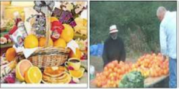
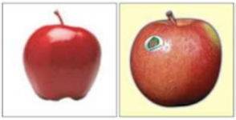
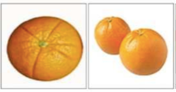
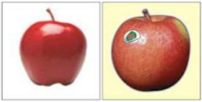
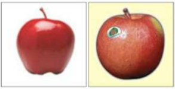
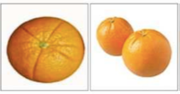
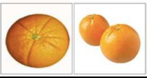
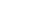
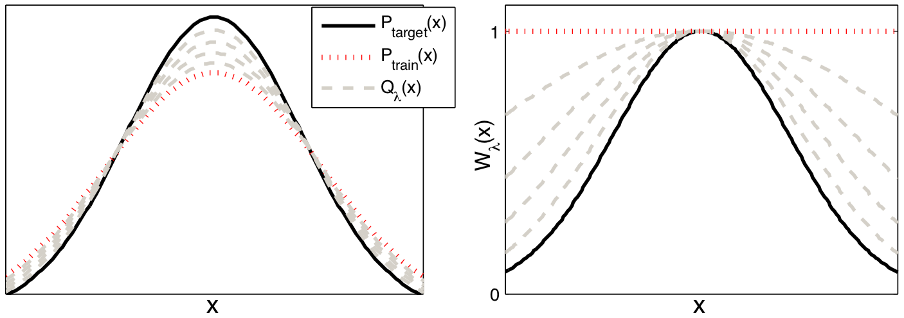
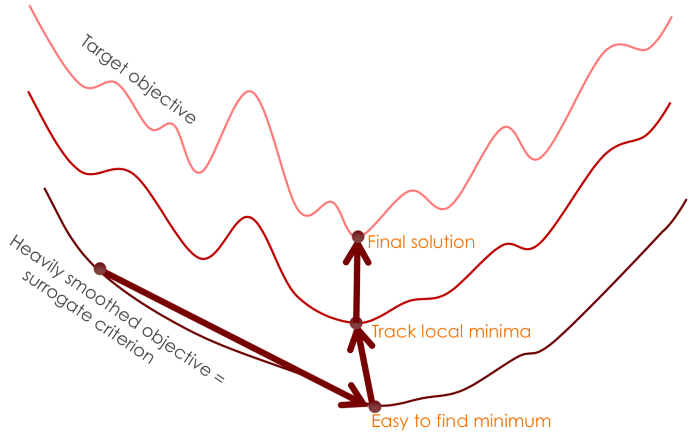

This article has been accepted for publication in a future issue of this journal, but has not been fully edited. Content may change prior to final publication. Citation information: DOI 10.1109/TPAMI.2021.3069908, IEEE
Transactions on Pattern Analysis and Machine Intelligence
| JOURNALOFLATEXCLASSFILES,VOL.14,NO.8,OCTOBER2020 |     |     |        |     |     |     |            |     |     |     |          |     |     |     | 1   |
| ------------------------------------------------ | --- | --- | ------ | --- | --- | --- | ---------- | --- | --- | --- | -------- | --- | --- | --- | --- |
|                                                  |     | A   | Survey |     |     | on  | Curriculum |     |     |     | Learning |     |     |     |     |
Xin Wang, Member, IEEE, Yudong Chen, and Wenwu Zhu, Fellow, IEEE
Abstract—Curriculumlearning(CL)isatrainingstrategythattrainsamachinelearningmodelfromeasierdatatoharderdata,which
imitatesthemeaningfullearningorderinhumancurricula.Asaneasy-to-useplug-in,theCLstrategyhasdemonstrateditspowerin
improvingthegeneralizationcapacityandconvergencerateofvariousmodelsinawiderangeofscenariossuchascomputervision
andnaturallanguageprocessingetc.Inthissurveyarticle,wecomprehensivelyreviewCLfromvariousaspectsincludingmotivations,
definitions,theories,andapplications.WediscussworksoncurriculumlearningwithinageneralCLframework,elaboratingonhowto
designamanuallypredefinedcurriculumoranautomaticcurriculum.Inparticular,wesummarizeexistingCLdesignsbasedonthe
generalframeworkofDifficultyMeasurer+TrainingSchedulerandfurthercategorizethemethodologiesforautomaticCLintofour
groups,i.e.,Self-pacedLearning,TransferTeacher,RLTeacher,andOtherAutomaticCL.Wealsoanalyzeprinciplestoselectdifferent
CLdesignsthatmaybenefitpracticalapplications.Finally,wepresentourinsightsontherelationshipsconnectingCLandother
machinelearningconceptsincludingtransferlearning,meta-learning,continuallearningandactivelearning,etc.,thenpointout
challengesinCLaswellaspotentialfutureresearchdirectionsdeservingfurtherinvestigations.
IndexTerms—CurriculumLearning,MachineLearning,TrainingStrategy,ExampleReweighting,Self-PacedLearning.
(cid:70)
1 INTRODUCTION
| Human                                             | learning |            | has inspired | various   |       | algorithm   | de-       |     |     |     |     |     |     |     |       |
| ------------------------------------------------- | -------- | ---------- | ------------ | --------- | ----- | ----------- | --------- | --- | --- | --- | --- | --- | --- | --- | ----- |
| signsthroughoutthedevelopmentofmachinelearning.As |          |            |              |           |       |             |           |     |     | …   |     | …   |     |     | Model |
| an outstanding                                    |          | feature    | of human     | learning, |       | curriculum, | or        |     |     |     |     |     |     |     |       |
| learning                                          | in a     | meaningful | order,       | has       | been  | exploited   | and       |     |     |     |     |     |     |     |       |
| transferred                                       | to       | machine    | learning,    | which     | forms | the         | subdisci- |     |     |     |     |     |     |     |       |
plinenamedcurriculumlearning(CL).Inessence,humaned-
Data
ucationishighlyorganizedascurricula,by“startingsmall”
and gradually presenting more complex concepts. For ex- wholetraining
|             |            |          |            |          |           |        |          |     | small&easy | …   | larger&harder | …   |         |     |     |
| ----------- | ---------- | -------- | ---------- | -------- | --------- | ------ | -------- | --- | ---------- | --- | ------------- | --- | ------- | --- | --- |
|             |            |          |            |          |           |        |          |     | subset     |     | subset        |     | dataset |     |     |
| ample,      | to learn   | calculus | at         | college, | a student | should | first    |     |            |     |               |     |         |     |     |
| learn basic | arithmetic |          | at primary | school,  | abstract  |        | function |     |            |     |               |     |         |     |     |
|             |            |          |            |          |           |        |          |     |            | …   |               | …   |         |     |     |
atmiddleschool,andthenderivedfunctionathighschool. "# "' "$=& Curriculum
However,intraditionalmachinelearningalgorithms,allthe Trainingprocess
| training | examples    | are | randomly     | presented |              | to the | model,  |               |              |         |                        |          |     |                    |            |
| -------- | ----------- | --- | ------------ | --------- | ------------ | ------ | ------- | ------------- | ------------ | ------- | ---------------------- | -------- | --- | ------------------ | ---------- |
|          |             |     |              |           |              |        |         | Fig. 1.       | Illustration | of      | the Curriculum         | Learning |     | (CL) concept       | (The fruit |
| ignoring | the various |     | complexities | of        | data samples |        | and the |               |              |         |                        |          |     |                    |            |
|          |             |     |              |           |              |        |         | imagesarefrom |              | [106]). | CL isatrainingstrategy |          |     | formachinelearning |            |
learningstatusofthecurrentmodel.Therefore,anintuitive that trains from easier data to harder data, imitating human curricula.
|          |            |     |                 |     |          |          |      | Specifically, | CL  | initially | trains | the model | on a | small and | easy subset. |
| -------- | ---------- | --- | --------------- | --- | -------- | -------- | ---- | ------------- | --- | --------- | ------ | --------- | ---- | --------- | ------------ |
| question | is: “could | the | curriculum-like |     | training | strategy | ever |               |     |           |        |           |      |           |              |
Withtheprogressofthetraining,CLgraduallyintroducesmoreharder
benefitmachinelearning?”Accordingtotheextensiveexperi-
examplesintothesubset,andfinallytrainsthemodelonthewholetrain-
| ments from | early | work | [6], [54], | [131] | to recent | efforts | [17], |     |     |     |     |     |     |     |     |
| ---------- | ----- | ---- | ---------- | ----- | --------- | ------- | ----- | --- | --- | --- | --- | --- | --- | --- | --- |
ingdataset.ThisCLstrategycanimprovebothmodelperformanceand
|             |      |            |              |     |            |     |           | convergence |     | rate, compared |     | with direct | training | on the whole | training |
| ----------- | ---- | ---------- | ------------ | --- | ---------- | --- | --------- | ----------- | --- | -------------- | --- | ----------- | -------- | ------------ | -------- |
| [29], [33], | [86] | in various | applications |     | of machine |     | learning, |             |     |                |     |             |          |              |          |
dataset.Qtherestandsforareweightingofthetrainingdatadistribution
wemaysummarizetheansweras:“yes,butnotalways.”As
P atthet-thtrainingepoch(SeedetailsinSec.2).
| we will        | demonstrate |              | in this | survey, the | power   | of introduc- |        |     |     |     |     |     |     |     |     |
| -------------- | ----------- | ------------ | ------- | ----------- | ------- | ------------ | ------ | --- | --- | --- | --- | --- | --- | --- | --- |
| ing curriculum |             | into machine |         | learning    | depends | on           | how we |     |     |     |     |     |     |     |     |
designthecurriculumforspecificapplicationsanddatasets. the images of apples and oranges are clear, typical, and
The original concept of CL is first proposed by Bengio easilyrecognizable.Withtheprogressofmodeltraining,CL
addsmore“harder”images(i.e.,hardertorecognize)tothe
| et al. [6]. | In short, |     | curriculum | learning | means | “training |     |     |     |     |     |     |     |     |     |
| ----------- | --------- | --- | ---------- | -------- | ----- | --------- | --- | --- | --- | --- | --- | --- | --- | --- | --- |
fromeasierdatatoharderdata”.Morespecifically,thebasic current subset, which is akin to the increasing difficulty of
idea is to “start small” [15], train the machine learning learningmaterialsinhumancurricula.Finally,CLleverages
modelwitheasierdatasubsets(oreasiersubtasks),andthen thewholetrainingdatasetfortraining.
gradually increase the difficulty level of data (or subtasks) As the idea of CL serves as a general training strat-
until the whole training dataset (or the target task(s)). An egy beyond specific machine learning tasks, scholars have
illustration of CL is demonstrated in Fig. 1, where we take been exploiting its power in considerably wide application
the image classification task as an example. Initially, CL scopes, including supervised learning tasks within com-
trains the model on a small subset of “easy” images, i.e., puter vision (CV) [31], [40], natural language processing
|     |     |     |     |     |     |     |     | (NLP) | [86], | [112], | healthcare | prediction |     | [14], etc., | various |
| --- | --- | --- | --- | --- | --- | --- | --- | ----- | ----- | ------ | ---------- | ---------- | --- | ----------- | ------- |
• Xin Wang, Yudong Chen, Wenwu Zhu are with the Department of reinforcement learning (RL) tasks [20], [77], [93] as well
ComputerScienceandTechnology,TsinghuaUniversity,Beijing,China. as other applications such as graph learning [25], [88] and
E-mail: xin wang@tsinghua.edu.cn, cyd18@mails.tsinghua.edu.cn, neural architecture search (NAS) [32]. The advantages of
wwzhu@tsinghua.edu.cn. applyingCLtrainingstrategiestomiscellaneousreal-world
0162-8828 (c) 2021 IEEE. Personal use is permitted, but republication/redistribution requires IEEE permission. See http://www.ieee.org/publications_standards/publications/rights/index.html for more information.
Authorized licensed use limited to: University of Prince Edward Island. Downloaded on June 01,2021 at 17:51:15 UTC from IEEE Xplore.  Restrictions apply.

This article has been accepted for publication in a future issue of this journal, but has not been fully edited. Content may change prior to final publication. Citation information: DOI 10.1109/TPAMI.2021.3069908, IEEE
Transactions on Pattern Analysis and Machine Intelligence
| JOURNALOFLATEXCLASSFILES,VOL.14,NO.8,OCTOBER2020 |     |     |     |     |     |     |     |     | 2   |
| ------------------------------------------------ | --- | --- | --- | --- | --- | --- | --- | --- | --- |
(a)
Training
|     |     |     |     |     | set |     | Ifmodelconverges | Epoch! |     |
| --- | --- | --- | --- | --- | --- | --- | ---------------- | ------ | --- |
PredefinedCL
|     |     | (Sec.4.1,4.2) |     |     | Difficulty | Training         |         | Model   |     |
| --- | --- | ------------- | --- | --- | ---------- | ---------------- | ------- | ------- | --- |
|     |     |               |     |     | Measurer   | Sorted Scheduler | Sample  | Trainer |     |
|     |     |               |     |     |            | data             | batch@! |         |     |
CurriculumDesign
|     |     |     |     |     | Training |                            |     | (b)    |     |
| --- | --- | --- | --- | --- | -------- | -------------------------- | --- | ------ | --- |
|     |     |     |     |     | set      | Trainingloss@!asdifficulty |     | Epoch! |     |
Self-pacedLearning
|     | CLMethods |     |             |     | Difficulty      | Training  |         | Model   |     |
| --- | --------- | --- | ----------- | --- | --------------- | --------- | ------- | ------- | --- |
|     |           |     | (Sec.4.3.1) |     | Measurer Sorted | Scheduler | Sample  | Trainer |     |
|     | (Sec.4)   |     |             |     |                 | data      | batch@! |         |     |
CurriculumDesign
|     |     |     |     |     | Training | External |     | (c) |     |
| --- | --- | --- | --- | --- | -------- | -------- | --- | --- | --- |
set dataset
|     |     |     |                 |     | Pretrain   |                  |                  | Epoch!  |     |
| --- | --- | --- | --------------- | --- | ---------- | ---------------- | ---------------- | ------- | --- |
|     |     |     | TransferTeacher |     |            |                  | Ifmodelconverges |         |     |
|     |     |     | (Sec.4.3.2)     |     | Difficulty | Training         |                  | Model   |     |
|     |     |     |                 |     | Measurer   | Sorted Scheduler | Sample           | Trainer |     |
batch@!
|     |     | AutomaticCL |     |     |     | data |     |     |     |
| --- | --- | ----------- | --- | --- | --- | ---- | --- | --- | --- |
CurriculumDesign
(Sec.4.3)
|     |     |     | RLTeacher |     |     |     |     | (d) |     |
| --- | --- | --- | --------- | --- | --- | --- | --- | --- | --- |
Training
|     |     |     | (Sec.4.3.3) |     | set |                       |     |        |     |
| --- | --- | --- | ----------- | --- | --- | --------------------- | --- | ------ | --- |
|     |     |     |             |     |     | ReinforcementLearning |     | Epoch! |     |
Studentfeedback@!
|     |     |     |                  |     | Difficulty      | Training  |         | Model   |     |
| --- | --- | --- | ---------------- | --- | --------------- | --------- | ------- | ------- | --- |
|     |     |     | OtherAutomaticCL |     | Measurer Sorted | Scheduler | Sample  | Trainer |     |
|     |     |     |                  |     |                 | data      | batch@! |         |     |
(Sec.4.3.4)
CurriculumDesign
Fig.2.AcategorizationofCLmethodsandthecorrespondingillustrations.WedividetheexistingmethodsintopredefinedCLandautomaticCL,
thelatterofwhichincludingSelf-pacedLearning,TransferTeacher,RLTeacherandOtherAutomaticCL.Asshownintheillustrations,mostCL
methodscomplywiththegeneralframeworkofDifficultyMeasurer+TrainingSchedulerinSec.4.
scenarioscanbemainlysummarizedasimprovingthemodel literature. Skinner [84], [105] provides the earliest behavior
performanceontargettasksandacceleratingthetrainingprocess, evidence on the importance of shaping, i.e., another name
whichcoverthetwomostsignificantrequirementsinmajor for CL in animal training context. Cognitive evidence is
machine learning research. For example, in [86], CL helps then provided in human size constancy learning [116] and
the neural machine translation model reduce training time languagelearning[79].Theideaofintroducingacurriculum
by up to 70% and improves the performance by up to 2.2 into the training strategy of machine learning algorithms
BLEUpoints,comparedtoplaintrainingwithoutcurricula. canbetracedbacktoSelfridgeetal.’swork[99].Theauthors
In [41], CL brings a relative 45.8% MAP boost from nor- proposedtotrainacartpolecontroller,aclassicproblemin
mal batch training with an obvious faster convergence in robotics, first on long and light poles and then gradually
multimediaeventdetectiontask.In[20],CLenablestheRL onshorterandheavierpoles.Laterrelatedwork[95],[98]in
agents to solve hard goal-oriented problems that they can- RLandroboticsdomainsalsodiscussedhowtoorganizethe
notsolvewithoutcurricula.Apartfromtheabovetwomain presentingorderoftasksfromeasytohard.Thefirstattempt
advantages,CLisalsoeasy-to-use,sinceitisaflexibleplug- of the curriculum-like idea on supervised learning is made
and-play submodule independent of the original training by Elman [15] in the NLP task of grammar learning with
algorithms in most CL literature. However, to the best of recurrentnetworks.Theauthorhighlightedtheimportance
ourknowledge,littleefforthasbeenmadetosystematically of “starting small”: restricting the range of data exposed
summarizethemethodologiesandapplicationsofCL. to neural networks during initial training. This strategy is
In this paper, we fill this gap by comprehensively re- also revisited in [94] and [52], the latter of which provides
viewingCLandsummarizingitsmethodologies.Tobemore evidenceforfasterconvergence.
specific, we hope to provide the readers with an overall Based on all these previous works, the concept of CL
pictureofCL,whichincludescomprehensibleandelaborate was first proposed by Bengio et al. [6] with experiments
answerstothefollowingquestions:(i)Whatisthedefinition onsupervisedvisualandlanguagelearningtasks,exploring
of CL (Sec. 2)? (ii) Why is CL effective, and why should whenandwhyacurriculumcouldbenefitmachinelearning.
researchersuseCL(Sec.3)?(iii)Howtodesignacurriculum TheoriginaldefinitionofCLbyBengioetal.[6]isasfollows.
(Sec.4)?Weconcludethepaperwithacomparisonof“easier Definition 1: Original Curriculum Learning [6].Acur-
T
first” and “harder first” training strategies and discussion riculum is a sequence of training criteria over training
on the relationship between CL and other machine learn- steps: C = (cid:104)Q ,...,Q ,...,Q (cid:105). Each criterion Q is a
|     |     |     |     |     | 1   | t   | T   |     | t   |
| --- | --- | --- | --- | --- | --- | --- | --- | --- | --- |
ing concepts in Sec. 5. We also summarize several open reweightingofthetargettrainingdistributionP(z):
| questions and | future directions | for CL to inspire | future |     |                 |     |                         |     |     |
| ------------- | ----------------- | ----------------- | ------ | --- | --------------- | --- | ----------------------- | --- | --- |
|               |                   |                   |        |     | Qt(z)∝Wt(z)P(z) |     | ∀examplez∈trainingsetD, |     | (1) |
researchersinSec.6.
suchthatthefollowingthreeconditionsaresatisfied:
| 2 DEFINITION | OF CL |     |     |     |                |     |               |           |            |
| ------------ | ----- | --- | --- | --- | -------------- | --- | ------------- | --------- | ---------- |
|              |       |     |     | •   | 1) The entropy | of  | distributions | gradually | increases, |
History context. Empirical evidence supporting the mean- i.e.,H(Q t )<H(Q t+1 ).
ingfulnessoftakingcurriculainhumanandanimallearning • 2) The weight for any example increases, i.e.,
has been early provided in behavior and cognitive science W (z)≤W (z) ∀z ∈D.
|     |     |     |     |     | t   | t+1 |     |     |     |
| --- | --- | --- | --- | --- | --- | --- | --- | --- | --- |
0162-8828 (c) 2021 IEEE. Personal use is permitted, but republication/redistribution requires IEEE permission. See http://www.ieee.org/publications_standards/publications/rights/index.html for more information.
Authorized licensed use limited to: University of Prince Edward Island. Downloaded on June 01,2021 at 17:51:15 UTC from IEEE Xplore.  Restrictions apply.

This article has been accepted for publication in a future issue of this journal, but has not been fully edited. Content may change prior to final publication. Citation information: DOI 10.1109/TPAMI.2021.3069908, IEEE
Transactions on Pattern Analysis and Machine Intelligence
| JOURNALOFLATEXCLASSFILES,VOL.14,NO.8,OCTOBER2020 |     |     |     |     |     |     |     |     |     |     |     |     |     | 3   |
| ------------------------------------------------ | --- | --- | --- | --- | --- | --- | --- | --- | --- | --- | --- | --- | --- | --- |
• 3)Q (z)=P(z). informative subset) [118], [119], [140]. There is also a line
T
|            |          |        |          |          |     |             | of research | named | hard | example | mining | (HEM) | [45], | [101] |
| ---------- | -------- | ------ | -------- | -------- | --- | ----------- | ----------- | ----- | ---- | ------- | ------ | ----- | ----- | ----- |
| Curriculum | learning | is the | training | strategy |     | that trains | a           |       |      |         |        |       |       |       |
selectingthemostdifficultexamplesineachtrainingbatch.
machinelearningmodelwithacurriculum.
|     |     |     |     |     |     |     | HEM actually |     | falls in Definition |     | 2 and | is explored | in  | some |
| --- | --- | --- | --- | --- | --- | --- | ------------ | --- | ------------------- | --- | ----- | ----------- | --- | ---- |
In Definition 1, Condition (1) means the diversity and CL literature [39], [145]. A discussion on this seemingly
| information | of the | training | set should |     | gradually | increase, |     |     |     |     |     |     |     |     |
| ----------- | ------ | -------- | ---------- | --- | --------- | --------- | --- | --- | --- | --- | --- | --- | --- | --- |
paradoxicalphenomenonwillbemadeinSec.5.1.
i.e.,thereweightingofexamplesinlaterstepsincreasesthe
ToevenfurtherbroadenthescopeofCL,somescholars
probability of sampling slightly more difficult examples. jumpfromdataleveltocriterialevel,toregardacurriculum
Condition (2) means to gradually add (in binary or soft asasequenceoftrainingcriteriaduringthetrainingprocess.
manner)moretrainingexamples,sothesizeofthetraining
ThisfurthergeneralizestheCLdefinition:
setincreases.Condition(3)meansfinally,thereweightingof Definition 3: Generalized Curriculum Learning. Dis-
all examples is uniform and we train on the target training carding the definition of Q (Eq. 1) and its three conditions
t
set.
|     |     |     |     |     |     |     | in Definition | 1,  | a curriculum |     | is a | sequence | of training |     |
| --- | --- | --- | --- | --- | --- | --- | ------------- | --- | ------------ | --- | ---- | -------- | ----------- | --- |
Most of the CL methods discussed in this paper (espe- criteriaoverT trainingsteps.EachcriterionQ t includesthe
cially those in Sec. 4.2, 4.3.1, and 4.3.2) meet Definition 1, design for all the elements in training a machine learning
illustratedinFig1.Asshowninthefigure,theCLstrategy
|            |              |      |        |     |               |       | model,          | e.g., data/tasks, |          | model  | capacity, | learning | objective, |       |
| ---------- | ------------ | ---- | ------ | --- | ------------- | ----- | --------------- | ----------------- | -------- | ------ | --------- | -------- | ---------- | ----- |
| determines | the training | data | subset | of  | each training | step, |                 |                   |          |        |           |          |            |       |
|            |              |      |        |     |               |       | etc. Curriculum |                   | learning | is the | strategy  | that     | trains a   | model |
such that the size and overall difficulty of the subsets are withsuchacurriculum.
graduallyincreasingthroughoutthetrainingprocess. Examples for training criteria in Definition 3 include,
Since the concept of CL was formally proposed, the but are not limited to, loss function [97], [124], supervision
academic community follows and further extends the def- generation [34], [133], model capacity [46], [75], [104], in-
initionofCL.Withinthespiritof“trainingfromeasierdata put scheme [4], and hypothesis space [32]. Note that the
| (tasks) | to harder data | (tasks)”, | i.e., | fixing | Condition | (1) in |          |         |               |     |            |     |               |     |
| ------- | -------------- | --------- | ----- | ------ | --------- | ------ | -------- | ------- | ------------- | --- | ---------- | --- | ------------- | --- |
|         |                |           |       |        |           |        | criteria | in such | a generalized |     | curriculum |     | in Definition | 3   |
Definition 1, Condition (2) and (3) can be relaxed to enable usuallychangeprogressively,analogoustothegradualcur-
more flexible CL strategies. For example, in [29], [83], [131] riculum in human education. For example, in Curriculum
ofmulti-tasksettingandmostCLforRLsettings[19],Con-
|     |     |     |     |     |     |     | Dropout | [75], the | algorithm | gradually |     | reduces | the | ratio of |
| --- | --- | --- | --- | --- | --- | --- | ------- | --------- | --------- | --------- | --- | ------- | --- | -------- |
dition(2)and(3)arerelaxedsinceateachstepthemodelis active units in dropout operation from 1 to a predefined
trainedononlyonetask.However,thediversityordifficulty θ ∈ (0,1) to achieve adaptive regularization during train-
0
| of the current | task/goal | gradually |     | increases, | which | guides |         |            |     |       |               |     |        |        |
| -------------- | --------- | --------- | --- | ---------- | ----- | ------ | ------- | ---------- | --- | ----- | ------------- | --- | ------ | ------ |
|                |           |           |     |            |       |        | ing. In | Curriculum | NAS | [32], | the algorithm |     | starts | from a |
the model to boost the performance on the target task(s). small search space and gradually incorporates the learned
The CL methods based on One-Pass scheduler [112], [114], knowledge to guide the search in larger spaces, which sig-
[117] discussed in Sec. 4.2.2 also relaxes Condition (2) and nificantlyimprovesthesearchefficiencyandalsofindsbet-
(3) as they train the model from easier subsets to harder terneuralarchitectures.Theseworksbroadentheextension
subsets. Moreover, other works also extend Definition 1 by ofCLandexploitthepotentialitiesofthehumancurriculum
adding more conditions of data characteristics for different ideaformachinelearningatahigherlevel,leavingroomfor
applicationpurposes.Forinstance,Jiangetal.[41]propose
imaginationforfuturework.
| to train    | “from easy | & diverse | to             | hard” | to avoid | overfitting |            |     |     |               |     |     |       |     |
| ----------- | ---------- | --------- | -------------- | ----- | -------- | ----------- | ---------- | --- | --- | ------------- | --- | --- | ----- | --- |
|             |            |           |                |       |          |             | 3 ANALYSIS |     | ON  | EFFECTIVENESS |     |     | OF CL | AND |
| to the same | sample     | group     | in multi-group |       | event    | detection   |            |     |     |               |     |     |       |     |
tasks. Wang et al. [121] train the model “from easy & SUITABLE APPLICATION SCENES
imbalancedtohard&balanced”datatoalleviatethesevere Before applying CL to their studies, researchers might be
classimbalanceinhumanattributeanalysis. curious about a fundamental question: why on earth does
| At a | more abstract | level, | a curriculum |     | can | be seen as | a                          |     |     |          |     |          |       |        |
| ---- | ------------- | ------ | ------------ | --- | --- | ---------- | -------------------------- | --- | --- | -------- | --- | -------- | ----- | ------ |
|      |               |        |              |     |     |            | this human-curriculum-like |     |     | training |     | strategy | work? | To ex- |
sequence of (binary) instance selection [80] or (soft) example plainwhyCLcouldleadtogeneralizationimprovementand
reweightingalongthetrainingprocesstoachievefastercon- convergence speedup, scholars have provided hypotheses
vergenceorbettergeneralization,whichisbeyondthe“easy
|     |     |     |     |     |     |     | and proofs | from | different | perspectives. |     | Basically, | existing |     |
| --- | --- | --- | --- | --- | --- | --- | ---------- | ---- | --------- | ------------- | --- | ---------- | -------- | --- |
tohard”or“startingsmall”principles.Thisperspectivein- analyses uncover the essence of CL from the perspectives
spirestheacademiccommunitytobringmoreconnotations ofoptimizationproblemanddatadistribution,basedonwhich
| to CL definition     | with | new        | methodologies, |     | which | can be     |                                 |         |           |     |     |      |             |     |
| -------------------- | ---- | ---------- | -------------- | --- | ----- | ---------- | ------------------------------- | ------- | --------- | --- | --- | ---- | ----------- | --- |
|                      |      |            |                |     |       |            | we can                          | further | summarize | the | two | main | motivations | for |
| summarizedasfollows. |      |            |                |     |       |            | applyingCL:toguideandtodenoise. |         |           |     |     |      |             |     |
| Definition           | 2:   | Data-level | Generalized    |     |       | Curriculum |                                 |         |           |     |     |      |             |     |
Learning.DiscardingallthethreeconditionsinDefinition1, 3.1 TheoreticalAnalysisonCL
acurriculumisasequenceofreweightingoftargettraining To begin with, from the perspective of optimization prob-
distribution over T training steps. Curriculum learning is lem,Bengioetal.[6]initiallypointoutthatCLcanbeseen
thestrategythattrainsamodelwithsuchacurriculum. as a particular continuation method. Intuitively, continuation
MostCLmethodsinSec.4.3.3andSec.4.3.4couldlearn methods[2]areoptimizationstrategiesfornon-convexcrite-
to automatically and dynamically select the most suitable riawhichfirstoptimizeasmoother(andalsoeasier)version
examples or tasks (with adjustable loss weights) for each of the problem to reveal the “global picture”, and then
current training step and thus meet Definition 2. Interest- graduallyconsiderlesssmoothingversions,untilthetarget
ingly, in some of the works, the best curriculum found by objectiveofinterest.Thisstrategyalsosharesthesamespirit
the algorithm is the opposite of traditional CL, i.e., “hard withsimulatedannealing.AsillustratedinFig3,continuation
to easy” [17], [118] or “starting big” (from full dataset to methods provide a sequence of optimization objectives,
0162-8828 (c) 2021 IEEE. Personal use is permitted, but republication/redistribution requires IEEE permission. See http://www.ieee.org/publications_standards/publications/rights/index.html for more information.
Authorized licensed use limited to: University of Prince Edward Island. Downloaded on June 01,2021 at 17:51:15 UTC from IEEE Xplore.  Restrictions apply.

This article has been accepted for publication in a future issue of this journal, but has not been fully edited. Content may change prior to final publication. Citation information: DOI 10.1109/TPAMI.2021.3069908, IEEE
Transactions on Pattern Analysis and Machine Intelligence
JOURNALOFLATEXCLASSFILES,VOL.14,NO.8,OCTOBER2020 4
starting with a heavily smoothed objective for which it of P (x) demonstrates the relatively more noisy data in
train
is easy to find a global minimum, and tracking the local trainingdistribution.Therightpartillustratesthesequence
minima throughout the training. In this way, continuation of weight functions in CL, which initially assigns small
methodsguidethetrainingtowardsbetterregionsinparam- values to the noisy tails and much larger values in the
eter space, i.e., as shown in Fig 3, the local minima learned common easy area, and gradually moves to equal weights
fromeasierobjectiveshavebettergeneralizationabilityand for all examples. Based on the above analysis, the authors
are more likely to approximate global minima. Moreover, formulate P (x) as the weighted expression of P (x).
target train
fromtheviewoftransferlearning,thiscontinuationstrategy A follow-up theory clarifies that CL essentially minimizes
can also be regarded as a sequence of unsupervised pre- an upper bound of the expected risk under target distribu-
training [6]: training on the preceding objectives could act tion,andthisboundshowsthatwecouldapproachthetask
asapre-trainingprocesswhichbothhelpsoptimizationand of minimizing the expected risk on P (x) by taking the
target
providesregularizationonsucceedingobjectives. core idea of CL: gradually taking relatively easy examples
according to the curriculum and minimizing the empirical
riskontheseexamples.
Fig.4.IllustrationoftheCLfromthedatadistributionperspective[27].
The left part demonstrates the data distribution shifts from the easy
Fig. 3. Illustration of the continuation method from [5], which is the subset (the solid curve, which is assumed to approximate the testing
essence of the CL [6]. It starts from optimizing a heavily smoothed distributionP target (x)well)tothefulltrainingsetP train (x)(thereddashed
version of the objective, and gradually moves to the target objective. curve). The right part shows the corresponding weighting scheme to
Tracking the local minima throughout the training guides the model enable this distribution shift. The center peak of curves refers to the
towardsbetterparameterspaceandmakesitmoregeneralizable. high-confidencecleandata,whilethetailsrefertothenoisydatainthe
Additionally, recent studies provide more theoretical
distributions.Asshownintheleftpart,P
target
(x)iscleanerthanP
train
(x).
evidencefortheconvergencespeedupinCLfromtheopti-
3.2 SuitableApplicationScenesofCL
mizationperspective.Weinshalletal.[123]proveatheorem
On the other hand, researchers also analyze the CL Based on the above analysis on why CL is effective, we
mechanism from the perspective of data distribution. In can categorize the motivations for applying CL into two
the era of deep learning, large-scale data sources are re- groups: to guide, regularizing the training towards better
quired for training, which are collected and annotated by regionsinparameterspace(withsteepergradients)asfrom
companyusers,theweb,andcrowd-sourcingsystems.This the perspective of the optimization problem, and to de-
big data collection brings noisy data that is less cogniz- noise, focusing on high-confidence easier area to alleviate
able or wrongly annotated. In the CL setting, the noisy the interference of noisy data as from the perspective of
data corresponds to harder examples in the datasets while data distribution. Not surprisingly, most of the existing
the cleaner data form the easier part. Since CL strategy application scenes of CL can be classified into these two
encourages training more on the easier data, an intuitive groups,asdemonstratedinTable1.
hypothesis is that CL learner wastes less time with the The application scenes based on the “to guide” motiva-
harder and noisy examples to achieve faster training [6]. tionofteninvolvedifficulttargettaskswheredirecttraining
ThishypothesisrevealsthedenoisingefficacyofCLonnoisy on these tasks results in poor performance or slow conver-
data. gence.CLstrategiesareadoptedtoguidethetrainingfrom
To have a closer look at this denoising mechanism, easier tasks or smoother versions of objectives to the target
Gong et al. [27] provide a theory based on the assumption tasks. For instance, in sparse-reward RL, direct training
that there exists deviation between training and testing on the final tasks rarely gets any positive rewards, which
distributions caused by noisy/wrongly-annotated training hinders agent learning. Therefore, researchers propose to
data. Intuitively, training and target/testing distributions taketheCLstrategyandmanually[72]orautomatically[20]
share a common high-confidence annotated region with designasequenceofauxiliary(sub)tasks/goalsfromeasyto
large density, which corresponds to the easier examples hard to guide the training. In multi-task learning, learning
in CL. Therefore, to start training from easier examples allthetaskssimultaneouslyorinrandomorderoftenleads
by CL strategy actually simulates learning from this high- to unsatisfactory performance. To yield performance gains,
confidence common region (as an approximation to the CLstrategiesareadoptedtoautomaticallychoosetheeasier
target distribution), which guides the learning towards the tasks which are more related to the previous one [83] or
expected target while reduces the negative impacts from canbringmorelearningprogresstothemodeltraining[29],
low-confidence noisy examples. This data distribution per- [72]. Other examples include CL for training GANs [22],
spective of CL is illustrated in Fig 4. The common density [46],[106]andNAS[32].
peak (at the center of the x-axis) of training and target Besides, the “to guide” application scenes also include
distributions P (x) and P (x) in the left part refers thetaskswherethetargetdistributionisquitedifferentfrom
train target
to the common high-confidence area, while the heavy tail the training distribution, and a good curriculum helps to
0162-8828 (c) 2021 IEEE. Personal use is permitted, but republication/redistribution requires IEEE permission. See http://www.ieee.org/publications_standards/publications/rights/index.html for more information.
Authorized licensed use limited to: University of Prince Edward Island. Downloaded on June 01,2021 at 17:51:15 UTC from IEEE Xplore. Restrictions apply.

This article has been accepted for publication in a future issue of this journal, but has not been fully edited. Content may change prior to final publication. Citation information: DOI 10.1109/TPAMI.2021.3069908, IEEE
Transactions on Pattern Analysis and Machine Intelligence
| JOURNALOFLATEXCLASSFILES,VOL.14,NO.8,OCTOBER2020 |     |     |     |     |     |     |     |     |     |     |     |     |     |     | 5   |
| ------------------------------------------------ | --- | --- | --- | --- | --- | --- | --- | --- | --- | --- | --- | --- | --- | --- | --- |
TABLE1
SuitableApplicationScenesofCL.
| Motivation |     | Effect |     |     | Scene |     |     |     | Examples |     |     |     |     |     |     |
| ---------- | --- | ------ | --- | --- | ----- | --- | --- | --- | -------- | --- | --- | --- | --- | --- | --- |
Toguide make training possible / thetargettaskishardorhasadiffer- sparse reward RL, multi-task learning, GAN training, NAS;
betterandfaster entdistribution domainadaption,imbalancedclassification
Todenoise make training faster, more taskswithnoisy,unevenquality,het- weakly-supervisedorunsupervisedlearning,NLPtasks(neural
robustandgeneralizable erogeneous data (often large-scale, machinetranslation,naturallanguageunderstanding,etc.)
cheaplycollected)
guidethetrainingforadaptiontothetargetdistribution.A weights, denoising the pseudo labels with low confidence
representativesceneisdomainadaption,whichaimsatim- (harderunlabeleddata)[24],[25],[114],[136].(iii)Forinex-
provingpredictionperformanceonunlabeledtargetdomain actsupervision,i.e.,onlycoarse-grainedlabelsaregiven,CL
data by knowledge transfer from richly annotated source helps to gradually integrate confident fine-grained pseudo
domain data with a distribution drift. Recent studies [103], labels into training while denoising the noisy ones, usu-
[139]proposetotrainfrommorein-domaindata(similarto ally under a multi-instance learning framework [34], [111],
targetdomain)tolessin-domaindata,guidingthemodelto [134], [135]. Finally, CL can also help unsupervised setting,
adapttothetargetdomainwhileadequatelyexploitingthe e.g., clustering [22], [127], feature selection [142], domain
source domain data. Note that CL for domain adaption is adaption [11], etc. The mechanism in most work is similar
alsorelatedtothe“todenoise”motivation,ifweregardthe to the semi-supervised setting, i.e., denoising the noisy
lessin-domaindataasakindofnoisydata.Anotherexam- pseudo labels [11], [22], [142]. The function to guide is also
pleisimbalancedclassificationproblems,wherethetraining explored in [127]. With carefully designed CL, [133] even
distribution on different classes is extremely imbalanced. learnsdeepsaliencynetworkwithouthumanannotationby
Different studies adopt various curricula either beginning progressivelysynthesizingsupervisionmasks.
| from balanced |      | subset         | to more | imbalanced |     | full dataset | [39]     |     |            |     |         |     |           |     |     |
| ------------- | ---- | -------------- | ------- | ---------- | --- | ------------ | -------- | --- | ---------- | --- | ------- | --- | --------- | --- | --- |
|               |      |                |         |            |     |              |          | 4   | CL DESIGN: | A   | GENERAL |     | FRAMEWORK |     |     |
| or from       | easy | and imbalanced |         | subset     | to  | harder       | and more |     |            |     |         |     |           |     |     |
balancedsubset[121]toimprovethegeneralizationcapacity Since we have understood why CL is effective and why
oftheclassifier. researchers apply CL to different scenes, a natural and
On the other hand, the application scenes based on the importantquestionshouldbe:howtodesignanappropriate
|     |     |     |     |     |     |     |     | curriculum |     | for a specific | learning |     | task? | In this | section, we |
| --- | --- | --- | --- | --- | --- | --- | --- | ---------- | --- | -------------- | -------- | --- | ----- | ------- | ----------- |
“todenoise”motivationoftenhaveanoisyorheterogeneous
|     |     |     |     |     |     |     |     | provide | a general |     | framework | of  | “Difficulty |     | Measurer + |
| --- | --- | --- | --- | --- | --- | --- | --- | ------- | --------- | --- | --------- | --- | ----------- | --- | ---------- |
trainingdataset,andCLstrategiescouldhelpdenoise,mak-
ing the training faster, more robust, and more generaliz- Training Scheduler” (Sec. 4.1), which unifies most of CL
|                |         |             |     |        |           |            |           | methodologies. |          | Based      | on   | this framework, |     | we       | categorize |
| -------------- | ------- | ----------- | --- | ------ | --------- | ---------- | --------- | -------------- | -------- | ---------- | ---- | --------------- | --- | -------- | ---------- |
| able. A        | popular | application |     | of CL  | with this | motivation |           | is             |          |            |      |                 |     |          |            |
|                |         |             |     |        |           |            |           | the            | existing | CL methods | into | predefined      |     | CL (Sec. | 4.2) and   |
| neural machine |         | translation |     | (NMT), | whose     | dataset    | is highly |                |          |            |      |                 |     |          |            |
heterogeneous in quality, difficulty, and noise [53]. This is automatic CL (Sec. 4.3) and introduce the representative
|         |                 |     |     |            |       |     |          | designs | in each | category. |     | Fig. 2 illustrates |     | the | typology of |
| ------- | --------------- | --- | --- | ---------- | ----- | --- | -------- | ------- | ------- | --------- | --- | ------------------ | --- | --- | ----------- |
| because | the translation |     | of  | a sentence | could | be  | long and |         |         |           |     |                    |     |     |             |
CLmethodsintroducedinthissection.
| short with | different |     | vocabulary | and | grammar |     | structures, |     |     |     |     |     |     |     |     |
| ---------- | --------- | --- | ---------- | --- | ------- | --- | ----------- | --- | --- | --- | --- | --- | --- | --- | --- |
anddifferentannotatorsalwaysprovidetranslationsofdif-
ferentqualitiesMoreover,thetrainingofNMTmodels(e.g., 4.1 The General Framework of Difficulty Measurer +
RNNs) is often time-consuming. Therefore, CL is naturally TrainingScheduler
| suitable | for NMT | tasks       | to  | denoise   | during | training     | and to |        |          |              |            |        |                |           |            |
| -------- | ------- | ----------- | --- | --------- | ------ | ------------ | ------ | ------ | -------- | ------------ | ---------- | ------ | -------------- | --------- | ---------- |
|          |         |             |     |           |        |              |        | Recall | that     | the core     | definition | of     | CL (Definition |           | 1) lies in |
| achieve  | both    | performance |     | boost and | faster | convergence. |        |        |          |              |            |        |                |           |            |
|          |         |             |     |           |        |              |        | the    | strategy | of “training | from       | easier | data           | to harder | data”.     |
Similarly,CLisalsoadoptedinotherNLPtaskswithnoisy In essence, to design such a curriculum, we need to decide
| or heterogeneous |     | data, | including | natural |     | language | under- |     |     |     |     |     |     |     |     |
| ---------------- | --- | ----- | --------- | ------- | --- | -------- | ------ | --- | --- | --- | --- | --- | --- | --- | --- |
twothings:1)Whatkindoftrainingdataissupposedtobe
standing[126],relationextraction[37],readingcomprehen-
|     |     |     |     |     |     |     |     | easier | than | other data? | 2)  | When | should | we present | more |
| --- | --- | --- | --- | --- | --- | --- | --- | ------ | ---- | ----------- | --- | ---- | ------ | ---------- | ---- |
sion [112], etc. Moreover, CL is also effective in weakly- harder data for training, and how much more? Issue 1)
supervisedCVtasks[31],[64].
|     |     |     |     |     |     |     |     | can | be abstracted | to  | a Difficulty |     | Measurer, | which | decides |
| --- | --- | --- | --- | --- | --- | --- | --- | --- | ------------- | --- | ------------ | --- | --------- | ----- | ------- |
From the perspective of supervision in training, CL the relative “easiness” of each data example. Issue 2) can
canhelpsupervised,weakly-supervised,andunsupervised be abstracted to a Training Scheduler, which decides the
learning by guiding or denoising. Specifically, CL helps sequence of data subsets throughout the training process
supervised setting mainly by guiding when (i) the task is basedonthejudgmentfromtheDifficultyMeasurer.
hard [20], [83], (ii) parts of the training data are difficult to Therefore, a general framework for curriculum design
learn[6],[41],(iii)thetargetdistributionheavilyshiftsfrom consists of these two core components: Difficulty Measurer
trainingdistribution[103],[121].Weakly-supervisedsetting + Training Scheduler, which is illustrated in Fig 2(a). To
includesthreetypicaltypes[147],allofwhichareenhanced begin with, all the training examples are sorted by the
by CL denoising. (i) For inaccurate supervision, i.e., the Difficulty Measurer from the easiest to the hardest and
trainingsetisnoisyandusuallycollectedfromtheweb,CL passed to the Training Scheduler. Then, at each training
helps to denoise, enabling the model to focus on a cleaner epocht,theTrainingSchedulersamplesabatchoftraining
subset to avoid bad local minimum [31], [64], [86], [103]. data from the relatively easier examples and sends it to
(ii) For incomplete supervision, i.e., the semi-supervised Model Trainer for training. With the progress of training
settingwheresometrainingdataareunlabeled,CLhelpsto epochs,TrainingSchedulerwilldecidewhentosamplefrom
distinguish the easier (more confident) unlabeled examples moreharderdata,(usually)untiluniformsamplingfromthe
and add them to the training set earlier or with higher whole training set. This schedule sometimes also depends
0162-8828 (c) 2021 IEEE. Personal use is permitted, but republication/redistribution requires IEEE permission. See http://www.ieee.org/publications_standards/publications/rights/index.html for more information.
Authorized licensed use limited to: University of Prince Edward Island. Downloaded on June 01,2021 at 17:51:15 UTC from IEEE Xplore.  Restrictions apply.

This article has been accepted for publication in a future issue of this journal, but has not been fully edited. Content may change prior to final publication. Citation information: DOI 10.1109/TPAMI.2021.3069908, IEEE
Transactions on Pattern Analysis and Machine Intelligence
| JOURNALOFLATEXCLASSFILES,VOL.14,NO.8,OCTOBER2020 |     |     |     |     |     |     |     |     |     |     |     |     |     | 6   |
| ------------------------------------------------ | --- | --- | --- | --- | --- | --- | --- | --- | --- | --- | --- | --- | --- | --- |
on the training loss feedback from the Model Trainer (the TABLE2
dashed arrow in Fig 2(a)), e.g., Training Scheduler present- CommontypesofpredefinedDifficultyMeasurer.The“+”in∝Easy
meansthehigherthemeasuredvalue,theeasierthedataexample,
ing more harder data when the current model converges. andthe“-”hastheoppositemeaning.
Notethatin[33],theauthorsconcludethetwocorecompo-
|     |     |     |     |     |     |     |     | DifficultyMeasurer* |     |     | Angle |     | DataType | ∝Easy |
| --- | --- | --- | --- | --- | --- | --- | --- | ------------------- | --- | --- | ----- | --- | -------- | ----- |
nentsasscoringfunctionandpacingfunction,whichsharethe
|     |     |     |     |     |     |     |     | Sentencelength[86],[107] |     |     | Complexity |     | Text | -   |
| --- | --- | --- | --- | --- | --- | --- | --- | ------------------------ | --- | --- | ---------- | --- | ---- | --- |
samespiritwithDifficultyMeasurerandTrainingScheduler, Numberofobjects[122] Complexity Images -
|     |     |     |     |     |     |     |     | #conj.[50],#phrases[113] |     |     | Complexity |     | Text | -   |
| --- | --- | --- | --- | --- | --- | --- | --- | ------------------------ | --- | --- | ---------- | --- | ---- | --- |
respectively,whilethelatternamesadoptedinthispaperare
|     |     |     |     |     |     |     |     | Parsetreedepth[113] |     |     | Complexity |     | Text | -   |
| --- | --- | --- | --- | --- | --- | --- | --- | ------------------- | --- | --- | ---------- | --- | ---- | --- |
chosentobemoreabstractandclearer.
|     |     |     |     |     |     |     |     | Nestingofoperations[131] |     |     | Complexity |     | Programs | -   |
| --- | --- | --- | --- | --- | --- | --- | --- | ------------------------ | --- | --- | ---------- | --- | -------- | --- |
Let us take the experiment in Fig 1 as an instantiation Shapevariability[6] Diversity Images -
|     |     |     |     |     |     |     |     | Wordrarity[50],[86] |     |     | Diversity |     | Text | -   |
| --- | --- | --- | --- | --- | --- | --- | --- | ------------------- | --- | --- | --------- | --- | ---- | --- |
example for our CL framework. Difficulty Measurer is the POSentropy[113] Diversity Text -
human annotations deciding that some fruit images in the Mahalanobisdistance[14] Diversity Tabular -
datasetareeasierthanotherimagesbasedonrecognizability Clusterdensity[11],[31] Noise Images +
|     |     |     |     |     |     |     |     | Datasource[10] |     |     | Noise |     | Images | /   |
| --- | --- | --- | --- | --- | --- | --- | --- | -------------- | --- | --- | ----- | --- | ------ | --- |
and complexity. Training Scheduler can be, for example, a SNR/SND [7],[89] Noise Audio -
|     |     |     |     |     |     |     |     | Grammaticality[66] |     |     | Domain |     | Text | +   |
| --- | --- | --- | --- | --- | --- | --- | --- | ------------------ | --- | --- | ------ | --- | ---- | --- |
linearscheduler(seeSec.4.2.2)thatstartswith40%ofeasiest
|     |     |     |     |     |     |     |     | Prototypicality[113] |     |     | Domain |     | Text | +   |
| --- | --- | --- | --- | --- | --- | --- | --- | -------------------- | --- | --- | ------ | --- | ---- | --- |
examplesineachclass,andincreasesthisproportionby5%
|            |       |       |         |      |              |            |     | Medicalbased[44]            |     |     | Domain    |     | X-rayfilm | /   |
| ---------- | ----- | ----- | ------- | ---- | ------------ | ---------- | --- | --------------------------- | --- | --- | --------- | --- | --------- | --- |
|            |       |       |         |      |              |            |     | Retrievalbased[18],[82]     |     |     | Domain    |     | Retrieval | /   |
| each epoch | until | 100%. | In this | way, | an effective | curriculum |     |                             |     |     |           |     |           |     |
|            |       |       |         |      |              |            |     | Intensity[30]/Severity[111] |     |     | Intensity |     | Images    | +   |
is designed by instantiating the general CL framework Imagedifficultyscore[106],[114] Annotation Images -
accordingtothespecificimageclassificationtask. Normofwordvector[68] Multiple Text -
According to our framework, we could also clarify the *Abbreviations:POS=PartOfSpeech,SNR=SignaltoNoiseRatio,
SND=SignaltoNoiseDistortion,Domain=Domainknowledge,#
| scopes | of predefined | CL  | and | automatic | CL  | in the next | two |     |     |     |     |     |     |     |
| ------ | ------------- | --- | --- | --------- | --- | ----------- | --- | --- | --- | --- | --- | --- | --- | --- |
conj.=numberofcoordinatingconjunctions.
sections.Specifically,whenboththeDifficultyMeasurerand
TrainingScheduleraredesignedbyhumanpriorknowledge
Secondly,theangleofdiversityherestandsforthedistri-
| with no | data-driven | algorithms |     | involved, |     | we call | the CL |     |     |     |     |     |     |     |
| ------- | ----------- | ---------- | --- | --------- | --- | ------- | ------ | --- | --- | --- | --- | --- | --- | --- |
butionaldiversityofagroupofdata(e.g.,regularorirregu-
| method | predefined | CL. | If any | (or both) | of  | the two | compo- |     |     |     |     |     |     |     |
| ------ | ---------- | --- | ------ | --------- | --- | ------- | ------ | --- | --- | --- | --- | --- | --- | --- |
nentsarelearnedbydata-drivenmodelsoralgorithms,then lar shapes [6]) or the elements (e.g., words) of a data point
(e.g.,sentence).Alargervalueofdiversitymeansthedatais
wedenotetheCLmethodasautomaticCL.
morevarious,includingmore(rare)types/stylesofdataor
4.2 PredefinedCL elements,andisthusmoredifficultformodellearning.For
example,asentencewithmorerarewordsisusuallyconsid-
| In this | section, | we discuss | the | common | types | of manually |     |     |     |     |     |     |     |     |
| ------- | -------- | ---------- | --- | ------ | ----- | ----------- | --- | --- | --- | --- | --- | --- | --- | --- |
eredhardertolearning[86].Apopularmeasureofdiversity
| predefined | Difficulty | Measurers |       | (Sec.  | 4.2.1)     | and | Training |                       |          |       |              |       |      |              |
| ---------- | ---------- | --------- | ----- | ------ | ---------- | --- | -------- | --------------------- | -------- | ----- | ------------ | ----- | ---- | ------------ |
|            |            |           |       |        |            |     |          | is information        | entropy, | which | is exploited |       | both | in text data |
| Schedulers | (Sec.      | 4.2.2)    | under | our CL | framework, | and | con-     |                       |          |       |              |       |      |              |
|            |            |           |       |        |            |     |          | as the Part-Of-Speech |          | (POS) | entropy      | [113] | and  | in tabular   |
cludethemainlimitationsofpredefinedCL(Sec.4.2.3).
|     |     |     |     |     |     |     |     | data as      | the Mahalanobis |            | distance | of feature | vectors   | [14]. |
| --- | --- | --- | --- | --- | --- | --- | --- | ------------ | --------------- | ---------- | -------- | ---------- | --------- | ----- |
|     |     |     |     |     |     |     |     | Intuitively, | both high       | complexity |          | and high   | diversity | bring |
4.2.1 CommonTypesofPredefinedDifficultyMeasurer
|             |      |          |     |          |         |            |     | more degrees | of freedom |     | to the data, | which | needs | a model |
| ----------- | ---- | -------- | --- | -------- | ------- | ---------- | --- | ------------ | ---------- | --- | ------------ | ----- | ----- | ------- |
| Researchers | have | manually |     | designed | various | Difficulty |     |              |            |     |              |       |       |         |
withlargercapacityandbiggereffortoftraining.
| Measurers | mainly | based | on the | data | characteristics |     | of spe- |     |     |     |     |     |     |     |
| --------- | ------ | ----- | ------ | ---- | --------------- | --- | ------- | --- | --- | --- | --- | --- | --- | --- |
cifictasks.WesummarizecommontypesofDifficultyMea- Larger diversity sometimes also makes the data noisier.
surersinTable2.MostofthepredefinedDifficultyMeasur- Therefore,anotherangleisnoiseestimation,whichestimates
thenoiselevelofdataexamplesanddefinescleanerdataas
ersaredesignedforimageandtextdatainvariousCVand
NLP scenarios, while other data types include audio data, easier.Aquiteintuitivemethodistakenin[10]tojudgethe
programs,tabulardata,etc.Interestingly,wefindthatexcept noiselevelbythesourceofimagedataontheweb:images
retrievedbyasearchenginelikeGooglearesupposedtobe
| for some | domain | knowledge-based |     |     | measurement |     | (marked |     |     |     |     |     |     |     |
| -------- | ------ | --------------- | --- | --- | ----------- | --- | ------- | --- | --- | --- | --- | --- | --- | --- |
as “Domain”), most of the predefined Difficulty Measurers cleaner, and images posted on photo-sharing website like
are designed from the angles of complexity, diversity, and Flickr are more realistic and noisier. In [31], the authors
|     |     |     |     |     |     |     |     | map images | to vectors | by  | CNNs | and suppose |     | that cleaner |
| --- | --- | --- | --- | --- | --- | --- | --- | ---------- | ---------- | --- | ---- | ----------- | --- | ------------ |
noiseestimation,whichareseparatebutalsocorrelated.
Firstly,complexitystandsforthestructuralcomplexityof imagesoftenappearsimilar,andthushavelargervaluesof
a particular data example, such that examples with higher local density. Therefore, examples with lower local density
complexity have more dimensions and are thus harder aresupposedtobenoisierandhardertopredict.Moreover,
theSignaltoNoiseRatio/Distortion(SNR/SND)[7],[89]is
| to be captured |     | by models. | For | instance, |     | sentence | length, |     |     |     |     |     |     |     |
| -------------- | --- | ---------- | --- | --------- | --- | -------- | ------- | --- | --- | --- | --- | --- | --- | --- |
the most popular Difficulty Measurer in NLP tasks [86], widelyadoptedtoestimatethenoiseinaudiodata.
[107], [112], intuitively expresses the complexity of a sen- Other interesting Difficulty Measurers include signal
tence/paragraph.Therefore,longersentencesareoftensup- intensity [30], [111] and human-annotation-based Image
posed as harder training data. Other examples include DifficultyScores[106],[114],bothdesignedforimagedata.
the number of objects in images in the task of semantic Signal intensity can be regarded as a measurement for the
segmentation [122]; the number of coordinating conjunc- informativenessofdatafeatures.Forexample,inthetaskof
tions (e.g., “and”, “or”) [50] or phrases (e.g., prepositional facialexpressionrecognition[30],moreintense/exaggerated
phrases) [113]; the parse tree depth [113] that measures facesaresupposedtobeeasierdatathanpokerfaces.Inthe
the sentence complexity in the view of grammar; and the task of thoracic disease diagnosis [111], more severe symp-
nesting of operations in program text [131] that measures tomsprovidemoreinformationandareeasiertorecognize.
the complexity of the instruction set in program execution Moreover, Image Difficulty Score [114] is proposed to mea-
tasks. sure the difficulty of an image by collecting the response
0162-8828 (c) 2021 IEEE. Personal use is permitted, but republication/redistribution requires IEEE permission. See http://www.ieee.org/publications_standards/publications/rights/index.html for more information.
Authorized licensed use limited to: University of Prince Edward Island. Downloaded on June 01,2021 at 17:51:15 UTC from IEEE Xplore.  Restrictions apply.

This article has been accepted for publication in a future issue of this journal, but has not been fully edited. Content may change prior to final publication. Citation information: DOI 10.1109/TPAMI.2021.3069908, IEEE
Transactions on Pattern Analysis and Machine Intelligence
JOURNALOFLATEXCLASSFILES,VOL.14,NO.8,OCTOBER2020 7
timesofhumanannotatorsinthefollowingprotocol:(i)ask Other discrete schedulers are also based on data buck-
the annotator “Is there an {object class} (e.g., elephant) in eting but take different sampling strategies. For example,
thenextimage?”and(ii)recordthetimespentbytheanno- in[50],theauthorsmodifytheBabySteptounevenlydivide
tatortoanswer“Yes”or“No”andusethisresponsetimeto the examples into buckets such that easier buckets have
estimateImageDifficultyScore:intuitively,longerresponse more data examples, which is natural to reach in the case
timecorrespondstoharderimageexample.Aftercollecting ofmachinetranslationcorpora.Thentheysampleexamples
theannotation,theauthorstrainaregressionmodeltomap withoutreplacementfromtheeasiestbucketonlyuntilthere
theCNNfeaturesofnewimagestothedifficultyscore. remainthesamenumberofexamplesasinthesecondmost
easy bucket. Afterward, they uniformly sample from the
4.2.2 CommonTypesofPredefinedTrainingScheduler firsttwobucketsuntilthesizeisthesameasthatofthethird
bucket.InanempiricalstudyofCLonNMTtasks[138],the
While predefined Difficulty Measurers vary among differ-
authors also test other extensions of Baby Step, including
ent data types and tasks, the existing predefined Training
1) “boost”: to copy the hardest bucket for further training;
Schedulersareusuallydata/taskagnostic,i.e.,themajority
2) “reduce and add-back”: to gradually remove one easiest
ofCLliteratureinvariousscenariosleveragessimilartypes
bucket from training set once all buckets have been used,
of Training Schedulers. Generally, Training Schedulers can
and then add them back and repeat the removing until
be divided into discrete and continuous schedulers. The dif-
convergence; 3) “no-shuffle”: to discard inter-bucket shuf-
ferenceis:discreteschedulersadjustthetrainingdatasubset
fling and always present from easier to harder buckets to
aftereveryfixednumber(>1)ofepochsorconvergenceon
the model. A conclusion is, including Baby Step, no single
thecurrentdatasubset,whilecontinuousschedulersadjust
schedulerconsistentlyoutperformsothers.
thetrainingdatasubsetateveryepoch.
Continuous schedulers, on the other hand, can be mostly
Discreteschedulersarewidelyadoptedowingtotheirsim- regarded as a function λ(t) to map training epoch number
plicity and effectiveness. The most popular discrete sched- ttoascalarλ ∈ (0,1],whichmeansλproportionofeasiest
uler is named as Baby Step [6], [107] (Algorithm 1), which trainingexamplesareavailableatthet-thepoch.According
firstdistributesthesorteddataintobuckets(orshards/bins) to the Definition 1 in Sec. 2, this function λ(t) must be
fromeasytohardandstartstrainingwiththeeasiestbucket. monotone and non-decreasing, starting at λ(0) > 0 and
Afterafixednumberoftrainingepochsorconvergence,the ending at λ(T) = 1 This function is also called pacing
nextbucketismergedintothetrainingsubset.Finally,after function[33]orcompetencefunction[86]inliterature.
allthebucketsaremergedandused,thewholetrainingpro- Existing λ(t) functions are various, while researchers
cess either stops or further continues several extra epochs.
coulddesignnewfunctionsfortheirspecifictasks.Themost
Notethatateachepoch,theschedulerusuallyshufflesboth intuitivefunctionisthelinearfunction,whereλ 0istheinitial
the current buckets and the data in each bucket and then proportionofavailableeasiestexamples,andT denotes
grow
sample mini-batches for training (instead of using all data theepochwhenthefunctionreaches1forthefirsttime.
atonce). (cid:32) (cid:33)
Algorithm1TheBabyStepTrainingScheduler[12]. λ linear (t)=min 1,λ0+ 1 Tg − ro λ w 0 ·t (2)
Input: D:trainingdataset;C:theDifficultyMeasurer; Root function is later proposed in [86] according to the
Output: M∗:theoptimalmodel. observation that in linear function, the newly added exam-
1: D(cid:48)=sort(D,C);
2: {D1,D2,···,Dk} = D(cid:48) where C(da) < C(d b ), da ∈ Di,d b ∈ plesarelesslikelytobesampledasthetrainingdatasubset
Dj,∀i<j; grows in size. Therefore, to give the model sufficient time
3: Dtrain=∅; to learn the newly added examples, the authors reduce the
4: fors=1···kdo
numberofnewlyaddedexamplesastrainingprogressesby
5: Dtrain=Dtrain∪Ds;
6: whilenotconvergedforpepochsdo definingtherateofaddingexamplestobeinverselypropor-
7: train(M,Dtrain); tionaltothesizeofthecurrenttrainingsubset: dλ(t) = P ,
dt dλ(t)
8: endwhile whereP ≥0isaconstant.Thenweget:
9: endfor
(cid:32) (cid:115) (cid:33)
1−λ2
Another discrete scheduler called One-Pass [6] takes a λroot(t)=min 1, Tgrow 0 ·t+λ2 0 . (3)
similar strategy of data bucketing from easy to hard and
starting training from the easiest bucket. However, when To make the curve even sharper, a more general form
updating, One-Pass scheduler discards the current bucket root-pfunctionisalsoconsideredasfollows,wherep≥1:
and switches to the next harder bucket. One-Pass is less (cid:32) (cid:115) 1−λp (cid:33)
usedthanBabyStepinCLliterature(see[112],[114],[117], λroot-p(t)=min 1,
Tgrow
0 ·t+λp
0
. (4)
[131] for One-Pass examples), probably due to the lower
performanceinmanytasks.Intuitivereasonsmightinclude: Interestingly,in[82]theauthorsoppositelyproposetogive
1)Thecomplexity/diversityofthetrainingdataisgradually easierexamplesmoretrainingtime,bytakingthefollowing
increasing in Baby Step scheduler, which helps improve geometricprogressionfunction:
g
tr
e
a
n
in
e
i
r
n
a
g
liz
o
a
n
tio
a
n
s
c
e
a
q
p
u
a
e
c
n
i
c
ty
e
;
o
2
f
)
i
T
n
h
d
e
ep
O
en
n
d
e-
e
P
n
a
t
s
t
s
as
s
k
ch
s
e
a
d
s
u
i
l
n
er
c
i
o
s
n
l
t
i
i
k
n
e
- λgeom(t)=min
(cid:32)
1,2
(cid:18)log21
T
−
gr
l
o
o
w
g2λ0·t+log2λ0 (cid:19)(cid:33)
. (5)
ual learning [13], which faces the problem of catastrophic
forgetting even though the early tasks are easier. The two Theabovecontinuousschedulerfunctionsareillustrated
schedulersarecomparedonLSTMsin[12]. inFigure5.NotethattrainingwithoutCL(“baseline”)and
0162-8828 (c) 2021 IEEE. Personal use is permitted, but republication/redistribution requires IEEE permission. See http://www.ieee.org/publications_standards/publications/rights/index.html for more information.
Authorized licensed use limited to: University of Prince Edward Island. Downloaded on June 01,2021 at 17:51:15 UTC from IEEE Xplore. Restrictions apply.

This article has been accepted for publication in a future issue of this journal, but has not been fully edited. Content may change prior to final publication. Citation information: DOI 10.1109/TPAMI.2021.3069908, IEEE
Transactions on Pattern Analysis and Machine Intelligence
| JOURNALOFLATEXCLASSFILES,VOL.14,NO.8,OCTOBER2020 |     |     |     |     |     |     |     |     |     |     |     |     |     |     | 8   |
| ------------------------------------------------ | --- | --- | --- | --- | --- | --- | --- | --- | --- | --- | --- | --- | --- | --- | --- |
Baby Step are also regarded as special cases of continuous and how to divide the buckets2. (vi) The performance of
schedulers. The experiments in [86] and [82] on NLP tasks various predefined Training Schedulers is sensitive to the
|     | root-p |     |     | (p ≥ 2) |     |     |     |     |     |     |     |     |     |     |     |
| --- | ------ | --- | --- | ------- | --- | --- | --- | --- | --- | --- | --- | --- | --- | --- | --- |
show that the function is the most beneficial initiallearningrate(inNMTtask)[138].
predefined Training Scheduler for CL, though the relative These limitations of predefined CL have prevented CL
improvementtootherschedulersisnotdrastic. frombeingexploredinmorevariousapplications.Anatural
andcriticalquestionis:howcanwedesignmoreautomatic
Functions of continuous schedulers Difficulty Measurers and Training Schedulers, which are
|     | 1.0 |     |     |     |     |     |     | more data- | and model-driven |     |     | instead | of  | human-driven, |     |
| --- | --- | --- | --- | --- | --- | --- | --- | ---------- | ---------------- | --- | --- | ------- | --- | ------------- | --- |
)λ( atad gniniart fo noitcarf
0.9
moredynamicallyadaptivetothecurrenttraining,andneed
|     | 0.8 |     |     |     |     |     |     | fewerorevennohyperparameterstofine-tune? |     |     |     |     |     |     |     |
| --- | --- | --- | --- | --- | --- | --- | --- | ---------------------------------------- | --- | --- | --- | --- | --- | --- | --- |
0.7
|     | 0.6 |     |     |     |     |     |     | 4.3 AutomaticCL |     |     |     |     |     |     |     |
| --- | --- | --- | --- | --- | --- | --- | --- | --------------- | --- | --- | --- | --- | --- | --- | --- |
0.5 baseline Baby_Step In this section, we take a further step on the curriculum
linear
|     | 0.4 |     |     |     | r o | o t |     |     |     |     |     |     |     |     |     |
| --- | --- | --- | --- | --- | --- | --- | --- | --- | --- | --- | --- | --- | --- | --- | --- |
r o o t-3 design by introducing automatic CL methods to break
root-5
|     | 0.3 |       |     |     | geom |      |     | throughthelimitsofpredefinedCL.Ageneralcomparison |     |     |     |     |     |     |     |
| --- | --- | ----- | --- | --- | ---- | ---- | --- | ------------------------------------------------- | --- | --- | --- | --- | --- | --- | --- |
|     |     | 0 200 | 400 | 600 | 800  | 1000 |     |                                                   |     |     |     |     |     |     |     |
epoch number (t) ofpredefinedCLandautomaticCLispresentedinTable3.
Fig.5.Visualizationofcommoncontinuousschedulers.Thehorizontal
axis t stands for the training epoch number, and the vertical axis λ is TABLE3
PredefinedCLv.s.automaticCL.
thecorrespondingproportionoftheeasiesttrainingdatasubset.Base-
line is without curriculum and involves the whole training set from the Issues PredefinedCL AutomaticCL
beginning.TheBabyStepschedulerisalsovisualizedforcomparison. Applicability Need expert domain General,domainagnostic
Moreover, there is also a special group of continuous knowledge
|     |     |     |     |     |     |     |     | Difficulty | Humandefined,fixed |     |     | Modeldecided,dynamic |     |     |     |
| --- | --- | --- | --- | --- | --- | --- | --- | ---------- | ------------------ | --- | --- | -------------------- | --- | --- | --- |
schedulerswhichdonotfollowtheoriginaldefinitionofCL
Measurer
butperformasasequenceofdataselectionasinDefinition
|     |     |     |     |     |     |     |     | Training | Ignore | model | feed- | Considermodelfeedback, |     |     |     |
| --- | --- | --- | --- | --- | --- | --- | --- | -------- | ------ | ----- | ----- | ---------------------- | --- | --- | --- |
2.Wenametheseschedulersasdistributionshift,whichstart Scheduler back,fixed dynamic
| training | on an | initial distribution |     | and | gradually | move | to  | a   |     |     |     |     |     |     |     |
| -------- | ----- | -------------------- | --- | --- | --------- | ---- | --- | --- | --- | --- | --- | --- | --- | --- | --- |
target distribution. For example, in [66], all the examples We summarize the four major methodologies for au-
are divided into 2 groups: Common (lower quality and tomatic CL. In predefined CL, the teacher designing the
|     |     |     |     |     |     |     |     | curriculum | is a human |     | expert, | and | the | student | getting |
| --- | --- | --- | --- | --- | --- | --- | --- | ---------- | ---------- | --- | ------- | --- | --- | ------- | ------- |
simpler)andTarget(higherqualityandmorecomplex).The
sampling weights are initially distributed on the Common trained by the curriculum is the machine learning model.
and gradually shifted to the Target. In [39], to alleviate ex- To reduce the need for human teachers, the four method-
|     |     |     |     |     |     |     |     | ologies | take different | ideas, | which | can | be intuitively |     | sum- |
| --- | --- | --- | --- | --- | --- | --- | --- | ------- | -------------- | ------ | ----- | --- | -------------- | --- | ---- |
tremedataimbalanceinthelungnoduledetectiontask,the
schedulerstartssamplingpurelyfromimageswithnodules marizedasfollows.(i)Self-Paced Learning (SPL)methods
tolearntorepresentnodules,andthengraduallydecreases let the student himself act as the teacher and measure the
theproportionofexampleswithnodulesuntiltheextremely difficulty of training examples according to its losses on
imbalanceddatadistribution(rarenodule). them.Thisstrategyisanalogoustotheself-studyofhuman
|     |     |     |     |     |     |     |     | students: | one decides | his/her |     | own learning |     | pace based | on  |
| --- | --- | --- | --- | --- | --- | --- | --- | --------- | ----------- | ------- | --- | ------------ | --- | ---------- | --- |
4.2.3 LimitationsofpredefinedCL his/hercurrentstatus.(ii)Transfer Teachermethodsinvite
|         |                |     |                   |     |     |                |     | a strong | teacher model |     | to act | as the | teacher | and measure |     |
| ------- | -------------- | --- | ----------------- | --- | --- | -------------- | --- | -------- | ------------- | --- | ------ | ------ | ------- | ----------- | --- |
| Despite | the simplicity |     | and effectiveness |     | of  | the predefined |     |          |               |     |        |        |         |             |     |
thedifficultyoftrainingexamplesaccordingtotheteacher’s
| CL, there | are some | essential |     | limitations |     | as follows. | (i) | It  |     |     |     |     |     |     |     |
| --------- | -------- | --------- | --- | ----------- | --- | ----------- | --- | --- | --- | --- | --- | --- | --- | --- | --- |
performanceonthem.Theteachermodelispretrainedand
| is difficult    | to find    | the          | most       | suitable     | combination   |              | of Diffi-  |               |                 |           |            |            |              |            |         |
| --------------- | ---------- | ------------ | ---------- | ------------ | ------------- | ------------ | ---------- | ------------- | --------------- | --------- | ---------- | ---------- | ------------ | ---------- | ------- |
|                 |            |              |            |              |               |              |            | transfers     | its knowledge   |           | to measure |            | example      | difficulty | for     |
| culty Measurer  |            | and Training |            | Scheduler    | for           | a specific   | task       |               |                 |           |            |            |              |            |         |
|                 |            |              |            |              |               |              |            | student       | model training. |           | (iii)      | RL Teacher |              | methods    | adopt   |
| and its         | dataset.   | There        | are no     | existing     | methodologies |              | for        |               |                 |           |            |            |              |            |         |
|                 |            |              |            |              |               |              |            | reinforcement | learning        | (RL)      | models     |            | as the       | teacher    | to play |
| selecting       | Difficulty | Measurer     |            | and Training |               | Scheduler    | other      |               |                 |           |            |            |              |            |         |
|                 |            |              |            |              |               |              |            | dynamic       | data selection  | according |            | to         | the feedback | from       | the     |
| than exhaustive |            | trials.      | (ii) Both  | the          | predefined    |              | Difficulty |               |                 |           |            |            |              |            |         |
|                 |            |              |            |              |               |              |            | student.      | This strategy   | is        | the        | most       | ideal scene  | in         | human   |
| Measurers       | and        | Training     | Schedulers |              | stay          | fixed during | the        |               |                 |           |            |            |              |            |         |
education,wheretheteacherandstudentimprovetogether
| training    | process,  | which        | is not   | flexible  | enough  | and           | to some   |          |                      |              |     |          |           |          |         |
| ----------- | --------- | ------------ | -------- | --------- | ------- | ------------- | --------- | -------- | -------------------- | ------------ | --- | -------- | --------- | -------- | ------- |
|             |           |              |          |           |         |               |           | through  | benign interactions: |              | the | student  | makes     | the      | biggest |
| extent      | ignores   | the feedback | of       | the       | current | model.        | (iii) Ex- |          |                      |              |     |          |           |          |         |
|             |           |              |          |           |         |               |           | progress | based on             | the tailored |     | learning | materials | selected |         |
| pert domain | knowledge |              | is often | necessary |         | for designing |           | a        |                      |              |     |          |           |          |         |
bytheteacher,whiletheteacheralsoeffectivelyadjustsher
predefinedDifficultyMeasurer.Moreover,whenthedimen-
|         |         |          |           |     |         |              |     | teaching | strategy to | teach | better. | (iv) | Other | Automatic | CL  |
| ------- | ------- | -------- | --------- | --- | ------- | ------------ | --- | -------- | ----------- | ----- | ------- | ---- | ----- | --------- | --- |
| sion of | example | features | is large, | it  | is hard | to predefine |     | a        |             |       |         |      |       |           |     |
methodsincludevariousautomaticCLstrategiesexceptfor
computableDifficultyMeasurerevenbyanexpert.(iv)Easy
|     |     |     |     |     |     |     |     | the above-mentioned. |     | The | works | take | different | optimiza- |     |
| --- | --- | --- | --- | --- | --- | --- | --- | -------------------- | --- | --- | ----- | ---- | --------- | --------- | --- |
examplesforhumansarenotalwayseasyformodels,since
|     |     |     |     |     |     |     |     | tion techniques | to  | automatically |     | find | the best | curriculum |     |
| --- | --- | --- | --- | --- | --- | --- | --- | --------------- | --- | ------------- | --- | ---- | -------- | ---------- | --- |
thedecisionboundariesofmodelsandhumansarebasically
formodeltraining,includingBayesianOptimization,meta-
hyperparameters1
| different | [130].         | (v) The | best                |        |            | of      | Training |           |                |     |             |     |            |      |        |
| --------- | -------------- | ------- | ------------------- | ------ | ---------- | ------- | -------- | --------- | -------------- | --- | ----------- | --- | ---------- | ---- | ------ |
|           |                |         |                     |        |            |         |          | learning, | hypernetworks, |     | etc. Taking |     | Definition | 2 or | 3, the |
| Scheduler | are hard       | to      | find. Additionally, |        |            | a basic | problem  |           |                |     |             |     |            |      |        |
| in Baby   | Step scheduler |         | is to               | decide | the number | of      | buckets  |           |                |     |             |     |            |      |        |
2.Divisionbythresholdsondifficultyscoresmakesithardtoassign
eachbucketwithroughlythesamenumberofexamples,whiledivision
1.Thehyperparametersincludeλ0,T growandp(inroot-pfunction)in bysizemayresultinfluctuationsindifficultywithinabucketornot
continuousschedulers,andthenumberofsteps,thenumberofepochs enoughdifferencebetweendifferentbuckets[138].Analternativeisthe
ineachstepinBabyStepbasedschedulers. JenksNaturalBreaksclassificationalgorithm,asadoptedin[138].
0162-8828 (c) 2021 IEEE. Personal use is permitted, but republication/redistribution requires IEEE permission. See http://www.ieee.org/publications_standards/publications/rights/index.html for more information.
Authorized licensed use limited to: University of Prince Edward Island. Downloaded on June 01,2021 at 17:51:15 UTC from IEEE Xplore.  Restrictions apply.

This article has been accepted for publication in a future issue of this journal, but has not been fully edited. Content may change prior to final publication. Citation information: DOI 10.1109/TPAMI.2021.3069908, IEEE
Transactions on Pattern Analysis and Machine Intelligence
JOURNALOFLATEXCLASSFILES,VOL.14,NO.8,OCTOBER2020 9
N
curriculum in these methods often refers to a sequence of (cid:88)
g(v;λ)=−λ vi. (8)
lossweightsorevenlossfunctionsondatabatches.
i=1
ThecomparisonoftheseautomaticCLmethodologiesis
The above learning objective is often optimized with the
inTable4.AutomaticCLisalsobroadlyappliedtoDeepRL
Alternative Optimization Strategy (AOS)4. Concretely, we
tasks,andwereferreaderstotherecentsurveys[76],[87]for
alternativelyoptimizewandv whilefixtheother.Withthe
furtherreading.TheautomaticCLmethodsdiscussedinthis fixedw∗,wecalculatetheglobaloptimumv∗ bysolving:
sectionaremostlydesignedfor(weakly-orun-)supervised v
i
∗=arg min vili+g(vi;λ), i=1,2,···,n (9)
learningsettings,thoughsomeofthemarealsoshowntobe vi∈[0,1]
effectiveforRLtasks[48],[72]. Then,withfixedv∗,welearntheglobaloptimumw∗:
4
Se
.3 lf
.
-
1
pac
S
e
e
d
lf-
L
P
e
a
a
c
r
e
n
d
in
L
g
e
(
a
S
r
P
n
L
in
)
g
is a primary branch of CL that
w∗=argm
w
in (cid:88) N v
i
∗li. (10)
i=1
automates the Difficulty Measurer by taking the example-
Thetwooptimizationstepsareiterativelyconducted,while
wise training loss of the current model as criteria. The
the value of λ is gradually increased to add more harder
concept of “self-paced learning” originates from human
examples.TheoverallalgorithmisinAlgorithm2.
education, where the student can control the learning cur-
riculum, including what to study, how to study, when to
Algorithm2Self-PacedLearning
study, and how long to study [115]. Under machine learn-
ing settings, SPL refers in particular to a training strategy Input: D = {xi,yi}N i=1 : training dataset; f: the machine learning
model;T:themaximumnumberofiterations;
initially proposed by Kumar et al. [54], which trains the
Output: w:theoptimalparametersoff.
modelateachiterationwiththeproportionofdatawiththe 1: Initializew,v,λ=λ0,t=0.
lowest training losses. This proportion of easiest examples 2: whilet(cid:54)=T do
graduallygrowstothewholetrainingset,whichessentially 3: t=t+1;
4: Updatev∗byEq.9;
takesapredefinedTrainingSchedulerinSec.4.2.2.Notethat 5: Updatew∗byEq.10;
in the literature of SPL, CL and SPL are usually mentioned 6: Updateλtoalargervalue;//toincludeharderdata
as two different strategies, where the CL actually refers to 7: endwhile
the predefined CL in Sec. 4.2. However, in this paper, SPL
While the solution for Eq. 10 is provided by machine
is regarded as a branch of automatic CL, since it shares
learning algorithms (e.g., gradient descent) for the original
the same spirit with CL and fits perfectly with our general
task,thesolutionforEq.9issimple.Infact,sinceg(v;λ)in
CL framework, as shown in Fig 2(b). The most valuable
Eq.8isaconvexfunctionofv,theglobalminimumcanbe
advantagesofSPLoverpredefinedCLaremainlytwo-fold:
easilyderivedbysettingthepartialderivativeofE(w,v;λ)
1) SPL is semi-automatic CL with a loss-based automatic
DifficultyMeasureranddynamiccurriculum,whichmakes
tov iaszero.Consideringv
i
∈[0,1],wegettheclose-formed
optimalsolutionforv∗ withthefixedw∗:
it more flexible and adaptive for various tasks and data
distributions.2)SPLembedsthecurriculumdesignintothe v∗=
(cid:26)1, li<λ
(11)
i 0, otherwise
learning objective of the original machine learning tasks,
whichmakesitwidelyapplicableasaplug-intool. This solution can be intuitively explained: if an example
a) The Original Version of SPL. The original SPL has a training loss l i less than the threshold λ, then it is
algorithm [54] is formally defined as follows. Let D = regarded as an easy example for the current model, and
{x i ,y i }N i=1 denotes the training set, where x i and y i is the shouldbeselectedatthecurrenttrainingepoch(i.e.,v i ∗ =1).
feature and label of example i, respectively. The model f w Otherwise,itishardandshouldnotbeselected(i.e.,v i ∗ =0).
with parameters w maps each x i to the model prediction Whenthemodelbecomesmoremature,λgetsincreasedand
f w (x i ), and gets a loss l i = L(f w (x i ),y i ), where L is the moreharderexamplesgetinvolvedintraining.
learningobjective.Theoriginalgoalisthentominimizethe Another remaining issue is how to adjust the threshold
empiricallossonthewholetrainingset: λ throughout the training. Initially, λ should be set as λ 0
m
w
inE(w;λ) (cid:88) N li+R(w), (6) t
s
o
ele
e
c
n
te
su
d
r
.
e
La
th
te
a
r
t
o
a
n,
sm
a
a
si
l
m
l p
p
r
le
op
m
or
e
t
t
i
h
o
o
n
d
o
i
f
s t
e
o
as
m
y
u
e
l
x
ti
a
p
m
ly
pl
o
e
r
s
a
a
d
r
d
e
i=1
a constant at each epoch, i.e., λ t+1 = η · λ t (η > 1) or
where R(w) is a regularizer to encode prior knowledge λ t+1 = λ t +µ (µ > 0), to gradually increase λ. Finally, λ
on w to avoid overfitting3. SPL introduces example weight
becomes large enough so that all the examples are selected
v i into the above learning objective with an SP-regularizer (i.e., v∗ = 1 ∀i). This strategy of adjusting λ is analogous
g(v;λ), where v = [v 1 ,v 2 ,...,v N ](cid:62) ∈ [0,1]N is a vector of topred i efinedcontinuousTrainingScheduler.Moremethods
weights,andλistheageparameter,ahyperparameterwhich
foradjustingλwillbediscussedin(e).
controls the learning pace (i.e., as Training Scheduler) and
b) Theories for SPL. Before we discuss variant SPL
determines the proportion of the easiest selected examples
versions enhanced from different aspects, we briefly sum-
ateachtrainingepoch.Thenewlearningobjectivebecomes:
marize existing theories on SPL. In short, sound theories
w;v
m
∈[
i
0
n
,1]N
E(w,v;λ) (cid:88) N vili+g(v;λ). (7) h
es
a
s
v
e
e
nc
b
e
ee
o
n
fS
e
P
st
L
ab
to
lis
s
h
u
e
p
d
p
f
o
o
r
r
ti
t
t
h
s
e
w
c
i
o
d
n
e
v
a
e
p
rg
p
e
l
n
ic
c
a
e
t
,
io
ro
n
b
s.
ustness, and
i=1
IntheoriginalSPL,g(v;λ)isanegativel 1-norm:
4.AOSisalsocalledASS(AlternativeSearchStrategy),ACS(Alter-
nativeConvexSearch)[42],orCCM(CyclicCoordinateMethod)[40]in
3.Forbrevity,weignoreR(w)inthefollowingdiscussion. SPLliterature.
0162-8828 (c) 2021 IEEE. Personal use is permitted, but republication/redistribution requires IEEE permission. See http://www.ieee.org/publications_standards/publications/rights/index.html for more information.
Authorized licensed use limited to: University of Prince Edward Island. Downloaded on June 01,2021 at 17:51:15 UTC from IEEE Xplore. Restrictions apply.

This article has been accepted for publication in a future issue of this journal, but has not been fully edited. Content may change prior to final publication. Citation information: DOI 10.1109/TPAMI.2021.3069908, IEEE
Transactions on Pattern Analysis and Machine Intelligence
JOURNALOFLATEXCLASSFILES,VOL.14,NO.8,OCTOBER2020 10
TABLE4
ComparisonoftheautomaticCLmethodologies,except“OtherAutomaticCL”.
Issues Self-PacedLearning TransferTeacher RLTeacher
Characteristic Student-drivendifficulty Teacher-drivendifficulty Teacherselectdataaccordingtostudentfeedback
DifficultyMeasurer Automatic Automatic Automatic
TrainingScheduler Predefined Predefined Automatic
Strength Efficient,robust Reliabledifficulty Flexible
Weakness Fixedstrategy Extrapretraining Costly(DeepRL)
CLDefinition Definition1 Definition1 Definition2
TABLE5
Tobeginwith,thenewlearningobjectiveEq.7inSPLis
CommontypesofSP-regularizersg(v;λ)andthecorresponding
equivalenttothefollowinglatentobjectivefunction: close-formedsolutionsv∗(l;λ).
(cid:88) N F λ (li)= (cid:88) N (cid:90) li v i ∗(τ,λ)dτ (12) Regularizers g(v;λ) v (cid:40)i ∗(li;λ)
i=1 i=1 0 Hard[54] −λ(cid:80)N
i=1
vi 1, li<λ
wherev∗ isthesolutioninEq.9.Mengetal.[73]firstprove 0,otherwise
that the i AOS strategy in SPL intrinsically accords with the Linear[40] 1 2 λ(cid:80)N i=1 (v i 2−2vi) (cid:40) 1−li/λ, li<λ
0, otherwise
m m a iz jo a r ti i o z n ati p o r n ob m le i m nim o i f z t a h t e io a n b ( o M ve M l ) at a e l n g t or S i P th L m ob [5 je 6 c ] ti o v n e. a T m he in re i- - Logarithmic[40] (cid:80)N i=1 (cid:16) ζvi− l ζ o v g i ζ (cid:17)   log l ( o li g + ζ ζ) , li<λ
ζ=1−λ, 0<λ<1
fore,onecouldleveragetheoriesofMMtoprovideanalyses 0, otherwise
o t r h e f l e a t y h te fi e d n p d t r o o th p t a h e t r e t t i h e n i s o s n l o a - f c te o S n n P t v L o e b x ( j e e . r c g e t . g i , v u c e l o a (cid:80) n ri v z N i e = e r d 1 g F e p n λ e c ( n e l i a ) ) . lt i A y s d a ( l d N so i C ti c o R l n o P a s ) e l , l l y y a , Mixture[40] −ζ(cid:80) λ N i ζ = 1 = 1 > lo λ λ λ g 1 1 2 − (cid:16) λ v λ > 2 i 2 0 + , λ ζ 1 (cid:17)    1 0 ζ , , (cid:18)
l
1 l l
i
i i − ≤ ≥
λ
λ λ 1
1
2 1 (cid:19) , otherwise
well-known machine learning methodology with attractive  (cid:18) λγ (cid:19)2
p
p
r
r
o
o
p
vi
e
d
r
e
ti
s
es
ev
in
id
s
e
p
n
a
c
r
e
se
on
es
t
t
h
im
e
a
ro
ti
b
o
u
n
st
a
n
n
e
d
ss
ro
o
b
f
u
S
s
P
t
L
le
.
a
B
r
a
n
s
i
e
n
d
g,
o
w
n
h
t
i
h
c
i
h
s
Mixture2[141]
vi
γ
+
2
λ
γ, γ>0  1
0
,
,
l
l
i
i
≤
≥λ2
λ+γ
w
(cid:80)
o
N i=
rk
1
,
F
t
λ
h
(
e
l i
a
)
u
c
t
o
h
n
o
v
r
e
s
rg
fu
es
rth
to
er
cr
p
it
r
i
o
ca
v
l
e
p
t
o
h
i
a
n
t
ts
th
o
e
f t
o
h
p
e
ti
o
m
ri
i
g
z
i
a
n
t
a
io
l
n
SP
o
L
f γ (cid:18)
√
1
li
−
λ
1(cid:19)
, otherwise
pro M ble o m reo u v n e d r, er L m iu il e d t c a o l n . d [6 it 7 io ] n e s st [ a 7 b 1 l ] i . sh a systematic frame- Logistic[127] +ln µ (v i (cid:80) i = )v N i i = 1 − 1 + ln λ e ( v − µ i λ i , ) − µi λ vi >0, 1 1 + + e e li − − λ λ
w pl o et r e k ly fo t r al S l P ie L s u w n it d h er th c e on r c e a q v u e ir c e o m n e ju n g ts ac o y f t S h P e L or m y, o w de h l i s c . h B c a o s m ed - Polynomial[26] λ (cid:16)
λ
1 t (cid:80)
>
N i
0
=
,
1
t
(cid:80)
∈
N i
N
=
+
1 vi (cid:17)   (cid:18) 1− l
λ
i (cid:19) t− 1 1 , li<λ
onthisframework,theyprovideaproofforthederivedre- 0,
otherwise
lationshipamongtheSP-regularizerg(v;λ),latentobjective
(cid:80)N
i=1 F λ (l i ), and the example weights v. This result also
inspirestwogeneralapproachesforSPLdesigns. 1.0
c) Soft SP-regularizers. As a weighting strategy on
0.8
the learning objective, the core design of SPL is the SP-
regularizer g(v;λ), which directly determines the optimal 0.6
weights v∗ at each training epoch. Therefore, most of the
0.4
existing improvements on SPL have been focused on SP-
regularizers. Recall that in the original version of SPL, 0.2
g(v;λ) leads to a hard/binary weighting on the examples
0.0 (Eq. 11), assigning 1 to easy examples and 0 to hard exam- 0.0 0.2 0.4 0.6 0.8 1.0 1.2 1.4
sample loss
ples.However,thisstyleofhardweightstendstoloseflexibil-
ity,sinceanytwo “easy”(or“hard”)examplesareunlikely
to be strictly equally important and learnable [141]. There-
fore, an intuitive choice is to design new SP-regularizers
to result in soft weights v∗. We call such a group of SP-
regularizerssoftregularizers.
A list of existing SP-regularizers g(v;λ) and the corre-
sponding close-formed solutions of v∗ is shown in Table 5.
Inaddition,thel-v∗ functions(i.e.,thefunctionofexample
weight v
i
∗ w.r.t. losses l i) of these solutions are visualized
in Fig 6. As in Fig 6, compared to the hard regularizer, the
solutions of various soft regularizers assign soft weights to
reflectexampleimportanceinfinergranularity,whichhelps
soft regularizers achieve better performance in various ap-
plications.However,oneneedstochoosesuitablesoftregu-
larizersforspecificscenarios.Forexample,thelogarithmicis
moreprudentthanthelinear,whilethemixtureregularizers
toleratesmalllosses,comparedwithotherregularizers[40].
The polynomial regularizer extends the linear to arbitrary
0162-8828 (c) 2021 IEEE. Personal use is permitted, but republication/redistribution requires IEEE permission. See http://www.ieee.org/publications_standards/publications/rights/index.html for more information.
thgiew
elpmas
Solution for SP regularizers
hard linear
log mixture
mixture2 logistic
poly_t=1.3
poly_t=1.5
poly_t=3 poly_t=4
Huber
Cauchy
L1-L2
Welsch
Fig.6.Visualizationoffunctionsofbestexampleweightv∗w.r.t.losses
i
li(thel-v∗functions)oftheSP-regularizersinTable5.Theageparam-
eterλ(thethresholdfornon-zeroweights)formanyofthefunctionsare
setas0.8.TheHuber,Cauchy,L1-L2,andWelschbelongtotheimplicit
SP-regularizersin[16],whicharenotpresentedinthetable.
orders(whent=2,itisidenticaltolinear),andLietal.[60]
further propose to dynamically adjust the order t during
trainingtoimproveflexibility.
To allow more possibility on SP-regularizer designs, a
generalandformaldefinitionistakenasfollows[40],[141]:
Definition 4: SP-regularizer.Supposethatv isaweight
variable, l is the loss, and λ is the age parameter. g(v;λ) is
calledaself-pacedregularizer,if:
1.g(v;λ)isconvexw.r.t.v ∈[0,1];
2. v∗(l;λ) is monotonically decreasing w.r.t. l, and
limv∗(l,λ)=1, lim v∗(l,λ)=0;
l→0 l→∞
3. v∗(l;λ) is monotonically increasing w.r.t. λ, and
Authorized licensed use limited to: University of Prince Edward Island. Downloaded on June 01,2021 at 17:51:15 UTC from IEEE Xplore. Restrictions apply.

This article has been accepted for publication in a future issue of this journal, but has not been fully edited. Content may change prior to final publication. Citation information: DOI 10.1109/TPAMI.2021.3069908, IEEE
Transactions on Pattern Analysis and Machine Intelligence
JOURNALOFLATEXCLASSFILES,VOL.14,NO.8,OCTOBER2020 11
(cid:113)
lim v∗(l,λ)≤1, lim v∗(l,λ)=0; adopt−l 0.5,1-norm[135],i.e.,− (cid:80)b
j=1
(cid:80)n
i=
j
1
v
i
(j) ,wheren
j
λ→∞ λ→0
wherev∗(l;λ)isdefinedinEq.9. is the size of group j. This diversity term makes the whole
It is not difficult to verify that all the regularizers in g(v;λ,γ)conformwithDefinition4.Whileboth−l 2,1-norm
Table 5 conform to Definition 4. Based on this definition, and −l 0.5,1-norm are based on the Group LASSO [129],
Li et al. [58] propose a general framework for designing Exclusive LASSO [51] can be also adopted [22], [35] by
SP-regularizers, demonstrating that we can derive from taking −l 1,2-norm to select confident samples from diverse
any S-shaped v∗(l;λ) which meets Conditions 2 and 3 to groupsorclusters.
create new SP-regularizers. Essentially, this framework is For Prior (iii), a representative work is self-paced cur-
equivalenttothetheoremin[67]. riculumlearning(SPCL)[42],whichintroducesacurriculum
While the SP-regularizers defined by Definition 4 have region Ψ with formal definition as a convex feasible region
explicit form, Fan et al. [16] further introduce implicit regu- constraint on v. SPCL combines the power of SPL and
larizers into SPL (denoted as SPL-IR). Based on the convex predefinedCL,whoseobjectiveisasfollows:
conjugacytheory,agroupofimplicitSP-regularizers,whose N
analyticformcanbeevenunknown,arededucedfromsome min E(w,v;λ,Ψ) (cid:88) vili+g(v;λ). s.t.v∈Ψ (14)
w;v∈[0,1]N
well-studied robust loss functions (e.g., Huber loss func- i=1
tion), and the corresponding best weights v∗(l;λ) can be
An example of Ψ is {v|a(cid:62)v ≤ c}, where c is a con-
directlyderivedfromtheselossfunctions.Theweightsthus
stant and a is a N-dimensional vector derived from the
inherit the good robustness properties, which helps SPL-IR
totalorderrelationshipamongtheN examples6.Theoretical
to outperform explicit SP-regularizers. The l-v∗ functions
analysisonSPCLisprovidedin[67].
of implicit regularizers derived from four types of robust
AnothermethodforPrior(iii)isproposedin[134],which
loss functions, i.e., Huber, Cauchy, L1-L2, and Welsch loss
ishelpfulwhentheprecisetotalorderknowledgeishardto
functions,arevisualizedinFig6.5
d) Prior-embedded SPL. In SPL methods, given fixed
obtain.Similartothe−l 2,1-normforPrior(iv),thismethod
encodes the prior knowledge about image difficulty by
d
SP
et
-
e
re
rm
gu
in
la
e
r
d
iz
b
er
y
s
t
g
h
(
e
v
e
;
x
λ
a
)
m
,t
p
h
l
e
e-
e
w
xa
is
m
e
p
lo
le
ss
w
es
ei
a
g
n
h
d
ts
t
v
he
∗
a
a
g
re
e
e
p
n
a
t
r
i
a
re
m
ly
- adding a regularization term h(v;η,p) = −η
(cid:80)N
i=1 p i v i to
eterλ.However,insomecases,wehopetointroducesome the objective, where p i indicates the priority values of each
loss prior knowledge into this learning scheme. For example,
image.Alargerp
i
meanstheexampleiiseasierandshould
we may want to compulsively assign outliers with v i = 0
be assigned larger weight v i. To generate such p i, all the
DifficultyMeasurersdiscussedinSec.4.2.1canbeadopted.
to improve robustness, or assign pre-known high-quality
Moreover, SPFTN [137] also jointly embeds prior (iii) and
examples with v i = 1. Such prior knowledge is closely
(iv)bytheweightedsumoftermsin[134]and[135].
relatedtothepredefinedDifficultyMeasurerinSec.4.2.1.
Note that when the above kinds of convex constraint
Fortunately, the AOS algorithm naturally decomposes
on v is applied, we could no longer use the close-formed
SPLintotwoproblemsofoptimizingwandv,whichmakes
solutions of v∗ in Table 5. Instead, we can calculate v∗ by
it feasible to embed the loss prior knowledge into SPL
applyinggradient-basedmethods[42]orotheroff-the-shelf
by encoding it as a part of SP-regularizer or a constraint
techniqueslikeCVXtoolbox[134]duetotheconvexity.
on v. Four typical types of priors are summarized in [73]
e) Other enhancements of SPL. Besides the various
as follows: i) Outlier prior: Some outliers in the datasets
enhanced versions of SP-regularizers, there remain some
show extremely large losses. ii) Spatial/temporal smoothness
other aspects to be carefully considered in SPL. A key
prior: Spatially or temporally adjacent examples tend to
element in SPL is the age parameter λ. As aforementioned,
have similar losses. iii) Sample importance order prior: Some
traditional SPL takes a naive strategy to add/multiply λ
examplesarepre-knowntobemoreimportantthanothers.
with a constant at each epoch. However, with the model
iv) Diversity prior: Important examples should be scattered
makingprogress,thelossesonalltheexamplesareexpected
acrossthedatarangetohelplearnglobaldataknowledge.
to become smaller and smaller, and thus an monotonic in-
A famous representative of Prior (iv) is SPL with diver-
creasingthresholdλmayaddmuchmorehardexamplesin
sity (SPLD) [41], which incorporates a negative l 2,1-norm
theearlyepochs.ForsomeSP-regularizersitwouldbemore
into the hard SP-regularizer to avoid overfitting to a data
effectivetograduallydecreasethevalueofλ[16].Todesign
subsetwhileignoringeasyexamplesinothergroups:
abetterupdatestrategyforλ,someworks[60],[92]adopta
N b
g(v;λ,γ)=−λ (cid:88) vi−γ (cid:88) (cid:107)v(j)(cid:107)2 (13) strategyanalogoustoBabyStepschedulerinSec.4.2.2.They
i=1 j=1 predefineasequenceN = {N 1 ,N 2 ,··· ,N T }(N s < N t for
where γ > 0 is a balance factor between easiness and all s < t, N T = N), where N t is the number of selected
examples in the t-th epoch. Then, the threshold of λ is
diversity,bisthenumberofgroups(e.g.,themesinthevideo
eventdetectiontask)inthetrainingset,andv(j) isavector dynamically updated to ensure exactly N t examples are
of corresponding example weights v i in group j. Since the a et ss a i l g . n [6 e 5 d ] w als it o h p n ro o p n- o z s e e ro to w ad e j i u g s h t ts λ v a i s i f n oll t o h w e s t : -th epoch. Lin
l 2,1-normiswell-knowntoleadtogroup-wisesparserepre-

sentation,itsoppositetermshouldthenencouragediversity 
λ0, t=0
of non-zero v i across groups. Alternatively, we can also λt=  λ
λ
t
t
−
−
1
1,
+α
t>
·η
τ
t,
,
1≤t≤τ (15)
5.Forclearercomparisonwithotherexplicitl-v∗functions,wedivide
theweightsv∗by2inCauchyandWelsch.Thislinearscalingdoesnot 6.ai < aj for all example pairs (i,j) where example i should be
influencetrainingifweaccordinglyamplifythelearningratesinSGD. learnedearlierthanexamplej.
0162-8828 (c) 2021 IEEE. Personal use is permitted, but republication/redistribution requires IEEE permission. See http://www.ieee.org/publications_standards/publications/rights/index.html for more information.
Authorized licensed use limited to: University of Prince Edward Island. Downloaded on June 01,2021 at 17:51:15 UTC from IEEE Xplore. Restrictions apply.

This article has been accepted for publication in a future issue of this journal, but has not been fully edited. Content may change prior to final publication. Citation information: DOI 10.1109/TPAMI.2021.3069908, IEEE
Transactions on Pattern Analysis and Machine Intelligence
| JOURNALOFLATEXCLASSFILES,VOL.14,NO.8,OCTOBER2020 |     |     |     |     |     |     |     |     |     |     |     |     |     |     | 12  |
| ------------------------------------------------ | --- | --- | --- | --- | --- | --- | --- | --- | --- | --- | --- | --- | --- | --- | --- |
TABLE6
RepresentativesofTransferTeacher.Diff.=different.
Representatives Teachermodel Teacherpretrainingdataset Difficulty
Transferlearning[123] Diff.structurewithstudent ImageNet Loss
Bootstrapping[33] Samestructureasstudent Thetrainingdataset Loss
N
| CrossReview[126] |     |     |     | Samestructureasstudent |     |     |     | trainingsubset |     |     | Loss |     |     |     |     |
| ---------------- | --- | --- | --- | ---------------------- | --- | --- | --- | -------------- | --- | --- | ---- | --- | --- | --- | --- |
Uncertainty[138],[146] Languagemodel Thetrainingdataset Crossentropy
Domainscore[118],[139] Languagemodel General-andin-domaindatasets Crossentropydifference
Noisescore[118] SameNMTmodelsasstudent Noisyandcleandatasets Crossentropydifference
η
where t is the model performance (e.g., accuracy) in the and form an easy-to-hard curriculum. This idea leads to
t-thepoch.Whenη t ishigh,thenλwillincreasebyabigger the CL approaches that we denote as Transfer Teacher. As
steptoaddmoreharderexamples,andviceversa.Recently, illustrated in Fig 2(c), it is a semi-automatic CL method.
Shu et al. [102] further propose to leverage meta-learning Particularly, this method first pretrains a teacher model on
paradigm to optimize λ based on a small and high-quality the training dataset or an external dataset (e.g., ImageNet),
validset,whichentirelyautomatestheupdateofλ. and then transfers its knowledge to calculate the example-
In addition to λ, other hyperparameters, including ini- wisedifficulty,basedonwhichapredefinedTrainingSched-
tialization and stopping criteria, are also very difficult to ulercanbeappliedtofinishtheCLdesign.TransferTeacher
determine and heavily influencing the SPL performance. reduces the burden of artificial Difficulty Measurer designs
Whatismore,eachconfigurationofhyperparameterscould and thus could be helpful to the tasks where the example-
only lead to a single solution, losing view for the entire wiseeasinessishardtomeasure.
solutionspectrum[61].Toaddresstheseissues,Lietal.[26], Some representatives of Transfer Teacher are presented
| [61] propose | to  | discard | the | traditional | AOS | algorithm | and |          |        |              |          |          |     |     |           |
| ------------ | --- | ------- | --- | ----------- | --- | --------- | --- | -------- | ------ | ------------ | -------- | -------- | --- | --- | --------- |
|              |     |         |     |             |     |           |     | in Table | 6. The | most general | Transfer | Teachers |     | are | the loss- |
reformulate the SPL problem as a multi-objective issue, based methods (the first three rows), which do not need
which can obtain a set of solutions with different stopping any domain knowledge and are closely related to SPL.
| criteria | in a single | run | and | improve | the | robustness | of SPL |             |       |         |      |     |              |     |        |
| -------- | ----------- | --- | --- | ------- | --- | ---------- | ------ | ----------- | ----- | ------- | ---- | --- | ------------ | --- | ------ |
|          |             |     |     |         |     |            |        | Concretely, | these | methods | take | the | example-wise |     | losses |
evenunderbadinitialization.
|     |     |     |     |     |     |     |     | calculated | by  | a teacher | model | as the | example | difficulty |     |
| --- | --- | --- | --- | --- | --- | --- | --- | ---------- | --- | --------- | ----- | ------ | ------- | ---------- | --- |
f) Applications of SPL. SPL has been widely ap- and assume that the lower the loss, the easier the exam-
plied to many practical problems, including CV tasks of ple. The teacher model can either be different from the
| visual category |     | discovery | [57], | segmentation |     | learning | [55], |         |       |          |             |     |       |          |        |
| --------------- | --- | --------- | ----- | ------------ | --- | -------- | ----- | ------- | ----- | -------- | ----------- | --- | ----- | -------- | ------ |
|                 |     |           |       |              |     |          |       | student | model | and have | the greater |     | model | capacity | (i.e., |
[137],imageclassification[109],objectdetection[108],[134], more complex) [123], or share the same structure with the
reranking in multimedia retrieval [40], person ReID [143] student model [33], [126]. For instance, in [123], a strong
| etc., and | traditional |     | machine | learning | tasks | of matrix | fac- |     |     |     |     |     |     |     |     |
| --------- | ----------- | --- | ------- | -------- | ----- | --------- | ---- | --- | --- | --- | --- | --- | --- | --- | --- |
teacherclassifierpretrainedonImageNetistakentotransfer
torization [141], feature selection [142], cross-modal match- its knowledge to calculate the example-wise losses on the
ing [63], co-training [70], clustering [22], [127], [128], etc. trainingdataset.Theauthorsin[33]adoptsabootstrapping
| As a primary |     | branch | of CL, | SPL has | the | same application |     |           |       |                |            |     |      |          |      |
| ------------ | --- | ------ | ------ | ------- | --- | ---------------- | --- | --------- | ----- | -------------- | ---------- | --- | ---- | -------- | ---- |
|              |     |        |        |         |     |                  |     | strategy, | which | uses a teacher | classifier |     | with | the same | net- |
motivationsasCL,i.e.,toguideandtodenoise(seeSec.3.2). work structure as the student classifier, and pretrains it on
Besides, SPL is also effective for a group of applications thetrainingdataset.Thispretrainedteachercanberegarded
wherethealgorithmneedstoassignpseudo-labelsbymod-
|                |     |           |       |             |     |           |        | as a mature | version | of       | the student | to      | calculate | loss-based    |     |
| -------------- | --- | --------- | ----- | ----------- | --- | --------- | ------ | ----------- | ------- | -------- | ----------- | ------- | --------- | ------------- | --- |
| els, including |     | reranking | [40], | co-saliency |     | detection | [135], |             |         |          |             |         |           |               |     |
|                |     |           |       |             |     |           |        | difficulty. | Note    | that the | difference  | between |           | bootstrapping |     |
and other weakly [34] or unsupervised learning tasks [22]. and SPL is that the former’s Difficulty Measurer is mature
Additionally, some works also extend SPL by introducing and fixed, while the latter’s is the current student model
| group-wise | weights |     | to improve | the | performance |     | on mul- |                 |     |       |             |         |     |               |     |
| ---------- | ------- | --- | ---------- | --- | ----------- | --- | ------- | --------------- | --- | ----- | ----------- | ------- | --- | ------------- | --- |
|            |         |     |            |     |             |     |         | which gradually |     | grows | up. Another | example |     | of loss-based |     |
tiple data groups, e.g., multi-modal [24], multi-view [127], Transfer Teacher is the Cross Review strategy [126], which
multi-instance[135],multi-label[58],multi-class[92],multi- alleviates the fluctuation of the difficulty measurement.
| task [59], | etc. | Finally, | SPL | is also | combined | with | comple- |             |     |         |           |        |     |          |      |
| ---------- | ---- | -------- | --- | ------- | -------- | ---- | ------- | ----------- | --- | ------- | --------- | ------ | --- | -------- | ---- |
|            |      |          |     |         |          |      |         | Concretely, | the | authors | uniformly | divide | the | trainset | into |
mentary data-selection-based training strategies like boost- N sharesandtrainoneteacheroneachshare.Thenforeach
ing [85] and active learning [65], [110] to benefit both exampleinthei-thshare,theytaketheotherN−1teachers
| schemes. | Beyond | the | scope | of SPL, | the | idea of “deciding |     |     |     |     |     |     |     |     |     |
| -------- | ------ | --- | ----- | ------- | --- | ----------------- | --- | --- | --- | --- | --- | --- | --- | --- | --- |
tocalculatealoss-baseddifficultyscore.
learningmaterialsbystudent”hasalsoinspiredself-paced- Moreover, in NLP literature, there exist some typical
| like designs | in  | broader | contexts, |     | e.g., contextual |     | RL [49], |         |          |             |     |       |            |          |     |
| ------------ | --- | ------- | --------- | --- | ---------------- | --- | -------- | ------- | -------- | ----------- | --- | ----- | ---------- | -------- | --- |
|              |     |         |           |     |                  |     |          | methods | adopting | a “teacher” |     | model | to measure | example- |     |
knowledgedistillation[125],etc.
wisedifficultyfortrainingdataselection,whichcanbenatu-
4.3.2 TransferTeacher rallyincorporatedintoCLasTransferTeacher.Forexample,
someworks[138],[146]leveragethefollowingmodel-based
| SPL takes | the | current | student | model | as an | automatic | Diffi- |     |     |     |     |     |     |     |     |
| --------- | --- | ------- | ------- | ----- | ----- | --------- | ------ | --- | --- | --- | --- | --- | --- | --- | --- |
(cid:80)| s |
culty Measurer. However, this strategy has a risk of uncer- datauncertaintyudata(s)=− 1 logP(s |s )tomea-
|                                                    |     |     |     |     |     |     |     |                                                |     |     | | s| | i = 1 |     | i <i |      |
| -------------------------------------------------- | --- | --- | --- | --- | --- | --- | --- | ---------------------------------------------- | --- | --- | ---- | ----- | --- | ---- | ---- |
|                                                    |     |     |     |     |     |     |     | suresentence-wisedifficultyinNMTtasks,whereP(s |     |     |      |       |     |      | |s ) |
| taintyatthebeginningoftraining,whenthestudentmodel |     |     |     |     |     |     |     |                                                |     |     |      |       |     |      | i <i |
is not mature enough (i.e., not sufficiently trained). This is is the confidence of the pretrained language model (LM)
analogous to human education: if a student understands for its prediction about the i-th word in sentence s, and |s|
s.
little about the learning materials, it would be hard for is the length of The lower of this uncertainty score, the
him/her to measure the difficulty of the materials and easier the sentence according to the teacher LM. Besides,
find out the easy ones. Thus, a natural idea is to invite Moore et al. [74] propose to use two LMs to measure how
a mature teacher to help the student assess the materials much a sentence s is related to a specific domain (e.g.,
0162-8828 (c) 2021 IEEE. Personal use is permitted, but republication/redistribution requires IEEE permission. See http://www.ieee.org/publications_standards/publications/rights/index.html for more information.
Authorized licensed use limited to: University of Prince Edward Island. Downloaded on June 01,2021 at 17:51:15 UTC from IEEE Xplore.  Restrictions apply.

This article has been accepted for publication in a future issue of this journal, but has not been fully edited. Content may change prior to final publication. Citation information: DOI 10.1109/TPAMI.2021.3069908, IEEE
Transactions on Pattern Analysis and Machine Intelligence
JOURNALOFLATEXCLASSFILES,VOL.14,NO.8,OCTOBER2020 13
TABLE7
RepresentativesofRLTeacher.Acc.=accuracy,thres.=threshold.
Representatives RLAlgorithm Reward/StudentFeedback MainGoal
AutoCL[29] Multi-armedbandit Loss/Complexity-drivenlearningprogress Efficiency
TSCL[72] Non-stationarybandit Absolutevalueofslopeoflearningcurve Efficiency
L2T[17] REINFORCE Howfastthestudentachievevalidacc.thres. Efficiency
RL-basedCL[53] Q-Learning Log-likelihoodonvalidset Performance
RCL[140] DiscriministicActor-Critic Perplexitydifferenceonvalidset Performance
news,talks,patents,etc.)andselectdomainsentences.This r = {r i }N i=1 (of different tasks) to the probability vector
measurement of domain score is leveraged in [118], [139] π of sampling the N training tasks. As both the works
asTransferTeacheraccordingtothespecificscenarios(e.g., aim to design a CL algorithm to improve the training
in-domaindatacanbeseenaseasierfordomainadaption). efficiency, various reward measurements are proposed. In
Moreover, Wang et al. [118] also use two NMT models to AutoCL[29],theauthorsdefineagroupoflearningprogress
measure the noise level of a sentence pair {x,y}. A lower as the reward, which includes loss-driven and complexity-
noiselevelreferstocleanerandalsoeasierdata. drivenmeasurements.Theintuitionis,ifadecreaseinsome
lossoranincreaseinthestudentmodel’scomplexityisob-
4.3.3 RLTeacher
servedaftertrainingonthei-thtask,thenthistaskishelpful
The SPL and Transfer Teacher only automate the Difficulty tothestudentmodelformakingbigprogressandshouldbe
Measurer and still use predefined Training Scheduler, and assignedlargersamplingprobability.Ontheotherhand,in
theyonlyconsideronesideofthe“curriculum”orteaching TSCL[72],theauthorssettherewardastheabsolutevalue
scenario: SPL takes the student feedback (i.e., losses) to of the slope of the learning curve (the absolute difference
adjustthecurriculum,whileTransferTeacherleveragesthe between the performance scores of two successive epochs)
teacher’s knowledge to determine the order of presenting onaspecifictask.Thisisanelegantdesign:whentheslope
learning materials. A common sense in human education is a large positive value, it means the student is making
is that an ideal teaching strategy should involve both the progressonthistask;andwhentheslopeisalargenegative
teacher and the student, where the student could interac- value,itimpliesthatthestudentisforgettingthistask.Both
tivelyprovidefeedbacktotheteacher,andtheteachercould conditions should lead to a larger sampling probability on
thenadjusttheteachingactionaccordingly.Inthisway,both this task to achieve faster and more generalizable student
theteacherandstudentwillmakeprogresstogether. training.
To this end, RL Teacher methods are proposed, which L2T (Learning to Teach) [17] adopts the REINFORCE
involveastudentmodelandareinforcement-learning-based algorithmastheRLteacher.Givenarandommini-batchD
t
teacher model. At each training epoch, the RL teacher will inthet-thsupervisedtrainingepoch,thegoaloftheteacher
dynamicallyselectexamples/tasksfortrainingaccordingto model is to dynamically determine which data examples
thestudentfeedback.Concretely,thedataselectionistaken are used and which are abandoned. To this end, the action
as the action in the RL schemes, and the student feedback a t = {a( t m)}M m=1 ∈ {0,1}M is a hard selection on each of
is taken as the state and reward. From the view of the the M examples in this mini-batch. The state s t = (D t ,f t )
general CL framework in Sec. 4.1, the RL Teacher sets the
is defined as the concatenation of various features of the
teachermodelasboththeDifficultyMeasurerandTraining currentmini-batchD tandthecurrentstateofstudentmodel
Schedulerbydynamicallyconsideringthestudentfeedback. f t 7. This design of state/observation is quite general and
TheillustrationofRLTeacherisshowninFig2(d).Itisclear
applicable to most learning scenarios. Moreover, aiming at
toseethat,withthisteacher-studentinteractivestrategy,RL fast convergence, the reward r t is set as a terminal reward
Teacherachievesthefully-automatedCLdesign. (i.e.,r
t
=0,∀t<T)toberelatedwithhowfastthestudent
Some representatives of the RL Teacher are listed in Ta- model learns. In particular, r T = −log(i τ /T(cid:48)), where i τ
ble7.BothtraditionalRLanddeepRLmodelsareleveraged
is the iteration number for the student model achieving an
in these designs, where the deep RL models are stronger accuracy threshold τ ∈ [0,1] on the valid set, and T(cid:48) is a
in performance but more time-consuming and harder to
predefined maximum iteration number. With all the defini-
train.ItisworthmentioningthatRLTeachermethodsmake
tionabove,L2Ttrainstheteachermodelbymaximizingthe
i
d
t
if
p
fe
o
r
s
e
s
n
ib
t
le
go
t
a
o
ls
s
,
et
e.g
d
.
i
,
ffe
tr
r
a
e
i
n
n
t
in
s
g
tud
ef
e
fi
n
c
t
ie
f
n
e
c
e
y
db
o
a
r
ck
ge
a
n
cc
e
o
ra
rd
li
i
z
n
a
g
tio
t
n
o e
a
x
s
p
ta
e
t
c
e
te
-a
d
ct
r
i
e
o
w
n
a
v
r
a
d
lu
J
e
(
f
θ
u
)
n
=
ctio
E
n
φθ
t
(
o
a|
e
s)
s
[
t
R
im
(s
a
,
te
a)
t
]
h
,
e
w
r
h
ew
er
a
e
rd
R
,
(
a
s
n
,a
d
)
φ
i
θ
s
performance,whichbringsgreatflexibilityandapplicability is the data selection policy parameterized by θ, which can
to various scenarios. Additionally, RL Teacher is typically
be any binary classification model. Through this dynamic
suitable for multi-task learning, where the teacher model
data selection by the teacher model, the student model is
selectsthemostvaluabletasksforthestudenttraining.
expectedtoconvergefastertoabetteroptima.
AutoCL[29]andTSCL[72]aretwoRLTeachermethods
Beyond traditional RL algorithms, recent works also
designed for multi-task settings, where the goal is to learn
leverage deep RL models, e.g., Q-learning [53] and Deter-
a student model that achieves high performance on all the
ministic Actor-Critic [140], to design RL Teacher methods
tasks. In both works, bandit-based RL models are adopted
for automatic data selection, sharing the same spirit with
as the teacher model, whose job is to receive the reward
signalsfromthestudentmodelandselectonetrainingtask
7.Forexample,datafeaturesincludethepredefinedDifficultyMea-
for student learning in the next epoch. Specifically, the RL
surerfeaturesinTable2,andmodelfeaturesincludeiterationnumber,
teachers learn the mapping from history reward sequences averagehistoricaltrainingloss/validationaccuracy,etc.
0162-8828 (c) 2021 IEEE. Personal use is permitted, but republication/redistribution requires IEEE permission. See http://www.ieee.org/publications_standards/publications/rights/index.html for more information.
Authorized licensed use limited to: University of Prince Edward Island. Downloaded on June 01,2021 at 17:51:15 UTC from IEEE Xplore. Restrictions apply.

This article has been accepted for publication in a future issue of this journal, but has not been fully edited. Content may change prior to final publication. Citation information: DOI 10.1109/TPAMI.2021.3069908, IEEE
Transactions on Pattern Analysis and Machine Intelligence
| JOURNALOFLATEXCLASSFILES,VOL.14,NO.8,OCTOBER2020 |     |     |     |     |     |     |     | 14  |
| ------------------------------------------------ | --- | --- | --- | --- | --- | --- | --- | --- |
TABLE8
Representativesof“OtherAutomaticCL”automaticCLmethods.
|     | Papers |     | WhattoOptimize |     | HowtoOptimize |     |     |     |
| --- | ------ | --- | -------------- | --- | ------------- | --- | --- | --- |
LearningCLwithBO[113] Weightsfordifficultydimensions BayesianOptimization
|     | MentorNet[43],ScreenerNet[48] |     | Lossweights |     | SGD                 |     |     |     |
| --- | ----------------------------- | --- | ----------- | --- | ------------------- | --- | --- | --- |
|     | APL[136]                      |     | Lossweights |     | Adversariallearning |     |     |     |
|     | Learningtoreweight[91]        |     | Lossweights |     | Meta-learning       |     |     |     |
L2Twithdynamiclossfunction[124] Lossfunction(asalinearmodel) Hypernetwork
DataParameters[97] Class/Instance-wiselossfunction DataParameters
thedownstreamtask.Atthet-thiteration,thealgorithmfirst
| L2T. Both | the two works | focus on the | NMT task, a | typical |     |     |     |     |
| --------- | ------------- | ------------ | ----------- | ------- | --- | --- | --- | --- |
application for CL discussed in Sec. 3.2. RL-based CL [53] sorttheexamplesbythew ·x,learnwordrepresentations
t
firstsortstheexamplesaccordingtoapredefinedmeasure- V (i.e.,studentmodel)withthiscurriculum,andthentrain
t
mentanddividethemintoM
binsofequalsizes,andthen extrinsicmodelsondownstreamtaskandevaluatetheper-
defines the action as selecting one bin for NMT training. formance eval t. Finally, eval t is collected by BO algorithm
The reward and state are related to the log-likelihood on to generate the w t+1. Through this process, BO learns to
predictabetterwandthusabettercurriculum.
| the valid | set and a prototype | batch | sampled from all | bins, |     |     |     |     |
| --------- | ------------------- | ----- | ---------------- | ----- | --- | --- | --- | --- |
respectively.Moreover,inRCL[140],thestatesissimilarly While SPL methods in Sec. 4.3.1 optimize the example-
definedasL2T,includingfeatureembeddingsfromdataand wise loss weights v by solving the new objective with
thestudentmodel.Givens,theactornetworkµisoptimized
|     |     |     |     | manually | designed SP-regularizers, |     | existing works | have |
| --- | --- | --- | --- | -------- | ------------------------- | --- | -------------- | ---- |
toselectexamplesfromamini-batch(i.e.actiona=µ(s))to made further effort to optimize v throughout training by
formthetrainingsetateachepoch,suchthattheestimated different approaches. One idea is to predict the loss weight
rewardQ(s,a)bycriticnetworkQismaximized.Thecritic v ofexample{x ,y }byateachermodel,whichisadopted
|     |     |     |     | i   | i i |     |     |     |
| --- | --- | --- | --- | --- | --- | --- | --- | --- |
network, on the other hand, is optimized to estimate the in MentorNet [43] and ScreenerNet [48]. The MentorNet
reward r more accurately, where r is defined as the perfor- h is a teacher model with parameters Θ which maps the
mance improvement of the student model on the valid set example-wisefeaturez =φ(x ,y ,w)tothecorresponding
|     |     |     |     |     |     | i i | i   |     |
| --- | --- | --- | --- | --- | --- | --- | --- | --- |
v z
after trained. Compared with traditional RL methods like loss weight i. Here, i includes the loss, loss difference to
REINFORCE, Actor-Critic is supposed to help reduce the the moving average, label, and epoch percentage, and w
updatevarianceandaccelerateconvergence. denotes the parameters of the student model. Given fixed
w,theMentorNetistrainedonatrustedsmalldatasetD
val
4.3.4 OtherAutomaticCL
bySGD:
|     |     |     |     |     | Θ∗=argmin | (cid:88) | ∗), |     |
| --- | --- | --- | --- | --- | --------- | -------- | --- | --- |
Besides RL Teacher, there exist some other fully-automatic CE(h(zi;Θ),v i (16)
Θ
i∈Dval
| CL designs. | Intuitively, | these designs | should require | the      |     |                  |     |     |
| ----------- | ------------ | ------------- | -------------- | -------- | --- | ---------------- | --- | --- |
|             |              |               |                | wherev ∗ |     | annotatedas1iffy |     |     |
generation of the curriculum to rely only on the dataset, i ismanually i isa correctlabel
the student model, and the goal of the task. According to and 0 otherwise, and CE stands for cross-entropy. During
the CL definition in Sec. 2, we can regard this curriculum themini-batchtrainingofthestudentmodel,theMentorNet
as a sequence of training criteria or objectives. Thus, from isonlyupdatedafixednumberoftimes(withstudentfixed).
the optimization perspective, at each training epoch, we Besides the data-driven curriculum learned on D val, we
hopetooptimizethefollowingmappingtoimproveperfor- couldalsotraintheMentorNettoapproximateapredefined
{data,currentstateofstudentmodel,taskgoal} (cid:55)→ curriculum, e.g., by setting v ∗ as the loss weights derived
| mance: |     |     |     |     |     | i   |     |     |
| ------ | --- | --- | --- | --- | --- | --- | --- | --- |
trainingobjective.Tothisend,RLTeachermethodstypically fromsomeSPLobjectives.Theconvergenceandrobustness
adopt an RL framework to learn the policy for training ofstudentlearningarealsotheoreticallyproved.
data selection. Additionally, more optimization methods, Apart from teacher model, APL [136] also predicts the
such as Bayesian Optimization (BO), Stochastic Gradient loss weights v in SPL by generative adversarial learning.
Descent(SGD),Meta-learning,andHypernetwork,arealso Concretely,undersemi-supervisedsetting,apace-generator
|                                                     |     |     |     | P outputtingvistrainedtodiscriminateannotated(v |      |     |     | =1) |
| --------------------------------------------------- | --- | --- | --- | ----------------------------------------------- | ---- | --- | --- | --- |
| demonstratedtohavegreatpotentialtolearnthismapping. |     |     |     |                                                 |      |     |     | i   |
|                                                     |     |     |     |                                                 | (v = | 0)  |     | T   |
Notethatthesemethodscanalsoberegardedasa“teacher” and predicted i labels, and a task-predictor
searching for the best curriculum according to the student predicting labels is alternatively trained with P to produce
state/feedback. Since the methodologies and focuses of high-qualitypredictions.Aftertheinitialtrainingonlabeled
optimizationarediverseintheseworks,weconcludethem data, the unlabeled data is then added to the training set
inthissubsubsectionas“OtherAutomaticCL”(Table8). withlossweights(or“pace”)vgivenbyP ineachiteration.
Tsvetkovetal.[113]makeoneoftheearliestattemptson This APL paradigm is proven significantly more effective
automatic CL by leveraging BO to learn the best curricula than SPL methods on the task of salient object detection
for word representation learning. The curriculum here is withfewlabeleddata.Ananalogousideaisadoptedin[38]
determinedbythescalarproductofalearnedweightvector by assigning binary selection on unlabeled data based on
| w   |     |     | x,  |     |     |     |     |     |
| --- | --- | --- | --- | --- | --- | --- | --- | --- |
and an example-wise difficulty feature vector accord- pretraineddiscriminatoronlabeleddatainsemi-supervised
ing to which the examples are scored and sorted for later semanticsegmentationtask.
representation learning. While x is manually engineered, Ren et al. [91] further propose a meta-learning [36] per-
theweightvectorw spectiveforoptimizinglossweightsv.AkintoMentorNet,
learnedbyBOprovidesthepossibility
for different curriculum according to different downstream a clean unbiased valid set is adopted to guide the meta-
tasks.Specifically,BOinthisworkisasequentialapproach learning. Specifically, at the t-th epoch, they first locally
to performing a regression from w to the performance on update the student model (with parameters w t) by one
0162-8828 (c) 2021 IEEE. Personal use is permitted, but republication/redistribution requires IEEE permission. See http://www.ieee.org/publications_standards/publications/rights/index.html for more information.
Authorized licensed use limited to: University of Prince Edward Island. Downloaded on June 01,2021 at 17:51:15 UTC from IEEE Xplore.  Restrictions apply.

This article has been accepted for publication in a future issue of this journal, but has not been fully edited. Content may change prior to final publication. Citation information: DOI 10.1109/TPAMI.2021.3069908, IEEE
Transactions on Pattern Analysis and Machine Intelligence
JOURNALOFLATEXCLASSFILES,VOL.14,NO.8,OCTOBER2020 15
gradient step on a training mini-batch D train, where the on image classification, demonstrating Transfer Teacher is
exampleweightsv areperturbedby(cid:15) i: the most robust, and the advantage of CL is more effective
i
(cid:88)
|     | wˆt+1((cid:15))=wt−α∇ |     | (cid:15)ili(wt), |     |     | (17) whenthetaskisdifficult. |     |     |     |
| --- | --------------------- | --- | ---------------- | --- | --- | ---------------------------- | --- | --- | --- |
i∈Dtrain Within each CL category, several empirical conclusions
l (w) α can be summarized as follows (> means more effective),
| where i | is the loss and | is the | local | learning | rate. | To  |     |     |     |
| ------- | --------------- | ------ | ----- | -------- | ----- | --- | --- | --- | --- |
estimatethebestlossweightsvaccordingtothecleanvalid althoughmostofthemarenotuniversal.(i)PredefinedCL:
set, they take a meta-gradient step on a validation mini- for Training Scheduler, the continuous root-p function >
batchD valw.r.t.(cid:15),andforcetheweightstobenon-negative: discrete Baby Step > discrete One-Pass (see Fig. 5) [12],
|     |     |     |     |     |     | [82], [86]. | (ii) SPL: for | SP regularizers | without embedded |
| --- | --- | --- | --- | --- | --- | ----------- | ------------- | --------------- | ---------------- |
|     |    |     |     |     |    |             |               |                 |                  |
∂ 1 (cid:88)
v˜i,t=max0,−η wˆt+1((cid:15)), (18) p r i o r , im p l ic itr e g u la r iz e r s > so ft r e g u la ri z er s (e . g ., m i x tu r e ,
∂ (cid:15)j |Dv al|
j∈ Dval lo g a r i th m ic ) > h a r d r e g u l ar ize rs ( s e e F ig . 6 ) [1 6 ] , [4 0 ] . (i i i)
whereηisthemetalearningrate.Thev˜ SPL:ifreliablepriorknowledgeorassumptionisavailable,
t isthennormalized
to obtain the final new weights v t. Finally, they meta up- embedding it into the SPL objective always help [22], [41],
date the model parameters to w with the new objective [42], [134]. (iv) Fully Automatic CL (Sec. 4.3.3, 4.3.4): Many
t+1
weightedbyv (cid:80) v l (w ).Thismeta-learning fully automatic CL methods are shown to be significantly
|     | t,i.e., i∈Dtrain | i,t | i t |     |     |     |     |     |     |
| --- | ---------------- | --- | --- | --- | --- | --- | --- | --- | --- |
mechanismwouldleadthestudentmodeltoconvergetoan moreeffectivethanSPLmethodsonweakly-supervisedCV
appropriate distribution favored by the clean and balanced and NLP tasks [43], [91], [97], [120], [136], while Mentor-
validsetandthusbecomemoregeneralizableandrobust. Net[43]isoftenselectedasabaselineinthesepapers.
Beyond loss weights, some other works [97], [124] also The best selection among different CL categories needs
focus on learning dynamic loss function as a whole, which further empirical studies. However, qualitative comparison
complies with the most general definition of CL in Sec. 2. of different methodologies is provided in Table 3 and 4. A
|           |                    |      |           |              |     | principle | for selecting | a proper CL | category is to consider |
| --------- | ------------------ | ---- | --------- | ------------ | --- | --------- | ------------- | ----------- | ----------------------- |
| As argued | in L2T [17], while | data | selection | is analogous |     | to        |               |             |                         |
humanteacherselectingteachingmaterials,designinggood how much prior knowledge you know about your dataset
lossfunctioncorrespondstohumanteacherdeterminingthe and task goal. If sufficient expert domain knowledge is
|             |                 |            |     |             |       | available, | then predefined | CL methods | are more preferable |
| ----------- | --------------- | ---------- | --- | ----------- | ----- | ---------- | --------------- | ---------- | ------------------- |
| examination | criteria, which | is another |     | significant | issue | in         |                 |            |                     |
a “curriculum”. In [124], the scholars propose to leverage todesignaknowledge-drivencurriculumspecificallysuitable
a two-layer perceptron as the teacher hypernetwork µ to totheexactscenario.Ontheotherhand,ifwehavenoprior
Θ
predicttheparametersofthelossfunctionl (yˆ,y).Inother assumptions on the data, then automatic CL methods are
Φ
words,thelossfunctionisassumedtobeitselfaneuralnet- more preferable to learn a data-driven curriculum adaptive
workwithcoefficientsΦ,andatthet-thepoch,Φ =µ (s ), totheunderlyingdatasetandtaskgoal.
|     |     |     |     |     | t   | Θ t |     |     |     |
| --- | --- | --- | --- | --- | --- | --- | --- | --- | --- |
wheres tisthestatevectorofthestudentmodelf w.Akinto Hybrid CL. A further consideration of designing a CL
MentorNet,thegoaloftheteachermodelistomaximizethe frameworkistoadoptdifferentCLmethodsjointly,making
performanceofinducedstudentmodelonavalidsetD val: themcomplementeachother.Generally,thishybridCLcan
Θ∗ =maxM(f ,D ),wheref =F(D ,µ )stands bedesignedbyapplyingdifferentCLmethodsondifferent
|                 | w∗ val        |     | w∗           | val | Θ        |                                                       |     |     |     |
| --------------- | ------------- | --- | ------------ | --- | -------- | ----------------------------------------------------- | --- | --- | --- |
| Θ               |               |     |              |     |          | evidenceforcurriculumordifferentlevelsofdata.Atypical |     |     |     |
| for the student | model trained | on  | the training |     | set with | the                                                   |     |     |     |
µ M example is the SPCL-like methods [42], [132], [134], [137]
| loss function | predicted by | Θ, and |     | is the | performance |     |     |     |     |
| ------------- | ------------ | ------ | --- | ------ | ----------- | --- | --- | --- | --- |
inSec.4.3.1thatembedthepredefinedsample-importance-
| measurement | on D val. Novel | algorithms |     | are also | proposed |             |              |            |                      |
| ----------- | --------------- | ---------- | --- | -------- | -------- | ----------- | ------------ | ---------- | -------------------- |
|             |                 |            |     |          |          | order prior | into the SPL | objectives | or SPL-like regimes, |
tomakethisoptimizationofteacherhypernetworkpossible.
takingtheadvantagesofbothknowledge-drivenpredefined
CLanddata-drivenSPLtoenrichthecurriculumfromboth
4.4 HowtoChooseAProperCLMethod sources of evidence, i.e., human and machine. Following
Although we have reviewed the major ideas of different this paradigm, an interesting idea for future researchers
CL methodologies, how to choose them in real-world ap- mightbetoembedhumanprioronsampleimportanceinto
plications remains an important problem, which is rarely the fully data-driven CL methods in Sec. 4.3.3 and 4.3.4,
discussedinexistingCLliteratureandthereisnosystematic which is being explored by frontier researchers [120]. On
conclusion.Inthissubsection,wemakeefforttosummarize the other hand, we can also apply different CL to different
someempiricalevidenceandideasonthistopic. levels of training data. For example, LFME [125] jointly
Conclusions from empirical studies. Although such adopts an SPL-like mechanism for expert selection (each
work is scarce, different CL methods are still compared expertistrainedonasubsetoftrainingdata)inknowledge
and analyzed in a small number of works. Cirik et al. [12] distillation and a Transfer Teacher for instance selection in
| compare | different predefined | schedulers |     | on two | sequence | eachsubset. |     |     |     |
| ------- | -------------------- | ---------- | --- | ------ | -------- | ----------- | --- | --- | --- |
prediction tasks with LSTM models, showing that prede- Extra computational cost of CL. It is worth mention-
fined CL benefits more when smaller models are applied ing another concern of great practical significance: though
andthesizeofthetrainingsetislimited.Zhangetal.[138] seeminglyeffectiveandeasy-to-use,howmuchdoesitcost
experiment on the combinations of various predefined Dif- toapplytheseCLmethods,i.e.,theextracomputationalcost
ficultyMeasurerandvariouspredefinedTrainingScheduler to the training? Before the analysis on the time complexity
on neural machine translation task, reaching the result that of CL, we remind readers that convergence speedup is one
predefinedCLishighlysensitivetothechoicesofDifficulty of the main advantages and motivations of CL, and many
Measurer and hyperparameters (i.e., learning rates). Haco- CL methods in different categories (e.g., [17], [41], [86])
hen et al. [33] compare SPL, anti-curriculum, and different can actually accelerate training. By reducing the number
TransferTeachermethodswithvariousTrainingSchedulers of iterations to convergence, the total cost of training is
0162-8828 (c) 2021 IEEE. Personal use is permitted, but republication/redistribution requires IEEE permission. See http://www.ieee.org/publications_standards/publications/rights/index.html for more information.
Authorized licensed use limited to: University of Prince Edward Island. Downloaded on June 01,2021 at 17:51:15 UTC from IEEE Xplore.  Restrictions apply.

This article has been accepted for publication in a future issue of this journal, but has not been fully edited. Content may change prior to final publication. Citation information: DOI 10.1109/TPAMI.2021.3069908, IEEE
Transactions on Pattern Analysis and Machine Intelligence
| JOURNALOFLATEXCLASSFILES,VOL.14,NO.8,OCTOBER2020 |     |     |     |     |     |     |     |     |     |     |     |     |     |     | 16  |
| ------------------------------------------------ | --- | --- | --- | --- | --- | --- | --- | --- | --- | --- | --- | --- | --- | --- | --- |
reduceddespiteadditionalcomputationsforCL. strategy, which is opposite to CL. Concretely, in each train-
AsadditionalcomputationalcomplexityofCLishardly ing batch, HEM selects the hardest examples for training
discussedintheliterature,wegenerallyanalyzeitaccording (or assign them with higher weights), assuming that the
to the taxonomy in Sec. 4. We assume there are n training harder examples are more informative. The difficulty in
examples to train M iterations. (i) Predefined CL methods HEMisoftendefinedaccordingtothecurrentmodellosses
in Sec. 4.2 calculate and then fix the curriculum before on examples [69], [101] or the gradient magnitude [1],
the training process starts. It often costs O(n) (or O(1) if [28]. Akin to CL, HEM also has various applications, and
human annotation is available) to calculate the difficulty the famous boosting algorithm [21] in ensemble learning
O(nlogn) also takes the same strategy by upweighting the wrongly-
| of each | sample | and |     |     | to sort | the samples |     | from |     |     |     |     |     |     |     |
| ------- | ------ | --- | --- | --- | ------- | ----------- | --- | ---- | --- | --- | --- | --- | --- | --- | --- |
easy to hard. During training, the scheduler calculates the classifiedexamples.
difficulty threshold for batch sampling at each iteration, Sowhichstrategyshouldweapplytoourownscenario,
| which costs | O(1) | (for | discrete | schedulers) |     | or  | O(M) | (for |     |     |     |     |     |     |     |
| ----------- | ---- | ---- | -------- | ----------- | --- | --- | ---- | ---- | --- | --- | --- | --- | --- | --- | --- |
“easierfirst”asCLor“harderfirst”asHEM?Itremainsan
continuous schedulers, see Sec. 4.2.2). Thus, the overall unsolved problem to be carefully considered. Theoretically,
complexityisO(nlogn+M),whichisthecheapestamong under different settings, both CL and HEM strategies can
all CL methods. (ii) SPL methods in Sec. 4.3.1 dynamically benefit the learning as long as the “curriculum” is posi-
v = {v }n tivelycorrelatedwiththeoptimalutility8[33].However,this
| updates | the sample | weights |     |     | i   | 1 at each | iteration, |     |     |     |     |     |     |     |     |
| ------- | ---------- | ------- | --- | --- | --- | --------- | ---------- | --- | --- | --- | --- | --- | --- | --- | --- |
and thus the extra complexity is O(Mn) or O(Mnx) if criterion is very hard to verify. More intuitively, Chang et
close-formed solutions of v∗ exists or not, where x is the al. [8] point out that CL is more suitable for the scenarios
computations of CVX toolbox for convex optimization on with more noisy labels or outliers to improve the model
v i. (iii) Transfer Teacher methods in Sec. 4.3.2 pretrain a robustnessandconvergencerate,whileHEMismorebene-
teacherdifficultymeasurerbeforetraining,thenitcalculates ficialforcleanerdatasetsandleadstofasterandmorestable
a curriculum like predefined CL. So the overall complexity SGD. One should also note that if the target task is very
isO(T+nlogn+M),whereT isthecostofpretrainingthe difficult, CL will be more preferable to HEM, since CL is
teacher. (iv) RL Teacher methods in Sec. 4.3.3 dynamically able to result in a more effective training process through
learnthedataweightingpolicyoftheteacherandlearnthe
theeasier/smootherversions.
student model at each iteration. The overall complexity is An alternative is to combine the two strategies together
O(RM +xMn),ifR isthecomputationsforoneupdating with a trade-off policy. For example, Pi et al. [85] embed
| step of | teacher, | and | x for | predicting |     | the weight | for | one |                |              |     |      |               |     |             |
| ------- | -------- | --- | ----- | ---------- | --- | ---------- | --- | --- | -------------- | ------------ | --- | ---- | ------------- | --- | ----------- |
|         |          |     |       |            |     |            |     |     | the self-paced | regularizers |     | into | the objective |     | of boosting |
example.Rcanbebothsmall(bandit)andlarge(DeepRL).
|     |     |     |     |     |     |     |     |     | algorithm, | which | simultaneously |     | enhances |     | the learning |
| --- | --- | --- | --- | --- | --- | --- | --- | --- | ---------- | ----- | -------------- | --- | -------- | --- | ------------ |
In summary, from the theoretical perspective of time effectiveness (by boosting) and robustness (by SPL). Be-
| complexity, | most | CL  | methods | in  | (i) to | (iv) induce | little | or  |              |     |         |         |           |     |             |
| ----------- | ---- | --- | ------- | --- | ------ | ----------- | ------ | --- | ------------ | --- | ------- | ------- | --------- | --- | ----------- |
|             |      |     |         |     |        |             |        |     | sides, Chang | et  | al. [8] | propose | to select | the | most uncer- |
acceptable additional cost w.r.t. the cost of main training tain examples according to the prediction history, which is
andarethusworthadoptionaccordingtotheiradvantages. consistent with the variance reduction strategies in active
| We have | to admit | that | CL  | can | also | be expensive, |     | e.g., |          |            |           |          |     |               |      |
| ------- | -------- | ---- | --- | --- | ---- | ------------- | --- | ----- | -------- | ---------- | --------- | -------- | --- | ------------- | ---- |
|         |          |      |     |     |      |               |     |       | learning | [100]. The | uncertain | examples |     | are predicted | both |
Deep RL Teacher [53], [140]. Generating a task curriculum incorrectlyandcorrectlyinhistoryandarethusneithertoo
in RL setting often costs greater time than learning the easy(alwayscorrect)nortoodifficult(alwaysincorrect).Itis
tasks [76]. However, it is a trade-off between performance worthmentioningthatthefullyautomaticCLmethods(e.g.,
and efficiency, e.g., RL agents may fail to solve the target RLTeacherinSec.4.3.3)wouldalsobeanidealchoicewhen
taskswithouttheexpensivecurriculum[20]. it is hard to choose between “easier first” CL and “harder
first”HEM.
5 DISCUSSIONS From a higher perspective, both the original CL (Def-
|     |     |     |     |     |     |     |     |     | inition | 1) and HEM | belong | to  | the instance |     | selection or |
| --- | --- | --- | --- | --- | --- | --- | --- | --- | ------- | ---------- | ------ | --- | ------------ | --- | ------------ |
5.1 EasierFirstv.s.HarderFirst
|               |     |          |     |        |          |     |                |     | example | reweighting, | defined | as  | data-level | generalized | CL  |
| ------------- | --- | -------- | --- | ------ | -------- | --- | -------------- | --- | ------- | ------------ | ------- | --- | ---------- | ----------- | --- |
| A fundamental |     | question | for | the CL | strategy |     | (in Definition |     |         |              |         |     |            |             |     |
(Definition2)inSec.2.Asarguedin[91],onecrucialadvan-
1)is:doesthis“easytohard”trainingstrategyalwayshelp,
tageofreweightingexamplesisrobustnessagainsttraining
given all of these works and theories? In some literature set biases. The biases include class imbalance and label
| of CL, the | answer | to  | this question |     | is “No”. |     | For example, |     |     |     |     |     |     |     |     |
| ---------- | ------ | --- | ------------- | --- | -------- | --- | ------------ | --- | --- | --- | --- | --- | --- | --- | --- |
noise,bothofwhichhavebeenstudiedastypicalproblems
| Avramova | [3] | finds that | convolutional |     | neural |     | networks | de- |            |          |      |         |           |         |        |
| -------- | --- | ---------- | ------------- | --- | ------ | --- | -------- | --- | ---------- | -------- | ---- | ------- | --------- | ------- | ------ |
|          |     |            |               |     |        |     |          |     | of machine | learning | with | various | practical | methods | (e.g., |
rive most learning values from the hardest examples, and [9], [47] for the former and [23], [62], [78], [90] for the
| the damage | of        | excluding | those | easiest   |         | examples | is    | minor.   |          |                |     |           |     |             |         |
| ---------- | --------- | --------- | ----- | --------- | ------- | -------- | ----- | -------- | -------- | -------------- | --- | --------- | --- | ----------- | ------- |
|            |           |           |       |           |         |          |       |          | latter). | By reweighting |     | examples, | HEM | prioritizes | higher- |
| Zhang et   | al. [138] | also      | test  | a reverse | version |          | of CL | (i.e., a |          |                |     |           |     |             |         |
lossexampleswhichmorelikelybelongtominorityclasses,
copyofbaselineCLreversingthedifficultyrankingto“hard andthusalleviatesclassimbalancebias.Ontheotherhand,
| to easy”, | also | called anti-curriculum), |     |     | on  | NMT | tasks, | which |           |            |          |     |           |      |              |
| --------- | ---- | ------------------------ | --- | --- | --- | --- | ------ | ----- | --------- | ---------- | -------- | --- | --------- | ---- | ------------ |
|           |      |                          |     |     |     |     |        |       | CL favors | lower-loss | examples |     | which are | more | likely to be |
showsthatinsomecases,anti-curriculummayevenachieve
|     |     |     |     |     |     |     |     |     | clean data, | and | thus reduces |     | the label | noise | bias. When |
| --- | --- | --- | --- | --- | --- | --- | --- | --- | ----------- | --- | ------------ | --- | --------- | ----- | ---------- |
the best performance among various Training Scheduler assumptions on the training set biases are uncertain, many
designs. Besides, Hacohen et al. [33] demonstrate that SPL fully automatic CL methods are designed to reweight the
| will hurt | the performance |     | and | significantly |     | delay | learning |     |     |     |     |     |     |     |     |
| --------- | --------------- | --- | --- | ------------- | --- | ----- | -------- | --- | --- | --- | --- | --- | --- | --- | --- |
examplestoachieveacertaingoaloflearning,e.g.,training
| in their                                        | experiments. |              | Other | works | [118],  | [144] | also      | design |                              |                 |     |                                    |       |     |                 |
| ----------------------------------------------- | ------------ | ------------ | ----- | ----- | ------- | ----- | --------- | ------ | ---------------------------- | --------------- | --- | ---------------------------------- | ----- | --- | --------------- |
| “harderexamplesfirst”curricula.                 |              |              |       |       |         |       |           |        |                              |                 |     | (cid:80) e−li(θ∗),                 |       |     |                 |
|                                                 |              |              |       |       |         |       |           |        | 8.The                        | optimal utility | is  |                                    | where | D   | is the training |
| BesidesCLliterature,hardexamplemining(HEM)[101] |              |              |       |       |         |       |           |        |                              |                 |     | i∈ D                               |       |     |                 |
|                                                 |              |              |       |       |         |       |           |        | dataset,li(θ∗)isthelossonthe |                 |     | i- thexamplecalculatedbytheoptimal |       |     |                 |
| serves as                                       | another      | well-studied |       | and   | popular | data  | selection |        | modelθ∗.                     |                 |     |                                    |       |     |                 |
0162-8828 (c) 2021 IEEE. Personal use is permitted, but republication/redistribution requires IEEE permission. See http://www.ieee.org/publications_standards/publications/rights/index.html for more information.
Authorized licensed use limited to: University of Prince Edward Island. Downloaded on June 01,2021 at 17:51:15 UTC from IEEE Xplore.  Restrictions apply.

This article has been accepted for publication in a future issue of this journal, but has not been fully edited. Content may change prior to final publication. Citation information: DOI 10.1109/TPAMI.2021.3069908, IEEE
Transactions on Pattern Analysis and Machine Intelligence
JOURNALOFLATEXCLASSFILES,VOL.14,NO.8,OCTOBER2020 17
…
Training
|     |     |     |     |     | 𝑇1 𝑇2   | 𝑇𝑛  |     |     |     |     |                         |     |     |
| --- | --- | --- | --- | --- | ------- | --- | --- | --- | --- | --- | ----------------------- | --- | --- |
|     |     |     |     |     |         |     |     |     | …   |     | Testing                 |     |     |
|     |     |     | 𝑇   |     | Learner |     | 𝑇1  | 𝑇2  | 𝑇𝑛  |     | Model update / Finetune |     |     |
Annotation path in AL
𝑇𝑛+1
|     |     | Learner |     |     |     |     |     | Learner |     |     | Sequence (seq.) of tasks |     |     |
| --- | --- | ------- | --- | --- | --- | --- | --- | ------- | --- | --- | ------------------------ | --- | --- |
Training
|     |     |     |     |     | Learner |     |     |     |     |     | Training/ Testingdata |     |     |
| --- | --- | --- | --- | --- | ------- | --- | --- | --- | --- | --- | --------------------- | --- | --- |
Testing
Unlabeled training data
…
𝐿(𝑖) Learner at step 𝑖in seq.
|     |     |     | 𝑇   |     | 𝑇𝑛+1 |     | 𝑇1  | 𝑇2  | 𝑇𝑛  |     |     |     |     |
| --- | --- | --- | --- | --- | ---- | --- | --- | --- | --- | --- | --- | --- | --- |
𝐿𝑗 Specific learner for task 𝑗
|     | Traditional Machine Learning |     |     |     | Transfer Learning |     |     | Multi-task Learning |     |     |     |     |     |
| --- | ---------------------------- | --- | --- | --- | ----------------- | --- | --- | ------------------- | --- | --- | --- | --- | --- |
𝑇
…
|     |     |     |     |     |     |     |      |      | …    |     |     | 𝑇 Curriculum |     |
| --- | --- | --- | --- | --- | --- | --- | ---- | ---- | ---- | --- | --- | ------------ | --- |
|     | 𝑇1  | 𝑇2  |     | 𝑇𝑛  |     |     |      |      |      |     |     |              |     |
|     |     |     |     |     |     |     | 𝑇(1) | 𝑇(2) | 𝑇(𝑀) |     |     |              |     |
…
|     |     | Meta-Learner |     |     |     |     |     |     |     |     |     | …   |     |
| --- | --- | ------------ | --- | --- | --- | --- | --- | --- | --- | --- | --- | --- | --- |
Expert
|     |      |      |        |      | 𝑇1 𝑇2     | 𝑇𝑛     |      | Annotator |        |     | 𝑇(1) 𝑇(2) |     | 𝑇(𝑀) |
| --- | ---- | ---- | ------ | ---- | --------- | ------ | ---- | --------- | ------ | --- | --------- | --- | ---- |
|     | 𝑇𝑛+1 | 𝑇𝑛+2 | …      | 𝑇𝑛+𝑚 |           |        |      |           |        |     |           |     |      |
|     |      |      |        |      | 𝐿(1) 𝐿(2) | … 𝐿(𝑛) | 𝐿(1) | 𝐿(2)      | … 𝐿(𝑀) |     | 𝐿(1) 𝐿(2) | …   | 𝐿(𝑀) |
|     | 𝐿𝑛+1 | 𝐿𝑛+2 | … 𝐿𝑛+𝑚 |      |           |        |      |           |        |     |           |     |      |
|     |      |      | …      |      |           | …      |      |           |        |     |           |     |      |
|     | 𝑇𝑛+1 | 𝑇𝑛+2 | 𝑇𝑛+𝑚   |      | 𝑇1 𝑇2     | 𝑇𝑛     |      |           | 𝑇      |     |           | 𝑇   |      |
Meta-Learning Continual Learning Active Learning Curriculum Learning
Fig. 7. Illustration of different machine learning paradigms from the perspective of data distribution. Different paradigms aim to solve different
distributiondiscrepanciesamongtrainingandtestingdata,whileweseesimilarmechanismsamongsomeofthem,whichhelpusunderstandtheir
connections and may potentially inspire new methodologies. For curriculum learning, we illustrate Definition 2, and the curriculum can be both
predefinedandautomaticallylearned.NotethatTj standsfordifferenttasks,whileT(i)isthemodifieddistributionatthei-thstepintraining.
efficiency[29],[72],validsetaccuracy[53],[91],[120],etc. is highly related to automatic CL (AutoCL). In fact, the
teachingpolicy(i.e.,curriculum)inAutoCLcanberegarded
5.2 RelationshipbetweenCLandOtherConcepts
|     |     |     |     |     |     |     | as  | the meta-knowledge |     | in  | ML to | optimize | the student’s |
| --- | --- | --- | --- | --- | --- | --- | --- | ------------------ | --- | --- | ----- | -------- | ------------- |
From the perspective of data distribution, different ma- progress [36], from which view AutoCL is a specific form
ofCL.Inessence,MLisaboutlearningtolearnandAutoCL
| chine learning | paradigms |     | focus | on different | settings | on  |     |     |     |     |     |     |     |
| -------------- | --------- | --- | ----- | ------------ | -------- | --- | --- | --- | --- | --- | --- | --- | --- |
data distribution discrepancy, which is illustrated in Fig. 7. isaboutlearningtoteach[17],i.e.,theybothaimtooptimize
For example, transfer learning [81] aims at alleviating the the hyperparameters of algorithms from different views of
discrepancybetweensourcetasks{T }n andtargettaskby students and teachers. Therefore, it is no wonder that ML
|     |     |     |     | i i=1 |     |     |          |     |               |        |         |     |                     |
| --- | --- | --- | --- | ----- | --- | --- | -------- | --- | ------------- | ------ | ------- | --- | ------------------- |
|     |     |     |     |       |     |     | is shown |     | effective for | AutoCL | designs |     | [91], [102], [120], |
transferringthroughmodelparametersofthelearner.Meta-
learning [36] mitigates the discrepancy between multiple andshallinspiremoreAutoCLideas.Wealsoadvocatethe
sourcetasks{T }n andtargettasks{T }n + m bylearning integrationofMLandAutoCLtoenablefullyautomaticma-
|     | i   | i=1 |     |     | i i= n +1 |     |     |     |     |     |     |     |     |
| --- | --- | --- | --- | --- | --------- | --- | --- | --- | --- | --- | --- | --- | --- |
chinelearningandteaching.(iv)CLv.s.ContinualLearning
| common | meta-knowledge |     | on  | learning | algorithms | across |     |     |     |     |     |     |     |
| ------ | -------------- | --- | --- | -------- | ---------- | ------ | --- | --- | --- | --- | --- | --- | --- |
tasks.Continuallearning[13]easesthediscrepancyamong (ContL):althoughbothoftheminvolveasequenceoftasks,
an online sequence of tasks by updating one learner to the settings are quite different. Specifically, with a different
|                                                       |     |     |     |     |     |     | distribution,thetasks{T |     |     | }n  | inContLarepredefinedand |     |     |
| ----------------------------------------------------- | --- | --- | --- | --- | --- | --- | ----------------------- | --- | --- | --- | ----------------------- | --- | --- |
| defyforgetting.Fromthisview,Data-levelGeneralizedCur- |     |     |     |     |     |     |                         |     |     | i   | i=1                     |     |     |
fixed.WhileinCL,derivedfromthesamedistributionT,the
| riculum Learning |     | (Definition | 2)  | smooths | the discrepancy |     |     |     |     |     |     |     |     |
| ---------------- | --- | ----------- | --- | ------- | --------------- | --- | --- | --- | --- | --- | --- | --- | --- |
{T(i)}M
between the testing distribution and training distribution distributions in M steps can be flexibly adjusted
i=1
bythecurriculum.However,wearguethatwithineachtask
| by a sequence | of  | reweighting, |     | which | results in | a gradual |     |     |     |     |     |     |     |
| ------------- | --- | ------------ | --- | ----- | ---------- | --------- | --- | --- | --- | --- | --- | --- | --- |
optimizationprocesstowardsthetarget. inContL,CLmethodsmayhelptoimproverobustnessand
With Fig. 7, we can see the differences and connections defyforgettingbythetransferbetweenprecedingtasksand
between CL and other concepts, which may inspire new thecurrenttask.(v)CL v.s. Active Learning (AL):AL[100]
ideas.(i)CL v.s. Transfer Learning (TL):aspointedoutby is the most analogous paradigm to CL in Fig. 7, both of
Bengio et al. [6], CL can be seen as a special form of TL which involves dynamic data selection. In AL, an active
where the initial tasks are used to guide the learner so that learnerachievesgreatperformancewithfewerlabeleddata
|     |     |     |     |     |     |     | via | generating | queries | to ask | an expert | to  | annotate several |
| --- | --- | --- | --- | --- | --- | --- | --- | ---------- | ------- | ------ | --------- | --- | ---------------- |
itwillperformbetteronthefinaltask.Thus,CLisnaturally
suitable for TL settings like domain adaption [103], [139]. unlabeled instances for further training. The goals of CL
The green arrows also show that CL is a sequence of TL andALaredifferent:theformerimprovesperformanceand
|     |     |     |     |     |     |     | accelerates |     | convergence | in  | supervised, | weakly-supervised, |     |
| --- | --- | --- | --- | --- | --- | --- | ----------- | --- | ----------- | --- | ----------- | ------------------ | --- |
throughoutthecurriculum.(ii)CLv.s.Multi-taskLearning
(MTL):wecanregardtheT inCLasadistributionoftasks and unsupervised settings, while the latter is designed for
and the n tasks in MTL are sampled from this distribu- label-saving training in the semi-supervised setting. How-
|          |               |     |            |     |                    |     | ever, | the criteria | for | data selection | can | somehow | be shared |
| -------- | ------------- | --- | ---------- | --- | ------------------ | --- | ----- | ------------ | --- | -------------- | --- | ------- | --------- |
| tion. CL | then provides |     | a sequence | of  | task distributions | to  |       |              |     |                |     |         |           |
guide MTL, which is empirically proven helpful [29], [59], amongCLandAL,andrecentworks[65],[110]havemade
[83], [96]. (iii) CL v.s. Meta-Learning (ML): although ML efforts to combine SPL with AL to utilize the complemen-
and CL seem quite different in Fig. 7, we argue that ML tarinessbetweenthecriteria.
0162-8828 (c) 2021 IEEE. Personal use is permitted, but republication/redistribution requires IEEE permission. See http://www.ieee.org/publications_standards/publications/rights/index.html for more information.
Authorized licensed use limited to: University of Prince Edward Island. Downloaded on June 01,2021 at 17:51:15 UTC from IEEE Xplore.  Restrictions apply.

This article has been accepted for publication in a future issue of this journal, but has not been fully edited. Content may change prior to final publication. Citation information: DOI 10.1109/TPAMI.2021.3069908, IEEE
Transactions on Pattern Analysis and Machine Intelligence
JOURNALOFLATEXCLASSFILES,VOL.14,NO.8,OCTOBER2020 18
6 FUTURE DIRECTIONS OF CL both cutting-edge research areas (e.g., meta-learning, con-
tinuallearning,NAS,graphneuralnetwork,self-supervised
Weconcludethispaperwithsomeongoingorfuturedirec- learning, etc.) and traditional machine learning topics (e.g.,
tionsofCL,whichareworthyofdiscussion: clustering, regression, etc.). Although the directions men-
Evaluationbenchmarks.AlthoughvariousCLmethods tionedabovemayadoptDefinition3ofCLasasequenceof
havebeenproposedanddemonstratedeffective,fewworks training criteria in Sec. 2, the spirit of imitating the human
have made efforts on evaluating them with general bench- curriculum shall drive more breakthroughs in the machine
marks. In existing literature, the datasets and metrics are learningcommunity.
diverse in different applications. For instance, the CIFAR
datasets with different label corruption settings are widely
REFERENCES
used to evaluate CL methods on image classification with
accuracymetric[43],[97],[120],andtheWMTdatasetsare [1] G.Alain,etal.Variancereductioninsgdbydistributedimportance
sampling. arXivpreprint,2015.
widely chosen to evaluate CL methods for neural machine
[2] E.LAllgower,etal.Numericalcontinuationmethods:anintroduction,
translation with BLEU metric [53], [68], [86]. However, it volume13. SpringerScience&BusinessMedia,2012.
is challenging to design a unified dataset with unified [3] V.Avramova. Curriculumlearningwithdeepconvolutionalneu-
metrics to evaluate and compare the CL algorithms. Such ralnetworks,2015.
[4] S.Bengio,etal. Scheduledsamplingforsequencepredictionwith
a benchmark may incorporate datasets for different appli-
recurrentneuralnetworks. InNeurIPS,1171–1179,2015.
cations(e.g.,CV,NLP,recommendation,etc.)withdifferent [5] Y. Bengio. Evolving culture versus local minima. In Growing
noise levels (e.g., clean, weakly-supervised, etc.). Accord- AdaptiveMachines,109–138.Springer,2014.
[6] Y.Bengio,etal. Curriculumlearning. InICML,41–48,2009.
ingly,evaluationmetricsontherelativeperformanceboost,
[7] S.Braun,etal. Acurriculumlearningmethodforimprovednoise
convergence speedup, additional computational cost, etc., robustnessinautomaticspeechrecognition.InEUSIPCO,548–552.
shouldalsobecarefullydesigned.Thechallengesarethree- IEEE,2017.
fold: (i) Dataset construction: the data of different applica- [8] H. Chang, et al. Active bias: Training more accurate neural
networks by emphasizing high variance samples. In NeurIPS,
tions have different levels of sparsity, heterogeneity, noisi-
1002–1012,2017.
ness, etc. (ii) Metric design: different applications naturally [9] N. Chawla, et al. Smote: synthetic minority over-sampling tech-
need different metrics, and their urgency of requirements nique. JAIR,16:321–357,2002.
for convergence speed is also different. (iii) Ground-truth [10] X. Chen, et al. Webly supervised learning of convolutional net-
works. InICCV,1431–1439,2015.
curriculum: most CL literature does not provide an oracle
[11] J.Choi,etal.Pseudo-labelingcurriculumforunsuperviseddomain
curriculum to evaluate whether the algorithm-based cur- adaptation. arXivpreprint,2019.
riculum is reasonable. Therefore, it would be interesting [12] V.Cirik,etal. Visualizingandunderstandingcurriculumlearning
forlongshort-termmemorynetworks. arXivpreprint,2016.
to design such an ideal curriculum in the benchmark to
[13] M.Delange,etal. Acontinuallearningsurvey:Defyingforgetting
compareCLmethodsmoreintuitively. inclassificationtasks. TPAMI,2021.
More advanced theories. Existing theoretical analyses [14] R. El-Bouri, et al. Student-teacher curriculum learning via rein-
forcementlearning:Predictinghospitalinpatientadmissionloca-
in Sec. 3.1 provide different angles for understanding CL.
tion. arXivpreprint,2020.
Nevertheless, more theories are still required to help us
[15] J.LElman. Learninganddevelopmentinneuralnetworks:The
reveal why typical CL (Definition 2 in Sec. 2) is effective. importanceofstartingsmall. Cognition,48(1):71–99,1993.
For example, if the dataset has no noise, are there any [16] Y. Fan, et al. Self-paced learning: an implicit regularization per-
spective. arXivpreprint,2016.
boundsfortheeffectivenessofCL?Whatistheactualeffect
[17] Y.Fan,etal. Learningtoteach. ICLR,2018.
of each condition in Definition 2, i.e., increasing dataset [18] N.Ferro,etal.Continuationmethodsandcurriculumlearningfor
size/variance and increasing difficulty? Besides, the fully learningtorank. InCIKM,1523–1526,2018.
automaticCLmethodsinSec.4.3.3and 4.3.4alsoneedmore [19] C. Florensa, et al. Automatic goal generation for reinforcement
learningagents. InICML,1515–1528,2018.
theoretical guarantees on their effectiveness. Moreover, a
[20] C.Florensa,etal.Reversecurriculumgenerationforreinforcement
remaining fundamental question is to theoretically reveal learning. InCoRL,2017.
the relations between the data distribution, task objective, [21] Y.Freund,etal. Experimentswithanewboostingalgorithm. In
ICML,volume96,148–156.Citeseer,1996.
and the best training strategy among “easier first” (CL),
[22] K. Ghasedi, et al. Balanced self-paced learning for generative
“harderfirst”(HEM),andotherstrategies.Theoriesonthis adversarialclusteringnetwork. InCVPR,4391–4400,2019.
topic shall provide the basis for the application of CL in a [23] J.Goldberger,etal. Trainingdeepneural-networksusinganoise
specifictask. adaptationlayer. 2016.
[24] C. Gong, et al. Multi-modal curriculum learning for semi-
More CL algorithms and various applications. Auto-
supervisedimageclassification. TIP,25(7):3249–3260,2016.
maticCL(Sec.4.3)providesthepotentialapplicationvalues [25] C.Gong,etal.Multi-modalcurriculumlearningovergraphs.TIST,
for CL in wider research areas and has become a cutting- 10:1–25,2019.
[26] M.Gong,etal. Decomposition-basedevolutionarymultiobjective
edge direction. Therefore, one promising direction is to
optimizationtoself-pacedlearning. TEVC,23(2):288–302,2018.
designmoreautomaticCLmethodologieswithdifferentop- [27] T. Gong, et al. Why curriculum learning & self-paced learning
timizations (e.g., bandit algorithms, meta-learning, hyper- work in big/noisy data: A theoretical perspective. Big Data &
parameter optimization, etc.) and different objectives (e.g., InformationAnalytics,1(1):111,2016.
[28] S.Gopal. Adaptivesamplingforsgdbyexploitingsideinforma-
dataselection/reweighting,findingthebestlossfunctionor
tion. InICML,364–372,2016.
hypothesis space, etc.). Moreover, as shown in [65], [85], [29] A. Graves, et al. Automated curriculum learning for neural
[110],CLmethodscanbeincorporatedwithotherstrategies networks. ICML,2017.
like boosting and AL to achieve improvement. In addition [30] L.Gui,etal.Curriculumlearningforfacialexpressionrecognition.
InFG2017,505–511.IEEE,2017.
to methodologies, more efforts should be made to explore
[31] S. Guo, et al. Curriculumnet: Weakly supervised learning from
the power of CL in more various applications, including large-scalewebimages. InECCV,135–150,2018.
0162-8828 (c) 2021 IEEE. Personal use is permitted, but republication/redistribution requires IEEE permission. See http://www.ieee.org/publications_standards/publications/rights/index.html for more information.
Authorized licensed use limited to: University of Prince Edward Island. Downloaded on June 01,2021 at 17:51:15 UTC from IEEE Xplore. Restrictions apply.

This article has been accepted for publication in a future issue of this journal, but has not been fully edited. Content may change prior to final publication. Citation information: DOI 10.1109/TPAMI.2021.3069908, IEEE
Transactions on Pattern Analysis and Machine Intelligence
| JOURNALOFLATEXCLASSFILES,VOL.14,NO.8,OCTOBER2020 |     |     |     |     |     |     | 19  |
| ------------------------------------------------ | --- | --- | --- | --- | --- | --- | --- |
[32] Y. Guo, et al. Breaking the curse of space explosion: Towards [70] F.Ma,etal. Self-pacedco-training. InICML,2017.
efficientnaswithcurriculumsearch. InICML,2020. [71] Z. Ma, et al. On convergence properties of implicit self-paced
[33] G.Hacohen,etal.Onthepowerofcurriculumlearningintraining objective. InformationSciences,462:132–140,2018.
deepnetworks. ICML,2019. [72] T. Matiisen, et al. Teacher-student curriculum learning. TNNLS,
| [34] J.Han,etal. | Weakly-supervisedlearningofcategory-specific3d |     |     | 2019. |     |     |     |
| ---------------- | ---------------------------------------------- | --- | --- | ----- | --- | --- | --- |
objectshapes. TPAMI,2019. [73] D.Meng,etal.Atheoreticalunderstandingofself-pacedlearning.
[35] L.Han,etal. Self-pacedmixtureofregressions. InIJCAI,2017. InformationSciences,414:319–328,2017.
[36] T.Hospedales,etal. Meta-learninginneuralnetworks:Asurvey. [74] R. Moore, et al. Intelligent selection of language model training
| arXivpreprint,2020. |     |     |     | data. InACL,2010. |     |     |     |
| ------------------- | --- | --- | --- | ----------------- | --- | --- | --- |
[37] Y. Huang, et al. Self-attention enhanced cnns and collaborative [75] P.Morerio,etal. Curriculumdropout. InICCV,3544–3552,2017.
curriculum learning for distantly supervised relation extraction. [76] S.Narvekar,etal. Curriculumlearningforreinforcementlearning
InEMNLP-IJCNLP,389–398,2019. domains:Aframeworkandsurvey. arXivpreprint,2020.
[38] W.Hung,etal.Adversariallearningforsemi-supervisedsemantic [77] S. Narvekar, et al. Autonomous task sequencing for customized
segmentation. InBMVC,2018. curriculumdesigninreinforcementlearning. InIJCAI,2536–2542,
| [39] A.Jesson,etal. | Cased:curriculumadaptivesamplingforextreme |     |     | 2017. |     |     |     |
| ------------------- | ------------------------------------------ | --- | --- | ----- | --- | --- | --- |
InMICCAI,639–646.Springer,2017.
dataimbalance. [78] N.Natarajan,etal.Learningwithnoisylabels.InNIPS,volume26,
[40] L Jiang, et al. Easy samples first: Self-paced reranking for zero- 1196–1204,2013.
examplemultimediasearch. InMM,547–556,2014. [79] E.Newport. Maturationalconstraintsonlanguagelearning. Cog-
[41] LJiang,etal.Self-pacedlearningwithdiversity.InNeurIPS,2078– nitivescience,14(1):11–28,1990.
2086,2014. [80] J. Olvera-Lo´pez, et al. A review of instance selection methods.
[42] LJiang,etal. Self-pacedcurriculumlearning. InAAAI,volume2, ArtificialIntelligenceReview,34(2):133–143,2010.
| page6,2015.                                                     |     |     |     | S.Pan,etal. |                            | TKDE,22(10):1345– |     |
| --------------------------------------------------------------- | --- | --- | --- | ----------- | -------------------------- | ----------------- | --- |
|                                                                 |     |     |     | [81]        | Asurveyontransferlearning. |                   |     |
| [43] LJiang,etal.Mentornet:Learningdata-drivencurriculumforvery |     |     |     | 1359,2009.  |                            |                   |     |
deep neural networks on corrupted labels. In ICML, 2304–2313, [82] G.Penha,etal.Curriculumlearningstrategiesforir:Anempirical
2018. studyonconversationresponseranking. arXivpreprint,2019.
[44] A.Jime´nez-Sa´nchez,etal.Medical-baseddeepcurriculumlearning [83] A.Pentina,etal. Curriculumlearningofmultipletasks. InCVPR,
| forimprovedfractureclassification.InMICCAI,694–702.Springer, |     |     |     | 5492–5500,2015. |     |     |     |
| ------------------------------------------------------------ | --- | --- | --- | --------------- | --- | --- | --- |
2019. [84] G.Peterson.Adayofgreatillumination:Bfskinner’sdiscoveryof
[45] S.Jin,etal. Unsupervisedhardexampleminingfromvideosfor shaping. JEAB,82(3):317–328,2004.
improvedobjectdetection. InECCV,307–324,2018. [85] T.Pi,etal. Self-pacedboostlearningforclassification. InIJCAI,
[46] T.Karras,etal. Progressivegrowingofgansforimprovedquality, 1932–1938,2016.
stability,andvariation. ICLR,2017. [86] E. Platanios, et al. Competence-based curriculum learning for
| [47] S.Khan,etal. | Cost-sensitivelearningofdeepfeaturerepresenta- |     |     |                           |                   |     |     |
| ----------------- | ---------------------------------------------- | --- | --- | ------------------------- | ----------------- | --- | --- |
|                   |                                                |     |     | neuralmachinetranslation. | InNAACL-HLT,2019. |     |     |
tionsfromimbalanceddata. TNNLS,29(8):3573–3587,2017. [87] R. Portelas, et al. Automatic curriculum learning for deep rl: A
[48] T.Kim,etal.Screenernet:Learningself-pacedcurriculumfordeep shortsurvey. arXivpreprint,2020.
neuralnetworks. arXivpreprint,2018. [88] M.Qu,etal. Curriculumlearningforheterogeneousstarnetwork
[49] P. Klink, et al. Self-paced contextual reinforcement learning. In embeddingviadeepreinforcementlearning. InWSDM,468–476,
| CoRL,2019. |     |     |     | 2018. |     |     |     |
| ---------- | --- | --- | --- | ----- | --- | --- | --- |
[50] T.Kocmi,etal. Curriculumlearningandminibatchbucketingin [89] S.Ranjan,etal. Curriculumlearningbasedapproachesfornoise
neuralmachinetranslation. InRANLP,2017. robustspeakerrecognition. TASLP,26(1):197–210,2017.
[51] D.Kong,etal. Exclusivefeaturelearningonarbitrarystructures [90] S.Reed,etal. Trainingdeepneuralnetworksonnoisylabelswith
vial 1,2-norm. InNeurIPS,1655–1663,2014. bootstrapping. InICLR,2014.
[52] K.AKrueger,etal. Flexibleshaping:Howlearninginsmallsteps [91] M. Ren, et al. Learning to reweight examples for robust deep
Cognition,110(3):380–394,2009.
| helps. |     |     |     | learning. InICML,2018. |     |     |     |
| ------ | --- | --- | --- | ---------------------- | --- | --- | --- |
[53] G. Kumar, et al. Reinforcement learning based curriculum opti- [92] Y.Ren,etal. Robustsoftmaxregressionformulti-classclassifica-
mizationforneuralmachinetranslation. InNAACL-HLT,2019. tionwithself-pacedlearning. InIJCAI,2641–2647,2017.
[54] M.Kumar,etal. Self-pacedlearningforlatentvariablemodels. In [93] Z.Ren,etal. Self-pacedprioritizedcurriculumlearningwithcov-
NeurIPS,1189–1197,2010. eragepenaltyindeepreinforcementlearning.TNNLS,29(6):2216–
| [55] M.Kumar,etal.Learningspecific-classsegmentationfromdiverse |                             |     |     | 2226,2018.     |                      |                |             |
| --------------------------------------------------------------- | --------------------------- | --- | --- | -------------- | -------------------- | -------------- | ----------- |
| data.                                                           | InICCV,1800–1807.IEEE,2011. |     |     | et             | al.                  |                |             |
|                                                                 |                             |     |     | [94] D. Rohde, | Language acquisition | in the absence | of explicit |
[56] K. Lange, et al. Optimization transfer using surrogate objective negative evidence: How important is starting small? Cognition,
| functions. | JCGS,9(1):1–20,2000. |     |     | 72(1):67–109,1999. |     |     |     |
| ---------- | -------------------- | --- | --- | ------------------ | --- | --- | --- |
[57] Y. Lee, et al. Learning the easy things first: Self-paced visual [95] T.Sanger. Neuralnetworklearningcontrolofrobotmanipulators
categorydiscovery. InCVPR,1721–1728.IEEE,2011. using gradually increasing task difficulty. IEEE TRA, 10(3):323–
| [58] C.Li,etal. | Aself-pacedregularizationframeworkformultilabel |     |     | 333,1994. |     |     |     |
| --------------- | ----------------------------------------------- | --- | --- | --------- | --- | --- | --- |
learning. TNNLS,29(6):2660–2666,2017. [96] N.Sarafianos,etal. Curriculumlearningformulti-taskclassifica-
[59] C.Li,etal. Self-pacedmulti-tasklearning. InAAAI,2016. tionofvisualattributes. InICCVW,2608–2615,2017.
[60] H.Li,etal. Self-pacedconvolutionalneuralnetworks. InIJCAI, [97] S. Saxena, et al. Data parameters: A new family of parameters
2110–2116,2017. forlearningadifferentiablecurriculum. InNeurIPS,11095–11105,
| [61] H. Li, | et al. Multi-objective | self-paced learning. | In AAAI, 1802– | 2019. |     |     |     |
| ----------- | ---------------------- | -------------------- | -------------- | ----- | --- | --- | --- |
1808,2016. [98] J. Schmidhuber. Curious model-building control systems. In
[62] Y.Li,etal. Learningfromnoisylabelswithdistillation. InICCV, IJCNN,1458–1463,1991.
1910–1918,2017. [99] O. Selfridge, et al. Training and tracking in robotics. In IJCAI,
| [63] J.Liang,etal.Self-pacedcross-modalsubspacematching.InSIGIR |     |     |     | 670–672,1985. |     |     |     |
| --------------------------------------------------------------- | --- | --- | --- | ------------- | --- | --- | --- |
,569–578,2016. [100] B. Settles. Active learning literature survey. Technical report,
[64] J. Liang, et al. Learning to detect concepts from webly-labeled UW-MadisonDepartmentofCS,2009.
videodata. InIJCAI,1746–1752,2016. [101] A.Shrivastava,etal. Trainingregion-basedobjectdetectorswith
[65] L. Lin, et al. Active self-paced learning for cost-effective and onlinehardexamplemining. InCVPR,761–769,2016.
progressivefaceidentification. TPAMI,40(1):7–19,2017. [102] J. Shu, et al. Meta self-paced learning. SCIENTIA SINICA
[66] C.Liu,etal. Curriculumlearningfornaturalanswergeneration. Informationis,50(6):781–793,2020.
InIJCAI,2018. [103] Y. Shu, et al. Transferable curriculum for weakly-supervised
[67] S. Liu, et al. Understanding self-paced learning under concave domainadaptation. InAAAI,volume33,4951–4958,2019.
conjugacytheory. arXivpreprint,2018. [104] S.Sinha,etal. Curriculumbysmoothing. InNeurIPS,2020.
[68] X.Liu,etal. Norm-basedcurriculumlearningforneuralmachine [105] B.Skinner. Reinforcementtoday. AmericanPsychologist,13(3):94,
| translation. | ACL,2020. |     |     | 1958. |     |     |     |
| ------------ | --------- | --- | --- | ----- | --- | --- | --- |
[69] I. Loshchilov, et al. Online batch selection for faster training of [106] P. Soviany, et al. Image difficulty curriculum for generative
neuralnetworks. arXivpreprint,2015. adversarialnetworks(cugan). InWCACV,3463–3472,2020.
0162-8828 (c) 2021 IEEE. Personal use is permitted, but republication/redistribution requires IEEE permission. See http://www.ieee.org/publications_standards/publications/rights/index.html for more information.
Authorized licensed use limited to: University of Prince Edward Island. Downloaded on June 01,2021 at 17:51:15 UTC from IEEE Xplore.  Restrictions apply.

This article has been accepted for publication in a future issue of this journal, but has not been fully edited. Content may change prior to final publication. Citation information: DOI 10.1109/TPAMI.2021.3069908, IEEE
Transactions on Pattern Analysis and Machine Intelligence
| JOURNALOFLATEXCLASSFILES,VOL.14,NO.8,OCTOBER2020 |     |     |     |     |     |     |     |     |     |     |     | 20  |
| ------------------------------------------------ | --- | --- | --- | --- | --- | --- | --- | --- | --- | --- | --- | --- |
[107] V. Spitkovsky, et al. From baby steps to leapfrog: How “less is [141] Q. Zhao, et al. Self-paced learning for matrix factorization. In
more”inunsuperviseddependencyparsing.InNAACL-HLT,751– AAAI,volume3,page4,2015.
759,2010. [142] W. Zheng, et al. Unsupervised feature selection by self-paced
[108] K.Tang,etal. Shiftingweights:Adaptingobjectdetectorsfrom learningregularization. PRL,132:4–11,2020.
imagetovideo. InNeurIPS,638–646,2012. [143] S. Zhou, et al. Deep self-paced learning for person re-
[109] Y.Tang,etal. Self-paceddictionarylearningforimageclassifica- identification. PatternRecognition,76:739–751,2018.
tion. InMM,833–836,2012. [144] T.Zhou,etal. Minimaxcurriculumlearning:Machineteaching
[110] Y.Tang,etal. Self-pacedactivelearning:Querytherightthingat withdesirabledifficultiesandscheduleddiversity. InICLR,2018.
therighttime. InAAAI,volume33,5117–5124,2019. [145] T. Zhou, et al. Curriculum learning by dynamic instance hard-
ness. InNeurIPS,2020.
| [111] Y.Tang,etal. |     | Attention-guidedcurriculumlearningforweakly |     |     |     |     |     |     |     |     |     |     |
| ------------------ | --- | ------------------------------------------- | --- | --- | --- | --- | --- | --- | --- | --- | --- | --- |
supervised classification and localization of thoracic diseases on [146] Y.Zhou,etal. Uncertainty-awarecurriculumlearningforneural
chestradiographs. InMLMI,249–258.Springer,2018. machinetranslation. InACL,6934–6944,2020.
[112] Y. Tay, et al. Simple and effective curriculum pointer-generator [147] Z. Zhou. A brief introduction to weakly supervised learning.
networksforreadingcomprehensionoverlongnarratives.InACL, Nationalsciencereview,5(1):44–53,2018.
2019.
et al.
| [113] Y.                                            | Tsvetkov, | Learning |     | the curriculum | with | bayesian | opti-  |     |     |     |     |     |
| --------------------------------------------------- | --------- | -------- | --- | -------------- | ---- | -------- | ------ | --- | --- | --- | --- | --- |
| mizationfortask-specificwordrepresentationlearning. |           |          |     |                |      |          | InACL, |     |     |     |     |     |
2016.
| [114] R.                           | Tudor Ionescu, | et                                      | al. How | hard | can it be?             | estimating | the  |     |     |     |     |     |
| ---------------------------------- | -------------- | --------------------------------------- | ------- | ---- | ---------------------- | ---------- | ---- | --- | --- | --- | --- | --- |
| difficultyofvisualsearchinanimage. |                |                                         |         |      | InCVPR,2157–2166,2016. |            |      |     |     |     |     |     |
| [115] J.Tullis,etal.               |                | Ontheeffectivenessofself-pacedlearning. |         |      |                        |            | JML, |     |     |     |     |     |
64(2):109–118,2011. Xin Wang is currently an Assistant Professor
[116] G.Turkewitz,etal. Limitationsoninputasabasisforneuralor- at the Department of Computer Science and
ganizationandperceptualdevelopment:Apreliminarytheoretical Technology,TsinghuaUniversity.Hegotbothof
hisPh.D.andB.EdegreesinComputerScience
| statement. | ISDP,15(4):357–368,1982. |     |     |     |     |     |     |     |     |     |     |     |
| ---------- | ------------------------ | --- | --- | --- | --- | --- | --- | --- | --- | --- | --- | --- |
andTechnologyfromZhejiangUniversity,China.
| [117] C. | Wang, et al. | Curriculum |     | pre-training | for end-to-end |     | speech |                                        |     |     |     |     |
| -------- | ------------ | ---------- | --- | ------------ | -------------- | --- | ------ | -------------------------------------- | --- | --- | --- | --- |
|          | InACL,2020.  |            |     |              |                |     |        | HealsoholdsaPh.D.degreeinComputingSci- |     |     |     |     |
translation.
[118] W. Wang, et al. Dynamically composing domain-data selection encefromSimonFraserUniversity,Canada.His
with clean-data selection by” co-curricular learning” for neural research interests include relational media big
|                     |     |             |     |     |     |     |     | data analysis, | multimedia |     | intelligence | and rec- |
| ------------------- | --- | ----------- | --- | --- | --- | --- | --- | -------------- | ---------- | --- | ------------ | -------- |
| machinetranslation. |     | InACL,2019. |     |     |     |     |     |                |            |     |              |          |
ommendationinsocialmedia.Hehaspublished
| [119] W.Wang,etal. |     | Learningamulti-domaincurriculumforneural |     |     |     |     |     |     |     |     |     |     |
| ------------------ | --- | ---------------------------------------- | --- | --- | --- | --- | --- | --- | --- | --- | --- | --- |
severalhigh-qualityresearchpapersintopcon-
| machinetranslation. |     | InACL,7711–7723,2020. |     |     |     |     |     |     |     |     |     |     |
| ------------------- | --- | --------------------- | --- | --- | --- | --- | --- | --- | --- | --- | --- | --- |
[120] X.Wang,etal. Optimizingdatausageviadifferentiablerewards. ferencesincludingICML,KDD,WWW,SIGIRACMMultimediaetc.He
InICML,9983–9995.PMLR,2020. istherecipientof2017ChinaPostdoctoralinnovativetalentssupporting
program.HereceivestheACMChinaRisingStarAwardin2020.
[121] Y.Wang,etal.Dynamiccurriculumlearningforimbalanceddata
| classification. |             | InICCV,5017–5026,2019. |               |            |           |                   |         |     |     |     |     |     |
| --------------- | ----------- | ---------------------- | ------------- | ---------- | --------- | ----------------- | ------- | --- | --- | --- | --- | --- |
| [122] Y.        | Wei, et al. | Stc: A                 | simple        | to complex | framework | for               | weakly- |     |     |     |     |     |
| supervised      | semantic    |                        | segmentation. |            | TPAMI,    | 39(11):2314–2320, |         |     |     |     |     |     |
2016.
| [123] D.                              | Weinshall, | et al.                                   | Curriculum | learning | by transfer  |     | learning: |     |     |     |     |     |
| ------------------------------------- | ---------- | ---------------------------------------- | ---------- | -------- | ------------ | --- | --------- | --- | --- | --- | --- | --- |
| Theoryandexperimentswithdeepnetworks. |            |                                          |            |          | InICML,2018. |     |           |     |     |     |     |     |
| [124] L.Wu,etal.                      |            | Learningtoteachwithdynamiclossfunctions. |            |          |              |     | In        |     |     |     |     |     |
YudongChenisagraduatestudentattheDe-
NeurIPS,6466–6477,2018. partmentofComputerScienceandTechnology,
L.Xiang,etal.Learningfrommultipleexperts:Self-pacedknowl-
| [125]                                         |            |            |          |     |              |          |        | Tsinghua      | University. | His | research     | interests in- |
| --------------------------------------------- | ---------- | ---------- | -------- | --- | ------------ | -------- | ------ | ------------- | ----------- | --- | ------------ | ------------- |
| edgedistillationforlong-tailedclassification. |            |            |          |     | InECCV,2020. |          |        |               |             |     |              |               |
|                                               |            |            |          |     |              |          |        | clude machine | learning,   |     | data mining, | and mul-      |
| [126] B.                                      | Xu, et al. | Curriculum | learning | for | natural      | language | under- |               |             |     |              |               |
timediaanalysis.
| standing. | InACL,6095–6104,2020. |            |            |          |     |             |     |     |     |     |     |     |
| --------- | --------------------- | ---------- | ---------- | -------- | --- | ----------- | --- | --- | --- | --- | --- | --- |
| [127] C.  | Xu, et al.            | Multi-view | self-paced | learning | for | clustering. | In  |     |     |     |     |     |
IJCAI,2015.
[128] H.Yu,etal.Self-pacedlearningfork-meansclusteringalgorithm.
PRL,132:69–75,2020.
[129] M.Yuan,etal.Modelselectionandestimationinregressionwith
| groupedvariables.     |                              | JRSS:SeriesB,68(1):49–67,2006. |           |           |                     |                |     |     |     |     |     |     |
| --------------------- | ---------------------------- | ------------------------------ | --------- | --------- | ------------------- | -------------- | --- | --- | --- | --- | --- | --- |
| [130] X.              | Yuan, et al.                 | Adversarial                    | examples: |           | Attacks             | and defenses   | for |     |     |     |     |     |
| deeplearning.         |                              | TNNLS,30(9):2805–2824,2019.    |           |           |                     |                |     |     |     |     |     |     |
| [131] W.Zaremba,etal. |                              | Learningtoexecute.             |           |           | arXivpreprint,2014. |                |     |     |     |     |     |     |
| [132] D.              | Zhang, et                    | al. Learning                   | object    | detectors | with                | semi-annotated |     |     |     |     |     |     |
| weaklabels.           | IEEETCSVT,29:3622–3635,2019. |                                |           |           |                     |                |     |     |     |     |     |     |
[133] D. Zhang, et al. Synthesizing supervision for learning deep Wenwu Zhu is currently a Professor and the
saliency network without human annotation. TPAMI, 42:1755– ViceChairoftheDepartmentofComputerSci-
| 1769,2020.          |     |                                          |     |     |     |     |     | ence and     | Technology | at  | Tsinghua | University.   |
| ------------------- | --- | ---------------------------------------- | --- | --- | --- | --- | --- | ------------ | ---------- | --- | -------- | ------------- |
| [134] D.Zhang,etal. |     | Leveragingprior-knowledgeforweaklysuper- |     |     |     |     |     |              |            |     |          |               |
|                     |     |                                          |     |     |     |     |     | His research | interests  | are | in the   | area of data- |
visedobjectdetectionunderacollaborativeself-pacedcurriculum
|     |     |     |     |     |     |     |     | driven multimedia |     | networking | and | Cross-media |
| --- | --- | --- | --- | --- | --- | --- | --- | ----------------- | --- | ---------- | --- | ----------- |
learningframework. IJCV,127(4):363–380,2019. bigdatacomputing.Hehaspublishedover350
[135] D. Zhang, et al. A self-paced multiple-instance learning frame- referredpapersandistheinventororco-inventor
workforco-saliencydetection. InICCV,594–602,2015. of over 50 patents. He received eight Best Pa-
[136] D.Zhang,etal.Few-costsalientobjectdetectionwithadversarial-
perAwards,includingACMMultimedia2012and
| pacedlearning. |     | InNeurIPS,2020. |     |     |     |     |     |                   |     |             |     |             |
| -------------- | --- | --------------- | --- | --- | --- | --- | --- | ----------------- | --- | ----------- | --- | ----------- |
|                |     |                 |     |     |     |     |     | IEEE Transactions |     | on Circuits | and | Systems for |
[137] D. Zhang, et al. Spftn: A self-paced fine-tuning network for VideoTechnologyin2001and2019.
segmenting objects in weakly labelled videos. In CVPR, 4429– He served as EiC for IEEE Transactions on Multimedia from 2017-
4437,2017. 2019. He served in the steering committee for IEEE Transactions on
[138] X.Zhang,etal. Anempiricalexplorationofcurriculumlearning Multimedia (2015-2016) and IEEE Transactions on Mobile Computing
| forneuralmachinetranslation. |     |     |     | arXivpreprint,2018. |     |     |     |     |     |     |     |     |
| ---------------------------- | --- | --- | --- | ------------------- | --- | --- | --- | --- | --- | --- | --- | --- |
(2007-2010),respectively.HeisanAAASFellow,IEEEFellow,SPIEFel-
[139] X. Zhang, et al. Curriculum learning for domain adaptation in low,andamemberofTheAcademyofEurope(AcademiaEuropaea).
| neuralmachinetranslation.       |              |            | arXivpreprint,2019. |              |          |                |     |     |     |     |     |     |
| ------------------------------- | ------------ | ---------- | ------------------- | ------------ | -------- | -------------- | --- | --- | --- | --- | --- | --- |
| [140] M.                        | Zhao, et al. | Reinforced |                     | curriculum   | learning | on pre-trained |     |     |     |     |     |     |
| neuralmachinetranslationmodels. |              |            |                     | InAAAI,2020. |          |                |     |     |     |     |     |     |
0162-8828 (c) 2021 IEEE. Personal use is permitted, but republication/redistribution requires IEEE permission. See http://www.ieee.org/publications_standards/publications/rights/index.html for more information.
Authorized licensed use limited to: University of Prince Edward Island. Downloaded on June 01,2021 at 17:51:15 UTC from IEEE Xplore.  Restrictions apply.

## Extracted Images

### Page 1

### Page 2

### Page 4

### Page 17

### Page 20

