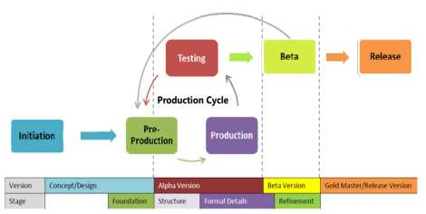
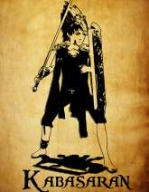
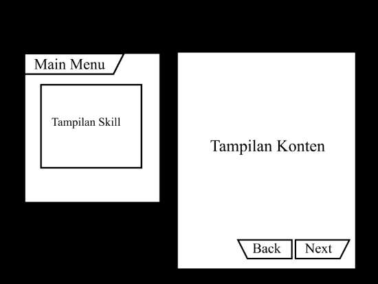
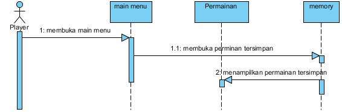
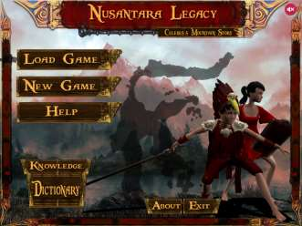
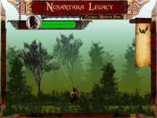
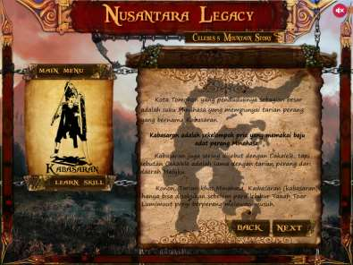

Computer Science (CO-SCIENCE)
Volume 1 No. 1 Januari 2021

Penerapan Game Development Life Cycle Untuk Video Game Dengan
Model Role Playing Game

Mustofa1, Jordy Lasmana Putra2, Chandra Kesuma3

1,3Program Studi Teknologi Komputer, Fakultas Teknik dan Informatika Universitas Bina Sarana Informatika,
Jl. Kramat Raya No.98, Jakarta Pusat, DKI Jakarta 10450, Indonesia

2Program Studi Teknik Informatika, Sekolah Tinggi Manajemen Informatika dan Komputer Nusa Mandiri
Jl. Jatiwaringin No. 2, Cipinang Melayu, Makasar, Jakarta Timur - 13620, Indonesia

e-mail: 1mustofa.muo@bsi.ac.id , 2jordy.jlp@nusamandiri.ac.id, 3chandra.cka@bsi.ac.id

Artikel Info : Diterima : 16-12-2020 | Direvisi : 28-12-2020 | Disetujui : 04-01-2021

Abstrak  - Perkembangan teknologi dan informasi mendorong percepatan dunia yang sangat dinamis. Dengan
adanya dorongan tersebut, teknologi komputer yang dahulu diciptakan sebagai alat bantu pekerjaan manusia saja,
kini telah berkembang menjadi sarana permainan, hiburan, komunikasi dan lain sebagainya. Pada bidang hiburan
salah satu buah teknologi yang banyak digemari adalah industri video game. Namun informasi dan pengetahuan
mengenai pengembangan video game belum begitu diminati di Indonesia terutama tentang life Cycle pada proses
pengembangan video game. Terlebih lagi video game juga memiliki berbagai macam genre dan role-play yang
berbeda-beda. Sehingga tidak semua model Game Development Life Cycle (GDLC) cocok dengan kategori game
tertentu, terutama yang bergenre RPG (Roled Playing Game) yang memiliki role-play yang unik. Sehingga sangat
diperlukan pengujian model yang sesuai. Penelitian ini bertujuan untuk menguji apakah Game Develompment Life
Cylce  yang diajukan oleh  Rido Ramadan  dan Yani Widyani dapat digunakan  pada pengembangan video game
jenis RPG (Roled Playing Game). Hasilnya menunjukan pengembangan video game dengan menggunakan Game
Development  Life  Cycle  (GDLC)  yang  diajukan  oleh  Rido  Ramadan  dan  Yani  Widyani  ini  video  game  dapat
berjalan dengan baik.

Kata Kunci : Video Game, GDLC, Development

Abstracts - The development of technology and information drives the acceleration of a very dynamic world. With
this discovery, computer technology, which was created as a tool for human work, has now developed into a means
of games, entertainment, communication and so on. In the entertainment sector, one of the most popular pieces of
technology is the video game industry. However, information and knowledge regarding video game development
is  not  very  popular  in  Indonesia,  especially  about  the  Life  Cycle  in  the  video  game  development  process.  In
addition, video games have a wide variety of genres and different role-plays. So that not all Game Development
Life Cycle (GDLC) models fit into certain game categories, especially the RPG (Roled Playing Game) genre which
has unique role-playing. So it is necessary to have a suitable testing model. This study aims to test whether the
Life Cylce Development Game proposed by Rido Ramadan and Yani Widyani can be used in the development of
RPG  (Roled  Playing  Game)  video  games.  The  results  show  that  video  game  development  using  the  Game
Development Life Cycle (GDLC) proposed by Rido Ramadan and Yani Widyani, this video game can run well.

Keywords : Video Game, GDLC, Development

PENDAHULUAN

Perkembangan teknologi semakin cepat bergerak maju untuk membuat inovasi baru dalam berbagai segi
kehidupan.  Ditandai dengan adanya  perkembangan teknologi di  berbagai bidang.  Bukan hanya  teknologi  yang
digunakan untuk membantu meringankan pekerjaan manusia, namun juga teknologi yang digunakan untuk hiburan
juga semakin berkembang pesat, salah satunya adalah video game. Pada saat ini, video game adalah permainan
sebagai media hiburan yang semakin lama makin berkembang  (Indahtiningrum, 2013). Video game merupakan
hal yang dominan dalam 20 tahun terakhir karena video game saat ini lebih canggih dan makin beragam (Padilla-
27

This work is licensed under a Creative Commons Attribution-ShareAlike 4.0 International License.

Computer Science (CO-SCIENCE)
Volume 1 No. 1 Januari 2021 | E-ISSN: 2774-9711

Walker et al., 2010). Perkembangan video game ini dibuktikan dengan pendapatan video game secara global yang
terus melonjak dan diperkirakan akan terus meningkat sampai tahun 2021 (Newzoo, 2018). Lonjakan ini terjadi di
semua kategori video game yang dikembangkan baik yang berbasis console, desktop, maupun mobile. Selain itu
video game juga salah satu hiburan yang diminati oleh berbagai kalangan masyarakat. Dari anak-anak hingga yang
sudah  dewasa  juga  memainkan  video  game  baik  sebagai  hiburan  semata  maupun  yang  memaiknanya  sebagai
seorang  professional  (Juariyah,  2018).  Tidak  hanya  sebagai  pemain  namun  ketenaran  video  game  pun  ramai
dijadikan tontonan. Dari sekian banyak jenis  live-streaming di internet,  video game  streaming berada di posisi
teratas (Tassi, 2013). Hal ini dapat terjadi karena video game sekarang mampu menjangkau khalayak yang lebih
luas  berkat  tersedianya  banyak  pilihan  video  game  yang  dapat  diakses  melalui  perangkat  ponsel  pintar  dan
tablet(Ottelin, 2015).

Dalam  pengembangan  video  game  sangat  diperlukan  alur  pengembangan  seperti  pengembangan  sebuah
sistem atau yang seringkali disebut dengan istilah System Developmet Life Cycle (SDLC). Pengembangan video
game yang pada awalnya menggunakan SDLC, saat ini telah mulai berubah mengikuti perkembangan teknologi.
Video game merupakan sebuah sistem yang di dalamnya tidak murni hanya pengembangan sistem, dan juga tidak
murni mengenai seni, kreatifitas dan imajinasi, melainkan kombinasi dari hal-hal tersebut (Ramadan & Widyani,
2013).  Dengan  demikian  pengembangan  sebuah  video  game  sangat  memerlukan  adanya  panduan  khusus  yang
lebih  spesifik  pada  kebutuhan  video game.  Sehingga  munculah  istilah  Game  Development  Life  Cycle  (GDLC)
yang  merupakan  penyesuain  SDLC  agar  lebih  mudah  diterapkan  dalam  pengembangan  video  game.  Dalam
Pengembangan  video  game  saat  ini  terdapat  beberapa  model  GDLC  yang  populer,  beberapa  diantaranya  yang
dirancang  oleh  oleh  Arnold  Hendrick,  Blitz  Games  Studios,  Penny  de  Byl,  Doppler  Interactive  dan  Heather
Chandler. Setiap model GDLC yang dikembangkan akan memiliki karakteristik yang cukup berbeda sesuai dengan
kondisi dan kebutuhan dari pengembang video game.

Di lain sisi video game juga memiliki macam-macam model permainan seperti Role-playing game (RPG),
Shooters,  Puzzle,  Strategi,  Simulasi,  Adventure  dan  masih  banyak  lagi.  Sedangkan  untuk  sub-kategori
dipergunakan  untuk  membagi  kategori  utama  pada  video  game  secara  lebih  spesifik  (Thorn,  2014).  Model
permainan atau genre(aliran) adalah sebuah kategori dari game berdasarkan tantangan dalam permainan, terlepas
dari latar sebuah video game (Adams, 2010)

Mengkaji dari penelitian yang pernah dilakukan sebelumnya oleh Adiwikarta (Adiwikarta & Dirgantara,
2017)  yang  telah  mengembangkan  video  game  beraliran  endless  game  dengan  menggunakan  model  GDLC
miliknya.  Model GDLC  yang ditawarkan tersebut  kurang tepat apabila diterapkan dalam pengembangan video
game  yang  beraliran  Role-playing  game  (RPG)  disebabkan  video  game  beraliran  Role-playing  game  (RPG)
memiliki storyline, quest dan aturan yang lebih kompleks. Video game dengan aliran RPG membutuhkan GDLC
yang mempunyai tahap-tahap khusus yang dapat terapkan oleh pengembang agar bisa fokus pada desain storyline,
quest, rule dan pada unsur lainya yang terdapat pada video game RPG. Tujuan dari penelitian ini adalah untuk
mengembangkan  video  game  beraliran  RPG  yang  dengan  menerapkan  GDLC  yang  dikembangkan  oleh  Rido
Ramadan dan Yani Widyani, serta untuk menguji GDLC yang dikembangkan Rido Ramadan dan Yani Widyani
dapat digunakan dengan baik dalam pembuatan video game ber-genre RPG.

METODE PENELITIAN

Penelitian ini menggunakan metode yang Game Development Life Cycle  yang dikembangkan oleh Rido
Ramadan  dan  Yani  Widyani  (Ramadan  &  Widyani,  2013)  yang  disusun  dalam  enam  tahapan.  Maing-masing
tahapan saling terkait antara satu dengan yang lainnya. Ilutrasi GDLC ini dapat dilihat pada Gambar 1.

 http://jurnal.bsi.ac.id/index.php/co-science

28

Computer Science (CO-SCIENCE)
Volume 1 No. 1 Januari 2021 | E-ISSN: 2774-9711

Sumber: (Ramadan & Widyani, 2013)

Gambar 1. GDLC

1.  Initation

Langkah pertama yang harus dilakukan dalam membuat sebuah  video game adalah dengan membuat

konsep kasar game seperti apa yang akan dibuat. Keluaran dari langkah pertama ini adalah konsep permainan dan
deskripsi permainan yang dijabarkan dengan sederhana.

2.  Pre-Production

Pre-Production atau Pra-produksi adalah salah satu fase utama dan terpenting dalam siklus produksi. Pra-
produksi melibatkan pembuatan dan revisi desain video game dan pembuatan prototipe video game. Fokus pada
desain  video  game  menentukan  genre  game,  gameplay,  mekanik,  alur  cerita,  karakter,  tantangan,  faktor
kesenangan,  aspek  teknis,  dan  dokumentasi  elemennya  dalam  dokumen  desain  game.  Setelah  dokumen  desain
game dibuat, bentuk prototipe dibuat  untuk  menilai desain  game dan keseluruhan idenya. Pada iterasi pertama
siklus produksi, yang dibuat prototipe adalah fondasi dan struktur, sedangkan di iterasi berikutnya, prototipe terkait
yang akan disempurnakan adalah detail dan perbaikan formal.

Dasar  dari  prototipe  pertama,  terkait  dengan  kriteria  kualitas  kesenangan.  Dasar  ini  digunakan  untuk
menunjukkan mockup gameplay inti dan kemampuan game. Kriteria kualitas kesenangan diuji melalui kuesioner
atau diskusi. Struktur dalam perbaikan dasar, akan terkait dengan kriteria kualitas kesenangan dan fungsional pad
video game. Ini merupakan ciri utama dari struktur yang dapat menunjukkan baik itu gameplay inti dari game dan
mekanika seperti aritmatika, logika, dan aturan permainan. Kuisioner dan diskusi digunakan untuk menguji kriteria
kualitas kesenangan. Kemudian kriteria kualitas fungsional diuji melalui playtesting, di mana penguji diberikan
beberapa tugas dan tujuan yang ingin dicapai menurut pengujian skenario. Pra- produksi berakhir saat revisi atau
perubahan desain game telah disetujui dan didokumentasikan.

3.  Production

Produksi adalah proses inti yang membahas seputar pembuatan aset, pembuatan program, dan integrasi
kedua elemen. Terkait prototipe dalam fase ini adalah detail formal dan perbaikan. Detail Formal adalah struktur
yang disempurnakan dengan lebih banyak mekanik dan aset lengkap. Produksi merupakan kegiatan yang terkait
dengan  pembuatan  dan  penyempurnaan  detail  formal  menyeimbangkan,  menambahkan  fitur  yang  baru,
meningkatkan kinerja, dan memperbaiki bug (terkait dengan fungsional dan penyelesaian internal kriteria kualitas).
Penyeimbangan game berarti penyesuaian terkait dengan kesulitan game untuk membuat game tersebut
memiliki  kesulitan  yang  sesuai.  Perbaikan  adalah  prototipe  lengkap  yang  merupakan  subjek  pemolesan  game.
Kriteria  kualitas  pada  tahap  ini  terkait  permainan  harus  menyenangkan  dan  mudah  diakses.  Kegiatan  selama
penyempurnaan diarahkan untuk membuat game lebih menyenangkan, menantang, dan lebih mudah dipahami.
Hanya perubahan kecil diperbolehkan dalam fase ini.

4.  Testing

Pengujian dalam konteks ini berarti pengujian internal yang dilakukan untuk menguji fungsi operasional
dan kemampuan bermain game. Metode pengujian khusus untuk setiap tahap prototipe. Pengujian Detail Formal
dilakukan dengan menggunakan playtest untuk menilai fungsionalitas fitur dan kesulitan permainan (terkait dengan
keseimbangan).

Metode  untuk  menguji  kriteria  kualitas  fungsional  melalui  fitur  playtesting  untuk  menguji  kualitas
lengkap secara internal bisa dilakukan melalui playtesting secara bersamaan dengan uji fungsionalitas. Saat penguji
menemukan  bug,  celah,  atau  jalan  buntu  selama  playtesting,  penyebabnya  dan  skenario  untuk  mereproduksi
kesalahan  yang  diperlukan  didokumentasikan  dan  dianalisis.  Untuk  menguji  keseimbangan  kriteria  kualitas,
playtesting  dengan  beberapa  perbedaan  perbaikan  digunakan  untuk  mengkategorikan  apakah  suatu  perbaikan
terlalu sulit, terlalu mudah, atau tidak diperlukan.

Pengujian Perbaikan berhubungan dengan kualitas kesenangan dan kriteria kualitas aksesibilitas. Dalam
pengujian perbaikan, kesenangan diuji melalui tes bermain dan umpan balik langsung dari sesama pengembang,
baik itu membosankan, membuat frustrasi, menantang, dll. Aksesibilitas dapat diuji melalui mengamati perilaku
penguji. Jika penguji merasa kesulitan untuk memainkan dan memahami permainan, itu berarti bahwa game belum
cukup  mudah  diakses.  Output  dari  pengujian  adalah  laporan  bug,  permintaan  perubahan,  dan  keputusan
pembangunan.  Hasilnya  akan  menentukan  apakah  sudah  waktunya  untuk  maju  ke  fase  berikutnya  (Beta)  atau
mengulangi siklus produksi.

5.  Beta

Beta adalah fase untuk melakukan pengujian oleh pihak ketiga atau eksternal yang disebut pengujian

 http://jurnal.bsi.ac.id/index.php/co-science

29

Computer Science (CO-SCIENCE)
Volume 1 No. 1 Januari 2021 | E-ISSN: 2774-9711

beta  atau  beta  testing.  Pengujian  beta  masih  menggunakan  metode  pengujian  yang  sama  dengan  metode
pengujian  sebelumnya,  karena  prototipe  terkait  dalam  pengujian  beta  merupakan  detail  formal  dan
penyempurnaan. Metode pemilihan penguji hadir dalam dua jenis: beta tertutup dan beta terbuka. Beta tertutup
hanya  mengizinkan  individu  yang  diundang  untuk  menjadi  peserta,  sedangkan  beta  terbuka  memungkinkan
siapa saja yang mendaftar menjadi peserta. Kriteria kualitas dalam versi beta terkait erat dengan tahap prototipe
saat ini.

Dalam pengujian detail formal, penguji diminta untuk menemukan bug (terkait dengan kriteria kualitas
fungsional  dan  lengkap  secara  internal).  Dalam  uji  perbaikan,  penguji  diberikan  kebebasan  lebih  untuk
menikmati  permainan,  karena  tujuannya  lebih  diarahkan  untuk  mendapatkan  umpan  balik  (terkait  kriteria
kualitas kesenangan dan aksesibilitas). Keluaran dari pengujian beta adalah laporan bug dan masukan pengguna.
Sesi beta ditutup terutama karena 2 alasan, baik istilah beta berakhir atau jumlah penguji beta yang ditentukan
telah  memberikan  laporan  pengujian  mereka.  Dari  sini,  dapat  mengarah  ke  siklus  produksi  lagi  untuk
menyempurnakan produk atau terus merilis game jika hasilnya memuaskan.

6.  Release

Ini adalah fase dimana pengembangan video game telah mencapai tahap akhir dan siap dirilis ke publik.
Rilis melibatkan peluncuran produk, dokumentasi proyek, berbagi pengetahuan, post-mortem, dan perencanaan
untuk pemeliharaan dan perluasan game.

HASIL DAN PEMBAHASAN

Sesuai dengan metode Game Development Life Cycle hasil dari penelitian yang dilakukan sebelumnya oleh

Ramadan dan Yani Widyani maka pembahasan dalam penelitian ini akan disusun sesuai metode tersebut.
1.  Initation

Tahap pertama dilakukan adalah membuat konsep kasar game yang akan dibuat. Langkah pertama ini
menyusun konsep permainan berupa sebuah video game dengan basis dua dimensi. Selain itu video game yang
dibuat juga harus memiliki unsur budaya khas Indonesia. Nama dari video game ini adalah Nusantara Legacy.

2.  Pre-Production

Pada  tahap  ini    melanjutkan  penjabaran  lebih  luas  daripada  tahap  sebelumnya  dengan  melakukan
pembuatan prototipe video game. Pada tahap ini pembahasan lebih fokus pada desain video game dengan lebih
rinci. Seperti menentukan genre game adalah Role Playing Model (RPG), kemudian mementukan gameplay yang
diterapkan  adalah  action-fighting  game,  serta  menyusun  bagaimana  interaksi  pemain  dan  video  game  dengan
menyusun mekanika permanainan.

Sumber: (Mustofa dkk, 2021)

 http://jurnal.bsi.ac.id/index.php/co-science

30

Computer Science (CO-SCIENCE)
Volume 1 No. 1 Januari 2021 | E-ISSN: 2774-9711

Gambar 2. Desain kasar karakter

Pada tahap ini juga dituliskan alur cerita dalam bentuk storyboard, pembuatan karakter (lihat gambar 2)
dan desain karakter kasar yang disesuaikan dengan alur cerita yang dirumuskan pada storyboard. Pada tahap ini
juga  dirancang  tantangan-tantangan  yang  akan  dihadapi  oleh  pemain  dalam  permainan  yang  harus
mempertimbangkan faktor kesenangan serta  aspek teknis yang harus seimbang agar video game tidak hanya dapat
dijalankan, namun juga menyenangkan untuk dimainkan. Juga dirancang fitur-fitur yang terdapat pada video game.
Salah satunya adalah fitur knowledge dictionary seperti yang ditunjukan pada gambar 3.

Sumber: (Mustofa dkk, 2021)

Gambar 3. Desain fitur pada game

Semua pembahasan pada tahap ini didokumentasikan dalam dokumen desain  game. Setelah dokumen
desain  game  dibuat,  bentuk  prototipe  dibuat  untuk  menilai  desain  game  dan  keseluruhan  idenya.  Dasar  dari
prototipe pertama, terkait dengan kriteria kualitas kesenangan. Dasar ini digunakan untuk menunjukkan mockup
gameplay  inti  dan  kemampuan  game  nantinya.  Sepetri  yang  ditunjukan  pada  gambar  4.  Yang  menampilkan
dokumentasi dari alur fitur dalam video game.

Sumber: (Mustofa dkk, 2021)

Gambar 4. alur fitur load  pada game

Kriteria kualitas kesenangan diuji melalui diskusi oleh para pengembang. Diskusi juga digunakan untuk
menguji  kriteria  kualitas  kesenangan  pada  permainan  ini.  Kemudian  kriteria  kualitas  fungsional  diuji  melalui
playtesting, di mana penguji diberikan beberapa tugas dan tujuan yang ingin dicapai menurut pengujian skenario.
Pra- produksi berakhir saat revisi atau perubahan desain game telah disetujui dan didokumentasikan.

 http://jurnal.bsi.ac.id/index.php/co-science

31

Computer Science (CO-SCIENCE)
Volume 1 No. 1 Januari 2021 | E-ISSN: 2774-9711

3.  Production

Pada tahap poduksi ini, mockup dan desain yang sudah didokumentasikan pada tahap pra-produksi dibuat
dan disempurnakan dengan detail. Pada tahap produksi ini saling terkait antara pembuatan asset dan pengukuran
kinerja  yang  direncanakan  sehingga  sangat  diperlukan  perhitungan  beban  aset  dan  performa.  Pada  gambar  4
ditunjukan bagaiamana hasil produksi dari mockup yang dibuat pada tahap pra-produksi.

Sumber: (Mustofa dkk, 2021)

Gambar 4. alur fitur load  pada game

Penyeimbangan  game  juga  diukur  dengan  kesulitan  game  untuk  membuat  game  tersebut  memiliki
kesulitan yang sesuai. Kriteria kualitas pada tahap ini terkait permainan harus menyenangkan dan mudah diakses.
Sehingga penyediaan fitur-fitur yang sebelumnya mungkin belum terfikirkan dapat ditambahkan pada tahap ini.
Kegiatan  selama  penyempurnaan  diarahkan  untuk  membuat  game  lebih  menyenangkan,  menantang,  dan  lebih
mudah dipahami. Namun hanya perubahan kecil saja yang diperbolehkan dalam fase ini.

4.  Testing

Pengujian internal dilakukan untuk menguji fungsi operasional dan kemampuan bermain game. Metode
pengujian dilakunak denga metode blackbox testing untuk memastikann permainan dapat dijalankan sesuai dengan
rencana pengembangan video game. Selain itu juga dilakukukan pengujian dengan metode untuk menguji kriteria
kualitas fungsional melalui fitur playtesting untuk menguji kualitas lengkap secara internal bisa dilakukan melalui
playtesting  secara  bersamaan  dengan  uji  fungsionalitas.  Saat  penguji  menemukan  bug,  celah,  atau  jalan  buntu
selama playtesting, penyebabnya dan skenario untuk mereproduksi kesalahan yang diperlukan didokumentasikan
dan dianalisis. Untuk menguji keseimbangan juga dilakukan, playtesting dengan beberapa perbedaan perbaikan
digunakan untuk mengkategorikan apakah suatu perbaikan terlalu sulit, terlalu mudah, atau tidak diperlukan.

 http://jurnal.bsi.ac.id/index.php/co-science

32

Computer Science (CO-SCIENCE)
Volume 1 No. 1 Januari 2021 | E-ISSN: 2774-9711

Sumber: (Mustofa dkk, 2021)

Gambar 5. Testing internal

Dalam pengujiankembali saat dilakukan perbaikan diuji melalui tes bermain dan umpan balik langsung
dari  sesama  pengembang  akan  dikategorikan  membosankan,  membuat  frustrasi,  menantang,  dll.  Aksesibilitas
dapat diuji melalui mengamati perilaku penguji. Jika penguji merasa kesulitan untuk memainkan dan memahami
permainan,  itu  berarti  bahwa  game  belum  cukup  mudah  diakses.  Maka  akan  dilakukan  perbaikan  pada  tahap
reproduksi.

5.  Beta

Pada tahap ini dilakukan pengujian oleh pihak eksternal. Pengujian beta masih menggunakan metode
pengujian  yang  sama  dengan  metode  pengujian  sebelumnya.  Pengujian  beta  dilakukan  dengan  metode  beta
tertutup yang hanya mengizinkan individu yang diundang untuk menjadi peserta,  Penguji diberikan kebebasan
lebih untuk menikmati permainan, karena tujuannya lebih diarahkan untuk mendapatkan umpan balik sehingga
ditemukan laporan tentang adanya bug

6.  Release

Tahapan  ini  pengembangan  video  game  telah  mencapai  tahap  akhir  dan  siap  dirilis  ke  publik.  Rilis

melibatkan peluncuran produk, dokumentasi proyek, dan perencanaan untuk pemeliharaan dan perluasan game.

Sumber: (Mustofa dkk, 2021)

Gambar 6. Tampilan game

KESIMPULAN

Penelitian ini telah mencoba untuk menerapkan GDLC (Game Development Life Cycle) yang disusun Rido
Ramadan  dan  Yani  Widyani  dengan  mengembangkan  video  game  berbasis  dua  dimensi.  Hasilnya  adalah
penerapan GDLC model ini dapat diterapakan dan berjalan dengan sangat baik pada video game beraliran RPG
(Roled  Playing  Game)  tanpa  kendala  yang  berarti.  GDLC  model  ini  ini  mendeskripsikan  tahapan-tahapan
pengembangan yang lengkap serta memberikan keleluasaan bagi pengembang dalam mengekplorasi bagian dari
video game beraliran RPG. Terutama adalah pembgian tahapan pra-produksi yang memberikan kesempatan untuk
mematangkan  story  board  yang  merupakan  ciri  khas  dari  video  game  RPG  Untuk  peneltian  kedepan  dapat
dilakukan perbandingan antara beberapa GDLC terhadap beberapa genre video game untuk menentukan GDLC
yang paling tepat untuk digunakan pada pengembangan video game dengan genre tertentu.

 http://jurnal.bsi.ac.id/index.php/co-science

33

Computer Science (CO-SCIENCE)
Volume 1 No. 1 Januari 2021 | E-ISSN: 2774-9711

REFERENSI

Adams,  E.  (2010).  Fundamentals  of  Game  Design.  In  Choice  Reviews  Online  (2nd  ed.).  New  Rider.

https://doi.org/10.5860/choice.47-4462

Adiwikarta, R., & Dirgantara, H. B. (2017). Pengembangan Permainan Video Endless Running Berbasis Android
Menggunakan Framework Game Development Life Cycle Rendy. Jurnal Sains Dan Teknologi, 4, 142–148.
Indahtiningrum,  F.  (2013).  Hubungan  antara  kecanduan  video  game  dengan  stres  pada  mahasiswa  universitas

surabaya fitriana indahtiningrum. Jurnal Ilmiah Universitas Surabaya, 2(1), 1–17.

Juariyah, J. (2018). Pengalaman Bermain Video Games Sebagai Kegiatan Leisure Class Middle Lower Remaja

Kampung Tanoker. Mediakom, 1(2), 155–175. https://doi.org/10.32528/mdk.v1i2.1575

Newzoo. (2018). Newzoo 2018 Global Mobile Market Report Free.
Ottelin, T. (2015).  Twitch and professional gaming: Playing video games as a career? Degree Programme in
Management.

Music
Management
https://www.theseus.fi/bitstream/handle/10024/96979/Opinnaytetyo.pdf;sequence=1

Business

Services

Media

and

and

Padilla-Walker, L. M., Nelson, L. J., Carroll, J. S., & Jensen, A. C. (2010). More than a just a game: Video game
and  internet  use  during  emerging  adulthood.  Journal  of  Youth  and  Adolescence,  39(2),  103–113.
https://doi.org/10.1007/s10964-008-9390-8

Ramadan, R., & Widyani, Y. (2013). Game development life cycle guidelines. 2013 International Conference on
Advanced  Computer  Science  and  Information  Systems,  ICACSIS  2013,  September  2013,  95–100.
https://doi.org/10.1109/ICACSIS.2013.6761558

Tassi,  P.  (2013).  Talking  livestreams,  esports  and  the  future  of  entertainment  with  twitch.  Forbes.Com.
https://www.forbes.com/sites/insertcoin/2013/02/05/talkinglivestreams-%0Aesports-and-the-future-of-
entertainment-with-twitch-tv/

Thorn,  A.  (2014).  Document retrieved  from :  Gale  Catalog  Grade  Level  Range :  College  Freshman  -  College

Senior About Meet the Author Author Bio Alan Thorn. Cengage Course Technology.

 http://jurnal.bsi.ac.id/index.php/co-science

34

## Extracted Images

### Page 1

### Page 2

### Page 4

### Page 5

### Page 6

### Page 7

