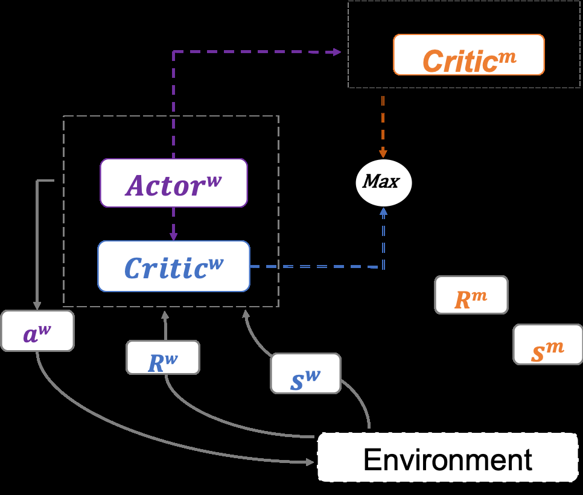
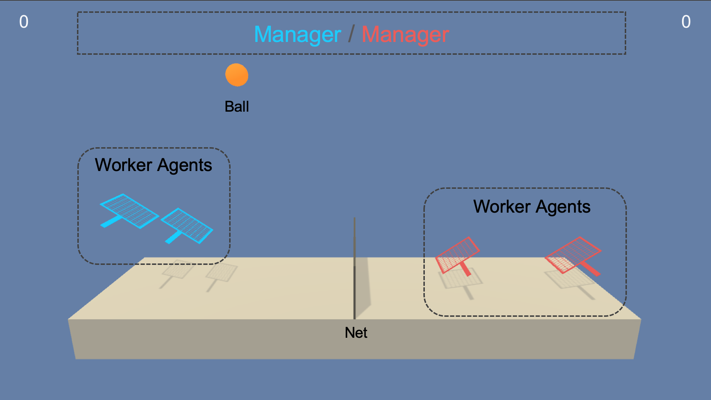
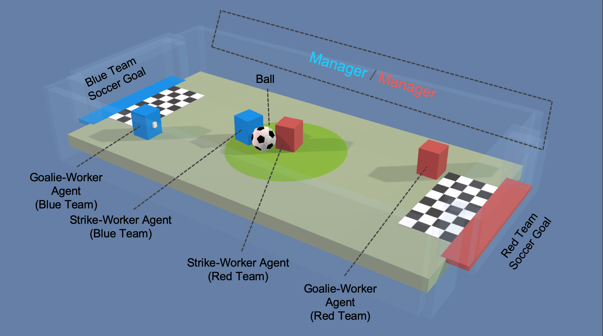
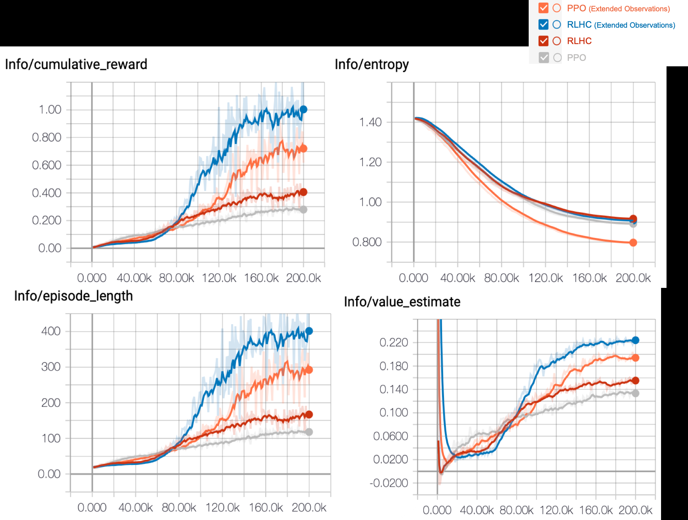
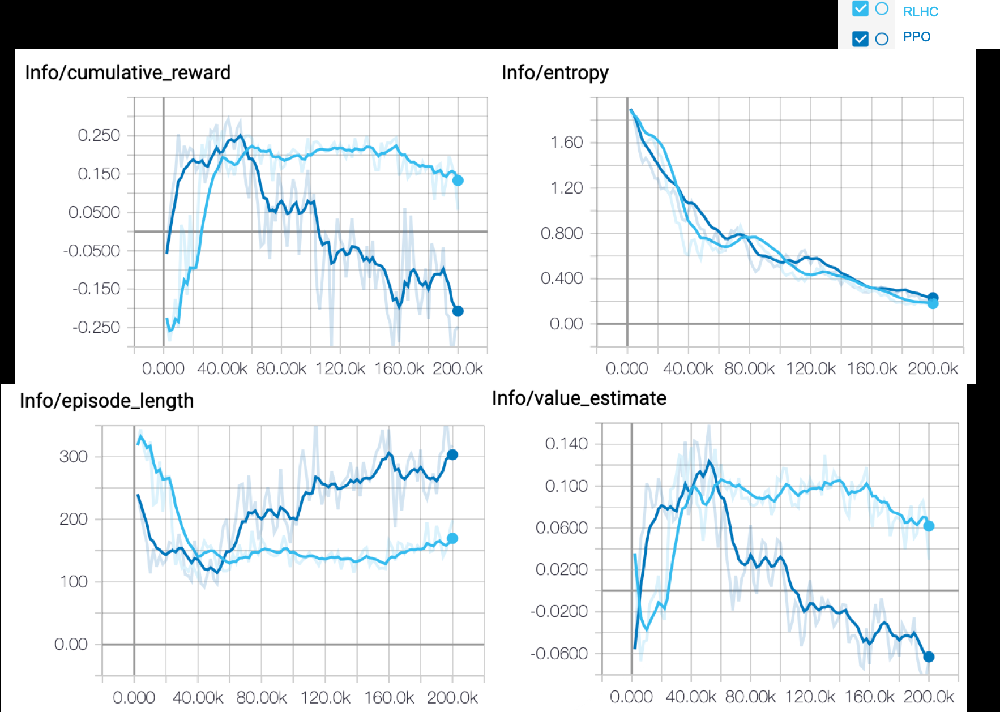

REINFORCEMENT LEARNING FROM HIERARCHICAL CRITICS
APREPRINT
ZehongCao Chin-TengLin
UniversityofTasmania,Australia UniversityofTechnologySydney,Australia
zhcaonctu@gmail.com chin-teng.lin@uts.edu.au
March3,2020
ABSTRACT
In this study, we investigate the use of global information to speed up the learning process and
increasethecumulativerewardsofreinforcementlearning(RL)incompetitiontasks. Withinthe
actor-criticRL,weintroducemultiplecooperativecriticsfromtwolevelsofthehierarchyandpropose
areinforcementlearningfromhierarchicalcritics(RLHC)algorithm. Inourapproach,eachagent
receivesvalueinformationfromlocalandglobalcriticsregardingacompetitiontaskandaccesses
multiplecooperativecriticsinatop-downhierarchy. Thus,eachagentnotonlyreceiveslow-level
detailsbutalsoconsiderscoordinationfromhigherlevels,therebyobtainingglobalinformationto
improvethetrainingperformance.Then,wetesttheproposedRLHCalgorithmagainstthebenchmark
algorithm,proximalpolicyoptimisation(PPO),fortwoexperimentalscenariosperformedinaUnity
environmentconsistingoftennisandsocceragents’competitions. TheresultsshowedthatRLHC
outperformsthebenchmarkonbothcompetitiontasks.
Keywords ReinforcementLearning;Hierarchy;Critics;Competition
1 Introduction
Many agent training studies concern reinforcement learning (RL) techniques, which provide learning policies to
achievecooperativeorcompetitivetasksbymaximisingrewardsthroughinteractionswiththeenvironment[1]. At
eachtrainingstep,theagentperceivesthestateoftheenvironmentandtakesanactionthatcausestheenvironment
totransitionintoanewstate. Inacompetitivegamewithmultipleplayers,suchasazero-sumgamefortwoagents,
themini-maxprinciple,inwhicheachplayertriestomaximiseitsbenefitsundertheworst-caseassumptionthatthe
opponent will always endeavour to minimise that benefit, is applied. For example, the minimax-Q algorithm [2]
employstheminimaxprincipletocomputestrategiesandvaluesforthestagegamesandatemporal-differencerule
similartoQ-learningtopropagatethevaluesacrossstatetransitions. Formorecomplexcompetitionenvironments,
suchasStarCraftIItasks,[3]proposedajointvalue-basedmethod,QMIX,tocoordinatebetweenthecentralisedand
decentralisedpolicies. Furthermore,[4]presentedanadaptationofactor-criticmethodsthatcombinesvalue-based
methodsinthecriticandpolicygradientmethodsintheactor. Followingthis,[5]recentlyproposedanewactor-critic
methodcalledcounterfactualmulti-agent(COMA)policygradientsthatusesacentralisedcritictoestimatetheQvalue
anddecentralisedactorstooptimisetheagents’policies.
However,theabovestudiesdidnotimprovehierarchicallearningwithactor-criticstructure. Consideringthewayin
whichagentsarehierarchicallystructuredmayenableRLalgorithmstoovercomethechallengesofexcessivetraining
time[6]. Inspiredbyfeudalreinforcementlearning[7],theDeepMindgroupproposedthefeudalnetwork(FuN)[8],
whichemploysmanagerandworkermodulesforhierarchicalreinforcementlearning. Themanagersetsabstractgoals,
whichareconveyedtoandenactedbytheworker,whogeneratesprimitiveactionsateachenvironmenttick. TheFuN
structurehasbeenextendedtocooperativereinforcementlearning[9],inwhichthemanagerlearnstocommunicate
sub-goalstomultipleworkers. Indeed,theabilitytoextractsubgoalsfromthemanagerallowsFuNtodramatically
outperformastrongbaselineagentontasks.
WithinthehierarchicalstructuredRL,currentRLmethodsasmentionedabovefocusmoreonassigningthesubgoals
andignorethecriticalfactthatgivingtheagentaccesstomultiplecooperativecriticsmightspeedupthelearning
0202
raM
1
]GL.sc[
4v97030.2091:viXra

APREPRINT-MARCH3,2020
processandincreasetherewardsoncompetitiontasks. Inparticular,itisfrequentlythecasethathigh-levelagents
agree to be assigned different observations that work in combination with low-level agents to benefit hierarchical
cooperation. Thus,inthisstudy,weintroducemultiplecooperativecriticsfromtwolevelsofthehierarchyandpropose
areinforcementlearningfromhierarchicalcritics(RLHC)algorithm. Themaincontributionsofourproposedapproach
arethefollowing: (1)Anagentreceivesinformationfrombothlocalandglobalcriticsregardingacompetitivetask. (2)
Theagentreceivesnotonlylow-leveldetailsbutalsoglobalinformationtoconsidercoordinationfromhigherlevels
toincreaseoperationalperformance. (3)Wedefinemultiplecooperativecriticsinthetop-to-bottomhierarchy,called
reinforcementlearningfromhierarchicalcritics(RLHC).WeassumethatRLHCisapotentialgeneralisedRLandis
thusmoreapplicableforspeedingupthetrainingandimprovingthelearningforagents. Thesebenefitscouldpotentially
beobtainedwhenusinganytypeofhierarchicalRLalgorithm.
Theremainderofthispaperisorganisedasfollows. InSection2,weintroducetheRLbackgroundfordevelopingthe
multiplecooperativecriticframeworkinagentcompetitiondomains. Section3describesthebaselineandproposes
theRLHCalgorithm. Section4presentstwoexperimentaldesignsbasedonUnity-basedtennisandsoccertaskswith
observationsettings. Section5reportsthetrainingperformanceresultsofthebenchmarkalgorithmandtheproposed
RLHCalgorithm. Finally,wesummarisethepaperinSection6.
2 Preliminaries
2.1 RevisitingReinforcementLearning
InastandardRLframework[10],anagentinteractswiththeexternalenvironmentoveranumberoftimesteps. Here,s
isthesetofallpossiblestates,andaisthesetofallpossibleactions. Ateachtimestept,theagentinstates perceives
t
theobservationinformationO fromtheenvironment,takesanactiona ,andreceivesfeedbackfromtherewardsource
t t
R . Then,theagenttransitionstoanewstates ,andtherewardR associatedwiththetransition(s ,a ,s )is
| t   | t+1 |     | t+1 | t t | t+1 |
| --- | --- | --- | --- | --- | --- |
determined. Theagentcanchooseanactionfromthelaststatevisited. Thegoalofareinforcementlearningagentisto
collectthemaximumpossiblerewardwithminimaldelay.
Next,werevisittheprimarycomponentsinthelearningprocess: MDPandthepolicygradient.
InMDP,astateS isMarkovifandonlyif
t
|     | P[S |S | ]=P[S | |S ,...,S ] |     | (1) |
| --- | ------ | ----- | ----------- | --- | --- |
|     | t+1 t  | t+1   | 1 t         |     |     |
Thefuturestateisindependentandunrelatedtothepaststates. ThestatetransitionmatrixP isdefinedtopresentthe
transitionprobabilitiesfromallstatesstoallsubsequentstatess(cid:48).
|     | P =P[S     | =s(cid:48)|S | =s] |     | (2) |
| --- | ---------- | ------------ | --- | --- | --- |
|     | ss(cid:48) | t+1          | t   |     |     |
AMarkovrewardprocessisatuple<S,A,P,R,γ >,whereSisafinitesetofstates,Aisafinitesetofactions,andγ
isadiscountfactor,γ ∈[0,1].
• P isastatetransitionprobabilitymatrixfromEquation(2),
|     | Pa =P[S    | =s(cid:48)|S | =s,A =a]. |     | (3) |
| --- | ---------- | ------------ | --------- | --- | --- |
|     | ss(cid:48) | t+1          | t t       |     |     |
• risarewardfunctionthatrepresentstheexpectedrewardafterthetransitionfromP,
|     | ra =E[r | |S    | =s,A =a] |     | (4) |
| --- | ------- | ----- | -------- | --- | --- |
|     | s       | t+1 t | t        |     |     |
ThereturnR ,definedasthesumoffuturediscountedrewards,
t
∞
(cid:88) γkr
|     | R = |     | .   |     | (5) |
| --- | --- | --- | --- | --- | --- |
t t+k+1
k=0
Toestimate“howgood”itistobeinagivenstate,thestatevaluefunctionoftherewardV (s)isdefinedastheexpected
π
returnstartingwithstatesunderpolicyπ
(s)=E[R
|     | V   | |S  | =s,π], |     | (6) |
| --- | --- | --- | ------ | --- | --- |
|     | π   | t t |        |     |     |
wherepolicyπ
|     | π(a|s)=P[A | =a|S | =s] |     |     |
| --- | ---------- | ---- | --- | --- | --- |
t t
. Althoughthestatevaluefunctionsufficestodefineoptimality,itisusefultodefinetheactionvalueofthereward
functionQ (s,a):
π
|     | Q (s,a)=E[R | |S =s,A | =a,π]. |     | (7) |
| --- | ----------- | ------- | ------ | --- | --- |
|     | π           | t t     | t      |     |     |
2

APREPRINT-MARCH3,2020
Following the introduction of the value function, we can generate a gradient ascent-based RL, called the policy
gradient. Asagradientascentstrategy,itmodelsandoptimisesthepolicydirectly. Thepolicyisusuallymodelledbya
parameterisedfunctionwithrespecttoθ,π (s,a). Thevalueoftherewardfunctiondependsonthispolicyandvarious
θ
otheralgorithms,suchasREINFORCE(MonteCarloPolicyGradient)[11],deepdeterministicpolicygradient(DDPG)
[12],andasynchronousadvantageactor-critic(A3C)[13]. Proximalpolicyoptimisation(PPO)[14]canbeappliedto
optimiseθtoacquirethegreatestreward.
Thefundamentalrewardfunctionisdefinedasfollows:
J(θ)=E
πθ
[π
θ
(s,a)Qπθ(s,a)], (8)
andthenthegradientiscomputed:
(cid:53)
θ
J(θ)=E
πθ
[(cid:53)
θ
logπ
θ
(s,a)Qπθ(s,a)]. (9)
2.2 Actor-critic
Theactor-criticstrategyaimstotakeadvantageofthebestcharacteristicsfromboththevalue-basedandpolicy-based
approacheswhileeliminatingalltheirdrawbacksandunderliesrecentmodernRLmethodsfromA3CtoPPO.To
understandthelearningstrategies,thevaluefunctioncanhelpwithpolicyupdates,suchasbyreducinggradientchanges
intheoriginalstrategygradient,whichiswhatactor-criticmethodsdo. Specifically,actor-criticmethodsconsistof
twomodelsthatcanoptionallyshareparameters: (a)acriticupdatesthevaluefunctionparametersw,whichcouldbe
anaction-valuefunctionQ (s,a)orastatevaluefunctionV (s);(b)theactorupdatesthepolicyparametersθfor
w w
π (s,a)inthedirectionsuggestedbythecritic.
θ
2.2.1 AsynchronousAdvantageActor-Critic(A3C)
TheA3Cstructure[13]canmasteravarietyofcontinuousmotorcontroltasksandlearngeneralgameexploration
strategies purely from observations. A3C maintains a policy (π (s ,a )) and an estimate of the value function
θ t t
(V(s ;θ )). Thread-specificparametersaresynchronisedwiththeglobalparameters: θ(cid:48) =θandw(cid:48) =w. Thisvariant
t w
ofactorcriticismcanoperateintheforwardviewandusesthesamemixofn-stepreturnstoupdateboththepolicyand
thevaluefunction.
Theupdaterewardfunctioncanbewrittenasfollows:
(cid:53) J(θ(cid:48))=(cid:53) logπ (s ,a )Aˆ(s ,a ;θ,θ ), (10)
θ(cid:48) θ(cid:48) θ(cid:48) t t t t w
whereAˆisanestimateoftheadvantagefunctiongivenby
k−1
Aˆ(s ,a ;θ,θ )= (cid:88) γirt+i+γkV(s ;θ)−V(s ;θ ), (11)
t t w t+k t w
i=0
andkvariesfromstatetostateandhasanupperboundoft .
max
Theparametersθ(ofthepolicy)andθ (ofthevaluefunction)aresharedevenwhentheyareshowntobeseparatefor
w
generality. Forexample,aconvolutionalneuralnetworkhasonesoftmaxoutputforthepolicyπ (s ,a )andonelinear
θ t t
outputforthevaluefunctionV(s ;θ ),andallitsnon-outputlayersareshared.
t w
2.2.2 ProximalPolicyOptimisation(PPO)
PPO[14]isanewfamilyofpolicygradientmethodsforreinforcementlearningthatalternatebetweensamplingdata
through interactions with the environment and optimising a surrogate objective function using stochastic gradient
ascent. PPOimposestheconstraintbyforcingr(θ(cid:48))toremainwithinasmallintervalofapproximately1,specifically,
[1−ε,1+ε],whereεisahyperparameter. Thefunctionclip(r(θ(cid:48)),1−ε,1+ε)clipstheratiowithin[1−ε,1+ε].
Theobjectivefunctionmeasuresthetotaladvantageoverthestatevisitationdistributionandactions,
J(θ(cid:48))=E[r(θ(cid:48))Aˆθ(s,a)], (12)
wherer(θ(cid:48))=π (s,a)/π (s,a)representstheprobabilityratiobetweenthenewandoldpolicies.
θ(cid:48) θ
Toapproximatelymaximiseeachiteration,the“surrogate”objectivefunctionisasfollows:
J(θ(cid:48))=E[min(r(θ(cid:48)))Aˆθ(s,a),clip(r(θ),1−ε,1+ε)Aˆθ(s,a)]. (13)
3

APREPRINT-MARCH3,2020
3 Method
Topropagatethecriticsinthehierarchies,weproposeRLHCbyconsideringmultiplecooperativecriticsintwolevels
of the hierarchy. RLHC aims to speed up the learning process and increase the cumulative rewards, as we assign
eachagenttoreceiveinformationfrombothlocalandglobalcritics. Thenoveltyofthisstudyisthatitsupportsthe
conceptthatconsideringinformationfrommultiplecriticsatdifferentlevelsisbeneficialfortraininginahierarchical
reinforcementlearningframework. Theassumptionisthatahigher-levelcriticwillbebeneficialforanagentwho
waspreviouslyabletouseonlythecriticinitssurroundinglayer. Thus,weaddressthemodifiedadvantagefunction
performedbythemaximumfunctioninaunionsetbasedonthebaseline,thebenchmarkPPOalgorithm.
3.1 Baseline: theBenchmarkPPO
PPOperformscomparablytoorbetterthanotherstate-of-the-artRLmethodsandbecamethebenchmarkreinforcement
learningalgorithmatOpenAI1andUnity2duetoitseaseofuseandgoodperformance. Here,weusePPOasbotha
baselinetovalidatetheexperimentsandasastartingpointtodevelopanovelRLHCalgorithm.
3.2 LearninginMulticritics
ToapplyPPOtotheproblemofagentswithvariableattentiontomorethanonecritic,weconsidertheargumentfor
resolvingthemultiple-criticlearningproblem. Foreachcritici,thecorrespondingadvantagefunctionisAθi(s
i
,a)
generatedfromthestatevaluefunctionVi(s ,θ),dependingonthedifferentscaleobservationsO(expressedasthe
i
states)andthenetworkparameterθ. Consistentwithexistingwork,theadvantagefunctionisextendedfromthevalue
functionandmeasuresthevalueoftheagent’sactions.
Formultiplecritics(suchastwocriticsrepresentingi = 2),weworkwiththeargumentoftheminimumobjective
functiontofindtheminimumadvantagethatrepresentsthebenefitofchoosingaspecificactioninsteadoffollowingthe
currentpolicy. Theargumentoftheminimumobjectivefunctioncanbewrittenasfollows:
argmin((cid:53) (θ(cid:48)))=argmin(E[(cid:53) (θ(cid:48))Aˆθ(s,a)]). (14)
J r
ToachieveaminimisedAˆθ(s,a),weneedtomaximisethecurrentstatevaluefunctionV(s;θ)extractedfromEquation
(11),whichcanbewrittenas
min[Aˆ(s,a)]→max[V(s;θ)], (15)
in other words, the set of
Vˆθ
of the given argument of objective function J(θ(cid:48)) for which the value of the given
i
expressionattainsitsmaximumvalue. BecausethemaximumVˆ(s,θ)indicatesthatactionaisabetterchoicethanthe
currentpolicyπ(θ),wemeasuretheadvantagefunctionperformedbycollectingindividualVˆi(s,θ)andchoosingthe
maximumVˆ(s,θ). Thecorrespondingupdatedvaluefunctioncanbewrittenasfollows:
m
Vˆ(s,θ)=max (cid:91) Vˆi(s,θ), (16)
i=2
wheremisthetotalnumberofcritics.
Ifweconsiderthentimestepintervalsofmultiplecritics,thenminEquation(16)canbereplacedwithh ,where
t
h =h ,h =m,k =2,3,4,...,andT isatimeperiodwithntimesteps;otherwise,h =2.
t t+kT t t
3.3 RLHC
Intermsofpropagatingthecriticsinthehierarchies,wearethefirsttodevelopanRLstrategyfromhierarchicalcritics
allowingaworkeragentitoreceiveinformationfrommultiplecriticscomputedbothlocallyandglobally. Themanager
isresponsibleforcollectingthebroaderobservationsandestimatingthecorrespondingglobalcritic,whichitsendsto
theworkeragent. Toclarifyourproposedalgorithm,wealsoshowthepseudo-codeofourproposedRLHCbelow.
Here,weapplytheRLHCalgorithminthePPO.ThesuccessfullytrainedRLHCmodelrequirestuningofthetrained
hyperparameters, which is beneficial for the output of the training process containing the optimised policy. This
investigationallowscriticismfromthemanagertoimprovethetrainingperformance.
1https://openai.com/blog/openai-baselines-ppo
2https://github.com/Unity-Technologies/ml-agents/blob/master/docs/Training-PPO.md
4

APREPRINT-MARCH3,2020
Algorithm1RLHC
i
1: Definetheobservationenvironmentforeachworkeragenti→O andmanager→O m
| Initialise→thestateofeachworkeragentsw |     |                          | w                      |     |
| -------------------------------------- | --- | ------------------------ | ---------------------- | --- |
| 2:                                     |     | i,thestateofthemanagersm | andthepolicyparameterθ |     |
|                                        |     | 0                        | 0                      | 0   |
Initialise→thecriticnetworksofmanagerAˆmandeachworkerA ˆwi andtheactornetworkforeachworkerπwi
| 3:  |     |     |     | to  |
| --- | --- | --- | --- | --- |
|     |     | 0   | 0   | 0   |
determineactiona
4: forIteration=1,2,...do
5: forActor=1,2,...,ido
| Runpolicyπ | intheenvironmentforT | ∈ttimesteps |     |     |
| ---------- | -------------------- | ----------- | --- | --- |
| 6:         | θ                    |             |     |     |
ˆθ
7: Usingθ(cid:48)tointeractwiththeenvironmenttocollects ,a andcomputeadvantagefunctionA
|                                                      |     | t           | t   | t   |
| ---------------------------------------------------- | --- | ----------- | --- | --- |
| 8: Minimisethegradientoftheobjectivefunction(cid:53) |     | (θ(cid:48)) |     |     |
J
→measuretheprobabilityratior(θ(cid:48))betweennewandoldpolicies
9:
→findthemaximumcurrentvaluefunctionV ˆθ toachievetheminimumadvantagefunctionA ˆθ selected
| 10: |     | t   |     | t   |
| --- | --- | --- | --- | --- |
fromtheadvantageestimateofworkeragentiorthemanager
|     |     | argmin(cid:53) (θ(cid:48))= |     |     |
| --- | --- | --------------------------- | --- | --- |
J
|     | E[min[((cid:53)w(θ(cid:48))Aˆθ | (swi,a ),(cid:53)m(θ(cid:48))Aˆθ | (sm,a  |     |
| --- | ------------------------------ | -------------------------------- | ------ | --- |
|     |                                | t t                              | t t )] |     |
|     |                                | r t                              | r t    |     |
→max[V(swi;θ),V(sm;θ)]
t t
11: Choosethemaximumvalue:
(cid:91)
ˆθ (V(swi;θ),V(sm;θ))
|     | V   | t =max t | t   |     |
| --- | --- | -------- | --- | --- |
i=1
ˆθ ˆθ,...,A ˆθ
| 12: UsethemaximumvalueV | tocalculatetheadvantageestimatesA |     |     |     |
| ----------------------- | --------------------------------- | --- | --- | --- |
t 1 T
13: endfor
14: Optimisethe“surrogate”objectivefunctionfromPPO
| Updateθ(cid:48) →θ |     |     |     |     |
| ------------------ | --- | --- | --- | --- |
15:
16: endfor
Furthermore,wedrawFig. 1asasimplificationtodemonstratetheRLHCalgorithmconstructedusingatwo-level
hierarchyforoneworkeragentwithamanager. Thelocalandglobalcriticsareimplementedbythemaximumfunction
illustratedinthe“learninginmulticritics”. Forthemodifiedstatevaluefunctionwepropose,themanagerandworker
sharetheactors,buttheyprovidedifferentcriticsfromthetwolayers(weconsiderithierarchical),whichcorrespond
tothearrowsandthemaximumfunctioninFig. 1. Themanagerreceivesthesharedactionspacefromtheworker
butprovidesonlyhigh-levelcriticismtotheworker. Thisstrategynotonlyallowsustoestimatethevalueofmultiple
criticsfromdifferentlevelsbutalsofurtherallowstheuseofweightedapproachestofusecriticsfromdifferentlayersor
tooptimisethetemporalscalingofcriticsinseparatelayers. Forsimplicity,theexperimentsinthefollowingsection
presentedinthisstudygenerallyusetwo-levelhierarchies,suchasamulti-agenthierarchywithupto2managersand4
workeragentsforcompetition.
5

APREPRINT-MARCH3,2020
Figure1. TheRLHCalgorithm
4 Experiment
WeappliedourproposedRLHCalgorithmtotwoscenariosinwhichupto4agentscompete. Weempiricallyshow
thesuccessofourRLHCcomparedwiththebenchmarkPPOmethodincompetitivescenariossuchastennisandtoy
soccer. WehavereleasedcodesforboththemodelandtheenvironmentsonGitHubforreplicationpurposes.
4.1 UnityPlatformforRL
Becausemanyexistingplatforms(e.g.,OpenAIGym)lacktheabilitytoconfigurethesimulationformultipleagents
flexibly, the simulation environment becomes a black box from the perspective of the learning system. The Unity
platform,anewopen-sourcetoolkit,hasbeendevelopedforcreatingandinteractingwithsimulationenvironments.
Specifically,theUnitymachinelearningagentstoolkit(ML-AgentsToolkit)[15]isanopen-sourceUnitypluginthat
enablesgamesandsimulationstoserveasenvironmentsfortrainingmultipleintelligentagents. Thetoolkitsupports
dynamicmulti-agentinteraction,andagentscanbetrainedusingRLthroughastraightforwardPythonAPI.
4.2 Scenario1: TennisCompetition
Inthisgame,agentscontrolracketstobouncetheballoveranet. WeconstructedanewtrainingenvironmentinUnity
under2-2workersand1-1managersettings(adoubles-tennisscenario)asshowninFig. 2. ReferringtoTable1,the
goal,agentrewardfunction,andbehaviourparameters,includingactionandobservationspaces,aresetupforthetennis
agents. Pleasenotewesetextendedlocalindividualobservations,wherethelow-levelagents(racketworkers)can
alsoaccessthedistanceandvelocitydifferenceofteammatestoavoidduplicatedpoliciesandactions. Themanager
observationsincludeadditionalvariables,suchasthedistancebetweentheballandtheracketandinformationgained
fromtheworkeragent’sobservations.
6

APREPRINT-MARCH3,2020
Setting Description
Objective Agentsshallnotmisstheballorlettheball
falloutofthecourtareaduringtheepisodeby
strikingtheballoverthenetintotheopponents’
court.
Reward +0.1whentheballishitoverthenet
-0.1whenagentsmisstheballortheballfalls
outofthetenniscourt
ActionSpace Themovementforwardorawayfromthenet
aswellasjumping(3variables).
Observation Positionandvelocityinformationoftheball
Space andracket(8variables).
ManagerOb- Positionandvelocityinformationoftheball
servation andracketandthedistancebetweentheball
andracket(10variables)
Observation Positionandvelocityinformationoftheball
Space - andracketandthedistanceandvelocitydiffer-
Extended enceofteammates(12variables)
Manager Positionandvelocityinformationoftheball
Observation- andracket,thedistancebetweentheballand
Extended racket,andthedistanceandvelocitydifference
ofteammates(14variables)
Table1: Settingsofthetenniscompetitionscenario
Figure2Tenniscompetition2vs. 2inUnity
4.3 Scenario2: SoccerCompetition
Thiscompetitionisanenvironmentwhere4agentscompeteinasimplifiedsoccergameinUnity. Fig. 3showsthe
environmentwhere4agentscompeteina2vs. 2soccergame. Thisgamehastwotypesofplayers,offenceanddefence,
whichneedtobecontrolleddifferently. Weuse“multibraintraining”inUnitybecauseeachteamcontainsonestriker
agentandonegoalieagent,andeachistrainedusingseparaterewardfunctions;thus,eachtypehasitsownobservation
andactionspace. AspresentedinTable2,thegoals,agentrewardfunction,andbehaviourparameters,includingaction
andobservationspaces,aresetupforthesocceragents.
7

APREPRINT-MARCH3,2020
Setting Description
Objective Strikeragentsneedtocalculateamethodto
kicktheballintotheopponent’sgoal.
Goalieagentsneedtolearntodefendagainst
theopponentandtoavoidtheballbeingkicked
intotheirowngoal.
Reward Striker:+1whentheballenterstheopponent’s
goal, -0.1 when the ball enters own team’s
goal.
Goalie: -1 when the ball enters own team’s
goal,+0.1whentheballenterstheopponent’s
goal.
ActionSpace Striker:Forward,backward,rotationandside-
waysmovement(6variables)
Goalie: Forward, backward and sideways
movement(4variables)
Observation Seventypesofobjectdetection,withdistance
Space informationin180degreesofview(112vari-
ables)
ManagerOb- Eighttypesofobjectdetection,withdistance
servation informationin270degreesofview(200vari-
ables)
Table2: Settingsofthesoccercompetitionscenario
Figure3Soccercompetition2vs. 2inUnity
4.4 TrainingSettingsandMetrics
4.4.1 TrainingSettings
Thehyper-parametersfortheRLusedfortrainingarespecifiedinTable3,whichprovidestheinitialisationsettings
thatweusedtointeractwiththetennisorsoccercompetitionenvironment. Specifically,thebatchsizeandbuffersize
representthenumberofexperiencesthatoccurduringeachgradientdescentiterationandthenumberofexperiencesto
collectbeforeupdatingthepolicymodel,respectively. Betacontrolsthestrengthofentropyregularisation,andepsilon
influenceshowrapidlythepolicycanevolveduringtraining. Gammaandlambdaindicatetherewarddiscountratefor
thegeneralisedadvantageestimatorandtheregularisationparameter,respectively.
4.4.2 TrainingMetrics
WesavedsomestatisticsduringthelearningsessionandviewedthemusingaTensorFlowutilitynamedTensorBoard.
Here,wemeasurefourmetricstoassesstrainingperformance. Specifically,cumulativereward indicatesthemean
cumulativeepisoderewardaccruedbyallagentsinteractingwiththeenvironment. Episodelengthisthemeanlengthof
eachepisodeintheenvironmentforallagentsinthatenvironment. Entropycontrolsthedegreeofrandomnessofmodel
decisions. Valueestimatesthemeanvalueestimateforallstatesvisitedbytheagent.
8

APREPRINT-MARCH3,2020
|              | Tennis Soccer |              | Tennis Soccer |
| ------------ | ------------- | ------------ | ------------- |
| Parameters   | Values Values | Parameters   | Values Values |
| batchsize    | 1024 128      | beta         | 0.005 0.01    |
| buffersize   | 10240 2000    | epsilon      | 0.2 0.2       |
| gamma        | 0.99 0.99     | hiddenunits  | 128 256       |
| lambda       | 0.95 0.95     | learningrate | 0.0003 0.001  |
| maxsteps     | 200K 500K     | memorysize   | 256 256       |
| normalise    | true false    | num.epoch    | 3 3           |
| num.layers   | 2 2           | timehorizon  | 64 128        |
| sequencelen. | 64 64         | summaryfreq. | 1000 2000     |
Table3: Settingsoftrainingparameters
5 Results
WeprovidethetrainingperformancesoftheRLHCalgorithmandthebaselinebenchmarkalgorithm(PPO).PPOuses
anindependentlocalcriticforeachagentanddoesnotshareinformation,thusrenderingtheenvironmentnonstationary
fromasingle-agent’sperspective. However,ourRLHCincludesasemicentralisedcriticbyhierarchicallyassigning
acritictoestimatetheupdatedvaluefunction;thiscanbebeneficialforindependentlearners,whichareknownto
struggleinhierarchicallycooperativesettings.
ThefollowingfindingsshowthatRLHCisbothmoreefficientandmoregeneralthanPPO;consequently,wechoose
twoexamplescenariosforusewith4-playertennisandsoccercompetitions. Tostudythetrainingprocessinmore
detail,weuseTensorBoard(withsmoothing=0.8)todemonstratethecumulativereward,episodelength,entropy,and
valueestimateforthetrainingmetrics.
5.1 TennisCompetition
For the tennis competition (the doubles scenario), we use both standard and extended observations for training
purposes. AsshowninTable1,weset2observationspacecategories,workerandmanager,consistingofthe(standard)
observationsandextendedobservations,respectively,todeterminewhethertheextendedobservationisbeneficialin
achievingahigherreward. Wealsocomparetheperformancemetrics’ofRLHCandthebenchmarkPPOintermsof
boththestandardandextendedobservations.
AsshowninFig. 4,consideringthestandardobservations,RLHCachievesahighercumulativerewardandalonger
episodelengthwithshorttrainingstepscomparedwithPPO.Furthermore,afteraddingtheextendedobservations,the
cumulativerewardtrainedbyPPOfurtherincreasescomparedwithRLHCwithoutextendedobservations,indicatingthat
theextendedobservationsthatconsiderteammaterelationshipsaresignificantinthetrainingprocess. Additionally,we
includetheextendedobservationsinRLHCandPPOtocomparetheirtrainingperformances. Themetrics,cumulative
rewardandepisodelengthshowthatourRLHCachievesbetterperformancesthanPPO.Similarly,thevalueestimate
increasesrapidlyinourRLHCcomparedwithPPO.Bothmethodsprovideasuccessfultrainingprocess,andboth
presentslowlydecreasingentropy.
9

APREPRINT-MARCH3,2020
Figure4. Thetrainingmetricsfortenniscompetition
5.2 SoccerCompetition
Forthesoccercompetition,wesettheobservationspacesfortheworkerandthemanagertoassessadifferentview,
asshowninTable2. Duringthetrainingstage,wetrainedbothbrains: onebrainwithanegativerewardfortheball
enteringtheirgoalandanotherbrainwithapositiverewardfortheballenteringtheopponent’sgoal. Asthemean
rewardwillbeinversebetweenthestrikerandgoalieandcrisscrossesduringtraining,weonlydemonstratethetraining
metricsforthestrikeragent,asshowninFig. 5. Thecorrespondingtrainingmetricsforthegoalieagentareinversed
fromthestrikeragent.
Intermsofthestriker’sperformance,Fig. 5showsthatthecumulativerewardinPPOincreasedaroundthestarting
pointsandthendecreasedafter200Ktrainingsteps, suggestingthistrialdoesnothaveareliablelearningprocess.
However,ourRLHCcanachieveapositiveresultwithhighercumulativerewardscomparedwithPPO.Moreover,the
episodelengthinPPOkeepsrisingduetoapossiblyunstablelearningprocess,buttheepisodelengthinRLHCisstable
after60Ktrainingsteps. Additionally,thevalueestimateofourRLHCincreasesandconvergesafter60Ktrainingsteps.
Figure5. Thestriker’strainingmetricsforthesoccercompetition
10

APREPRINT-MARCH3,2020
6 Conclusion
Inthisstudy,wedevelopedtheRLHCalgorithmtoconsiderglobalinformationtospeedupthelearningprocessand
increasethecumulativerewards. WithinRLHC,theagentisallowedtoreceiveinformationfrombothlocalandglobal
criticsincompetitivetasks. WetestedtheproposedRLHContwotasks,4-playertennisandsoccercompetition,inthe
UnityenvironmentbycomparingitsresultswiththoseofthebenchmarkPPOalgorithm. Theresultsshowedthatour
proposedRLHCoutperformsthenonhierarchicalcriticbaselinePPOonagent-competitiontasks. Thenoveltyofthis
studyisthatitshowsaproof-of-conceptthatconsideringmultiplecriticsfromdifferentlevelscanbebeneficialfor
traininginahierarchicalRLframework. Weselectedasimplescenarioasevidence,andthepreliminaryoutcomes
showedimprovedperformancebyconsideringthecriticismfromthehigher-levelcritics.
References
[1] Lucian Busoniu, Robert Babuška, and Bart De Schutter. Multi-agent reinforcement learning: An overview.
Innovationsinmulti-agentsystemsandapplications-1,310:183–221,2010.
[2] Michael L Littman. Value-function reinforcement learning in markov games. Cognitive Systems Research,
2(1):55–66,2001.
[3] TabishRashid,MikayelSamvelyan,ChristianSchroederDeWitt,GregoryFarquhar,JakobFoerster,andShimon
Whiteson. Qmix: monotonicvaluefunctionfactorisationfordeepmulti-agentreinforcementlearning. arXiv
preprintarXiv:1803.11485,2018.
[4] RyanLowe,YiWu,AvivTamar,JeanHarb,OpenAIPieterAbbeel,andIgorMordatch. Multi-agentactor-critic
formixedcooperative-competitiveenvironments. InAdvancesinNeuralInformationProcessingSystems,pages
6379–6390,2017.
[5] JakobNFoerster,GregoryFarquhar,TriantafyllosAfouras,NantasNardelli,andShimonWhiteson.Counterfactual
multi-agentpolicygradients. InThirty-SecondAAAIConferenceonArtificialIntelligence,2018.
[6] Volodymyr Mnih, Koray Kavukcuoglu, David Silver, Andrei A Rusu, Joel Veness, Marc G Bellemare, Alex
Graves, Martin Riedmiller, Andreas K Fidjeland, Georg Ostrovski, et al. Human-level control through deep
reinforcementlearning. Nature,518(7540):529,2015.
[7] PeterDayan. Improvinggeneralizationfortemporaldifferencelearning: Thesuccessorrepresentation. Neural
Computation,5(4):613–624,1993.
[8] AlexanderSashaVezhnevets,SimonOsindero,TomSchaul,NicolasHeess,MaxJaderberg,DavidSilver,and
Koray Kavukcuoglu. Feudal networks for hierarchical reinforcement learning. In Proceedings of the 34th
InternationalConferenceonMachineLearning-Volume70,pages3540–3549.JMLR.org,2017.
[9] SanjeevanAhilanandPeterDayan. Feudalmulti-agenthierarchiesforcooperativereinforcementlearning. arXiv
preprintarXiv:1901.08492,2019.
[10] LesliePackKaelbling,MichaelLLittman,andAndrewWMoore. Reinforcementlearning: Asurvey. Journalof
artificialintelligenceresearch,4:237–285,1996.
[11] David Silver and Gerald Tesauro. Monte-carlo simulation balancing. In Proceedings of the 26th Annual
InternationalConferenceonMachineLearning,pages945–952.ACM,2009.
[12] TimothyPLillicrap,JonathanJHunt,AlexanderPritzel,NicolasHeess,TomErez,YuvalTassa,DavidSilver,and
DaanWierstra. Continuouscontrolwithdeepreinforcementlearning. arXivpreprintarXiv:1509.02971,2015.
[13] VolodymyrMnih,AdriaPuigdomenechBadia,MehdiMirza,AlexGraves,TimothyLillicrap,TimHarley,David
Silver, and Koray Kavukcuoglu. Asynchronous methods for deep reinforcement learning. In International
conferenceonmachinelearning,pages1928–1937,2016.
[14] JohnSchulman,FilipWolski,PrafullaDhariwal,AlecRadford,andOlegKlimov. Proximalpolicyoptimization
algorithms. arXivpreprintarXiv:1707.06347,2017.
[15] ArthurJuliani,Vincent-PierreBerges,EshVckay,YuanGao,HunterHenry,MarwanMattar,andDannyLange.
Unity: Ageneralplatformforintelligentagents. arXivpreprintarXiv:1809.02627,2018.
11

## Extracted Images

### Page 6

### Page 7

### Page 8

### Page 10

