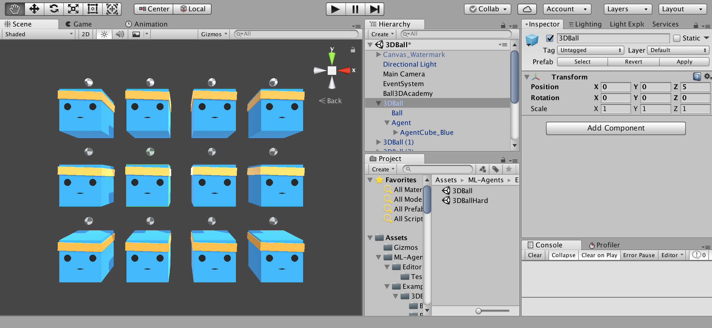
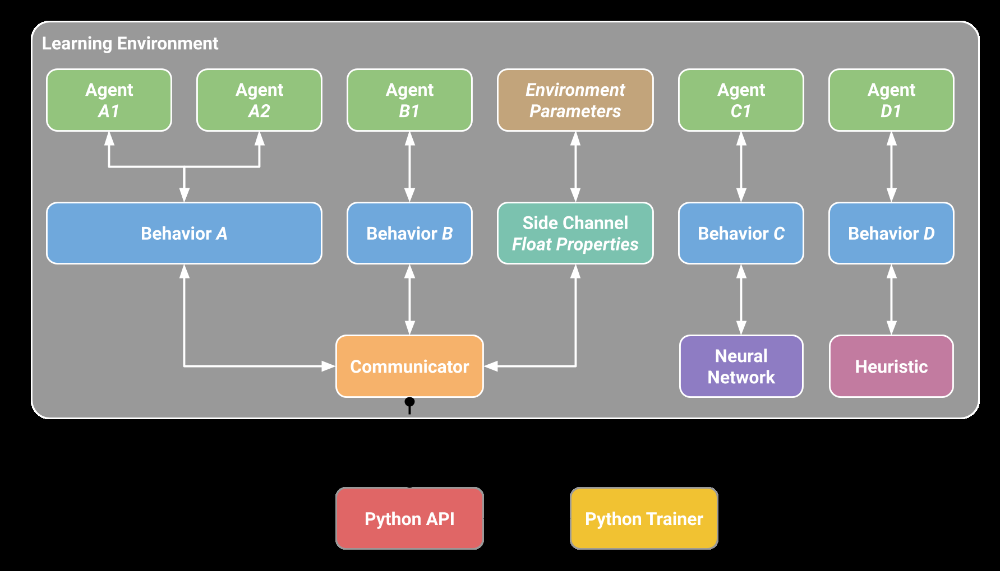
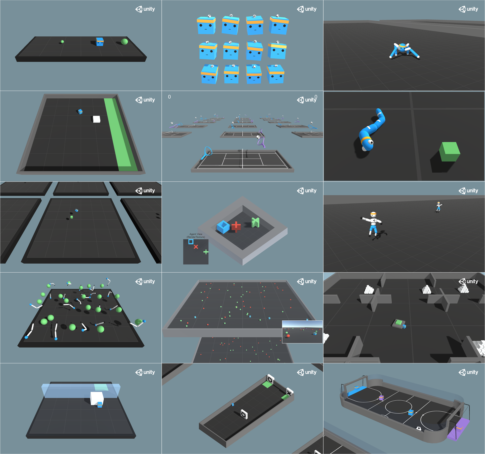
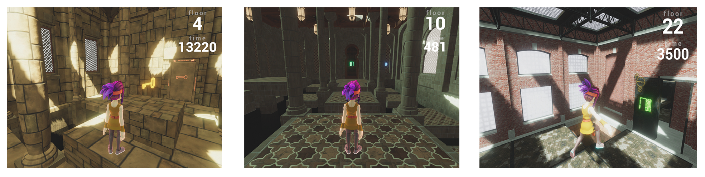

|                |         | Unity: | A General | Platform | for Intelligent |                           | Agents                  |
| -------------- | ------- | ------ | --------- | -------- | --------------- | ------------------------- | ----------------------- |
|                | Unity:  | A      | General   | Platform | for Intelligent |                           | Agents                  |
| Arthur         | Juliani |        |           |          |                 |                           | arthurj@unity3d.com     |
| Vincent-Pierre |         | Berges |           |          |                 | vincentpierre@unity3d.com |                         |
| Ervin          | Teng    |        |           |          |                 |                           | ervin@unity3d.com       |
| Andrew         | Cohen   |        |           |          |                 | andrew.cohen@unity3d.com  |                         |
| Jonathan       | Harper  |        |           |          |                 |                           | jharper@unity3d.com     |
| Chris          | Elion   |        |           |          |                 |                           | chris.elion@unity3d.com |
0202 yaM 6  ]GL.sc[  2v72620.9081:viXra
christopherg@unity3d.com
Chris Goy
| Yuan   | Gao   |     |     |     |     |     | vincentg@unity3d.com |
| ------ | ----- | --- | --- | --- | --- | --- | -------------------- |
| Hunter | Henry |     |     |     |     |     | brandonh@unity3d.com |
marwan@unity3d.com
| Marwan | Mattar |     |     |     |     |     |                    |
| ------ | ------ | --- | --- | --- | --- | --- | ------------------ |
| Danny  | Lange  |     |     |     |     |     | dlange@unity3d.com |
Unity Technologies
| San Francisco, |     | CA 94103 | USA |     |     |     |     |
| -------------- | --- | -------- | --- | --- | --- | --- | --- |
Abstract
Recentadvancesinartificialintelligencehavebeendrivenbythepresenceofincreasingly
realistic and complex simulated environments. However, many of the existing environments
provide either unrealistic visuals, inaccurate physics, low task complexity, restricted agent
perspective, or a limited capacity for interaction among artificial agents. Furthermore,
many platforms lack the ability to flexibly configure the simulation, making the simulated
environment a black-box from the perspective of the learning system. In this work, we
propose a novel taxonomy of existing simulation platforms and discuss the highest level
class of general platforms which enable the development of learning environments that are
richinvisual,physical,task,andsocialcomplexity. Wearguethatmoderngameenginesare
uniquely suited to act as general platforms and as a case study examine the Unity engine
and open source Unity ML-Agents Toolkit1. We then survey the research enabled by Unity
and the Unity ML-Agents Toolkit, discussing the kinds of research a flexible, interactive
| and | easily | configurable | general | platform can | facilitate. |     |     |
| --- | ------ | ------------ | ------- | ------------ | ----------- | --- | --- |
1. Introduction
In recent years, there have been significant advances in the state of deep reinforcement
learning research and algorithm design (Mnih et al., 2015; Schulman et al., 2017; Silver et al.,
2017; Espeholt et al., 2018). Essential to this rapid development has been the presence of
challenging and scalable simulation platforms such as the Arcade Learning Environment
(Bellemare et al., 2013), VizDoom (Kempka et al., 2016), MuJoCo (Todorov et al., 2012),
and many others (Beattie et al., 2016; Johnson et al., 2016; Coumans and Bai, 2016). The
Arcade Learning Environment (ALE), for example, was essential for providing a means
of benchmarking the control-from-pixels approach of the Deep Q-Network (Mnih et al.,
2013). Similarly, other environments and platforms have helped motivate research into more
efficient and powerful algorithms (Oh et al., 2016; Andrychowicz et al., 2017). The simulation
1. https://github.com/Unity-Technologies/ml-agents
1

Juliani, Berges, Teng, Cohen, Harper, Elion, Goy, Gao, Henry, Mattar, & Lange
environment is the fundamental way in which the reinforcement learning community tests its
ideasandalgorithms. Thus, thequality of environmentsisofcriticalimportance. Surprisingly,
the general discussion around this integral component is underdeveloped compared to its
algorithmic counterpart.
Many of the current research platforms are based on popular video games or game engines
such as Atari 2600, Quake III, Doom, and Minecraft. This is part of a much longer-term
trend in which games have served as a platform for artificial intelligence (AI) research. This
trend can be traced back to the earliest work in AI around playing games such as chess and
checkers (Shannon, 1950; Samuel, 1959), or later work applying reinforcement learning to the
game of Backgammon (Tesauro, 1995). The necessary search, decision-making and planning
which make video games engaging challenges for humans are also the same challenges which
interest AI researchers (Laird and VanLent, 2001). This insight has motivated a wide range
of research into the intersection of video games and AI from the diverse perspectives of game
playing, player modeling, and content generation (Yannakakis and Togelius, 2018).
As deep reinforcement learning algorithms becomes more sophisticated, existing envi-
ronments and the benchmarks based on them become less informative. For example, most
environments in the ALE have been solved to above human-level performance, making the
continued use of the benchmark less valuable (Machado et al., 2017; Puigdomènech Badia
et al., 2020). A complementary point created by this state of algorithmic progress is that
there exists a virtuous circle in which the development of novel environments drives the
development of novel algorithms. We can expect the research community to continue to
provide high-quality algorithms. However, it is unclear from where researchers should expect
high-quality environments, since the creation of such environments is often time-intensive
and requires specialized domain knowledge. This continual need for novel environments
necessitates an easy-to-use, flexible and universal platform for unrestricted environment
creation.
Simulated environments are constrained by the limitations of the simulators themselves.
Simulators are not equal in their ability to provide meaningful challenges to learning systems.
Furthermore, it is sometimes not obvious which properties of an environment make it a
worthwhile benchmark for research. The complexity of the physical world is a primary
candidate for challenging the current as well as to-be-developed algorithms. It is in the
physical world where mammalian and, more specifically, human intelligence developed, and
it is this kind of intelligence which researchers are often interested in replicating (Lake et al.,
2017).
Modern game engines are powerful tools for the simulation of visually realistic worlds
with sophisticated physics and complex interactions between agents with varying capacities.
Additionally, engines designed for game development provide user interfaces which are
specifically engineered to be intuitive, easy to use, interactive, and available across many
platforms. Thus, in this paper we argue that game engines are perfectly poised to yield the
necessary challenges for the foreseeable future of AI research. For the community, this would
provide the ability to test algorithms in domains with as much depth and diversity as today’s
video games.
The contributions of this work are:
2

Unity: A General Platform for Intelligent Agents
• A novel taxonomy of existing platforms used for research which classifies platforms
in terms of their potential for complexity along the dimensions of sensory, physical,
task-logic and social.
• A detailed analysis of the Unity game engine and the Unity ML-Agents Toolkit as an
instance of a general platform, the highest level of the proposed taxonomy.
• A survey of current research conducted using Unity and critical areas in which progress
is hindered by the current platforms but can be facilitated by a general platform such
as Unity.
This paper is structured as follows: We begin with an analysis of the properties of
a simulator important for the development of learning algorithms. Then, we propose a
taxonomy of simulation platforms which we use to organize popular reinforcement learning
(RL) benchmarks and further point out their limitations at fully realizing all desirable
properties of a simulator. We then present the Unity engine and Unity ML-Agents Toolkit a
general platform and discuss the extent to which it possesses the desired characteristics for
enabling research. We next outline the architecture, functionality and tools provided by the
open source Unity ML-Agents Toolkit which enable the deployment of learning algorithms
within Unity environments and provide a set of benchmark results on example learning
environments. Weconcludebyproposingfutureavenuesofresearchwebelievewillbeenabled
by using a flexible game engine versus standard black box environments.
2. Anatomy of Environments and Simulators
Inthissection, wedetailsomeofthecharacteristicsofenvironmentsandsimulatorswebelieve
are needed to advance the state of the field in AI research. We use the term environment
to refer to the space in which an artificial agent acts and simulator to refer to the platform
which computes the environment.
2.1 Environment Properties
As algorithms are able to solve increasingly difficult tasks, the complexity of the environments
themselves must increase in order to continue to provide meaningful challenges. The specific
axes of environmental complexity we believe are essential are sensory, physical, task logic,
and social. In this subsection, we outline the role each of these play in the state of the art in
AI.
Sensory Complexity - The recent advances in deep learning have largely been driven
by the ability of neural networks to process large amounts of visual, auditory, and text-based
data (LeCun et al., 2015). ImageNet, a large database of natural images with associated
labels, was essential in enabling models such as ResNet (He et al., 2016), and Inception
(Szegedy et al., 2016) to be trained to near human-level object-recognition performance
(Russakovsky et al., 2015). While ImageNet was mainly used for static image recognition
tasks, its key component of visual complexity is necessary for many real-world decision-
making problems, such as self-driving cars, household robots, and unmanned autonomous
vehicles (Zhu et al., 2017). Additionally, advances in computer vision algorithms, specifically
3

Juliani, Berges, Teng, Cohen, Harper, Elion, Goy, Gao, Henry, Mattar, & Lange
around convolutional neural networks, were the motivation for the pixel-to-control approach
eventually found in the Deep-Q network (Mnih et al., 2015).
Physical Complexity - Many of the applied tasks researchers are interested in solving
with AI involve not only rich sensory information, but a rich control scheme in which
agents can interact with their dynamic environments in complex ways (Bicchi and Kumar,
2000; Levine et al., 2016). The need for complex interaction often comes with the need for
environments which replicate the physical properties of the target domain, typically the real
world. This realism is essential to problems where the goal is to transfer a policy learned
within a simulator to the real world, as would be the case for most robotics applications
(Rusu et al., 2016; Tobin et al., 2017; Andrychowicz et al., 2018).
Task Logic Complexity - A third axis is the complexity of the tasks defined within
the environment. The game of Go, for example, which has long served as a test-bed for AI
research, contains neither complex visuals nor complex physical interactions. Rather, the
complexity comes from the large search space of possibilities open to the agent at any given
time, and the difficulty in evaluating the value of a given board configuration (Müller, 2002;
Silver et al., 2017). Meaningful simulation platforms should enable designers to naturally
create such problems for the learning agents within them. These complex tasks might
display hierarchical structure, a hallmark of human intelligence (Botvinick, 2008), or vary
from instance to instance, thus requiring meta-learning or generalization to solve (Wang
et al., 2016). The tasks may also be presented in a sequential manner, where independent
sampling from a fixed distribution is not possible. This is often the case for human task
acquisition in the real world, and the ability to learn new tasks over time is seen as a
key-component of continual learning (Ring, 1994), and ultimately systems capable of artificial
general intelligence (Schmidhuber, 2015; Schmidhuber, 2018).
Social Complexity - The acquisition of complex skills via learning in mammals is
believed to have evolved hand-in-hand with their ability to hold relationships within their
social groups (Arbib et al., 2008). At least one strong example of this exists within the
human species, with language primarily being the development of a tool for communication
in a social setting. As such, the development of social behavior among groups of agents is of
particular interest to many researchers in the field of AI. There are also classes of complex
behavior which can only be carried out at the population level, such as the coordination
needed to build modern cities (Baker et al., 2019). Additionally, the ability for multiple
species to interact with one another is a hallmark of the development of ecosystems in the
world, and would be desirable to simulate as well. A simulation platform designed to allow
the study of communication and social behavior should then provide a robust multi-agent
framework which enables interaction between agents of both the same population as well as
interaction between groups of agents drawn from separate distributions.
2.2 Simulation Properties
In addition to the properties above, there are practical constraints imposed by the simulator
itself which must be taken into consideration when designing environments for experimenta-
tion. Specifically, simulated environments must be flexibly controlled by the researcher and
must run in a fast and distributed manner in order to provide the iteration time required for
experimental research.
4

Unity: A General Platform for Intelligent Agents
Fast & Distributed Simulation - Depending on the sample efficiency of the method
used, modern machine learning algorithms often require up to billions of samples in order to
converge to an optimal solution (Espeholt et al., 2018; Puigdomènech Badia et al., 2020).
As such, the ability to collect that data as quickly as possible is paramount. One of the
most appealing properties of a simulation is the ability for it to be run at a speed often
orders of magnitude greater than that of the physical world. In addition to this increase in
speed, simulations can often be run in parallel, allowing for orders of magnitude greater data
collection than real-time serial experience in the physical world. The faster such algorithms
can be trained, the greater the speed of iteration and experimentation that can take place,
leading to faster development of novel methods.
Flexible Control - A simulator must also allow the researcher or developer a flexible
level of control over the configuration of the simulation itself, both during development and
at runtime. While treating the simulation as a black-box has been sufficient for certain
advances in recent years (Mnih et al., 2015), in many cases it also inhibits use of a number of
advanced machine learning approaches in which more dynamic feedback between the training
process and the agents is essential. Curriculum learning (Bengio et al., 2009), for example,
entails initially providing a simplified version of a task to an agent, and slowly increasing
the task complexity as the agent’s performance increases (Bengio et al., 2009). This method
was used to achieve near human-level performance in a recent VizDoom competition (Wu
and Tian, 2017). Such approaches are predicated on the assumption that the user has the
capacity to alter the simulation to create such curricula in the first place. Additionally,
domain randomization (Tobin et al., 2017) involves introducing enough variability into the
simulation so that the models learned within the simulation can generalize to the real world.
This often works by ensuring that the data distribution of the real world is covered within
all of the variations presented within the simulation (Tobin et al., 2017). This variation is
especially important if the agent depends on visual properties of the environment to perform
its task. It is often the case that without domain randomization, models trained in simulation
suffer from a “reality gap” and perform poorly. Concretely, performing domain randomization
often involves dynamically manipulating textures, lighting, physics, and object placement
within a scene.
3. A Survey of Existing Simulators
When surveying the landscape of simulators, environments, and platforms, we find that there
exist four categories into which these items can be organized.
(1) The first is Environment which consists of single, fixed environments that act as
black-boxes from the perspective of the agent. Examples of these include the canonical
CartPole or MountainCar tasks (Sutton and Barto, 2018), a single game from the ALE, such
as Pitfall! (Bellemare et al., 2013), CoinRun (Cobbe et al., 2019b), and the Obstacle Tower
environment (Juliani et al., 2019).
(2) The second is Environment Suite. These consist of sets of environments packaged
together and are typically used to benchmark the performance of an algorithm or method
along some dimensions of interest. In most cases these environments all share the same or
similar observation and action spaces, and require similar, but not necessarily identical skills
to solve. Examples of this include the ALE (Bellemare et al., 2013), DMLab-30 (Espeholt
5

Juliani, Berges, Teng, Cohen, Harper, Elion, Goy, Gao, Henry, Mattar, & Lange
et al., 2018), the Hard Eight (Gulcehre et al., 2019), AI2Thor (Kolve et al., 2017), OpenAI
Retro (Nichol et al., 2018), DMControl (Tassa et al., 2018b), and ProcGen (Cobbe et al.,
2019a).
(3) The third category is Domain-specific Platform. This describes platforms which allow
the creation of sets of tasks within a specific domain such as locomotion or first-person
navigation. These platforms are distinguished from the final category by their narrow focus
in environments types. This can include limitations to the perspective the agent can take, the
physical properties of the environment, or the nature of the interactions and tasks possible
within the environment. Examples of this category include Project Malmo (Johnson et al.,
2016), VizDoom (Kempka et al., 2016), Habitat (Savva et al., 2019), DeepMind Lab (Beattie
et al., 2016), PyBullet (Coumans and Bai, 2016) and GVGAI (Perez-Liebana et al., 2016).
(4) The fourth and final category is the General Platform whose members are capable
of creating environments with arbitrarily complex visuals, physical and social interactions,
and tasks. The set of environments that can be created by platforms in this category is a
super-set of those that can be created by or are contained within the other three categories.
In principle, members of these categories can be used to define any AI research environment
of potential interest. We find that modern video game engines represent a strong candidate
for this category. In particular, we propose the Unity engine along with a toolkit for AI
interactions such as ML-Agents as an example of this category. Note that other game engines
such as the Unreal engine could serve as general platforms for AI research. The important
missing element however is the set of useful abstractions and interfaces for conducting AI
research, something present in all examples listed here, but not inherently part of any given
game engine or programming language. See Table 1 for a representative set of examples of
| the | environments | and | platforms | within | this taxonomy. |     |     |
| --- | ------------ | --- | --------- | ------ | -------------- | --- | --- |
Single Env Env Suite Domain-Specific Platform General Platform
|          | Cart Pole |           | ALE   |     | MuJoCo   |       | Unity & ML-Agents |
| -------- | --------- | --------- | ----- | --- | -------- | ----- | ----------------- |
| Mountain | Car       | DMLab-30  |       |     | DeepMind | Lab   |                   |
| Obstacle | Tower     | Hard      | Eight |     | Project  | Malmo |                   |
|          | Pitfall!  | AI2Thor   |       |     | VizDoom  |       |                   |
|          | CoinRun   | OpenAI    | Retro |     | GVGAI    |       |                   |
|          | Ant       | DMControl |       |     | PyBullet |       |                   |
ProcGen
Table 1: Taxonomy of simulators based on flexibility of environment specification. Includes
| a subset | of examples |            | for illustrative | purposes. |     |     |     |
| -------- | ----------- | ---------- | ---------------- | --------- | --- | --- | --- |
| 3.1      | Common      | Simulators |                  |           |     |     |     |
In recent years, there have been a number of simulation platforms developed for the purpose
of providing challenges and benchmarks for deep reinforcement learning algorithms. Many of
these platforms are based on existing games or game engines and carry with them specific
strengths and weaknesses. While not exhaustive of all currently available platforms, below
we survey a few of the simulators described in the previous section, taking examples from
| the | middle two | categories. |     |     |     |     |     |
| --- | ---------- | ----------- | --- | --- | --- | --- | --- |
6

Unity: A General Platform for Intelligent Agents
3.1.1 Arcade Learning Environment
The release of the Arcade Learning Environment (ALE) contributed to much of the recent
resurgence of interest in reinforcement learning. This was thanks to the development of the
Deep Q-Network, which was able to achieve superhuman level performance on dozens of
emulated Atari console games within the ALE by learning only from pixel inputs (Mnih et al.,
2015). The ALE provides a Python interface for launching and controlling simulations of a
few dozen Atari 2600 games. As such, the ALE falls into the category of environment suite.
Whenconsideringthesimulationcriteriadescribedabove, theALEprovidesvisualcomplexity
through pixel-based rendering, task-logic complexity in the form of hierarchical problems
within some games such as Montezuma’s Revenge, and high-performance simulation with an
emulationabletorunatthousandsofframespersecond(Bellemareetal.,2013). Itsdownsides
include deterministic environments, relatively simple visuals, a lack of realistic physics, single-
agent control, and a lack of flexible control of the simulation configuration. In general, once
an environment that is part of the ALE is launched, it is immutable and a complete black
box from the perspective of the agent. Furthermore, all of the environments provided in the
ALE have been solved with greater than human performance (Puigdomènech Badia et al.,
2020). As such, there is little room for meaningful improvement over the state of the art
with the exception of the domain of few-shot learning. This is apparent in the fact that even
Agent57, the current state of the art algorithm takes orders of magnitude more training time
than humans on a large number of the environments in the ALE.
3.1.2 DeepMind Lab
Built from the Quake III game engine, DeepMind Lab (Lab) was released in 2016 as the
external version of the research platform used by DeepMind (Beattie et al., 2016). Designed
in the wake of public adoption of the ALE, Lab contains a number of features designed to
address the other platform’s shortcomings. By using a 3D game-engine, complex navigation
tasks similar to those studied in robotics and animal psychology could be created and studied
within Lab (Leibo et al., 2018). The ability to create a set of specific kinds of tasks makes
DeepMind Lab a domain-specific platform. The platform contains primitive physics enabling
a level of prediction about the quality of the world and allows researchers to define their
own environmental variations. Additionally, it allows for basic multi-agent interactions using
language (Espeholt et al., 2018). The limitations of this platform, however, are largely tied
to the dated nature of the underlying rendering and physics engine, which was built using
decades-old technology. As such, the gap in quality between the physical world and the
simulation provided via Lab is relatively large. Furthermore, the engine was also designed to
enable first-person shooter games and so the environments built using Lab are limited to
agents with a first-person perspective.
3.1.3 Project Malmo
Another popular simulation platform is Project Malmo (Malmo) (Johnson et al., 2016).
Based on the exploration and building game Minecraft, the platform provides a large
amount of flexibility in defining scenarios and environment types making it a domain-specific
platform. As a result, there have been a number of research projects exploring multi-agent
communication, hierarchical control, and planning using the platform (Oh et al., 2016; Shu
7

Juliani, Berges, Teng, Cohen, Harper, Elion, Goy, Gao, Henry, Mattar, & Lange
et al., 2017; Tessler et al., 2017). The limitations of the platform, however, are bound
tightly with the underlying limitations of the Minecraft engine itself. Due to the low-polygon
pixelated visuals, as well as the rudimentary physics system, Minecraft lacks both the visual
as well as the physical complexity that is desirable from a modern platform. The platform is
also limited to describing scenarios which are only possible within the logic of Minecraft.
3.1.4 Physics Simulators
The MuJoCo physics engine has become a popular simulation platform for benchmarking
model-free continuous control tasks, thanks to a set of standard tasks built on top of MuJoCo,
providedwithOpenAIGymandtheDeepMindControlSuite(Todorovetal.,2012; Brockman
et al., 2016; Tassa et al., 2018a). High quality physics simulation combined with a number of
standardized benchmarks has led to the platform being the primary choice for researchers
interested in examining the performance of continuous control algorithms. The nature of the
MuJoCo engine, however, poses limitations for more general AI research. The first is around
the limited visual rendering capabilities of the engine, preventing the use of complex lighting,
textures, and shaders. The second is the restrictions of the physics engine itself and that
MuJoCo models are compiled which makes more difficult the creation of dynamic “game-like”
environments, where many different objects would be instantiated and destroyed in real-time
during simulation. More dynamic environments are often necessary to pose tasks which
require greater planning or coordination to solve. The PyBullet physics engine has also been
used as a platform to study deep reinforcement learning algorithms as well as sim-to-real
(Coumans and Bai, 2016; Tan et al., 2018). Similar to MuJoCo, the PyBullet simulator lacks
the ability to provide high-fidelity visuals, and the nature of the physics engine limits the
scope of possible tasks to be defined.
3.1.5 VizDoom
Based on the game Doom, VizDoom provides researchers with the ability to create tasks
which involve first-person navigation and control (Kempka et al., 2016). Through a 2017 AI
deathmatch competition, the platform enabled the development of a number of compelling
approaches to Deep Reinforcement Learning, including utilizing learning curricula (Wu and
Tian, 2017), novel algorithm design (Dosovitskiy and Koltun, 2016), and memory systems
(Lample and Chaplot, 2017). Like DeepMind Lab, the platform is mainly restricted by the
underlying game engine, which was built for a decades-old first-person shooter game. As such,
the visual and physical complexity possible in the environments created using VizDoom are
relatively limited. It also is restricted to simulating artificial agents with only a first-person
perspective.
4. The Unity Platform
Unity is a real-time 3D development platform that consists of a rendering and physics
engine as well as a graphical user interface called the Unity Editor. Unity has received
widespread adoption in the gaming, AEC (Architecture, Engineering, Construction), auto,
and film industries and is used by a large community of game developers to make a variety of
8

Unity: A General Platform for Intelligent Agents
interactive simulations, ranging from small mobile and browser-based games to high-budget
console games and AR/VR experiences.
Unity’s historical focus on developing a general-purpose engine to support a variety of
platforms, developer experience levels, and game types makes the Unity engine an ideal
candidatesimulationplatformforAIresearch. Theflexibilityoftheunderlyingengineenables
the creation of tasks ranging from simple 2D gridworld problems to complex 3D strategy
games, physics-based puzzles, or multi-agent competitive games possible. Unlike many of the
research platforms discussed above, the underlying engine is not restricted to any specific
genre of gameplay or simulation, making Unity a general platform. Furthermore, the Unity
Editor enables rapid prototyping and development of games and simulated environments.
A Unity Project consists of a collection of Assets. These typically correspond to files
within the Project. Scenes are a special type of Asset which define the environment or level
of a Project. Scenes contain a definition of a hierarchical composition of GameObjects, which
correspond to the actual objects (either physical or purely logical) within the environment.
The behavior and function of each GameObject is determined by the components attached
to it. There are a variety of built-in components provided with the Unity Editor, including
Cameras, Meshes, Renderers, RigidBodies, and many others. It is also possible to define
custom components using C# scripts or external plugins.
4.1 Engine Properties
This section examines the properties of the Unity engine from the perspectives described
in Section 2. We demonstrate that Unity enables the complexity necessary along the key
dimensions of environment properties for the creation of challenging learning environments.
4.1.1 Environment Properties
Sensory Complexity - The Unity engine enables high-fidelity graphical rendering. It
supports pre-baked as well as real-time lighting and the ability to define custom shaders,
either programmatically or via a visual scripting language. As such, it is possible to quickly
render near-photorealistic imagery to be used as training data for a machine learning model.
It is also possible to render depth information, object masks, infrared, or images with noise
injected into it through the use of custom shaders. Furthermore, the engine provides a means
of defining audio signals which can serve as potential additional observational information to
learning agents, as well as ray-cast based detection systems which can simulate Lidar.
Physical Complexity - Physical phenomena in Unity environments can be simulated with
either the Nvidia PhysX or Havok Physics engines. This enables research in environments
with simulated rigid body, soft body, particle, and fluid dynamics as well as ragdoll physics.
Furthermore, the extensible nature of the platform enables the use of additional 3rd party
physics engines if desired. For example, there are plugins available for Unity which provide
both the Bullet and MuJoCo physics engines as alternatives to PhysX 2.
Task Logic Complexity-TheUnityEngineprovidesarichandflexiblescriptingsystemvia
C#. This system enables any form of gameplay or simulation to be defined and dynamically
controlled. In addition to the scripting language, the GameObject and component system
2. https://assetstore.unity.com/packages/tools/physics/bullet-physics-for-unity-62991; http:
//www.mujoco.org/book/unity.html
9

Juliani, Berges, Teng, Cohen, Harper, Elion, Goy, Gao, Henry, Mattar, & Lange
enables managing multiple instances of agents, policies, and environments, making it possible
to define complex hierarchical tasks, or tasks which would require meta-learning to solve.
Social Complexity - The nature of the Unity scripting language and component system
makes the posing of multi-agent scenarios simple and straightforward. Indeed, because the
platform was designed to support the development of multi-player video games, a number of
useful abstractions are already provided out of the box, such as the Multiplayer Networking
system3.
4.1.2 Simulation Properties
Fast & Distributed Simulation - The physics and frame rendering of the Unity engine
take place asynchronously. As such, it is possible to greatly increase the speed of the
underlying simulation without the need to increase the frame rate of the rendering process.
It is also possible to run Unity simulations without rendering if it is not critical to the
simulation. In scenarios where rendering is desirable, such as learning from pixels, it is
possible to control the frame rate and speed of game logic. Extensive control of the rendering
quality also makes it possible to greatly increase the frame rate when desired. The added
capabilities of the Unity engine do add additional overhead when attempting to simulate in
a large-scale distributed fashion. The memory footprint of a Unity simulation is also larger
than that of environments from other platforms such as an Atari game in the ALE.
Flexible Control - It is possible to control most aspects of the simulation programmatically,
enabling researchers to define curricula, adversarial scenarios, or other complex methods of
changing the learning environment during the training process. For example, GameObjects
can be conditionally created and destroyed in real-time. In Section 5, we discuss ways in
which further control of the simulation is made possible via exposed simulation parameters
and a Python API.
4.2 Unity Editor and Services
The Unity Editor (Figure 1) is a graphical user interface used to create the content for 2D,
3D and AR / VR experiences. It is available on Windows, Mac and Linux.
The Unity Editor and its services provide additional benefits for AI research:
1. Create custom Scenes - Unity provides a large number of guides and tutorials on how to
create Scenes within the Editor. This enables developers to quickly experiment with new
environments of varying complexities, or novel tasks. Furthermore, an online asset store
which contains tens of thousands of free and paid assets provides users access to a huge
diversity of pre-built entities for their scene.
2. Record local, expert demonstrations -TheUnityEditorincludesaPlaymodewhichenables
a developer to begin a simulation and control one or more of the agents in the Scene via
a keyboard or game controller. This can be used for generating expert demonstrations to
train and evaluate imitation learning (IL) algorithms.
3. Record large-scale demonstrations - One the most powerful features of the Unity Editor is
the ability to build a Scene to run on more than 20 platforms ranging from wearables to
3. https://unity3d.com/learn/tutorials/s/multiplayer-networking
10

|     | Unity: A | General Platform | for Intelligent | Agents    |
| --- | -------- | ---------------- | --------------- | --------- |
|     | Figure   | 1: The Unity     | Editor window   | on macOS. |
mobile and consoles. This enables developers to distribute their Scenes to a large number
of devices (either privately or publicly through stores such as the Apple App Store or
Google Play). This can facilitate recording expert demonstrations from a large number of
experts or measuring human-level performance from a user (or player) population.
| 5. The Unity | ML-Agents | Toolkit |     |     |
| ------------ | --------- | ------- | --- | --- |
Toolkit4
The Unity ML-Agents is an open source project which enables researchers and
developers to create simulated environments using the Unity Editor and interact with them
via a Python API. The toolkit provides the ML-Agents SDK which contains all functionality
necessary to define environments within the Unity Editor along with the core C# scripts to
| build a learning | pipeline. |     |     |     |
| ---------------- | --------- | --- | --- | --- |
The features of the toolkit include a set of example environments, state of the art RL
algorithms Soft Actor-Critic (SAC) (Haarnoja et al., 2018) and Proximal Policy Optimization
(PPO) (Schulman et al., 2017), the IL algorithms Generative Adversarial Imitation Learning
(GAIL) (Ho and Ermon, 2016) and Behavioral Cloning (BC) (Hussein et al., 2017), support
for Self-Play (Baker et al., 2019; Bansal et al., 2017) in both symmetric and asymmetric
games, as well as the option to extend algorithms and policies with the Intrinsic Curiosity
Module (ICM) (Pathak et al., 2017) and Long-Short-Term Cell (LSTM) (Hochreiter and
Schmidhuber, 1997), respectively. As the platform grows, we intend to provide additional
algorithms and model types. In what follows, we outline the key components of the toolkit as
well as provide benchmark results with SAC and PPO on the Unity example environments.
| 4. This describes | version 1.0; | the most recent release | at the time | of writing. |
| ----------------- | ------------ | ----------------------- | ----------- | ----------- |
11

Juliani, Berges, Teng, Cohen, Harper, Elion, Goy, Gao, Henry, Mattar, & Lange
Figure 2: A Learning Environment (as of version 1.0) created using the Unity Editor contains
AgentsandanAcademy. TheAgentsareresponsibleforcollectingobservationsandexecuting
actions. The Academy is responsible for global coordination of the environment simulation.
5.1 ML-Agents SDK
The three core entities in the ML-Agents SDK are Sensors, Agents, and an Academy. The
Agent component is used to directly indicate that a GameObject within a scene is an Agent,
and can thus collect observations, take actions, and receive rewards. The agent can collect
observationsusingavarietyofpossiblesensorscorrespondingtodifferentformsofinformation
such as rendered images, ray-cast results, or arbitrary length vectors. Each Agent component
contains a policy labeled with a behavior name.
Any number of agents can have a policy with the same behavior name. These agents will
execute the same policy and share experience data during training. Additionally, there can
be any number of behavior names for policies within a scene enabling simple construction of
multi-agent scenarios with groups or individual agents executing many different behavior
types. A policy can reference various decision-making mechanisms including player input,
hard-coded scripts, internally embedded neural network models, or via interaction through
the Python API. It is possible for agents to ask for decisions from policies either at a fixed
or dynamic interval, as defined by the developer of the environment.
The reward function, used to provide a learning signal to the agent, can be defined or
modified at any time during the simulation using the Unity scripting system. Likewise,
simulation can be placed into a done state either at the level of an individual agent or
the environment as a whole. This happens either via a Unity script call or by reaching a
predefined max step count.
The Academy is a singleton within the simulation, and is used to keep track of the steps
of the simulation and manage the agents. The Academy also contains the ability to define
environmentparameters, whichcanbeusedtochangetheconfigurationoftheenvironmentat
runtime. Specifically, aspects of environmental physics and textures, sizes and the existence
of GameObjects are controlled via exposed parameters which can be re-sampled and altered
12

|     |     | Unity: | A General | Platform |     | for | Intelligent | Agents |     |
| --- | --- | ------ | --------- | -------- | --- | --- | ----------- | ------ | --- |
throughout training. For example, the gravity in the environment can fluctuate every fixed
interval or additional obstacles can spawn when an agent reaches a certain proficiency. This
enables evaluation of an agent on a train/test split of environment variations and facilitates
| the | creation | of curriculum | learning | scenarios |     | (Bengio | et al., 2009). |     |     |
| --- | -------- | ------------- | -------- | --------- | --- | ------- | -------------- | --- | --- |
| 5.2 | Python   | Package       |          |           |     |         |                |     |     |
The provided Python package5 contains a class called UnityEnvironment that can be used
to launch and interface with Unity executables (as well as the Editor) which contain the
required components described above. Communication between Python and Unity takes
place via a gRPC communication protocol, and utilizes protobuf messages.
We also provide a set of wrapper APIs, which can be used to communicate with and
control Unity learning environments through the standard gym interface used by many
researchers and algorithm developers (Brockman et al., 2016). These gym wrappers enable
researchers to more easily swap in Unity environments to an existing reinforcement learning
| system | already     | designed | around | the gym | interface. |     |     |     |     |
| ------ | ----------- | -------- | ------ | ------- | ---------- | --- | --- | --- | --- |
| 5.3    | Performance | Metrics  |        |         |            |     |     |     |     |
It is essential that an environment be able to provide greater than real-time simulation speed.
It is possible to increase Unity ML-Agents simulations up to one hundred times real-time.
The possible speed increase in practice, however, will vary based on the computational
resources available, as well as the complexity of the environment. In the Unity Engine, game
logic, including physics, can be run independently from the rendering of frames. As such,
environments which do not rely on visual observations, such as those that use ray-casts for
example, can benefit from simulation at speeds greater than those that do. See Table 2 for
performance metrics when controlling environments from the Python API.
|     | Environment |                | Observation |                 | Type | #   | Agents | Mean (ms) | Std (ms) |
| --- | ----------- | -------------- | ----------- | --------------- | ---- | --- | ------ | --------- | -------- |
|     |             | Basic          |             | Vector(1)       |      |     | 1      | 0.803     | 0.005    |
|     |             | 3D Ball        |             | Vector(8)       |      |     | 12     | 5.05      | 0.039    |
|     | GridWorld   |                |             | Visual(84x84x3) |      |     | 1      | 2.04      | 0.038    |
|     | Visual      | Food Collector |             | Visual(84x84x3) |      |     | 4      | 9.23      | 0.556    |
Table 2: Performance benchmark when using the Python API to control a Learning Environ-
ment from the same machine by calling env.step(). Mean and standard deviation in time
| averaged |         | over 1000 simulation |     | steps. |     |     |     |     |     |
| -------- | ------- | -------------------- | --- | ------ | --- | --- | --- | --- | --- |
| 5.4      | Example | Environments         |     |        |     |     |     |     |     |
The Unity ML-Agents Toolkit contains a number of example environments in addition to
the core functionality. These environments are designed to both be usable for benchmarking
RL and IL algorithms as well as templates to develop novel environments and tasks. These
environments contain examples of single and multi-agent scenarios, with agents using either
5. https://pypi.org/project/mlagents/
13

Juliani, Berges, Teng, Cohen, Harper, Elion, Goy, Gao, Henry, Mattar, & Lange
vector or visual observations, taking either discrete or continuous actions, and receiving
either dense or sparse rewards. See Figure 3 for images of the included example environments
and below for environment descriptions.
Figure 3: Images of the fourteen included example environments as of the v0.11 release of
the Unity ML-Agents Toolkit. From Left-to-right, up-to-down: (a) Basic, (b) 3DBall, (c)
Crawler, (d) Push Block, (e) Tennis, (f) Worm, (g) Bouncer, (h) Grid World, (i) Walker, (j)
Reacher, (k) Food Collector, (l) Pyramids, (m) Wall Jump, (n) Hallway, (o) Soccer Twos.
(a) Basic - A linear movement task where the agent (blue cube) must move left or right to
rewarding states. The goal is to move to the most rewarding state.
(b) 3D Ball - A balance-ball task where the agent controls the rotation of the platform. The
goal is to balance the platform in order to keep the ball on it for as long as possible.
14

Unity: A General Platform for Intelligent Agents
(c) Crawler - Physics-based creatures with 4 arms and 4 forearms. The goal is to move
toward the goal direction as quickly as possible without falling.
(d) Push Block - A platforming environment where the agent can push a block around. The
goal is to push the block to the target area (black white grid).
(e) Tennis - Two-player game where agents control rackets to bounce ball over a net. The
goal is to bounce ball to the other side instead of dropping the ball or sending ball out of
bounds.
(f) Worm - A physics-based three joint locomotion agent which must move toward a goal
location as quickly as possible.
(g) Bouncer - A bouncing task where the agent (blue cube) can jump with a certain speed
and angle when it touches the ground. The goal is to catch the floating food object with
as few jumps as possible.
(h) Grid World - A version of the classic grid-world task. Scene contains agent (blue square),
target, and obstacles. The goal is to navigate to the target while avoiding the obstacles.
(i) Walker - Physics-based humanoids with 26 degrees of freedom of its body-parts. The goal
is to move toward the goal direction as quickly as possible without falling.
(j) Reacher - Double-jointed arm which can move to target locations. The goal is to move its
hand to the target location (green sphere), and keep it there.
(k) Food Collector - A multi-agent environment where agents (blue cube) compete to collect
bananas. The goal is to move to as many yellow bananas as possible while avoiding blue
bananas.
(l) Pyramids - Environment where the agent (blue cube) needs to press a button to spawn a
pyramid, then navigate to the pyramid, knock it over, and move to the gold brick at the
top. The goal is to move to the golden brick on top of the spawned pyramid.
(m) Wall Jump - A platforming environment with a wall and a yellow block that can be
pushed around, and an agent (blue cube) that can move, rotate and jump. The goal is to
reach the target (white black grid) on the other side of the wall. If the wall is too high,
the agent sometimes needs to push the white block near the wall, jump onto it to reach
its target. The agent trains two policies—one for big walls (requires the small block) and
one for small walls.
(n) Hallway - Environment where the agent (blue cube) needs to find information in a room,
remember it, and use it to move to the correct target. The goal is to move to the target
(black white grid) which corresponds to the color of the block in the room.
(o) Soccer - Environment where four agents compete in a 2 vs 2 toy soccer game. All agents
are equal and tasked with keeping the ball out of their own goal and scoring in the
opponents.
15

Juliani, Berges, Teng, Cohen, Harper, Elion, Goy, Gao, Henry, Mattar, & Lange
(p) StrikersVsGoalie - A soccer variant with three agents of two different kinds in the
environment; two Strikers and one Goalie. The goal of the Striker agents is to push the
ball into the goal area while the Goalie tries to prevent the ball from entering its own
goal area.
For more information on the specifics of each of the environments, including the observa-
tions, actions, and reward functions, see the GitHub documentation6. Trained model files
as well as hyperparameter specifications for replicating all of our results on the example
environments are provided with the toolkit. See Figures 4 and 5 below for baseline results on
each example environment. These results describe the mean cumulative reward per-episode
| over | five runs using PPO | and SAC (plus | relevant | modifications). |         |         |
| ---- | ------------------- | ------------- | -------- | --------------- | ------- | ------- |
|      | Environment         | PPO           |          | PPO             | SAC     | SAC     |
|      |                     | (mean)        |          | (std)           | (mean)  | (std)   |
|      | 3DBall              | 98.03         |          | 2.95            | 86.36   | 12.08   |
|      | 3DBallHard          | 96.05         |          | 7.91            | 91.36   | 8.91    |
|      | Basic               | 0.94          |          | 0.0             | 0.94    | 0.0     |
|      | Bouncer             | 11.33         |          | 0.07            | 17.84   | 0.27    |
|      | CrawlerDynamic      | 577.51        |          | 25.26           | 479.73  | 131.71  |
|      | CrawlerStatic       | 2816.07       |          | 231.37          | 2042.97 | 1097.81 |
|      | FoodCollector       | 36.6          |          | 8.42            | 46.43   | 7.93    |
|      | GridWorld           | 0.98          |          | 0.0             | 0.98    | 0.0     |
|      | Hallway             | 0.91          |          | 0.03            | 0.53    | 0.76    |
|      | PushBlock           | 4.89          |          | 0.04            | 4.14    | 0.49    |
|      | Pyramids            | 1.79          |          | 0.02            | -1.0    | 0.0     |
|      | Reacher             | 35.28         |          | 4.43            | 39.29   | 0.11    |
|      | Walker              | 2206.41       |          | 165.66          | 567.45  | 129.35  |
|      | BigWallJump         | 0.91          |          | 0.02            | -0.66   | 0.29    |
|      | SmallWallJump       | 0.97          |          | 0.0             | 0.89    | 0.04    |
|      | WormDynamic         | 131.59        |          | 9.08            | 238.89  | 6.2     |
|      | WormStatic          | 152.54        |          | 4.02            | 396.26  | 7.25    |
Table 3: Table of cumulative episodic reward for the various example environments provided
with the Unity ML-Agents Toolkit. Results are averaged over final score on five separate
runs.
| 6. Research | Using | Unity and the | Unity | ML-Agents | Toolkit |     |
| ----------- | ----- | ------------- | ----- | --------- | ------- | --- |
In this section, we survey a collection of results from the literature which use Unity and/or
the Unity ML-Agents Toolkit. The range of environments and algorithms reviewed here
demonstrates the viability of Unity as a general platform. We also discuss the Obstacle Tower
benchmark (Juliani et al., 2019) which serves as an example of the degree of environmental
complexityachievableonUnity. ThecorrespondingObstacleTowercontestposedasignificant
6. https://github.com/Unity-Technologies/ml-agents/blob/master/docs/
Learning-Environment-Examples.md
16

|     | Unity: A General | Platform | for Intelligent | Agents |
| --- | ---------------- | -------- | --------------- | ------ |
Figure 4: Mean cumulative episodic reward (y-axis) over simulation time-steps (in thousands,
x-axis) during training and evaluation. We compare PPO (blue line) and SAC (red line)
performances. Results presented are based on five separate runs, with a 95% confidence
interval. LSTM indicates an LSTM unit is used in the network. ICM indicates the Intrinsic
| Curiosity Module | is used during | training. |     |     |
| ---------------- | -------------- | --------- | --- | --- |
challenge to the research community inspiring a number of creative solutions. We review
the top performing algorithm to show the rallying effect a benchmark like this can have on
| innovation in | the field. |     |     |     |
| ------------- | ---------- | --- | --- | --- |
17

Juliani, Berges, Teng, Cohen, Harper, Elion, Goy, Gao, Henry, Mattar, & Lange
Figure 5: Mean episodic ELO (y-axis) over simulation time-steps (in thousands, x-axis)
during training with Self-Play and PPO. In symmetric environments, the ELO of the learning
policy is plotted (blue line) and in asymmetric environments (blue and red line) the ELO of
both learning policies are plotted. Results presented are based on five separate runs, with a
95% confidence interval.
6.1 Domain-Specific Platforms and Algorithms
The AI2Thor (Kolve et al., 2017) platform provides a set of pre-built indoor scenes which are
rendered using the Unity engine and a Python API for interacting with those environments
using a first-person agent. Using the AI2Thor simulator, researchers demonstrated that
it is possible to transfer a policy learned in simulation to a physical robot to complete
an indoor-navigation task (Zhu et al., 2017). In the same vein, the Chalet platform uses
Unity to provide a set of indoor navigation environments (Yan et al., 2018). Recent work at
OpenAI has also taken advantage of the rendering capabilities of the Unity engine to aid
in the development of a system used to transfer a robotic hand’s grasping policy from a
simulator to a physical robot (Andrychowicz et al., 2018). Unity has also been used to render
a physical intersection in order to aid demonstration-based learning on real-world vehicles
(Behbahani et al., 2019). Finally, a set of benchmarks called “Arena” have been built using
the Unity ML-Agents Toolkit which specifically focuses on multi-agent scenarios (Song et al.,
2020). The creators of Arena take care to note that Unity is selected over other engines and
platforms for its generality.
Unity environments have been used in varied research such as intrinsic motivation (Burda
et al., 2019; Pathak et al., 2019a), Neural Attention (Ghani et al., 2018), and semi-parametric
reinforcement learning (Jain and Lindsey, 2018). Of particular interest is the way in which
Unity facilitated work which developed an algorithm for the morphological self-assembly
of individually trained agents in order to achieve some higher order task like standing or
locomotion (Pathak et al., 2019b). The authors note that none of the standard benchmark
environments support the co-evolution of control and morphology which required them to
create their own. A general platform promotes experimentation with these types of highly
original algorithms.
18

Unity: A General Platform for Intelligent Agents
6.2 Obstacle Tower
The Obstacle Tower7 environment for deep reinforcement learning (Juliani et al., 2019)
demonstrates the extent of environmental complexity possible from the Unity platform.
This benchmark uses procedural generation and sparse rewards in order to ensure that each
instanceofthetaskrequiresflexibledecision-making. EachepisodeofObstacleTowerconsists
of one-hundred randomly generated floors, each with an increasingly complex floor layout.
Each floor layout is composed of rooms, which can contain puzzles, obstacles, enemies, or
locomotion challenges. The goal of the agent is to reach the end room of each floor and to
ascend to the top floor of the tower without entering a fail-state such as falling in a hole or
beingdefeatedbyanenemy. Thisbenchmarkprovidedasignificantchallengetocontemporary
RL algorithms, with baseline results showing test-time performance corresponding to solving
on average five of 100 floors after 20 million time-steps of training. This is significantly worse
than those of naive humans who have only interacted with the environment for five minutes
and are able to solve on average 15 floors (Juliani et al., 2019), and much worse than expert
players who are able to solve on average 50 floors.
Figure 6: Examples of three floors generated in the Obstacle Tower environment.
Concurrent with the publication of the baseline results reported in the original work, an
open competition was held where research teams competed to train agents which could solve
Obstacle Tower 8. These agents were evaluated on five held-out instances of Obstacle Tower
not available during training. After six months of open contest, the top entry was able to
solve an average of nineteen floors on the five held-out towers. This corresponds to better
than naive human-level performance, but still well below expert human play, or optimal
performance.
In a blog post (Nichol, 2019), the top-scoring participant outlines their approach which
consists of a creative combination of various RL and imitation learning modules as well as
cleverly constructed human demonstrations and state augmentations; an invocation of the
complexity of Obstacle Tower. This serves as an example of the role novel environments can
serve in promoting the development of novel algorithms. Table 4 contains results from the
top six competitors. We encourage researchers who evaluate their algorithms on Obstacle
Tower to compare to the results below in addition to those of the original work (Juliani et al.,
2019).
7. https://github.com/Unity-Technologies/obstacle-tower-env
8. https://www.aicrowd.com/challenges/unity-obstacle-tower-challenge
19

Juliani, Berges, Teng, Cohen, Harper, Elion, Goy, Gao, Henry, Mattar, & Lange
|     | Place | Contestant      | Name Average | Floors Average | Reward |
| --- | ----- | --------------- | ------------ | -------------- | ------ |
|     | 1st   | Alex            | Nichol       | 19.4           | 35.86  |
|     | 2nd   | Compscience.org |              | 16             | 28.7   |
|     | 3rd   | Songbin         | Choi         | 13.2           | 23.2   |
|     | 4th   | Joe             | Booth        | 10.8           | 18.06  |
|     | 5th   | Doug            | Meng         | 10             | 16.5   |
|     | 6th   |                 | UEFDL        | 10             | 16.42  |
Table 4: Performance on Obstacle Tower test-phase of top six entries in Obstacle Tower
Challenge
| 7. Potential | for | Future | AI Research |     |     |
| ------------ | --- | ------ | ----------- | --- | --- |
As alluded to in the previous section, we believe there are a number of extremely valuable
research directions that are hindered by the current standard benchmark problems. Working
in these directions necessarily incurs additional overhead by forcing the researcher to create
their own suitable environments (Pathak et al., 2019b) which can be a substantial burden if
the tools of a general platform are unavailable. In this section, we highlight how the use of
the Unity game engine can expedite research progress in lagging areas critical to the fields of
| AGI and       | human-AI | interaction. |              |     |     |
| ------------- | -------- | ------------ | ------------ | --- | --- |
| 7.1 Effective | Learning |              | Environments |     |     |
It has been argued in recent work that generating effective and diverse learning environments
(often as a co-evolutionary process involving agent and environment) is a critical component
for developing artificial general intelligence (Wang et al., 2019; Clune, 2019). Furthermore,
other lines of research argue that procedural generation of environments and measuring
success of an algorithm using a train/test split is a principled way of understanding the
generalization and robustness of learning algorithms (Cobbe et al., 2019b; Justesen et al.,
2018).
As discussed in Section 4, Unity environments are highly programmable via a straight-
forward C# scripting system. This enables a simple way to control changing environment
dynamics and dynamically create and destroy new entities (i.e. GameObjects), two critical
components of an evolving environment. Furthermore, it is very natural for Unity envi-
ronments to be parameterized and procedurally generated. This flexibility is uncommon
among the platforms currently in use today. Additionally, Unity also has a large and active
development community so that creating new and diverse environments is easy with an
| expansive             | array of | off-the-shelf | assets.  |     |     |
| --------------------- | -------- | ------------- | -------- | --- | --- |
| 7.2 Human-in-the-loop |          |               | Training |     |     |
Leveraging human input to guide the learning process is desirable as exploiting a human’s
domain expertise speeds up learning and helps the agent learn to behave in a manner
aligned with human expectations. A number of training frameworks have been studied in
the literature (Zhang et al., 2019) such as learning to imitate expert trajectories (Ho and
Ermon, 2016), humans providing evaluative feedback to the agent (Knox and Stone, 2008),
20

Unity: A General Platform for Intelligent Agents
or humans manipulating the agent’s observed states and actions (Abel et al., 2016). The
success of the latter two families of algorithms is in large part dependent on how the human
interfaces with the agent during learning which is very difficult or impossible with the current
set of platforms. On the other hand, imitation learning is a significantly more mainstream
field of research which we hypothesize is partly because recording expert demonstrations
requires very little extra functionality from the platforms themselves. An alternate line of
work investigates how to design agents that don’t learn to avoid being interrupted by humans
given that it may prevent them from receiving future reward (Orseau and Armstrong, 2016).
Training within a visual environment editor, such as the Unity Editor, allows for an
interactiveandcollaborativelearningprocessbetweenthehumanandagent. Theeditoroffers
real-time access to the training scene so that a human can interact with the agent during
training simply via mouse clicks. Possible interventions include but are not limited to pausing
the scene, dragging GameObjects within the scene, adding or removing GameObjects to the
scene,andevenassumingcontroloftheagentthroughkeyboardcommands. Thisfunctionality
will make the actual act of administering feedback and modifying the environment during
training straightforward lifting a major burden in this field of research.
7.3 Training Agents Alongside Humans
Developing games with the assistance of artificial agents has a long history in the domain of
game design (Zhao et al., 2019). Of particular value to the game development community
is the ability to train flexible behaviors for non-playable characters (NPC) as either friend
or foe to the player. Contained within this training dynamic is the under-explored research
problem of training agents to be challenging to humans but not so dominant that the human
does not engage in future contest. This may not align with an RL agent’s goal of learning
an optimal strategy. Training agents to perform at a particular player strength has been
achieved via behavioral cloning and conditioning the policy on an estimate of the skill of
the player that generated the demonstration (Vinyals et al., 2019). Thus, when a particular
strength is desired, the network can be conditioned. However, we believe there to be novel
RL formulations which seek to optimize the standard expected return within an episode but
also must optimize the number of expected future episodes. A formulation of this sort could
lead to a new family of RL algorithms and have implications for existential concerns for AI
such as the value alignment problem (Bostrom, 2014).
It is not trivial to investigate the training scenario where agents play against (or in
cooperation with) humans robustly or at scale. However, Unity’s WebGL build option
enables users to deploy Unity games to a browser. Thus, agent-human interaction can be
studied at scale as humans play with or against an agent in a web browser game. As a
side note, training agents against many humans with different play styles will also improve
generalization and robustness of the learned policy (Cobbe et al., 2019b).
8. Conclusion and Future Directions
In this paper, we introduce the notion of a general platform for environment creation and
analyzethecapabilitiesoftheUnityenginewiththeUnityML-AgentsToolkitasamemberof
this class. To that end, we discussed the desirable complexity and computational properties
of a simulator for the continued development of AI and used that criteria to propose a
21

Juliani, Berges, Teng, Cohen, Harper, Elion, Goy, Gao, Henry, Mattar, & Lange
novel taxonomy of existing simulators and platforms. From this analysis, we argued that
the current set of platforms are insufficient for long-term progress and proposed modern
game engines as the natural next step. We then discussed the Unity game engine and Unity
ML-Agents Toolkit in this context and highlighted the key role it has already played in
spurring innovation within the field. Finally, we surveyed a subset of the research that using
an engine like Unity enables but is currently burdensome to pursue due to the inflexibility of
the current platforms.
There exist numerous other directions for future research in addition to those discussed in
Section7. In additionto researchers, theUnity ML-Agents Toolkitis also intended to beused
bygamedeveloperswhoarenotnecessarilymachinelearningexperts. Thenotoriouslytedious
process of tuning hyperparameters may be insurmountable in some cases for a non-expert.
We plan to introduce intuitive UI abstractions for navigating the iterative process of tuning
an algorithm such as methods to tweak reward functions, defining observations, and defining
actions as well as other aspects of algorithm design. Finally, other future work includes
improving the Unity engine and the Unity ML-Agents Toolkit in both performance and
breadth.
9. Acknowledgements
We would like to thank Jeff Shih, Anupam Bhatnagar, Adam Crespi, Deric Pang, Sachin
Dharashivkar, Ruoping Dong, Sankalp Paltro, and Esh Vckay for their contributions to
the Unity ML-Agents Toolkit; Praneet Dutta, Christopher Lu, and Cesar Romero for their
feedback during the initial toolkit design process; Trevor Santarra, Vladimir Oster, Samuel
Warren, YouCyuan Jhang, Joe Ward, Catherine Morrison, and Jose De Oliveira for their
feedback on a draft of this paper.
References
Abel, D., Salvatier, J., Stuhlmüller, A., and Evans, O. (2016). Agent-agnostic human-in-
the-loop reinforcement learning. In NeurIPS Future of Interactive Learning Machines
Workshop.
Andrychowicz, M., Baker, B., Chociej, M., Jozefowicz, R., McGrew, B., Pachocki, J., Petron,
A., Plappert, M., Powell, G., Ray, A., Schneider, J., Sidor, S., Tobin, J., Welinder, P.,
Weng, L., and Zaremba, W. (2018). Learning dexterous in-hand manipulation. arXiv
preprint arXiv:1808.00177.
Andrychowicz, M., Wolski, F., Ray, A., Schneider, J., Fong, R., Welinder, P., McGrew, B.,
Tobin, J., Abbeel, O. P., and Zaremba, W. (2017). Hindsight experience replay. In
Advances in Neural Information Processing Systems, pages 5048–5058.
Arbib, M.A., Liebal, K., andPika, S.(2008). Primatevocalization, gesture, andtheevolution
of human language. Current anthropology, 49(6):1053–1076.
Baker, B., Kanitscheider, I., Markov, T., Wu, Y., Powell, G., McGrew, B., and Mor-
datch, I. (2019). Emergent tool use from multi-agent autocurricula. arXiv preprint
arXiv:1909.07528.
22

|     | Unity: | A General Platform | for Intelligent | Agents |
| --- | ------ | ------------------ | --------------- | ------ |
Bansal, T., Pachocki, J., Sidor, Sutskever, I., and Mordatch, I. (2017). Emergent complexity
| via multi-agent | competition. | arXiv preprint | arXiv:1710.03748. |     |
| --------------- | ------------ | -------------- | ----------------- | --- |
Beattie, C., Leibo, J. Z., Teplyashin, D., Ward, T., Wainwright, M., Küttler, H., Lefrancq,
A., Green, S., Valdés, V., Sadik, Amir Schrittwieser, J., Anderson, K., York, S., Cant,
M., Cain, A., Bolton, A., Gaffney, S., King, H., Hassabis, D., Legg, S., and Petersen, S.
| (2016). Deepmind | lab. | arXiv preprint | arXiv:1612.03801. |     |
| ---------------- | ---- | -------------- | ----------------- | --- |
Behbahani, F., Shiarlis, K., Chen, X., Kurin, V., Kasewa, S., Stirbu, C., Gomes, J., Paul, S.,
Oliehoek, F. A., Messias, J., and Whiteson, S. (2019). Learning from demonstration in
the wild. In 2019 International Conference on Robotics and Automation (ICRA), pages
| 775–781. | IEEE. |     |     |     |
| -------- | ----- | --- | --- | --- |
Bellemare, M. G., Naddaf, Y., Veness, J., and Bowling, M. (2013). The arcade learning
environment: Anevaluationplatformforgeneralagents. Journal of Artificial Intelligence
| Research, | 47:253–279. |     |     |     |
| --------- | ----------- | --- | --- | --- |
Bengio, Y., Louradour, J., Collobert, R., and Weston, J. (2009). Curriculum learning. In
Proceedings of the 26th annual international conference on machine learning, pages
41–48. ACM.
Bicchi, A. and Kumar, V. (2000). Robotic grasping and contact: A review. In ICRA, volume
| 348, page | 353. Citeseer. |     |     |     |
| --------- | -------------- | --- | --- | --- |
Bostrom, N. (2014). Superintelligence: Paths, Dangers, Strategies. Oxford University Press.
Botvinick, M. M. (2008). Hierarchical models of behavior and prefrontal function. Trends in
| cognitive | sciences, 12(5):201–208. |     |     |     |
| --------- | ------------------------ | --- | --- | --- |
Brockman, G., Cheung, V., Pettersson, L., Schneider, J., Schulman, J., Tang, J., and
| Zaremba, | W. (2016). | Openai gym. arXiv | preprint arXiv:1606.01540. |     |
| -------- | ---------- | ----------------- | -------------------------- | --- |
Burda, Y., Edwards, H., Pathak, D., Storkey, A., Darrell, T., and Efros, A. A. (2019).
Large-scale study of curiosity-driven learning. In International Conference on Learning
Representations.
Clune, J. (2019). AI-GAs: AI-generating algorithms, an alternate paradigm for producing
| general artificial | intelligence. | arXiv preprint | arXiv:1905.10985. |     |
| ------------------ | ------------- | -------------- | ----------------- | --- |
Cobbe, K., Hesse, C., Hilton, J., and Schulman, J. (2019a). Leveraging procedural generation
to benchmark reinforcement learning. arXiv preprint arXiv:1912.01588.
Cobbe, K., Klimov, O., Hesse, C., Kim, T., and Schulman, J. (2019b). Quantifying general-
ization in reinforcement learning. In Proceedings of the 36th International Conference
| on Machine | Learning1, | pages 97:1281–1289. |     |     |
| ---------- | ---------- | ------------------- | --- | --- |
Coumans, E. and Bai, Y. (2016). Pybullet, a python module for physics simulation for games,
| robotics | and machine | learning. GitHub | repository. |     |
| -------- | ----------- | ---------------- | ----------- | --- |
Dosovitskiy, A. and Koltun, V. (2016). Learning to act by predicting the future. arXiv
| preprint | arXiv:1611.01779. |     |     |     |
| -------- | ----------------- | --- | --- | --- |
23

Juliani, Berges, Teng, Cohen, Harper, Elion, Goy, Gao, Henry, Mattar, & Lange
Espeholt, L., Soyer, H., Munos, R., Simonyan, K., Mnih, V., Ward, T., Doron, Y., Firoiu,
V., Harley, T., Dunning, I., Legg, S., and Kavukcuoglu, K. (2018). IMPALA: Scalable
distributed deep-rl with importance weighted actor-learner architectures. arXiv preprint
arXiv:1802.01561.
Ghani, A. R. A., Koganti, N., Solano, A., Iwasawa, Y., Nakayama, K., and Matsuo, Y. (2018).
Designing efficient neural attention systems towards achieving human-level sharp vision.
In International Conference on Learning Representations Workshop.
Gulcehre, C., Paine, T. L., Shriari, B., Denil, M., Hoffman, M., Soyer, H., Tanburn, R.,
Kapturowski, S., Rabinowitz, N., Williams, D., Barth-Maron, G., Wang, Z., de Freitas,
N., and Worlds Team (2019). Making efficient use of demonstrations to solve hard
exploration problems. arXiv preprint arXiv:1909.01387.
Haarnoja, T., Zhou, A., Abbeel, P., and Levine, S. (2018). Soft actor-critic: Off-policy
maximum entropy deep reinforcement learning with a stochastic actor. arXiv preprint
arXiv:1801.01290.
He, K., Zhang, X., Ren, S., and Sun, J. (2016). Deep residual learning for image recognition.
In Proceedings of the IEEE conference on computer vision and pattern recognition, pages
770–778.
Ho, J. and Ermon, S. (2016). Generative adversarial imitation learning. In Advances in
neural information processing systems, pages 4565–4573.
Hochreiter, S. and Schmidhuber, J. (1997). Long short-term memory. Neural computation,
9(8):1735–1780.
Hussein, A., Gaber, M. M., Elyan, E., and Jayne, C. (2017). Imitation learning: A survey of
learning methods. ACM Computing Surveys (CSUR), 50(2):21.
Jain, M. S. and Lindsey, J. (2018). Semiparametric reinforcement learning. In International
Conference on Learning Representations Workshop.
Johnson, M., Hofmann, K., Hutton, T., and Bignell, D. (2016). The malmo platform for
artificial intelligence experimentation. In IJCAI, pages 4246–4247.
Juliani, A., Khalifa, A., Berges, V.-P., Harper, J., Henry, H., Crespi, A., Togelius, J., and
Lange, D. (2019). Obstacle tower: A generalization challenge in vision, control, and
planning. In IJCAI, pages 2684–2691.
Justesen, N., Rodriguez Torrado, R., Bontrager, P., Khalifa, A., Togelius, J., and Risi, S.
(2018). Illuminating generalization in deep reinforcement learning through procedural
level generation. In NeurIPS Workshop on Deep Reinforcement Learning.
Kempka, M., Wydmuch, M., Runc, G., Toczek, J., and Jaśkowski, W. (2016). Vizdoom: A
doom-based AI research platform for visual reinforcement learning. In Computational
Intelligence and Games (CIG), 2016 IEEE Conference on, pages 1–8. IEEE.
24

Unity: A General Platform for Intelligent Agents
Knox, W. B. and Stone, P. (2008). TAMER: Training an agent manually via evaluative
reinforcement. In IEEE 7th International Conference on Development and Learning.
Kolve, E., Mottaghi, R., Gordon, D., Zhu, Y., Gupta, A., and Farhadi, A. (2017). Ai2-thor:
An interactive 3d environment for visual ai. arXiv preprint arXiv:1712.05474.
Laird, J. and VanLent, M. (2001). Human-level AI’s killer application: Interactive computer
games. AI magazine, 22(2):15.
Lake, B. M., Ullman, T. D., Tenenbaum, J. B., and Gershman, S. J. (2017). Building
machines that learn and think like people. Behavioral and Brain Sciences, 40.
Lample, G. and Chaplot, D. S. (2017). Playing fps games with deep reinforcement learning.
In AAAI, pages 2140–2146.
LeCun, Y., Bengio, Y., and Hinton, G. (2015). Deep learning. nature, 521(7553):436.
Leibo, J. Z., d’Autume, C. d. M., Zoran, D., Amos, D., Beattie, C., Anderson, K., Castañeda,
A. G., Sanchez, M., Green, S., Gruslys, A., Legg, S., Hassabis, D., and Botvinick, M.
(2018). Psychlab: a psychology laboratory for deep reinforcement learning agents. arXiv
preprint arXiv:1801.08116.
Levine, S., Finn, C., Darrell, T., and Abbeel, P. (2016). End-to-end training of deep
visuomotor policies. The Journal of Machine Learning Research, 17(1):1334–1373.
Machado, M. C., Bellemare, M. G., Talvitie, E., Veness, J., Hausknecht, M., and Bowling,
M. (2017). Revisiting the arcade learning environment: Evaluation protocols and open
problems for general agents. arXiv preprint arXiv:1709.06009.
Mnih, V., Kavukcuoglu, K., Silver, D., Graves, A., Antonoglou, I., Wierstra, D., and
Riedmiller, M. (2013). Playing atari with deep reinforcement learning. arXiv preprint
arXiv:1312.5602.
Mnih, V., Kavukcuoglu, K., Silver, D., Rusu, A. A., Veness, J., Bellemare, M. G., Graves,
A., Riedmiller, M., Fidjeland, A. K., Ostrovski, Georg, P. S., Beattie, C., Sadik, A.,
Antonoglou, I., King, H., Kumaran, D., Wierstra, D., Legg, S., and Hassabis, D. (2015).
Human-level control through deep reinforcement learning. Nature, 518(7540):529.
Müller, M. (2002). Computer go. Artificial Intelligence, 134(1-2):145–179.
Nichol, A. (2019). Competing in the obstacle tower challenge. https://blog.aqnichol.
com/2019/07/24/competing-in-the-obstacle-tower-challenge/.
Nichol, A., Pfau, V., Hesse, C., Klimov, O., and Schulman, J. (2018). Gotta learn fast: A
new benchmark for generalization in rl. arXiv preprint arXiv:1804.03720.
Oh,J.,Chockalingam,V.,Singh,S.,andLee,H.(2016). Controlofmemory,activeperception,
and action in minecraft. arXiv preprint arXiv:1605.09128.
Orseau, L. and Armstrong, S. (2016). Safely interruptible agents. In 32nd Conference on
Uncertainty in Artificial Intelligence.
25

Juliani, Berges, Teng, Cohen, Harper, Elion, Goy, Gao, Henry, Mattar, & Lange
Pathak, D., Agrawal, P., Efros, A. A., and Darrell, T. (2017). Curiosity-driven exploration
by self-supervised prediction. In International Conference on Machine Learning (ICML),
volume 2017.
Pathak, D., Gandhi, D., and Gupta, A. (2019a). Self-supervised exploration via disagreement.
In Proeedings of the 36th International Conference on Machine Learning.
Pathak, D., Lu, C., Darrell, T., Isola, P., and Efros, A. A. (2019b). Learning to control
self-assembling morphologies: A study of generalization via modularity. In Advances in
| Neural | Information | Processing | Systems. |     |
| ------ | ----------- | ---------- | -------- | --- |
Perez-Liebana, D., Samothrakis, S., Togelius, J., Schaul, T., andLucas, S.M.(2016). General
videogameai: Competition,challengesandopportunities. InThirtieth AAAI Conference
| on Artificial | Intelligence. |     |     |     |
| ------------- | ------------- | --- | --- | --- |
Puigdomènech Badia, A., Piot, B., Kapturowski, S., Sprechmann, P., Vitvitskyi, A., Guo, D.,
and Blundell, C. (2020). Agent57: Outperforming the atari human benchmark. arXiv,
pages arXiv–2003.
Ring, M.B.(1994). Continual learning in reinforcement environments. PhDthesis, University
| of Texas | at Austin | 78712. |     |     |
| -------- | --------- | ------ | --- | --- |
Russakovsky, O., Deng, J., Su, H., Krause, J., Satheesh, S., Ma, S., Huang, Z., Karpathy, A.,
Khosla, A., Bernstein, M., Berg, A., and Fei-Fei, L. (2015). Imagenet large scale visual
recognition challenge. International Journal of Computer Vision, 115(3):211–252.
Rusu, A. A., Vecerik, M., Rothörl, T., Heess, N., Pascanu, R., and Hadsell, R. (2016). Sim-to-
real robot learning from pixels with progressive nets. arXiv preprint arXiv:1610.04286.
Samuel, A. L. (1959). Some studies in machine learning using the game of checkers. IBM
| Journal | of research | and development, |     | 3(3):210–229. |
| ------- | ----------- | ---------------- | --- | ------------- |
Savva, M., Kadian, A., Maksymets, O., Zhao, Y., Wijmans, E., Jain, B., Straub, J., Liu,
J., Koltun, V., Malik, J., Parikh, D., and Batra, D. (2019). Habitat: A Platform for
Embodied AI Research. In Proceedings of the IEEE/CVF International Conference on
| Computer | Vision | (ICCV). |     |     |
| -------- | ------ | ------- | --- | --- |
Schmidhuber, J. (2015). On learning to think: Algorithmic information theory for novel
combinations of reinforcement learning controllers and recurrent neural world models.
| arXiv preprint | arXiv:1511.09249. |     |     |     |
| -------------- | ----------------- | --- | --- | --- |
Schmidhuber, J. (2018). One big net for everything. arXiv preprint arXiv:1802.08864.
Schulman, J., Wolski, F., Dhariwal, P., Radford, A., and Klimov, O. (2017). Proximal policy
| optimization | algorithms. | arXiv | preprint | arXiv:1707.06347. |
| ------------ | ----------- | ----- | -------- | ----------------- |
Shannon, C. E. (1950). Xxii. programming a computer for playing chess. The London,
Edinburgh, and Dublin Philosophical Magazine and Journal of Science, 41(314):256–275.
Shu, T., Xiong, C., and Socher, R. (2017). Hierarchical and interpretable skill acquisition in
| multi-task | reinforcement | learning. | arXiv | preprint arXiv:1712.07294. |
| ---------- | ------------- | --------- | ----- | -------------------------- |
26

|     | Unity: A General | Platform | for Intelligent | Agents |
| --- | ---------------- | -------- | --------------- | ------ |
Silver, D., Schrittwieser, J., Simonyan, K., Antonoglou, I., Huang, A., Guez, A., Hubert,
T., Baker, L., Lai, M., Bolton, A., Chen, Y., Lillicrap, T., Hui, F., Sifre, L., van den
Driessche, G., Graepel, T., and Demis, H. (2017). Mastering the game of go without
| human | knowledge. Nature, | 550(7676):354. |     |     |
| ----- | ------------------ | -------------- | --- | --- |
Song, Y., Wang, J., Lukasiewicz, T., Xu, Z., Xu, M., Ding, Z., and Wu, L. (2020). Arena: A
general evaluation platform and building toolkit for multi-agent intelligence. In AAAI.
Sutton, R. S. and Barto, A. G. (2018). Reinforcement learning: An introduction. MIT press.
Szegedy, C., Vanhoucke, V., Ioffe, S., Shlens, J., and Wojna, Z. (2016). Rethinking the
inception architecture for computer vision. In Proceedings of the IEEE conference on
| computer | vision and pattern | recognition, | pages 2818–2826. |     |
| -------- | ------------------ | ------------ | ---------------- | --- |
Tan, J., Zhang, T., Coumans, E., Iscen, A., Bai, Y., Hafner, D., Bohez, S., and Vanhoucke,
V. (2018). Sim-to-real: Learning agile locomotion for quadruped robots. arXiv preprint
arXiv:1804.10332.
Tassa, Y., Doron, Y., Muldal, A., Erez, T., Li, Y., Casas, D. d. L., Budden, D., Abdolmaleki,
A., Merel, J., Lefrancq, A., Lillicrap, T., and Riedmiller, M. (2018a). Deepmind control
| suite. arXiv | preprint arXiv:1801.00690. |     |     |     |
| ------------ | -------------------------- | --- | --- | --- |
Tassa,Y.,Doron,Y.,Muldal,A.,Erez,T.,Li,Y.,deLasCasas,D.,Budden,D.,Abdolmaleki,
A., Merel, J., Lefrancq, A., Lillicrap, T., and Riedmiller, M. (2018b). DeepMind control
| suite. Technical | report, DeepMind. |     |     |     |
| ---------------- | ----------------- | --- | --- | --- |
Tesauro, G. (1995). Temporal difference learning and td-gammon. Communications of the
ACM, 38(3):58–68.
Tessler, C., Givony, S., Zahavy, T., Mankowitz, D. J., and Mannor, S. (2017). A deep
hierarchical approach to lifelong learning in minecraft. In AAAI, volume 3, page 6.
Tobin, J., Fong, R., Ray, A., Schneider, J., Zaremba, W., and Abbeel, P. (2017). Domain
randomization for transferring deep neural networks from simulation to the real world.
In Intelligent Robots and Systems (IROS), 2017 IEEE/RSJ International Conference
| on, pages | 23–30. IEEE. |     |     |     |
| --------- | ------------ | --- | --- | --- |
Todorov, E., Erez, T., and Tassa, Y. (2012). Mujoco: A physics engine for model-based
control. In Intelligent Robots and Systems (IROS), 2012 IEEE/RSJ International
| Conference | on, pages 5026–5033. | IEEE. |     |     |
| ---------- | -------------------- | ----- | --- | --- |
Vinyals, O., Babuschkin, I., Chung, J., Mathieu, M., and Jaderberg, M. (2019). Alphas-
tar: Mastering the real-time strategy game starcraft ii. https://deepmind.com/blog/
alphastar-mastering-real-time-strategy-game-starcraft-ii/.
Wang, J. X., Kurth-Nelson, Z., Tirumala, D., Soyer, H., Leibo, J. Z., Munos, R., Blundell,
C., Kumaran, D., and Botvinick, M. (2016). Learning to reinforcement learn. arXiv
| preprint | arXiv:1611.05763. |     |     |     |
| -------- | ----------------- | --- | --- | --- |
27

Juliani, Berges, Teng, Cohen, Harper, Elion, Goy, Gao, Henry, Mattar, & Lange
Wang, R., Lehman, J., Clune, J., and Stanley, K. O. (2019). Paired open-ended trail-
blazer(POET): Endlessly generating increasingly complex and diverse learning environ-
ments and their solutions. arXiv preprint arXiv:1901.01753.
Wu, Y. and Tian, Y. (2017). Training agent for first-person shooter game with actor-critic
curriculum learning. In International Conference on Learning Representations.
Yan, C., Misra, D., Bennett, A., Walsman, A., Bisk, Y., and Artzi, Y. (2018). CHALET:
Cornell house agent learning environment. arXiv preprint arXiv:1801.07357.
Yannakakis, G. N. and Togelius, J. (2018). Artificial Intelligence and Games. Springer.
Zhang, R., Torabi, F., Guan, L., H. Ballard, D., and Stone, P. (2019). Leveraging human
guidance for deep reinforcement learning tasks. In Proceedings of the 28th International
Joint Conference on Artificial Intelligence.
Zhao, Y., Borovikov, I., de Mesentier Silva, F., Beirami, A., Rupert, J., Somers, C., Harder,
J., Kolen, J., Pinto, J., Pourabolghasem, R., Pestrak, J., Chaput, H., Sardari, M.,
Lin, L., Narravula, S., Aghdaie, N., and Zaman, K. (2019). Winning isn’t everything:
Enhancing game development with intelligent agents. arXiv preprint arXiv:1903.10545.
Zhu, Y., Mottaghi, R., Kolve, E., Lim, J. J., Gupta, A., Fei-Fei, L., and Farhadi, A. (2017).
Target-driven visual navigation in indoor scenes using deep reinforcement learning.
In Robotics and Automation (ICRA), 2017 IEEE International Conference on, pages
3357–3364. IEEE.
28

## Extracted Images

### Page 11

### Page 12

### Page 14

### Page 19

