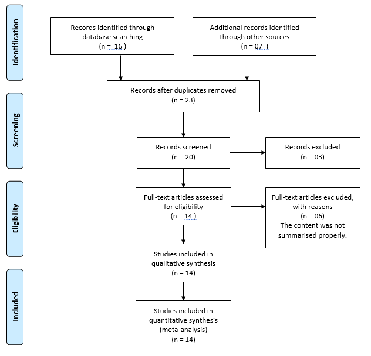
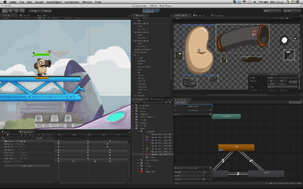
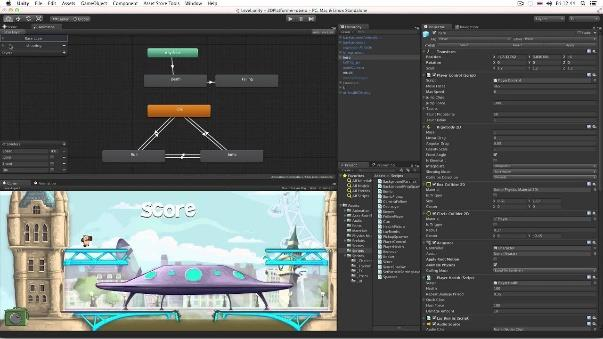
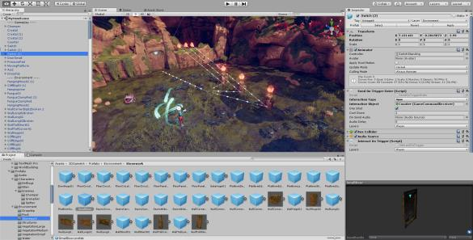
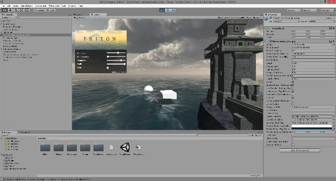
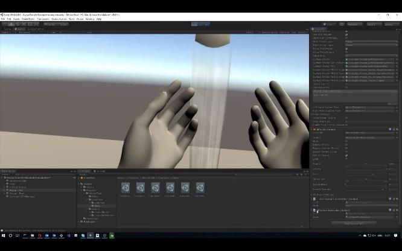
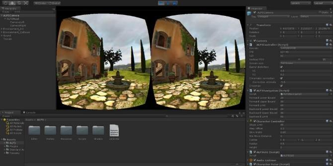
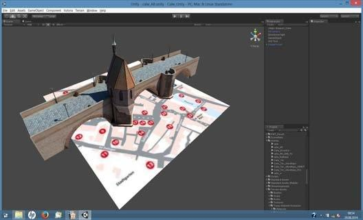
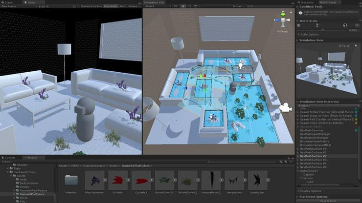

(c
University of Sindh Journal of Information and Communication Technology
(USJICT)
Volume 4, Issue 2, July 2020
ISSN-E: 2523-1235, ISSN-P: 2521-5582 © Published by University of Sindh, Jamshoro
Website: http://sujo.usindh.edu.pk/index.php/USJICT/
Unity Game Development Engine: A Technical Survey
Afzal Hussain1, Haad Shakeel1, Faizan Hussain1, Nasir Uddin1, and Turab Latif Ghouri1
1Department of Computer Science, Faculty of Engineering Science and Technology (FEST),
Hamdard University Karachi, Pakistan
afzal.hussain@hamdard.edu.pk, haadshakeel140@gmail.com, faizanhussain535@outlook.com, nsrkh5585@gmail.com,
and turabghori@gmail.com
Abstract: Paper aims to develop relevant understanding and knowledge about the Unity game development engine
for the better conception of the people allied with the IT sector. The main audience targeted in this paper are those
who are from a non-technical and technical background and due to the augmentation of technology, they want to
pursue their careers in game development. Moreover, in this paper, qualitative research methods have been adopted.
It is found that Unity is a smart and active game development platform that is playing an operative role nowadays.
Different industries are inspired by Unity that may impact positively such as in career growth, job opportunities,
and in other regards. Unity comes with many benefits; it is an easy and simple platform to learn game development
and is a powerful tool that is preferred by professionals.
Keywords: Unity, Information Technology, Benefits, Game Development, and Challenges.
I. INTRODUCTION B. Research Paper Objectives
Unity has been developed under the umbrella of Unity- 1. To examine the benefits of Unity game development
Technologies that is a cross-platform game engine released engine.
in 2005 June at World Wide Apple Inc’s Conference as an 2. To inspect the challenges that may emerge in Unity.
exclusive game engine (Mac OS X). In 2018, the engine was 3. To outline the best approaches of Unity for enhancing
extended and facilitated more than 20 platforms. This game the skills of Unity developers
engine can be used to develop the augmented reality, virtual
C. Research Paper Questions
reality, two-dimensional, and three-dimensional, games
1. What are the benefits of Unity game development
along with simulations and for other practices. This game
engine?
engine in the 21st Century has been adopted by businesses
2. To what extent the challenges of Unity affect the people
outside video gaming like film, architecture, automotive,
working in the game development domain?
construction, and engineering [1]. This paper is presenting
3. What are the best approaches to Unity skills for
survey on the Unity as in the current epoch amid the IT
enhancing the skills of Unity developers?
(Information Technology) sector the surge of gaming and its
development has emerged enormously; however, Unity is D. Research Paper Layout
playing actively in game development and thus, the
To achieve the aim and objectives the research paper has
researchers of this paper deem that there must be some
been segregated into five sections. Section 1 covers the
comprehensive survey that supports the people working in IT
introduction, section 2 comprised of the literature review,
sector to connect with the benefits, challenges, and
section 3 depicts the methods and material adopt to conduct
appropriate solutions of those challenges that emerged in the
the study, section 4 covers the discussion. Section 5 covers
Unity. This ultimately helps the readers and the people allied
the conclusion and future recommendations.
with the IT sector in the development of relevant knowledge
and understanding of Unity. II. LITERATURE REVIEW
A. Research Paper Aim In this section of the proposed paper, the literature review
has been conducted. The documentation of relevant works
To develop relevant understanding and knowledge about
and examination of the collected sources fundamentally is
Unity for the better comprehension of the people allied with
demonstrated in Fig 1. Moreover, Fig 1 is constructed with
the IT sector. To attain the aim, three objectives and questions
the help of a technique named as PRISMA, depicted below.
are developed that are depicted below.
Therefore, the literature review has been considered as one of
the vital aspects of the research paper as its supports authors
as well the readers in understanding and examining several

University of Sindh Journal of Information and Communication Technology (USJICT) Vol.4(2), pg.: 73-81
facets that the relevant to the current topic and are conducted less consumption of time. Unity takes Box2D advantage the
previously. novel DOTS-based NVIDIA PhysX and Physics system that
aids in the provision of high-performance and high realistic
gameplay. Developers can extend the Editor of Unity with
tools need to match the workflow of teams. It also supports
the creation and customizing of the extensions that feature
many possessions, extensions, and tools for the sake of
speediness of the projects [29].
According to [2] one of the feature highlights of this
discharge for Android is the accessibility of a seen form of
Adaptive Performance for Samsung Galaxy leads. In contrast
to PC and consoles, gaming on cell phones characteristically
impediment of warmth the board and power utilization.
Lovely looking and smooth-messing around have escalated
handling needs, which can rapidly warm up your gadget. PC
and consoles handle this issue through their dynamic cooling
frameworks, yet since telephones don't include dynamic
cooling equipment (yet), the telephone winds up throttling
execution to hold the temperature within proper limits. The
issue turns out to be much progressively risky considering the
wide scope of equipment accessible, and the shifting
execution and throttling situations. In addition, some of the
key features of unity are related to the simple workflow that
allows developers to quickly combine scenes in a workspace
referred to as (intuitive editor). It also supports creating high-
Figure 1. PRISMA Chart quality games like AAA images, high definition sound, and
action at full speed with no gaps on the screen [32]. Also,
Unity, a multi-platform game engine, commercially
some extra features are [33] access the components, coroutine
available and is used for 2d and 3D video games production
and return types, creating and destroying GameObjects,
accompanied by visualizations and non-game interactive
dealing with vector variables and timing variables, events for
simulations. Moreover, Unity is one of the popular engines
GameObject, and physics-oriented events. Primarily, Unity
for games that is easily accessible, and in the current epoch is
supports scripting in C#, and there are two ways to design C#
communal amid the developers due to its ease, flexibility,
scripts in Unity: object-oriented design, which is the more
efficiency, and power consumption. Multiple tools have been
traditional and widely used approach, and data-oriented
featured in the Unity Editor that permits rapid iteration and
design, which is now possible in Unity [34].
editing in the cycles of development comprised of smart
Moreover, according to [1] game designers handle this
previews play mode in real-time [2]. Furthermore, Unity is
issue through two fundamental methodologies: guaranteeing
offered on Mac, Linux, and Windows it contains an artist-
the most extreme similarity by giving up realistic loyalty and
friendly range of tools for immersive designing and game
casing rate, or by foreseeing equipment conduct, which is
worlds, in addition to a strong developer tools suite for
hard to execute. Solidarity and Samsung have teamed up for
implementing high-performance gameplay and game logic
a component called "Versatile Performance", which gives a
[3]. Moreover, Unity supports 3D and 2D development with
superior method to oversee thermals and execution of games
functionalities and features for the specific needs that are
continuously. After you introduce Adaptive Performance
further focused on categories.
through the Unity Package Manager, Unity will consequently
Similarly, [4] has quoted that the navigation system has
add the Samsung GameSDK subsystem to your undertaking.
also been included in Unity that permits to create NPCs that
During runtime and on upheld gadgets [7]. Unity will make
logically move around the world of gaming [28]. navigation
and begin an Adaptive Performance Manager which will give
meshes have been used in the system that is automatically
criticism about the warm condition of the gadget [30].
created from the scene geometry, or sometimes even from the
Engineers would then be able to decide to buy into
dynamic obstacles, to change the character's navigation at
occasions or inquiry the data from the Adaptive Performance
runtime. Unity Prefabs that are known as the pre-configured
Manager during runtime to make responses progressively
objects of gaming provide the workflow flexibility and
concerning warm patterns. For example, when the gadget
efficiency that permit in the confident working without
started throttling in the beginning periods, the game could
nerve-wracking about the time-consuming errors [5].
tune quality settings, target outline rate, and different
According to [6] it has been found that Unity built-in UI
parameters to guarantee that the game can squeeze out
system permits to create the UI intuitively and smartly with
increasingly continued execution. When the temperature
74

University of Sindh Journal of Information and Communication Technology (USJICT) Vol.4(2), pg.: 73-81
begins declining once more, parameters could be changed by
and by to convey better ongoing interaction execution. By
watching out for the warm presentation, one can abstain from
throttling all together by modifying execution dependent on
constant criticism. This will prompt a gradual unsurprising
edge rate and interactivity experience and lower warm
buildup [1, 2, 8].
Therefore, based on the studies examined in the literature
review, a conceptual framework is formulated exposed below
(See Fig 2). Hence, this supports the readers in analysing the
gap that may have a reflection on delineating the concept of
the proposed paper.
75
D
2 D G
e v e lo
ap mm ee
n t
G
a
U n ity
a m e D e ve lo p m e n t
E n g in e
M u lti-P la tfo rm
G a m e
E n g in e
P rim e F e a tu re
E ffe ctiv e U I/U X
(U se r E xp e rie n ce
n d U se r In te rfa ce )
E ffe ctiv e a n d
In te ra ctiv e
D e v e lo p m e n t o f
G a m e s
H ig h U se r
S atisfa ctio n
D
3 D G
e v e lo
ap mm ee
n t
game development mainly journals and proceedings of
conferences. To make this process more effective researchers
have set some restrictions. For example, the data is only
gathered from 2008-2020 via using several keywords like
Unity, Challenges, Benefits, Information Technology, and
Game Development from reliable databases like Google
Scholar, Academia, IEEE Xplore, Scopus, ProQuest, and
Research Gate. An inductive research approach along with
the interpretivism research philosophy has been adopted for
the demonstration of the insights and vital facets passably.
Therefore, the discussion and analysis have been conducted
through a content analysis technique in which relevant
themes in accord with the research objectives are formulated
to achieve the research paper aim and objectives [9,10, 11].
Therefore, the above-mentioned aspects of the methodology
are further supported by SLR (System or Systematic
Literature Review). SLR method aims towards identifying,
evaluating, and summarizing the state-of-the-art on a specific
topic. SLR permits for the restrictive compilation of
databases and enable analysis with less bias than traditional
reviews [31]. Hence, there are five stages of SLR such as the
construction of a question for the review; the documentation
of relevant works; examination of the collected sources;
synthesis of data and summarizing; and lastly, interpretation
of the findings. Hence, see Fig 3 for a clear demonstration of
SLR steps.
SLR Steps and
Proposed Paper
Construction of a
Formulated in
question for the Introduction
review (3 Research Objectives)
The Demonstrated in
documentation of Literature Review
PRISMA relevant works Diagram
Examination of
the collected Conducted in
Literature Review
sources
Figure 2. Conceptual Framework
Synthesis of data Conducted in
and summarizing Discussion and Analysis
III. METHODOLOGY
Qualitative research methodology has been adopted in this
paper in which the data is gathered from already available
Interpretation of Demonstrated in
researches available in the form of peer-reviewed journals, Conclusion and
the findings
articles, books, and other sources. The collection of data has Recommendation
been done with the help of a secondary search strategy that
has been done in the form of examining and analysing the
Figure 3. SLR Steps and Proposed Paper
studies that are conducted previously aimed towards Unity

University of Sindh Journal of Information and Communication Technology (USJICT) Vol.4(2), pg.: 73-81

| TABLE I.   | SCENARIOS, UNITY GAME AND ENGINE AND ANALYSIS  |     |     |
| ---------- | ---------------------------------------------- | --- | --- |
IV.  DISCUSSION
[2,5,9,11, 27]
In this section, based on the research objectives discussion
Comparative analysis
and analysis have been conducted. Relevant themes have  The scenario of Game  Solution through Unity
with different games
been formulated that ultimately support in discussing the  Design  game engine  engines
Maximum visual quality
research objectives properly and also aids in achieving the
| Create a 3D  | for the display in the  |     |     |
| ------------ | ----------------------- | --- | --- |
research paper aim.   environment that  real world that is  Less graphic quality
| reconciles visual  | shadow and light,  |     | structures (VRML,  |
| ------------------ | ------------------ | --- | ------------------ |
A. To Examine The Benefits Of Unity Game Development
| quality with game  | texture map, alpha    |     | Flash-based)  |
| ------------------ | --------------------- | --- | ------------- |
| performance        | channel, independent  |     |               |
Engine
animation time
With reference to [8], it is found that Unity 3D comes  High degree of the
navigation system
with several benefits that are not highlighted passable and, on
| Create navigation  |     |     | (Bentley-3D PDF), less  |
| ------------------ | --- | --- | ----------------------- |
such facet, the researchers of this paper deem that this aspect  system of which  Permit maximum  flexible freedom of
freedom degree to
| permits the user to  |     |     | movement (QuickTime  |
| -------------------- | --- | --- | -------------------- |
must be disclosed. Unity aids in processing, asset tracking,  navigate and explore in
| discover maximum  | the virtual environment  |     | VR) view direction, and  |
| ----------------- | ------------------------ | --- | ------------------------ |
scripting, and physics are some of Unity's game development  freedom degree   pre-programmed
features that diminish game development costs and time and  animation sequence (3D
animation)
offer elasticity when implementing projects on more than one  Create a navigation
platform. Professionals have stacked the Unity engine at the  system which permits
| end-user to scrutinize a  | Method to augment  |     | High degree navigation  |
| ------------------------- | ------------------ | --- | ----------------------- |
top  of  the  ladder  of  multiplatform  game  development.  system, view direction,
| particular interest  | spatial understanding  |     |     |
| -------------------- | ---------------------- | --- | --- |
According to [12] it is found that this powerful cross-platform  (Bentley-3D PDF)
object in many
perspectives way
game development engine permitted the development of
| Create a method to  |     |     | Require server-based  |
| ------------------- | --- | --- | --------------------- |
game applications for 27 diverse platforms and devices in a  integrate several  Rich content and other  interaction and script
data leaping technique
user-friendly development environment. It bids affluence of  information types   language (Flash-based)
Less supple to
resources like ready-to-use elements, intuitive tools, tutorials,  Create a method for  Method for 3D data  accomplish data
clear documentation, and the online community for creating  flexible 3D data  identical to the external  synchronization (other
amazing free 3D content in games. According to the survey  exchange  tool  animation packages and
Flash-based)
conducted in [13], Unity 3D Engine has a global market share  Create a translate  The basic visual-based  Less flexible (Bentley-
of Game Engine which is around 45%, while 47% of game  conventional analysis  analysis method is  3D, Flash-based, and
| study method   | present  |     | QuickTime VR)  |
| -------------- | -------- | --- | -------------- |
developers prefer Unity as a smart game development tool.
Not possible because of
The  developed  and  implemented  application process  via  Flexibility for the  structural programming
Possible due to object-
| expansion of game  |     |     | (Bentley-3D, Flash- |
| ------------------ | --- | --- | ------------------- |
Unity  can  easily  be  shared  amid  PC,  mobile,  and  web  oriented programming
| design   |     |     | based, 3D animation and  |
| -------- | --- | --- | ------------------------ |
platforms. In addition, it is found from [3] the nature of Unity  QuickTime VR)
has been grounded on the agile methodology that allows
| TABLE II.   | SCENARIOS, UNITY GAME AND ENGINE AND ANALYSIS  |     |     |
| ----------- | ---------------------------------------------- | --- | --- |
constant release and rapid prototyping, which speeds up game
[1,6,11,24,25, 27]
development. Likewise, Unity IDE provides the text editor
for writing the code. However, sometimes developers use a  Engine
|     | Lighting  | Geometries I/O  | Texture Mapping  |
| --- | --------- | --------------- | ---------------- |
Name
separate code editor to avoid confusion. Moreover, the IDE  3D shader
|     | Dynamic shadow  | Built-in editor, any  |     |
| --- | --------------- | --------------------- | --- |
supports C# and JavaScript for scripting and offers important  Unreal  management
|     | and lightening  | data CAD essential  |     |
| --- | --------------- | ------------------- | --- |
functions that are suitable for game development. According  Engine 2  HDR Rendering  to be converted  vegetation
generator.
to [14] it if found that the Unity engine supports high-quality
No built-in editor,
Dynamic shadow
video and audio effects that facilitate game development  Source- and lightening  any data CAD  Optimization for big
| Half-Life 2  |     | essential to be  | open area  |
| ------------ | --- | ---------------- | ---------- |
smartly and effectively. Videos can be adjusted on all devices  HDR Rendering
converted
and screens without compromise or distortion on picture  Built-in libraries
| Gamebryo- | Dynamic lighting  | with the editor, any  | 3D vegetation  |
| --------- | ----------------- | --------------------- | -------------- |
quality. Moreover, new developers need easy-to-understand
| Oblivion  | and shadow  | data CAD essential  | generator  |
| --------- | ----------- | ------------------- | ---------- |
documentation that has been provided by Unity in detail. The  to be converted
thorough documentation contains an explanation of almost  Built-in libraries
|     | Subsidize direct    |                   | The texture map is a  |
| --- | ------------------- | ----------------- | --------------------- |
|     | light to the scene  | with the editor,  | list of 2D UV         |
every single unit. The tweaking and debugging are easier  optimized for
|     | and support in  |     | coordinates assigned  |
| --- | --------------- | --- | --------------------- |
with game development accomplished via Unity remarkably  simple geometry
| Unity  | updating every  | construction, but  | to its vertex  |
| ------ | --------------- | ------------------ | -------------- |
as all the game units and variables are depicted through  frame. directional,  counterparts 3D
also detailed
gameplay that permits the developers to debug the procedure  point and spot are  vertices in three
|     | Realtime  | processing and UV  | dimensions (x, y, z).  |
| --- | --------- | ------------------ | ---------------------- |
recursion
at runtime. The benefits of game development that are easily

available through Unity are depicted in Table 1 and 2 in
Therefore, some of the benefits of Unity in terms of 2D,
which some scenarios have been listed and how through
3D, VR (Virtual Reality), and AR (Augmented Reality) has
Unity such aspects can be attained that comparatively not
been depicted below in Fig 4, 5, 6, and 7.
easy or passably achievable by other platforms.

76

University of Sindh Journal of Information and Communication Technology (USJICT) Vol.4(2), pg.: 73-81
Figure 4. Unity Game Development Engine and 2D-Image Figure 6. Unity Game Development Engine and VR-Image
Figure 5. Unity Game Development Engine and 3D-Image
Figure 7. Unity Game Development Engine and AR-Image
B. To inspect the challenges that may emerge in Unity.
With reference to [15], it is found that Unity 3D offers
many exclusive features that permit developers to develop
diverse mobile games time-effectively. However, the
documentation for some of its functions is out of date and not
available for some functions. Up to Unity 5.0, the game
development engine is designed for 32-bit operation. This
means that the editor may crash wordlessly if a developer is
77

University of Sindh Journal of Information and Communication Technology (USJICT) Vol.4(2), pg.: 73-81
run out of memory. The engine is also not appropriate for the
Scoping and Pre-production
development of AAA games. No new update for OpenGL
support to 4.X has been announced recently. Therefore,
Asset Store and Smart Use
functions like Computer Shader or Geometry Shader for OSX
or Linux are not available. Even the Unity licensed version
Ubiqutous Programming
does not offer all mobile functions. In this case, you will need
a supplementary investment of $1500 to $3000 to operate
Emphasis of the Future: State of Art
your Mobile Pro license. This seems a bit steep. The engine
is graphical upside down. It doesn't offer several other tools
Figure 8. Approaches and Skills [19]
for creating prudent graphics than other game development
engines [16]. In the Unity 5 game development engine, built-
• Scoping and Pre-production; it has been considered as
in support for the PhysX physics engine has some challenges
the most vital aspect of Unity. It is also found from
regarding the performance, and it lacks in some key features
[19] study scoping and pre-production are the two
that need to be added to build the world-class gaming app. most vigorous skills that must be catered and
Similarly, developers must have licensed to get the best considered by the Unity developer in order to be
deployment, graphics, and performance advances. Likewise, successful. A sign of a good Unity developer is being
buying these licenses is expensive. The use of buffer support, able to reliably ship goods, and one of the chief project
rendering, template support, and many other functions killers is feature creep. Moreover, Feature creep has
increases the development costs due to expensive licenses been well-defined by [20] that it occurs when a
[15-16]. developer or any other team member has another great
Additionally, it has been found from the [17-18] study that idea that needs to be almost completely integrated into
the code is more stable in Unity than other engines and has a the game, which often leads to the next or equally great
fantastic architecture that advances the performance of the idea to solve the problem. The most operative way to
game application. Yet, due to source code unavailability, it is evade feature creep is to create a project production
roadmap and plan) pre-production) before starting the
difficult to fix, find, and address performance issues. The
proper development in such facet a developer must
Unity engine influence more memory in accordance with the
have to design and define exactly which functions they
game development that ultimately causes debugging issues
want it in the endgame and what the end product will
and OOM errors in the applications that have been developed
look like in quantifiable terms, for instance, some
under the umbrella of Unity. Simultaneously, in the field of
game characters, special characters, and others.
game application development, organizations rank the Unity
However, this does not mean that things do not change
3D engine for mobile game development on a priority basis
during production, things might get changed in the
or it can also be stated as on the top of the list despite its
development process; nevertheless, it depends on the
several challenges. Unity updated versions have incessantly methodology that is adapted for game development.
advanced the game development engine and fixed the exiting Therefore, in this regard, for instance, to mitigate the
challenges on a passable scale, which can also be considered sudden change in the game development professionals
as one of the reasons behind their upsurge and immense use and experts have set some tips and tricks that are allied
in the domain of game development. Hence, each coin has to testified and validated process that are present as per
two sides; henceforth, even though there are challenges there the methods, guidelines, and approaches and amid
are also benefitting that is supporting the developers to attain some beneficial facets scoping has been considered as
high-quality outcomes. the vital aspects in every development arena whether
it is connected to technical and non-technical. Scoping
C. To Outline the Best Approaches of Unity for enhancing helps in pre-production facet that may occur in the
the skills of Unity developers form of gathering and understanding the needs of the
The role of Unity Developer is comparatively new and end-users and by proper documentation such gathered
tougher to describe than some of its precursors. Some aspects are jotted it down that help in crystalizing and
developers focus the Unity only on the art side whereas some transparency factors which eventually support in the
prefer it for the coding that may help in the process of game mitigation of feature creep and other challenges that
may impact on the overall game development process.
development. Nevertheless, [19] has quoted that somewhere
In addition, it is found from the [21] study that the
amid them there is more to do like building tools to aid out
importance of scoping and pre-production is often
their more exceptionally focused allies. As of this diversity,
rejected by inexperienced teams or those from other
it’s vital to look at the Unity role from an upper level to
industries, but for the game development scoping and
classify the four wide-ranging approaches and skills depicted
pre-production is considered critical for the success of
in Fig 8 that benefit virtually in the context of accomplishing
the projects or products. Pre-production does not have
the high-quality outcomes.
to be a formal or extended process. Just give enough
time to clearly define project goals and by locking it
adequately quality outcomes can be accomplished.
78

University of Sindh Journal of Information and Communication Technology (USJICT) Vol.4(2), pg.: 73-81
Therefore, the researchers deem that a game developer approach has been suggested for both technical and
who is developing the game under the umbrella of non-technical individuals that help in the success
Unity must focus on this approach. It is also advised factor. On the other side, it is found from the [23] study
that give pre-production time as long it requires that that there is a widespread misunderstanding that it
ultimately help in accomplishing the quality outcomes takes a certain kind of mind to understand the
in the end-product. It might seem like a slow process; scriptures. However, solving problems with methods
however, if you are working on a project or product for and variables is itself a creative undertaking. Learning
six months or even two years and have inevitably lost a scripting language and writing your logic is more
track of what you are working on, it is very helpful to than learning a set of rules and thinking in a certain
have a document that helps you adequately throughout way. All it takes is patience and a desire to learn. It is
the process of development as it helps in the mitigation recommended that people interest in the game
of assumption based development. development must work in accordance with the Unity
as it comes with ubiquitous programming that may
• Asset Store and Smart Use; Using the Asset Store is
also help in their career growth as technology currently
often a bad name due to the increasing spread of flip
and in the forthcoming time may play an active role all
asset games that are flooding online sales platforms
over the globe and it is evident that global job market
like Steam. Developers can buy or purchase assets in
will have a big ratio of tech-based jobs. Therefore, for
the Unity Asset Store and use the launched demo
technical and non-technical people it is advised that
scenes as the base for their own game. Even non-
they start learning if they want to advances in the game
developers have noticed that the store and some of its
development arena for this, they may follow some
most popular assets are used to flip. Also, the end-user
script tutorials then challenge yourself to create
is generally unaware of how often legitimate dev.
something unique. Therefore, the more scripts an
successfully uses the asset store. A good example of
individual write, the more they understand [24].
this is Blizzard's online card game Hearthstone, which
uses PlayMaker, a pictorial scripting tool accessible • The emphasis of the future: State of Art; being a Unity
from the Asset Store. Other popular games with developer is exciting with almost all Unity engines that
Playmaker are Inside and The Forest, Hollow Knight. are released. Unity crosses the boundaries of what
In these cases, it can be stated this approach of asset modern game engines can do. Some of these new
store and its smart use has been considered as an active features are still in the progression stage; however,
method that has also been suggested to the Unity they are already in high demand as gaming companies
developer to adopt for better retrieving the services use new technologies to reap the benefits [19]. The
[19]. Therefore, it also ensures the success of high- new main features that Unity developers should
quality outcomes. In addition, the Asset Store is a very address as quickly as possible are depicted in Fig 9.
powerful tool for Unity game developers throughout
the production stages if it is used intelligently. A great
way to imagine the Asset Store is with an up-to-date
resource library that an art studio like Disney needs to
Scriptable Render
support its team. From sound effects to moving Pipelines (and the
HDRP and LWRP
reference films, these tools are used as an early point templates) The Entity Component
System (ECS)
for an artist's creative endeavour. The key to making
good use of the Unity asset store is to look at it as a
way to rebuild the wheel. As long as game developers
make sure that what they have downloaded from the
Unity asset store aimed at setting up the best class in Figure 9. Future and Unity
the project despite adapting the things generally [22].
Scriptable Render Pipelines, it is inspected from [25]
• Ubiquitous Programming; Although Unity may not be
that with the release of Unity 2018.1, end-users were
programmable, there is ultimately no way to create
able to write custom rendering pipes through C#. This
more multifaceted projects. However, you need to
means that developers can now regulate and cope with
know how to code C# and JavaScript as Unity is
how things are carried out to the screen smartly. This
supporting such two-programming language depicted
can be helpful if the project has a dedicated look or
earlier. There are some workplaces but the good news
desires to be optimized highly. They also released two
is that everyone can program easily which makes
templates of rendering pipeline: the HD rendering
Unity as ubiquitous programming platform that means
pipeline for high-end consoles and PCs where graphics
programing for everyone. Fans, artists, old, young,
quality pushed to its limits, and the lightweight
everyone can learn to write C# and JavaScript and can
rendering pipeline for low-end devices like a cell
work on Unity and it is a famous quote that practice
phone and platforms with special requirements like
makes you perfect and if someone had the potential,
virtual reality and a highly polished appearance that
he/she can easily work and gain expertise in Unity
surpasses the old rendering flow. Both templates give
game development easily [19]. However, this
79

University of Sindh Journal of Information and Communication Technology (USJICT) Vol.4(2), pg.: 73-81
access to new features like Shader Graph, a node- amplifying. Thus, it comes with several positive impacts in
based visual system for developing custom shaders. the arena of game development like firming careers, job
This permits artists to get involved in creating opportunities, and upsurging the value of game developers
specialized shaders that reserved for programmers intensively.
exclusively. To recommend, the important thing a Unity developer can
ECS, it is a fundamental change in the way Unity
do is to work on improving their skills continuously. The
projects are developed, particularly in the way things
technology industry is never static, and the work landscape in
are written and scripted. Every developer who has
five years will be very different from what it is today. A top
registered with Unity is familiar with object-oriented
Unity developer is forever a student who learns everything
programming [26]. However, ECS uses data-oriented
about Unity's new features as well as its time-to-time releases
programming. Data-oriented programming is unique
and works eagerly to improve what they already know about
because it offers integrated deep code optimization. If
the engine so they can be prepared as per the current needs,
it can be run, it is fully optimized. This approach of
wants and demands that also support in the career growth.
Unity that has been based on the current tech-based
trends permits Unity projects written with the ECS to Even though Unity has certain limitations, its advantages
push the boundaries, as newly revealed in Unite LA outweigh its disadvantages. As such, it is undoubtedly an
Prime 2018 [19]. Unity's development plans with a effective podium for creating games. To choose a powerful
roadmap for public access are fairly open and often tool that gives great features is obligatory to develop an
reveal new features long before they are fully adequate game that is available via Unity. Unity 3D is also
published in the editor. It is good practice for Unity easy to learn and use as discussed in this paper. It offers a
developers to check the YouTube channel, official very cheap pricing solution to meet the developer’s needs. A
blog, and roadmap itself regularly. While gaming has free version of Unity offers most of the functions. Though, if
been the main focus of Unity, more industries are developers need advanced features that can always use the
paying attention to what the Unity engine can do. paid version.
Therefore, it can be stated that connecting with the
Unity under the best practices and approaches is REFERENCES
considered as the great opportunity for developers
[1] Juliani, Arthur, Vincent-Pierre Berges, Esh Vckay, Yuan Gao, Hunter
looking to expand their careers in the future, as Unity Henry, Marwan Mattar, and Danny Lange. "Unity: A general platform
developers have more job opportunities than ever for intelligent agents." arXiv preprint arXiv:1809.02627 (2018).
before that is evidentially and scientifically discussed [2] Haas, John K. "A history of the unity game engine." (2014).
in this paper under the qualitative research. [3] Canossa, Alessandro. "Interview with nicholas francis and thomas
hagen from unity technologies." In-Game Analytics, pp. 137-142.
V. CONCLUSION AND FUTURE RECOMMENDATIONS Springer, London, 2013.
[4] Becker-Asano, Christian, Felix Ruzzoli, Christoph Hölscher, and
To conclude, the paper aims was to develop relevant
Bernhard Nebel. "A multi-agent system based on unity 4 for virtual
understanding and knowledge about Unity for the better perception and wayfinding." Transportation Research Procedia 2
comprehension of the people allied with the IT sector. To (2014): 452-455.
achieve the aim, three objectives are designed such as, to [5] Goldstone, Will. Unity 3. x game development essentials. Packt
examine the benefits of Unity, to inspect the challenges that Publishing Ltd, 2011.
may emerge in the Unity, and to outline the best approaches [6] Patil, Pratik P., and Ronald Alvares. "Cross-platform Application
Development using Unity Game Engine." Int. J 3, no. 4 (2015).
of Unity for enhancing the skills of Unity developers. Based
[7] Zioma, Renaldas, and Aras Pranckevičius. "Unity: iOS and Android:
on the three objectives, three questions are also formulated
cross-platform challenges and solutions." In ACM SIGGRAPH 2012
such as; What are the benefits of Unity? To what extent the Mobile, pp. 1-1. 2012.
challenges of Unity affect the people working in the game [8] Kim, Sung Lee, Hae Jung Suk, Jeong Hwa Kang, Jun Mo Jung, Teemu
development domain? What are the best approaches to Unity H. Laine, and Joonas Westlin. "Using Unity 3D to facilitate mobile
augmented reality game development." In 2014 IEEE World Forum on
skills for enhancing the skills of Unity developers?
the Internet of Things (WF-IoT), pp. 21-26. IEEE, 2014.
The method that has been used throughout the paper is
[9] Silverman, David, ed. Qualitative research. Sage, 2016.
qualitative research that is further backed up by secondary
[10] Burney, Aqil. "Inductive and deductive research
data. Moreover, the method and search strategy are connected approach." Department of Computer Science, University of Karachi,
with inductive research approach, and interpretivism research Pakistan (2008): 22.
philosophy for the achievement of insights and discussing it [11] Ryan, Gemma. "Introduction to positivism, interpretivism and critical
smartly that helps in developing the relevant understanding theory." Nurse researcher 25, no. 4 (2018): 41-49.
and knowledge of the readers. The content analysis technique [12] Craighead, Jeff, Jennifer Burke, and Robin Murphy. "Using the unity
game engine to develop sarge: a case study." In Proceedings of the
has been used to analyze the data that has been done via
2008 Simulation Workshop at the International Conference on
thematic analysis. Therefore, it is found that Unity has been Intelligent Robots and Systems (IROS 2008). 2008.
playing an active role in the arena of game development, and [13] Blackman, Sue. Beginning 3D Game Development with Unity 4: All-
with the passage of time and effectiveness and efficiency as in-one, multi-platform game development. Apress, 2013.
well as the usage and devotion of industries to Unity is [14] Thorn, Alan. Learn unity for 2d game development. Apress, 2013.
80

University of Sindh Journal of Information and Communication Technology (USJICT) Vol.4(2), pg.: 73-81
[15] 11 Pros & Cons to Know Before Choosing Unity 3D - Robotics, Automation and Mechatronics (RAM), pp. 463-468. IEEE,
GreatSoftLine.com", GreatSoftLine.com, 2020. [Online]. Available: 2019.
https://www.greatsoftline.com/11-pros-cons-to-know-before-
choosing-unity-3d/. [Accessed: 25- May- 2020].
[16] 5 Rarely Known Advantages And Disadvantages Of Unity Game
Development | Potenza Global
Solutions", Potenzaglobalsolutions.com, 2020. [Online]. Available:
https://www.potenzaglobalsolutions.com/blogs/5-rarely-known-
advantages-and-disadvantages-of-unity-game-development.
[Accessed: 25- May- 2020].
[17] Buyuksalih, Ismail, Serdar Bayburt, Gurcan Buyuksalih, A. P.
Baskaraca, Hairi Karim, and Alias Abdul Rahman. "3D Modelling and
Visualization Based on the Unity Game Engine–Advantages and
Challenges." ISPRS Annals of the Photogrammetry, Remote Sensing
and Spatial Information Sciences 4 (2017): 161.
[18] Doran, John P. Unity Game Development Blueprints. Packt Publishing
Ltd, 2014.
[19] 4 essential skills for Unity developers", Pluralsight.com, 2020.
[Online]. Available: https://www.pluralsight.com/blog/software-
development/4-skills-unity-devs. [Accessed: 25- May- 2020].
[20] Shukla, Sakshi, Rayan Dutta, and Rudrani Mishra. "GAME
DEVELOPMENT: PROBLEMS."
[21] Jensen, Bjarne Fisker, and Jacob Boesen Madsen. "CameraTool:
Pipeline Optimization for Camera Setup in the Unity Game Engine."
(2011).
[22] Kim, AeHyun, and JaeHwan Bae. "Development of mobile game using
multiplatform (Unity3D) game engine." International Journal of
Intelligent Information Processing 5, no. 1 (2014): 29.
[23] Bond, J. G. (2014). Introduction to Game Design, Prototyping, and
Development: From Concept to Playable Game with Unity and C.
Addison-Wesley Professional.
[24] Oak, Ji Won, and Jae Hwan Bae. "Development of smart multiplatform
game app using UNITY3D engine for CPR education." International
Journal of Multimedia and Ubiquitous Engineering 9, no. 7 (2014):
263-268.
[25] Messaoudi, Farouk, Gwendal Simon, and Adlen Ksentini. "Dissecting
games engines: The case of Unity3D." In 2015 international workshop
on network and systems support for games (NetGames), pp. 1-6. IEEE,
2015.
[26] Raffaillac, Thibault, and Stéphane Huot. "Polyphony: Programming
Interfaces and Interactions with the Entity-Component-System
Model." Proceedings of the ACM on Human-Computer Interaction 3,
no. EICS (2019): 1-22.
[27] Indraprastha, Aswin, and Michihiko Shinozaki. "The investigation on
using Unity3D game engine in the urban design study." Journal of ICT
Research and Applications 3, no. 1 (2009): 1-18.
[28] Nurym, Nurdaulet, Raushan Sambetova, Muhit Azybaev, and Nurassyl
Kerimbayev. "Virtual Reality and Using the Unity 3D Platform for
Android Games." In 2020 IEEE 10th International Conference on
Intelligent Systems (IS), pp. 539-544. IEEE, 2020.
[29] Sung, Kelvin, and Gregory Smith. Basic Math for Game Development
with Unity 3D. Apress, 2019.
[30] Wenar, Leif. "The Development of Unity." Journal of Human
Development and Capabilities 21, no. 3 (2020): 211-222.
[31] Kraus, Sascha, Matthias Breier, and Sonia Dasí-Rodríguez. "The art of
crafting a systematic literature review in entrepreneurship research."
International Entrepreneurship and Management Journal (2020): 1-20.
[32] Andrade, António. "Game engines: a survey." EAI Endorsed
Transactions on Serious Games 2, no. 6 (2015).
[33] Borg, Markus, Vahid Garousi, Anas Mahmoud, Thomas Olsson, and
Oskar Stalberg. "Video Game Development in a Rush: A Survey of the
Global Game Jam Participants." IEEE Transactions on Games (2019).
[34] Malete, Thabo N., Kabo Moruti, Tsaone Swaabow Thapelo, and
Rodrigo S. Jamisola. "EEG-based Control of a 3D Game Using 14-
channel Emotiv Epoc+." In 2019 IEEE International Conference on
Cybernetics and Intelligent Systems (CIS) and IEEE Conference on
81

## Extracted Images

### Page 1

### Page 2

### Page 5

### Page 6

### Page 7

